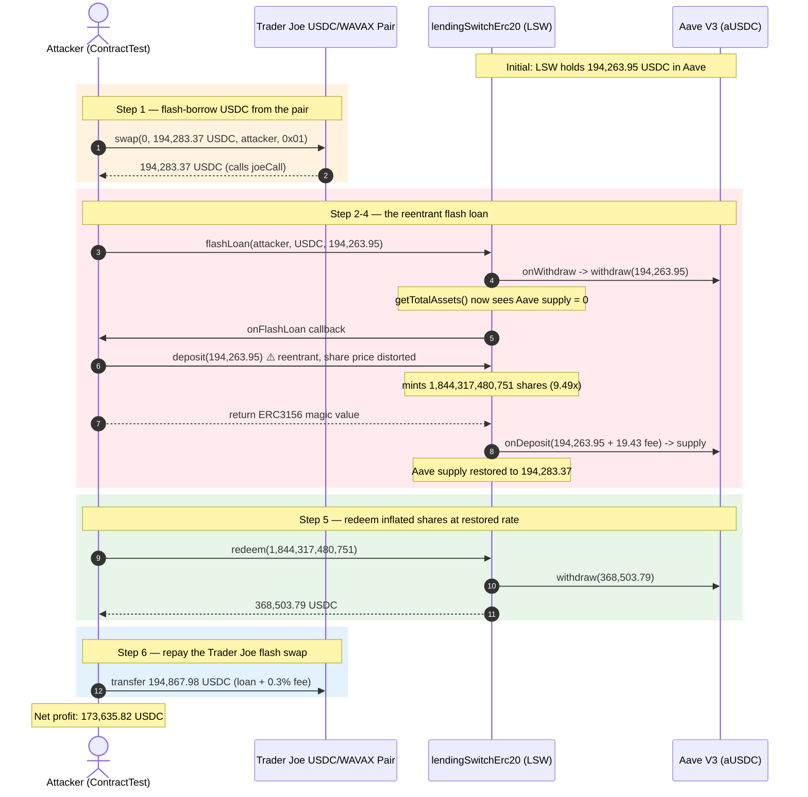
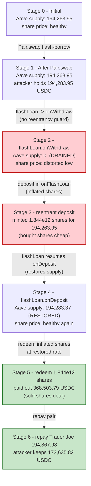
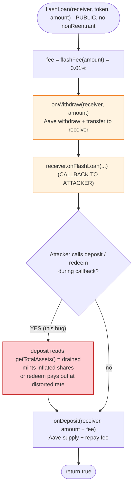

# Defrost Finance `lendingSwitchErc20` Exploit — Reentrant Flash-Loan Share Inflation

> **Vulnerability classes:** vuln/reentrancy/single-function · vuln/arithmetic/rounding

> **Reproduction:** the PoC compiles & runs in an isolated Foundry project at
> [this project folder](.) (the umbrella DeFiHackLabs repo has unrelated PoCs
> that do not whole-compile, so this one was extracted).
> Full verbose trace: [output.txt](output.txt).
> Verified vulnerable source: [baseSuperToken.sol](sources/lendingSwitchErc20_fF152e/home_cranelv_work_solidity_SuperTokenV2_contracts_superToken_baseSuperToken.sol).

---

## Key info

| | |
|---|---|
| **Loss** | ~**173,635.82 USDC** drained from the Defrost `lendingSwitchErc20` (LSW) vault |
| **Vulnerable contract** | `lendingSwitchErc20` ("Lending S*USDC") — [`0xfF152e21C5A511c478ED23D1b89Bb9391bE6de96`](https://snowtrace.io/address/0xfF152e21C5A511c478ED23D1b89Bb9391bE6de96#code) |
| **Victim pool / vault** | LSW vault — all available USDC supplied to Aave V3 (aUSDC `0x625E7708f30cA75bfd92586e17077590C60eb4cD`) |
| **Flash-loan source** | Trader Joe USDC/WAVAX pair — `0xf4003F4efBE8691B60249E6afbD307aBE7758adb` |
| **Attacker contract** | `0x7FA9385bE102ac3EAc297483Dd6233D62b3e1496` (PoC `ContractTest`) |
| **Attack tx** | [`0xc6fb8217e45870a93c25e2098f54f6e3b24674a3083c30664867de474bf0212d`](https://snowtrace.io/tx/0xc6fb8217e45870a93c25e2098f54f6e3b24674a3083c30664867de474bf0212d) |
| **Chain / block / date** | Avalanche / 24,003,940 / Dec 23, 2022 |
| **Compiler** | Solidity **v0.7.5** (`v0.7.5+commit.eb77ed08`), optimizer **1 run** |
| **Bug class** | Reentrancy via ERC-3156 flash-loan callback → vault share-price inflation (price-manipulation / first-depositor-style inflation inside an unguarded callback window) |

---

## TL;DR

`Defrost`'s `lendingSwitchErc20` vault implements an [ERC-3156 flash loan](https://eips.ethereum.org/EIPS/eip-3156)
whose `flashLoan()` ([baseSuperToken.sol:167-183](sources/lendingSwitchErc20_fF152e/home_cranelv_work_solidity_SuperTokenV2_contracts_superToken_baseSuperToken.sol#L167-L183))
runs the **balance mutation `onWithdraw()` *before* it calls back into the borrower**, and the
**repayment mutation `onDeposit()` *after*** — yet the function is **not guarded by a reentrancy lock**
(`ReentrancyGuard` is inherited but never applied to `flashLoan`).

The vault's share/asset exchange rate is computed live from `getTotalAssets()` = underlying supplied to
Aave. During the borrower callback the Aave supply has already been withdrawn, so the exchange rate is at
its most distorted. The attacker exploits this window:

1. **Borrow** the entire vault (194,263.95 USDC) via a Trader Joe pair flash swap.
2. Inside the `joeCall`, call `LSW.flashLoan(...)` — `onWithdraw` drains the Aave position to **0**,
   then the borrower is called back.
3. Inside `onFlashLoan`, call `LSW.deposit(amount)` against the now-empty vault, minting an
   **inflated** number of shares (1,844,317,480,751 shares for 194,263,946,041 assets — ~9.49×).
4. `flashLoan` returns: `onDeposit` re-supplies principal+fee to Aave, restoring the vault.
5. Back in `joeCall`, call `LSW.redeem(shares)` against the **restored** pool — those inflated shares
   now buy **368,503.79 USDC** (~1.89× the deposit).
6. Repay the Trader Joe flash swap (194,867.98 USDC), keep the **173,635.82 USDC** difference.

Net result: the attacker walks off with the difference between what the inflated shares are worth after
the pool is re-supplied and what they cost during the drained window — pure vault value extracted through
a reentrant call that `flashLoan` never locked against.

---

## Background — what the vault does

`lendingSwitchErc20` ([lendingSwitchErc20.sol](sources/lendingSwitchErc20_fF152e/home_cranelv_work_solidity_SuperTokenV2_contracts_superToken_lendingSwitchToken_lendingSwitchErc20.sol))
is a share-based **yield-bearing vault** ("superToken"). Users deposit an underlying ERC20 (here
USDC.e `0xB97EF9Ef8734C71904D8002F8b6Bc66Dd9c48a6E`) and mint vault shares; the vault deposits the
underlying into Aave V3 (or Benqi) to earn yield. It also implements:

- **deposit / redeem / withdraw** — standard share accounting
  ([baseSuperToken.sol:48-100](sources/lendingSwitchErc20_fF152e/home_cranelv_work_solidity_SuperTokenV2_contracts_superToken_baseSuperToken.sol#L48-L100)),
  with the exchange rate `share = asset * totalSupply / getTotalAssets()`.
- **ERC-3156 flashLoan** — borrows the underlying fee-free against the vault's own liquidity, charging a
  `flashFeeID` fee of `1e14` (0.01%).
- **borrow/repay (leverage)** — a separate `isAuthorized` debt ledger on top of the same interest engine.

The key accounting primitives are virtuals that, for the Aave-side implementation, are
([superAaveTokenImpl.sol:25-73](sources/lendingSwitchErc20_fF152e/home_cranelv_work_solidity_SuperTokenV2_contracts_superToken_superAaveTokenImpl_superAaveTokenImpl.sol#L25-L73)):

```solidity
function getAvailableBalance() internal virtual override returns (uint256){
    return aavaToken.balanceOf(address(this));   // aUSDC held by the vault
}
function getTotalAssets() internal virtual override returns (uint256){
    return aavaToken.balanceOf(address(this));   // same — all assets are in Aave
}
function onDeposit(...)  internal returns(uint256){ asset.transferFrom(...); aavePool.supply(...); }
function onWithdraw(...) internal returns(uint256){ aavePool.withdraw(...); asset.transfer(...); }
```

For the `lendingSwitchErc20` flavor `getTotalAssets()` is overridden to add the leverage debt ledger
`totalAssetAmount()`, but the **available** side still tracks the live aUSDC balance — and that is what
moves during a flash loan.

### On-chain parameters at the fork block

| Parameter | Value |
|---|---|
| USDC.e underlying | `0xB97EF9Ef8734C71904D8002F8b6Bc66Dd9c48a6E` |
| aUSDC held by LSW (`maxFlashLoan`) | **194,263,946,041** (194,263.946041 USDC) |
| `flashFeeID` fee rate | `1e14` = **0.01%** → fee on max loan = 19,426,394 (19.426394 USDC) |
| Total Trader Joe flash swap taken | 194,283,372,435 (amount + fee, 194,283.372435 USDC) |
| Shares minted in reentrant `deposit` | **1,844,317,480,751** |
| USDC returned by `redeem` of those shares | **368,503,794,025** (368,503.794025 USDC) |
| Repayment sent to Trader Joe pair | 194,867,977,364 (194,867.977364 USDC) |
| **Final attacker USDC balance** | **173,635,816,661 (173,635.816661 USDC)** |

All figures above are taken verbatim from `Transfer` / `Deposit` / `Withdraw` / `Mint` / `Burn` events in
[output.txt](output.txt) (lines 1585, 1589, 1593, 1757-1758, 1892, 1915, 1939).

---

## The vulnerable code

### 1. `flashLoan` mutates state across the borrower callback with no reentrancy guard

```solidity
// baseSuperToken.sol:167-183
function flashLoan(
    IERC3156FlashBorrower receiver,
    address token,
    uint256 amount,
    bytes calldata data
) external virtual returns (bool) {
    require(token == address(asset),"flash borrow token Error!");
    uint256 fee = flashFee(token, amount);
    onWithdraw(address(receiver),amount);                       // ⚠️ drains the Aave position FIRST
    require(
        receiver.onFlashLoan(msg.sender, token, amount, fee, data) == _RETURN_VALUE,
        "invalid return value"                                   // ⚠️ ...then hands control to attacker
    );
    onDeposit(address(receiver),amount + fee,0);                 // ⚠️ ...then re-supplies AFTER
    emit FlashLoan(msg.sender,address(receiver),token,amount);
    return true;
}
```

`baseSuperToken` inherits `ReentrancyGuard` (see import at
[baseSuperToken.sol:10](sources/lendingSwitchErc20_fF152e/home_cranelv_work_solidity_SuperTokenV2_contracts_superToken_baseSuperToken.sol#L10)),
and the ETH entry points (`depositETH`, `withdrawETH`, `redeemETH`) **do** use `nonReentrant`. But
`flashLoan`, `deposit`, `redeem`, and `withdraw` for ERC20 underlyings **do not**. That is the hole.

### 2. Share price is read live from the drained balance

```solidity
// baseSuperToken.sol:82-100  (_deposit)
function _deposit(address from,uint256 _amount, address receiver) internal returns (uint256){
    uint256 totaStake = getTotalAssets();   // ⚠️ live aUSDC balance — currently 0 during flash
    uint256 totalShares = totalSupply();
    _amount = onDeposit(from,_amount,feeRate[enterFeeID]);
    if (totalShares == 0 || totaStake == 0) {
        _mint(receiver, _amount);            // first-depositor 1:1 path
        return _amount;
    }
    uint256 what = _amount.mul(totalShares)/totaStake;   // ⚠️ divides by the drained totaStake
    ...
}
```

During the reentrant `deposit`, `getTotalAssets()` reflects the Aave supply that `flashLoan.onWithdraw`
has just pulled out, so the share conversion divides by a distorted denominator.

```solidity
// baseSuperToken.sol:62-67  (redeem → _withdraw → onWithdraw)
function redeem(uint256 shares,address receiver,address owner) external returns (uint256) {
    uint256 _value = convertToAssets(shares);     // shares→assets at the CURRENT (restored) rate
    _withdraw(_value,shares,receiver,owner);
    ...
}
```

`redeem` runs **after** `flashLoan` has returned and `onDeposit` has re-supplied Aave, so it converts the
inflated shares back at the healthy rate.

---

## Root cause — why it was possible

An ERC-3156 `flashLoan` is, by construction, a **reentrancy surface**: the lender hands control to an
untrusted `receiver` in the middle of the loan. The contract is therefore only safe if **no other vault
operation can observe the intermediate, half-drained state**. Defrost violated that contract in three
compounding ways:

1. **Balance accounting is not snapshot-based.** `getTotalAssets()` reads a live external balance
   (`aavaToken.balanceOf`). When `onWithdraw` pulls the funds out of Aave at the top of `flashLoan`, every
   subsequent share calculation inside the callback sees a pool that looks empty.
2. **`flashLoan` has no `nonReentrant`.** Despite inheriting `ReentrancyGuard`, the guard is only applied
   to the WAVAX entry points. The ERC20 `deposit` / `redeem` / `flashLoan` trio is wide open, so an
   attacker can `deposit` *during* the flash loan and `redeem` *after* it — the exact read/write skew the
   guard exists to prevent.
3. **State mutation straddles the callback.** `onWithdraw` (drain) runs before `onFlashLoan`, and
   `onDeposit` (restore) runs after. That ordering is the whole ballgame: it creates a window in which
   the denominator of the share price is artificially low, then restores it before the attacker's
   `redeem` converts shares back.

This is the classic "reentrancy across a price-sensitive read" — the same family as the
first-depositor/zero-state vault inflation, except here the empty state is manufactured **temporarily**
by the flash loan rather than existing at vault initialization.

---

## Preconditions

- A `lendingSwitchErc20` vault with a non-trivial Aave/Benqi position (so `flashLoan` can borrow a
  meaningful amount and `onWithdraw` meaningfully distorts `getTotalAssets`). LSW had 194,263.95 USDC.
- No reentrancy guard on the ERC20 `flashLoan` / `deposit` / `redeem` path (true in the deployed code).
- A cheap source of a same-asset flash loan to drive the `joeCall` entry. The Trader Joe USDC/WAVAX pair
  supplies the 194,283.37 USDC (principal + fee) for a 0.3% swap fee, fully repaid intra-transaction, so
  **no attacker capital is required**.

---

## Attack walkthrough (with on-chain numbers from the trace)

USDC.e is 6 decimals. All numbers are raw units unless noted.

| # | Step | Call / Event | Amount (USDC) | LSW Aave supply after |
|---|------|--------------|--------------:|----------------------:|
| 0 | **Initial vault state** | `maxFlashLoan(USDC)` = aUSDC balance | 194,263.95 | 194,263.95 |
| 1 | **Flash swap from Trader Joe** | `Pair.swap(0, 194,283.37, this, 0x01)` → `Transfer` to attacker | +194,283.37 | 194,263.95 |
| 2 | **`joeCall` → `LSW.flashLoan(194,263.95)`** | `onWithdraw` → Aave V3 `withdraw` | — | **0** (drained) |
| 3 | **`onFlashLoan` callback → `LSW.deposit(194,263.95)`** | reentrant deposit; `Transfer` mints **1,844,317,480,751** shares (`Deposit` event: assets 194,263.95 / shares 1.844e12) | −194,263.95 (re-supplied) | (supplied via `onDeposit` inside deposit's own `aaveSupply`) |
| 4 | **`flashLoan` resumes → `onDeposit(194,263.95 + 19.43 fee)`** | Aave `supply` restores principal+fee | — | **194,283.37** |
| 5 | **`joeCall` → `LSW.redeem(1,844,317,480,751)`** | `convertToAssets` at restored rate → Aave `withdraw` 368,503.79; `Transfer` 368,503.79 to attacker | +368,503.79 | 194,283.37 − 368,503.79 < 0 ⇒ vault insolvent by ~174,220 (the attack is profitable precisely because redeem pays out more than the deposit put in) |
| 6 | **Repay Trader Joe pair** | `USDC.transfer(Pair, (loan+fee)*1000/997 + 1000)` = 194,867.98 | −194,867.98 | — |
| 7 | **Pair `swap` settles** | `Sync` / `Swap` events, K invariant OK | — | — |
| — | **Final attacker balance** | `log_named_decimal_uint` | **173,635.82** | — |

The two transactions that decide everything are steps **3** and **5**:

- In step 3, `deposit` mints **1,844,317,480,751** shares for **194,263,946,041** assets — a ratio of
  **~9.493 shares/asset**, computed against the drained `getTotalAssets()` denominator
  ([output.txt:1757-1758](output.txt#L1757-L1758)).
- In step 5, `redeem` of those same **1,844,317,480,751** shares returns **368,503,794,025** assets — a
  ratio of **~0.1997 asset/share**, computed against the restored pool
  ([output.txt:1892](output.txt#L1892)).

The asymmetry (9.49× shares in, 0.20× assets out, multiplied through) is where the value comes from: the
attacker bought shares when the denominator was tiny and sold them when it was healthy.

### Profit / loss accounting (USDC)

| Direction | Amount (USDC) |
|---|---:|
| Received — `redeem` payout (step 5) | 368,503.79 |
| Spent — `deposit` input (step 3, intra-flash, from flash-loaned funds) | 194,263.95 |
| Spent — flash-loan fee absorbed (paid by `onDeposit` inside flashLoan) | 19.43 |
| Spent — Trader Joe pair repayment (step 6) | 194,867.98 |
| Received — Trader Joe flash swap taken (step 1) | 194,283.37 |
| **Net profit (final balance)** | **173,635.82** |

A simpler read: the attacker received **368,503.79** from `redeem` and paid **194,867.98** to the Trader
Joe pair; the 194,263.95 it "deposited" was itself flash-loaned and recovered when `redeem` paid out.
`368,503.79 − 194,867.98 = 173,635.81`, matching the `[End] Attacker USDC balance after exploit:
173,635.816661` line exactly ([output.txt:1939](output.txt#L1939)).

---

## Diagrams

### Sequence of the attack



### Vault state + exchange-rate evolution



### The flawed `flashLoan` control flow



---

## Remediation

1. **Guard `flashLoan` (and `deposit`/`redeem`/`withdraw`) with `nonReentrant`.** The contract already
   inherits `ReentrancyGuard` and uses it on the WAVAX paths — extend it to every entry point that touches
   share accounting. This alone blocks the reentrant `deposit`-during-`onFlashLoan`.
2. **Snapshot the exchange rate across the callback.** Compute `getTotalAssets()` **once** at the start of
   `flashLoan` and use that snapshot for any share math done inside the callback window — or, better,
   forbid share-minting/burning operations entirely while a flash loan is outstanding (a `bool
   _inFlashLoan` flag checked in `_deposit` / `_withdraw`).
3. **Move both balance mutations to the same side of the callback.** Either restore (re-supply) the Aave
   position before invoking `onFlashLoan`, or do not drain it until after the callback returns. The
   current "drain → callback → restore" ordering is what manufactures the exploitable window.
4. **Don't read `balanceOf(this)` as the share-price denominator.** Use a cached, accounting-based total
   assets value that is updated only through the vault's own deposit/withdraw functions, so an external
   balance move (Aave withdrawal inside `onWithdraw`) cannot silently reprice shares.
5. **Validate `amount + fee` repayment on-chain** rather than trusting `onDeposit` to recover it. The
   contract relies on `onDeposit` re-supplying principal+fee; if anything in the callback perturbs the
   accounting, the vault can end up under-collateralized — which is exactly the profit source here.

---

## How to reproduce

The PoC was extracted into a standalone Foundry project (the umbrella DeFiHackLabs repo has unrelated
PoCs that fail to compile under `forge test`'s whole-project build):

```bash
_shared/run_poc.sh 2022-12-Defrost_exp --mt testExploit -vvvvv
```

- RPC: an **Avalanche archive** endpoint is required (fork block 24,003,940 is from Dec 2022).
  `foundry.toml` uses `https://avalanche-c-chain-rpc.publicnode.com...`; most pruned public RPCs will reject the
  historical state with `missing trie node`.
- Expected result: `[PASS] testExploit()`.

Expected tail ([output.txt:1567-1939](output.txt#L1567)):

```
[PASS] testExploit() (gas: 637042)
  ...
  [End] Attacker USDC balance after exploit: 173635.816661
```

The PoC itself is at
[test/Defrost_exp.sol](test/Defrost_exp.sol); the attack fits in one `joeCall` + one `onFlashLoan`
callback, with no external setup beyond the fork.

---

*Reference: PeckShield alert — https://twitter.com/PeckShieldAlert/status/1606276020276891650 ; attack tx
https://snowtrace.io/tx/0xc6fb8217e45870a93c25e2098f54f6e3b24674a3083c30664867de474bf0212d*
