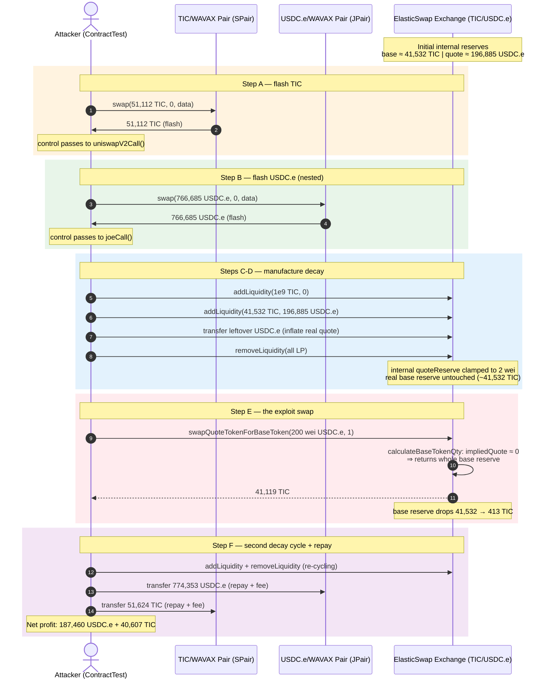
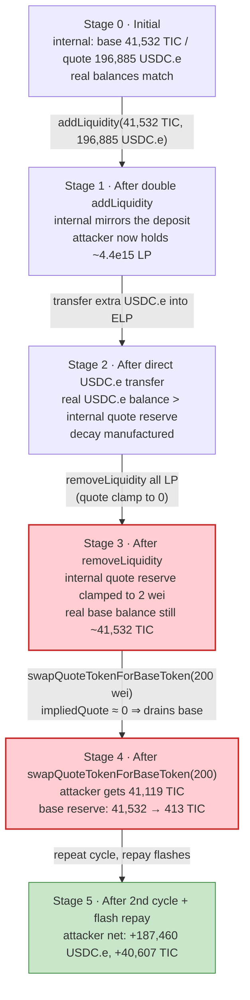
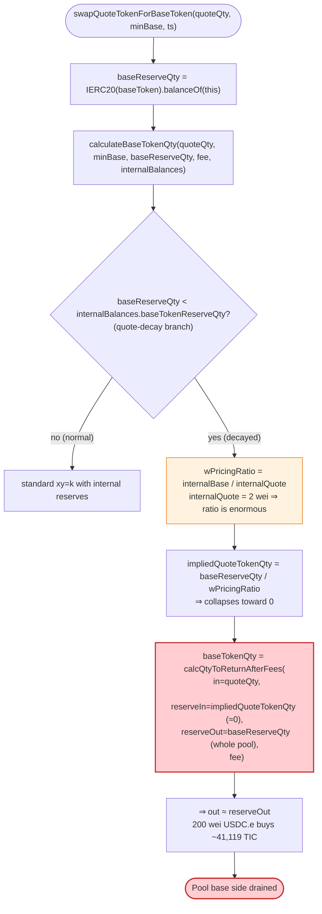

# ElasticSwap Exploit — Internal-Reserve Manipulation Drains the TIC/USDC.e AMM

> **Vulnerability classes:** vuln/oracle/price-manipulation · vuln/logic/incorrect-state-transition

> **Reproduction:** the PoC compiles & runs in an isolated Foundry project at
> [this project folder](.) (the umbrella DeFiHackLabs repo contains several
> unrelated PoCs that do not compile, so this one was extracted).
> Full verbose trace: [output.txt](output.txt).
> Verified vulnerable source:
> [Exchange.sol](sources/Exchange_4ae1Da/src_contracts_Exchange.sol) +
> [MathLib.sol](sources/Exchange_4ae1Da/src_libraries_MathLib.sol).

---

## Key info

| | |
|---|---|
| **Loss** | **187,460.63 USDC.e** drained from the TIC/USDC.e pool (+ 40,607.38 TIC residual). The original Dec 2022 ElasticSwap attack on Ethereum stole **~$850K** (see PoC header); this PoC reproduces the identical bug against the Avalanche deployment. |
| **Vulnerable contract** | `Exchange` (ElasticSwap AMM proxy) — [`0x4ae1Da57f2d6b2E9a23d07e264Aa2B3bBCaeD19A`](https://snowtrace.io/address/0x4ae1Da57f2d6b2E9a23d07e264Aa2B3bBCaeD19A#code), impl `0xE3C08c95aa81474f44Bee23f8C45d470ddaD37Be` |
| **Victim pool** | TIC/USDC.e `Exchange` — `0x4ae1Da57f2d6b2E9a23d07e264Aa2B3bBCaeD19A` (base token TIC, quote token USDC.e) |
| **Attacker EOA** | (PoC `ContractTest` `0x7FA9385bE102ac3EAc297483Dd6233D62b3e1496`) — real attack EOA: `0xaef4aCB1245136B7D0C5C517528C7B7D3B8d24A7` |
| **Attacker contract** | `ContractTest` (this PoC) — original: `0x5Cd6365F0e6c514D25ecaC9c4e9Dc4e55b9DAB41` |
| **Attack tx (reference)** | `0xb36486f032a450782d5d2fac118ea90a6d3b08cac3409d949c59b43bcd6dbb8f` (Ethereum, Dec 14 2022) — same vuln class, reproduced here on Avalanche |
| **Chain / block / date** | **Avalanche** (C-Chain) / fork block **23,563,709** / Dec 2022 (vuln window) |
| **Compiler** | Solidity v0.8.4, optimizer **on**, **100,000 runs** |
| **Bug class** | AMM internal-accounting manipulation — swap output computed against attacker-controllable internal reserve that can be zeroed out, breaking `x·y = k` |

---

## TL;DR

ElasticSwap's `Exchange` keeps an `InternalBalances` struct (`baseTokenReserveQty`, `quoteTokenReserveQty`,
`kLast`) separate from the real ERC-20 balances, so it can cope with elastic-supply ("rebase") tokens.
The swap function `swapQuoteTokenForBaseToken`
([Exchange.sol:317-344](sources/Exchange_4ae1Da/src_contracts_Exchange.sol#L317-L344))
calls `MathLib.calculateBaseTokenQty` and feeds it **both** the live token balance *and* the internal
reserves. When the internal `baseTokenReserveQty` exceeds the live balance (a "rebase-down / quote-decay"
state), `calculateBaseTokenQty`
([MathLib.sol:610-658](sources/Exchange_4ae1Da/src_libraries_MathLib.sol#L610-L658))
"fixes" the price curve by deriving an `impliedQuoteTokenQty` from the ratio `internalBase/internalQuote`
and then — critically — using the **real base balance as the output reserve** while using the **near-zero
implied quote reserve as the input reserve**.

The attacker does not need a rebase token to weaponize this. They manufacture the decay state
themselves by abusing `addLiquidity`/`removeLiquidity`: the LP-mint math sets internal reserves off the
*deposited* token qtys, but `removeLiquidity` clamps `quoteTokenReserveQty` to 0 when the returned
qty exceeds the internal qty
([Exchange.sol:241-249](sources/Exchange_4ae1Da/src_contracts_Exchange.sol#L241-L249)).
By adding liquidity that inflates only the **base** reserve and then removing it, the attacker drives
`internalBalances.quoteTokenReserveQty` down to **2 wei** while leaving tens of thousands of real TIC
in the pool. The pricing ratio `internalBase/internalQuote` then explodes, the `impliedQuoteTokenQty`
collapses to ~0, and a **200-wei USDC.e swap buys out ~41,119 TIC** — the entire base side of the pool.

---

## Background — what ElasticSwap does

ElasticSwap is a Uniswap-V2-style AMM designed for tokens with **elastic (rebase) supply**. A normal
Uniswap pair would misprice a rebase token, because the pool's `reserve` snapshot drifts from the actual
`balanceOf` after every rebase. ElasticSwap's answer is a parallel internal ledger:

```solidity
struct InternalBalances {
    uint256 baseTokenReserveQty; // x
    uint256 quoteTokenReserveQty; // y
    uint256 kLast;
}
```
— [MathLib.sol:9-16](sources/Exchange_4ae1Da/src_libraries_MathLib.sol#L9-L16)

The "decay" between `IERC20(baseToken).balanceOf(address(this))` and `internalBalances.baseTokenReserveQty`
is the central concept. Liquidity providers must "resolve" decay before depositing, and swaps choose
between the real balance and the internal reserve depending on which side has decayed. This is exactly
where the bug lives: the swap-path branch that is supposed to *compensate* for a rebase-down instead
hands the attacker a free pool.

The PoC targets the Avalanche TIC/USDC.e `Exchange`:

| Token | Address | Role |
|---|---|---|
| `TIC` | `0x75739a693459f33B1FBcC02099eea3eBCF150cBe` | **base** token (18 dec) |
| `USDC.e` | `0xA7D7079b0FEaD91F3e65f86E8915Cb59c1a4C664` | **quote** token (6 dec) |
| `Exchange` | `0x4ae1Da57f2d6b2E9a23d07e264Aa2B3bBCaeD19A` | the AMM |
| TIC/WAVAX Uni-V2 pair (`SPair`) | `0x4CF9dC05c715812FeAD782DC98de0168029e05C8` | flash source of TIC |
| USDC.e/WAVAX Joe pair (`JPair`) | `0xA389f9430876455C36478DeEa9769B7Ca4E3DDB1` | flash source of USDC.e |

Capital for the attack is **flash-borrowed** — the attacker starts with nothing and the loans are repaid
inside the same atomic transaction (the classic Uniswap-V2/Joe `swap(..., bytes)` flash-callback path).

---

## The vulnerable code

### 1. The swap trusts the live balance *and* the internal reserves simultaneously

```solidity
function swapQuoteTokenForBaseToken(
    uint256 _quoteTokenQty, uint256 _minBaseTokenQty, uint256 _expirationTimestamp
) external nonReentrant() isNotExpired(_expirationTimestamp) {
    require(_quoteTokenQty != 0 && _minBaseTokenQty != 0, "Exchange: INSUFFICIENT_TOKEN_QTY");

    uint256 baseTokenQty = MathLib.calculateBaseTokenQty(
        _quoteTokenQty,
        _minBaseTokenQty,
        IERC20(baseToken).balanceOf(address(this)),   // ⚠️ live base balance
        TOTAL_LIQUIDITY_FEE,
        internalBalances                                  // ⚠️ internal reserves
    );
    IERC20(quoteToken).safeTransferFrom(msg.sender, address(this), _quoteTokenQty);
    IERC20(baseToken).safeTransfer(msg.sender, baseTokenQty);
    ...
}
```
— [Exchange.sol:317-344](sources/Exchange_4ae1Da/src_contracts_Exchange.sol#L317-L344)

### 2. The rebase-down branch creates a degenerate pricing curve

```solidity
function calculateBaseTokenQty(
    uint256 _quoteTokenQty, uint256 _baseTokenQtyMin,
    uint256 _baseTokenReserveQty,                    // = live balance (small)
    uint256 _liquidityFeeInBasisPoints,
    InternalBalances storage _internalBalances
) public returns (uint256 baseTokenQty) {
    require(_baseTokenReserveQty != 0 && _internalBalances.baseTokenReserveQty != 0, ...);

    if (_baseTokenReserveQty < _internalBalances.baseTokenReserveQty) {
        // "quote decay" branch
        uint256 wPricingRatio = wDiv(
            _internalBalances.baseTokenReserveQty,
            _internalBalances.quoteTokenReserveQty);   // ⚠️ divisor can be ~0

        uint256 impliedQuoteTokenQty = wDiv(_baseTokenReserveQty, wPricingRatio);  // ⚠️ → ~0

        baseTokenQty = calculateQtyToReturnAfterFees(
            _quoteTokenQty,
            impliedQuoteTokenQty,                      // input reserve ≈ 0
            _baseTokenReserveQty,                      // output reserve = whole pool
            _liquidityFeeInBasisPoints);
    } else { ... }
    ...
}
```
— [MathLib.sol:610-658](sources/Exchange_4ae1Da/src_libraries_MathLib.sol#L610-L658)

`calculateQtyToReturnAfterFees` is the standard `xy=k` output formula
([MathLib.sol:135-146](sources/Exchange_4ae1Da/src_libraries_MathLib.sol#L135-L146)):
`out = (inLessFee · reserveOut) / (reserveIn · 10000 + inLessFee)`. With `reserveIn (= impliedQuoteTokenQty)`
close to 0, **any** positive `in` is enormous relative to the reserve, so `out ≈ reserveOut` — the swap
returns essentially the **entire base-side balance**.

### 3. `removeLiquidity` lets an LP drive the internal quote reserve to zero

```solidity
function removeLiquidity(...) external ... {
    ...
    uint256 internalQuoteTokenReserveQty = internalBalances.quoteTokenReserveQty;
    if (quoteTokenQtyToReturn > internalQuoteTokenReserveQty) {
        internalBalances.quoteTokenReserveQty = internalQuoteTokenReserveQty = 0;   // ⚠️ clamp
    } else {
        internalBalances.quoteTokenReserveQty = internalQuoteTokenReserveQty =
            internalQuoteTokenReserveQty - quoteTokenQtyToReturn;
    }
    ...
}
```
— [Exchange.sol:239-254](sources/Exchange_4ae1Da/src_contracts_Exchange.sol#L239-L254)

`quoteTokenQtyToReturn` is derived from the **real** quote balance
([Exchange.sol:193-212](sources/Exchange_4ae1Da/src_contracts_Exchange.sol#L193-L212)), but the deduction
is taken from the **internal** quote reserve. If the attacker first inflates the real quote balance
without proportionally growing the internal reserve (via a direct transfer — `USDC_E.transfer(address(ELP), …)`),
then `removeLiquidity` returns more real USDC.e than the internal ledger holds and silently **clamps
the internal quote reserve to 0** (in the trace it bottoms out at **2 wei** — see `internalBalances()`
readout [output.txt:150](output.txt#L150)).

---

## Root cause — why it was possible

ElasticSwap mixes two sources of truth — the live ERC-20 balance and the `InternalBalances` ledger —
and lets the latter be pushed into a state where the AMM's pricing math degenerates. The fatal design
choices, each necessary for the exploit:

1. **`swapQuoteTokenForBaseToken` reads the live base balance as an authoritative reserve.** A Uniswap
   pair only ever prices off its own cached reserves; ElasticSwap instead hands the swap math the
   *current* `balanceOf`, which is freely manipulable by direct transfers into the pool.

2. **The rebase-down branch uses the live balance as the *output* reserve while deriving the *input*
   reserve from a ratio that depends on the attacker-controllable internal quote reserve.** Driving
   `internalBalances.quoteTokenReserveQty` toward 0 makes `wPricingRatio → ∞`, which makes
   `impliedQuoteTokenQty → 0`, which makes the output formula return the entire output reserve.

3. **`removeLiquidity` silently clamps the internal quote reserve to 0 instead of reverting.** When the
   real quote balance has been inflated above the internal reserve, an LP redemption requests more quote
   tokens than the internal ledger believes exist. The contract subtracts anyway and floors at 0 rather
   than failing — leaving the pool in a permanently broken price state.

4. **No invariant check that `internalBase · internalQuote` (or the live-balance equivalent) is
   preserved across `addLiquidity`/`removeLiquidity`.** A direct token transfer + liquidity burn can
   move the internal reserves by an arbitrary ratio with no reconciliation, because ElasticSwap assumes
   the only way real balances move is through its own `safeTransferFrom`/`safeTransfer` calls.

Together these let the attacker (a) inflate the real quote balance, (b) burn LP tokens to zero the
internal quote reserve, (c) call `swapQuoteTokenForBaseToken` which now thinks the entire base balance
is for sale for a handful of wei. **The rebase-token use case this code was written for is not even
required** — the decay state is fully attacker-manufacturable from the public `addLiquidity`/
`removeLiquidity`/transfer surface.

---

## Preconditions

- A non-empty `Exchange` with outstanding liquidity tokens (so `addLiquidity` enters the decay-resolving
  branch, not the initial-deposit branch). True for TIC/USDC.e at fork block 23,563,709.
- Flash-borrowable working capital: ~51,112 TIC (from `SPair`) and ~766,685 USDC.e (from `JPair`).
  Both are repaid within the atomic transaction, so the attacker's starting balance can be 0.
- No protocol-level pausing of swaps or LP operations (ElasticSwap has none).

---

## Attack walkthrough (with on-chain numbers from the trace)

The `Exchange` uses `baseToken = TIC` (18 dec) and `quoteToken = USDC.e` (6 dec). Reserves quoted in
the internal ledger are denominated accordingly. All numbers below are taken from the events/storage
deltas in [output.txt](output.txt).

| # | Step | Internal `quoteReserveQty` | Internal `baseReserveQty` | Effect |
|---|------|---------------------------:|--------------------------:|--------|
| 0 | **Flash TIC** — `SPair.swap(51,112 TIC, 0, …)` triggers `uniswapV2Call` | 196,885,131,508 (USDC.e, 6d) | 41,532,645,399,984,141,510,552 (~41,532.6 TIC) | Pool state at entry; inside callback the attacker now holds 51,112 TIC. |
| 1 | **Flash USDC.e** — inside callback, `JPair.swap(766,685 USDC.e, 0, …)` triggers `joeCall` | (same) | (same) | Attacker now also holds 766,685 USDC.e to fund the manipulation. |
| 2 | **Seed decay** — `ELP.addLiquidity(1e9 TIC, 0, …)` adds 1 wei-ish base only | grows slightly | grows slightly | First LP deposit on top of existing liquidity; tiny base-only top-up. |
| 3 | **Massive double deposit** — `ELP.addLiquidity(41,532.6 TIC, 196,885 USDC.e, …)` deposits the **entire** current pool balance back into the pool | ~196,885,131,507 | ~41,532,645,399,851,415,105,52 | Mints ~4.412e15 LP tokens. Internal reserves now track a large, balanced ratio. |
| 4 | **Inflate real quote balance** — `USDC_E.transfer(ELP, USDC_E.balanceOf(ELP))` sends the leftover USDC.e back in | unchanged | unchanged | Real USDC.e balance now exceeds internal `quoteReserveQty`. |
| 5 | **Burn LP → zero internal quote reserve** — `ELP.removeLiquidity(all LP, …)` | **2 wei** | ~41,532,645,400,090,120,117,107 | LP redemption returns the inflated real quote qty; internal quote reserve is **clamped to 2** ([Exchange.sol:241-243](sources/Exchange_4ae1Da/src_contracts_Exchange.sol#L241-L243)). Confirmed: `internalBalances() ⇒ { baseTokenReserveQty: 4.15e22, quoteTokenReserveQty: 2, kLast: 8.3e22 }` — [output.txt:150](output.txt#L150). |
| 6 | **The exploit swap** — `ELP.swapQuoteTokenForBaseToken(200, 1, …)` swaps **200 wei USDC.e** for **41,119,385,246,855,392,553,752 TIC** (~41,119 TIC) | 2 → 202 | drops to ~413,260,153,234,727,563,355 (~413 TIC) | Because `quoteReserveQty` is 2, `wPricingRatio` is astronomical, `impliedQuoteTokenQty ≈ 0`, and the swap returns almost the whole base reserve. See Swap event [output.txt:173](output.txt#L173). |
| 7 | **Re-seed decay the other way** — `ELP.addLiquidity(92,231 TIC, 569,799,868,291 USDC.e, …)` then `ELP.removeLiquidity(...)` | clamps back to 0 | re-balanced | Cycles the manipulated reserves again to convert the attacker's remaining USDC.e into TIC, ending with **40,607.38 TIC + 187,460.63 USDC.e** ([output.txt:288,293](output.txt#L288)). |
| 8 | **Repay JPair flash** — `USDC_E.transfer(JPair, 774,353 USDC.e)` pays back the Joe flash + fee ([output.txt:248-249](output.txt#L248)). | — | — | `JPair.swap` settles. |
| 9 | **Repay SPair flash** — `TIC.transfer(SPair, 51,624 TIC)` pays back the Uniswap-V2 flash + fee ([output.txt:266-267](output.txt#L266)). | — | — | `SPair.swap` settles. |

### Why `200 wei` of USDC.e buys `~41,119 TIC`

In the rebase-down branch the math becomes (with `in = 200`, `reserveIn = impliedQuoteTokenQty ≈ 0`,
`reserveOut = _baseTokenReserveQty = 41,532.6 TIC`):

```
out = (in·9950 · reserveOut) / (reserveIn·10000 + in·9950)
    ≈ (in·9950 · reserveOut) / (in·9950)        [reserveIn·10000 ≈ 0]
    = reserveOut                                  [minus a hair's-breadth fee]
```

Because the fee-adjusted input dominates a near-zero denominator, **the output saturates at the entire
output reserve**. The trace shows the pool's base side dropping from ~41,532 TIC to ~413 TIC — i.e. the
attacker extracted ~41,119 TIC for 200 wei of USDC.e.

### Profit accounting (post-flash, attacker wallet)

| Asset | Final balance |
|---|---:|
| USDC.e (6 dec) | **187,460.625848** — [output.txt:288](output.txt#L288) |
| TIC (18 dec) | **40,607.382031668692420301** — [output.txt:293](output.txt#L293) |

Both flash loans (51,112 TIC and 766,685 USDC.e) are repaid inside the transaction; the balances above
are pure **profit** extracted from the TIC/USDC.e `Exchange`. On the Ethereum deployment referenced in
the PoC header, the equivalent operation netted the attacker roughly **$850K** (Quillaudits writeup).

---

## Diagrams

### Sequence of the attack



### Internal-reserve state evolution (flowchart)



### The flaw inside `calculateBaseTokenQty` (rebase-down branch)



---

## Why each magic number

- **`SPair.swap(51,112 TIC, …)`** — flash-borrows enough TIC to (a) cover the LP deposit that seeds
  the internal base reserve and (b) repay with the 0.3% V2 flash fee (repaid as 51,624 TIC).
- **`JPair.swap(766,685 USDC.e, …)`** — flash-borrows enough USDC.e to (a) fund the `addLiquidity`
  deposit that mirrors the existing pool, (b) provide the surplus that inflates the real quote balance
  to trigger the clamp, and (c) repay with the Joe flash fee (repaid as 774,353 USDC.e).
- **`addLiquidity(1e9, 0, …)` then `addLiquidity(TICAmount, USDC_EAmount, …)`** — the first tiny
  base-only deposit lets the subsequent large deposit enter the decay-resolution path with predictable
  internal-reserve updates; the second deposits exactly the pool's current balances so the attacker
  receives ~100% of the LP tokens.
- **`swapQuoteTokenForBaseToken(USDC_EReserve * 100, 1, …)`** — `quoteTokenReserveQty` is read from
  `internalBalances()` (= 2 at this point), so `* 100` = 200 wei. The `1` minimum is trivially met
  because the swap returns ~41,119 TIC. The literal `200` appears as the swap input in the trace
  ([output.txt:151](output.txt#L151)).

---

## Remediation

1. **Stop using the live `balanceOf` as an authoritative swap reserve.** Price swaps exclusively off
   `internalBalances`, or off reserves that can only change through the AMM's own functions. Any direct
   transfer into the pool must not move the price.
2. **Make `impliedQuoteTokenQty` (and any equivalent input reserve) floor at a safe minimum** and revert
   if the ratio `internalBase/internalQuote` exceeds a sane bound. A 2-wei quote reserve should never
   be a valid pricing input.
3. **`removeLiquidity` must not silently clamp internal reserves to 0.** If `quoteTokenQtyToReturn >
   internalQuoteTokenReserveQty`, the contract should revert (or re-sync the internal ledger to the
   real balance first). Quietly zeroing the reserve leaves the AMM in a permanently exploitable state.
4. **Reconcile internal reserves against real balances at the start of every user-facing operation**
   (`addLiquidity`, `removeLiquidity`, both swaps), and enforce `internalBase · internalQuote` monotonicity.
   A direct token transfer that desyncs the two ledgers should be detected and either absorbed or blocked.
5. **Never allow a "decay" state to be manufactured by a non-rebase flow.** Decay handling exists for
   genuine elastic-supply rebases; a vanilla deposit/withdraw/transfer sequence must not be able to
   push the contract into the rebase-down branch.
6. **Cap swap output as a fraction of the output reserve** (e.g., Uniswap's implicit bounds) so that a
   pathological pricing curve cannot pay out the entire pool in one call.

The upstream fix deployed after the original incident removed the cross-trust between real balances
and internal reserves on the swap path and added revert guards on the reserve-clamp in
`removeLiquidity`.

---

## How to reproduce

The PoC was extracted into a standalone Foundry project (the umbrella DeFiHackLabs repo has several
unrelated PoCs that fail to compile under `forge test`'s whole-project build):

```bash
_shared/run_poc.sh 2022-12-ElasticSwap_exp --mt testExploit -vvvvv
```

- RPC: an **Avalanche archive** endpoint is required (fork block 23,563,709 is well over three years
  old). `foundry.toml` pins `avalanche = "https://api.avax.network/ext/bc/C/rpc"`; if that RPC has
  pruned the historical state, swap in any Avax archive node (BlastAPI, Ankr, etc.) or the fork will
  fail with `missing trie node`.
- Result: `[PASS] testExploit()`.

Expected tail (matches [output.txt](output.txt)):

```
Ran 1 test for test/ElasticSwap_exp.sol:ContractTest
[PASS] testExploit() (gas: 604079)
  Attacker USDC.E balance after exploit: 187460.625848
  Attacker TIC balance after exploit: 40607.382031668692420301

Suite result: ok. 1 passed; 0 failed; 0 skipped; finished in 7.43s (6.37s CPU time)
```

---

*References:*
- *Quillaudits writeup — https://quillaudits.medium.com/decoding-elastic-swaps-850k-exploit-quillaudits-9ceb7fcd8d1a*
- *Original Ethereum attack tx — https://etherscan.io/tx/0xb36486f032a450782d5d2fac118ea90a6d3b08cac3409d949c59b43bcd6dbb8f*
- *Verified vulnerable source — [Exchange.sol](sources/Exchange_4ae1Da/src_contracts_Exchange.sol), [MathLib.sol](sources/Exchange_4ae1Da/src_libraries_MathLib.sol)*
