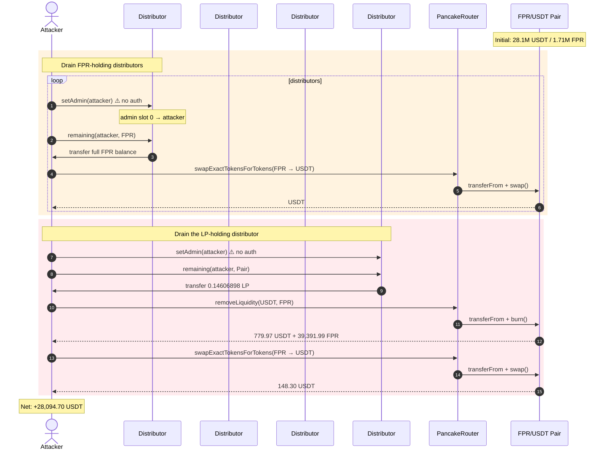
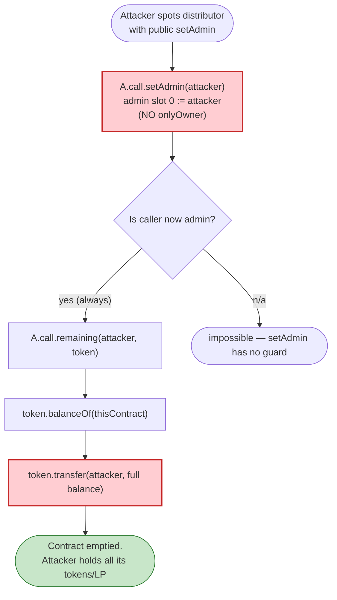
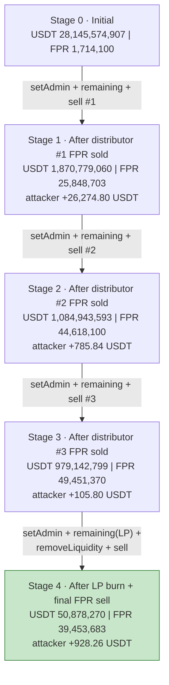

# FPR Token Exploit — Public `setAdmin()` Hijack Drains FPR Distributor Contracts + LP

> **Reproduction:** the PoC compiles & runs in an isolated Foundry project at
> [this project folder](.) (the umbrella DeFiHackLabs repo has many unrelated PoCs that do not build together, so this one was extracted).
> Full verbose trace: [output.txt](output.txt).
> Verified source: [BEP20FPR.sol](sources/BEP20FPR_A9c7ec/BEP20FPR.sol) (the FPR token; the four drained distributor contracts are not source-verified on BscScan — their bytecode exposes the public `setAdmin`/`remaining` surface shown in the trace).

---

## Key info

| | |
|---|---|
| **Loss** | ~$28,095 (28,094.70 USDT) drained from FPR distributor contracts + the FPR/USDT PancakeSwap pair |
| **Vulnerable contracts** | Four FPR "remaining"/dividend distributor contracts: [`0x81c5664b…297B7`](https://bscscan.com/address/0x81c5664be54d89E725ef155F14cf34e6213297B7#code), [`0xE2f0A9B6…c532`](https://bscscan.com/address/0xE2f0A9B60858f436e1f74d8CdbE03625b9bcc532#code), [`0x39eb555f…1BD3`](https://bscscan.com/address/0x39eb555f5F7AFd11224ca10E406Dba05B4e21BD3#code), [`0xBa5B235C…Bf27`](https://bscscan.com/address/0xBa5B235CDDaAc2595bcE6BaB79274F57FB82Bf27#code) — all expose a permissionless `setAdmin()` |
| **Victim token / pool** | FPR token `0xA9c7ec037797DC6E3F9255fFDe422DA6bF96024d`; FPR/USDT pair `0x039D05a19e3436c536bE5c814aaa70FcdbDde58b` |
| **Attacker EOA** | [`0xE3104e645BC3f6fD821930a6a39EE509a0E87D3b`](https://bscscan.com/address/0xE3104e645BC3f6fD821930a6a39EE509a0E87D3b) |
| **Attacker contracts** | [`0xe3293F89…4b0d8`](https://bscscan.com/address/0xe3293F89FD3B9336Ac2d514Ec4a90477ca94b0d8), [`0x5Dd07F8b…8b462`](https://bscscan.com/address/0x5Dd07F8b12B8D5dBDF3664c2Fa7c37Da5048b462) |
| **Attack txs** | `0xec1b969e…78102f4a`, `0x1b661702…6d2a7dde6`, `0x43da4322…8fd0ebd81`, `0x1f8e8140…5f89ccacd3` |
| **Chain / block / date** | BSC / block 23,904,152 (forked) onward (attack blocks 23,904,153 / 166 / 174) / Dec 14–15, 2022 |
| **Compiler** | FPR token: Solidity **v0.5.16** (`v0.5.16+commit.9c3226ce`), optimizer enabled, 999,999 runs |
| **Bug class** | Missing access control on admin setter (`setAdmin`) + admin-gated withdrawal (`remaining`) ⇒ public theft of contract-held tokens and LP |

---

## TL;DR

FPR is a deflationary BEP-20 token whose project deployed a handful of "distributor" contracts that
hold FPR (and, in one case, the FPR/USDT PancakeSwap **LP tokens**) and expose two functions:

- `setAdmin(address)` — sets an `admin` storage slot, **with no access control whatsoever**, and
- `remaining(address user, address token)` — callable by `admin`, it reads `token.balanceOf(this)`
  and `token.transfer`s that entire balance to `user`.

Because **anyone can call `setAdmin`**, anyone can become the admin of each distributor and then call
`remaining` to sweep the contract's whole balance into their own wallet. The attacker did this against
three contracts holding FPR and one contract holding the FPR/USDT **LP token**, then:

1. For each of the 3 FPR-holding distributors: `setAdmin(self)` → `remaining(self, FPR)` → dump the
   stolen FPR through the PancakeSwap FPR/USDT pair for USDT.
2. For the LP-holding distributor: `setAdmin(self)` → `remaining(self, Pair)` → `removeLiquidity` to
   unwrap the stolen LP into USDT + FPR, then dump the FPR for more USDT.

Net result: **28,094.70 USDT** extracted in a single atomic transaction. No flash loan, no oracle, no
AMM-invariant trick — just a public `setAdmin` that should have been `onlyOwner`.

---

## Background — what the system does

`BEP20FPR` ([sources/BEP20FPR_A9c7ec/BEP20FPR.sol](sources/BEP20FPR_A9c7ec/BEP20FPR.sol)) is an
8-decimal BEP-20 with a fee-on-transfer model:

- **payFee = 1800 bps (18%)** charged when tokens move *to the pair* (sells) — split 67/33 between
  `AcontractAddr` and `BcontractAddr` ([BEP20FPR.sol:501-506](sources/BEP20FPR_A9c7ec/BEP20FPR.sol#L501-L506)).
- **getFee = 900 bps (9%)** charged when tokens move *from the pair* (buys) ([:508-513](sources/BEP20FPR_A9c7ec/BEP20FPR.sol#L508-L513)).
- **transferFee = 100 bps (1%)** on ordinary wallet-to-wallet transfers ([:518-520](sources/BEP20FPR_A9c7ec/BEP20FPR.sol#L518-L520)).
- **blackAddr** accumulator: fees stop being charged once `_balances[blackAddr]` reaches
  `feeToStop = 62,100,000,000,000` (621,000 FPR) ([:353](sources/BEP20FPR_A9c7ec/BEP20FPR.sol#L353),
  [:434](sources/BEP20FPR_A9c7ec/BEP20FPR.sol#L434)).
- `_decimals = 8`, `_totalSupply = 69,000,000,000,000` (690,000 FPR) ([:370-371](sources/BEP20FPR_A9c7ec/BEP20FPR.sol#L370-L371)).

The four distributor contracts are *separate* from the token. They are not source-verified on BscScan,
but the PoC interface and the trace reveal their surface unambiguously:

```solidity
interface VulContract {
    function setAdmin(address) external;        // ⚠️ no onlyOwner
    function remaining(address, address) external; // admin-gated withdrawal of full balance
}
```

The trace confirms it: each `setAdmin(self)` writes the new admin into **storage slot 0** (the previous
admins were `0xbc37…3ca5` for the first three and `0x80a2…66b4` for the fourth), and each subsequent
`remaining(self, TOKEN)` does `TOKEN.balanceOf(this)` then `TOKEN.transfer(self, thatAmount)`.

Pre-attack balances of the distributors (read from the trace's `balanceOf` static calls):

| Distributor | Held | Balance |
|---|---|---:|
| `0x81c5…297B7` | FPR | 297,297.39764442 FPR (29,729,739,764,442) |
| `0xE2f0…c532` | FPR | 231,207.15542823 FPR (23,120,715,542,823) |
| `0x39eb…1BD3` | FPR | 59,537.69418896 FPR (5,953,769,418,896) |
| `0xBa5B…Bf27` | **FPR/USDT LP** | 0.14606898 LP (146,068,980,000,000,000) |

---

## The vulnerable code

The FPR token source we have does not contain the distributor contracts (they are unverified), but the
vulnerability is fully evidenced by the bytecode-level behavior captured in the trace. The drain is two
calls per contract:

### 1. Public admin hijack — `setAdmin`

```
0x81c5…297B7::setAdmin(ContractTest)
  storage slot 0: 0x…bc37739235611870fcfc527c72f8a6e17d0a3ca5  →  0x…7fa9385be102ac3eac297483dd6233d62b3e1496
```

`setAdmin` performs **no authorization check** — it directly writes its argument to the admin slot.
The same single-slot overwrite happens for all four distributors (slot 0; the 4th had a different
prior admin `0x80a23f0d…ec7d66b4`).

### 2. Admin-gated full-balance sweep — `remaining`

```
0x81c5…297B7::remaining(ContractTest, FPR)
  FPR.balanceOf(0x81c5…)                       → 29,729,739,764,442
  FPR.transfer(ContractTest, 29,729,739,764,442)  // entire balance moved out
  emit Remaining(ContractTest, FPR, 29,729,739,764,442, …)
```

`remaining` checks only that the caller is the current `admin` (which the attacker just set to itself),
then transfers the contract's *entire* balance of the requested token to the requested recipient. For
the LP-holding distributor it is called with the **Pair** token:

```
0xBa5B…Bf27::remaining(ContractTest, Pair)
  Pair.balanceOf(0xBa5B…) → 146,068,980,000,000,000
  Pair.transfer(ContractTest, 146,068,980,000,000,000)
  emit Remaining(ContractTest, Pair, 146,068,980,000,000,000, …)
```

For reference, the only auth-gated setter in the *token* contract is correctly guarded:

```solidity
function setPairAddr(address pair) external onlyOwner {   // BEP20FPR.sol:649
    require(pair != address(0), "Zero address !");
    pairAddress = pair;
}
```

The distributor contracts lack the equivalent `onlyOwner` on `setAdmin` — that single missing modifier
is the entire vulnerability.

---

## Root cause — why it was possible

The distributor contracts were deployed with an **unprotected admin setter**. Two design flaws compose
into a critical bug:

1. **Missing access control on `setAdmin`.** The function writes its argument straight to the admin
   slot with no `require(msg.sender == admin)` / `onlyOwner`. Anyone can become admin of any
   distributor, at any time.
2. **Admin privilege is "withdraw the entire balance of any token held by this contract."** `remaining`
   does not withdraw a per-user entitlement or a vested amount; it transfers the contract's *whole*
   balance of the named token to the named recipient. So becoming admin is equivalent to owning
   everything the contract holds.

The two-step primitive (`setAdmin(self)` then `remaining(self, token)`) is enough on its own — there is
no oracle to manipulate, no AMM invariant to break, no reentrancy to exploit. The attacker simply took
the FPR the distributors had accrued from the token's 9%/18%/1% fees, plus the LP that one distributor
held, and sold it all into the FPR/USDT pair. The fee-on-transfer logic of FPR (the `payFee` on sells)
only *reduces* how much of the stolen FPR reaches the pair — it does not prevent the theft.

---

## Preconditions

- None worth speaking of. The only requirement is that `setAdmin` and `remaining` exist as `external`
  functions without access control — which they did, on-chain, for every distributor. The attack needs
  **no collateral, no flash loan, and no privileged role**; it is a single permissionless transaction.

---

## Attack walkthrough (with on-chain numbers from the trace)

The FPR/USDT pair has `token0 = USDT` (18 dec), `token1 = FPR` (8 dec). Reserves are read from the
trace's `getReserves` / `Sync` events. FPR amounts shown with 8 decimals, USDT with 18.

| # | Step | FPR involved (this step) | USDT to attacker (this step) | Pair USDT reserve after | Pair FPR reserve after |
|---|------|---:|---:|---:|---:|
| 0 | **Initial pair** | — | — | 28,145,574,906.864 | 1,714,100.212608 |
| 1 | Hijack + drain distributor #1 (`0x81c5…`): `setAdmin`, `remaining(self, FPR)` → receive 294,324.42366797 FPR (1% fee to `0x620E…`), then sell all FPR | 294,324.42 FPR → pair | +26,274.795847 USDT | 1,870,779,059.691 | 25,848,702.953382 |
| 2 | Hijack + drain distributor #2 (`0xE2f0…`): `setAdmin`, `remaining(self, FPR)` → receive 228,895.08387395 FPR, sell all | 228,895.08 FPR → pair | +785.835466 USDT | 1,084,943,593.091 | 44,618,099.831046 |
| 3 | Hijack + drain distributor #3 (`0x39eb…`): `setAdmin`, `remaining(self, FPR)` → receive 5,894.231724708 FPR, sell all | 5,894.23 FPR → pair | +105.800793 USDT | 979,142,799.338 | 49,451,369.845307 |
| 4 | Hijack + drain distributor #4 (`0xBa5B…`): `setAdmin`, `remaining(self, Pair)` → receive 0.14606898 LP; `removeLiquidity` burns it for **779.9659 USDT + 39,391.99 FPR**; the 35,846.71 FPR that survives the sell-fee is sold | 35,846.71 FPR → pair | +779.965900 (LP) +148.298628 (sell) = +928.264528 USDT | 50,878,270.186 | 39,453,683.083600 |
| — | **Totals received by attacker** | 564,559.45 FPR + 0.1461 LP | **28,094.696634 USDT** | | |

Notes on the numbers (all from [output.txt](output.txt)):

- **Step 1** — distributor `0x81c5…` held `29,729,739,764,442` FPR. The `transfer` charged the
  wallet-to-wallet `transferFee` (1%) because neither sender nor recipient was the pair: 1% (297,297,397,644)
  went to `0x620E57b…` (the `blackAddr` accumulator) and 99% (29,432,442,366,797) reached the attacker.
  Selling that 294,324.42 FPR charged the 18% `payFee`, leaving `24,134,602,740,774` FPR reaching the
  pair; `Pair.swap` paid out `26,274,795,847,172,541,865,812` USDT (26,274.7958 USDT).
- **Steps 2 & 3** — identical pattern against distributors `0xE2f0…` and `0x39eb…`, yielding
  785.8355 and 105.8008 USDT respectively. Each iteration further depresses the FPR price (the pair's
  USDT reserve shrinks, the FPR reserve swells), so the marginal stolen FPR is worth less each time.
- **Step 4** — the 4th distributor held **LP**, not FPR. `remaining(self, Pair)` handed the attacker
  `0.14606898 LP`. Burning it returned `779,965,900,282,506,902,653` USDT (779.9659) and
  `39,391,988,816,823` FPR (39,391.99). The FPR transfer to the attacker again paid the 1% wallet fee
  plus the 18% sell fee, leaving `35,846,709,823,310` FPR (35,846.71) actually swapped, for
  `148,298,628,869,130,009,035` USDT (148.2986 USDT).

### Profit accounting (USDT)

| Source | USDT received |
|---|---:|
| Sell of distributor #1 FPR | 26,274.795847 |
| Sell of distributor #2 FPR | 785.835466 |
| Sell of distributor #3 FPR | 105.800793 |
| `removeLiquidity` of distributor #4 LP (USDT leg) | 779.965900 |
| Sell of distributor #4 LP-unwrapped FPR | 148.298628 |
| **Total** | **28,094.696634** |

The attacker started with **0 USDT** (the trace shows `USDT.balanceOf(attacker) == 0` before the first
swap) and ended with **28,094,696,636,678,071,901,247** units = **28,094.6966 USDT**
([output.txt:319](output.txt)). At USDT ≈ $1 that is ≈ **$28,095**, consistent with the PoC header's
"~$29k" figure (the header rounds up; the trace-exact figure is $28,095).

---

## Diagrams

### Sequence of the attack



### Drain primitive — why `setAdmin` + `remaining` = theft



### State evolution of the FPR/USDT pair under the attack



---

## Why the fee-on-transfer did not save the distributors

The FPR token charges 18% on sells (`payFee = 1800`), 9% on buys (`getFee = 900`), and 1% on
wallet-to-wallet transfers (`transferFee = 100`). An intuitive objection is "the attacker loses 18% on
every sell, so the theft is barely profitable." Two facts defeat that:

1. The FPR was **stolen at zero cost**. Even after losing 18% to the sell fee and 1% to the wallet fee,
  the attacker still receives the remaining ~81% of stolen FPR's value in USDT — pure profit, because
  the input cost was 0.
2. The fees do not accrue back to the distributors being drained; they go to `AcontractAddr` /
  `BcontractAddr` (`0x75b6B5…` / `0xCdfdf2…` in the trace) and to the `blackAddr` accumulator. So the
  fee mechanism neither protects the distributors nor slows the attacker.

The fee model is therefore irrelevant to the exploit. The vulnerability is purely the unprotected
`setAdmin` + the unconditional full-balance `remaining`.

---

## Remediation

1. **Gate `setAdmin` with `onlyOwner` (or `onlyAdmin`).** A single `require(msg.sender == admin)` /
   `onlyOwner` modifier on the setter closes the bug entirely. The token contract already demonstrates
   the correct pattern with `setPairAddr … external onlyOwner`
   ([BEP20FPR.sol:649-653](sources/BEP20FPR_A9c7ec/BEP20FPR.sol#L649-L653)); the distributor contracts
   should mirror it.
2. **Make `remaining` withdraw per-user entitlements, not the contract's whole balance.** Even with an
   admin guard, "admin can sweep everything" is a footgun. `remaining` should dispense accrued
   dividends to the *user* argument based on an internal accounting ledger, capped at what that user is
   owed — never `token.balanceOf(this)`.
3. **Add a timelock / two-step admin change.** `setAdmin` should (a) be `onlyOwner`, (b) queue a
   pending admin, and (c) require the new admin to `claimAdmin()` — so a compromised or buggy key cannot
   instantly seize control.
4. **Don't park LP tokens in an unprotected contract.** The 4th distributor held the FPR/USDT LP — the
   deepest, most liquid claim on the pool. Holding it in a contract whose only protection is a public
   `setAdmin` made the LP trivially stealable. LP should live in a multisig/timelock or be locked.
5. **Re-audit all sibling contracts** (the four distributors are near-identical); any contract in the
   same family with the same `setAdmin`/`remaining` pattern is equally vulnerable.

---

## How to reproduce

The PoC was extracted into a standalone Foundry project (the umbrella DeFiHackLabs repo has many
unrelated PoCs that do not compile under `forge test`'s whole-project build):

```bash
_shared/run_poc.sh 2022-12-FPR_exp --mt testExploit -vvvvv
```

- RPC: a **BSC archive** endpoint is required (fork block 23,904,152 is from Dec 2022 and is pruned by
  most public BSC RPCs). `foundry.toml` uses an archive-capable endpoint.
- The PoC forks at block 23,904,152 (one before the first attack block 23,904,153) and replays all four
  drains in a single `testExploit()` call ([test/FPR_exp.sol:49-72](test/FPR_exp.sol#L49-L72)).
- Result: `[PASS] testExploit()`.

Expected tail:

```
Ran 1 test for test/FPR_exp.sol:ContractTest
[PASS] testExploit() (gas: 531776)
Logs:
  29432442366797
  22889508387395
  5894231724708

Suite result: ok. 1 passed; 0 failed; 0 skipped; finished in 11.90s (11.23s CPU time)
```

The three logged numbers are the attacker's FPR balance after each of the three FPR-distributor drains
(294,324.42 / 228,895.08 / 5,894.23 FPR), each of which is immediately sold for USDT inside the loop.
The 4th distributor's LP drain + `removeLiquidity` + final sell follow the loop and are not logged but
are visible in the trace (final `USDT.balanceOf(attacker) = 28,094,696,636,678,071,901,247`,
[output.txt:319](output.txt)).

---

*References: PeckShield — https://twitter.com/peckshield/status/1603226968706936832 ; ChainLight —
https://twitter.com/chainlight_io/status/1603282848311480320 .*
