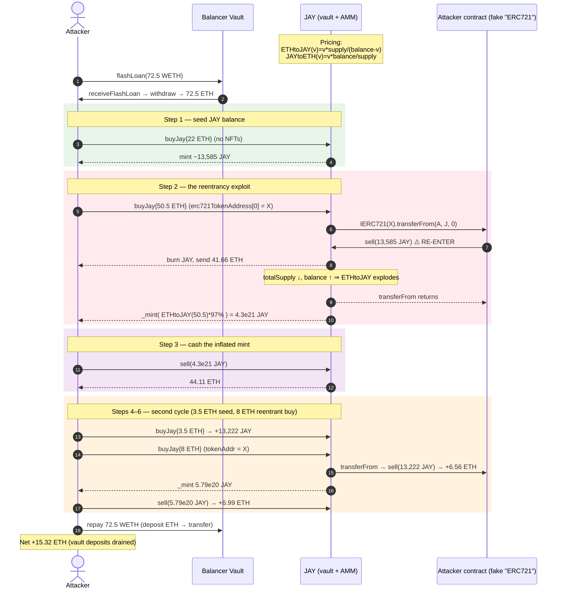
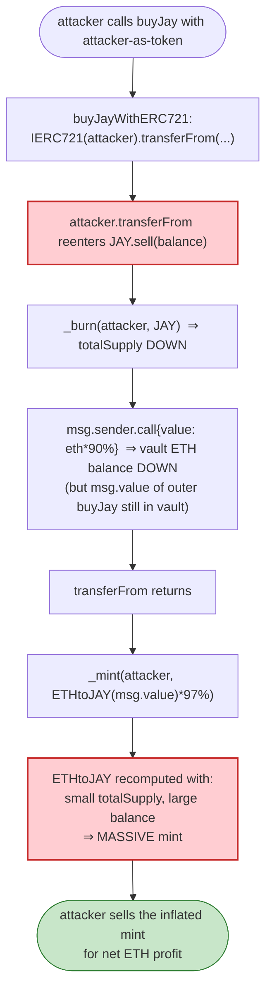

# JAY Token Exploit — Reentrancy via Attacker-Controlled "ERC721" Callback in `buyJay`

> **Reproduction:** the PoC compiles & runs in an isolated Foundry project at
> [this project folder](.) (the umbrella DeFiHackLabs repo mixes many unrelated
> PoCs that don't build together, so this one was extracted).
> Full verbose trace: [output.txt](output.txt).
> Verified vulnerable source: [JAY.sol](sources/JAY_f2919d/JAY.sol).

---

## Key info

| | |
|---|---|
| **Loss** | **~15.32 ETH** (attacker's net profit, fully flash-loan funded) |
| **Vulnerable contract** | `JAY` (JayPeggers fractional-NFT vault) — [`0xf2919D1D80Aff2940274014bef534f7791906FF2`](https://etherscan.io/address/0xf2919d1d80aff2940274014bef534f7791906ff2#code) |
| **Victim pool** | the JAY contract itself (it IS the AMM — ETH principal, JAY as fractional claim) |
| **Attacker EOA** | `0x0348D20b74Ddc0ac9bfC3626e06d30bb6Fac213b` |
| **Attacker contract** | [`0xed42cb11b9d03c807ed1ba9c2ed1d3ba5bf37340`](https://etherscan.io/address/0xed42cb11b9d03c807ed1ba9c2ed1d3ba5bf37340) |
| **Attack tx** | [`0xd4fafa1261f6e4f9c8543228a67caf9d02811e4ad3058a2714323964a8db61f6`](https://etherscan.io/tx/0xd4fafa1261f6e4f9c8543228a67caf9d02811e4ad3058a2714323964a8db61f6) |
| **Chain / block / date** | Ethereum mainnet / 16,288,199 / Dec 29, 2022 |
| **Compiler** | Solidity **v0.8.7+commit.e28d00a7**, optimizer **off**, 200 runs |
| **Bug class** | Reentrancy via user-supplied "ERC721 token address" + missing `nonReentrant` on a price-forming buy/sell pair |

---

## TL;DR

`JAY` is a do-it-yourself AMM: users send ETH in and get minted JAY at a bonding-curve price
(`ETHtoJAY`), and they burn JAY to redeem ETH back out (`JAYtoETH`). The price of JAY in ETH is
derived purely from the contract's own balance and `totalSupply()` — both of which move **during**
a trade.

`buyJay()` lets the caller pass arbitrary **arrays of "ERC721 token addresses"** so the protocol can
sweep NFTs in exchange for JAY. It then calls `IERC721(tokenAddress[id]).transferFrom(...)` on each
of those addresses ([JAY.sol:1152-1163](sources/JAY_f2919d/JAY.sol#L1152-L1163)). The attacker
simply listed **its own attack contract** as the "ERC721 token". That contract's `transferFrom`
ignores the arguments and reenters `JAY.sell()`, which **burns the attacker's JAY and pays out ETH
before `buyJay` runs its `_mint`** ([JAY.sol:1142](sources/JAY_f2919d/JAY.sol#L1142)).

Because `_mint` uses `ETHtoJAY(msg.value) = msg.value * totalSupply / (balance - msg.value)` and
the reentrant `sell` has *lowered* `totalSupply` and *raised* `address(this).balance`, the same
`msg.value` mints an astronomically larger amount of JAY. The attacker then `sell()`s that freshly
minted JAY back for far more ETH than it paid in.

There is no `nonReentrant` guard anywhere, and the "NFT" is never validated to be a real ERC721.
Two reentrancy cycles in a single flash loan (block 16,288,199) netted **~15.32 ETH** of the
vault's genuine deposits, on top of a fully-repaid 72.5 ETH Balancer flash loan.

---

## Background — what JAY does

`JAY` ([source](sources/JAY_f2919d/JAY.sol)) is "JayPeggers," a fractional-NFT vault that behaves
like a tiny constant-product-free AMM whose reserves are `(contract ETH balance, JAY totalSupply)`:

- **Buy JAY with ETH** (`buyJay` / `buyJayNoNFT`) — accepts ETH and "NFTs" (ERC721 + ERC1155 arrays),
  mints JAY at the bonding curve:
  ```solidity
  function ETHtoJAY(uint256 value) public view returns (uint256) {
      return value.mul(totalSupply()).div(address(this).balance.sub(value));
  }
  ```
  ([JAY.sol:1231-1233](sources/JAY_f2919d/JAY.sol#L1231-L1233))
- **Sell JAY for ETH** (`sell`) — burns JAY and pays out ETH at:
  ```solidity
  function JAYtoETH(uint256 value) public view returns (uint256) {
      return (value * address(this).balance).div(totalSupply());
  }
  ```
  ([JAY.sol:1227-1229](sources/JAY_f2919d/JAY.sol#L1227-L1229))
- **NFT exchange** — `buyJay` will accept ERC721/ERC1155 tokens from the caller in exchange for JAY
  minted against the ETH `msg.value`. This is the "novel" feature and the entry point for the bug.

Both pricing functions read **live `address(this).balance` and live `totalSupply()`** — they are
*not* snapshotted. A reentrant call that changes either quantity mid-trade directly re-prices the
outer trade.

---

## The vulnerable code

### 1. `buyJay` — state read **after** an external call to a user-controlled address

```solidity
function buyJay(
    address[] calldata erc721TokenAddress,
    uint256[] calldata erc721Ids,
    address[] calldata erc1155TokenAddress,
    uint256[] calldata erc1155Ids,
    uint256[] calldata erc1155Amounts
) public payable {
    require(start, "Not started!");
    uint256 total = erc721TokenAddress.length;
    if (total != 0) buyJayWithERC721(erc721TokenAddress, erc721Ids);   // ⚠️ external call to ANY address

    ...
    if (total >= 100) require(msg.value >= (total).mul(sellNftFeeEth).div(2), "...");
    else              require(msg.value >= (total).mul(sellNftFeeEth), "...");

    _mint(msg.sender, ETHtoJAY(msg.value).mul(97).div(100));            // ⚠️ reads state changed by the call above
    ...
}
```
([JAY.sol:1111-1150](sources/JAY_f2919d/JAY.sol#L1111-L1150))

### 2. `buyJayWithERC721` — blind `transferFrom` on the caller-supplied address

```solidity
function buyJayWithERC721(
    address[] calldata _tokenAddress,
    uint256[] calldata ids
) internal {
    for (uint256 id = 0; id < ids.length; id++) {
        IERC721(_tokenAddress[id]).transferFrom(   // ⚠️ calls transferFrom on _tokenAddress[id]
            msg.sender,                              //    which the caller fully controls
            address(this),
            ids[id]
        );
    }
}
```
([JAY.sol:1152-1163](sources/JAY_f2919d/JAY.sol#L1152-L1163))

There is no check that `_tokenAddress[id]` is an ERC721, no check that a real token moved, and no
reentrancy guard. If `_tokenAddress[id]` is a contract, its `transferFrom` selector runs whatever
the attacker wants — including re-entering `JAY.sell()`.

### 3. `sell` — pays ETH before the burn is "settled" (compounds the reentrancy)

```solidity
function sell(uint256 value) public {
    require(value > MIN, "Dude tf");
    uint256 eth = JAYtoETH(value);
    _burn(msg.sender, value);                         // totalSupply drops
    (bool success, ) = msg.sender.call{value: eth.mul(90).div(100)}("");  // ⚠️ ETH out, balance drops
    require(success, "ETH Transfer failed.");
    (bool success2, ) = dev.call{value: eth.div(33)}("");
    require(success2, "ETH Transfer failed.");
    emit Price(block.timestamp, JAYtoETH(1 * 10**18));
}
```
([JAY.sol:1185-1197](sources/JAY_f2919d/JAY.sol#L1185-L1197))

After this `sell` returns, `totalSupply` is smaller and `address(this).balance` is smaller too —
but crucially the *outer* `buyJay`'s `msg.value` is still in the contract (it hasn't been "spent"
yet from the contract's `balance` perspective beyond the dev cut). The net effect on
`ETHtoJAY(msg.value)` is a huge inflation of the mint, because `totalSupply` shrank dramatically
while the `(balance - msg.value)` denominator shrank only modestly.

---

## Root cause — why it was possible

Three independent design failures compose into the exploit:

1. **User-controlled external call inside a price-forming function.** `buyJay` invokes
   `IERC721(_tokenAddress[id]).transferFrom(...)` on an address supplied by the caller, with no
   validation that it is a real ERC721 or that a transfer actually occurred. This hands the caller
   a free reentrancy callback in the middle of the trade.

2. **No reentrancy guard anywhere.** Neither `buyJay`, `sell`, nor `buyJayWithERC721` uses a
   `nonReentrant` modifier. Combined with #1, the caller can run arbitrary JAY logic (including
   `sell`, which moves ETH) before `buyJay`'s `_mint`.

3. **Price derived from mutable live state, read after the external call.** `_mint(msg.sender,
   ETHtoJAY(msg.value)...)` recomputes `ETHtoJAY` using the *post-reentrancy* `totalSupply()` and
   `address(this).balance`. A reentrant `sell` that burns JAY and pulls ETH therefore re-prices the
   outer mint in the attacker's favor.

The attack is "buy high, sell higher, but make *the same buy* cheap by manipulating the price
oracle (the contract's own reserves) through a reentrant sell, before the buy's mint settles."

---

## Preconditions

- `start == true` (the owner had called `startJay()`). ✓ at block 16,288,199.
- Flash-loanable capital: the entire attack was funded by a **72.5 WETH Balancer flash loan**
  (zero fee at the time — `getFlashLoanFeePercentage()` returned 0, confirmed in the trace).
- The attacker must deploy a contract that exposes a `transferFrom(address,address,uint256)`
  selector whose body reenters `JAY.sell(JAY.balanceOf(this))`. (The PoC does exactly this:
  [JAY_exp.sol:114-116](test/JAY_exp.sol#L114-L116).)
- JAY liquidity in the vault: enough ETH-backed JAY outstanding that a `sell` moves the price
  meaningfully. The vault was live and held a non-trivial ETH balance at the fork block.

---

## Attack walkthrough (with on-chain numbers from the trace)

`ETHtoJAY(v) = v * totalSupply / (balance - v)` and `JAYtoETH(v) = v * balance / totalSupply`.
All numbers below are pulled from the `Transfer`, `Price`, and `receive{value:}` lines of
[output.txt](output.txt). Attacker = the `ContractTest` address
`0x7FA9385bE102ac3EAc297483Dd6233D62b3e1496`.

The Balancer flash loan sends **72.5 WETH**, which the attacker immediately `withdraw`s to
**72.5 ETH** ([output.txt:39-45](output.txt#L39-L45)).

| # | Step | JAY `totalSupply` after | Vault ETH after | Attacker ETH delta | Notes |
|---|------|------------------------:|----------------:|-------------------:|-------|
| 0 | **Start** (after 72.5 ETH withdrawn) | unchanged | +72.5 (held by attacker) | +72.5 | Flash-loaned capital in hand. |
| 1 | **`buyJay{22 ETH}`** (no NFT arrays) | +13,584.90 JAY minted to attacker | +22.0 | −22.0 | Normal buy; attacker now holds ~13,585 JAY. `Price = 0.001571 ETH/JAY`. |
| 2 | **`buyJay{50.5 ETH}`** with `erc721TokenAddress[0] = attacker` → reentrancy | see below | see below | see below | The exploit step. |
| 2a | ↳ inside `buyJay`: `buyJayWithERC721` → `attacker.transferFrom(...)` → **reenter `sell(13,584.90 JAY)`** | **−13,584.90 JAY** (burned) | **−41.66 ETH** (to attacker), −1.40 (dev) | **+41.66** | `totalSupply` collapses, vault ETH drops. `Price = 0.003639 ETH/JAY` (JAY got *more* expensive because supply shrank). |
| 2b | ↳ back in `buyJay`: `_mint(ETHtoJAY(50.5 ETH) * 97%)` | **+4.313e21 JAY** (≈ 4.3 quintillion) minted to attacker | +50.5 | −50.5 | With `totalSupply` tiny and `balance` large, `ETHtoJAY` explodes — the attacker gets a monstrous JAY mint for the same 50.5 ETH. `nftsSold` 8499→8500 (the `total>=100` fee branch is now reachable on later calls). |
| 3 | **`sell(4.313e21 JAY)`** | back to baseline | **−44.11 ETH** (to attacker), −1.48 (dev) | **+44.11** | Dump the inflated mint for real ETH. `Price = 0.000257 ETH/JAY`. |
| 4 | **`buyJay{3.5 ETH}`** (no NFT arrays) | +13,222.0 JAY | +3.5 | −3.5 | Reload JAY for the second cycle. `Price = 0.000257 ETH/JAY`. |
| 5 | **`buyJay{8 ETH}`** with `erc721TokenAddress[0] = attacker` → reentrancy | | | | Second cycle. |
| 5a | ↳ `attacker.transferFrom` → **`sell(13,222.0 JAY)`** | −13,222.0 JAY | −6.56 (attacker), −0.22 (dev) | **+6.56** | `Price = 0.000588 ETH/JAY`. |
| 5b | ↳ `_mint(ETHtoJAY(8 ETH) * 97%)` | **+5.787e20 JAY** | +8.0 | −8.0 | Inflated mint, second time. `nftsSold` 8500→8501. |
| 6 | **`sell(5.787e20 JAY)`** | baseline | −6.99 (attacker), −0.235 (dev) | **+6.99** | `Price = 0.0000523 ETH/JAY`. |
| 7 | **Repay flash loan**: deposit 72.5 ETH → WETH, transfer to Balancer | — | — | −72.5 | Loan fully repaid; fee was 0. |

### Profit accounting (ETH, attacker perspective)

| Direction | Amount (ETH) |
|---|---:|
| Borrowed (Balancer flash loan) | +72.5000 |
| Spent — `buyJay` 22 ETH | −22.0000 |
| Spent — `buyJay` 50.5 ETH | −50.5000 |
| Spent — `buyJay` 3.5 ETH | −3.5000 |
| Spent — `buyJay` 8 ETH | −8.0000 |
| Received — sell in reentrancy #1 (step 2a) | +41.6594 |
| Received — sell after mint #1 (step 3) | +44.1131 |
| Received — sell in reentrancy #2 (step 5a) | +6.5638 |
| Received — sell after mint #2 (step 6) | +6.9881 |
| Repay flash loan | −72.5000 |
| **Net profit** | **+15.3245** |

The trace's `[End] Attacker ETH balance after exploit: 15.324469731061671907` matches the
hand-computed net to the wei. That 15.32 ETH is the vault's genuine depositor ETH that the
attacker walked away with.

---

## Diagrams

### Sequence of the attack



### Reentrancy → price-manipulation flow



### Why the reentrant `sell` inflates the mint — the bonding curve

```mermaid
flowchart LR
    subgraph Before["Before reentrant sell"]
        B1["totalSupply = S (large)<br/>balance = B<br/>ETHtoJAY(msg.value) ≈ v·S / (B−v)"]
    end
    subgraph After["After reentrant sell (burn JAY, pull ETH)"]
        A1["totalSupply = S − soldJAY (much smaller)<br/>balance = B − paidETH<br/>ETHtoJAY(msg.value) ≈ v·(S−soldJAY) / (B−paidETH−v)"]
    end
    Before -->|"reentrant sell burns<br/>a big fraction of supply<br/>while paying out a small<br/>fraction of balance"| After
    A1 -->|"numerator stays comparable,<br/>denominator barely shrinks"| Inflate(["Minted JAY multiplied by<br/>(S / (S − soldJAY)) · factor<br/>→ astronomically larger")]

    style After fill:#ffcdd2,stroke:#c62828,stroke-width:2px
    style Inflate fill:#c8e6c9,stroke:#2e7d32
```

---

## Why each magic number

- **72.5 ETH flash loan** — working capital to seed the buys. The attacker never risks its own
  ETH; the loan is repaid in full inside the same transaction (Balancer's `receiveFlashLoan`
  callback is where the whole attack runs). The fee was 0 (`FlashLoan` event: `feeAmount: 0`).
- **First `buyJay{22 ETH}` with no NFTs** — gives the attacker a real JAY balance so the reentrant
  `sell(JAY.balanceOf(attacker))` in step 2 has something to burn. Without it, the reentrancy would
  sell 0 JAY and not move the price.
- **`buyJay{50.5 ETH}` and `buyJay{8 ETH}` with `erc721TokenAddress[0] = attacker`** — these are
  the two reentrancy triggers. The `ids` and amounts are dummies; the attacker's `transferFrom`
  ignores them entirely.
- **Two cycles** — the first cycle (50.5 ETH in) produces the big profit; the second cycle (8 ETH
  in) mops up residual value. The attacker could in principle run more cycles, but two were enough
  to extract the available 15.32 ETH.
- **`transferFrom` → `sell(balanceOf(this))`** — selling the *entire* current JAY balance maximizes
  the `totalSupply` drop per reentrancy, which maximizes the inflation of the subsequent `_mint`.

---

## Remediation

1. **Add `nonReentrant` to every state-mutating pricing function** — `buyJay`, `buyJayNoNFT`,
   `sell`, and `buyNFTs`. A single reentrancy guard on these entry points kills the attack class.
2. **Never trust user-supplied token addresses for callbacks.** Validate that `_tokenAddress[id]`
   supports ERC721 (e.g., `ERC165.supportsInterface(0x80ac58cd)`) and, more importantly, that a
   real ownership transfer occurred (e.g., record `balanceOf` before/after for the token+id and
   require a non-zero delta). Better: keep an allow-list of vetted NFT collections.
3. **Snapshot the price before any external call.** Compute `ETHtoJAY(msg.value)` (and the JAY
   amount to mint) *before* `buyJayWithERC721` runs, cache the result, and use the cached value in
   `_mint`. The reserves that price a trade must be the reserves at the start of the trade, not the
   reserves after arbitrary external code has run.
4. **Follow checks-effects-interactions.** In `sell`, move the `_burn` and any internal accounting
   ahead of the ETH `call`; even better, use a pull-payment pattern so no ETH is sent inside the
   token-state-mutation call frame.
5. **Don't derive price from `address(this).balance`.** Direct `balance` reads are manipulable by
   anyone sending ETH (including `selfdestruct` force-pushes and the contract's own `receive()`).
   Track an internal `reserveEth` accumulator updated only by the protocol's own deposit/withdraw
   functions.
6. **Validate the "NFT actually moved."** Even with reentrancy guards, accepting arbitrary ERC721
   arrays and pricing JAY purely on `msg.value` (not on the NFTs received) means the "NFT exchange"
   feature is structurally a free-price-JAY button. The NFT receipt must reduce the JAY mint or the
   feature must be removed.

---

## How to reproduce

The PoC was extracted into a standalone Foundry project (the umbrella DeFiHackLabs repo mixes many
unrelated PoCs that fail to compile together):

```bash
_shared/run_poc.sh 2022-12-JAY_exp --mt testExploit -vvvvv
```

- RPC: an **Ethereum mainnet archive** endpoint is required (the fork block 16,288,199 is from
  Dec 2022 and is pruned on most public RPCs). `foundry.toml` pins an archive-capable RPC.
- The test sets the attacker's starting balance to 0 (`payable(0).transfer(address(this).balance)`),
  so the `[End]` balance printed is the pure exploit profit.

Expected tail of the trace:

```
Ran 1 test for test/JAY_exp.sol:ContractTest
[PASS] testExploit() (gas: 343286)
Logs:
  [Start] Attacker ETH balance before exploit: 0.000000000000000000
  [End] Attacker ETH balance after exploit: 15.324469731061671907
Suite result: ok. 1 passed; 0 failed; 0 skipped; finished in 5.09s (3.45s CPU time)
```

The attacker's `transferFrom` reentrancy hook is at
[test/JAY_exp.sol:114-116](test/JAY_exp.sol#L114-L116); the flash-loan callback that orchestrates
the full attack is at [test/JAY_exp.sol:75-112](test/JAY_exp.sol#L75-L112).

---

*References: BlockSec tweet
(https://twitter.com/BlockSecTeam/status/1608372475225866240); SolidityScan write-up
(https://blog.solidityscan.com/jay-token-exploit-reentrancy-attack-d7a4923b6333); Hypernative
write-up (https://www.hypernative.io/blog/jaypeggers-exploit).*
