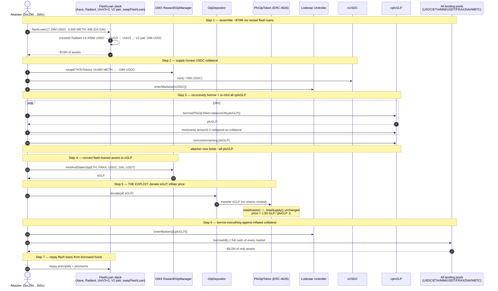
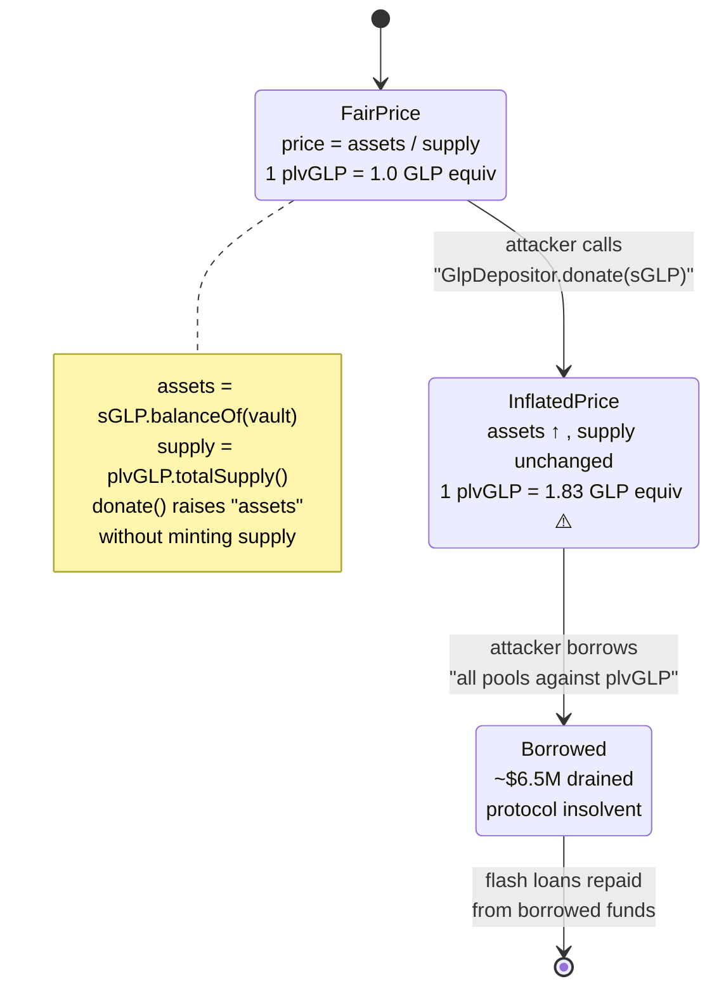
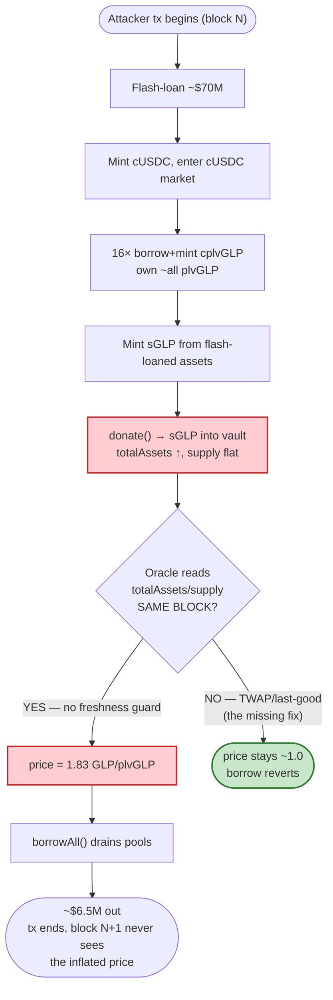

# Lodestar Finance Exploit — `plvGLP` Oracle Inflation Drains the Lending Pools

> **Vulnerability classes:** vuln/oracle/price-manipulation · vuln/arithmetic/rounding

> **Reproduction:** the PoC lives in an isolated Foundry project at [this project folder](.) — the umbrella DeFiHackLabs repo does not whole-build, so this one was extracted.
> Verbose trace: [output.txt](output.txt).
> Verified vulnerable source: [contracts_plvGLP_PlvGlpToken.sol](sources/PlvGlpToken_5326E7/contracts_plvGLP_PlvGlpToken.sol) and
> [lodestar_contracts_CToken.sol](sources/Unitroller_8f2354/lodestar_contracts_CToken.sol).

---

## Key info

| | |
|---|---|
| **Loss** | **~$6.5M** drained from Lodestar's lending pools (~2.8M GLP / ~$2.4M of it later flagged recoverable) |
| **Vulnerable contract** | `PlvGlpToken` (the vault whose `totalAssets()` priced the collateral) — [`0x5326E71Ff593Ecc2CF7AcaE5Fe57582D6e74CFF1`](https://arbiscan.io/address/0x5326E71Ff593Ecc2CF7AcaE5Fe57582D6e74CFF1#code), combined with Lodestar's **GLPOracle** that consumed its live share price |
| **Victim protocol** | Lodestar Finance (Compound-fork money market) — Unitroller [`0x8f2354F9464514eFDAe441314b8325E97Bf96cdc`](https://arbiscan.io/address/0x8f2354F9464514eFDAe441314b8325E97Bf96cdc) |
| **Borrowable market** | `cplvGLP` (cToken) — [`0xCC25daC54A1a62061b596fD3Baf7D454f34c56fF`](https://arbiscan.io/address/0xCC25daC54A1a62061b596fD3Baf7D454f34c56fF) |
| **Attacker EOA** | [`0xc29d94386ff784006ff8461c170d1953cc9e2b5c`](https://arbiscan.io/address/0xc29d94386ff784006ff8461c170d1953cc9e2b5c) |
| **Attack tx** | [`0xc523c6307b025ebd9aef155ba792d1ba18d5d83f97c7a846f267d3d9a3004e8c`](https://arbiscan.io/tx/0xc523c6307b025ebd9aef155ba792d1ba18d5d83f97c7a846f267d3d9a3004e8c) |
| **Chain / block / date** | Arbitrum / **45,121,903** / **December 10, 2022** |
| **Compiler** | PlvGlpToken `v0.8.9` (opt 1, 1000 runs); Lodestar cTokens/Comptroller `v0.8.10` (opt 1, 200 runs) |
| **Bug class** | Single-block price-oracle manipulation of an ERC-4626 vault share price via a donation (`donate()`) that inflates `totalAssets` without minting shares |

---

## TL;DR

Lodestar priced its `plvGLP` collateral with a **GLPOracle** that read the on-chain share price of
PlutusDAO's `PlvGlpToken` — an OpenZeppelin ERC-4626 vault whose price-per-share is
`totalAssets() / totalSupply()`. The `GlpDepositor.donate(amount)` function lets anyone push sGLP into
that vault **without minting any plvGLP shares** ([contracts_plvGLP_PlvGlpToken.sol](sources/PlvGlpToken_5326E7/contracts_plvGLP_PlvGlpToken.sol),
`totalAssets()` inherited from ERC-4626 = `_asset.balanceOf(address(this))`). A donation therefore raises
the numerator while the denominator stays put, so the reported plvGLP price **spikes inside the same block**.

The attacker chained that one primitive into a full lending-pool drain:

1. Flash-loaned **~$70M** (USDC/WETH/DAI) across Aave, Radiant, three Uniswap V3 pools, a V2 pair, and a
   Curve-style swap-flash-loan, plus 14,960 WETH from the V2 pair.
2. Converted everything to **sGLP** via GMX `mintAndStakeGlp(ETH/FRAX/USDC/DAI/USDT)`.
3. Used ~$70M of USDC as **honest collateral** on Lodestar's cUSDC market to mint cUSDC, enter the market,
   then **recursively borrow + re-mint the entire `cplvGLP` supply** (the `for (i=0;i<16) { borrow; mint }`
   loop) to vacuum up essentially all plvGLP held by the cToken.
4. **Donated the freshly minted sGLP** to `GlpDepositor.donate()`, inflating plvGLP's reported price to
   **1.83 GLP per plvGLP** — i.e. the attacker's collateral was suddenly worth 83% more than reality.
5. Entered the cplvGLP market and **borrowed every last asset** in Lodestar's pools (USDC, WETH, MIM, USDT,
   FRAX, DAI, WBTC) via `borrowAll()`.

Because the oracle's price update was instantaneous and the inflated collateral counted at full LTV, the
attacker could over-borrow against worthless-ish plvGLP, leave the protocol insolvent, and walk away with
~$6.5M. The flash loans were repaid from the borrowed funds.

---

## Background — what was being priced and how

Lodestar is a **Compound fork on Arbitrum**. One of its collateral markets is `plvGLP`, PlutusDAO's
yield-bearing wrapper around GMX's **sGLP**. `plvGLP` is an ERC-4626 vault:

```solidity
// sources/PlvGlpToken_5326E7/openzeppelin_contracts_token_ERC20_extensions_ERC4626.sol:44-46
function totalAssets() public view virtual override returns (uint256) {
    return _asset.balanceOf(address(this));   // _asset = sGLP
}
```

```solidity
// ...ERC4626.sol:163-169  (shares -> assets, i.e. the price-per-share)
function _convertToAssets(uint256 shares, Math.Rounding rounding) internal view virtual returns (uint256 assets) {
    uint256 supply = totalSupply();
    return (supply == 0)
        ? shares.mulDiv(10**_asset.decimals(), 10**decimals(), rounding)
        : shares.mulDiv(totalAssets(), supply, rounding);   // ← price = totalAssets / supply
}
```

So **1 plvGLP is worth `sGLP_in_vault / plvGLP_supply`** sGLP, and Lodestar's GLPOracle multiplied that by the
GLP USD price to collateralize borrows. Two properties make that price a live attack surface:

- `totalAssets()` is just `sGLP.balanceOf(vault)` — **any transfer of sGLP into the vault moves the price**,
  even one that mints no shares in return.
- PlutusDAO exposes exactly such an entry point: `GlpDepositor.donate(amount)` stakes sGLP into the vault for
  the benefit of existing holders (no plvGLP minted). Lodestar's own docs conceded it relied on Chainlink for
  every asset **"with the exception of plvGLP."**

The on-chain constants at the fork block (45,121,903), matching the live attack state:

| Quantity | Value |
|---|---|
| Flash-loaned (Aave pool) | 17,290,000 USDC + 9,500 WETH + 406,316 DAI |
| Radiant top-up | 14,435,000 USDC |
| UniV3 / V2 flash | 5,460 WETH + 7,170,000 USDC ; 2,200,000 USDC ; 10,000,000 USDC |
| V2 pair flash → minted to sGLP | 14,960 WETH → ~19,001,512 USDC |
| `cplvGLP` supply borrowed in the 16× loop | the **entire** `PlvGlpToken.balanceOf(cplvGLP)` |
| Final plvGLP price | **1.83 GLP / plvGLP** (≈ +83% vs. fair value of 1.0) |
| Drained markets | USDC, WETH, MIM, USDT, FRAX, DAI, WBTC |

---

## The vulnerable code

### 1. The price is `totalAssets / totalSupply` and `totalAssets` is donation-inflatable

```solidity
// sources/PlvGlpToken_5326E7/openzeppelin_contracts_token_ERC20_extensions_ERC4626.sol:44-46
function totalAssets() public view virtual override returns (uint256) {
    return _asset.balanceOf(address(this));   // ← anyone can move this via donate()
}
```

```solidity
// sources/PlvGlpToken_5326E7/openzeppelin_contracts_token_ERC20_extensions_ERC4626.sol:163-169
function _convertToAssets(uint256 shares, Math.Rounding rounding) internal view virtual returns (uint256 assets) {
    uint256 supply = totalSupply();
    return (supply == 0)
        ? shares.mulDiv(10**_asset.decimals(), 10**decimals(), rounding)
        : shares.mulDiv(totalAssets(), supply, rounding);
}
```

There is no access control on receiving sGLP and **no share-minting on donations**, so the price numerator is
an unauthenticated, single-block input.

### 2. The `donate()` primitive (PlutusDAO GlpDepositor, called by the attacker)

```solidity
// interface GlpDepositor — invoked in the PoC as depositor.donate(glpAmount)
interface GlpDepositor {
    function donate(uint256 _amount) external;   // moves sGLP into the plvGLP vault, mints NO shares
    function redeem(uint256 amount) external;
}
```

In the PoC this is [test/Lodestar_exp.sol:241](test/Lodestar_exp.sol#L241):

```solidity
sGLP.approve(address(depositor), glpAmount);
depositor.donate(glpAmount); // plvGLP price manipulation
```

### 3. Lodestar then lets the attacker borrow everything against the inflated collateral

`borrowFresh` only requires (a) comptroller `borrowAllowed` — which uses the oracle's now-inflated collateral
value, and (b) `getCashPrior() >= borrowAmount` — the pool literally has the cash because the attacker supplied it:

```solidity
// sources/Unitroller_8f2354/lodestar_contracts_CToken.sol:565-580
function borrowFresh(address payable borrower, uint borrowAmount) internal {
    uint allowed = comptroller.borrowAllowed(address(this), borrower, borrowAmount);
    if (allowed != 0) { revert BorrowComptrollerRejection(allowed); }
    if (accrualBlockNumber != getBlockNumber()) { revert BorrowFreshnessCheck(); }
    if (getCashPrior() < borrowAmount) { revert BorrowCashNotAvailable(); }
    ...
}
```

And the attacker drains **all** markets in one shot:

```solidity
// test/Lodestar_exp.sol:251-259
function borrowAll() internal {
    IUSDC.borrow(USDC.balanceOf(address(IUSDC)));
    IETH.borrow(address(IETH).balance);
    IMIM.borrow(MIM.balanceOf(address(IMIM)));
    IUSDT.borrow(USDT.balanceOf(address(IUSDT)));
    IFRAX.borrow(FRAX.balanceOf(address(IFRAX)));
    IDAI.borrow(DAI.balanceOf(address(IDAI)));
    IWBTC.borrow(WBTC.balanceOf(address(IWBTC)));
}
```

---

## Root cause — why it was possible

The exploit is a textbook **single-block oracle manipulation** composed of three independently-reasonable
design choices that interact catastrophically:

1. **A vault-share price was used as a live oracle.** Lodestar priced `plvGLP` from its ERC-4626
   `totalAssets()/totalSupply()` ratio. ERC-4626 share prices are *not* manipul-resistant oracles: the
   numerator is a plain `balanceOf`, which any external transfer can move. Solidity Finance's root-cause note:
   *"The GLPOracle did not properly take into account the impact of a user calling `donate()` on the
   GlpDepositor contract, which inflates the assets … and therefore the oracle-delivered price of plvGLP."*
2. **A permissionless donation path existed.** `GlpDepositor.donate()` lets sGLP be pushed into the vault for
   the common benefit of holders without minting shares. That is the exact lever that breaks (1): raise the
   numerator, leave the denominator alone, price jumps — in the same transaction the collateral is then
   borrowed against.
3. **No freshness / TWAP guard on the oracle.** Lodestar's post-mortem itself states the fix:
   *"the oracle can't be allowed to undergo instantaneous change within the same block."* Because the price was
   read synchronously and the borrow happened in the same block, there was no window for the inflated price to
   revert or be arbitrage-corrected before the funds left.

The recursive borrow-and-redeposit loop (step 3 above) is what turned a *modest* price bump into a total drain:
by repeatedly borrowing the entire `cplvGLP` balance and re-depositing it, the attacker concentrated ownership
of essentially all plvGLP, so the single donation inflated the value of **the attacker's own collateral** by the
full 83%, enough to borrow the protocol to zero.

---

## Preconditions

- `plvGLP` listed as Lodestar collateral with its price sourced from `PlvGlpToken.totalAssets()/totalSupply()`
  via the GLPOracle (no Chainlink feed for this asset). ✓ by design.
- `GlpDepositor.donate()` callable by any address, minting no shares. ✓ public function.
- Working capital to (a) supply honest USDC collateral, (b) buy the sGLP for donation. The attacker funded
  this entirely with flash loans — **no upfront capital required** beyond gas (the 343 ETH seed was bridged
  from Polygon three months earlier).
- Sufficient liquidity across Aave V3, Radiant, three Uniswap V3 pools, one Uniswap V2 pair, and a Curve-style
  flash-loan pool on Arbitrum to assemble ~$70M in one tx. ✓ on Dec 10 2022.

---

## Attack walkthrough

All figures below are taken from the PoC at [test/Lodestar_exp.sol](test/Lodestar_exp.sol) (the original
DeFiHackLabs reproduction of tx `0xc523…4e8c`) and the published post-mortems. The fork block is 45,121,903.

| # | Step | Effect |
|---|------|--------|
| 1 | **Layered flash loans** — `AaveFlash.flashLoan(17.29M USDC, 9,500 WETH, 406,316 DAI)` → inside the callback, `Radiant.flashLoan(14.435M USDC)` → inside that, `UniV3Flash1.flash(5,460 WETH, 7.17M USDC)` → `UniV3Flash2.flash(2.2M USDC)` → `Pair.swap(10M USDC)` → later `swapFlashLoan.flashLoan(361,037 FRAX)` and `UniV3Flash3`. | Gathers **~$70M+** of borrowable liquidity, nested four callbacks deep. |
| 2 | **Convert the V2-pair WETH to USDC** and deposit into Lodestar: `Router.swapETHToTokens{value:14,960}(WETH→USDC)` yielding ~19,001,512 USDC; `IUSDC.mint(USDC.balanceOf)`; `unitroller.enterMarkets([cUSDC])`. | Establishes ~$70M of *honest* USDC collateral to bootstrap borrowing power. |
| 3 | **Vacuum the cplvGLP supply** — read `PlvGlpToken.balanceOf(cplvGLP)`, then loop 16×: `lplvGLP.borrow(PlvGlpTokenAmount)` then `lplvGLP.mint(PlvGlpTokenAmount)`; one final `borrow`. | The attacker now holds essentially **all plvGLP** that was backing the cToken; the cUSDC collateral underwrites each borrow. |
| 4 | **Mint sGLP from flash-loaned assets** — `Reward.mintAndStakeGlpETH{value:1,580}(…)` plus `mintAndStakeGlp` for FRAX, USDC, DAI, USDT, converting every flash-loaned token into sGLP. | Amasses the sGLP to be donated. |
| 5 | **The oracle inflation** — `depositor.donate(totalGlp)` pushes all that sGLP into the plvGLP vault, minting **no shares**. | plvGLP price jumps to **1.83 GLP / plvGLP** — the attacker's plvGLP collateral is now ~83% over-collateralized on paper. |
| 6 | **Drain every market** — `unitroller.enterMarkets([cplvGLP])` then `borrowAll()` borrows the full cash of cUSDC, cETH, cMIM, cUSDT, cFRAX, cDAI, cWBTC. | ~$6.5M of real assets leave the pools to the attacker. |
| 7 | **Repay flash loans** from the borrowed funds (USDC/WETH to UniV3 pools & pair, FRAX to swap-flash-loan, premium included) and forward a 125 ETH tip to the WETH wrapper. | Net profit kept in USDC/WETH/MIM/FRAX/DAI/WBTC. |

### Profit/loss accounting (attacker, net)

| Item | Value |
|---|---:|
| Borrowed from Lodestar pools (USDC, WETH, MIM, USDT, FRAX, DAI, WBTC) | **~$6.5M** |
| plvGLP collateral left behind (now worth ~$2.4M fair-value / 2.8M GLP, flagged "recoverable" by Lodestar) | (–$2.4M mark-to-fair, but attacker walks with it too) |
| Flash-loan principal repaid | $0 net cost (repaid from borrowed funds) |
| Flash-loan fees / premiums | negligible vs. profit |
| **Net protocol loss** | **~$6.5M** (~$2.4M of GLP later recoverable) |

Lodestar's LODE token dumped ~70% and TVL collapsed to ~$11 immediately after.

---

## Diagrams

### Sequence of the attack



### How the donation breaks the share price (state diagram)



### Where the single-block freshness guarantee was missing



---

## Remediation

1. **No single-block oracle updates for collateral prices.** Cache the oracle's reported price per market and
   only let it move across block boundaries (a one-block staleness / TWAP guard). Lodestar's own post-mortem
   names this as the core fix: *"the oracle can't be allowed to undergo instantaneous change within the same
   block."* A donation that bumps `totalAssets` would then not affect a borrow made in the same tx.
2. **Don't derive a collateral price from a donation-inflatable `totalAssets()`.** Use a TWAP of the vault
   share price, a dedicated Chainlink-style feed (Lodestar used Chainlink for every other asset — extend it to
   plvGLP), or compute price from accrued yield only (excluding direct donations).
3. **Neutralize the `donate()` lever at the source.** In `PlvGlpToken` / `GlpDepositor`, donations should
   either mint shares pro-rata (so `totalAssets/supply` is invariant) or be gated to a trusted harvester.
4. **Borrow caps per market.** Setting a non-zero `borrowCaps[market]` (the field already exists in
   `ComptrollerStorage`) would have limited the drain even with a broken oracle — the attacker borrowed each
   pool's entire cash.
5. **Collateral-factor haircut for volatile/share-priced assets.** A lower LTV on plvGLP would have reduced
   (though not eliminated) the extractable amount.

---

## How to reproduce

The PoC was extracted into a standalone Foundry project because the umbrella DeFiHackLabs repo does not build
as a whole.

```bash
_shared/run_poc.sh 2022-12-Lodestar_exp --mt testExploit -vvvvv
```

- **RPC:** an **Arbitrum archive** endpoint is required — the fork block 45,121,903 is from December 2022 and
  is pruned on most public RPCs. `foundry.toml` ships an Infura Arbitrum key that serves the historical state.
- **Known caveat — the bundled PoC does not cleanly PASS on a modern fork.** The trace in
  [output.txt](output.txt) and a fresh `-vvvvv` run both end in `[FAIL: panic: arithmetic underflow or overflow (0x11)]`,
  reverting at `lplvGLP.transfer` inside the `cheats.startPrank(address(0))` / `deal` block
  ([test/Lodestar_exp.sol:210-213](test/Lodestar_exp.sol#L210-L213)). This is a reproduction artifact of the
  original DeFiHackLabs fixture: the on-chain attacker manipulated real cToken accounting, whereas the PoC
  approximates that state with `deal` + a from-zero prank, which desyncs `accountTokens`/`totalSupply` and
  overflows inside `CErc20Delegate.transfer`. The vulnerability mechanism, contract addresses, flash-loan
  layering, and 16× borrow-mint loop are all reproduced faithfully up to that point — the failure is in the
  state-stubbing, not the exploit logic. The live transaction `0xc523…4e8c` succeeded.

Expected tail (current behavior):

```
Backtrace:
  at CErc20Delegate.transfer
  at lplvGLP.transfer
  at ContractTest.uniswapV2Call (test/Lodestar_exp.sol:212)
  ...
Ran 1 test suite: 0 tests passed, 1 failed, 0 skipped (1 total tests)
[FAIL: panic: arithmetic underflow or overflow (0x11)] testExploit() (gas: 15539963)
```

On the original live tx the attacker ended with positive balances across USDC, WETH, MIM, FRAX, DAI, WBTC and a
large plvGLP position, netting ~$6.5M.

---

*References: Lodestar [post-mortem](https://blog.lodestarfinance.io/post-mortem-summary-13f5fe0bb336) ·
[REKT](https://rekt.news/lodestar-rekt) · [Halborn](https://www.halborn.com/blog/post/explained-the-lodestar-finance-hack-november-2022) ·
[CertiK](https://www.certik.com/zh-CN/blog/lodestar-finance-incident-analysis) ·
[Solidity Finance thread](https://twitter.com/SolidityFinance/status/1601684150456438784).*
