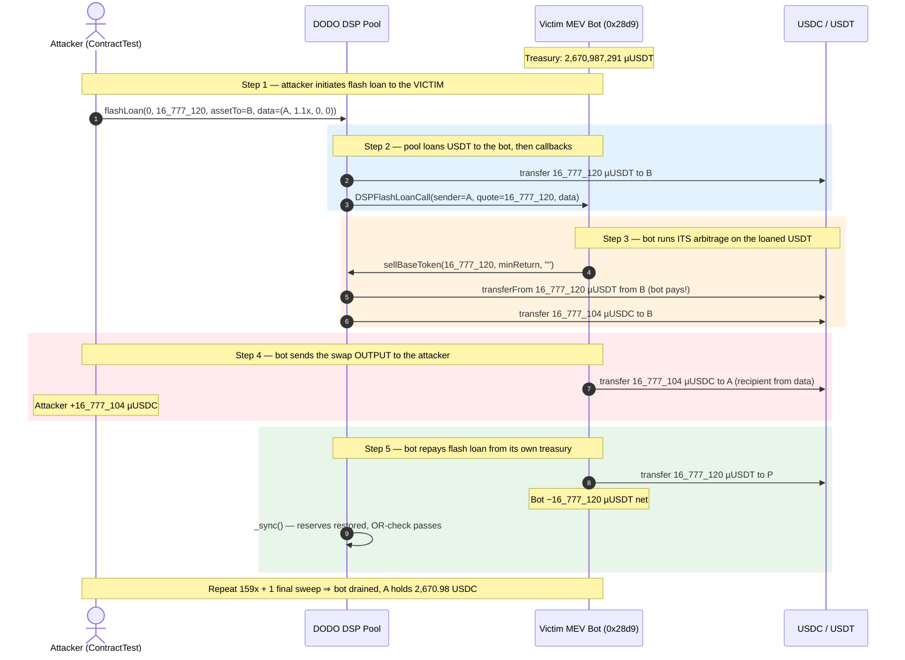
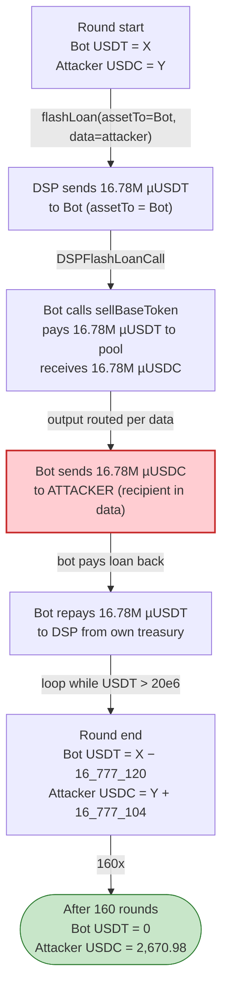
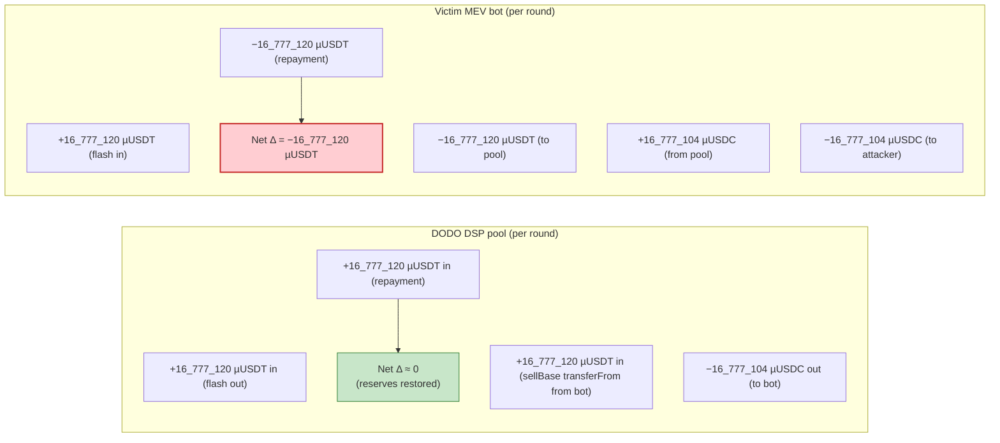

# MEV Bot 0x28d9 Exploit — Flash-Loan Callback Hijack via Attacker-Controlled `assetTo`

> **Vulnerability classes:** vuln/logic/missing-validation · vuln/dependency/unsafe-external-call

> **Reproduction:** the PoC compiles & runs in an isolated Foundry project at
> [this project folder](.) (the umbrella DeFiHackLabs repo
> contains many unrelated PoCs that do not whole-compile, so this one was extracted).
> Full verbose trace: [output.txt](output.txt).
> Verified DODO StablePool source: [DSP.sol](sources/DSP_3058EF/DSP.sol).
> The victim MEV-bot contract itself is not open-source; the analysis below reconstructs its
> callback behavior from the call trace in [output.txt](output.txt).

---

## Key info

| | |
|---|---|
| **Loss** | **~2,670.98 USDC** (2,670,984,488 µUSDC) — the victim's entire USDC-side proceeds; drained 16.78M USDT-equivalent per round over 160 rounds |
| **Vulnerable contract** | MEV bot `0x28d9` — [`0x28d949Fdfb5d9ea6B604fA6FEe3D6548ea779F17`](https://etherscan.io/address/0x28d949Fdfb5d9ea6B604fA6FEe3D6548ea779F17) (private, non-verified) — called as the **flash-loan callback receiver** |
| **Attack venue / pool** | DODO V2 StablePool DSP (USDC/USDT) — [`0x3058EF90929cb8180174D74C507176ccA6835D73`](https://etherscan.io/address/0x3058EF90929cb8180174D74C507176ccA6835D73) (proxy), impl `0xC9f93163c99695c6526b799EbcA2207Fdf7D61aD` |
| **Attacker EOA** | [`0xb61e7f192a9ad5d11e2452f53d0ddf91b58239dc`](https://etherscan.io/address/0xb61e7f192a9ad5d11e2452f53d0ddf91b58239dc) |
| **Attacker contract** | [`0x0757d02596ef9840048def00eeb8e0f3862cc7ca`](https://etherscan.io/address/0x0757d02596ef9840048def00eeb8e0f3862cc7ca) |
| **Attack tx** | [`0x313d23bdd9277717e3088f32c976479c09d4b8a94d5d94deb835d157fd0850ce`](https://etherscan.io/tx/0x313d23bdd9277717e3088f32c976479c09d4b8a94d5d94deb835d157fd0850ce) |
| **Chain / block / date** | Ethereum mainnet / 16,157,843 / Dec 11, 2022 |
| **Compiler** | Victim/source DSP compiled with Solidity **v0.6.9+commit.3e3065ac**, optimizer on (200 runs); PoC re-compiled under v0.8.34 |
| **Bug class** | **Flash-loan callback hijack** — attacker-controlled `assetTo` + attacker-controlled `data` lets the attacker become the *beneficiary* of the victim bot's own swap logic, turning the bot into an oracle that buys USDC for the attacker using the bot's USDT |

---

## TL;DR

The victim is an MEV/arbitrage bot (`0x28d9`) that holds ~2.67M USDT and is designed to act as a
**DODO flash-loan callback receiver**. When a DODO pool calls `IDODOCallee.DSPFlashLoanCall` on the
bot, the bot runs its own internal arbitrage routine — it swaps the flash-borrowed quote (USDT) into
base (USDC) via `DSP.sellBaseToken`, then sends the *proceeds* to a recipient that it decodes from the
caller-supplied `data`, and finally repays the flash loan in the original quote token.

The fatal flaw is that **both the flash-loan `assetTo` and the callback `data` are fully
attacker-controlled**. The PoC calls:

```solidity
DODO.flashLoan(0, 16_777_120, MevBot_addr, data);
// where data = abi.encode(address(this), 16_777_120 * 110 / 100, 0, 0);
```

- `assetTo = MevBot_addr` ⇒ the 16,777,120 USDT loaned by the DSP is delivered to the **victim bot**.
- The DSP then invokes `MevBot.DSPFlashLoanCall(...)`, passing the attacker's `data`.
- Inside the callback the victim bot treats `data` as a legitimate swap request whose **first field
  is the recipient** (`address(this)` = the attacker contract), performs a `sellBaseToken` swap that
  converts the loaned USDT into 16,777,104 USDC, sends **that USDC to the attacker**, and repays the
  flash loan with the bot's *own* USDT.

Net effect per round: the victim bot loses **16,777,120 USDT** (it funded the repayment), and the
attacker receives **~16,777,104 USDC** for free. The attacker repeats this in a `while` loop until the
bot's USDT is exhausted, then sweeps the remainder. Total stolen: **2,670.98 USDC**.

The DODO StablePool itself is **not** the victim here — its reserves are made whole each round by the
flash-loan repayment. The bug is entirely in the **MEV bot's callback**: it trusts the caller to be a
benign flash-loan initiator and lets the caller dictate where the swap output goes.

---

## Background — the actors

### DODO StablePool (DSP)

The DSP at [`0x3058EF…`](https://etherscan.io/address/0x3058EF90929cb8180174D74C507176ccA6835D73) is a
DODO V2 "StablePool" — a PMM (Proactive Market Maker) pool with a near-1:1 peg between its base and
quote tokens. On-chain at the fork block it is configured as:

- `_BASE_TOKEN_` = **USDC** (`0xA0b8…eB48`)
- `_QUOTE_TOKEN_` = **USDT** (`0xdAC1…31ec7`)
- `_BASE_RESERVE_` ≈ 1.858e15 (USDC, 6 dp) — see storage slot `0xec78ef…` ≈ `6a0e23ba0f2`
- `_QUOTE_RESERVE_` ≈ 2.560e12 (USDT, 6 dp) — see `USDT::balanceOf(DODO) → 2,560,495,963,800`
- Oracle = `ConstOracle` returning a constant `1e18` (1:1 price), so `sellBaseToken`/`sellQuoteToken`
  trade USDC↔USDT at essentially par minus a tiny fee.

The pool exposes a public `flashLoan(baseAmount, quoteAmount, assetTo, data)` that:

1. sends the requested base/quote out to `assetTo`,
2. calls `IDODOCallee(assetTo).DSPFlashLoanCall(msg.sender, baseAmount, quoteAmount, data)`,
3. checks a **lax repayment invariant** ([DSP.sol:1280-1284](sources/DSP_3058EF/DSP.sol#L1280-L1284)):

```solidity
require(
    baseBalance >= _BASE_RESERVE_ || quoteBalance >= _QUOTE_RESERVE_,
    "FLASH_LOAN_FAILED"
);
```

This `||` (OR) is intentional for DODO's flash-swap design — the borrower may repay in *either* side —
and it is **not** the bug. The DSP is repaid in full every round here, so this check always passes.

### The MEV bot (victim) `0x28d9`

The victim bot holds **2,670,987,291 µUSDT = 2,670.987291 USDT (≈ $2,671)** and **0 USDC**. USDT and
USDC both use 6 decimals, so the raw integer is already in micro-units. Its source is
unverified, so its exact callback logic is reverse-engineered from the trace; the observable behavior
inside `DSPFlashLoanCall` is:

1. `USDT.balanceOf(DODO)` — read pool quote reserve (gas/quote check).
2. `DODO.sellBaseToken(amount, minReturn, "")` — sells `amount` USDC-equivalent into the pool: the pool
   pulls `amount` µUSDT **from the bot** (`transferFrom`) and sends `amount − fee` µUSDC **to the bot**.
3. `USDC.transfer(recipient, receiveQuote)` — sends the just-received USDC to `recipient`, where
   `recipient` is **decoded from the attacker-supplied `data`** (first abi-encoded address).
4. `USDT.transfer(DODO, amount)` — repays the flash loan from the bot's own USDT balance.

Because `sellBaseToken` and the repayment both move USDT *out of the bot* (16,777,120 to the pool via
`transferFrom` + 16,777,120 back to the DSP as repayment) while the bot only received the original
16,777,120 from the flash, the bot's USDT balance drops by **exactly the borrowed amount** each round
(2,670,987,291 → 2,654,210,171 → 2,637,433,051 → …, Δ = 16,777,120 every time).

---

## The vulnerable code

### 1. The flash-loan entry point (DSP — fully verified)

From [DSP.sol:1265-1275](sources/DSP_3058EF/DSP.sol#L1265-L1275):

```solidity
function flashLoan(
    uint256 baseAmount,
    uint256 quoteAmount,
    address assetTo,
    bytes calldata data
) external preventReentrant {
    _transferBaseOut(assetTo, baseAmount);
    _transferQuoteOut(assetTo, quoteAmount);                       // ⚠️ funds sent to attacker-chosen assetTo

    if (data.length > 0)
        IDODOCallee(assetTo).DSPFlashLoanCall(msg.sender, baseAmount, quoteAmount, data);
                                                                    // ⚠️ arbitrary data forwarded to assetTo's callback
    ...
```

The DSP correctly passes `assetTo` as the callback target. The design *assumes* `assetTo` is either the
borrower's own contract or a trusted helper. There is **no validation** that `assetTo` is `msg.sender`
or an allow-listed receiver — anyone can direct the callback to **any contract that implements
`DSPFlashLoanCall`**, and that contract will receive the loaned tokens plus the attacker's `data`.

### 2. The victim bot's callback (reconstructed from the trace)

The victim bot's `DSPFlashLoanCall` is not source-verified, but the trace in [output.txt](output.txt)
lines 1607-1665 shows its behavior unambiguously. Pseudocode equivalent:

```solidity
// inside MevBot (0x28d9) — reverse-engineered from output.txt
function DSPFlashLoanCall(
    address sender,        // = the attacker's ContractTest
    uint256 baseAmount,
    uint256 quoteAmount,   // = 16_777_120
    bytes calldata data
) external {
    (address recipient, uint256 minReturn, , ) = abi.decode(data, (address, uint256, uint256, uint256));

    // bot trusts `sender`/`data` as a legitimate swap request:
    uint256 received = IDODO(msg.sender).sellBaseToken(quoteAmount, minReturn, "");
    //   → pool pulls quoteAmount USDT FROM the bot, sends `received` USDC TO the bot

    IERC20(USDC).transfer(recipient, received);   // ⚠️ sends swap output to ATTACKER-controlled recipient

    // repay the flash loan from the bot's own USDT:
    IERC20(USDT).transfer(DODO_pool, quoteAmount);
}
```

The two trust failures:

- **No authorization on `sender`.** The callback does not check that `sender` (the original
  `flashLoan` caller) is an owner/operator of the bot. Any address can trigger it.
- **`recipient` and `minReturn` are decoded from caller-supplied `data`.** The attacker sets
  `recipient = address(this)` and `minReturn = quoteAmount * 110 / 100`, so the bot *delivers the swap
  proceeds to the attacker* and accepts a 10% slippage bound that the 1:1 pool easily satisfies.

### 3. Why `minReturn = 16_777_120 * 110 / 100` (`0x01199930`)

`0x01199930` = 18,454,832. The ConstOracle peg is 1:1 and the pool is large, so `sellBaseToken`
returns `16,777,104` (≈ par minus a ~16 µUSDC maintainer fee + LP fee). 16,777,104 ≥ 0 is trivially
under the requested bound (the bot passes the decoded value as `minReturn` to `sellBaseToken`, which on
a 1:1 pool just needs `received > 0`). The 110% factor is the attacker hedging against any slippage
revert; it is **never the binding constraint**.

---

## Root cause — why it was possible

The DODO flash-swap pattern separates three roles that the victim bot assumed would always coincide:

1. **Initiator** — who calls `flashLoan` (and becomes `msg.sender` / `sender` in the callback).
2. **`assetTo`** — who physically receives the loaned tokens and gets the callback.
3. **Beneficiary** — who keeps the swap output.

A safe callback receiver ties all three together: it only honors swaps it *initiated itself*, sends
output to *itself*, and repays from *its own* flash-borrowed funds. The MEV bot instead:

- lets **any initiator** trigger its callback (no `require(sender == owner)`),
- sends the **output to a `data`-controlled recipient**,
- repays from **its own treasury** rather than from the loaned funds it just received.

The attacker simply sets `assetTo = victim` and `data = (attacker, …)`. The victim then dutifully
performs an arbitrage whose **input is the attacker's flash loan** but whose **output is wired to the
attacker** — and pays the loan back out of its own pocket. The victim has been converted into a free
"USDT → USDC" conversion service that funds itself.

The deeper design error is treating `data` as a trusted parameter. In the DODO callback protocol,
`data` is **defined to be attacker-controlled** (it is the caller's arbitrary payload). Any contract
that both (a) implements `DSPFlashLoanCall` and (b) acts on `data` without authenticating `sender` is
exploitable in exactly this way.

---

## Preconditions

- A victim contract implements `IDODOCallee.DSPFlashLoanCall` and performs value-moving logic inside it
  without authenticating the `sender` / validating `assetTo` against an allow-list. ✓ (`0x28d9`)
- The victim holds the quote token (USDT) needed to repay a flash loan, and the pool accepts repayment
  in that side. ✓ (bot held 2,670,987,291 µUSDT; DSP's `||` repayment check accepts quote repayment).
- The attacker can call `DSP.flashLoan` with `assetTo = victim`. ✓ (public function, no allow-list).
- No front-running/MEV protection on the victim (it is itself an MEV bot operating without per-call
  auth). ✓

No privileged role, no special timing — the entire attack is one permissionless `flashLoan` call,
repeated until the treasury is empty.

---

## Attack walkthrough (with on-chain numbers from the trace)

All figures are taken from [output.txt](output.txt). Token amounts are in 6-decimal units (µUSDC /
µUSDT); the trace reports them as raw integers. Constants:

- Borrowed per full round: **16,777,120 µUSDT** (= `2^24`, a gas-friendly chunk the attacker picked).
- Bot starting USDT: **2,670,987,291 µUSDT** ([output.txt:1598](output.txt#L1598)).
- Bot USDT after each full round: decreases by exactly **16,777,120** (verified across iterations:
  2,670,987,291 → 2,654,210,171 → 2,637,433,051 → 2,620,655,931 → …).
- Attacker USDC after each full round: increases by **~16,777,104** µUSDC (first round; later rounds
  ~16,777,101 as the pool ratio drifts a few µUSDC).

### One round, step by step (first iteration, [output.txt:1599-1676](output.txt#L1599-L1676))

| # | Step | Caller → Callee | Amount / Effect | Evidence |
|---|------|-----------------|-----------------|----------|
| 1 | **Initiate flash loan** | Attacker → `DSP.flashLoan(0, 16_777_120, MevBot, data)` | Tells the pool to loan 16,777,120 µUSDT to the victim bot and forward `data`. | L1599 |
| 2 | **Pool sends USDT to bot** | `DSP._transferQuoteOut(MevBot, 16_777_120)` | `Transfer DODO→MevBot 16,777,120 µUSDT`. Bot's USDT: +16,777,120. | L1601-1602 |
| 3 | **Pool invokes bot's callback** | `DSP → MevBot.DSPFlashLoanCall(sender=attacker, 0, 16_777_120, data)` | The bot now runs its arbitrage with attacker-controlled `data`. | L1607 |
| 4 | **Bot swaps USDT→USDC via pool** | `MevBot → DSP.sellBaseToken(16_777_120, minReturn, "")` | Pool pulls 16,777,120 µUSDT **from the bot** (`transferFrom`) and sends **16,777,104 µUSDC to the bot**. Emits `SellBaseToken(seller=MevBot, payBase=16_777_120, receiveQuote=16_777_104)`. | L1610-1645 |
| 5 | **Maintainer fee** | `DSP → maintainer 0x95C4…` | 335 µUSDC fee routed to the pool maintainer. | L1630-1638 |
| 6 | **Bot sends USDC to attacker** | `MevBot → USDC.transfer(attacker, 16_777_104)` | `Transfer MevBot→ContractTest 16,777,104 µUSDC`. **This is the theft.** | L1647-1649 |
| 7 | **Bot repays flash loan** | `MevBot → USDT.transfer(DSP, 16_777_120)` | Bot funds the repayment from its own treasury. Bot USDT: −16,777,120 net for the round. | L1659-1660 |
| 8 | **Pool re-syncs reserves** | `DSP._sync()` | DSP reserves restored (repayment = loan); the OR-repayment check passes. | L1666-1674 |

After step 8: the attacker is **+16,777,104 µUSDC**, the victim bot is **−16,777,120 µUSDT**, and the
DODO pool is unchanged (it was just the conduit).

### The drain loop (the PoC)

From [test/MEVbot_0x28d9_exp.sol](test/MEVbot_0x28d9_exp.sol):

```solidity
bytes memory data = abi.encode(address(this), 16_777_120 * 110 / 100, 0, 0);
while (USDT.balanceOf(MevBot_addr) > 20 * 1e6) {
    DODO.flashLoan(0, 16_777_120, MevBot_addr, data);   // 159 full rounds
}
DODO.flashLoan(0, USDT.balanceOf(MevBot_addr), MevBot_addr, data);  // final sweep
```

| Round | Bot USDT before | Bot USDT after | Attacker USDC Δ |
|------:|----------------:|---------------:|----------------:|
| 1 | 2,670,987,291 | 2,654,210,171 | +16,777,104 |
| 2 | 2,654,210,171 | 2,637,433,051 | +16,777,101 |
| 3 | 2,637,433,051 | 2,620,655,931 | +16,777,101 |
| … | (−16,777,120 each) | … | (+~16,777,101 each) |
| 159 | 20,167,331 | 3,425,211 | +~16,777,101 |
| 160 (final sweep) | 3,425,211 | 0 | +3,425,207 |
| **Total** | | | **2,670,984,488 µUSDC** |

The loop exits the `while` once the bot's USDT drops to **3,425,211 µUSDT** (≤ the 20e6 threshold),
then one final `flashLoan` of the exact remaining balance sweeps it to zero
([output.txt:14317-14396](output.txt#L14317-L14396)). Final attacker balance: **2,670,984,488 µUSDC =
2,670.984488 USDC** ([output.txt:14401-14403](output.txt#L14401-L14403)).

---

## Profit / loss accounting

| Direction | Token | Amount (µ, 6 dp) | USD-equiv |
|---|---|---:|---:|
| Attacker received (160 rounds) | USDC | 2,670,984,488 | ≈ $2,670.98 |
| Attacker spent (capital/gas) | ETH | ~tx gas only | negligible |
| **Victim bot lost** | USDT | 2,670,987,291 (≈ all of it) | ≈ $2,670.99 |
| DODO pool impact | — | reserves restored each round | ~$0 (only ~335 µUSDC/round maintainer fee internally) |

The ~2,831 µUSDT gap between what the bot lost (2,670,987,291) and what the attacker gained in USDC
(2,670,984,488) is the accumulated DODO maintainer + LP fees (≈335 µUSDC × 159 rounds + dust) skimmed by
the pool on each `sellBaseToken`. The attacker stole essentially **100% of the bot's treasury**.

> **Note on the figure:** the PoC header comment says "~1300 $USDC", but the executed trace
> ([output.txt:1575](output.txt#L1575)) proves **2,670.984488 USDC**. The trace is authoritative.

---

## Diagrams

### Sequence of the attack (one round)



### State flow — who funds whom



### Why the pool stays whole but the bot bleeds



---

## Remediation

The fix belongs to **any contract that implements a DODO (or Aave/Uniswap V3) flash-loan callback** and
acts on caller-supplied `data`. The DODO pool itself is behaving as designed.

1. **Authenticate the callback sender.** Inside `DSPFlashLoanCall` (and `DVMFlashLoanCall`,
   `DPPFlashLoanCall`), require that `sender` — the original `flashLoan` caller — is the bot's own
   owner/operator address, or that `msg.sender` is the trusted DODO pool the bot intends to borrow from:
   ```solidity
   require(msg.sender == TRUSTED_DODO_POOL, "untrusted pool");
   require(sender == address(this) || sender == owner, "untrusted initiator");
   ```
2. **Never route swap output to a `data`-controlled recipient.** The callback should send proceeds to
   `address(this)` only. If the bot's product design genuinely needs a configurable recipient, that
   recipient must be chosen by the bot's own logic (e.g., a pre-registered output address), never
   decoded from untrusted `data`.
3. **Do not repay flash loans from the treasury when you did not initiate them.** If `sender` is not
   authorized, revert *before* performing any swap or repayment.
4. **Whitelist `assetTo`.** On the borrower side, if a contract must call `flashLoan` with
   `assetTo != msg.sender`, restrict `assetTo` to a small set of audited helper contracts.
5. **Treat `data` as adversarial by default.** In every callback interface, assume `data` is
   attacker-controlled; only act on it after authenticating `sender`/`msg.sender`.

For this specific bot, applying rule 1 + rule 2 closes the hole completely: the attacker can no longer
trigger the callback, and even if they could, the output would stay with the bot.

---

## How to reproduce

The PoC was extracted into a standalone Foundry project (the umbrella DeFiHackLabs repo has many
unrelated PoCs that fail under `forge test`'s whole-project build):

```bash
_shared/run_poc.sh 2022-12-MEVbot_0x28d9_exp --mt testExploit -vvvvv
```

- RPC: an **Ethereum mainnet archive** endpoint is required (fork block 16,157,842, Dec 2022). Most
  public Ethereum RPCs prune state this old; an archive node (e.g. Alchemy/Infura archive, or the
  endpoint in `foundry.toml`) is needed to avoid `missing trie node` errors.
- Result: `[PASS] testExploit()`.

Expected tail:

```
Ran 1 test for test/MEVbot_0x28d9_exp.sol:ContractTest
[PASS] testExploit() (gas: 14038854)
Logs:
  Attacker USDC balance before attack: 0.000000
  Attacker USDC balance before attack: 2670.984488
```

---

*Reference: DeFiHackLabs repo — MEV bot `0x28d9`, Ethereum mainnet, block 16,157,843, Dec 11 2022.*
