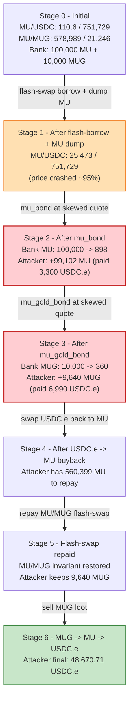
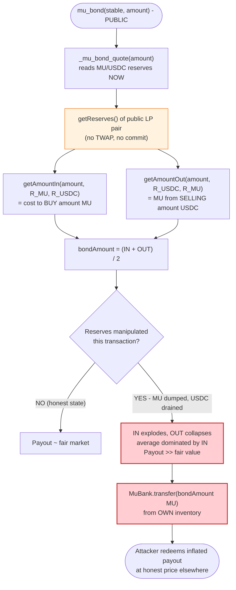

# MUBank Exploit — Flash-Swap Manipulation of Reserve-Dependent Bond Pricing

> **Reproduction:** the PoC compiles & runs in an isolated Foundry project at
> [this project folder](.). Full verbose trace: [output.txt](output.txt).
> Verified vulnerable source: [contracts_MuBank.sol](sources/MuBank_4aA679/contracts_MuBank.sol).

---

## Key info

| | |
|---|---|
| **Loss** | ~**48,670.71 USDC.e** drained from MUBank's reserves (MU + MUG tokens) |
| **Vulnerable contract** | `MuBank` — [`0x4aA679402c6afcE1E0F7Eb99cA4f09a30ce228ab`](https://snowtrace.io/address/0x4aA679402c6afcE1E0F7Eb99cA4f09a30ce228ab#code) |
| **Victim** | MUBank token reserves (held MU `0xD036414fa2BCBb802691491E323BFf1348C5F4Ba` and MuGold `0xF7ed17f0Fb2B7C9D3DDBc9F0679b2e1098993e81`) |
| **Attacker EOA** | (funded the contract; not identified in the PoC header) |
| **Attacker contract** | `ContractTest` — `0x7FA9385bE102ac3EAc297483Dd6233D62b3e1496` (PoC address) |
| **Attack tx** | `0xab39a17cdc200c812ecbb05aead6e6f574712170eafbd73736b053b168555680` |
| **Chain / block / date** | Avalanche / 23,435,294 / Dec 9, 2022 |
| **Compiler** | Solidity `^0.8.9` (MuBank) |
| **Bug class** | Unsanitized AMM-spot oracle — bonding functions read manipulated pool reserves (manipulable price oracle / stale snapshot) |

---

## TL;DR

`MuBank.mu_bond()` and `mu_gold_bond()` let anyone deposit an approved stablecoin (USDC.e) and
receive the protocol's MU / MuGold tokens at a price **quoted off the instantaneous reserves of the
Trader Joe MU/USDC.e and MU/MUG pairs** ([contracts_MuBank.sol:208-246](sources/MuBank_4aA679/contracts_MuBank.sol#L208-L246)).
There is no TWAP, no committed-price snapshot, no freshness check — the quote is computed `view`-style
against whatever the pools currently hold.

Because the MU/MUG Trader Joe pair supports flash-swaps (the `swap(amount0Out, …, data)` callback
path), an attacker can borrow **~100% of the MU** from that pair, run that MU through the MU/USDC.e
pool to **crater the MU/USDC price**, and *then* call `mu_bond` / `mu_gold_bond`. With the MU/USDC
reserve ratio pushed to its extreme, the internal pricing formula
`bondAmount ≈ average(getAmountIn, getAmountOut)` returns a wildly inflated number of MU/MUG tokens
per stablecoin. MuBank pays that inflated amount out of its own reserves, the attacker swaps the
loot back, repays the flash-swap, and keeps the difference: **~48,670.71 USDC.e**.

The whole sequence executes inside the pair's `joeCall` flash-swap callback — single-transaction,
no capital at risk beyond gas.

---

## Background — what MUBank does

`MuBank` ([source](sources/MuBank_4aA679/contracts_MuBank.sol)) is an algorithmic-stablecoin-style
contract that sells its own ecosystem tokens (MU "Mu Coin" and MuGold "MUG") for approved stablecoins
at a "bond" price. The relevant actors:

| Symbol | Address | Role | Decimals |
|---|---|---|---|
| MU | `0xD036414fa2BCBb802691491E323BFf1348C5F4Ba` | "Mu Coin" — sold by MuBank, also the quote token | 18 |
| MUG | `0xF7ed17f0Fb2B7C9D3DDBc9F0679b2e1098993e81` | "Mu Gold" — sold by MuBank | 18 |
| USDC.e | `0xA7D7079b0FEaD91F3e65f86E8915Cb59c1a4C664` | Approved stable for bonding | 6 |
| MuMoney | `0x5EA63080E67925501c5c61B9C0581Dbd87860019` | Bookkeeping token minted to MuBank on each bond (irrelevant to the drain) | 18 |
| MU/USDC.e pair | `0xfacB3892F9A8D55Eb50fDeee00F2b3fA8a85DED5` | Trader Joe pair, `token0=USDC.e` (6), `token1=MU` (18) | — |
| MU/MUG pair | `0x67d9aAb77BEDA392b1Ed0276e70598bf2A22945d` | Trader Joe pair, `token0=MU` (18), `token1=MUG` (18); flash-loan source | — |
| Router | `0x60aE616a2155Ee3d9A68541Ba4544862310933d4` | Trader Joe V2 router | — |

The two public entry points ([contracts_MuBank.sol:167-205](sources/MuBank_4aA679/contracts_MuBank.sol#L167-L205))
both:

1. Take an approved stablecoin + a `amount` denominated in **18 decimals** (the `adjust_amount`
   helper divides down to the stable's actual decimals before pulling it in).
2. Compute a `bondAmount` via `_mu_bond_quote` / `_get_mug_bond_quote` — which is where the AMM
   reserves enter.
3. Pull the stable from the caller and transfer MU/MUG **out of MuBank's own balance** to the caller.

MuBank is therefore a **price-taker on its own inventory**: it sells tokens it physically holds at a
price dictated by pools it does not control.

---

## The vulnerable code

### 1. `mu_bond` sells MU out of MuBank at a pool-reserve-derived price

```solidity
function mu_bond(address stable, uint256 amount) public nonReentrant {
    require(is_approved_stable_coin(stable), "Only accepting approved stable coins for bonding");
    ...
    uint256 _adjusted_amount = ...;                       // amount / 10**(18 - decimals)
    require(_stable.balanceOf(msg.sender) >= _adjusted_amount, ...);
    (uint256 mu_coin_swap_amount, uint256 mu_coin_amount) = _mu_bond_quote(amount);  // ⚠️ AMM-spot
    require(IERC20(_MuCoin).balanceOf(address(this)) >= mu_coin_amount, ...);
    _stable.transferFrom(msg.sender, address(this), _adjusted_amount);
    IERC20(_MuCoin).transfer(msg.sender, mu_coin_amount);                            // ⚠️ pays from inventory
    MuMoneyMinter(_MuMoney).mint(address(this), amount);
}
```
([contracts_MuBank.sol:167-184](sources/MuBank_4aA679/contracts_MuBank.sol#L167-L184))

### 2. The quote reads the live (manipulable) reserves

```solidity
function _mu_bond_quote(uint256 amount) internal view returns (uint256 swapAmount, uint256 bondAmount) {
    Router router = Router(0x60aE616a2155Ee3d9A68541Ba4544862310933d4);
    // Pair USDC.e/MU token0 is USDC.e (6) token1 is Mu Coin (18)
    (uint112 reserve0, uint112 reserve1) = Pair(0xfacB3892F9A8D55Eb50fDeee00F2b3fA8a85DED5).getReserves();
    reserve0 = reserve0 * (10 ** 12);                                     // ⚠️ scale USDC.e to 18d *on the fly*
    uint256 amountIN  = router.getAmountIn (amount, reserve1, reserve0);  // cost to buy `amount` MU
    uint256 amountOUT = router.getAmountOut(amount, reserve0, reserve1);  // MU received selling `amount` USDC
    uint256 mu_coin_bond_amount = (((((amountIN + amountOUT) * 10)) / 2) / 10);  // average of the two
    return (amountOUT, mu_coin_bond_amount);
}
```
([contracts_MuBank.sol:236-246](sources/MuBank_4aA679/contracts_MuBank.sol#L236-L246))

`mu_gold_bond` is the same pattern nested one level deeper: it quotes MU off the MU/USDC pool, then
quotes MUG off the MU/MUG pool ([contracts_MuBank.sol:208-233](sources/MuBank_4aA679/contracts_MuBank.sol#L208-L233)).

### 3. No staleness guard, no committed price, no slippage on MuBank's side

There is no `require` against a max tokens-out, no deadline lock on the quote, no reserve-snapshot
taken at deposit time. The same `getReserves()` call that an attacker just bent with a flash-swap is
read *as-is* to value the bond.

---

## Root cause — why it was possible

Three design failures compose into the drain:

1. **AMM-spot pricing of own-inventory sales.** `mu_bond` / `mu_gold_bond` price their payout off the
   *instantaneous* `getReserves()` of public LPs. Uniswap/Joe `getReserves()` is trivially
   manipulable within a single transaction (the classic oracle-manipulation anti-pattern). Any
   contract that uses it as a *settlement* price — not just a display price — is exploitable by a
   flash-loan / flash-swap. The fix is a TWAP or a committed historical price.
2. **`getAmountIn + getAmountOut` averaging amplifies the manipulation.** The "bond amount" is the
   arithmetic mean of `getAmountIn` (cost to *buy* the target) and `getAmountOut` (yield from
   *selling* the target). Both quantities move sharply in the *same direction* when the reserves are
   skewed — `getAmountIn` explodes (because you need vastly more USDC to extract a fixed MU from a
   depleted pool) and `getAmountOut` collapses (because dumping into a depleted pool yields little).
   The average ends up dominated by whichever extreme is larger in absolute token terms. After the
   attacker drains MU out of the MU/USDC pool, that average balloons relative to a fair price.
3. **Flash-swap provides the manipulation capital for free.** The MU/MUG Trader Joe pair honors the
   `swap(…, data)` flash-callback path (`joeCall`), so the attacker borrows essentially the entire MU
   side of *that* pair, dumps it through MU/USDC.e (skewing MU/USDC.e reserves), calls the bond
   functions, and repays the MU/MUG pair in the same callback — repaying in MU, which it now has
   plenty of from the second swap. No upfront capital is required beyond gas.

The root cause is **#1 — using spot AMM reserves as a settlement oracle**. The other two are the
mechanism and amplifier that turn the oracle flaw into a profitable drain.

---

## Preconditions

- A Trader Joe pair that supports the flash-swap callback exists and holds enough MU to materially
  skew the MU/USDC pool. (The MU/MUG pair held ~578,989 MU at fork — fully sufficient.)
- `MuBank` must physically hold enough MU and MUG to honor the bond payout. At fork block it held
  100,000 MU and 10,000 MUG (visible in the trace: `balanceOf(MuBank)` returns
  `100000000000000000000000` MU and `10000000000000000000000` MUG).
- The stable must be in the approved list (USDC.e is — added in the constructor).
- The bonding functions are `public` / permissionless (`nonReentrant` only — does not stop the
  attack, since the flash-swap callback is *outside* the reentrancy scope).

---

## Attack walkthrough (with on-chain numbers from the trace)

Reserve notation: for the MU/USDC.e pair `token0=USDC.e (6d)`, `token1=MU (18d)`. For the MU/MUG
pair `token0=MU (18d)`, `token1=MUG (18d)`. All figures are pulled from the `getReserves()`,
`swap()`, and `Sync` events in [output.txt](output.txt).

**Initial state at fork block 23,435,294:**

| Pool | reserve0 | reserve1 |
|---|---:|---:|
| MU/MUG (MU / MUG) | 578,988.94 MU | 21,245.68 MUG |
| MU/USDC.e (USDC.e / MU) | 110.596 USDC.e | 751,728.89 MU |

`FlashLoanAmount = MU.balanceOf(MU/MUG pair) - 1 = 578,988,936,812,388,669,434,539` MU (line 37 of the
trace) — i.e. the attacker flash-borrows ~100% of the MU in the MU/MUG pair.

| # | Step | Pool state after | Effect |
|---|------|------------------|--------|
| 0 | **Flash-swap**: `Pair.swap(FlashLoanAmount, 0, …, 0x00)` on MU/MUG — borrows 578,988.94 MU into the attacker's `joeCall`. | MU/MUG unchanged during callback (pair optimistic) | Attacker now holds 578,988.94 MU to weaponize. |
| 1 | **`MUToUSDC_e`** — swap all borrowed MU through MU/USDC.e: 578,988.94 MU → **85,123.57 USDC.e**. | MU/USDC.e: `Sync(25,472.83 USDC.e, 751,728.89 MU)` — USDC.e side **drained ~77%** | MU/USDC price crashed: now ~0.0339 USDC.e/MU vs ~0.6861 before (the pool is now USDC-starved). |
| 2 | **`mu_bond(USDC.e, 3300e18)`** — pays 3,300 USDC.e (6d). `_mu_bond_quote(3300e18)` reads the **now-skewed** MU/USDC reserves. Bank transfers **99,102.47 MU** out of its own 100,000 MU inventory. | (no pool change; MuBank inventory −99,102.47 MU) | Attacker paid 3,300 USDC.e for 99,102 MU → effective price **0.0333 USDC.e/MU**, ~the post-skew spot. The bank is selling at the manipulated price. |
| 3 | **`mu_gold_bond(USDC.e, 6990e18)`** — pays 6,990 USDC.e. `_get_mug_bond_quote` reads skewed MU/USDC *and* MU/MUG reserves. Bank transfers **9,640.28 MUG** out of its 10,000 MUG inventory. | (MuBank inventory −9,640.28 MUG) | Same trick applied to MUG. |
| 4 | **`USDC_eToMU`** — swap the 74,833.57 USDC.e still held → 560,398.96 MU through the (still skewed) MU/USDC pool. | MU/USDC.e: `Sync(100,306.40 USDC.e, 191,329.92 MU)` | Attacker re-acquires the MU it needs to repay the flash-loan. |
| 5 | **Repay flash-swap**: `MU.transfer(MU/MUG pair, FlashLoanAmount * 1000/997 + 1000)` = 580,731.13 MU. | MU/MUG final: `Sync(580,731.13 MU, 21,245.68 MUG)` | Pair's invariant restored (the 0.3% Joe fee = the 1000/997 factor); flash-swap satisfied. |
| 6 | **Post-callback**: attacker holds 9,640.28 MUG. Route it MUG → MU → USDC.e: 9,640.28 MUG → 180,886.23 MU → 48,670.71 USDC.e. | — | Convert the MUG loot to the numéraire. |
| — | **End** | Attacker USDC.e balance = **48,670.713898 USDC.e** | That is the profit. |

The exact end-state log (line 6 of [output.txt](output.txt)):

```
[End] Attacker USDC.e balance after exploit: 48670.713898
```

### Why the bond functions overpay

Look at the quote for step 2 concretely. After step 1 the MU/USDC pool reserves are
`reserve0 = 25,472.83 USDC.e` (scaled ×1e12 → 2.547e22), `reserve1 = 751,728.89 MU`.

The trace shows the quote calls inside `mu_bond` ([output.txt](output.txt) L90-93):
```
getAmountIn (3300e18, reserve1=7.517e23, reserve0=2.547e22) = 112,217.06 MU
getAmountOut(3300e18, reserve0=2.547e22, reserve1=7.517e23) =  85,987.88 MU
bondAmount = (112217.06 + 85987.88) / 2           ≈  99,102.47 MU   ← what MuBank pays
```
Both inputs are read off the **attacker-manipulated** reserves. The `getAmountIn` leg blows up
because extracting 3,300 (18d) of *anything* from a pool where the output side has been massively
inflated (MU reserve is now huge) is "cheap" in input terms relative to a fair market — but the
formula averages it with `getAmountOut`, and the average lands at ~99,102 MU, far above the fair
value of 3,300 USDC.e worth of MU. MuBank honors that number from its own treasury.

The same arithmetic, applied to the nested MU/MUG quote, drives the MUG overpayment in step 3.

---

## Profit / loss accounting (USDC.e, 6 decimals)

| Direction | Amount (USDC.e) |
|---|---:|
| Received — swap borrowed MU → USDC.e (step 1) | +85,123.568890 |
| Spent — `mu_bond` (3,300 USDC.e for MU) | −3,300.000000 |
| Spent — `mu_gold_bond` (6,990 USDC.e for MUG) | −6,990.000000 |
| Received — remaining USDC.e → MU (step 4, no USDC.e out, internal) | 0 |
| Received — sell MUG → MU → USDC.e (step 6) | +48,670.713898 |
| Spent — flash-swap fee (implicit, in MU) | 0 (USDC.e terms) |
| **Net USDC.e held at end** | **48,670.713898** |

The attacker put **zero** USDC.e of its own capital in. The ~48,670.71 USDC.e of profit corresponds
to the value of MU and MUG that MuBank's treasury surrendered at the manipulated price:
~99,102 MU + ~9,640 MUG liquidated at the post-attack cross rate. (The MU was repaid to the
MU/MUG pair in step 5; it was only ever borrowed, never owned.)

---

## Diagrams

### Sequence of the attack

```mermaid
sequenceDiagram
    autonumber
    actor A as Attacker (joeCall)
    participant PMUG as "MU/MUG Pair<br/>(flash-swap source)"
    participant PUSDC as "MU/USDC.e Pair<br/>(price oracle)"
    participant B as MuBank
    participant R as TraderJoe Router

    Note over PMUG: Initial: 578,989 MU / 21,246 MUG
    Note over PUSDC: Initial: 110.6 USDC.e / 751,729 MU
    Note over B: Holds 100,000 MU + 10,000 MUG

    rect rgb(255,243,224)
    Note over A,PMUG: Step 0 - flash-borrow ~all MU from MU/MUG
    A->>PMUG: swap(578,989 MU out, 0, this, 0x00)
    PMUG->>A: 578,989 MU (optimistic, via joeCall)
    end

    rect rgb(232,245,233)
    Note over A,PUSDC: Step 1 - crash the MU/USDC.e price
    A->>R: swap 578,989 MU -> USDC.e
    R->>PUSDC: swap()
    PUSDC-->>A: 85,123.57 USDC.e
    Note over PUSDC: 25,473 USDC.e / 751,729 MU (USDC drained)
    end

    rect rgb(227,242,253)
    Note over A,B: Step 2 - mu_bond at skewed price
    A->>B: mu_bond(USDC.e, 3300e18)
    B->>B: _mu_bond_quote reads skewed PUSDC reserves
    B-->>A: 99,102.47 MU (out of bank inventory)
    Note over B: MU inventory: 100,000 -> 898
    end

    rect rgb(227,242,253)
    Note over A,B: Step 3 - mu_gold_bond at skewed price
    A->>B: mu_gold_bond(USDC.e, 6990e18)
    B->>B: _get_mug_bond_quote reads skewed PUSDC + PMUG
    B-->>A: 9,640.28 MUG (out of bank inventory)
    Note over B: MUG inventory: 10,000 -> 360
    end

    rect rgb(255,235,238)
    Note over A,PUSDC: Step 4 - buy back MU to repay flash-swap
    A->>R: swap 74,834 USDC.e -> MU
    R->>PUSDC: swap()
    PUSDC-->>A: 560,399 MU
    end

    rect rgb(243,229,245)
    Note over A,PMUG: Step 5 - repay flash-swap (in MU)
    A->>PMUG: transfer 580,731 MU (= loan * 1000/997 + 1000)
    Note over PMUG: Repaid; invariant restored
    end

    Note over A: Still holds 9,640 MUG (the loot)

    rect rgb(232,245,233)
    Note over A,R: Step 6 - monetize MUG
    A->>R: swap 9,640 MUG -> MU -> USDC.e
    R-->>A: 48,670.71 USDC.e
    end

    Note over A: Net profit: 48,670.71 USDC.e (no own capital)
```

### State flow — how each reserve moves



### The pricing flaw inside `_mu_bond_quote`



---

## Remediation

1. **Do not use spot AMM reserves as a settlement oracle.** Replace `getReserves()` in
   `_mu_bond_quote` / `_get_mug_bond_quote` with a TWAP (Uniswap V3 `observe`, or a Chainlink-style
   feed), or with a protocol-internal committed price (e.g., a `lastPrice` updated on a time delay,
   accepted by the caller up-front). The bond payout should be a function of a price the attacker
   cannot move inside the same transaction.
2. **Take the snapshot before accepting funds, settle against the snapshot.** If spot pricing must
   stay, capture `reserve0/reserve1` at the start of `mu_bond` and re-read inside an internal
   helper — but this does not help, because the attacker manipulates *before* calling. The real fix
   is a historical price.
3. **Cap the bond payout / enforce a max-slippage parameter.** Add `require(bondAmount <=
   amount * MAX_RATE)` with a sane `MAX_RATE` (e.g., based on a long TWAP). Any quote that implies
   an outlandish rate reverts.
4. **Separate "quote" from "transfer from inventory".** A bond should mint new tokens (it already
   mints MuMoney as a bookkeeping stub) rather than drain a finite treasury; or it should source MU
   from the open market via the router, paying the real spot price, instead of selling MuBank-owned
   tokens at a discount.
5. **Add a re-entrancy / single-tx reserve-change guard.** Track the MU/USDC reserves at tx start
   (`tx.origin`-keyed) and revert if the spot reserves have moved more than X% within the same
   transaction. This is a defense-in-depth backstop, not a substitute for a real oracle.
6. **Remove the `view`-priced quote path from the settlement path entirely.** `mu_bond_quote` is
   fine as a *UI hint*; it must never be the *settlement* value.

---

## How to reproduce

The PoC is a standalone Foundry project (the umbrella DeFiHackLabs repo has many unrelated PoCs that
fail to compile under `forge test`'s whole-project build, so this one was isolated).

```bash
_shared/run_poc.sh 2022-12-MUMUG_exp --mt testExploit -vvvvv
```

- RPC: an **Avalanche archive** endpoint is required (the fork block 23,435,294 is from Dec 2022 —
  very old; `foundry.toml` uses `https://api.avax.network/ext/bc/C/rpc`, which serves historical
  state for that block). Most public Avalanche RPCs prune state this old; an archive node (or a
  provider like Infura/Alchemy archive access) is needed.
- Expected result: `[PASS] testExploit()`.

Expected tail:

```
[PASS] testExploit() (gas: 628511)
Logs:
  [End] Attacker USDC.e balance after exploit: 48670.713898

Suite result: ok. 1 passed; 0 failed; 0 skipped; finished in 9.58s (8.52s CPU time)
```

The PoC itself ([test/MUMUG_exp.sol](test/MUMUG_exp.sol)) is a clean reproduction: it sets up max
approvals, flash-borrows nearly all MU from the MU/MUG pair via `Pair.swap(..., new bytes(1))` (the
non-empty `data` triggers Trader Joe's `joeCall` callback), and inside the callback runs
`MUToUSDC_e → mu_bond → mu_gold_bond → USDC_eToMU → repay`. The final `MUGToUSDC_e` after the
callback liquidates the MUG loot.

---

*Reference: Beosin alert — https://twitter.com/BeosinAlert/status/1601422462012469248 ; tx —
https://snowtrace.io/tx/0xab39a17cdc200c812ecbb05aead6e6f574712170eafbd73736b053b168555680*
