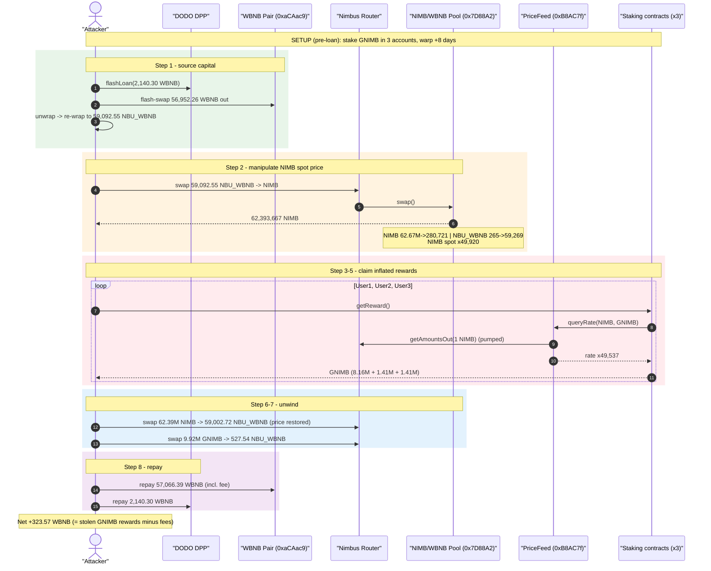
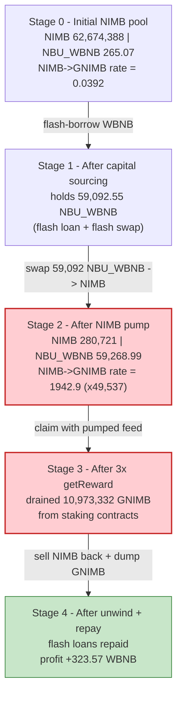
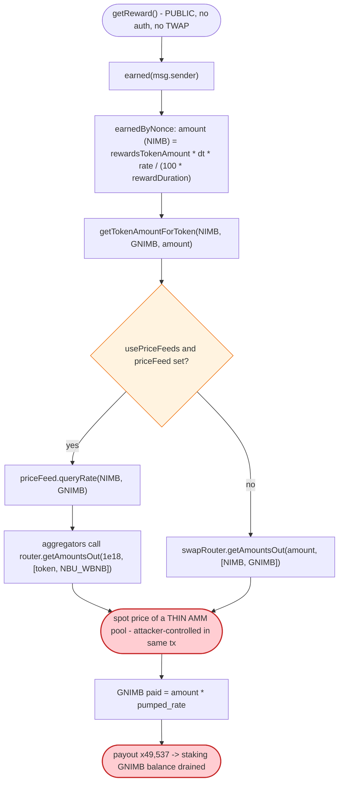

# Nimbus Platform Exploit — Flash-Loan AMM Spot-Price Manipulation of Staking Rewards

> **Reproduction:** the PoC compiles & runs in an isolated Foundry project at
> [this project folder](.) (the umbrella DeFiHackLabs repo contains many unrelated PoCs that do not
> whole-compile, so this one was extracted).
> Full verbose trace: [output.txt](output.txt).
> Verified vulnerable source:
> [StakingRewardsFixedAPY.sol](sources/StakingRewardFixedAPY_3aA2B9/contracts_contracts_BSC_Staking_StakingRewardsFixedAPY.sol)
> and [LockStakingRewardFixedAPY.sol](sources/LockStakingRewardFixedAPY_706065/contracts_contracts_BSC_Staking_LockStakingRewardFixedAPY.sol).

---

## Key info

| | |
|---|---|
| **Loss** | ~$370K reported (SlowMist). PoC nets **323.57 WBNB** of self-recovered profit on the fork; the protocol bled ≈ **10.97M GNIMB** of inflated reward payouts. |
| **Vulnerable contracts** | `StakingRewardFixedAPY` — [`0x3aA2B9de4ce397d93E11699C3f07B769b210bBD5`](https://bscscan.com/address/0x3aA2B9de4ce397d93E11699C3f07B769b210bBD5#code); `LockStakingRewardFixedAPY` — [`0x706065…`](https://bscscan.com/address/0x706065716569f20971F9CF8c66D092824c284584#code) and [`0xdEF57A…`](https://bscscan.com/address/0xdEF57A7722D4411726ff40700Eb7b6876BEE7ECB#code) |
| **Reward-rate oracle (price feed)** | `PriceFeed` [`0xB8AC7faBFF0d901878c269330b32CDD8D2Ba3b8c`](https://bscscan.com/address/0xB8AC7faBFF0d901878c269330b32CDD8D2Ba3b8c) → aggregators `0x199600…` (NIMB) & `0x58edBb…` (GNIMB), both reading the Nimbus AMM router |
| **Manipulated pool** | NIMB / NBU_WBNB pair `0x7D88A2390F8B5070acF5188e8879aA7Ba2f2A60C` (priced via Nimbus router `0x2C6cF65f3cD32a9Be1822855AbF2321F6F8f6b24`) |
| **Tokens** | NIMB `0xCb492C701F7fe71bC9C4B703b84B0Da933fF26bB`, GNIMB `0x99C486b908434Ae4adF567e9990A929854d0c955`, NBU_WBNB `0xA2CA18FC541B7B101c64E64bBc2834B05066248b` |
| **Flash-loan sources** | DODO DPP `0x0fe261aeE0d1C4DFdDee4102E82Dd425999065F4` (2,140.30 WBNB) + flash-swap from WBNB pair `0xaCAac9311b0096E04Dfe96b6D87dec867d3883Dc` (56,952.26 WBNB) |
| **Attack txs** | `0x7d2d8d2cda2d81529e0e0af90c4bfb39b6e74fa363c60b031d719dd9d153b012`, `0x42f56d3e86fb47e1edffa59222b33b73e7407d4b5bb05e23b83cb1771790f6c1` |
| **Chain / fork block / date** | BSC / 23,639,507 / Dec 2022 |
| **Compiler** | StakingRewardFixedAPY: Solidity v0.8.7, optimizer 1 (LockStaking: v0.8.15) |
| **Bug class** | Reward oracle uses manipulable AMM spot price (`getAmountsOut`) — flash-loan price manipulation |

---

## TL;DR

The three Nimbus staking contracts pay rewards denominated in one token but **price** those rewards
through `PriceFeed.queryRate()`, which ultimately derives its answer from the **instantaneous spot
price** of the Nimbus AMM (`swapRouter.getAmountsOut(1e18, path)`). The reward token (NIMB) trades in
a thin pool: only **265 NBU_WBNB against 62.67M NIMB**.

The attacker flash-borrows WBNB, dumps ≈ **59,000 NBU_WBNB into the NIMB pool**, pumping NIMB's spot
price by **≈ 49,920×**. With NIMB now "priced" almost 50,000× higher, the staking contracts' reward
conversion `NIMB → GNIMB` inflates by **≈ 49,537×**, so the attacker's three pre-staked positions
`getReward()` out a combined **10.97M GNIMB** instead of a few hundred. The attacker then sells the
NIMB back (recovering most of the manipulation capital) and dumps the windfall GNIMB for WBNB,
repaying both flash loans and walking away with **323.57 WBNB**.

The root cause is identical to the canonical Nimbus class of bug: **a fixed-APY reward calculation
that trusts a one-block AMM quote as its oracle.**

---

## Background — what the Nimbus staking contracts do

Nimbus offered "fixed-APY" staking. A user stakes `stakingToken` (here GNIMB), and over time accrues
rewards denominated in `rewardsToken` (here NIMB), paid out in `rewardsPaymentToken` (here GNIMB).
Because the staked token, reward token, and payment token differ, the contracts must convert between
them — and they do so with a price feed that falls back to the AMM router:

```solidity
function getTokenAmountForToken(address tokenSrc, address tokenDest, uint256 tokenAmount) public view returns (uint) {
    if (tokenSrc == tokenDest) return tokenAmount;
    if (usePriceFeeds && address(priceFeed) != address(0)) {
        (uint256 rate, uint256 precision) = priceFeed.queryRate(tokenSrc, tokenDest);
        return tokenAmount * rate / precision;          // ← rate is a live spot quote
    }
    address[] memory path = new address[](2);
    path[0] = tokenSrc;
    path[1] = tokenDest;
    return swapRouter.getAmountsOut(tokenAmount, path)[1]; // ← or a raw AMM quote
}
```
[StakingRewardsFixedAPY.sol:205-215](sources/StakingRewardFixedAPY_3aA2B9/contracts_contracts_BSC_Staking_StakingRewardsFixedAPY.sol#L205-L215)

At the fork block these contracts ran with `usePriceFeeds = true`, but the configured `PriceFeed`
(`0xB8AC7faBFF…`) is itself just a wrapper: `queryRate(NIMB, GNIMB)` divides two `latestAnswer()`
results from per-token aggregators, and **each aggregator simply calls
`router.getAmountsOut(1e18, [token, NBU_WBNB])`** against the live Nimbus pools. So whether through
the price feed or the direct fallback, the conversion bottoms out at a **manipulable single-block AMM
quote** ([output.txt:138-153](output.txt#L138)).

On-chain parameters relevant to the attack (read from the trace):

| Parameter | Value |
|---|---|
| `rewardsToken` (all 3 stakers) | **NIMB** (`0xCb49…`) |
| `rewardsPaymentToken` | **GNIMB** (`0x99C4…`) |
| `stakingToken` | **GNIMB** |
| NIMB pool `0x7D88A2…` reserves (pre-attack) | **62,674,388 NIMB / 265.07 NBU_WBNB** ← thin, cheap NIMB |
| GNIMB pool `0x68D8fa…` reserves (pre-attack) | **9,574,977 GNIMB / 1,032.5 NBU_WBNB** |
| Honest NIMB→GNIMB conversion | ≈ **0.0392 GNIMB per NIMB** |

That thin NIMB pool is the whole game: 1 NIMB is worth only `4.216e12` wei of NBU_WBNB, so a few tens
of thousands of NBU_WBNB completely repriced it.

---

## The vulnerable code

### 1. `earned` prices rewards through the AMM-backed feed

```solidity
function earnedByNonce(address account, uint256 nonce) public view returns (uint256) {
    uint256 amount = stakeNonceInfos[account][nonce].rewardsTokenAmount *
        (block.timestamp - stakeNonceInfos[account][nonce].stakeTime) *
         stakeNonceInfos[account][nonce].rewardRate / (100 * rewardDuration);
    return getTokenAmountForToken(address(rewardsToken), address(rewardsPaymentToken), amount);
    //                            ^^^^ NIMB        ^^^^ GNIMB  ← conversion uses spot price
}

function earned(address account) public view override returns (uint256 totalEarned) {
    for (uint256 i = 0; i < stakeNonces[account]; i++) {
        totalEarned += earnedByNonce(account, i);
    }
}
```
[StakingRewardsFixedAPY.sol:111-122](sources/StakingRewardFixedAPY_3aA2B9/contracts_contracts_BSC_Staking_StakingRewardsFixedAPY.sol#L111-L122)

`rewardsTokenAmount` (a NIMB-denominated figure) is fixed at stake time, but the **conversion of that
NIMB amount into the GNIMB actually transferred is recomputed at the moment of claim** using the live
NIMB price. Pump NIMB just before claiming and `earned()` balloons.

### 2. `getReward` pays out the inflated figure

```solidity
function getReward() public override nonReentrant whenNotPaused {
    uint256 reward = earned(msg.sender);          // ← spot-priced
    if (reward > 0) {
        for (uint256 i = 0; i < stakeNonces[msg.sender]; i++) {
            stakeNonceInfos[msg.sender][i].stakeTime = block.timestamp;
        }
        rewardsPaymentToken.safeTransfer(msg.sender, reward);  // ← pays GNIMB
        emit RewardPaid(msg.sender, address(rewardsPaymentToken), reward);
    }
}
```
[StakingRewardsFixedAPY.sol:177-186](sources/StakingRewardFixedAPY_3aA2B9/contracts_contracts_BSC_Staking_StakingRewardsFixedAPY.sol#L177-L186)

`getReward()` is permissionless. There is **no oracle freshness check, no TWAP, no deviation bound,
and no reentrancy of the price source against the swap that just moved it** — the function simply
trusts whatever `earned()` returns. The same code exists verbatim in the two `LockStakingRewardFixedAPY`
contracts ([LockStakingRewardFixedAPY.sol:115-127, 184-194](sources/LockStakingRewardFixedAPY_706065/contracts_contracts_BSC_Staking_LockStakingRewardFixedAPY.sol#L115-L127)).

### 3. The conversion symmetry that the attacker breaks

At stake, `_stake` records `rewardsTokenAmount = getEquivalentAmount(amount)` =
`getTokenAmountForToken(GNIMB, NIMB, amount)` — a `queryRate(GNIMB, NIMB)` at the **honest** price
([StakingRewardsFixedAPY.sol:142-156, 228-237](sources/StakingRewardFixedAPY_3aA2B9/contracts_contracts_BSC_Staking_StakingRewardsFixedAPY.sol#L142-L156)).
At claim, `earnedByNonce` converts NIMB → GNIMB with `queryRate(NIMB, GNIMB)`. These are inverse
operations, so an honest round trip cancels. The exploit **decouples the two**: the stake-side rate is
captured cheaply, the claim-side rate is captured while NIMB is pumped ≈ 50,000×, so the GNIMB paid out
vastly exceeds the GNIMB that should be owed.

---

## Root cause

> **A reward accounting system must never price an asset using a value that the claimant can move in the
> same transaction.** Nimbus priced its `rewardsToken` (NIMB) using the AMM's instantaneous
> `getAmountsOut` quote against a thin pool. `getReward()` is callable by anyone, in the same
> transaction as a swap that distorts that quote.

Four design decisions compose into the bug:

1. **Spot-price oracle.** Both the direct fallback (`swapRouter.getAmountsOut`) and the configured
   `PriceFeed.queryRate` (which itself calls `getAmountsOut` on the router) read the pool's
   *current-block* reserves. No TWAP, no Chainlink-style external feed, no staleness window.
2. **Thin reward-token pool.** The NIMB/NBU_WBNB pool held only **265 NBU_WBNB** of liquidity, so a few
   tens of thousands of borrowed NBU_WBNB repriced NIMB by ~50,000×.
3. **Permissionless, atomic claim.** `getReward()` has no access control and runs in the same
   transaction as the manipulating swap, so the manipulated price is read before the market can correct.
4. **Reward denominated in the manipulated token.** Because rewards are priced in NIMB but paid in GNIMB,
   inflating the NIMB→GNIMB conversion directly inflates the GNIMB payout — value that comes straight out
   of the staking contracts' GNIMB balance.

---

## Preconditions

- Attacker holds (or can flash-borrow) enough capital to move the thin NIMB pool. The PoC sources it
  from a DODO flash loan (2,140.30 WBNB) plus a flash-swap from the WBNB pair `0xaCAac9…`
  (56,952.26 WBNB) — all repaid intra-transaction, hence **fully flash-loanable**.
- Attacker has staked positions whose `rewardRate × elapsed time` is non-trivial. The PoC seeds three
  fresh stakes and `warp`s **8 days** so rewards accrue
  ([test/Nmbplatform_exp.sol:64-75](test/Nmbplatform_exp.sol#L64-L75)).
- Staking contracts must hold enough `rewardsPaymentToken` (GNIMB) to pay the inflated claim. In the
  live incident the contracts were funded; the PoC tops them up with `deal`/`transfer`
  ([test/Nmbplatform_exp.sol:104-111, 161](test/Nmbplatform_exp.sol#L104-L111)) so the manipulated
  payout can be fully realized on the fork.

---

## Attack walkthrough (with on-chain numbers from the trace)

The NIMB pool `0x7D88A2…` is ordered `reserve0 = NBU_WBNB`, `reserve1 = NIMB`.

**Setup (before the flash loan):**

| # | Step | Source |
|---|------|--------|
| S1 | Wrap 20 BNB → NBU_WBNB, fund three sub-accounts (16 / 2 / 2 NBU_WBNB). | [test:68-71](test/Nmbplatform_exp.sol#L68-L71) |
| S2 | Each sub-account swaps NBU_WBNB → GNIMB and `stake()`s it (User1 stakes 150,259 GNIMB). | [test:72-74](test/Nmbplatform_exp.sol#L72-L74), [output.txt:138](output.txt#L138) |
| S3 | `warp(+8 days)` so the fixed-APY rewards accrue. | [test:75](test/Nmbplatform_exp.sol#L75) |

**Exploit (inside the DODO flash-loan callback → flash-swap callback):**

| # | Step | NIMB pool: NIMB reserve | NIMB pool: NBU_WBNB reserve | NIMB spot (per 1 NIMB) |
|---|------|-----------------------:|----------------------------:|-----------------------:|
| 0 | **Pre-attack** | 62,674,388 | 265.07 | `4.216e12` wei |
| 1 | Flash-borrow 2,140.30 WBNB (DODO) → flash-swap 56,952.26 WBNB out of pair `0xaCAac9…` → unwrap → re-wrap to **59,092.55 NBU_WBNB** | 62,674,388 | 265.07 | unchanged |
| 2 | **Manipulate:** swap **59,092.55 NBU_WBNB → 62,393,667 NIMB** on the Nimbus router | **280,721** | **59,268.99** | **`2.104e17` wei (×49,920)** |
| 3 | **`User1.getReward()`** — `earned()` reads the pumped feed → pays **8,157,094 GNIMB** | 280,721 | 59,268.99 | pumped |
| 4 | Top up + **`User2.getReward()`** → **1,408,122 GNIMB** | 280,721 | 59,268.99 | pumped |
| 5 | Top up + **`User3.getReward()`** → **1,408,116 GNIMB** | 280,721 | 59,268.99 | pumped |
| 6 | **Unwind NIMB:** swap **62,393,667 NIMB → 59,002.72 NBU_WBNB** back | 62,580,797 | 266.26 | ≈ restored |
| 7 | **Dump windfall:** swap **9,916,381 GNIMB → 527.54 NBU_WBNB** | — | — | — |
| 8 | Unwrap NBU_WBNB → BNB → WBNB; repay flash-swap **57,066.39 WBNB** to `0xaCAac9…` and **2,140.30 WBNB** to DODO | — | — | — |

The price-feed manipulation is visible directly in the trace: the NIMB aggregator's `latestAnswer()`
jumps from `4.216e12` ([output.txt:144](output.txt#L144)) to `2.104e17`
([output.txt:497](output.txt#L497)), while the GNIMB aggregator barely moves
(`1.075e14` → `1.083e14`). Consequently `queryRate(NIMB, GNIMB)` rises from **0.0392 → 1942.9
GNIMB/NIMB**, an inflation of **≈ 49,537×**, which is exactly what blows up `earned()`.

---

## Profit / loss accounting (WBNB)

| Direction | Amount (WBNB) |
|---|---:|
| Borrowed — DODO flash loan | 2,140.30 |
| Borrowed — flash-swap from pair `0xaCAac9…` | 56,952.26 |
| Recovered — NIMB round-trip sell-back (step 6) | 59,002.72 (as NBU_WBNB) |
| Recovered — dumping 9.92M GNIMB windfall (step 7) | 527.54 (as NBU_WBNB) |
| Repaid — flash-swap (incl. 0.2% fee = 114.13) | −57,066.39 |
| Repaid — DODO | −2,140.30 |
| **Net profit** | **+323.57 WBNB** |

The 323.57 WBNB profit is essentially the **value of the ~10.97M GNIMB stolen from the staking
contracts** (sold for 527.54 NBU_WBNB) **minus** the round-trip slippage/fees of the NIMB pump
(~114 WBNB flash-swap fee plus AMM fees on the NIMB and GNIMB legs). Total inflated rewards drained:
**8,157,094 + 1,408,122 + 1,408,116 = 10,973,332 GNIMB**.

Trace confirmation: `Attacker WBNB balance after exploit: 323.574421888880394720`
([output.txt:6](output.txt#L6)).

---

## Diagrams

### Sequence of the attack



### Pool / price-feed state evolution



### Why the reward inflates: the oracle path inside `getReward`



---

## Why each magic number

- **The 8-day warp** ([test:75](test/Nmbplatform_exp.sol#L75)): the fixed-APY reward grows with
  `(block.timestamp - stakeTime)`. 8 days of accrual gives a `rewardsTokenAmount × dt` base large enough
  that, when multiplied by the ~49,537× price inflation, the GNIMB payout dwarfs the staked principal.
- **≈ 59,000 NBU_WBNB into the NIMB pool**: sized to move a pool holding only 265 NBU_WBNB of
  liquidity. This is what produces the ~49,920× NIMB spot-price jump; anything much smaller would not
  inflate `queryRate` enough to make the attack profitable after fees.
- **Two flash sources (DODO + pair flash-swap)**: the NIMB pump needs ~59K NBU_WBNB of working capital,
  more than the single DODO pool can supply, so the attacker chains a Uniswap-V2-style flash-swap from
  the WBNB pair to top up — and repays it with the 0.2% Nimbus fee
  (`flashSwapAmount * 1000 / 998 + 1000`, [test:121](test/Nmbplatform_exp.sol#L121)).

---

## Remediation

1. **Do not use AMM spot price as an oracle for reward accounting.** Replace
   `swapRouter.getAmountsOut` / spot `queryRate` with a manipulation-resistant source: a Chainlink feed,
   or at minimum a time-weighted average price (TWAP) sampled over many blocks.
2. **Lock the conversion rate at stake time, not claim time.** If rewards are denominated in one token
   and paid in another, snapshot the conversion when the obligation is created (or accrue in payment-token
   units directly), so a one-block price move at claim cannot change what is owed.
3. **Bound oracle deviation and enforce freshness.** Reject a quote that deviates more than a small
   percentage from a trailing TWAP, or that is stale, before paying anything.
4. **Avoid pricing rewards through thin pools.** Any asset whose pool can be moved meaningfully by a
   single flash-loan-sized swap is unsafe as a reward-pricing reference.
5. **Make reward claims robust to atomic manipulation.** Even a same-block check that the pool reserves
   match a recent snapshot would have blocked the attack, since the manipulating swap and the claim share
   a transaction.

---

## How to reproduce

```bash
_shared/run_poc.sh 2022-12-Nmbplatform_exp --mt testExploit -vvvvv
```

- RPC: a **BSC archive** endpoint is required (fork block 23,639,507). `foundry.toml` points `bsc` at
  `https://bsc-mainnet.public.blastapi.io`, which serves historical state at that block; most public BSC
  RPCs prune it.
- Result: `[PASS] testExploit()` with `Attacker WBNB balance after exploit: 323.574…`.

Expected tail ([output.txt:4-6, 831](output.txt#L4)):

```
Ran 1 test for test/Nmbplatform_exp.sol:ContractTest
[PASS] testExploit() (gas: 7141781)
Logs:
  Attacker WBNB balance after exploit: 323.574421888880394720

Suite result: ok. 1 passed; 0 failed; 0 skipped
```

---

*References: BlockSec — https://twitter.com/BlockSecTeam/status/1602877048124735489 ; SlowMist Hacked — https://hacked.slowmist.io/ (Nimbus Platform, BSC, Dec 2022).*
