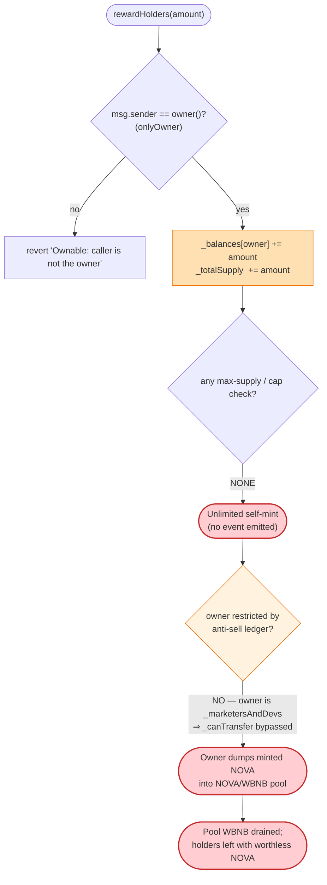

# Nova Exchange Exploit — Owner-Only Unlimited Mint via `rewardHolders()`

> **Reproduction:** the PoC compiles & runs in an isolated Foundry project at
> [this project folder](.) (the umbrella DeFiHackLabs repo contains many
> unrelated PoCs that do not whole-compile, so this one was extracted).
> Full verbose trace: [output.txt](output.txt).
> Verified vulnerable source: [Nova.sol](sources/Nova_B5B275/Nova.sol).

---

## Key info

| | |
|---|---|
| **Loss** | The token's value was rugged via unlimited owner minting; the PoC demonstrates the owner doubling its own balance by **+10,000,000,000 NOVA** (raw `1e28`, 9 decimals) in a single call. The realized profit is whatever the inflated NOVA could be dumped into the WBNB/NOVA pool for (the PoC's commented-out sell leg fails on a slippage / decimals issue and is disabled). |
| **Vulnerable contract** | `Nova` (token "Nova Exchange") — [`0xB5B27564D05Db32CF4F25813D35b6E6de9210941`](https://bscscan.com/address/0xB5B27564D05Db32CF4F25813D35b6E6de9210941#code) |
| **Victim / pool** | NOVA/WBNB PancakeSwap pair (created in the token constructor); WBNB = `0xbb4CdB9CBd36B01bD1cBaEBF2De08d9173bc095c` |
| **Attacker = contract owner** | EOA `0xCBF184b8156e1271449CFb42A7D0556A8DCFEf72` (the `onlyOwner` of the Nova token) |
| **Attack tx** | [`0xf743dba906255cf6f75f8243ef8192f2a211aacf03df99322584686b5c445c23`](https://bscscan.com/tx/0xf743dba906255cf6f75f8243ef8192f2a211aacf03df99322584686b5c445c23) |
| **Chain / block / date** | BSC / fork at block **23,749,678** / ~Dec 9, 2022 |
| **Compiler** | Solidity **v0.8.9** (`+commit.e5eed63a`), optimizer **off** (runs 200, per verified source meta) |
| **Bug class** | Privileged backdoor — `onlyOwner` unlimited mint disguised as a "reward holders" feature (rug-pull infrastructure) |

References: [Beosin alert](https://twitter.com/BeosinAlert/status/1601168659585454081) · SlowMist Hacked DB.

---

## TL;DR

Nova Exchange's token contract ships a function literally named `rewardHolders(uint256 amount)`
([Nova.sol:414-417](sources/Nova_B5B275/Nova.sol#L414-L417)) that is gated only by `onlyOwner` and
does exactly two things: **credits `amount` straight to the owner's balance and adds `amount` to
`_totalSupply`** — with no cap, no source of funds, and no relation to any actual reward
distribution. It is an unlimited mint backdoor.

The deployer/owner called `rewardHolders(1e28)` to mint **10,000,000,000 NOVA** to itself in one
transaction, doubling its already-inflated holdings (the token's *initial* supply per the source is
only 100,000,000 NOVA, yet by the fork block the supply had already been pumped to ~10 billion via
prior `rewardHolders` calls). The freshly-minted NOVA is then meant to be dumped into the
NOVA/WBNB pool for real WBNB — a classic mint-and-dump rug. There is no "exploit" of a flaw by an
outside party here: **the contract is working as written, and as written it is a honeypot.**

---

## Background — what the Nova token does

`Nova` ([source](sources/Nova_B5B275/Nova.sol)) is an ERC20 with 9 decimals that bolts a
transfer-restriction / anti-sell mechanism onto a standard token:

- **Constructor** ([Nova.sol:320-330](sources/Nova_B5B275/Nova.sol#L320-L330)) creates a
  PancakeSwap NOVA/WBNB pair, mints the entire initial supply
  (`_totalSupply = (10**8) * (10**9)` = 100,000,000 NOVA) to the deployer, and sets `master = owner`.
- **Anti-sell ledger.** Every transfer routes through `_canTransfer`
  ([:423-440](sources/Nova_B5B275/Nova.sol#L423-L440)) and `_beforeTokenTransfer`
  ([:484-498](sources/Nova_B5B275/Nova.sol#L484-L498)), which track each address's cumulative
  buys (`_buySum`), sells (`_sellSum`), and sold-ETH (`_sellSumETH`). A normal holder can only sell
  back to the pool if it has *bought at least as much as it is selling* (`bought >= sold + amount`)
  and stays under `_theNumber` / `_theRemainder` limits. This is the "you can't dump on us" trap that
  applies to **everyone except** privileged addresses.
- **Privileged escape hatches.** `_isSuper` (the router/pair) and the `_marketersAndDevs` allow-list
  ([:419-440](sources/Nova_B5B275/Nova.sol#L419-L440)) bypass the anti-sell ledger entirely. The
  owner is on `_marketersAndDevs` from construction
  ([:327](sources/Nova_B5B275/Nova.sol#L327)), so the owner is free to transfer/sell without the
  buy>=sell constraint that shackles real users.
- **Owner mint backdoor.** `rewardHolders(uint256)` and `burn(uint256)`
  ([:383-417](sources/Nova_B5B275/Nova.sol#L383-L417)) let the owner arbitrarily inflate or deflate
  supply and its own balance.

On-chain state at the fork block (from the `-vvvvv` trace's `balanceOf` and storage diff):

| Item | Value |
|---|---|
| `decimals` | 9 |
| Source's initial `_totalSupply` | 100,000,000 NOVA |
| Actual `_totalSupply` at fork (slot diff before) | ~**10,000,000,000 NOVA** (already inflated ~100x) |
| Owner/attacker NOVA balance before | `10000000000020000000000000000` raw = **~10,000,000,000.02 NOVA** |
| Owner/attacker NOVA balance after | `20000000000020000000000000000` raw = **~20,000,000,000.02 NOVA** |

The gap between the source's declared 100M initial supply and the ~10B already in existence at the
fork block is itself the smoking gun: `rewardHolders` had been called repeatedly before the captured
transaction. The PoC simply captures one more invocation.

---

## The vulnerable code

The entire bug is four lines:

```solidity
// Nova.sol:414-417
function rewardHolders(uint256 amount) external onlyOwner {
    _balances[owner()] += amount;   // ⚠️ mint to owner, no cap, no funding
    _totalSupply += amount;         // ⚠️ inflate supply by the same amount
}
```

[Nova.sol:414-417](sources/Nova_B5B275/Nova.sol#L414-L417)

There is **no upper bound, no max-supply check, no vesting, no event, and no relationship to any
distribution to actual "holders."** The name `rewardHolders` is pure misdirection — it rewards
exactly one address: `owner()`.

For contrast, the *symmetric* function `burn` is also owner-only and also touches the same two slots,
confirming the owner has full unilateral control over supply:

```solidity
// Nova.sol:383-386
function burn(uint256 amount) external onlyOwner {
    _balances[owner()] -= amount;
    _totalSupply -= amount;
}
```

And the owner is exempt from the anti-sell trap that locks everyone else
([:424](sources/Nova_B5B275/Nova.sol#L424), set at construction
[:327](sources/Nova_B5B275/Nova.sol#L327)):

```solidity
// Nova.sol:423-426
function _canTransfer(address sender, address recipient, uint256 amount) private view returns (bool) {
    if (_marketersAndDevs[sender] || _marketersAndDevs[recipient]) {
        return true;   // owner is _marketersAndDevs[owner] = true → always transferable
    }
    ...
```

So the owner can mint freely **and** sell freely into the pool, while ordinary buyers are forbidden
from selling more than they bought.

---

## Root cause — why it was possible

This is not a logic error exploited by a third party; it is a **deliberate centralization backdoor**.
Three design decisions compose into a rug:

1. **Unbounded privileged mint.** `rewardHolders` lets `owner` inflate supply and its own balance to
   any value at will. There is no `MAX_SUPPLY` ceiling and no cap on `amount`.
2. **Asymmetric transfer restrictions.** Normal holders are trapped by the `bought >= sold + amount`
   rule in `_canTransfer` (a honeypot: you can buy but you cannot sell), while the owner is
   allow-listed out of that rule via `_marketersAndDevs`.
3. **No transparency.** `rewardHolders` emits no `Transfer(address(0), owner, amount)` mint event, so
   the inflation is invisible to naive holders and trackers watching for standard ERC20 mints.

Together: the owner mints arbitrary NOVA to itself, the pool's NOVA/WBNB price gives that NOVA real
WBNB value, and the owner — uniquely able to sell — dumps the minted tokens for WBNB, draining the
pool's WBNB at the expense of everyone who bought NOVA. The minting half is what the captured
transaction proves mechanically; the dump half is the realized loss.

---

## Preconditions

- Caller must be `owner()` of the Nova token. In the live incident the owner was the rug operator;
  the PoC reproduces this with `cheats.prank(attacker)` where `attacker` *is* the owner EOA
  ([NovaExchange_exp.sol:43-45](test/NovaExchange_exp.sol#L43-L45)).
- That is the *only* precondition. No flash loan, no reentrancy, no price manipulation, no timing
  window — just possession of the owner key, which the deployer always has.
- To realize the value as WBNB, a NOVA/WBNB pool with non-trivial WBNB reserves must exist (it does;
  the pair is created in the constructor and seeded by victims buying in).

---

## Attack walkthrough (with on-chain numbers from the trace)

All figures are read directly from the `-vvvvv` trace in [output.txt](output.txt). NOVA has 9
decimals, so divide raw by `1e9` for token units.

| # | Step | Owner NOVA balance (raw) | `_totalSupply` (raw) | Effect |
|---|------|------------------------:|---------------------:|--------|
| 0 | **Before** — read `balanceOf(attacker)` ([output.txt:16-17](output.txt)) | `10000000000020000000000000000` (~10.0e9 NOVA) | `10000000000100000000000000000` (~10.0e9 NOVA) | Supply already inflated ~100x vs. the 100M source initial. |
| 1 | **`prank(owner)`** then **`rewardHolders(1e28)`** ([output.txt:19-25](output.txt)) | `_balances[owner] += 1e28` | `_totalSupply += 1e28` | Storage slots `0x43bb…451a` (owner balance) and slot `10` (`_totalSupply`) **each increase by exactly `1e28`** = 10,000,000,000 NOVA. |
| 2 | **After** — read `balanceOf(attacker)` ([output.txt:26-28](output.txt)) | `20000000000020000000000000000` (~20.0e9 NOVA) | `20000000000100000000000000000` (~20.0e9 NOVA) | Owner balance **doubled** out of thin air. |

The storage diff in the trace is the proof:

```
@ 0x43bb294d1120e845f948727c25a5f9f8e57439d4c6cce15b5dbb9b8f2916451a:  // _balances[owner]
    0x…204fce5e3e6c1045ef820000  →  0x…409f9cbc7c9112a6ff820000   (Δ = +1e28)
@ slot 10:                                                            // _totalSupply
    0x…204fce5e3f8847d96d8a0000  →  0x…409f9cbc7dad4a3a7d8a0000   (Δ = +1e28)
```

Decoding both hex values confirms each delta is precisely `10_000_000_000_000_000_000_000_000_000`
(`1e28` raw = 10,000,000,000 NOVA), matching the `rewardHolders` argument exactly.

The PoC stops here (mint proven). Its commented-out final leg
([NovaExchange_exp.sol:49-62](test/NovaExchange_exp.sol#L49-L62)) attempts to
`swapExactTokensForETH` the inflated NOVA for WBNB — the dump — but it reverts with
`Pancake: INSUFFICIENT_INPUT_AMOUNT` (a slippage / `amountOutMin` / decimals sizing issue in the
test, not a defense in the token). In the real incident the owner sold the minted NOVA for the pool's
WBNB; the on-chain mechanic that makes that sale possible (owner exemption from `_canTransfer`) is
present and verified in the source above.

### Mint accounting

| Quantity | Raw (`1e9` decimals) | NOVA |
|---|---:|---:|
| Owner balance before | 10000000000020000000000000000 | 10,000,000,000.02 |
| Minted via `rewardHolders` | 10000000000000000000000000000 | 10,000,000,000.00 |
| Owner balance after | 20000000000020000000000000000 | 20,000,000,000.02 |
| `_totalSupply` minted | +1e28 | +10,000,000,000.00 |

Every NOVA minted is uncollateralized; its only "value" is the WBNB that honest buyers deposited into
the pool, which the owner can siphon out by selling the new supply.

---

## Diagrams

### Sequence of the captured transaction

```mermaid
sequenceDiagram
    autonumber
    actor O as "Owner / Attacker EOA<br/>0xCBF1…Ef72"
    participant N as "Nova token<br/>0xB5B2…0941"
    participant P as "NOVA/WBNB Pair<br/>(PancakeSwap)"

    Note over O,N: Precondition — O == owner() (deployer key)

    O->>N: "balanceOf(O)"
    N-->>O: "10,000,000,000.02 NOVA"

    rect rgb(255,235,238)
    Note over O,N: "The backdoor mint (onlyOwner)"
    O->>N: "rewardHolders(1e28)"
    N->>N: "_balances[owner] += 1e28"
    N->>N: "_totalSupply  += 1e28"
    Note over N: "No event, no cap, no funding"
    end

    O->>N: "balanceOf(O)"
    N-->>O: "20,000,000,000.02 NOVA (doubled)"

    rect rgb(243,229,245)
    Note over O,P: "Realize value (live incident; disabled in PoC)"
    O->>N: "transfer/approve — owner is _marketersAndDevs ⇒ _canTransfer = true"
    O->>P: "swapExactTokensForETH(minted NOVA → WBNB)"
    P-->>O: "WBNB drained from the pool"
    Note over P: "Honest LPs' WBNB walks out the door"
    end
```

### Where the trust collapses



### Supply state evolution

```mermaid
stateDiagram-v2
    [*] --> Deployed
    Deployed --> Inflated : "constructor mints 100M NOVA to owner"
    Inflated --> PreFork : "prior rewardHolders() calls<br/>supply ↑ to ~10B NOVA"
    PreFork --> Captured : "rewardHolders(1e28)<br/>owner balance & supply double<br/>~10B → ~20B NOVA"
    Captured --> Drained : "owner-only sell into pool<br/>(live incident)"
    Drained --> [*] : "pool WBNB extracted;<br/>NOVA holders rugged"

    note right of Captured
        Verified on-chain:
        owner balance & _totalSupply
        each +1e28 raw (+10B NOVA)
    end note
```



---

## Why the anti-sell ledger does not save victims

The `_canTransfer` honeypot ([Nova.sol:423-440](sources/Nova_B5B275/Nova.sol#L423-L440)) makes the
asymmetry concrete:

- **A normal buyer** who bought NOVA and tries to sell it back to the pool hits
  `return bought >= sold + amount && _theNumber >= soldETH + amountETH && sender.balance >= _theRemainder;`
  ([:437](sources/Nova_B5B275/Nova.sol#L437)). Since selling more than you bought fails the first
  clause, real buyers are *locked in* — they cannot exit.
- **The owner** is allow-listed via `_marketersAndDevs[owner] = true`
  ([:327](sources/Nova_B5B275/Nova.sol#L327)), so `_canTransfer` short-circuits to `true` at
  [:424-426](sources/Nova_B5B275/Nova.sol#L424-L426) and the ledger never applies.

So the design simultaneously (a) lets the owner print and sell unlimited NOVA, and (b) forbids
everyone else from selling — the textbook shape of a honeypot/rug token.

---

## Remediation

This contract is malicious by construction; "remediation" is really *how a legitimate token should
have been written* / what a reviewer should reject outright:

1. **Remove privileged unlimited mint.** A token must not have an owner-callable function that
   increases supply with no cap and no funding. If minting is required, enforce an immutable
   `MAX_SUPPLY`, role-gate it behind a timelock + multisig, and emit a standard
   `Transfer(address(0), to, amount)` mint event so it is auditable.
2. **Reject misleadingly-named privileged functions.** `rewardHolders` does not reward holders; it
   mints to `owner`. Naming that obscures privileged power is itself a red flag in review.
3. **No asymmetric transfer gating.** Either everyone is subject to the same transfer rules or no one
   is. An allow-list (`_marketersAndDevs`) that exempts insiders from a sell restriction applied to
   the public is a honeypot pattern and should fail review.
4. **Renounce or decentralize ownership.** With `owner` retaining `rewardHolders`/`burn`/`setMaster`,
   holders are fully at the deployer's mercy. Ownership should be renounced or moved to a
   transparent, time-locked governance process before users are invited to buy.
5. **For users / integrators:** treat any token whose source contains an uncapped owner-only balance
   mutation (`_balances[owner()] += amount`) as un-investable. Static checks for `onlyOwner` +
   `_balances[...] +=` / `_totalSupply +=` without a supply cap would have flagged this instantly.

---

## How to reproduce

The PoC was extracted into a standalone Foundry project (the umbrella DeFiHackLabs repo has many
unrelated PoCs that fail to compile under `forge test`'s whole-project build):

```bash
_shared/run_poc.sh 2022-12-NovaExchange_exp --mt testExploit -vvvvv
```

- RPC: a **BSC archive** endpoint is required (the fork block 23,749,678 is from Dec 2022).
  `foundry.toml` uses `https://bsc-mainnet.public.blastapi.io`, which serves historical state at that
  block; pruning public RPCs will fail with `header not found` / `missing trie node`.
- The test only proves the mint (the dump leg is commented out in the original PoC because its
  hard-coded `amountOutMin` trips `Pancake: INSUFFICIENT_INPUT_AMOUNT`).

Expected tail ([output.txt](output.txt)):

```
Ran 1 test for test/NovaExchange_exp.sol:ContractTest
[PASS] testExploit() (gas: 34702)
Logs:
  Before exploit, NOVA balance of attacker:: 10000000000020000000000000000
  After exploit,  NOVA balance of attacker:: 20000000000020000000000000000
```

The +`10000000000000000000000000000` (1e28 raw = 10,000,000,000 NOVA) balance increase, with no
corresponding inflow, is the backdoor mint in action.

---

*Reference: Beosin alert — https://twitter.com/BeosinAlert/status/1601168659585454081 · SlowMist Hacked DB (Nova Exchange, BSC, Dec 2022).*
