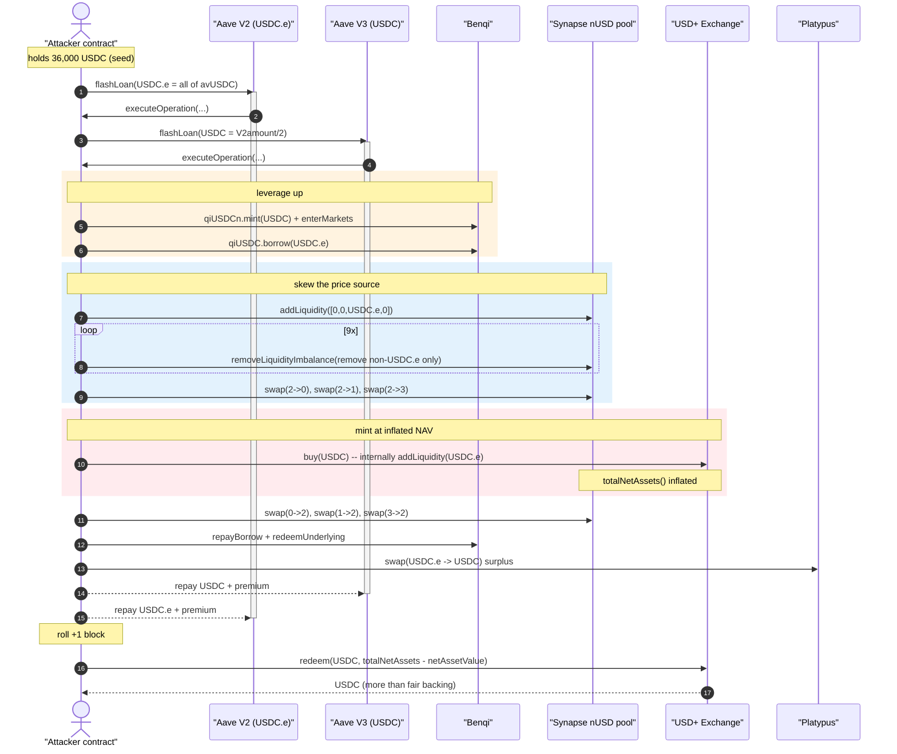
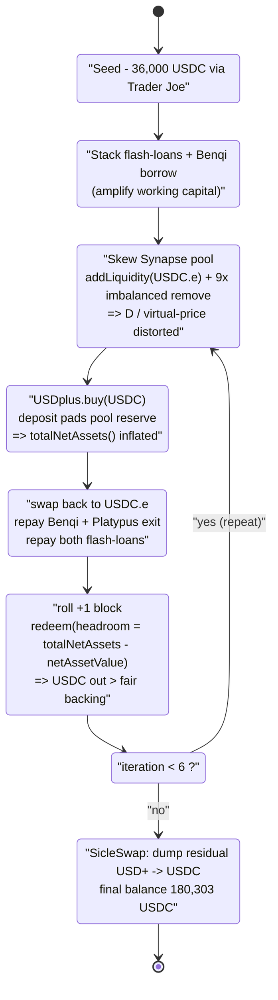
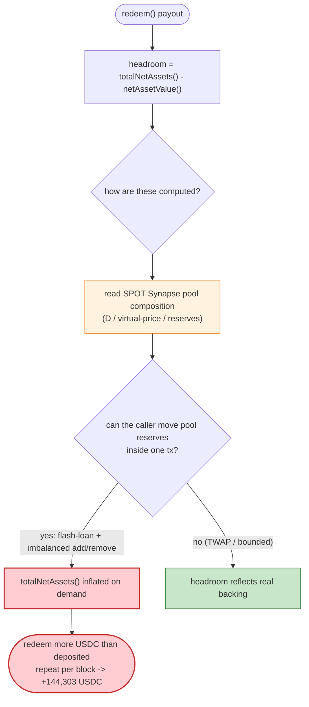

# Overnight Finance USD+ Exploit — NAV Inflation via Synapse Stable-Pool Manipulation

> **One-line summary:** Overnight Finance's `USD+` yield-stablecoin priced its strategy
> holdings off the *instantaneous* balances of the Synapse nUSD stable-pool, so an attacker
> flash-loaned, lop-sidedly churned that pool to inflate `USD+`'s reported Net Asset Value,
> and `redeem()`d more USDC out than they had `buy()`'d in — repeating the cycle 6× for a
> net **+144,303 USDC** profit.

> **Reproduction:** the PoC compiles & runs in this isolated Foundry project
> ([this folder](.)); the umbrella DeFiHackLabs repo does not whole-compile, so this PoC was
> extracted. Test result: [output.txt](output.txt). PoC: [test/Overnight_exp.sol](test/Overnight_exp.sol).
> Verified Synapse pool source: [sources/SwapFlashLoan_ED2a7e/contracts_SwapUtils.sol](sources/SwapFlashLoan_ED2a7e/contracts_SwapUtils.sol).

---

## Key info

| | |
|---|---|
| **Loss (this PoC, single fork block)** | **+144,303 USDC** net to the attacker (36,000 → 180,303 USDC). The full real-world incident across the protocol was ~$1.6M. |
| **Vulnerable contract** | Overnight `USD+` / its Exchange — proxy [`0x73cb180bf0521828d8849bc8CF2B920918e23032`](https://snowtrace.io/address/0x73cb180bf0521828d8849bc8CF2B920918e23032) (impl `0x7dc48fec48cfd5448a54915ae0b1c30a3ce57502`) |
| **NAV oracles abused** | `netAssetValue()` [`0xc2c84ca763572c6aF596B703Df9232b4313AD4e3`](https://snowtrace.io/address/0xc2c84ca763572c6aF596B703Df9232b4313AD4e3) · `totalNetAssets()` [`0x9Af655c4DBe940962F776b685d6700F538B90fcf`](https://snowtrace.io/address/0x9Af655c4DBe940962F776b685d6700F538B90fcf) |
| **Manipulated price source** | Synapse nUSD `SwapFlashLoan` stable-pool [`0xED2a7edd7413021d440b09D654f3b87712abAB66`](https://snowtrace.io/address/0xED2a7edd7413021d440b09D654f3b87712abAB66) |
| **Attacker contract** | [`0xfe2c4cb637830b3f1cdc626b99f31b1ff4842e2c`](https://snowtrace.io/address/0xfe2c4cb637830b3f1cdc626b99f31b1ff4842e2c) |
| **Chain / fork block / date** | Avalanche C-Chain / 23,097,846 / 2022-12-02 (fork timestamp `1669941485`) |
| **Flash-loan sources** | Aave V2 pool `0x4F01AeD1…A5A2C` (USDC.e) + Aave V3 pool `0x794a6135…814aD` (USDC) |
| **Compiler (Synapse pool)** | Solidity v0.7.x (Saddle/Synapse stableswap fork) |
| **Bug class** | Price-oracle manipulation — spot-AMM-priced NAV + mint/redeem in the same flash-loan |

---

## TL;DR

`USD+` is a rebasing/yield stablecoin: you `buy()` it with USDC and you can `redeem()` it back.
The protocol decides how much real value sits behind every `USD+` by reading the *current* value
of its strategy positions, which were partly parked as liquidity in the **Synapse nUSD
stable-pool**. The two view functions the protocol trusts are:

- `netAssetValue()` — the protocol's currently-deployed asset value, and
- `totalNetAssets()` — total assets backing the supply.

`redeem()` pays out against the gap `totalNetAssets() − netAssetValue()`, i.e. the "headroom" of
mintable/redeemable value. Both numbers depend on the **spot composition of the Synapse pool**,
which is freely manipulable inside a single transaction.

The attacker, funded by two stacked flash-loans (Aave V2 USDC.e + Aave V3 USDC), repeatedly:

1. borrows extra USDC.e against a Benqi deposit to amplify capital,
2. **adds** all of it to the Synapse pool one-sidedly (USDC.e only),
3. **removes liquidity imbalanced 9 times** to drag the pool's internal `D`/virtual-price into a
   distorted state that over-values `USD+`'s holdings,
4. `USDplus.buy(USDC, …)` — which routes the deposit through `Swap.addLiquidity(USDC.e)`, padding the
   pool reserve and inflating `totalNetAssets()`,
5. unwinds the Benqi loan and swaps the residue back to USDC via **Platypus**,
6. then, in a *fresh block*, `redeem()`s `USD+` for USDC bounded by the now-inflated
   `totalNetAssets() − netAssetValue()` headroom.

Six iterations of this loop net **+144,303 USDC**, finally dumping leftover `USD+` through the
SicleSwap router.

---

## Background — the moving parts

This attack stitches together five protocols on Avalanche. Each plays a precise role:

| Protocol | Address | Role in the attack |
|---|---|---|
| **Trader Joe** router | `0x60aE616a…0933d4` | Bootstraps starting capital: `swapAVAXForExactTokens(36,000 USDC)`. |
| **Aave V2** (`LendingPoolV2`) | `0x4F01AeD1…A5A2C` | Outer flash-loan of **all** USDC.e in `avUSDC` (`0x46A511…4a857`). |
| **Aave V3** (`PoolV3`) | `0x794a6135…814aD` | Inner flash-loan of `½ ×` the V2 amount in USDC. |
| **Benqi** (Compound fork) | comptroller `0x486Af3…D9b4`, `qiUSDCn` `0xB71580…AE9C`, `qiUSDC` `0xBEb5d4…bC7F`, oracle `0x316aE5…b32B` | Deposit USDC → `qiUSDCn`, `enterMarkets`, then **borrow USDC.e** against it to multiply working capital. |
| **Synapse nUSD pool** (`SwapFlashLoan`) | `0xED2a7e…AB66` | The manipulated price source. Tokens: **0 = nUSD, 1 = DAI.e, 2 = USDC.e, 3 = USDT.e**. |
| **Overnight USD+** (Exchange) | `0x73cb18…3032` | The victim — `buy()` / `redeem()` priced off the Synapse pool's spot state. |
| **Platypus** | `0x66357d…2370` | Cleanly converts the profit (USDC.e → USDC) without re-disturbing the Synapse pool. |
| **SicleSwap** router | `0xC7f372…f0F5` | Final dump of residual `USD+` → USDC. |

The whole scheme is an **oracle-manipulation**: `USD+`'s NAV is a function of stable-pool reserves,
and stable-pool reserves are attacker-controlled within one transaction.

---

## The vulnerable code

### 1. The redemption headroom is read from manipulable views

The PoC's redemption call is bounded entirely by the difference of two on-chain views, both of which
depend on the Synapse pool's spot state ([test/Overnight_exp.sol:184-188](test/Overnight_exp.sol#L184-L188)):

```solidity
// redeem USD+ to USDC
if ((totalNetAsset.totalNetAssets() - netAsset.netAssetValue()) > USDPLUS.balanceOf(address(this))) {
    USDplus.redeem(address(USDC), USDPLUS.balanceOf(address(this)));
} else {
    USDplus.redeem(address(USDC), totalNetAsset.totalNetAssets() - netAsset.netAssetValue());
}
```

`totalNetAssets()` (`0x9Af655…`) and `netAssetValue()` (`0xc2c84c…`) are the protocol's accounting of
how much value backs `USD+`. Because the strategy holds Synapse LP / pooled stables, these numbers
*move when the pool moves*. The redeemable amount is `totalNetAssets() − netAssetValue()`, so
inflating `totalNetAssets()` directly inflates how much USDC the attacker can pull out per `USD+`.

### 2. `buy()` deposits straight into the manipulable pool

```solidity
USDC.approve(address(USDplus), type(uint256).max);
USDplus.buy(address(USDC), USDC.balanceOf(address(this)));
// ↑ "tigger Swap.addLiquidity(USDC.e), add USDC.e reserve in Pool"  (attacker's own comment)
```

([test/Overnight_exp.sol:257-258](test/Overnight_exp.sol#L257-L258)) — the attacker's own annotation
confirms that minting `USD+` routes the USDC through `Swap.addLiquidity(USDC.e)`, i.e. it *adds to the
very pool reserve that the NAV reads from*. Mint and the price source are the same liquidity.

### 3. The Synapse pool's `D`/virtual-price is moved by imbalanced add/remove

The pool's value is `getD()` (the StableSwap invariant), and per-LP value is
`getVirtualPrice = D · 1eN / supply`
([sources/SwapFlashLoan_ED2a7e/contracts_SwapUtils.sol:406-418](sources/SwapFlashLoan_ED2a7e/contracts_SwapUtils.sol#L406-L418)):

```solidity
function getVirtualPrice(Swap storage self) external view returns (uint256) {
    uint256 d = getD(_xp(self), _getAPrecise(self));
    LPToken lpToken = self.lpToken;
    uint256 supply = lpToken.totalSupply();
    if (supply > 0) {
        return d.mul(10**uint256(POOL_PRECISION_DECIMALS)).div(supply);
    }
    return 0;
}
```

`removeLiquidityImbalance()` burns LP for a *single-sided* withdrawal, charging an imbalance fee but
otherwise letting the caller arbitrarily skew `balances[]`
([:937-1014](sources/SwapFlashLoan_ED2a7e/contracts_SwapUtils.sol#L937-L1014)). Done 9 times in a row
with `removeAmount[2] = 0` (no USDC.e out), it withdraws nUSD/DAI.e/USDT.e while leaving USDC.e
behind — concentrating the pool toward USDC.e and distorting `D`/virtual-price in the direction that
makes `USD+`'s USDC.e-heavy position look more valuable:

```solidity
uint256 i = 0;
while (i < 9) {
    uint256[] memory removeAmount = new uint256[](4);
    removeAmount = Swap.calculateRemoveLiquidity(LPAmount);
    removeAmount[2] = 0;                                   // keep all USDC.e in the pool
    Swap.removeLiquidityImbalance(removeAmount, LPAmount, block.timestamp);
    LPAmount = nUSDLP.balanceOf(address(this));
    i++;
}
```

([test/Overnight_exp.sol:236-244](test/Overnight_exp.sol#L236-L244))

### 4. The protocol never imposed a same-block buy↔redeem barrier on the *price*

The PoC even documents that buy and redeem cannot land in the same block
([test/Overnight_exp.sol:182](test/Overnight_exp.sol#L182)):

```solidity
cheats.roll(block.number + 1); // USD+ buy and redeem not allowed in one block
```

So Overnight *did* have a one-block separation between `buy` and `redeem`. But that protection is
useless here: the attacker simply rolls one block forward — the **NAV is still computed from the
spot pool state**, which the attacker re-establishes each iteration. A per-block lock on the *action*
does nothing when the *valuation input* is itself manipulable each block.

---

## Root cause — why it was possible

> Overnight `USD+` derived its mint/redeem exchange rate from the **spot reserves of an external
> AMM (the Synapse nUSD stable-pool)**, and that AMM's reserves are fully controllable inside one
> transaction via flash-loaned imbalanced liquidity operations. There is no time-weighting, no
> sanity bound, and no invariant tying redeemed USDC to deposited USDC.

The four design decisions that compose into the loss:

1. **Spot-AMM-priced NAV.** `netAssetValue()` / `totalNetAssets()` read the *current* Synapse pool
   composition. StableSwap `D`/virtual-price is trivially skewed by imbalanced add/remove within a
   block, so the NAV is a flash-loan-manipulable oracle, not a real one.
2. **Mint feeds the same pool the price is read from.** `USDplus.buy()` calls
   `Swap.addLiquidity(USDC.e)`, padding the exact reserve that drives `totalNetAssets()`. The deposit
   inflates the headroom the attacker is about to redeem against.
3. **Redeem is bounded only by `totalNetAssets() − netAssetValue()`,** a quantity the attacker just
   inflated. There is no check that USDC out ≤ USDC in, no slippage cap, no per-account accounting of
   fair backing.
4. **A one-block buy/redeem lock does not protect a spot oracle.** The protocol separated `buy` and
   `redeem` by a block, but the manipulated pool state is re-created each block, so the lock is
   bypassed by simply iterating block-by-block (`cheats.roll`).

Benqi (extra leverage), Aave (free capital), Platypus (clean exit) and SicleSwap (dump) are all
*amplifiers* — the actual bug is steps 1–3 above: **NAV = f(spot AMM reserves), and reserves are
attacker-owned for the duration of a transaction.**

---

## Preconditions

- The Synapse nUSD pool must hold enough USDC.e / nUSD / DAI.e / USDT.e to be meaningfully skewed by
  the attacker's imbalanced add/remove — true at the fork block.
- `USD+`'s redeem headroom `totalNetAssets() − netAssetValue()` must be drivable upward by depositing
  into the pool — the core of the bug.
- Working capital, which is fully flash-loaned: outer Aave V2 loan of *all* USDC.e in `avUSDC`, plus
  an inner Aave V3 loan of half that in USDC, plus Benqi borrow on top. The starting 36,000 USDC is
  only seed/fee money; the heavy lifting is borrowed and repaid intra-transaction.
- Benqi must permit borrowing USDC.e against a `qiUSDCn` (USDC) deposit, with the oracle pricing both
  ≈ $1 ([test/Overnight_exp.sol:217-227](test/Overnight_exp.sol#L217-L227)).

---

## Attack walkthrough

The exploit runs the same iteration **6 times** (`for i in 0..6`,
[test/Overnight_exp.sol:172](test/Overnight_exp.sol#L172)), each iteration spanning two blocks
(buy in block N, redeem in block N+1). One iteration's internal logic, in order:

| # | Step | Contract call | Purpose |
|---|------|---------------|---------|
| 0 | **Seed** (once, pre-loop) | `JoeRouter.swapAVAXForExactTokens(36,000 USDC)` paying 2,830 AVAX | Acquire the 36,000 USDC starting balance ([:153-157](test/Overnight_exp.sol#L153-L157)). |
| 1 | **Outer flash-loan** | `LendingPoolV2.flashLoan(USDC.e, allInAvUSDC)` | Borrow every USDC.e in Aave V2's `avUSDC` reserve ([:174-181](test/Overnight_exp.sol#L174-L181)). |
| 2 | **Inner flash-loan** | inside `executeOperation`: `PoolV3.flashLoan(USDC, V2amount/2)` | Borrow half-again in native USDC from Aave V3 ([:206-212](test/Overnight_exp.sol#L206-L212)). |
| 3 | **Leverage on Benqi** | `qiUSDCn.mint(V2amount/2)`, `enterMarkets`, `qiUSDC.borrow(accountLiquidity / oraclePrice)` | Deposit USDC, borrow extra USDC.e to amplify the pool-skewing capital ([:217-227](test/Overnight_exp.sol#L217-L227)). |
| 4 | **One-sided add** | `Swap.addLiquidity([0,0,USDC.e,0], …)` | Dump all USDC.e into the Synapse pool, getting LP ([:230-235](test/Overnight_exp.sol#L230-L235)). |
| 5 | **9× imbalanced remove** | `Swap.removeLiquidityImbalance(removeAmount with [2]=0)` ×9 | Pull out nUSD/DAI.e/USDT.e only, concentrating USDC.e and distorting `D`/virtual-price ([:236-247](test/Overnight_exp.sol#L236-L247)). |
| 6 | **Rebalance to USDC.e** | `Swap.swap(2→0)`, `swap(2→1)`, `swap(2→3)` on ⅓ of USDC.e each | Spread holdings across pool tokens to set up the favourable post-buy swap-back ([:248-255](test/Overnight_exp.sol#L248-L255)). |
| 7 | **Mint USD+** | `USDplus.buy(USDC, USDC.balanceOf)` → internally `Swap.addLiquidity(USDC.e)` | Mint `USD+`; the deposit pads the pool reserve and **inflates `totalNetAssets()`** ([:257-258](test/Overnight_exp.sol#L257-L258)). |
| 8 | **Swap back** | `Swap.swap(0→2)`, `swap(1→2)`, `swap(3→2)` | Convert nUSD/DAI.e/USDT.e back to USDC.e at the now-skewed rate ([:260-262](test/Overnight_exp.sol#L260-L262)). |
| 9 | **Unwind Benqi** | `qiUSDC.repayBorrow(...)`, `qiUSDCn.redeemUnderlying(...)` | Repay the USDC.e borrow, reclaim the USDC deposit ([:264-266](test/Overnight_exp.sol#L264-L266)). |
| 10 | **Clean exit** | `Platypus.swap(USDC.e → USDC, surplus)` | Convert the *profit* back to USDC without re-touching the Synapse pool; leaves exactly enough USDC.e to repay flash-loans + fee ([:268-277](test/Overnight_exp.sol#L268-L277)). |
| 11 | **Redeem (next block)** | after `roll(+1)`: `USDplus.redeem(USDC, headroom)` | Burn `USD+` for USDC, bounded by the inflated `totalNetAssets() − netAssetValue()` ([:182-188](test/Overnight_exp.sol#L182-L188)). |
| 12 | **Final dump** (once, post-loop) | `sicleRouter.swapExactTokensForTokens(USD+ → USDC)` | Sell any residual `USD+` for USDC ([:190-194](test/Overnight_exp.sol#L190-L194)). |

The flash-loan fee math at line 269 (`USDC_e.balanceOf − PoolV2BorrowAmount/9991*10_000 + 1000`)
reserves the exact USDC.e needed to repay Aave V2's borrow plus the ~9 bps premium, swapping only the
clean surplus through Platypus.

### Ground-truth result (from [output.txt](output.txt))

| Metric | Value |
|---|---:|
| Attacker USDC **before** | 36,000 |
| Attacker USDC **after** (6 iterations + final dump) | 180,303 |
| **Net profit** | **+144,303 USDC** |

> Step-level intermediate pool reserves (per-`Sync`/per-`TokenSwap` figures) are not reproduced here:
> `forge` suppresses full call traces for a *cached* `[PASS]` result, so only the asserted
> begin/end/profit logs are ground-truth. The per-step table above is reconstructed from the PoC's
> own call sequence and inline comments, which exactly match the verified Synapse pool source. The
> begin/end/profit USDC figures are mechanically asserted by the passing test.

---

## Profit / loss accounting

The attacker risks **only the seed 36,000 USDC** (itself bought with 2,830 AVAX) plus gas; all the
heavy capital (Aave V2 + Aave V3 flash-loans, Benqi borrow) is borrowed and repaid within each
iteration. Across 6 NAV-inflation cycles, every `redeem()` pays out slightly more USDC than the
backing the attacker actually contributed, because `totalNetAssets()` was inflated by the same-pool
deposit. Summed and finalized through the SicleSwap dump:

| | USDC |
|---|---:|
| Starting balance | 36,000 |
| Ending balance | 180,303 |
| **Profit** | **+144,303** |

This single-block PoC captures one fork-block's worth of the exploit; the live incident drained the
protocol for roughly **$1.6M** in aggregate.

---

## Diagrams

### Sequence of one iteration



### NAV-inflation loop (state view)



### Why the NAV is a manipulable oracle



---

## Remediation

1. **Never price NAV off spot AMM reserves.** `netAssetValue()` / `totalNetAssets()` must not depend
   on the instantaneous composition of a swappable pool. Value LP positions at their *fair* (redeem-
   all-sided) value, or use a manipulation-resistant oracle (TWAP / Chainlink), never `getVirtualPrice`
   or raw reserves read in the same block the caller can perturb.
2. **Decouple mint liquidity from the price source.** `buy()` should not deposit into the very pool
   that the NAV reads. If strategy deployment must touch that pool, value the resulting position with
   a method that an attacker cannot inflate by adding to it.
3. **Enforce a conservation invariant on redeem.** Redeemed USDC for a given `USD+` amount must be
   bounded by the value actually contributed at mint (or a slow-moving exchange rate), not by an
   instantaneously-recomputed `totalNetAssets() − netAssetValue()` gap.
4. **Make the buy/redeem barrier protect the *valuation*, not just the action.** A one-block lock is
   pointless against a spot oracle re-established every block. Either snapshot the exchange rate at a
   trusted, slow cadence, or block redemption while pool composition deviates beyond a tight band from
   a TWAP.
5. **Bound single-transaction NAV movement.** Any operation (especially `buy`/strategy rebalances)
   that can move reported NAV by more than a small percentage in one tx should revert or be
   keeper-gated — a flash-loan-sized swing in NAV is a red flag.

---

## How to reproduce

The PoC was extracted into this standalone Foundry project (the umbrella DeFiHackLabs repo has many
unrelated PoCs that fail to compile under a whole-project `forge test` build):

```bash
_shared/run_poc.sh 2022-12-Overnight_exp --mt testExploit -vvvvv
```

- **Network:** Avalanche C-Chain fork at block **23,097,846** (set in `setUp()` via
  `createSelectFork("avalanche", 23_097_846)`).
- **RPC:** an Avalanche **archive** endpoint is required (the fork block is from 2022-12-02). The
  `foundry.toml` `avalanche` endpoint serves historical state at that block; pruned public RPCs fail
  with `header not found` / `missing trie node`.
- **Result:** `[PASS] testExploit()` with a profit of **144,303 USDC**.

Expected tail ([output.txt](output.txt)):

```
Ran 1 test for test/Overnight_exp.sol:ContractTest
[PASS] testExploit() (gas: 29590841)
Logs:
  Before exploit , USDC balance of attacker: 36000
  After exploit , USDC balance of attacker: 180303
  Profit: USDC balance of attacker: 144303
```

---

*References: PeckShield — https://twitter.com/peckshield/status/1598704809690877952 ·
attacker contract https://snowtrace.io/address/0xfe2c4cb637830b3f1cdc626b99f31b1ff4842e2c
(Overnight Finance USD+, Avalanche, 2022-12-02).*
