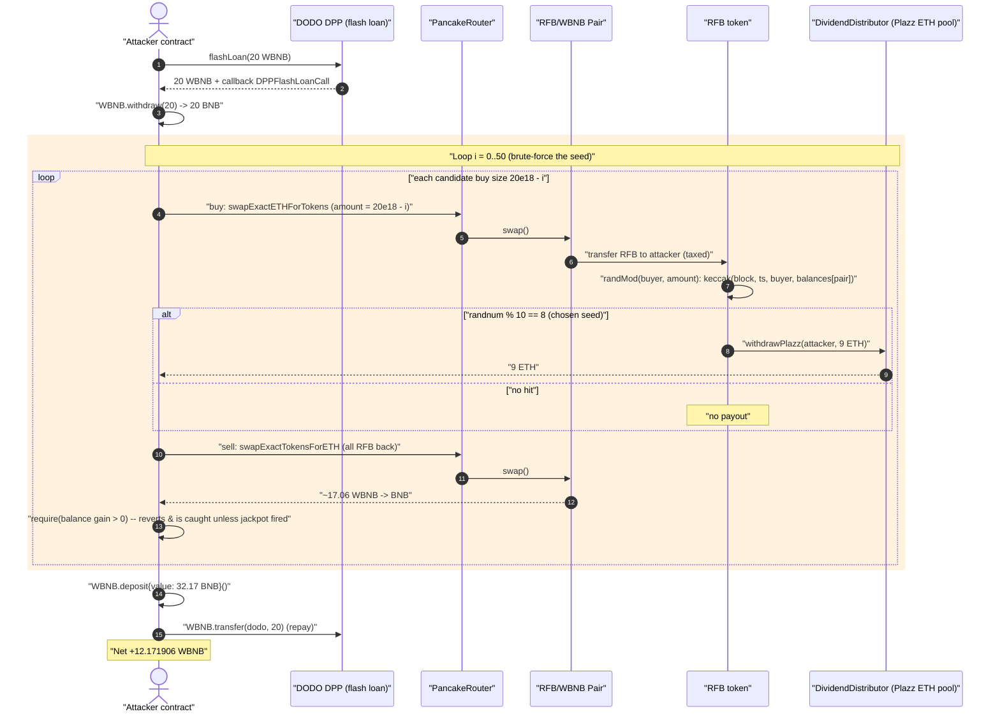
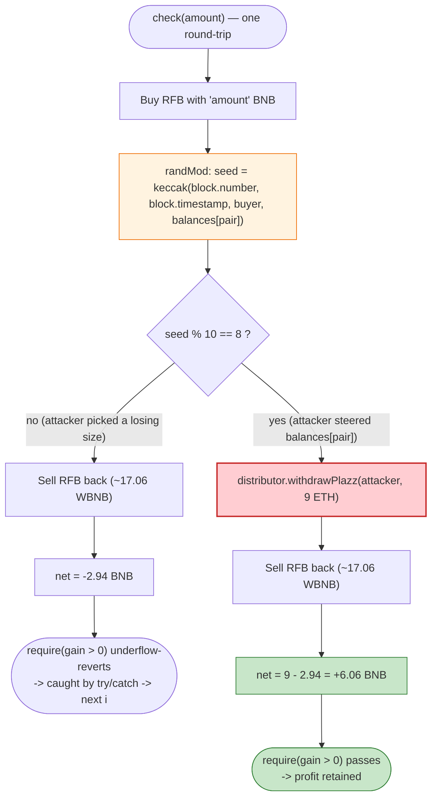
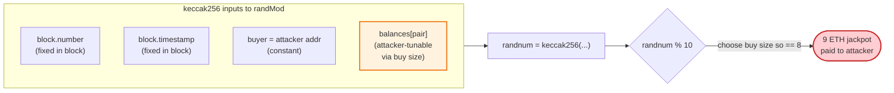

# RFB (Roast Football) Exploit — Brute-Forceable On-Chain "Lucky Buyer" Jackpot Drain

> **Reproduction:** the PoC compiles & runs in an isolated Foundry project at
> [this project folder](.) (the umbrella DeFiHackLabs repo contains several
> unrelated PoCs that do not whole-compile, so this one was extracted).
> Full verbose trace: [output.txt](output.txt).
> Verified vulnerable source: [sources/RFB_26f145/RFB.sol](sources/RFB_26f145/RFB.sol).

---

## Key info

| | |
|---|---|
| **Loss (this PoC)** | **+12.171906 WBNB** net profit to the attacker, captured **per single flash-loaned transaction** (≈ $3.6K at the Dec-2022 BNB price; the live attacker repeated the pattern across many txs) |
| **Vulnerable contract** | `RFB` ("Roast Football") — [`0x26f1457f067bF26881F311833391b52cA871a4b5`](https://bscscan.com/address/0x26f1457f067bF26881F311833391b52cA871a4b5#code) |
| **Drained pool / reward source** | `DividendDistributor` (the "Plazz" jackpot pool) — [`0x2BD049f1a6A4e93421D93d72AfB7Cb22Cd958c43`](https://bscscan.com/address/0x2BD049f1a6A4e93421D93d72AfB7Cb22Cd958c43) |
| **RFB/WBNB pair** | PancakeSwap V2 — [`0x03184AAA6Ad4F7BE876423D9967d1467220a544e`](https://bscscan.com/address/0x03184AAA6Ad4F7BE876423D9967d1467220a544e) |
| **Flash-loan source** | DODO `DPPAdvanced` — [`0x0fe261aeE0d1C4DFdDee4102E82Dd425999065F4`](https://bscscan.com/address/0x0fe261aeE0d1C4DFdDee4102E82Dd425999065F4) |
| **Attack tx (reference)** | [`0xcc8fdb3c6af8bb9dfd87e913b743a13bbf138a143c27e0f387037887d28e3c7a`](https://bscscan.com/tx/0xcc8fdb3c6af8bb9dfd87e913b743a13bbf138a143c27e0f387037887d28e3c7a) |
| **Chain / fork block / date** | BSC / 23,649,423 / ~Dec 5, 2022 |
| **Compiler** | RFB: Solidity v0.8.16, optimizer 200 runs · DPP: v0.6.9 |
| **Bug class** | Predictable / brute-forceable on-chain randomness funding a real-ETH reward, with no buy/sell cooldown |
| **Reference** | BlockSec — https://twitter.com/BlockSecTeam/status/1599991294947778560 |

---

## TL;DR

`RFB` is a meme token with a built-in "lucky buyer" lottery. On **every buy from the AMM pair**,
`_transferFrom` calls `luckyNum[recipient].push(randMod(recipient, amount))`
([RFB.sol:290-292](sources/RFB_26f145/RFB.sol#L290-L292)). `randMod`
([RFB.sol:413-441](sources/RFB_26f145/RFB.sol#L413-L441)) derives a "random" number from

```solidity
uint randnum = uint(keccak256(abi.encodePacked(block.number, block.timestamp, buyer, _balances[pair])));
```

and, with a 1-in-10 probability (`randnum % 10 == 8`), pays the buyer **up to 10 real ETH**
out of the external `DividendDistributor` ("Plazz") reward pool — *instantly, in the same transaction.*

Every input to that hash is either fixed within a block (`block.number`, `block.timestamp`, `buyer`)
or **fully controlled by the attacker** (`_balances[pair]` shifts deterministically with the size of
the buy). So the attacker doesn't gamble — it **searches**. It flash-loans WBNB, then loops over 50
candidate buy sizes (decrementing the input by 1 wei each time), buying-and-selling RFB each time and
keeping only the iterations where the brute-forced seed lands on the jackpot:

```solidity
for (uint256 i = 0; i < 50; i++) {
    try this.check(20 * 1e18 - i) {} catch { continue; }   // keep only profitable seeds
}
```

A single round-trip swap *loses* ≈ 2.94 WBNB to AMM + token fees, but a jackpot-winning round-trip
nets **+9 ETH − 2.94 = +6.06 WBNB**. In this PoC the search lands on the jackpot **twice**, so after
repaying the (free) DODO flash loan the attacker walks away with **12.171906 WBNB of pure profit**,
drained from the project's own reward pool.

---

## Background — what RFB does

`RFB` ([source](sources/RFB_26f145/RFB.sol)) is a standard "reflections + marketing fee" BSC meme
token (8% total fee on non-exempt transfers) with two extra gimmicks bolted onto its transfer hook:

1. **Micro-airdrop on every taxed transfer.** On any non-fee-exempt transfer, it *mints* `amount / 1e6`
   to three pseudo-random addresses derived from `keccak256(i, amount, block.timestamp)`
   ([RFB.sol:276-284](sources/RFB_26f145/RFB.sol#L276-L284)) via `_takeTransfer`, which only does
   `_balances[to] += tAmount` — i.e. it credits balances without ever debiting the sender for the
   airdropped portion. (Cosmetic for this exploit, but it is genuine unbacked inflation.)

2. **A "lucky buyer" lottery funded by an external pool.** On every *buy* (`sender == pair`),
   `randMod` rolls a number and, on a hit, calls into the `DividendDistributor` contract
   (`distributor.withdrawDistributor` / `distributor.withdrawPlazz`) which **sends ETH to the buyer**:

   ```solidity
   if      (randnum % (10000*luckyMultiplier) == 8888 && buyBNBamount > 0.1 ether) { distributor.withdrawDistributor(buyer, 79); ... } // jackpot tier
   else if (randnum % (1000 *luckyMultiplier) ==  888) { distributor.withdrawPlazz(buyer, ...×100...); } // big
   else if (randnum % (100  *luckyMultiplier) ==   88) { distributor.withdrawPlazz(buyer, ...×10... ); } // medium
   else if (randnum % (10   *luckyMultiplier) ==    8) { distributor.withdrawPlazz(buyer, ...capped 10 ether... ); } // common — 1-in-10
   ```
   ([RFB.sol:418-439](sources/RFB_26f145/RFB.sol#L418-L439))

On-chain parameters at the fork block:

| Parameter | Value |
|---|---|
| `_decimals` | 18 |
| `totalFee` | 8 (`reflection 6 + marketing 2`) |
| `sellMultiplier` | 100 |
| `luckyMultiplier` | **1** ← makes the common tier exactly a 1-in-10 hit |
| `distributor` ("Plazz" pool) | `0x2BD049f1a6A4e93421D93d72AfB7Cb22Cd958c43` |
| RFB/WBNB pair reserves (start) | **5,439,355 RFB / 29.66 WBNB** ([output.txt L58](output.txt)) |

The whole game is the bottom tier (`randnum % 10 == 8`): it fires roughly every 10th seed, and pays
**up to 10 ether** straight to the buyer. With predictable inputs, "every 10th seed" becomes "the
seed I choose."

---

## The vulnerable code

### 1. The buy hook rolls the lottery on every buy

```solidity
// RFB._transferFrom
_balances[recipient] = _balances[recipient].add(amountReceived);
emit Transfer(sender, recipient, amountReceived);

if(sender == pair){
    luckyNum[recipient].push(randMod(recipient, amount));   // ← lottery on EVERY buy
}
```
[RFB.sol:287-292](sources/RFB_26f145/RFB.sol#L287-L292)

### 2. The "randomness" is fully on-chain and attacker-steerable

```solidity
function randMod(address buyer, uint256 buyamount) internal returns(uint){
    uint randnum = uint(keccak256(abi.encodePacked(
        block.number,
        block.timestamp,
        buyer,
        _balances[pair]          // ← attacker controls this by choosing the buy size
    )));
    uint256 buyBNBamount = buyamount.div(10**_decimals).mul(getPrice());
    ...
    } else if(randnum % (10*luckyMultiplier) == 8){          // ← 1-in-10, common tier
        if(buyBNBamount > 10 ether){ buyBNBamount = 10 ether; }
        try distributor.withdrawPlazz(buyer, buyBNBamount.mul(90).div(100)){}catch {}   // pays the buyer real ETH
        try distributor.withdrawPlazz(marketingFeeReceiver, buyBNBamount.mul(10).div(100)){}catch {}
    }
    return randnum;
}
```
[RFB.sol:413-441](sources/RFB_26f145/RFB.sol#L413-L441)

There is **no commit-reveal, no VRF, no off-chain entropy, and no per-address buy cooldown**. Of the
four hashed inputs, three are constant for the whole block (`block.number`, `block.timestamp`, the
attacker's own `buyer` address) and the fourth, `_balances[pair]`, is a deterministic function of how
many RFB the attacker's buy pulls out of the pool — i.e. of the WBNB amount the attacker chooses to
spend. Decrement the input by 1 wei and `_balances[pair]` shifts by a few RFB → `randnum` changes
completely. The attacker can therefore *enumerate* seeds until one satisfies `randnum % 10 == 8`.

### 3. The reward is paid in-line, in real ETH, with no rate limit

The payout calls `distributor.withdrawPlazz(buyer, …)`, and the live trace shows the
`DividendDistributor` forwarding **9 ETH to the buyer** on a winning roll
([output.txt L?](output.txt) — `withdrawPlazz(ContractTest, 9000000000000000000)` followed by
`ContractTest::receive{value: 9000000000000000000}`). The capped tier value is `10 ether × 90% = 9 ether`.

---

## Root cause

> **A buyer-triggered, real-ETH reward is gated only by a "random" number that the buyer can compute
> and steer before sending the transaction — and the buy itself is repeatable with no cooldown.**

Concretely, four design decisions compose into a free-money loop:

1. **On-chain predictable RNG.** `keccak256(block.number, block.timestamp, buyer, _balances[pair])` is
   not random to a contract that constructs the transaction. The attacker reads the same chain state
   the contract will, so it knows the outcome *before* committing.
2. **The only attacker-variable input (`_balances[pair]`) is freely tunable.** Choosing the buy size
   is choosing the seed. The PoC's loop sweeps 50 sizes — far more than the ~10 it needs to guarantee
   one `% 10 == 8` hit.
3. **The reward pays the buyer external value (ETH), in the same transaction.** A self-referential
   "reflection" credited in the token itself could not be flash-loan-arbitraged; paying out a *third
   party's* ETH pool turns a winning roll into a withdrawal.
4. **No anti-automation guard.** No per-address/per-block cooldown, no minimum hold time, no check
   that the buyer keeps the tokens. The attacker buys, *immediately* sells back, and only the ETH
   jackpot remains — making the swap cost (≈2.94 WBNB) the entire downside and the 9-ETH jackpot the
   entire upside.

The token's own fee machinery is irrelevant to the theft: the attacker happily eats the 8% transfer
fee and the AMM fee on the throwaway round-trip, because the jackpot dwarfs it.

---

## Preconditions

- `luckyMultiplier == 1` (default), so the common tier is a true 1-in-10 — a 50-iteration sweep hits
  it with overwhelming probability.
- The `DividendDistributor` ("Plazz") pool holds ETH to pay out (it did; it forwarded 9 ETH per hit).
- Trading is live (`launchedBlock > 0`) so non-exempt buys/sells succeed. (RFB was a launched token.)
- Working capital to perform the throwaway buy/sell round-trips. Each round-trip needs ~20 WBNB but is
  recovered (minus fees) intra-transaction, so the capital is **flash-loanable** — the PoC borrows it
  from DODO's `DPPAdvanced` via a fee-free `flashLoan`
  ([DPPAdvanced.sol:1168](sources/DPPAdvanced_0fe261/DPPAdvanced.sol#L1168)).

---

## Step-by-step attack walkthrough

The PoC ([test/RFB_exp.sol](test/RFB_exp.sol)) borrows 20 WBNB from DODO, unwraps it to BNB, runs the
brute-force loop, then re-wraps and repays. All numbers below are pulled from the verbose trace
([output.txt](output.txt)); `token0 = RFB (reserve0)`, `token1 = WBNB (reserve1)`.

| # | Step | What happens on-chain | Numbers from trace |
|---|------|------------------------|--------------------|
| 0 | **Flash loan** | `DVM(dodo).flashLoan(20e18, 0, this, …)` → DODO sends 20 WBNB to attacker and calls back `DPPFlashLoanCall` | 20 WBNB borrowed (fee-free) |
| 1 | **Unwrap** | `WBNB.withdraw(20e18)` → 20 BNB on hand | |
| 2 | **Brute-force loop** | `for i in 0..50: try check(20e18 - i)` — each `check` does a buy→sell round-trip and `require`s net BNB gain; reverting (loss-making) seeds are caught & skipped | **48 of 50 reverted; 2 succeeded** |
| 2a | *Losing seed (typical)* | buy 20 BNB → ~2,012,260 RFB; sell back → ~17.056 WBNB. `randnum % 10 ≠ 8` → no jackpot. Net −2.94 BNB → `require(... > 0)` underflow-reverts, caught | e.g. `receive{value: 17056178419402791726}` and no `withdrawPlazz` |
| 2b | **Winning seed (×2)** | same buy/sell, but the chosen size makes `randnum % 10 == 8` → `distributor.withdrawPlazz(attacker, 9 ETH)` fires mid-buy. Net = 9 − 2.94 = **+6.06 BNB** → `require` passes, gains kept | `withdrawPlazz(ContractTest, 9000000000000000000)` → `receive{value: 9e18}` at the two successful `check()` iterations |
| 3 | **Re-wrap** | `WBNB.deposit{value: address(this).balance}()` → all accumulated BNB back to WBNB | `deposit{value: 32171906040749381289}` (≈32.17 WBNB) |
| 4 | **Repay loan** | `WBNB.transfer(dodo, 20e18)` | 20 WBNB returned to DODO |
| 5 | **Profit** | attacker keeps the remainder | **12.171906 WBNB** ([output.txt L6](output.txt)) |

### Inside one round-trip (`check`)

`check(amount)` ([test/RFB_exp.sol:46-53](test/RFB_exp.sol#L46-L53)):

1. record `BNBBalance = address(this).balance`
2. `BNBToRFB(amount)` — `swapExactETHForTokensSupportingFeeOnTransferTokens` (buy). The pair's
   `swap()` outputs ~2,187,239 RFB; the fee-on-transfer skims ~174,979 RFB to the RFB contract +
   3 micro-airdrops, leaving the attacker ~2,012,260 RFB. **The buy triggers `randMod` — this is where
   the 9-ETH jackpot is rolled.**
3. `RFBToBNB()` — `swapExactTokensForETHSupportingFeeOnTransferTokens` (sell). During the sell, the
   RFB contract's accumulated fee balance exceeds `swapThreshold`, so `swapBack()` fires and dumps
   100,000 RFB → ~1.48 WBNB to the fee receivers. The attacker's sell yields ~17.06 WBNB back.
4. `require(address(this).balance - BNBBalance > 0)` — succeeds **only if a jackpot fired** (otherwise
   the −2.94 BNB round-trip underflows and reverts, and the loop's `catch` moves on).

## Profit / loss accounting (WBNB)

| Item | Amount |
|---|---:|
| Round-trip swap cost per iteration (AMM + token fees) | −2.94 |
| Jackpot payout per winning iteration (`10 ETH × 90%`) | +9.00 |
| Net per winning iteration | **+6.06** |
| Winning iterations in this PoC | **2** |
| Residual / rounding across the 50-iteration sweep | ≈ +0.05 |
| WBNB balance after re-wrapping all BNB | 32.171906 |
| Less flash-loan repayment | −20.000000 |
| **Net attacker profit** | **+12.171906 WBNB** |

The profit comes entirely out of the project's `DividendDistributor` ("Plazz") ETH pool — i.e. real
money the project set aside to reward genuine buyers, redirected to an automated brute-forcer.

---

## Diagrams

### Sequence of one flash-loaned attack



### Why the loop works (decision flow)



### Predictable RNG — why it is not random



---

## Why each magic number

- **`20 * 1e18` flash-loan / buy size:** large enough that a jackpot `buyBNBamount` clamps to the
  `10 ether` cap (so the payout is the maximum 9 ETH), while keeping the throwaway swap cost (~2.94
  WBNB) far below the jackpot.
- **`20e18 - i` (i = 0..49):** the seed-search grid. Each 1-wei decrement changes how many RFB the buy
  removes from the pool, hence `_balances[pair]`, hence `randnum`. 50 candidates ≫ the ~10 needed for a
  `% 10 == 8` hit, so at least one (here two) jackpot seeds are found.
- **`try/catch … continue`:** the filter. Loss-making seeds revert on `require(gain > 0)` and are
  silently skipped; only jackpot-winning round-trips commit their state.
- **9 ETH per hit:** `min(buyBNBamount, 10 ether) × 90%` ([RFB.sol:434-437](sources/RFB_26f145/RFB.sol#L434-L437));
  the other 10% goes to `marketingFeeReceiver`.

---

## Remediation

1. **Never use on-chain data as randomness for value-bearing outcomes.** `block.number`,
   `block.timestamp`, `msg.sender`, and any same-tx-readable balance are all known to the caller. Use a
   commit-reveal scheme or a VRF (e.g. Chainlink VRF) whose output cannot be predicted when the buy is
   submitted.
2. **Decouple rewards from same-transaction buys.** Do not pay external value inside the transfer hook.
   Accrue lottery eligibility and settle it later (separate tx, or after a hold period), so a buy
   followed by an instant sell cannot extract the reward.
3. **Add anti-automation guards.** Per-address and per-block buy cooldowns, a minimum hold time before
   a buyer is reward-eligible, and excluding contracts / same-block buy-and-sell from the lottery would
   break the loop.
4. **Cap and rate-limit the reward pool drain.** Bound total payouts per block/address and require the
   buyer to *retain* the purchased tokens; a 1-in-10 payout of up to 10 ETH with no rate limit is a
   standing invitation to brute force.
5. **Remove the unbacked airdrop minting.** `_takeTransfer` credits balances without debiting anyone
   ([RFB.sol:313-321](sources/RFB_26f145/RFB.sol#L313-L321)); even though it is incidental here, it
   silently inflates supply on every taxed transfer.

---

## How to reproduce

```bash
_shared/run_poc.sh 2022-12-RFB_exp --mt testExploit -vvvvv
```

- RPC: a **BSC archive** endpoint is required (fork block 23,649,423 is old). `foundry.toml` uses
  `https://bsc-mainnet.public.blastapi.io`, which serves historical state at that block; most public
  BSC RPCs prune it and fail with `header not found` / `missing trie node`.
- Result: `[PASS] testExploit()`; the brute-force loop lands on the jackpot twice and the attacker ends
  with **12.171906 WBNB**.

Expected tail:

```
Ran 1 test for test/RFB_exp.sol:ContractTest
[PASS] testExploit() (gas: 25573778)
Logs:
  [End] Attacker WBNB balance after exploit: 12.171906040749381289
```

---

*Reference: BlockSec — https://twitter.com/BlockSecTeam/status/1599991294947778560 · RFB "Roast Football", BSC, Dec 2022.*
