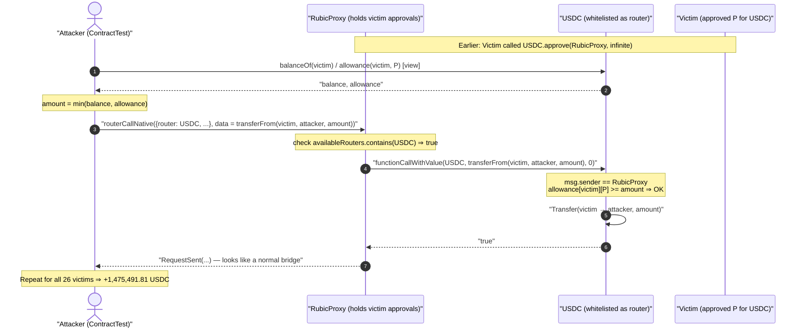
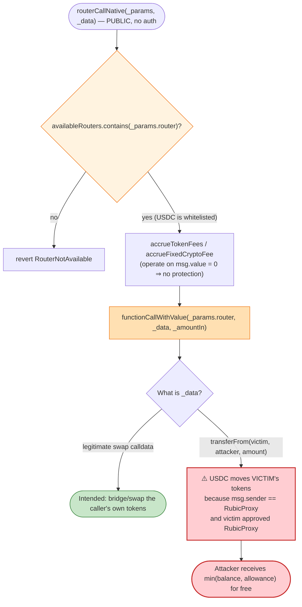
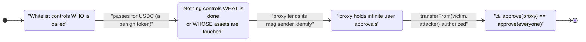

# Rubic Exchange Exploit — Arbitrary External Call Drains User Allowances

> **Reproduction:** the PoC compiles & runs in an isolated Foundry project at
> [this project folder](.) (the umbrella DeFiHackLabs repo contains many unrelated PoCs that do
> not whole-compile, so this one was extracted).
> Full verbose trace: [output.txt](output.txt).
> Verified vulnerable source: [contracts_RubicProxy.sol](sources/RubicProxy_3335A8/contracts_RubicProxy.sol)
> and its base [rubic-bridge-base_contracts_BridgeBase.sol](sources/RubicProxy_3335A8/rubic-bridge-base_contracts_BridgeBase.sol).

---

## Key info

| | |
|---|---|
| **Loss** | **~$1,475,491 USDC** (1,475,491.811413 USDC) skimmed from users who had approved the Rubic proxies |
| **Vulnerable contract** | `RubicProxy` (v1) — [`0x3335A88bb18fD3b6824b59Af62b50CE494143333`](https://etherscan.io/address/0x3335A88bb18fD3b6824b59Af62b50CE494143333#code) |
| **Vulnerable contract** | `RubicProxy` (v2) — [`0x33388CF69e032C6f60A420b37E44b1F5443d3333`](https://etherscan.io/address/0x33388CF69e032C6f60A420b37E44b1F5443d3333#code) |
| **Victims** | 26 EOAs holding USDC with a standing approval to one of the two Rubic proxies (see table) |
| **Attacker (PoC reproduction contract)** | `0x7FA9385bE102ac3EAc297483Dd6233D62b3e1496` (Foundry `ContractTest`; the live attacker EOA was `0x57008B7e8eb3CB3b9b9821e7E0a5f0Ff4F1d6726`) |
| **Reference attack tx** | `0x9a97d85642f956ad7a6b852cf7bed6f9669e2c2815f3279855acf7f1328e7d46` (per PoC header) |
| **Chain / fork block / date** | Ethereum mainnet / 16,260,580 / **Dec 25, 2022** |
| **Compiler (victim contracts)** | Solidity v0.8.16, optimizer 1 enabled (100,000 runs) |
| **Bug class** | Arbitrary external call with attacker-controlled target + calldata (allowance abuse / "router" call injection) |

---

## TL;DR

`RubicProxy` is a cross-chain aggregator. To bridge or swap, a user first **approves the proxy** to
spend their tokens, then the proxy forwards the trade to an external "router" via a low-level call.
The flaw: the function `routerCallNative(...)` takes **both the call target (`_params.router`) and
the raw calldata (`_data`) from the caller**, and the only safety check is that `_params.router` is
present in the `availableRouters` whitelist
([contracts_RubicProxy.sol:96-118](sources/RubicProxy_3335A8/contracts_RubicProxy.sol#L96-L118)):

```solidity
function routerCallNative(BaseCrossChainParams calldata _params, bytes calldata _data) external payable ... {
    if (!availableRouters.contains(_params.router)) { revert RouterNotAvailable(); }   // ← only gate
    ...
    AddressUpgradeable.functionCallWithValue(_params.router, _data, _amountIn);          // ← attacker target + data
}
```

The whitelist `availableRouters` contained the **USDC token address itself**
(`0xA0b8...eB48`). Tokens are valid swap "routers" in many aggregators, so this was not obviously
wrong — but it is fatal here. The attacker simply set `_params.router = USDC` and
`_data = transferFrom(victim, attacker, amount)`. Because the **proxy** is the `msg.sender` of that
call, and victims had approved the **proxy**, USDC happily moved each victim's balance to the
attacker.

Net effect: every standing allowance to either Rubic proxy became a free withdrawal for anyone who
could craft the calldata. The PoC drains 26 victims for a total of **1,475,491.81 USDC** in a single
transaction.

---

## Background — what RubicProxy does

`RubicProxy` ([source](sources/RubicProxy_3335A8/contracts_RubicProxy.sol)) is described in its own
header as a *"Universal proxy contract to Symbiosis, LiFi, deBridge and other cross-chain solutions."*
Its model is the standard aggregator pattern:

1. The user `approve()`s the proxy for the token they want to bridge/swap.
2. The user calls a `routerCall*` entry point, naming a destination DEX/bridge **router** and supplying
   the encoded swap calldata.
3. The proxy pulls the user's tokens (for the ERC20 path), accrues fees, approves the router, and
   forwards the call.

Two proxy contracts were live, differing only in their `routerCallNative` signature:

- **v1** `0x3335...3333` — `routerCallNative(BaseCrossChainParams _params, bytes _data)`
  ([contracts_RubicProxy.sol:96](sources/RubicProxy_3335A8/contracts_RubicProxy.sol#L96)).
- **v2** `0x3338...3333` — `routerCallNative(string _providerInfo, BaseCrossChainParams _params, bytes _data)`
  ([contracts_RubicProxy.sol:102](sources/RubicProxy_33388C/contracts_RubicProxy.sol#L102)) — an
  extra leading `string` for analytics, identical security posture.

Both inherit `OnlySourceFunctionality → BridgeBase`. The router whitelist lives in `BridgeBase` as
`EnumerableSetUpgradeable.AddressSet internal availableRouters`
([BridgeBase.sol:48](sources/RubicProxy_3335A8/rubic-bridge-base_contracts_BridgeBase.sol#L48)),
mutated by `addAvailableRouter` / `removeAvailableRouter`
([BridgeBase.sol:368-383](sources/RubicProxy_3335A8/rubic-bridge-base_contracts_BridgeBase.sol#L368-L383)).
At the fork block this set contained ordinary token contracts — including USDC — alongside genuine
DEX/bridge routers.

The on-chain facts that make the exploit possible:

| Fact | Value |
|---|---|
| `availableRouters` contains USDC | **yes** (no `RouterNotAvailable` revert in the trace) |
| Victim #0 USDC allowance to proxy v1 | `type(uint256).max` (1.157e77 — an "infinite" approval) |
| Victim #0 USDC balance | 1,000,000 USDC |
| `RubicPlatformFee` for the integrator used | 0 (no fee skimmed; `TokenFee(RubicPart: 0, integratorPart: 0)`) |
| Tokens actually drained | 100% of each victim's `min(balance, allowance)` |

The `srcInputToken` / `srcInputAmount` fields were left at `address(0)` / `0`, so the **native**
path (`routerCallNative`) was used — it never pulls tokens from `msg.sender` and never validates that
`_data` corresponds to a legitimate swap. It is a pure "call this address with this data" primitive
wrapped behind a whitelist that admits token contracts.

---

## The vulnerable code

### 1. `routerCallNative` forwards attacker calldata to an attacker-chosen target

[contracts_RubicProxy.sol:96-118](sources/RubicProxy_3335A8/contracts_RubicProxy.sol#L96-L118):

```solidity
function routerCallNative(BaseCrossChainParams calldata _params, bytes calldata _data)
    external
    payable
    nonReentrant
    whenNotPaused
    eventEmitter(_params)
{
    if (!availableRouters.contains(_params.router)) {
        revert RouterNotAvailable();          // ← THE ONLY CHECK ON _params.router
    }

    IntegratorFeeInfo memory _info = integratorToFeeInfo[_params.integrator];

    uint256 _amountIn = accrueTokenFees(
        _params.integrator,
        _info,
        accrueFixedCryptoFee(_params.integrator, _info),  // = msg.value - fixedCryptoFee (= 0 here)
        0,
        address(0)
    );

    AddressUpgradeable.functionCallWithValue(_params.router, _data, _amountIn);  // ⚠️ arbitrary call
}
```

There is **no validation that `_data` is a swap**, no check that the call only touches the caller's
own assets, and no constraint relating `_params.router` to the function selector inside `_data`. The
proxy will call any whitelisted address with any bytes the caller supplies.

### 2. The whitelist admits token contracts, so `router = USDC` passes

`availableRouters.contains(USDC)` returned `true` at the fork block. Token addresses are plausible
"routers" in an aggregator (some integrations route directly through a token's own logic), so this
configuration was not an obvious misconfiguration — but it converts the arbitrary call into an
**arbitrary `transferFrom`** against every user who has approved the proxy.

### 3. The ERC20 path has the same root flaw

`routerCall` ([contracts_RubicProxy.sol:61-94](sources/RubicProxy_3335A8/contracts_RubicProxy.sol#L61-L94))
is the sibling that pulls tokens first; it `safeIncreaseAllowance(_gateway, _amountIn)` then does the
same `AddressUpgradeable.functionCallWithValue(_params.router, _data, ...)`. It carries a
`DifferentAmountSpent` balance check, but that only protects the **proxy's** own balance — it does
nothing to stop `_data` from spending a *third party's* approval to the proxy. The native path used
in the actual attack does not even have that check.

### 4. Why the fee/whitelist logic gives no protection

`accrueTokenFees` / `_calculateFee`
([BridgeBase.sol:174-224](sources/RubicProxy_3335A8/rubic-bridge-base_contracts_BridgeBase.sol#L174-L224))
operate only on `msg.value` for the native path; with `msg.value = 0` and a zero-fee integrator, the
forwarded value `_amountIn` is `0`. The exploit needs no ETH — the value transferred is entirely the
victim's USDC, moved by the *callee* (USDC) under the proxy's identity.

---

## Root cause — why it was possible

The proxy conflates two trust domains:

> **Who is allowed to be called** (the whitelist) is checked, but **what is allowed to be done in that
> call** (the calldata, and whose assets it touches) is not. The proxy is the holder of every user's
> approval, and it lends that identity to arbitrary calldata.

Three design decisions compose into a critical bug:

1. **Caller-supplied call target + caller-supplied calldata.** `functionCallWithValue(_params.router,
   _data, ...)` is a generic "execute on my behalf" primitive. Once a contract holds user approvals,
   any such primitive is equivalent to "spend anyone's approved balance," unless the calldata is
   strictly constrained.
2. **The whitelist is the wrong control.** Whitelisting the *target* prevents calling a malicious
   contract, but it cannot prevent calling a *benign* contract maliciously. USDC is benign; calling
   `USDC.transferFrom(victim, attacker, x)` from an address that holds `victim`'s approval is the
   attack. The whitelist needed to also bind the **selector**/semantics, or exclude any address that
   could be a token in which users hold proxy allowances.
3. **The proxy is `msg.sender` for the forwarded call.** ERC20 `transferFrom` authorizes by
   `allowance[from][msg.sender]`. Because the proxy makes the call, the proxy's standing allowances
   are spendable. Pulling user funds and immediately re-approving an external "gateway" is the entire
   business model, so the proxy necessarily accumulates infinite approvals — every one of which is now
   a liability.

Put differently: **a user's `approve(RubicProxy, ∞)` is, in the presence of this function, equivalent
to `approve(everyone, ∞)`**.

---

## Preconditions

- The victim has a **non-zero, unspent allowance** of some token to one of the Rubic proxies
  (`USDC.allowance(victim, proxy) > 0`). Infinite approvals (`type(uint256).max`) — the default for
  most aggregator UIs — maximize the loss.
- The token in question is present in `availableRouters` (USDC was).
- That is all. The attack is **permissionless** (anyone can call `routerCallNative`), needs **no
  capital** (`msg.value = 0`, no token deposit), and the attacker harvests **exactly**
  `min(victim_balance, victim_allowance)` per victim.

---

## Attack walkthrough (with on-chain numbers from the trace)

The PoC ([test/Rubic_exp.sol:59-135](test/Rubic_exp.sol#L59-L135)) loops over 26 known victims. For
each victim it reads `balanceOf` and `allowance`, takes the smaller, then calls the appropriate
proxy's `routerCallNative` with `router = USDC` and
`data = transferFrom(victim, attacker, amount)`.

- Victims 0–7 are drained via **v1** proxy `0x3335...3333`
  ([test/Rubic_exp.sol:109-119](test/Rubic_exp.sol#L109-L119)).
- Victims 8–25 are drained via **v2** proxy `0x3338...3333` (note the extra empty `""` provider
  string) ([test/Rubic_exp.sol:120-130](test/Rubic_exp.sol#L120-L130)).

For victim #0 the trace shows, in order:

```
FiatTokenV2_1::balanceOf(0x6b8D…e91b)  → 1000000000000        (1,000,000 USDC)
FiatTokenV2_1::allowance(0x6b8D…e91b, 0x3335…3333) → 2^256-1  (infinite approval)
0x3335…3333::routerCallNative({ ..., router: 0xA0b8…eB48 /*USDC*/ },
                              0x23b872dd…6b8d…e91b…7fa9…1496…00e8d4a51000)
   emit Transfer(from: 0x6b8D…e91b, to: ContractTest 0x7FA9…1496, value: 1000000000000)
```

`0x23b872dd` is the `transferFrom(address,address,uint256)` selector;
`0x…00e8d4a51000` = `1_000_000_000_000` = 1,000,000 USDC. The proxy emits `FixedCryptoFee(0,0,…)` and
`TokenFee(0,0,…)` — **no fee was taken**, confirming the proxy treated this as a legitimate forward.

### Ground-truth victim ledger (all 26, from `emit Transfer` events in [output.txt](output.txt))

| # | Proxy | Victim | USDC drained |
|---|:-----:|--------|-------------:|
| 0 | v1 | `0x6b8D6E89590E41Fa7484691fA372c3552E93e91b` | 1,000,000.000000 |
| 1 | v1 | `0x036B5805F9175297Ec2adE91678d6ea0a1e2272A` | 23,848.557317 |
| 2 | v1 | `0xED9c18C5311DBB2b757B6913fB3FE6aa22b1A5b0` | 22,488.170373 |
| 3 | v1 | `0xff266f62a0152F39FCf123B7086012cEb292516A` | 10,479.679167 |
| 4 | v1 | `0x90d9b9CC1BFB77d96f9a44731159DdbcA824C63D` | 5,116.733422 |
| 5 | v1 | `0x1dAeB36442d0B0B28e5c018078b672CF9ee9753B` | 4,998.362723 |
| 6 | v1 | `0xF2E3628f7A85f03F0800712DF3c2EBc5BDb33981` | 3,949.562500 |
| 7 | v1 | `0xf3f4470d71b94CD74435e2e0f0dE0DaD11eC7C5a` | 3,866.825000 |
| 8 | v2 | `0x915E88322EDFa596d29BdF163b5197c53cDB1A68` | 109,025.621338 |
| 9 | v2 | `0xD6aD4bcbb33215C4b63DeDa55de599d0d56BCdf5` | 69,210.204476 |
| 10 | v2 | `0x2afeF7d7de9E1a991c385a78Fb6c950AA3487dbA` | 57,663.959422 |
| 11 | v2 | `0x21FeBbFf2da0F3195b61eC0cA1B38Aa1f7105cDb` | 32,263.535621 |
| 12 | v2 | `0xDbDDb2D6F3d387c0dDA16E197cd1E490543354e1` | 25,059.860000 |
| 13 | v2 | `0x58709C660B2d908098FE95758C8a872a3CaA6635` | 17,484.076961 |
| 14 | v2 | `0xD2C919D3bf4557419CbB519b1Bc272b510BC59D9` | 14,954.991900 |
| 15 | v2 | `0xfE243903c13B53A57376D27CA91360C6E6b3FfAC` | 12,900.478948 |
| 16 | v2 | `0xd5BD9464eB1A73Cca1970655708AE4F560Efc6D1` | 12,294.912470 |
| 17 | v2 | `0xd6389E37f7c2dB6De56b92f430735D08d702111E` | 8,066.091613 |
| 18 | v2 | `0x9f3119BEe3766b2CD25BF3808a8646A7F22ccDDC` | 7,945.929389 |
| 19 | v2 | `0x8a4295b205DD78Bf3948D2D38a08BaAD4D28CB37` | 6,610.000000 |
| 20 | v2 | `0xf4BA068f3F79aCBf148b43ae8F1db31F04E53861` | 6,485.949957 |
| 21 | v2 | `0x48327499E4D71ED983DC7E024DdEd4EBB19BDb28` | 5,907.316688 |
| 22 | v2 | `0x192FcF067D36a8BC9322b96Bb66866c52C43B43F` | 4,500.288300 |
| 23 | v2 | `0x82Bdfc6aBe9d1dfA205f33869e1eADb729590805` | 3,943.960000 |
| 24 | v2 | `0x44a59A1d38718c5cA8cB6E8AA7956859D947344B` | 3,436.554727 |
| 25 | v2 | `0xD0245a08f5f5c54A24907249651bEE39F3fE7014` | 2,990.189101 |
| | | **Total** | **1,475,491.811413** |

The summed `Transfer` values equal the attacker's final balance to the wei:
`[End] Attacker USDC balance after exploit: 1475491.811413`
([output.txt:1569](output.txt)).

### Profit accounting (USDC)

| Direction | Amount |
|---|---:|
| Capital spent by attacker | **0** (native path, `msg.value = 0`) |
| Skimmed from 26 victim allowances | 1,475,491.811413 |
| **Net profit** | **+1,475,491.811413** |

The exploit is pure theft of pre-existing approvals; there is no flash loan, no swap, no price impact.

---

## Diagrams

### Sequence of the attack (one victim, repeated 26×)



### Trust-domain confusion inside `routerCallNative`



### Why the whitelist is the wrong control



---

## Remediation

1. **Never forward arbitrary calldata from a contract that holds user approvals.** The router target
   AND the function being invoked must be constrained. If the proxy must call routers generically, it
   should only ever spend tokens it pulled **within the same call from `msg.sender`**, and must reject
   any `_data` whose effect could reach a third party's approval.
2. **Exclude token contracts (and any address users approve the proxy for) from `availableRouters`.**
   A "router" should never be an address against which the proxy holds standing allowances. Maintain a
   strict separation between "tokens we are approved for" and "contracts we may call."
3. **Bind selector + target together.** Whitelist `(router, allowed_selectors)` pairs, or better,
   replace the generic low-level call with typed integrations per supported router so the proxy
   constructs the calldata itself from validated parameters — the user supplies *parameters*, never raw
   `_data`.
4. **Use a pull-then-spend-then-zero pattern scoped to the caller.** Pull `srcInputAmount` from
   `msg.sender`, approve the gateway for exactly that amount, execute, then reset the allowance to 0
   (the ERC20 path already resets to 0 — extend the *scoping* idea so the only funds ever movable are
   the caller's own deposit for this call).
5. **Mitigation already used in the wild:** Rubic's emergency response was to revoke the proxies' use
   and instruct users to revoke approvals; the durable fix is to redeploy without the
   arbitrary-call-to-whitelisted-token primitive. Users with infinite approvals to either proxy must
   revoke them.

---

## How to reproduce

The PoC was extracted into a standalone Foundry project (the umbrella DeFiHackLabs repo has many
unrelated PoCs that fail to compile under `forge test`'s whole-project build):

```bash
_shared/run_poc.sh 2022-12-Rubic_exp --mt testExploit -vvvvv
```

- RPC: an **Ethereum mainnet archive** endpoint is required (fork block 16,260,580, Dec 25 2022).
  `foundry.toml` points `mainnet` at an Infura endpoint that serves historical state at that block.
- Result: `[PASS] testExploit()`; the attacker (`ContractTest`) ends holding **1,475,491.811413 USDC**
  pulled from 26 victims' approvals.

Expected tail:

```
Ran 1 test for test/Rubic_exp.sol:ContractTest
[PASS] testExploit() (gas: 990693)
  [End] Attacker USDC balance after exploit: 1475491.811413
Suite result: ok. 1 passed; 0 failed; 0 skipped; finished in 22.92s
```

---

*References: PeckShield / BlockSec disclosures (Dec 25, 2022); SlowMist Hacked — https://hacked.slowmist.io/ (Rubic, Ethereum, ~$1.4M). Twitter threads cited in the PoC header:
https://twitter.com/BlockSecTeam/status/1606993118901198849 ,
https://twitter.com/peckshield/status/1606937055761952770 .*
