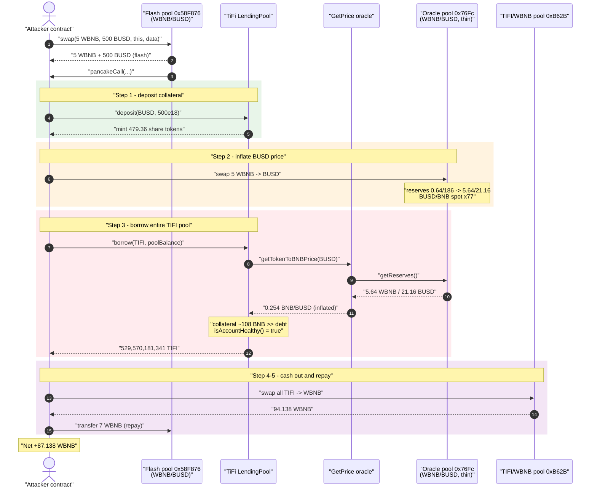
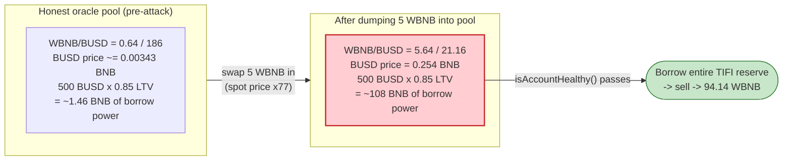
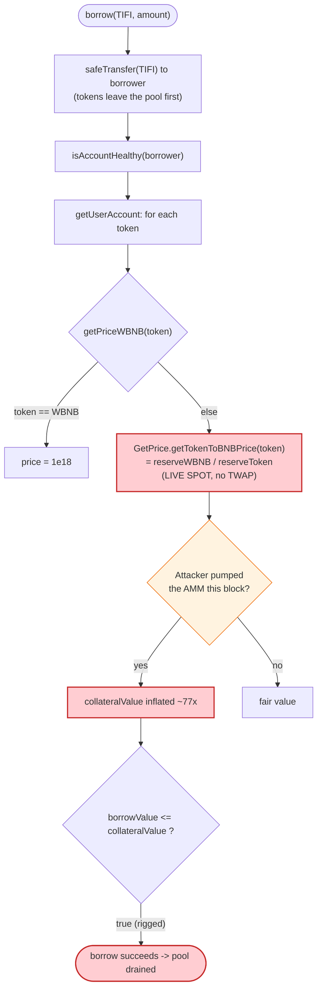

# TiFi Finance Exploit — Spot-Price Oracle Manipulation of a Lending Pool

> One-line summary: TiFi's `LendingPool` priced collateral with a live PancakeSwap **spot** reserve ratio
> (`GetPrice.getTokenToBNBPrice`), so an attacker flash-borrowed WBNB, dumped it into the thin **WBNB/BUSD**
> pool to inflate BUSD's BNB price ~77×, deposited 500 BUSD as now-overvalued collateral, and borrowed the
> **entire TiFi token reserve** of the pool — netting ~**87.14 WBNB**.

> **Reproduction:** the PoC compiles & runs in this isolated Foundry project ([project folder](.)).
> Full verbose trace: [output.txt](output.txt).
> Verified vulnerable source: [LendingPool.sol](sources/LendingPool_8A6F78/LendingPool.sol).

---

## Key info

| | |
|---|---|
| **Loss** | ~**87.14 WBNB** (≈ $24k at the time; SlowMist/PeckShield reported ~$722K total across the TiFi pools) |
| **Vulnerable contract** | `LendingPool` — [`0x8A6F7834A9d60090668F5db33FEC353a7Fb4704B`](https://bscscan.com/address/0x8A6F7834A9d60090668F5db33FEC353a7Fb4704B#code) |
| **Faulty price source** | `GetPrice` — [`0x9D1FC5AD7AC6ff99e2cE4826678c6cc0a0c8F278`](https://bscscan.com/address/0x9D1FC5AD7AC6ff99e2cE4826678c6cc0a0c8F278) (reads PancakeSwap reserves) |
| **Manipulated oracle pool** | WBNB/BUSD PancakePair — [`0x76Fc4931d9d3A2054aEe2D59633E49b759277d69`](https://bscscan.com/address/0x76Fc4931d9d3A2054aEe2D59633E49b759277d69) (only ~0.64 WBNB / 186 BUSD deep) |
| **Drained asset** | TiFi Token (`TIFI`) — [`0x17E65E6b9B166Fb8e7c59432F0db126711246BC0`](https://bscscan.com/address/0x17E65E6b9B166Fb8e7c59432F0db126711246BC0) |
| **Flash-swap source pool** | WBNB/BUSD PancakePair — [`0x58F876857a02D6762E0101bb5C46A8c1ED44Dc16`](https://bscscan.com/address/0x58F876857a02D6762E0101bb5C46A8c1ED44Dc16) |
| **Attacker EOA** | `0x59330dD17C24E1c9ed99113fD2733B147403ad33` (per PeckShield) |
| **Attack tx** | [`0x1c5272ce35338c57c6b9ea710a09766a17bbf14b61438940c3072ed49bfec402`](https://bscscan.com/tx/0x1c5272ce35338c57c6b9ea710a09766a17bbf14b61438940c3072ed49bfec402) |
| **Chain / block / date** | BSC / 23,778,726 / Dec 9, 2022 |
| **Compiler (LendingPool)** | Solidity v0.8.17, optimizer 200 runs |
| **Bug class** | DEX spot-price oracle manipulation (collateral over-valuation in a money market) |

References: [PeckShield tweet](https://twitter.com/peckshield/status/1601492605535399936) · PoC: [test/TIFI_exp.sol](test/TIFI_exp.sol)

---

## TL;DR

`LendingPool` values every user's collateral and debt with `getPriceWBNB()`, which for any non-WBNB token
calls `GetPrice.getTokenToBNBPrice(token)`. That helper returns the **instantaneous reserve ratio** of the
token's PancakeSwap pair against WBNB — a pure spot price with no TWAP, no staleness check, and no
manipulation guard ([LendingPool.sol:1423-1426](sources/LendingPool_8A6F78/LendingPool.sol#L1423-L1426)).

The BUSD price feed pool the protocol read from (`0x76Fc4931…`) was tiny: about **0.64 WBNB / 186 BUSD**.
The attacker, inside a single PancakeSwap flash-swap callback:

1. **Deposited** 500 BUSD into the BUSD pool, receiving ~479 share-tokens of collateral.
2. **Dumped** 5 WBNB into the thin WBNB/BUSD oracle pool, pushing the implied BUSD→BNB price from
   ~`0.00343` up to ~`0.254` BNB/BUSD — a **~77× inflation**.
3. **Borrowed** the *entire* TIFI balance of the lending pool (≈ `5.2957e11` TIFI). The
   `isAccountHealthy()` check now valued the 500 BUSD collateral at ~**108 BNB** instead of its honest
   ~**1.46 BNB**, so the over-collateralization check passed.
4. **Sold** the borrowed TIFI for **94.14 WBNB**, repaid the **7 WBNB** flash-swap, and walked away with
   **87.14 WBNB**.

The loan was never repaid; the TIFI it left behind in the pool was effectively worthless once dumped.

---

## Background — what TiFi Finance is

TiFi Finance is an Aave-style money market on BSC. Each ERC-20 has its own pool. Users `deposit()` liquidity
(minting a `TiFiPoolShare` receipt token), may use that liquidity as collateral, and `borrow()` any asset
across pools as long as their account stays **healthy** — i.e. total borrow value ≤ total collateral value.
Both values are denominated in BNB and computed by walking every pool the user touches and multiplying
balances by a per-token BNB price ([`getUserAccount`](sources/LendingPool_8A6F78/LendingPool.sol#L1783-L1815),
[`isAccountHealthy`](sources/LendingPool_8A6F78/LendingPool.sol#L1832-L1836)).

The price of each token is supplied by an external `GetPrice` contract
([`0x9D1FC5…`](https://bscscan.com/address/0x9D1FC5AD7AC6ff99e2cE4826678c6cc0a0c8F278)) whose
`getTokenToBNBPrice(token)` reads the token's PancakeSwap reserves and returns `reserveWBNB / reserveToken`
— a raw spot price. There is no TWAP, no Chainlink reference, and no sanity bound.

On-chain values at the fork block (read from the trace):

| Item | Value | Source |
|---|---|---|
| WBNB/BUSD oracle pool reserves (pre-attack) | 0.6392 WBNB / 186.32 BUSD | getReserves [output.txt:1651](output.txt) |
| BUSD `getCollateralPercent` (LTV) | 85% (`0.85e18`) | [output.txt:1724](output.txt) |
| TIFI held by the lending pool (drainable) | 529,570,181,341.49 TIFI | balanceOf [output.txt:1675-1676](output.txt) |
| Honest BUSD→BNB spot | ≈ 0.003431 BNB/BUSD | derived from reserves |
| Oracle BUSD→BNB price used in health check | **0.254014 BNB/BUSD** | getTokenToBNBPrice(BUSD) [output.txt:1727-1732](output.txt) |

---

## The vulnerable code

### 1. The spot-price oracle (no TWAP, no guard)

```solidity
// LendingPool.sol
// Get the price of a token based on WBNB
function getPriceWBNB(address _token) internal view returns (uint256) {
    return _token == getPrice.WBNB() ? 1e18 : getPrice.getTokenToBNBPrice(_token);
}
```
[LendingPool.sol:1423-1426](sources/LendingPool_8A6F78/LendingPool.sol#L1423-L1426)

`getPrice.getTokenToBNBPrice` (in the external `GetPrice` contract,
[interface at LendingPool.sol:7-10](sources/LendingPool_8A6F78/LendingPool.sol#L7-L10)) returns the
**instantaneous** PancakeSwap reserve ratio — exactly the value an AMM swap can move within the same
transaction.

### 2. The health check that trusts that price

```solidity
function getUserAccount(address _user) public view returns ( ... ) {
    for (uint256 i = 0; i < tokenList.length; i++) {
        ...
        uint256 poolPricePerUnit = getPriceWBNB(address(_token));      // ← manipulable spot price
        require(poolPricePerUnit > 0, "TIFI: PRICE_INVALID");
        uint256 liquidityBalanceBase = (poolPricePerUnit * compoundedLiquidityBalance) / 1e18;
        totalLiquidityBalanceBase += liquidityBalanceBase;
        if (collateralPercent > 0 && userUsePoolAsCollateral) {
            totalCollateralBalanceBase += (liquidityBalanceBase * collateralPercent) / 1e18;
        }
        totalBorrowBalanceBase += (poolPricePerUnit * compoundedBorrowBalance) / 1e18;
    }
}

function isAccountHealthy(address _user) public view override returns (bool) {
    (, uint256 totalCollateralBalanceBase, uint256 totalBorrowBalanceBase) = getUserAccount(_user);
    return totalBorrowBalanceBase <= totalCollateralBalanceBase;   // ← the only solvency gate
}
```
[LendingPool.sol:1783-1836](sources/LendingPool_8A6F78/LendingPool.sol#L1783-L1836)

### 3. `borrow()` enforces health *after* sending tokens, using that same price

```solidity
function borrow(ERC20 _token, uint256 _amount)
    external nonReentrant updatePoolWithInterestsAndTimestamp(_token)
{
    ...
    // 4. transfer borrowed token from pool to user
    _token.safeTransfer(msg.sender, _amount);

    // 5. check account health -- reverts if not healthy
    require(isAccountHealthy(msg.sender), "TIFI: ACCOUNT_UNHEALTHY");
    emit Borrow(address(_token), msg.sender, borrowShare, _amount);
}
```
[LendingPool.sol:1888-1917](sources/LendingPool_8A6F78/LendingPool.sol#L1888-L1917)

`borrow()` happily lets you take *up to the pool's entire available liquidity*
([`_amount <= getTotalAvailableLiquidity(_token)`](sources/LendingPool_8A6F78/LendingPool.sol#L1895-L1898)),
provided the post-borrow health check passes — and that check is reading a price the borrower just rigged.

---

## Root cause — why it was possible

> **The solvency invariant `borrowValue ≤ collateralValue` is enforced against a price that the borrower
> can move at will, atomically, with capital they don't even need to own (a flash swap).**

A constant-product AMM's spot reserve ratio is *not* a price oracle — it is a number that any swap mutates.
Using it directly to value collateral means:

- **Collateral inflation:** pumping the collateral token's AMM price up (or, here, pumping WBNB *into* the
  WBNB/BUSD pool to make BUSD look expensive in BNB terms) inflates `totalCollateralBalanceBase`.
- **No cost to the attacker:** the price move and the borrow happen in one transaction, and the WBNB used
  to move the price is itself flash-borrowed and repaid at the end.
- **Thin pool = cheap manipulation:** the chosen feed pool held only ~0.64 WBNB and ~186 BUSD, so 5 WBNB was
  enough for a ~77× swing. There was no requirement that the price source be deep or liquid.

Contributing design decisions:

1. **Spot price, no TWAP / external reference.** `getTokenToBNBPrice` returns `reserveOut/reserveIn` with no
   time-weighting and no Chainlink cross-check.
2. **No staleness / deviation bound.** A 77× single-block move triggered no circuit breaker.
3. **`borrow()` allows draining 100% of pool liquidity** in one call, so a single inflated health check is
   enough to empty the pool.
4. **Same manipulable price feed values both collateral and debt**, but the attacker only needs the
   collateral side over-valued and the borrowed asset under-counted — both achievable by choosing which pool
   to pump.

---

## Preconditions

- The lending pool is `ACTIVE` and holds a meaningful balance of the asset to be borrowed (TIFI pool held
  ≈ `5.2957e11` TIFI).
- The collateral token (BUSD) is enabled as collateral with `collateralPercent > 0` (85%).
- The `GetPrice` feed for the collateral token reads a **manipulable, shallow** PancakeSwap pool
  (`0x76Fc4931…`: ~0.64 WBNB / 186 BUSD).
- Access to flash liquidity in WBNB/BUSD — supplied here by a PancakeSwap **flash swap** on pool
  `0x58F876…` (the `data` argument to `swap()` triggers the `pancakeCall` callback). No own capital required.

---

## Step-by-step attack walkthrough

The whole exploit happens inside one `pancakeCall` callback initiated by a flash swap. Token0/token1 of the
oracle pool are `WBNB`/`BUSD` (because `0xbb4c… < 0xe9e7…`).

| # | Action | Concrete on-chain values | Effect |
|---|--------|--------------------------|--------|
| 0 | `Pair(0x58F876).swap(5 WBNB, 500 BUSD, this, data)` — flash-swap; `data` non-empty ⇒ `pancakeCall` fires | borrowed **5 WBNB + 500 BUSD** | Attacker now holds working capital, owes 7 WBNB back to the pair. |
| 1 | `TIFI.deposit(BUSD, 500e18)` | mints **479.36** TiFiBUSD shares ([output.txt:1633](output.txt)) | 500 BUSD collateral recorded. At honest price worth ~1.46 BNB of LTV. |
| 2 | `WBNBToBUSD()` — swap 5 WBNB → BUSD on oracle pool `0x76Fc4931…` | reserves move **0.64/186 → 5.64/21.16** (WBNB/BUSD) ([output.txt:1665](output.txt)) | BUSD→BNB spot jumps **0.00343 → 0.2665** (≈ **77×**). |
| 3 | `TIFI.borrow(TIFI, balanceOf(pool))` — borrow the **entire** TIFI reserve | `getTokenToBNBPrice(BUSD)` returns **0.254014 BNB/BUSD** ([output.txt:1727-1732](output.txt)); borrow **529,570,181,341.49 TIFI** ([output.txt:1677](output.txt)) | Health check: collateral ≈ `500 × 0.254 × 0.85` ≈ **108 BNB**, far above the borrowed TIFI's BNB value ⇒ `isAccountHealthy` returns true. |
| 4 | `TIFIToWBNB()` — sell all received TIFI into the TIFI/WBNB pool `0xB62BB233…` | TIFI is fee/reflection-taxed on transfer; net **518.98e9 TIFI** reaches the pool ([output.txt:1753](output.txt)); receive **94.138 WBNB** ([output.txt:1774-1776](output.txt)) | Loan proceeds converted to WBNB. |
| 5 | `WBNB.transfer(Pair(0x58F876), 7 WBNB)` — repay the flash swap | pair re-syncs to 0x58F876 reserves ([output.txt:1806-1807](output.txt)) | Flash swap settled (5 WBNB + 500 BUSD borrowed ⇒ 7 WBNB repaid). |
| 6 | End | final attacker WBNB balance = **87.138130** ([output.txt:1813-1815](output.txt)) | Net profit booked. |

The BUSD position remains "collateral" backing a now-defaulted TIFI loan; the protocol is left holding
worthless borrowed-out TIFI exposure and missing its WBNB-denominated liquidity.

---

## Profit / loss accounting (WBNB)

| Direction | Amount (WBNB) | Source |
|---|---:|---|
| Received — sell borrowed TIFI → WBNB | +94.1381 | swap out [output.txt:1774](output.txt) |
| Spent — repay flash swap | −7.0000 | transfer [output.txt:1795](output.txt) |
| **Net profit** | **+87.1381** | final balance [output.txt:1814](output.txt) |

The flash swap also moved 500 BUSD in and 5 WBNB in (net of the 5 WBNB and 500 BUSD initially received), all
of which nets out in the 7-WBNB repayment. The attacker started and ended with **0 WBNB of own capital**,
making this a pure flash-funded extraction.

---

## Diagrams

### Sequence of the attack



### Collateral valuation: honest vs. manipulated price



### The flaw inside the health check



---

## Remediation

1. **Do not use raw AMM spot prices for solvency.** Replace `getTokenToBNBPrice` with a manipulation-resistant
   oracle: Chainlink price feeds (with staleness + deviation checks) as the primary source, optionally
   cross-checked against a long-window Uniswap/PancakeSwap **TWAP**. Never read instantaneous `getReserves()`
   ratios for collateral/debt valuation.
2. **Add staleness and deviation bounds.** Reject prices older than a max age and reject single-update moves
   larger than a sane percentage band, so a 77× one-block swing can never be accepted.
3. **Require deep, sanctioned price pools.** If an on-chain DEX must be used, restrict it to high-liquidity,
   protocol-vetted pairs and require a minimum reserve depth — the BUSD feed pool here was trivially thin.
4. **Bound per-call borrow size.** Even with a good oracle, allowing a single `borrow()` to drain 100% of a
   pool's liquidity magnifies any pricing error; consider utilization caps and per-tx borrow limits.
5. **Re-validate health against price snapshots taken before the borrowing transaction's own state changes**,
   and consider checks-effects-interactions ordering so external-call-driven price moves cannot retroactively
   satisfy the health invariant.

---

## How to reproduce

The PoC was extracted into a standalone Foundry project (the umbrella DeFiHackLabs repo has many unrelated
PoCs that fail to compile together).

```bash
_shared/run_poc.sh 2022-12-TIFI_exp --mt testExploit -vvvvv
```

- RPC: a **BSC archive** endpoint is required (fork block 23,778,726, Dec 2022). Most public BSC RPCs prune
  this far back and fail with `header not found` / `missing trie node`.
- Result: `[PASS] testExploit()`; the test logs the attacker's final WBNB balance.

Expected tail (see [output.txt:1566-1820](output.txt)):

```
Ran 1 test for test/TIFI_exp.sol:ContractTest
[PASS] testExploit() (gas: 948610)
  [End] Attacker WBNB balance after exploit: 87.138130026273038368
Suite result: ok. 1 passed; 0 failed; 0 skipped
```

---

*Reference: PeckShield — https://twitter.com/peckshield/status/1601492605535399936 (TiFi Finance, BSC, Dec 2022).*
