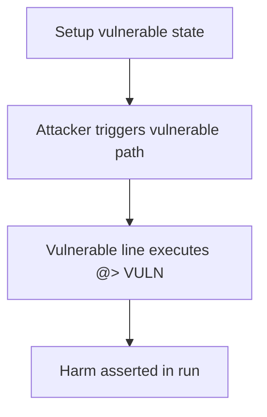

# Polynomial — Hedging during liquidation over-hedges the LiquidityPool

> **Vulnerability classes:** vuln/liquidation/incorrect-hedge · vuln/accounting/double-count

> **Reproduction:** a self-contained Foundry PoC that compiles & runs in an
> isolated project with **only `forge-std`** — no fork, no RPC, no `anvil_state`.
> Full trace: [output.txt](output.txt). PoC:
> [test/20225-h-02-hedging-during-liquidation-is-incorrect-code4rena-polyn_exp.sol](test/20225-h-02-hedging-during-liquidation-is-incorrect-code4rena-polyn_exp.sol).

<!-- non-defihacklabs -->
<!-- source-auditvault: https://github.com/Auditware/AuditVault/blob/main/findings/20225-h-02-hedging-during-liquidation-is-incorrect-code4rena-polyn.md -->
<!-- date: 2023-03 -->

**AuditVault taxonomy:** `lang/solidity` · `sector/perpetuals` · `platform/code4rena` · `severity/high` · genome: `liquidation-logic`

---

## Key info

| | |
|---|---|
| **Impact** | **HIGH** — Liquidation already balances short inventory and powerPerp burn, but pool.liquidate still hedges again and burns pool funds as fees |
| **Protocol** | Polynomial Protocol |
| **Finding** | Code4rena — Polynomial Protocol, 2023-03 · #20225 |
| **Report** | [2023-03-polynomial](https://code4rena.com/reports/2023-03-polynomial) |
| **Source** | [AuditVault](https://github.com/Auditware/AuditVault/blob/main/findings/20225-h-02-hedging-during-liquidation-is-incorrect-code4rena-polyn.md) |
| **Status** | Audit finding — reproduced as a standalone local synthetic PoC. |
| **Compiler** | `^0.8.24` (PoC) |

---

## TL;DR

Liquidation already balances short inventory and powerPerp burn, but pool.liquidate still hedges again and burns pool funds as fees

See the vulnerable line marked `// @> VULN` in `test/20225-h-02-hedging-during-liquidation-is-incorrect-code4rena-polyn.sol` and the
end-to-end `Exploit.run()` that asserts the harm.

---

## Diagrams

---

## Impact

Liquidation already balances short inventory and powerPerp burn, but pool.liquidate still hedges again and burns pool funds as fees

---

## Sources

- [AuditVault finding](https://github.com/Auditware/AuditVault/blob/main/findings/20225-h-02-hedging-during-liquidation-is-incorrect-code4rena-polyn.md)
- [Code4rena report](https://code4rena.com/reports/2023-03-polynomial)
- Reduced source: synthetic reconstruction of the blamed functions from the contest repo (see finding for verbatim snippets).
