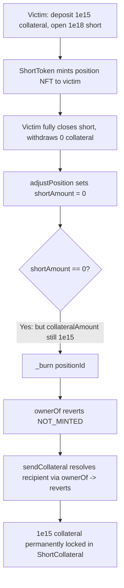
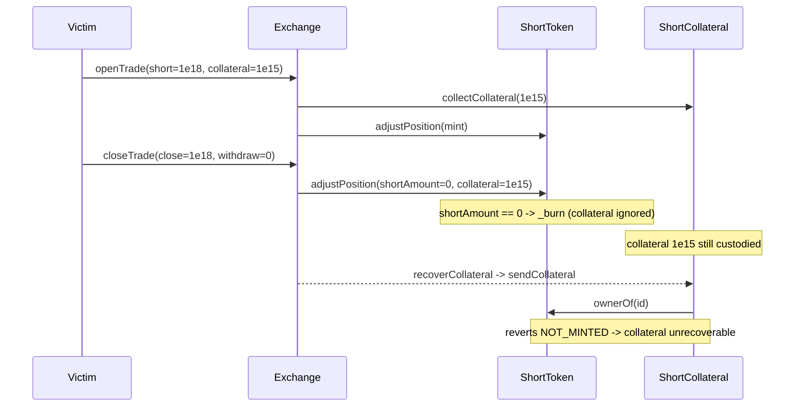

# Polynomial Protocol — short positions can be burned while still holding collateral

> **Vulnerability classes:** vuln/logic/wrong-condition · vuln/loss-of-funds/locked-funds · vuln/nft/burn-with-residual-state

> **Reproduction:** a self-contained Foundry PoC that compiles & runs in an
> isolated project with **only `forge-std`** — no fork, no RPC, no `anvil_state`.
> Full trace: [output.txt](output.txt). PoC:
> [test/20226-h-03-short-positions-can-be-burned-while-holding-collateral_exp.sol](test/20226-h-03-short-positions-can-be-burned-while-holding-collateral_exp.sol).

<!-- non-defihacklabs -->
<!-- source-auditvault: https://github.com/Auditware/AuditVault/blob/main/findings/20226-h-03-short-positions-can-be-burned-while-holding-collateral.md -->
<!-- date: 2023-03 -->

---

## Key info

| | |
|---|---|
| **Impact** | **HIGH** — a short position's ERC721 is burned the instant its short size reaches 0, even with collateral remaining; that collateral becomes permanently locked because it can only be paid out to the (now non-existent) position owner |
| **Protocol** | Polynomial Protocol — options/perps (short-position core) |
| **Vulnerable code** | `ShortToken.adjustPosition` — `if (position.shortAmount == 0) { _burn(positionId); }` (no `collateralAmount == 0` check) |
| **Bug class** | Wrong condition: state (collateral) survives an entity (the position NFT) that is destroyed too eagerly |
| **Finding** | Code4rena — Polynomial Protocol, 2023-03 · #20226 · reporter **Bauer** |
| **Report** | [code4rena.com/reports/2023-03-polynomial](https://code4rena.com/reports/2023-03-polynomial) |
| **Source** | [AuditVault](https://github.com/Auditware/AuditVault/blob/main/findings/20226-h-03-short-positions-can-be-burned-while-holding-collateral.md) |
| **Status** | Audit finding — confirmed by the sponsor, judged HIGH (not exploited on-chain). Reproduced here as a standalone local PoC. |
| **Compiler** | `^0.8.24` (PoC) |

This is an **audit finding**, not a historical on-chain incident. The upstream
Code4rena source repo has been taken down, so the reduced PoC preserves the
vulnerable `adjustPosition` burn logic verbatim from the finding and the merged
contest report, and models a minimal Exchange / ShortToken / ShortCollateral so
the "collateral locked" harm becomes a mechanically-checkable state.

---

## TL;DR

1. `ShortToken.adjustPosition` writes the new `shortAmount`, then burns the
   position's ERC721 whenever `shortAmount == 0`.
2. It never checks `collateralAmount`. A position can therefore be burned while
   it still records — and `ShortCollateral` still physically holds — collateral.
3. Collateral is only ever returned via `ShortCollateral.sendCollateral`, which
   resolves the recipient through `shortToken.ownerOf(positionId)`. After the
   burn that call reverts `NOT_MINTED`, so the collateral can never be paid out.
4. Three realistic triggers (per the finding): a user reduces a short to 0 while
   keeping collateral; an attacker fully liquidates a short with residual
   collateral; or an attacker frontruns a `closeTrade` with a liquidation.
5. In the PoC a user opens a `1e18` short backed by `1e15` sUSD, then fully
   closes it while withdrawing **no** collateral. The position is burned; the
   `1e15` collateral stays in `ShortCollateral` with no owner to receive it —
   a permanent loss.

---

## The vulnerable code

`ShortToken.adjustPosition` (verbatim burn logic):

```solidity
position.collateralAmount = collateralAmount;
position.shortAmount = shortAmount;

if (position.shortAmount == 0) {   // @> burns even when collateralAmount != 0
    _burn(positionId);
}
```

The only collateral-return path resolves the recipient via `ownerOf`, which
reverts once the position is burned:

```solidity
function sendCollateral(uint256 positionId, uint256 amount) external onlyExchange {
    UserCollateral storage uc = userCollaterals[positionId];
    uc.amount -= amount;
    address user = shortToken.ownerOf(positionId); // reverts NOT_MINTED after burn
    ERC20(uc.collateral).safeTransfer(user, amount);
}
```

---

## Root cause

Burning the position NFT is treated as equivalent to "the short is closed",
but the NFT is *also* the sole key to the collateral held for that position.
Destroying it while `collateralAmount > 0` orphans real assets: the accounting
still says the collateral exists, `ShortCollateral` still holds the tokens, but
there is no owner the protocol can pay it to. The burn condition must also
require `collateralAmount == 0`.

## Preconditions

- A position exists with `collateralAmount > 0`.
- Any operation drives `shortAmount` to 0 without first zeroing the collateral
  (a partial-close that keeps collateral, or a full liquidation that leaves a
  residual). All are permissionless / normal-flow.

## Attack walkthrough

From [output.txt](output.txt):

1. Victim deposits `1e15` sUSD collateral and opens a `1e18` short; `ShortToken`
   mints the position and `ShortCollateral` takes custody of the collateral.
2. Victim fully closes the short (`closeShort(id, 1e18, 0)`) — reducing
   `shortAmount` to 0 but withdrawing **0** collateral, so the position keeps
   its `1e15`.
3. `adjustPosition` sets `shortAmount = 0` and, because of that, `_burn`s the
   position — with `collateralAmount` still `1e15`.
4. **HARM:** `ownerOf(id)` now reverts `NOT_MINTED`; the `1e15` collateral is
   still recorded on the position and still sitting in `ShortCollateral`, but
   every `sendCollateral` call reverts (owner lookup fails). The collateral is
   permanently locked; the victim recovered nothing.

## Diagrams





## Impact

A user (or victim of a liquidation/frontrun) permanently loses whatever
collateral remains on a position that is closed to `shortAmount == 0`. The loss
is exactly the residual collateral: in the PoC, `1e15` sUSD, unrecoverable by
anyone. The finding was confirmed by the sponsor and judged HIGH.

## Remediation

Guard the burn on collateral too:

```diff
-            if (position.shortAmount == 0) {
+            if (position.shortAmount == 0 && position.collateralAmount == 0) {
                 _burn(positionId);
             }
```

## How to reproduce

```bash
cd ~/RustroverProjects/audits/evm-hack-registry/20226-h-03-short-positions-can-be-burned-while-holding-collateral_exp
forge test -vvv
# Fully local — no fork, no RPC, no anvil_state required.
# Expected: test_burnLocksCollateral PASSES (position burned, collateral stuck,
# every recovery path reverts NOT_MINTED).
```

PoC source: [test/20226-h-03-short-positions-can-be-burned-while-holding-collateral_exp.sol](test/20226-h-03-short-positions-can-be-burned-while-holding-collateral_exp.sol)
— drives the verbatim vulnerable `adjustPosition` burn and re-asserts the lock.

> Note: token magnitudes, the 1:1 collateral model, and the minimal
> Exchange/ShortCollateral plumbing are reduced-model assumptions (the real
> Polynomial system is out of scope); the vulnerable burn condition and the
> "burned position ⇒ collateral unrecoverable" mechanism are faithful.

---

## Sources

- **AuditVault finding:** [20226-h-03-short-positions-can-be-burned-while-holding-collateral.md](https://github.com/Auditware/AuditVault/blob/main/findings/20226-h-03-short-positions-can-be-burned-while-holding-collateral.md)
- **Contest report:** [Code4rena — Polynomial Protocol (2023-03)](https://code4rena.com/reports/2023-03-polynomial)
- **Reduced-source provenance:** vulnerable `ShortToken.adjustPosition` burn
  logic reconstructed verbatim from the AuditVault finding and the merged
  contest report `code-423n4/2023-03-polynomial-findings@main` (`report.md`,
  `## [07]` adjustPosition body). The original contest source repo
  `code-423n4/2023-03-polynomial` has been taken down.
