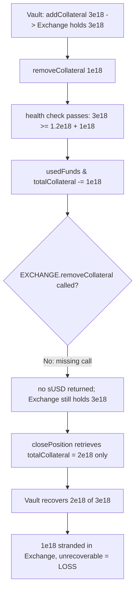

# Polynomial Protocol — KangarooVault.removeCollateral updates storage without removing collateral

> **Vulnerability classes:** vuln/logic/missing-external-call · vuln/loss-of-funds/locked-funds · vuln/accounting/state-desync

> **Reproduction:** a self-contained Foundry PoC that compiles & runs in an
> isolated project with **only `forge-std`** — no fork, no RPC, no `anvil_state`.
> Full trace: [output.txt](output.txt). PoC:
> [test/20227-h-04-kangaroovaultremovecollateral-updates-storage-without-a_exp.sol](test/20227-h-04-kangaroovaultremovecollateral-updates-storage-without-a_exp.sol).

<!-- non-defihacklabs -->
<!-- source-auditvault: https://github.com/Auditware/AuditVault/blob/main/findings/20227-h-04-kangaroovaultremovecollateral-updates-storage-without-a.md -->
<!-- date: 2023-03 -->

---

## Key info

| | |
|---|---|
| **Impact** | **HIGH** — removeCollateral decrements the vault's collateral accounting but never pulls collateral back from the Exchange; the "removed" collateral is stranded in the Exchange and permanently lost to the vault's LPs on close |
| **Protocol** | Polynomial Protocol — KangarooVault (Power-Perp short-position vault) |
| **Vulnerable code** | `KangarooVault.removeCollateral` — updates `usedFunds` / `positionData.totalCollateral` but omits `EXCHANGE.removeCollateral(...)` |
| **Bug class** | Missing external call: state updated as if an effect happened, but the effect (asset movement) never does |
| **Finding** | Code4rena — Polynomial Protocol, 2023-03 · #20227 · reporter **Bauer** (severity raised to High by the judge) |
| **Report** | [code4rena.com/reports/2023-03-polynomial](https://code4rena.com/reports/2023-03-polynomial) |
| **Source** | [AuditVault](https://github.com/Auditware/AuditVault/blob/main/findings/20227-h-04-kangaroovaultremovecollateral-updates-storage-without-a.md) |
| **Status** | Audit finding — confirmed via duplicate, judged HIGH (not exploited on-chain). Reproduced here as a standalone local PoC. |
| **Compiler** | `^0.8.24` (PoC) |

This is an **audit finding**, not a historical on-chain incident. The upstream
Code4rena source repo has been taken down, so the reduced PoC preserves the
vulnerable `removeCollateral` verbatim from the finding and models a minimal
Exchange that actually custodies collateral, so the "lost collateral" harm
becomes a mechanically-checkable balance shortfall.

---

## TL;DR

1. `addCollateral` transfers collateral to the Exchange and increments
   `usedFunds` / `positionData.totalCollateral` — real assets move.
2. `removeCollateral` decrements the same accounting but **never calls
   `EXCHANGE.removeCollateral`**, so no collateral is pulled back. The vault's
   books say the collateral is gone; the collateral is still in the Exchange.
3. On close, `_closePosition` retrieves only `positionData.totalCollateral`
   (already decremented), so the removed slice is never requested back.
4. Result: the removed collateral is stranded in the Exchange with no path to
   recover it. In the PoC the vault posts `3e18`, "removes" `1e18`, and closes —
   recovering only `2e18`. The `1e18` is permanently lost.

---

## The vulnerable code

`KangarooVault.removeCollateral` (verbatim):

```solidity
function removeCollateral(uint256 collateralToRemove) external requiresAuth nonReentrant {
    (uint256 markPrice,) = LIQUIDITY_POOL.getMarkPrice();
    uint256 minColl = positionData.shortAmount.mulWadDown(markPrice);
    minColl = minColl.mulWadDown(collRatio);

    require(positionData.totalCollateral >= minColl + collateralToRemove);

    usedFunds -= collateralToRemove;
    positionData.totalCollateral -= collateralToRemove; // @> EXCHANGE.removeCollateral is NEVER called

    emit RemoveCollateral(positionData.positionId, collateralToRemove);
}
```

Compare `addCollateral`, which *does* move assets (`EXCHANGE.addCollateral`):

```solidity
function addCollateral(uint256 additionalCollateral) external requiresAuth nonReentrant {
    SUSD.safeApprove(address(EXCHANGE), additionalCollateral);
    EXCHANGE.addCollateral(positionData.positionId, additionalCollateral);
    usedFunds += additionalCollateral;
    positionData.totalCollateral += additionalCollateral;
    ...
}
```

---

## Root cause

`removeCollateral` performs the *accounting* half of a collateral withdrawal
without the *asset-movement* half. Because collateral is only ever returned by
the Exchange, and the vault never asks for it, the decrement silently desyncs
the books from reality. On close the vault asks the Exchange for only what its
(decremented) books claim, so the difference is orphaned in the Exchange.

## Preconditions

- A position with posted collateral exists and is healthy enough to pass the
  `totalCollateral >= minColl + collateralToRemove` check.
- The admin (or any `requiresAuth` caller) invokes `removeCollateral` — a normal
  operation.

## Attack walkthrough

From [output.txt](output.txt):

1. Vault posts `3e18` collateral to the Exchange (`addCollateral`); books:
   `totalCollateral = 3e18`, `usedFunds = 3e18`; Exchange holds `3e18`.
2. Admin calls `removeCollateral(1e18)` — the health check passes
   (`3e18 >= 1.2e18 + 1e18`). `usedFunds` and `totalCollateral` drop to `2e18`,
   but **no** sUSD returns. Exchange still holds `3e18`.
3. `closePosition` retrieves `totalCollateral = 2e18` from the Exchange.
4. **HARM:** the vault ends with `2e18` — it deposited `3e18` and got nothing
   for the removal. The remaining `1e18` is stranded in the Exchange; the
   position is closed, so no path remains to recover it. Loss = removed amount.

## Diagrams



## Impact

The vault (its LP token holders) permanently loses whatever collateral is
"removed": the removed slice is neither returned at removal time nor recovered
on close. The finding also notes a secondary effect — `usedFunds` is understated
so `processWithdrawalQueue` can revert (availableFunds exceeds the real
balance). The judge raised the severity to HIGH as a direct loss of funds.

## Remediation

Actually pull the collateral back:

```diff
     usedFunds -= collateralToRemove;
     positionData.totalCollateral -= collateralToRemove;
+    EXCHANGE.removeCollateral(positionData.positionId, collateralToRemove);
     emit RemoveCollateral(positionData.positionId, collateralToRemove);
```

## How to reproduce

```bash
cd ~/RustroverProjects/audits/evm-hack-registry/20227-h-04-kangaroovaultremovecollateral-updates-storage-without-a_exp
forge test -vvv
# Fully local — no fork, no RPC, no anvil_state required.
# Expected: test_removeCollateralLosesFunds PASSES (vault recovers 2e18 of 3e18;
# 1e18 stranded in the Exchange).
```

PoC source: [test/20227-h-04-kangaroovaultremovecollateral-updates-storage-without-a_exp.sol](test/20227-h-04-kangaroovaultremovecollateral-updates-storage-without-a_exp.sol)
— drives the verbatim vulnerable `removeCollateral` and re-asserts the loss.

> Note: the 1:1 collateral model, fixed `markPrice`/`collRatio`, and the minimal
> Exchange plumbing are reduced-model assumptions (the real Polynomial system is
> out of scope); the vulnerable missing-call and the "removed collateral is lost
> on close" mechanism are faithful.

---

## Sources

- **AuditVault finding:** [20227-h-04-kangaroovaultremovecollateral-updates-storage-without-a.md](https://github.com/Auditware/AuditVault/blob/main/findings/20227-h-04-kangaroovaultremovecollateral-updates-storage-without-a.md)
- **Contest report:** [Code4rena — Polynomial Protocol (2023-03)](https://code4rena.com/reports/2023-03-polynomial)
- **Reduced-source provenance:** vulnerable `KangarooVault.removeCollateral` (and
  `addCollateral` context) reconstructed verbatim from the AuditVault finding
  (which quotes `src/KangarooVault.sol#L424-L447`) and the merged contest report
  `code-423n4/2023-03-polynomial-findings@main`. The original contest source repo
  `code-423n4/2023-03-polynomial` has been taken down.
