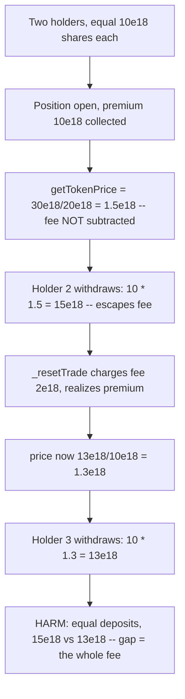

# Polynomial Protocol — uneven performance-fee deduction shortchanges late KangarooVault holders

> **Vulnerability classes:** vuln/accounting/fee-calculation · vuln/logic/price-inconsistency · vuln/mev/frontrun-exposure

> **Reproduction:** a self-contained Foundry PoC that compiles & runs in an
> isolated project with **only `forge-std`** — no fork, no RPC, no `anvil_state`.
> Full trace: [output.txt](output.txt). PoC:
> [test/20228-h-05-uneven-deduction-of-performance-fee-causes-some-kangaro_exp.sol](test/20228-h-05-uneven-deduction-of-performance-fee-causes-some-kangaro_exp.sol).

<!-- non-defihacklabs -->
<!-- source-auditvault: https://github.com/Auditware/AuditVault/blob/main/findings/20228-h-05-uneven-deduction-of-performance-fee-causes-some-kangaro.md -->
<!-- date: 2023-03 -->

---

## Key info

| | |
|---|---|
| **Impact** | **HIGH** — getTokenPrice omits the pending performanceFee while a position is open, so a holder who withdraws before `_resetTrade` escapes the fee at an inflated price and the remaining holders bear it, losing part of their token value |
| **Protocol** | Polynomial Protocol — KangarooVault (Power-Perp vault) |
| **Vulnerable code** | `KangarooVault.getTokenPrice` — `totalValue -= (usedFunds + markPrice.mulWadDown(shortAmount))` (no `+ premiumCollected.mulWadDown(performanceFee)`) |
| **Bug class** | Price/accounting inconsistency: `getTokenPrice` and `_resetTrade` disagree on whether the fee is already charged |
| **Finding** | Code4rena — Polynomial Protocol, 2023-03 · #20228 · reporter **peakbolt** |
| **Report** | [code4rena.com/reports/2023-03-polynomial](https://code4rena.com/reports/2023-03-polynomial) |
| **Source** | [AuditVault](https://github.com/Auditware/AuditVault/blob/main/findings/20228-h-05-uneven-deduction-of-performance-fee-causes-some-kangaro.md) |
| **Status** | Audit finding — confirmed by the sponsor, judged HIGH (not exploited on-chain). Reproduced here as a standalone local PoC. |
| **Compiler** | `^0.8.24` (PoC) |

This is an **audit finding**, not a historical on-chain incident. The upstream
Code4rena source repo has been taken down, so the reduced PoC preserves the
vulnerable `getTokenPrice` open-position branch and the `_resetTrade` fee logic
verbatim, and installs a minimal two-holder open-position state so the uneven
distribution becomes two concrete, comparable payouts.

---

## TL;DR

1. While a position is open, `getTokenPrice` values the vault as
   `totalFunds + premiumCollected + …` and subtracts `usedFunds + markPrice*short`
   — but **not** the `performanceFee` that `_resetTrade` will charge on that
   premium.
2. So the open-position share price is over-stated by
   `premiumCollected * performanceFee / totalSupply`.
3. A holder who withdraws **before** `_resetTrade` redeems at that inflated
   price and escapes the fee. `_resetTrade` then charges the whole fee, dropping
   the price, so holders who exit **after** bear all of it.
4. In the PoC two holders deposit an equal `10e18`. The first-out holder redeems
   `15e18`; the last-out holder redeems only `13e18`. The `2e18` gap is exactly
   the performance fee — evaded by one holder, borne entirely by the other.

---

## The vulnerable code

`KangarooVault.getTokenPrice`, open-position branch (verbatim):

```solidity
uint256 totalValue = totalFunds + positionData.premiumCollected + totalMargin + positionData.totalCollateral;
totalValue -= (usedFunds + markPrice.mulWadDown(positionData.shortAmount)); // @> omits premiumCollected.mulWadDown(performanceFee)
return totalValue.divWadDown(totalSupply);
```

`_resetTrade` DOES charge the fee (verbatim):

```solidity
uint256 fees = positionData.premiumCollected.mulWadDown(performanceFee);
if (fees > 0) SUSD.safeTransfer(feeReceipient, fees);
totalFunds += positionData.premiumCollected - fees;
```

---

## Root cause

`getTokenPrice` and `_resetTrade` disagree about the fee. `_resetTrade`
subtracts `premiumCollected * performanceFee` from the value distributed to
holders; `getTokenPrice` does not. During the open window the price therefore
reflects a fee-free premium. Whoever exits in that window is paid as if no fee
existed; the fee is then charged in full against whoever remains.

## Preconditions

- A profitable open position (non-zero `premiumCollected`) and a non-zero
  `performanceFee`.
- Two or more holders, at least one exiting before `_resetTrade`
  (`clearPendingCloseOrders`) and at least one after — a normal-flow race, and
  cheaply forced by frontrunning the close.

## Attack walkthrough

From [output.txt](output.txt) (`1e18` == one unit):

1. Holders 2 and 3 each hold `10e18` shares (equal deposits). A `10e18` premium
   is collected on an open position; `performanceFee = 20%`.
2. `getTokenPrice` returns `(20e18 + 10e18) / 20e18 = 1.5e18` — the fee is not
   subtracted.
3. Holder 2 withdraws at `1.5e18`, receiving `15e18` (fee escaped).
4. `_resetTrade` charges `fees = 10e18 * 20% = 2e18`, realizes the net premium,
   and the price drops to `13e18 / 10e18 = 1.3e18`.
5. Holder 3 withdraws at `1.3e18`, receiving only `13e18`.
6. **HARM:** equal deposits, unequal payouts — `15e18` vs `13e18`. The `2e18`
   gap is the entire performance fee; holder 3 was shortchanged by the fee that
   holder 2 evaded (fair would be `14e18` each).

## Diagrams



## Impact

Holders who exit after `_resetTrade` lose part of their token value: they bear a
performance fee that earlier-exiting holders escaped. An attacker can force the
race by frontrunning `clearPendingCloseOrders` with their own withdrawal,
systematically shifting the fee onto everyone else. Confirmed by the sponsor and
judged HIGH.

## Remediation

Make `getTokenPrice` subtract the same fee `_resetTrade` will charge:

```diff
- totalValue -= (usedFunds + markPrice.mulWadDown(positionData.shortAmount));
+ totalValue -= (usedFunds + markPrice.mulWadDown(positionData.shortAmount) + positionData.premiumCollected.mulWadDown(performanceFee));
```

## How to reproduce

```bash
cd ~/RustroverProjects/audits/evm-hack-registry/20228-h-05-uneven-deduction-of-performance-fee-causes-some-kangaro_exp
forge test -vvv
# Fully local — no fork, no RPC, no anvil_state required.
# Expected: test_unevenPerformanceFee PASSES (equal deposits, payouts 15e18 vs
# 13e18, gap == the 2e18 fee).
```

PoC source: [test/20228-h-05-uneven-deduction-of-performance-fee-causes-some-kangaro_exp.sol](test/20228-h-05-uneven-deduction-of-performance-fee-causes-some-kangaro_exp.sol)
— drives the verbatim vulnerable `getTokenPrice` / `_resetTrade` and re-asserts
the uneven payouts.

> Note: the numeric state (deposits, premium, fee, zeroed margin/short) is a
> reduced-model setup that isolates the fee bug; the vulnerable `getTokenPrice`
> subtraction and the fee-charging `_resetTrade` are faithful, as is the
> "exit-before-reset escapes the fee" mechanism.

---

## Sources

- **AuditVault finding:** [20228-h-05-uneven-deduction-of-performance-fee-causes-some-kangaro.md](https://github.com/Auditware/AuditVault/blob/main/findings/20228-h-05-uneven-deduction-of-performance-fee-causes-some-kangaro.md)
- **Contest report:** [Code4rena — Polynomial Protocol (2023-03)](https://code4rena.com/reports/2023-03-polynomial)
- **Reduced-source provenance:** vulnerable `KangarooVault.getTokenPrice` and
  `_resetTrade` reconstructed verbatim from the AuditVault finding (which quotes
  `src/KangarooVault.sol#L358-L359` and `#L788-L789`) and the merged contest
  report `code-423n4/2023-03-polynomial-findings@main`. The original contest
  source repo `code-423n4/2023-03-polynomial` has been taken down.
