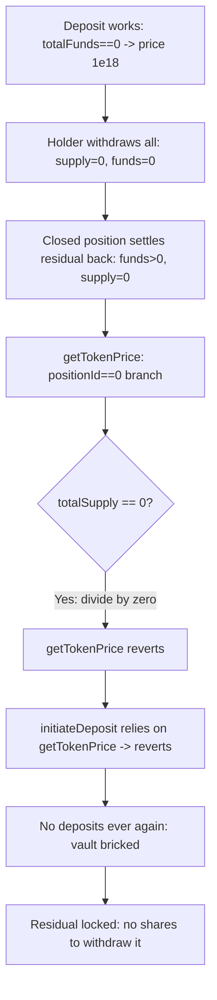

# Polynomial Protocol — division-by-zero in getTokenPrice bricks KangarooVault with funds locked

> **Vulnerability classes:** vuln/dos/frozen-funds · vuln/logic/division-by-zero · vuln/loss-of-funds/locked-funds

> **Reproduction:** a self-contained Foundry PoC that compiles & runs in an
> isolated project with **only `forge-std`** — no fork, no RPC, no `anvil_state`.
> Full trace: [output.txt](output.txt). PoC:
> [test/20229-h-06-division-by-zero-error-causes-kangaroovault-to-be-dos-w_exp.sol](test/20229-h-06-division-by-zero-error-causes-kangaroovault-to-be-dos-w_exp.sol).

<!-- non-defihacklabs -->
<!-- source-auditvault: https://github.com/Auditware/AuditVault/blob/main/findings/20229-h-06-division-by-zero-error-causes-kangaroovault-to-be-dos-w.md -->
<!-- date: 2023-03 -->

---

## Key info

| | |
|---|---|
| **Impact** | **HIGH** — getTokenPrice divides by a zero share supply, so once all holders exit while any residual remains, every deposit reverts forever and the residual is permanently locked (vault bricked) |
| **Protocol** | Polynomial Protocol — KangarooVault (Power-Perp vault) |
| **Vulnerable code** | `KangarooVault.getTokenPrice` — `return totalFunds.divWadDown(totalSupply)` with no `totalSupply == 0` guard |
| **Bug class** | Unhandled division by zero → denial of service |
| **Finding** | Code4rena — Polynomial Protocol, 2023-03 · #20229 · reporter **peakbolt** |
| **Report** | [code4rena.com/reports/2023-03-polynomial](https://code4rena.com/reports/2023-03-polynomial) |
| **Source** | [AuditVault](https://github.com/Auditware/AuditVault/blob/main/findings/20229-h-06-division-by-zero-error-causes-kangaroovault-to-be-dos-w.md) |
| **Status** | Audit finding — confirmed by the sponsor, judged HIGH (direct impact on assets). Reproduced here as a standalone local PoC. |
| **Compiler** | `^0.8.24` (PoC) |

This is an **audit finding**, not a historical on-chain incident. The upstream
Code4rena source repo has been taken down, so the reduced PoC preserves the
vulnerable `getTokenPrice` verbatim and drives the vault into the exact
"funds present, zero supply" state the finding describes.

---

## TL;DR

1. `getTokenPrice` returns `totalFunds.divWadDown(totalSupply)` when
   `totalFunds != 0` and `positionId == 0`, with no guard for `totalSupply == 0`.
2. That state is reachable: after all positions close and every holder
   withdraws, a residual can remain (a delayed settlement / rounding leftover).
3. `getTokenPrice` then divides by zero and reverts.
4. `initiateDeposit` prices new shares via `getTokenPrice`, so it reverts too —
   deposits are impossible **forever**. The residual cannot be withdrawn either
   (no shares to burn). The vault is permanently DoS'd with funds locked.

---

## The vulnerable code

`KangarooVault.getTokenPrice` (verbatim):

```solidity
if (totalFunds == 0) {
    return 1e18;
}

uint256 totalSupply = getTotalSupply();
if (positionData.positionId == 0) {
    return totalFunds.divWadDown(totalSupply); // @> reverts when totalSupply == 0
}
```

---

## Root cause

The `totalFunds == 0` special case exists, but the symmetric `totalSupply == 0`
case does not. Funds and supply can desync — funds can be non-zero while supply
is zero — after everyone withdraws and a residual settles in. In that state the
price is `funds / 0`, which reverts, and every code path that needs a price
(deposits) is bricked.

## Preconditions

- All share holders have withdrawn (`totalSupply == 0`).
- A residual remains in the vault (`totalFunds != 0`) with no open position
  (`positionId == 0`) — a delayed settlement return or rounding leftover.

## Attack walkthrough

From [output.txt](output.txt):

1. A healthy deposit works: `totalFunds == 0` ⇒ price `1e18`; `1e18` deposited,
   `1e18` shares minted.
2. The sole holder withdraws everything: `totalSupply` and `totalFunds` → 0.
3. A closed position settles a residual back into the vault: `totalFunds > 0`
   while `totalSupply == 0`.
4. **HARM:** `getTokenPrice` divides `totalFunds` by `0` and reverts. Because
   `initiateDeposit` calls `getTokenPrice`, every future deposit reverts — the
   vault can never mint shares again. The residual is locked: there are no
   shares to burn, so it can never be withdrawn.

## Diagrams



## Impact

Once the vault reaches the "residual + zero supply" state it is permanently
unusable: deposits revert forever, so supply can never be re-created, and the
trapped residual can never be withdrawn. The judge kept it HIGH for the direct
impact on assets.

## Remediation

Guard `getTokenPrice` against a zero supply, e.g.:

```diff
     uint256 totalSupply = getTotalSupply();
+    if (totalSupply == 0) {
+        return 1e18;
+    }
     if (positionData.positionId == 0) {
         return totalFunds.divWadDown(totalSupply);
     }
```

## How to reproduce

```bash
cd ~/RustroverProjects/audits/evm-hack-registry/20229-h-06-division-by-zero-error-causes-kangaroovault-to-be-dos-w_exp
forge test -vvv
# Fully local — no fork, no RPC, no anvil_state required.
# Expected: test_divByZeroBricksVault PASSES (getTokenPrice reverts, deposits
# revert forever, residual locked with no shares to redeem it).
```

PoC source: [test/20229-h-06-division-by-zero-error-causes-kangaroovault-to-be-dos-w_exp.sol](test/20229-h-06-division-by-zero-error-causes-kangaroovault-to-be-dos-w_exp.sol)
— drives the verbatim vulnerable `getTokenPrice` into the DoS state and
re-asserts the permanent brick.

> Note: modelling the residual as a post-withdrawal settlement is a reduced
> stand-in for the finding's rounding/position-close leftover; the vulnerable
> `getTokenPrice` and the "funds present + zero supply ⇒ deposits revert forever"
> mechanism are faithful.

---

## Sources

- **AuditVault finding:** [20229-h-06-division-by-zero-error-causes-kangaroovault-to-be-dos-w.md](https://github.com/Auditware/AuditVault/blob/main/findings/20229-h-06-division-by-zero-error-causes-kangaroovault-to-be-dos-w.md)
- **Contest report:** [Code4rena — Polynomial Protocol (2023-03)](https://code4rena.com/reports/2023-03-polynomial)
- **Reduced-source provenance:** vulnerable `KangarooVault.getTokenPrice`
  reconstructed verbatim from the AuditVault finding (which quotes the
  `getTokenPrice` body) and the merged contest report
  `code-423n4/2023-03-polynomial-findings@main`. The original contest source repo
  `code-423n4/2023-03-polynomial` has been taken down.
