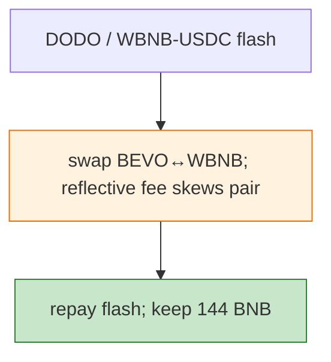

# BEVO Exploit — Reflective Token Fee Divergence Drain (DODO Flash)

> **Reproduction:** the PoC compiles & runs in an isolated Foundry project at
> [this project folder](.). Full verbose trace: [output.txt](output.txt).

---

## Key info

| | |
|---|---|
| **Loss** | 144 BNB (~$40K); tx `0xb97502d3…`; original attacker `0x68fa7746…`, frontrunner `0xd3455773…` |
| **Vulnerable contract** | BEVO (reflective ERC20) `0xc6Cb12df…`; BEVO/WBNB pair `0xA6eB184a…` |
| **Flash source** | DODO + WBNB/USDC pair `0xd99c7F6C…` |
| **Chain / block / date** | BSC / 25,230,702 / Jan 2023 |
| **Bug class** | Reflective-token fee accounting — BEVO's transfer fees leave the pair's reserves inconsistent; a DODO-funded swap harvests WBNB. |

---

## TL;DR

Flash-borrow WBNB (via DODO / WBNB-USDC pair), swap BEVO↔WBNB through the BEVO pair; BEVO's reflective
fees make the pair's reserves diverge from balances, so the round-trip nets WBNB. Repay the flash, keep
144 BNB.

---

## Root cause

A **reflective/fee-on-transfer token in a vanilla Pancake pair** whose fees mutate balances the pair
cannot reconcile — same class as FDP/TINU/Sheep.

---

## Diagrams



---

## Remediation

1. Fee-aware AMM pair; `k` on received amounts; wrap reflective tokens.

---

## How to reproduce

```bash
_shared/run_poc.sh 2023-01-BEVO_exp -vvvvv
```

- RPC: BSC archive (block 25,230,702). Result: `[PASS]` — WBNB harvested.

---

*Reference: BEVO reflective-token pair drain, BSC, Jan 2023 (144 BNB).*
