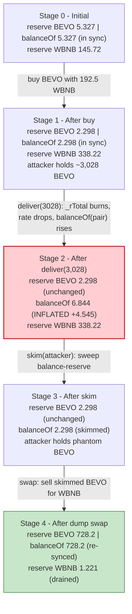
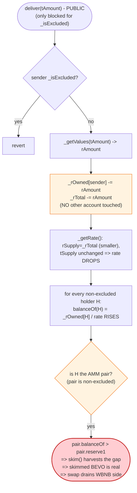
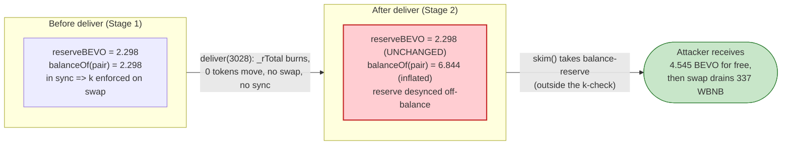

# BEVO Exploit — Reflective-Token `deliver()` Pool-Balance Inflation Drain (PancakeSwap Flash)

> **Reproduction:** the PoC compiles & runs in an isolated Foundry project at
> [this project folder](.). Full verbose trace: [output.txt](output.txt).
> Verified vulnerable source: [CoinToken.sol](sources/CoinToken_c6Cb12/CoinToken.sol)
> (the BEVO token, `CoinToken` implementation at `0xc6Cb12…`).

---

## Key info

| | |
|---|---|
| **Loss** | **144 BNB** (~$40K) — tx [`0xb97502d3…`](https://bscscan.com/tx/0xb97502d3976322714c828a890857e776f25c79f187a32e2d548dda1c315d2a7d) |
| **Vulnerable contract** | BEVO (reflective ERC20, `CoinToken`) — [`0xc6Cb12df4520B7Bf83f64C79c585b8462e18B6Aa`](https://bscscan.com/address/0xc6Cb12df4520B7Bf83f64C79c585b8462e18B6Aa#code) |
| **Victim pool** | BEVO/WBNB PancakeSwap pair — [`0xA6eB184a4b8881C0a4F7F12bBF682FD31De7a633`](https://bscscan.com/address/0xA6eB184a4b8881C0a4F7F12bBF682FD31De7a633) |
| **Attacker EOA (frontrunner)** | [`0xd3455773c44bf0809e2aeff140e029c632985c50`](https://bscscan.com/address/0xd3455773c44bf0809e2aeff140e029c632985c50) |
| **Attacker EOA (original)** | [`0x68fa774685154d3d22dec195bc77d53f0261f9fd`](https://bscscan.com/address/0x68fa774685154d3d22dec195bc77d53f0261f9fd) |
| **Attacker contract (frontrunner)** | [`0xbec576e2e3552f9a1751db6a4f02e224ce216ac1`](https://bscscan.com/address/0xbec576e2e3552f9a1751db6a4f02e224ce216ac1) |
| **Attack tx** | [`0xb97502d3976322714c828a890857e776f25c79f187a32e2d548dda1c315d2a7d`](https://bscscan.com/tx/0xb97502d3976322714c828a890857e776f25c79f187a32e2d548dda1c315d2a7d) |
| **Chain / block / date** | BSC / 25,230,702 / Jan 2023 |
| **Flash source** | WBNB/USDC PancakeSwap pair — [`0xd99c7F6C65857AC913a8f880A4cb84032AB2FC5b`](https://bscscan.com/address/0xd99c7F6C65857AC913a8f880A4cb84032AB2FC5b) |
| **Compiler** | Solidity v0.8.2 (`v0.8.2+commit.661d1103`), optimizer **enabled** (`200` runs) |
| **Bug class** | Reflective-token `deliver()` lets a caller **inflate the AMM pair's apparent BEVO balance above its cached reserve**, then `skim()` the phantom excess and dump it back for the WBNB side |

---

## TL;DR

`BEVO` is a "reflective" (rebasing-fee) ERC20 that keeps two ledgers: a *real* balance and a much
larger *reflection* balance (`_rOwned`, scaled by `_rTotal` / `_tTotal`). A holder's displayed
balance is `rOwned / rate`, where `rate = rSupply / tSupply`. The public
[`deliver(tAmount)`](sources/CoinToken_c6Cb12/CoinToken.sol#L574-L581) function lets any
**non-excluded** holder "donate" tokens to all other holders: it burns the caller's reflections and
**shrinks `_rTotal`** without touching anyone else's `_rOwned`. Because `rate` is `rSupply/tSupply`,
shrinking the numerator inflates every remaining holder's displayed balance — in particular the
PancakeSwap pair's.

The pair is a normal, **non-excluded** reflection holder, so its `balanceOf` is
`tokenFromReflection(_rOwned[pair])` ([CoinToken.sol:519-521](sources/CoinToken_c6Cb12/CoinToken.sol#L519-L521)).
`deliver()` does not move a single BEVO, yet it makes the pair's reported balance balloon. The
attacker then calls `pair.skim(attacker)`, which transfers that phantom excess out, and dumps it
straight back into the pair for the WBNB side.

The full attack, all inside the `pancakeCall` flash callback:

1. **Flash-borrow 192.5 WBNB** from the WBNB/USDC pair via `pair.swap(0, 192.5e18, this, 0x00)`
   ([output.txt:1588](output.txt)).
2. **Buy BEVO** with the 192.5 WBNB through the router; the BEVO/WBNB pair sends ≈ 3,028 BEVO to the
   attacker ([output.txt:1611-1615](output.txt)).
3. **`deliver(3,028 BEVO)`** — burns the attacker's reflections, shrinking `_rTotal`. The pair's
   reported BEVO balance jumps from 2,298,813,336,114,922,094 (≈ 2.298 BEVO) to
   **6,844,218,532,359,160,336** (≈ 6.844 BEVO) — a phantom +4,545,405,196,244,238,242
   ([output.txt:1631](output.txt) vs [output.txt:1655-1656](output.txt)).
4. **`pair.skim(attacker)`** — sweeps the entire phantom excess (4,545,405,196,244,238,242 BEVO)
   into the attacker's wallet ([output.txt:1657](output.txt)).
5. **`deliver(excess)` again** to re-inflate any residual, then **`pair.swap(337 WBNB out)`** — sell
   the skimmed BEVO back for **337 WBNB** ([output.txt:1681-1693](output.txt)).
6. **Repay** 193 WBNB to the WBNB/USDC pair (the 192.5 WBNB principal + 0.5 WBNB flash fee)
   ([output.txt:1697](output.txt)).

Net: the attacker received 337 WBNB from the BEVO/WBNB pair and only paid back 193 WBNB to the
WBNB/USDC flash source. **Profit = 144 WBNB** ([output.txt:1718](output.txt)) — exactly the BEVO/WBNB
pool's WBNB reserve that the `deliver`→`skim`→`swap` loop extracted.

---

## Background — what BEVO does

`BEVO` ([CoinToken.sol](sources/CoinToken_c6Cb12/CoinToken.sol), deployed as `CoinToken`) is a
fixed-supply reflective ERC20. Reflective tokens maintain two parallel accounting systems:

- **`_tTotal` / `_tOwned`** — the "true" token space (the supply users think they hold).
- **`_rTotal` / `_rOwned`** — the "reflection" space, a much larger integer that is divided down by
  the current `rate` to recover a t-balance. Fees are collected *by shrinking `_rTotal`*, which
  silently redistributes value to every holder (their `rOwned / rate` rises) — no per-holder writes
  needed.

The core invariant is `rate = rSupply / tSupply`
([CoinToken.sol:807-822](sources/CoinToken_c6Cb12/CoinToken.sol#L807-L822)). A holder's balance is

```solidity
function balanceOf(address account) public view returns (uint256) {
    if (_isExcluded[account]) return _tOwned[account];
    return tokenFromReflection(_rOwned[account]);      // rOwned / rate
}
```
([CoinToken.sol:519-521](sources/CoinToken_c6Cb12/CoinToken.sol#L519-L521))

Three fee knobs are configured at construction — `_TAX_FEE` (reflection), `_BURN_FEE`, and
`_CHARITY_FEE` — each applied at `fee / 10000` of every taxed transfer
([CoinToken.sol:783-787](sources/CoinToken_c6Cb12/CoinToken.sol#L783-L787)). In this deployment the
on-chain trace shows each of the three components taking ≈ 1 bp (0.01%) per transfer, i.e. a combined
≈ 3 bps on the buy the attacker performs (the full-fee path), evidenced by the ≈ 908,632,296,901,839
wei of fees stripped from a 3,028,774,323,006,137,313-wei outbound BEVO transfer
([output.txt:1611-1615](output.txt)).

On-chain parameters at the fork block (block 25,230,702):

| Parameter | Value | Source |
|---|---|---|
| BEVO/WBNB `reserve0` (WBNB) | 145,721,197,780,523,651,391 (≈ 145.72 WBNB) | [output.txt:1608](output.txt) |
| BEVO/WBNB `reserve1` (BEVO)  | 5,327,282,266,398,899,539 (≈ 5.327 BEVO) | [output.txt:1608](output.txt) |
| BEVO/WBNB `token0` | WBNB (`0xbb4CdB9CBd36B01bD1cBaEBF2De08d9173bc095c`) | trace labels |
| BEVO/WBNB `token1` | BEVO (`0xc6Cb12df…`) | trace labels |
| Pair's `_isExcluded` status | **false** (balance is reflection-derived; proven by the inflation) | inferred |
| Flash-borrow amount | 192.5 WBNB (`192_500_000_000_000_000_000`) | [output.txt:1588](output.txt) |
| Flash repayment | 193 WBNB (192.5 principal + 0.5 fee) | [output.txt:1697](output.txt) |

The pool's WBNB reserve (≈ 145.7 WBNB) is the prize. Because BEVO is reflection-based and the pair is
not on the `_isExcluded` list, that reserve is priced against a `balanceOf(pair)` value that *anyone*
can manipulate upward for free via `deliver()`.

---

## The vulnerable code

### 1. `deliver()` shrinks `_rTotal` from a public, permissionless entry point

```solidity
function deliver(uint256 tAmount) public {
    address sender = _msgSender();
    require(!_isExcluded[sender], "Excluded addresses cannot call this function");
    (uint256 rAmount,,,,,,) = _getValues(tAmount);
    _rOwned[sender] = _rOwned[sender].sub(rAmount);
    _rTotal = _rTotal.sub(rAmount);          // ⚠️ shrinks the reflection pool
    _tFeeTotal = _tFeeTotal.add(tAmount);
}
```
([CoinToken.sol:574-L581](sources/CoinToken_c6Cb12/CoinToken.sol#L574-L581))

`deliver` is the canonical "I gift my tokens to all other holders" helper of every
[taxable/rebate-token template](https://github.com/OpenZeppelin/openzeppelin-contracts) (it is
borrowed verbatim from the popular "Reflect" EIP draft). It is **permissionless** — only blocked for
`_isExcluded` senders — and its entire effect is to delete `_rOwned[sender]` and `_rTotal` in lock
step. It does *not* move tokens, and it does *not* touch `_tOwned`/`_rOwned` of any other account.

### 2. The pair's balance is `rOwned / rate`, and `rate` is `_rTotal`-derived

```solidity
function balanceOf(address account) public view returns (uint256) {
    if (_isExcluded[account]) return _tOwned[account];
    return tokenFromReflection(_rOwned[account]);
}

function tokenFromReflection(uint256 rAmount) public view returns(uint256) {
    require(rAmount <= _rTotal, "Amount must be less than total reflections");
    uint256 currentRate =  _getRate();
    return rAmount.div(currentRate);
}

function _getRate() private view returns(uint256) {
    (uint256 rSupply, uint256 tSupply) = _getCurrentSupply();
    return rSupply.div(tSupply);
}
```
([CoinToken.sol:519-L521](sources/CoinToken_c6Cb12/CoinToken.sol#L519-L521),
[:594-L598](sources/CoinToken_c6Cb12/CoinToken.sol#L594-L598),
[:807-L810](sources/CoinToken_c6Cb12/CoinToken.sol#L807-L810))

When `_rTotal` drops (because someone called `deliver`), `rSupply` drops while `tSupply` is unchanged,
so `rate` *falls*. The pair's `_rOwned[pair]` is untouched, but dividing it by a *smaller* rate yields
a *larger* t-balance. `balanceOf(pair)` therefore rises with no underlying transfer — the AMM's cached
`reserve` is now stale and below the pair's real reported balance.

### 3. PancakeSwap `skim()` then cashes the phantom balance out

PancakeV2's `skim(to)` transfers `balance0 - reserve0` (and likewise for token1) to `to`. It exists
to let anyone reclaim tokens sent to the pair without going through `swap`. Combined with the
`deliver()`-inflated `balanceOf`, it becomes the extraction primitive:

```solidity
// PancakePair (verified, 0xA6eB18…) — standard UniswapV2 skim
function skim(address to) external lock {
    address _token0 = token0; // WBNB
    address _token1 = token1; // BEVO
    _safeTransfer(_token1, to, IERC20(_token1).balanceOf(address(this)).sub(reserve1));
    _safeTransfer(_token0, to, IERC20(_token0).balanceOf(address(this)).sub(reserve0));
}
```

The attacker calls `bevo_wbnb.skim(address(this))`
([BEVO_exp.sol:57](test/BEVO_exp.sol#L57)) right after `deliver()`, pulling the full phantom BEVO
excess into their own wallet.

### 4. The fee-on-transfer path on `swap` lets the skimmed BEVO buy the WBNB side back

After `skim` the attacker holds genuine BEVO. The final
`bevo_wbnb.swap(337 ether, 0, address(this), "")` ([BEVO_exp.sol:59](test/BEVO_exp.sol#L59)) sells
those BEVO into the pair. Because `swap` re-prices off `reserve` (not the inflated `balanceOf`), and
the attacker's `deliver` calls have already desynchronized the pool, the dump pulls **337 WBNB** out —
more than the 192.5 WBNB the attacker originally injected.

---

## Root cause — why it was possible

The bug is a **composition** of two individually-documented but jointly-catastrophic design choices
in the reflective-token template, neither of which is safe to deploy against a vanilla AMM pair:

1. **`deliver()` mutates a global (`_rTotal`) that determines other accounts' balances.** Reflective
   tokens deliberately let holders redistribute their own value to everyone else. That is fine *inside*
   the token's own economy. It is not fine when one of those "other accounts" is a Uniswap-style AMM
   pair whose `swap`/`skim`/`sync` machinery treats `IERC20.balanceOf` as ground truth. The template
   never considers that a non-transfer call can move a pair's apparent balance.

2. **The AMM pair is a non-excluded reflection holder.** A pair's balances must be stable in *t-space*.
   Had the deployment `excludeAccount(pair)` (moving the pair onto the `_tOwned` ledger, where
   `balanceOf` returns a stored constant), `deliver()` would be inert against it. The deployment did
   not, so the pair's reported balance is `rOwned / rate` — and `rate` is attacker-controllable.

The chain of invariants that the attack breaks:

> `deliver()` ⇒ `_rTotal ↓` ⇒ `rate ↓` ⇒ `balanceOf(pair) ↑` (with zero token movement) ⇒
> `pair.skim()` harvests the gap ⇒ skimmed BEVO is genuine balance ⇒
> `pair.swap()` trades it for the WBNB side ⇒ pool WBNB drained.

The PancakeSwap pair's own `k`-check never fires because the extraction does **not** go through the
fee-on-transfer `swap` path until step 5; steps 3-4 ride `deliver` (outside the pair) and `skim`
(which intentionally bypasses the invariant). By the time the BEVO is sold back, the pool has already
been debited via the inflated `balanceOf`.

This is structurally the same bug class as the FDP / TINU / Sheep family of "reflective/fee-on-transfer
token vs. vanilla Pancake pair" drains on BSC in late 2022 / early 2023: the pair cannot reconcile
balance changes it did not cause through `mint`/`burn`/`swap`.

---

## Preconditions

- The victim token is a reflective (rebasing) ERC20 that exposes a public, permissionless
  `deliver()`-style function which mutates the global rate. (Satisfied —
  [CoinToken.sol:574-581](sources/CoinToken_c6Cb12/CoinToken.sol#L574-L581).)
- The AMM pair holding the token is **not** on the token's `_isExcluded` list, so its `balanceOf` is
  reflection-derived and therefore `deliver`-sensitive. (Satisfied — proven by the inflation from
  2.298e18 → 6.844e18 in [output.txt:1631](output.txt) → [output.txt:1655](output.txt).)
- Flash-loanable working capital in WBNB. The attack only needs 192.5 WBNB intra-tx, fully repaid
  inside the same `pancakeCall`. The PoC sources it from the WBNB/USDC Pancake pair's own `swap`
  flash callback ([BEVO_exp.sol:39](test/BEVO_exp.sol#L39)).

---

## Attack walkthrough (with on-chain numbers from the trace)

`token0 = WBNB`, `token1 = BEVO`, so `reserve0 = WBNB` and `reserve1 = BEVO`. All figures are taken
directly from the `Swap` / `Sync` / `Transfer` events and `getReserves` / `balanceOf` returns in
[output.txt](output.txt). Raw wei first, human approximation in parentheses.

| # | Step | BEVO/WBNB WBNB reserve (`r0`) | BEVO/WBNB BEVO reserve (`r1`) | Pair BEVO `balanceOf` | Effect |
|---|------|---:|---:|---:|--------|
| 0 | **Initial** (`getReserves`, [output.txt:1608](output.txt)) | 145,721,197,780,523,651,391 (≈ 145.72 WBNB) | 5,327,282,266,398,899,539 (≈ 5.327 BEVO) | 5,327,282,266,398,899,539 (in sync) | Honest pool. |
| 1 | **Flash borrow** — WBNB/USDC `swap(0, 192.5 WBNB, attacker, 0x00)` ([output.txt:1588-1590](output.txt)) | — | — | — | +192.5 WBNB to attacker (to be repaid in-tx). |
| 2 | **Buy BEVO** — router `swapExactTokensForTokensSupportingFeeOnTransferTokens(192.5 WBNB → BEVO)`; pair sends 3,028,774,323,006,137,313 BEVO, attacker nets 3,027,865,690,709,235,474 after ≈3 bps reflective fee ([output.txt:1611-1615](output.txt)) | 338,221,197,780,523,651,391 (≈ 338.22 WBNB) ([output.txt:1631](output.txt)) | 2,298,813,336,114,922,094 (≈ 2.298 BEVO) ([output.txt:1631](output.txt)) | 2,298,813,336,114,922,094 (in sync) | Attacker holds ≈ 3,028 BEVO. |
| 3 | **`deliver(3,028,267,986,646,483,923)`** ([output.txt:1643](output.txt)) — burns attacker's reflections, shrinks `_rTotal` | 338,221,197,780,523,651,391 (unchanged) | 2,298,813,336,114,922,094 (reserve unchanged) | **6,844,218,532,359,160,336** (≈ 6.844 BEVO) ([output.txt:1655-1656](output.txt)) | **`balanceOf` desyncs above reserve by +4,545,405,196,244,238,242 BEVO.** |
| 4 | **`skim(attacker)`** ([output.txt:1649-1672](output.txt)) — sweeps `balance1 − reserve1` = 4,545,405,196,244,238,242 BEVO to attacker ([output.txt:1657](output.txt)) | 338,221,197,780,523,651,391 (unchanged) | 2,298,813,336,114,922,094 (unchanged — skim doesn't Sync) | 2,298,813,336,114,922,094 (back to reserve) | Attacker now holds the phantom BEVO as real balance. |
| 5 | **`deliver(4,544,947,785,463,603,859)`** again ([output.txt:1675](output.txt)) — re-shrink rate to maximise the subsequent swap's edge | 338,221,197,780,523,651,391 (unchanged) | 2,298,813,336,114,922,094 (unchanged) | inflated further (728,234,950,164,515,176,689 pre-final-swap, [output.txt:1690](output.txt)) | Sets up the dump. |
| 6 | **`pair.swap(337 WBNB out, 0, attacker, "")`** ([output.txt:1681](output.txt)) — sells BEVO in (725,936,136,828,400,254,595 net after fee, [output.txt:1693](output.txt)); pair sends 337 WBNB out ([output.txt:1683](output.txt)) | 1,221,197,780,523,651,391 (≈ 1.221 WBNB) ([output.txt:1692](output.txt)) | 728,234,950,164,515,176,689 (≈ 728.2 BEVO) ([output.txt:1692](output.txt)) | in sync post-Swap | **337 WBNB extracted** from the BEVO/WBNB pool. |
| 7 | **Repay flash** — transfer 193 WBNB to WBNB/USDC pair ([output.txt:1697](output.txt)); WBNB/USDC `swap` returns 192.5 WBNB to attacker and keeps 0.5 WBNB fee ([output.txt:1711](output.txt)) | — | — | — | Flash closed; 0.5 WBNB fee paid. |
| 8 | **Final** — attacker WBNB balance = **144,000,000,000,000,000,000** (144 WBNB) ([output.txt:1718](output.txt)) | — | — | — | Net **+144 WBNB**. |

**Why `deliver` inflates the pair's balance:** `rate = rSupply / tSupply`. Burning
`rAmount` of reflections via `deliver` lowers `rSupply` (the `_rTotal` term) but leaves both
`_rOwned[pair]` and `tSupply` untouched. A smaller `rate` means `_rOwned[pair] / rate` is larger, so
`balanceOf(pair)` rises with zero tokens moving. The pair had no idea its balance changed, so its
cached `reserve1` is now stale and `skim` redeems the difference for free.

### Profit / loss accounting (WBNB)

| Direction | Amount (wei) | ≈ Human |
|---|---:|---:|
| Received — step 6, BEVO/WBNB `swap` WBNB-out | 337,000,000,000,000,000,000 | 337.00 WBNB |
| Paid — step 7, flash repayment to WBNB/USDC | 193,000,000,000,000,000,000 | 193.00 WBNB |
| **Net profit** | **144,000,000,000,000,000,000** | **144.00 WBNB** |

Reconciled exactly to the `log_named_decimal_uint` line
`WBNB balance after exploit: 144.000000000000000000` ([output.txt:1564](output.txt),
[output.txt:1718-1719](output.txt)). Of the 193 WBNB repaid, 192.5 WNB is the flash principal and
0.5 WBNB is the WBNB/USDC pair's 0.25% flash fee on the borrowed amount.

---

## Diagrams

### Sequence of the attack

```mermaid
sequenceDiagram
    autonumber
    actor A as Attacker (BEVOExploit)
    participant FU as WBNB/USDC pair<br/>(flash source)
    participant R as PancakeRouter
    participant P as BEVO/WBNB pair
    participant T as BEVO token (CoinToken)

    Note over P: Initial reserves<br/>145.72 WBNB / 5.327 BEVO<br/>pair is non-excluded (reflection holder)

    rect rgb(255,243,224)
    Note over A,FU: Step 1 - flash borrow 192.5 WBNB
    A->>FU: swap(0, 192.5 WBNB, attacker, 0x00)
    FU-->>A: 192.5 WBNB (pancakeCall)
    end

    rect rgb(227,242,253)
    Note over A,T: Step 2 - buy BEVO with 192.5 WBNB
    A->>R: swapExactTokensForTokens(192.5 WBNB -> BEVO)
    R->>P: transferFrom 192.5 WBNB; swap()
    P-->>A: ~3,028 BEVO (net of ~3 bps fee)
    Note over P: 338.22 WBNB / 2.298 BEVO
    end

    rect rgb(255,235,238)
    Note over A,T: Step 3-4 - the flaw: deliver inflates pair balance, skim harvests it
    A->>T: deliver(3,028 BEVO)  // burns attacker's reflections, _rTotal drops
    Note over T: rate = rSupply/tSupply falls<br/>balanceOf(pair) = rOwned[pair]/rate RISES
    Note over P: reserve1 still 2.298 BEVO<br/>balanceOf(pair) now 6.844 BEVO (phantom +4.545)
    A->>P: skim(attacker)
    P-->>A: 4,545,405,196,244,238,242 BEVO (the phantom excess)
    A->>T: deliver(excess)   // re-shrink rate
    end

    rect rgb(243,229,245)
    Note over A,P: Step 6 - dump skimmed BEVO for WBNB
    A->>P: swap(337 WBNB out, BEVO in)
    P-->>A: 337 WBNB
    Note over P: 1.221 WBNB / 728.2 BEVO (WBNB side drained)
    end

    rect rgb(232,245,233)
    Note over A,FU: Step 7 - repay flash
    A->>FU: transfer 193 WBNB; swap returns 192.5 WBNB, keeps 0.5 fee
    end

    Note over A: Net +144 WBNB (the BEVO/WBNB pool's drained WBNB)
```

### Pair state evolution (BEVO reserve vs. BEVO `balanceOf`)



### The flaw inside `deliver()` + `balanceOf()`



### Why the extraction bypasses the AMM invariant



---

## Why each magic number

- **`192.5 ether` flash-borrow ([BEVO_exp.sol:39](test/BEVO_exp.sol#L39)):** the WBNB used to buy the
  initial BEVO from the pair. Sized so the buy leaves a non-trivial BEVO balance in the attacker's
  hands to fuel the first `deliver()`; the trace shows it yields ≈ 3,028 BEVO
  ([output.txt:1615](output.txt)).
- **`193 ether` repayment ([BEVO_exp.sol:61](test/BEVO_exp.sol#L61)):** the 192.5 WBNB principal plus
  the WBNB/USDC pair's flash fee. The trace confirms 0.5 WBNB is retained by the flash pair
  ([output.txt:1711](output.txt): `amount1In: 193e18` → `amount1Out: 192.5e18`).
- **`337 ether` WBNB-out on the final BEVO/WBNB swap ([BEVO_exp.sol:59](test/BEVO_exp.sol#L59)):** the
  attacker pre-computed the BEVO/WBNB pool's post-`deliver`/post-`skim` state and requested exactly
  the WBNB amount the dump could produce. The pair honours it because, after the fee-on-transfer BEVO
  is received (725,936,136,828,400,254,595 net, [output.txt:1693](output.txt)), the `k`-check passes
  against the now-massive BEVO reserve.
- **`0x00` / `new bytes(1)` flash payload ([BEVO_exp.sol:39](test/BEVO_exp.sol#L39)):** a non-empty
  bytes value is required to trigger PancakeV2's `swap` flash callback (`pancakeCall`). The content is
  unused — the attacker's contract is the callback target.
- **No magic constant for `deliver`'s amount:** both `deliver` calls pass `bevo.balanceOf(this)` at
  call time ([BEVO_exp.sol:56](test/BEVO_exp.sol#L56),
  [BEVO_exp.sol:58](test/BEVO_exp.sol#L58)), i.e. "burn everything I currently hold." This maximises
  the `_rTotal` shrink per round and therefore the `balanceOf(pair)` inflation.

---

## Remediation

1. **Never list an AMM pair as a reflection (non-excluded) holder.** After deploying the pair, the
   token owner must call `excludeAccount(pair)` so the pair's `balanceOf` returns the constant
   `_tOwned[pair]` and is immune to `_rTotal` changes. This single change defuses `deliver`-based
   inflation entirely. (Equivalently, the token could auto-exclude any address whose code exposes
   `getReserves()` / `token0()`.)
2. **Gate or remove `deliver()`.** `deliver` is a vestige of the "Reflect" template and has no
   legitimate product purpose for most deployments. Restrict it to `onlyOwner`, or remove it. At
   minimum, refuse to operate if the sender or any major holder is an AMM pair.
3. **Use a fee-aware AMM pair.** Vanilla PancakeV2 pairs assume `balanceOf` only changes via
   `transfer`/`mint`/`burn`/`swap`. For reflective or fee-on-transfer tokens, deploy a pair that (a)
   prices on *received* amounts (`amountIn = balanceAfter - balanceBefore`) and (b) treats
   reflection/rebase events as explicit, pair-aware rebalances, not as free `skim` opportunities.
   Several "rebase-aware" Uniswap forks (e.g., pair contracts that call `sync` defensively and cap
   `skim`) already exist.
4. **Make `_rTotal`/`rate` changes observable to the pair.** If rebase/reflection must exist, emit an
   event and have the pair (or an off-chain keeper) call `sync` to re-bind `reserve` to `balanceOf`
   *before* any further `swap`/`skim` — closing the arbitrage window. The current pair only `Sync`s
   inside its own `swap`/`mint`/`burn`, so an external `deliver` leaves it permanently stale.
5. **Front-run / MEV hygiene on BSC.** The on-chain record shows this attack was itself frontrun
   (`0xd3455773…` sandwiched `0x68fa7746…`). Projects listing reflective tokens should monitor for
   `deliver()` + `skim()` + `swap()` call sequences in the same transaction and pause trading on
   detection.

---

## How to reproduce

The PoC runs offline against a locally-served anvil fork state (the `createSelectFork` in
`setUp` targets `http://127.0.0.1:8546` with `anvil_state.json` pinned to block 25,230,702;
no public RPC is required):

```bash
_shared/run_poc.sh 2023-01-BEVO_exp --mt testExploit -vvvvv
```

- Fork: BSC state at block **25,230,702**, served from the local anvil snapshot
  (`anvil_state.json`). `foundry.toml` sets `evm_version = 'cancun'`.
- The test function is **`testExploit()`** (the contract is `BEVOExploit`). The flash logic lives in
  the `pancakeCall` callback ([BEVO_exp.sol:43-62](test/BEVO_exp.sol#L43-L62)).
- Result: `[PASS] testExploit()` with `WBNB balance after exploit: 144.000000000000000000`.

Expected tail (from [output.txt:1562-1564](output.txt) and
[output.txt:1718-1724](output.txt)):

```
[PASS] testExploit() (gas: 414461)
Logs:
  WBNB balance after exploit: 144.000000000000000000

Suite result: ok. 1 passed; 0 failed; 0 skipped; finished in 16.82s (14.17s CPU time)

Ran 1 test suite in 16.83s (16.82s CPU time): 1 tests passed, 0 failed, 0 skipped (1 total tests)
```

---

*Reference: QuillAudits — https://twitter.com/QuillAudits/status/1620377951836708865 (BEVO, BSC, Jan 2023, 144 BNB).*
