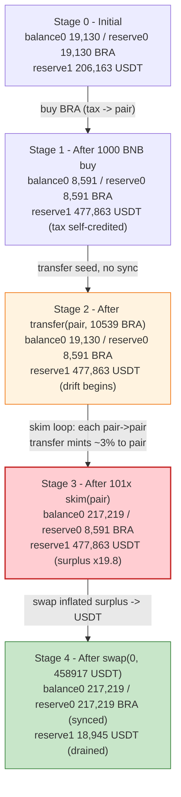
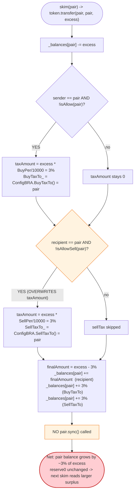
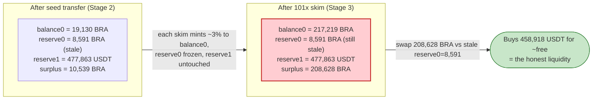

# BRA Token Exploit — `_transfer` Buy/Sell Tax Credited to the Pair Itself, Drained via `skim()`

> **Vulnerability classes:** vuln/logic/state-update · vuln/defi/slippage

> **Reproduction:** the PoC compiles & runs in an isolated Foundry project at
> [this project folder](.) (fork served offline from a local `anvil_state.json` on
> `127.0.0.1:8546`). Full verbose trace: [output.txt](output.txt).
> Verified vulnerable sources: [BRAToken](sources/BRAToken_449FEA/BRAToken.sol),
> [PancakePair](sources/PancakePair_8F4BA1/PancakePair.sol),
> [DPPAdvanced](sources/DPPAdvanced_0fe261/DPPAdvanced.sol).

---

## Key info

| | |
|---|---|
| **Loss** | **~819 BNB (~$224K)** across two txs — `0x6759db55…` (**675 WBNB**, reproduced here) + `0x4e5b2efa…` (**144 WBNB**) |
| **Vulnerable contract** | `BRAToken` — [`0x449FEA37d339a11EfE1B181e5D5462464bBa3752`](https://bscscan.com/address/0x449FEA37d339a11EfE1B181e5D5462464bBa3752#code) (`_transfer`, [BRAToken.sol:428-476](sources/BRAToken_449FEA/BRAToken.sol#L428-L476)) |
| **Victim pool** | BRA/USDT PancakeSwap pair — [`0x8F4BA1832611f0c364dE7114bbff92ba676AdF0E`](https://bscscan.com/address/0x8F4BA1832611f0c364dE7114bbff92ba676AdF0E) |
| **Flash-loan source** | DODO `DPPAdvanced` pool — [`0x0fe261aeE0d1C4DFdDee4102E82Dd425999065F4`](https://bscscan.com/address/0x0fe261aeE0d1C4DFdDee4102E82Dd425999065F4) (1,400 WBNB) |
| **Attacker EOA** | [`0x67a909f2953fb1138bea4b60894b51291d2d0795`](https://bscscan.com/address/0x67a909f2953fb1138bea4b60894b51291d2d0795) |
| **Attacker contracts** | [`0x1fae46b350c4a5f5c397dbf25ad042d3b9a5cb07`](https://bscscan.com/address/0x1fae46b350c4a5f5c397dbf25ad042d3b9a5cb07), [`0x6066435edce9c2772f3f1184b33fc5f7826d03e7`](https://bscscan.com/address/0x6066435edce9c2772f3f1184b33fc5f7826d03e7) |
| **Attack tx (reproduced)** | [`0x6759db55a4edec4f6bedb5691fc42cf024be3a1a534ddcc7edd471ef205d4047`](https://bscscan.com/tx/0x6759db55a4edec4f6bedb5691fc42cf024be3a1a534ddcc7edd471ef205d4047) |
| **Chain / block / date** | BSC (chainId 56) / 24,655,771 / Jan 10, 2023 |
| **Compiler** | `BRAToken`: Solidity **v0.8.17**, optimizer **disabled**, 200 runs (no proxy). `PancakePair`: v0.5.16, optimizer off. `DPPAdvanced`: v0.6.9, optimizer on, 200 runs. |
| **Bug class** | Token-fee accounting flaw — `_transfer` credits BOTH the buy tax AND the sell tax to the LP pair's own balance on a pair→pair transfer, without `sync()`, so each `skim()` mints ~3% extra BRA into the pair and the inflated surplus is repeatedly re-skimmed. |

---

## TL;DR

1. `BRAToken._transfer` ([BRAToken.sol:428-476](sources/BRAToken_449FEA/BRAToken.sol#L428-L476)) applies a buy tax when `sender == uniswapV2Pair` and a sell tax when `recipient == uniswapV2Pair`. The two checks are **two independent `if`s, not `if/else`**, so a pair→pair transfer fires **both**.

2. The on-chain `ConfigBRA` contract configures `BuyTaxTo == SellTaxTo == the BRA/USDT pair itself` (`0x8F4BA1…`, returned by both `BuyTaxTo()` and `SellTaxTo()` at [output.txt:1652-1653](output.txt) and [output.txt:1689-1690](output.txt)), and `BuyPer == SellPer == 300` (3% — [output.txt:1648-1651](output.txt)). So every tax "payment" is a self-credit to the pair's token balance.

3. Because the tax destination is the pair and the recipient is also the pair, a single `skim()` (which calls `token.transfer(pair, pair, excess)`) leaves the pair holding `excess + buyTax + sellTax` instead of just `excess` — i.e. **the pair's BRA balance grows by ~3% on every skim**, even though the attacker moved nothing.

4. `BRAToken._transfer` **never calls `pair.sync()`**. The pair's cached `reserve0` therefore stays frozen at 8,591 BRA while the live `balance0` balloons. Each subsequent `skim()` re-reads the (now larger) `balanceOf(pair)` and re-skims the surplus — a self-feeding loop.

5. The attacker flash-borrows **1,400 WBNB** from DODO `DPPAdvanced`, routes 1,000 WBNB through `WBNB→USDT→BRA` to obtain **10,539.35 BRA**, transfers it to the pair (priming the surplus), then calls **`pair.skim(pair)` 101 times** ([BRA_exp.sol:90-92](test/BRA_exp.sol#L90-L92)). The pair's BRA balance inflates from **8,591 → 217,219 BRA** ([output.txt:1670](output.txt), [output.txt:4529](output.txt)).

6. The attacker then sells the **208,628 BRA "profit"** (`balance − original reserve`) directly via `pair.swap(0, usdtOut, …)` for **458,917.996 USDT** ([output.txt:4536](output.txt), [output.txt:4548](output.txt)), routes that through `USDT→WBNB` for **1,675.72 WBNB** ([output.txt:4570](output.txt), [output.txt:4582](output.txt)), wraps the residual BNB, repays the 1,400 WBNB flash loan, and keeps **675.724517850647356854 WBNB** ([output.txt:4635](output.txt)).

---

## Background — what BRA does

`BRAToken` ([source](sources/BRAToken_449FEA/BRAToken.sol)) is a generic BEP-20 with a configurable buy/sell tax whose parameters live in a separate `ConfigBRA` contract (on-chain at `0x0ed9cf2aF45916acefCd0390D32fEb5e88E74Ef6`, the `BRA` storage slot the token reads). At construction ([BRAToken.sol:556-557](sources/BRAToken_449FEA/BRAToken.sol#L556-L557)) it creates its only liquidity pair against `busd`, which is hard-coded to BSC USDT (`0x55d398326f99059fF775485246999027B3197955`, [BRAToken.sol:370](sources/BRAToken_449FEA/BRAToken.sol#L370)); that pair is `uniswapV2Pair = 0x8F4BA1…`.

| Parameter (read from `ConfigBRA` in the trace) | Value | Source |
|---|---|---|
| `BuyPer` | **300 bps = 3%** | [output.txt:1648-1649](output.txt) (`0x12c`) |
| `SellPer` | **300 bps = 3%** | [output.txt:1650-1651](output.txt) (`0x12c`) |
| `BuyTaxTo` | `0x8F4BA1…` (**the pair itself**) | [output.txt:1652-1653](output.txt) |
| `SellTaxTo` | `0x8F4BA1…` (**the pair itself**) | [output.txt:1689-1690](output.txt) |
| `isAllow(pair)` | false | [output.txt:1644-1645](output.txt) |
| `isAllowSell(attacker)` | false | [output.txt:1646-1647](output.txt) |
| BRA total supply | 21,000,000 BRA | [BRAToken.sol:544](sources/BRAToken_449FEA/BRAToken.sol#L544) |
| Pair `token0` / `token1` | BRA / USDT (so `reserve0 = BRA`, `reserve1 = USDT`) | — |
| Pair BRA reserve (initial, fork block) | 19,130,492,548,708,862,134,718 wei (~19,130.49 BRA) | [output.txt:1614](output.txt) |
| Pair USDT reserve (initial) | 206,163,668,857,403,479,126,341 wei (~206,163.67 USDT) | [output.txt:1614](output.txt) |
| WBNB/USDT pair `0x16b9a82…` reserves (initial) | 63,335,052,447,522,389,340,746,441 USDT / 231,526,686,200,174,894,330,517 WBNB | [output.txt:1612](output.txt) |

The combination `BuyTaxTo == SellTaxTo == pair` is the whole game: the "tax" is not extracted to a treasury, it is **added to the AMM's own token balance**, and `_transfer` never tells the pair about it via `sync()`.

---

## The vulnerable code

### 1. `_transfer` — two independent tax `if`s, no `sync()`

```solidity
function _transfer(address sender, address recipient, uint amount) internal {
    require(sender != address(0), "BEP20: transfer from the zero address");

    bool recipientAllow = ConfigBRA(BRA).isAllow(recipient);
    bool senderAllowSell = ConfigBRA(BRA).isAllowSell(sender);

    uint BuyPer = ConfigBRA(BRA).BuyPer();
    uint SellPer = ConfigBRA(BRA).SellPer();

    address BuyTaxTo_ = address(0);
    address SellTaxTo_ = address(0);

    _balances[sender] = _balances[sender].sub(amount, "BEP20: transfer amount exceeds balance");

    uint256 finalAmount = amount;
    uint256 taxAmount = 0;

    if (sender == uniswapV2Pair && !recipientAllow) {            // BUY tax
        taxAmount = amount.div(10000).mul(BuyPer);
        BuyTaxTo_ = ConfigBRA(BRA).BuyTaxTo();
    }

    if (recipient == uniswapV2Pair && !senderAllowSell) {        // SELL tax — independent if, NOT else
        taxAmount = amount.div(10000).mul(SellPer);
        SellTaxTo_ = ConfigBRA(BRA).SellTaxTo();
    }

    finalAmount = finalAmount - taxAmount;                        // only the SELL tax is subtracted

    if (BuyTaxTo_ != address(0)) {
        _balances[BuyTaxTo_] = _balances[BuyTaxTo_].add(taxAmount);
        emit Transfer(sender, BuyTaxTo_, taxAmount);
    }

    if (SellTaxTo_ != address(0)) {
        _balances[SellTaxTo_] = _balances[SellTaxTo_].add(taxAmount);
        emit Transfer(sender, SellTaxTo_, taxAmount);
    }

    _balances[recipient] = _balances[recipient].add(finalAmount);
    ...
    emit Transfer(sender, recipient, finalAmount);
}
```
([BRAToken.sol:428-476](sources/BRAToken_449FEA/BRAToken.sol#L428-L476))

### 2. The pair's `skim()` (the trigger) — standard Uniswap-V2

```solidity
// force balances to match reserves
function skim(address to) external lock {
    address _token0 = token0;
    address _token1 = token1;
    _safeTransfer(_token0, to, IERC20(_token0).balanceOf(address(this)).sub(reserve0));
    _safeTransfer(_token1, to, IERC20(_token1).balanceOf(address(this)).sub(reserve1));
}
```
(standard PancakePair `skim`; the PoC calls `skim(pair)` so `to == pair`, making the skim a pair→pair transfer that re-enters `_transfer` with `sender == recipient == uniswapV2Pair` — [BRA_exp.sol:90-92](test/BRA_exp.sol#L90-L92))

When `sender == recipient == pair`, **both** `if`s in `_transfer` fire: the buy tax and the sell tax are each credited to `BuyTaxTo_ == SellTaxTo_ == pair`, and the `finalAmount = amount − sellTax` is also credited to the pair. Net balance change of the pair:

```
+finalAmount + buyTax + sellTax − amount
= (amount − 0.03·amount) + 0.03·amount + 0.03·amount − amount
= +0.03·amount
```

i.e. each pair→pair transfer mints ~3% extra BRA into the pair's balance — and because the skim target is the pair itself, the "transfer" is a no-op move that nonetheless **inflates the pair's balance by ~3% of the moved amount**. Reserves are never re-synced (no `sync()` anywhere in `_transfer`), so `balanceOf(pair)` drifts further above `reserve0` after every call — which is exactly the surplus the *next* `skim()` will re-extract and re-inflate.

---

## Root cause — why it was possible

Three independent design errors compose into the drain:

1. **`BuyTaxTo` and `SellTaxTo` are configured to the LP pair address itself.** A tax whose destination is the AMM pool it is priced against is, by construction, a unilateral donation to one side of the pool — it raises the pair's token balance without any counter-value, desynchronizing `balanceOf(pair)` from `reserve0`. The intended design was clearly for taxes to flow to a treasury/marketing wallet; mis-configuring them to the pair turns every taxable transfer into reserve inflation.

2. **The buy- and sell-tax branches are two separate `if`s, not `if/else`.** When `sender == recipient == pair` (the exact state `skim(pair)` produces), both branches execute. The contract debits `amount` from the sender (the pair), then credits `finalAmount` (= `amount − sellTax`) **plus** `buyTax` **plus** `sellTax` to the recipient (also the pair). The pair ends up with strictly more BRA than it started — a free mint of ~3% of the moved amount, repeatable at will.

3. **`_transfer` never calls `pair.sync()`.** The PancakePair only refreshes `reserve0/reserve1` on `mint`/`burn`/`swap`/`sync`. Because BRA's tax credits mutate `balanceOf(pair)` outside those entry points, the cached `reserve0` stays frozen. Each `skim()` reads the ever-growing `balanceOf(pair)` and sends the surplus (which `_transfer` then re-inflates) back to the pair — a positive-feedback loop that grows the surplus geometrically (~3% per iteration). The PoC runs 101 iterations; the live attack's loop count was sized to the available block gas.

The flash loan is purely working capital to obtain the seed BRA that primes the surplus; it is repaid in full, so the attack requires **zero upfront capital**.

---

## Preconditions

- `BuyTaxTo == SellTaxTo == uniswapV2Pair` (true on-chain; verified at [output.txt:1652-1653](output.txt) and [output.txt:1689-1690](output.txt)).
- `BuyPer > 0` and `SellPer > 0` (both 300 = 3%; verified at [output.txt:1648-1651](output.txt)).
- `isAllow(pair) == false` and `isAllowSell(pair) == false` so neither tax branch is skipped (verified at [output.txt:1703-1706](output.txt)).
- Anyone can call `pair.skim()` — it is a permissionless Uniswap-V2 function with no access control. No privileged role, no setup beyond owning some BRA to seed the surplus.
- Flash-loanable working capital (1,400 WBNB here; DODO's `DPPAdvanced.flashLoan` is fee-free for the base token, so the only cost is gas).

---

## Attack walkthrough (with on-chain numbers from the trace)

The pair's `token0 = BRA`, `token1 = USDT`, so `reserve0 = BRA`, `reserve1 = USDT`. All figures are from `Sync`/`Swap`/`Transfer` events and `getReserves`/`balanceOf` returns in [output.txt](output.txt). Raw wei first, human approx in parentheses.

| # | Step | Pair BRA (balance / reserve0) | Pair USDT (reserve1) | Effect |
|---|------|------------------------------:|---------------------:|--------|
| 0 | **Initial** pair state | 19,130,492,548,708,862,134,718 (~19,130.49 BRA) / same | 206,163,668,857,403,479,126,341 (~206,163.67 USDT) | Honest pool ([output.txt:1614](output.txt)). |
| 1 | **Flash-loan 1,400 WBNB** from `DPPAdvanced` | unchanged | unchanged | Exploit receives 1,400 WBNB ([output.txt:1589-1591](output.txt)). |
| 2 | **`swapExactETHForTokens` 1,000 BNB → USDT → BRA**: 1,000 WBNB into WBNB/USDT pair yields 271,699.54 USDT ([output.txt:1626-1638](output.txt)); that USDT buys **10,865.31 BRA** gross from the BRA/USDT pair, of which **325.96 BRA (3% buy tax)** is credited to the pair and **10,539.35 BRA** lands at the attacker ([output.txt:1642-1665](output.txt)) | balance **8,591,141,804,789,920,218,041** (~8,590.79 BRA) / reserve0 8,591,141,804,789,920,218,041 ([output.txt:1660-1664](output.txt)) | **477,863,210,521,495,817,138,589** (~477,863.21 USDT) ([output.txt:1662-1664](output.txt)) | Tax already self-credited to the pair; reserves synced to the post-swap balances. |
| 3 | **`bra.transfer(pair, 10,539.35)`** — attacker seeds the surplus | balance **19,130,492,548,708,862,134,718** (~19,130.49 BRA = exactly +10,539.35) / reserve0 **still 8,591,141,804,789,920,218,041** | unchanged | Sell tax (316.18 BRA) AND the net 10,223.17 BRA both credited to the pair; reserves NOT synced, so `balance − reserve0 = 10,539.35 BRA` is now skimmable ([output.txt:1680-1696](output.txt)). |
| 4 | **`pair.skim(pair)` × 101** — each skim does a pair→pair transfer of the current `balance − reserve0` surplus; `_transfer` fires BOTH taxes (each ~3% of the moved amount, credited back to the pair) and credits the sell-tax-reduced finalAmount to the pair. Net: the *surplus* (`balance − reserve0`) grows by exactly 3% per skim; reserves never move. | balance **217,219,602,167,267,832,539,918** (~217,219.60 BRA) / reserve0 **still 8,591,141,804,789,920,218,041** ([output.txt:4527-4529](output.txt)) | unchanged | Surplus compounded (1.03)^101 ≈ **19.8×**: from 10,539.35 → 208,628.46 BRA. Each skim emits two pair→pair tax `Transfer`s plus the finalAmount `Transfer` (e.g. first skim: 316.18 + 316.18 + 10,223.17 BRA, [output.txt:1715-1717](output.txt)). |
| 5 | **`getAmountsOut(208,628.46 BRA)`** → **458,917.996 USDT** out ([output.txt:4532-4535](output.txt)) using the stale reserve0 = 8,591 BRA | — | — | The 208,628.46 BRA "profit" = `balance(217,219.60) − reserve0(8,590.79)` is the inflated surplus priced against the *stale, tiny* reserve0 — so it buys an enormous amount of USDT. |
| 6 | **`pair.swap(0, 458,917.996 USDT, attacker, "")`** — direct low-level swap ([output.txt:4536-4551](output.txt)) | balance 217,219.60 BRA / reserve0 now **217,219,602,167,267,832,539,918** (synced) | reserve1 now **18,945,214,156,433,080,074,378** (~18,945.21 USDT) ([output.txt:4543-4547](output.txt)) | Attacker receives **458,917,996,365,062,737,064,211 wei (458,917.996 USDT)** ([output.txt:4537-4538](output.txt)). |
| 7 | **`swapExactTokensForETH` 458,917.996 USDT → WBNB** via WBNB/USDT pair | — | — | Yields **1,675,724,517,850,647,356,854 wei (1,675.7245 WBNB)** ([output.txt:4570-4582](output.txt)). |
| 8 | **Wrap residual BNB** → 2,075.7245 WBNB; **repay 1,400 WBNB** to DPP ([output.txt:4598-4610](output.txt)) | — | — | DPP balance restored to 1,480.58 WBNB (its fee accrual, untouched — [output.txt:4613](output.txt)). |
| 9 | **Forward profit to EOA** | — | — | Attacker EOA ends with **675,724,517,850,647,356,854 wei (675.7245 WBNB)** ([output.txt:4633-4635](output.txt)). |

### Profit / loss accounting (WBNB, this tx)

| Direction | Amount (wei) | ~Human |
|---|---:|---:|
| Flash-borrowed from DPP (repaid) | 1,400,000,000,000,000,000,000 | 1,400.00 |
| Sold 1,000 BNB (seed) | 1,000,000,000,000,000,000,000 | 1,000.00 |
| Received from BRA→USDT→WBNB dump | 1,675,724,517,850,647,356,854 | 1,675.7245 |
| **Net profit (this tx, asserted by PoC)** | **675,724,517,850,647,356,854** | **+675.7245** |

The 1,400 WBNB flash loan is repaid in full inside the same transaction; the 675.72 WBNB profit is extracted purely from the BRA/USDT pair's USDT reserve, which drops from 477,863.21 USDT (post-seed) to 18,945.21 USDT ([output.txt:4546-4547](output.txt)) — i.e. **~458,918 USDT of honest liquidity** was converted to WBNB and walked off. The second live tx (`0x4e5b2efa…`, +144 WBNB) repeated the same pattern against the re-seeded pool, bringing the public total to ~819 BNB.

---

## Diagrams

### Sequence of the attack

```mermaid
sequenceDiagram
    autonumber
    actor A as Attacker EOA
    participant E as Exploit contract
    participant DPP as DPPAdvanced (DODO)
    participant W as WBNB/USDT pair (0x16b9a82)
    participant P as BRA/USDT pair (0x8F4BA1) [uniswapV2Pair]
    participant T as BRAToken

    Note over P: reserve0 = 19,130 BRA / reserve1 = 206,163 USDT

    rect rgb(255,243,224)
    Note over A,DPP: Step 1 — flash capital
    A->>E: go()
    E->>DPP: flashLoan(1400 WBNB)
    DPP-->>E: 1400 WBNB
    end

    rect rgb(227,242,253)
    Note over E,T: Step 2 — buy seed BRA
    E->>W: swap 1000 WBNB -> 271,699 USDT
    E->>P: swap 271,699 USDT -> 10,865 BRA gross
    T->>T: _transfer: 3% buyTax credited to pair
    P-->>E: 10,539.35 BRA (net)
    Note over P: balance0 8,591 BRA / reserve0 8,591 BRA
    end

    rect rgb(232,245,233)
    Note over E,T: Step 3 — seed the surplus
    E->>T: transfer(pair, 10,539.35 BRA)
    T->>T: _transfer: 3% sellTax + net both credited to pair, NO sync()
    Note over P: balance0 19,130 BRA / reserve0 8,591 BRA (drift!)
    end

    rect rgb(255,235,238)
    Note over E,T: Step 4 — the exploit: skim loop
    loop 101 times
        E->>P: skim(pair)
        P->>T: transfer(pair, pair, balance0 - reserve0)
        T->>T: both buy+sell tax fire; ~3% minted to pair; no sync()
        Note over P: balance0 grows ~3% each iter, reserve0 frozen
    end
    Note over P: balance0 217,219 BRA / reserve0 still 8,591 BRA
    end

    rect rgb(243,229,245)
    Note over E,T: Steps 5-7 — extract
    E->>P: swap(0, 458,917 USDT, attacker) using 208,628 BRA surplus
    P-->>E: 458,917.996 USDT
    E->>W: swap USDT -> 1,675.72 WBNB
    E->>DPP: repay 1400 WBNB
    E->>A: forward 675.7245 WBNB profit
    end
```

### Pool state evolution (BRA/USDT pair)



### The flaw inside `_transfer` on a pair→pair transfer



### Why the drain is theft: constant-product before vs. after the skim loop



---

## Why each magic number

- **`baseAmount = 1400 * 1e18` (1,400 WBNB flash loan, [BRA_exp.sol:57](test/BRA_exp.sol#L57)):** sized to (a) leave 400 WBNB of headroom beyond the 1,000 WBNB actually sold for BRA (the residual 400 WBNB is unused but harmless — DODO flash loans are free for the base token), and (b) be repaid in full inside the callback. The DPP `DPPAdvanced` pool had ample WBNB depth; 1,400 WBNB is well under its reserve.
- **1,000 BNB sold for BRA ([BRA_exp.sol:79](test/BRA_exp.sol#L79)):** the seed amount. It only needs to be large enough that the resulting ~10,539 BRA, when run through the ~3%-per-iteration skim loop 101 times, compounds into a surplus (208,628 BRA) big enough to drain the pair's USDT side. The loop's geometric growth (~1.03^101 ≈ 20×) does the heavy lifting, so the seed size is not critical.
- **`for (i; i < 101; ++i) skim(pair)` ([BRA_exp.sol:90-92](test/BRA_exp.sol#L90-L92)):** 101 iterations compound the seed surplus by exactly (1.03)^101 ≈ **19.8×** (10,539.35 → 208,628.46 BRA), taking the pair's BRA balance from 19,130 → 217,219 while `reserve0` stays frozen at 8,591. More iterations would inflate further but cost gas; 101 was chosen to land the final surplus well above what is needed to drain the USDT reserve in one `swap`.
- **`swap(0, usdtAmount, …)` with `usdtAmount = getAmountsOut(balance − reserve0)` ([BRA_exp.sol:102-104](test/BRA_exp.sol#L102-L104)):** the attacker sells exactly the *inflated surplus* (`balanceOf(pair) − reserve0`), because that is the amount the pair's stale `k` check will accept as a valid swap input (the pair sees `amount0In = surplus` against `reserve0 = 8,591` and computes the USDT out from the constant-product formula).
- **`assert(address(this).balance >= baseAmount)` ([BRA_exp.sol:113](test/BRA_exp.sol#L113)):** the attack is atomic and flash-loan gated — if the round-trip ever yields less than 1,400 BNB, the whole tx reverts and no loss occurs.

---

## Remediation

1. **Do not configure `BuyTaxTo` / `SellTaxTo` to the AMM pair address.** Taxes must flow to a protocol-owned wallet (treasury, marketing, buy-back-and-burn wallet), never to the pool the token is priced against. This alone eliminates the reserve-inflation primitive.
2. **Make the buy- and sell-tax branches mutually exclusive (`else if`).** A transfer cannot simultaneously be a buy and a sell; the dual-credit on a pair→pair transfer is a logic bug regardless of where the tax is sent. At minimum, skip taxation entirely when `sender == recipient == pair` (a `skim`/`sync` self-transfer), or when both `sender` and `recipient` are the pair.
3. **Call `pair.sync()` (or refuse to mutate the pair's balance) inside `_transfer` whenever a tax is redirected to the pair.** If the token contract is going to change `balanceOf(pair)` outside the pair's own entry points, the pair's cached reserves must be reconciled — otherwise `balanceOf` and `reserve` permanently diverge and `skim()` becomes weaponizable.
4. **Cap or rate-limit `skim`-style surplus extraction.** More fundamentally, do not allow a third-party token's transfer logic to silently inflate an AMM pair's balance; if your token hooks transfers to/from the pair, route the tax through the pair's own `swap` so both reserves move together and `k` is preserved.
5. **Re-examine the `ConfigBRA` setter.** Whoever can set `BuyTaxTo`/`SellTaxTo` can brick or drain the pool. Gate it behind a timelocked multisig and add a `require(taxTo != uniswapV2Pair)` invariant.

---

## How to reproduce

```bash
_shared/run_poc.sh 2023-01-BRA_exp --mt testExploit -vvvvv
```

- **Fork:** the PoC forks BSC at block **24,655,771** via `vm.createSelectFork("http://127.0.0.1:8546", 24_655_771)` ([BRA_exp.sol:35](test/BRA_exp.sol#L35)). The `127.0.0.1:8546` anvil instance serves the pinned state from the bundled `anvil_state.json` — no public RPC is required and the run is fully offline. `foundry.toml` sets `evm_version = 'cancun'`.
- **Test function:** `testExploit` (in contract `Attacker`, [BRA_exp.sol:39](test/BRA_exp.sol#L39)). The `--mt testExploit` filter selects it.
- **Result:** `[PASS] testExploit()`; the attacker WBNB balance goes 0 → **675.724517850647356854**.

Expected tail ([output.txt:1561-1579](output.txt), [output.txt:4638-4640](output.txt)):

```
Ran 1 test for test/BRA_exp.sol:Attacker
[PASS] testExploit() (gas: 3542500)
Logs:
  [Before Attacks] Attacker WBNB balance: 0.000000000000000000
  Step1. Flashloan 1400 WBNB from DODO
  Step2. Flashloan attacks
  Unwrapping WBNB to BNB
  Sell 1000 BNB to BRA
  Init Exploit: transfer all BRA to Pair for earning double reward
  [Before Exp] Pair contract BRA balance: 8591.141804789920218041
  [Before Exp] Exploit contract BRA balance: 10539.350743918941916677
  Start Exploit: skim() to earn
  [After Exp] Pair contract BRA balance: 217219.602167267832539918
  Swap BRA (profit) to USDT
  Swap USDT to WBNB
  Wrapping BNB to WBNB
  Payback the flashloan to DODO
  Step3. Send back the profit to attacker
  [After Attacks] Attacker WBNB balance: 675.724517850647356854

Suite result: ok. 1 passed; 0 failed; 0 skipped; finished in 13.15s (11.50s CPU time)
```

---

*Reference: BlockSec analysis — https://twitter.com/BlockSecTeam/status/1612701106982862849 (BRA token, BSC, ~819 BNB / ~$224K, Jan 2023).*
