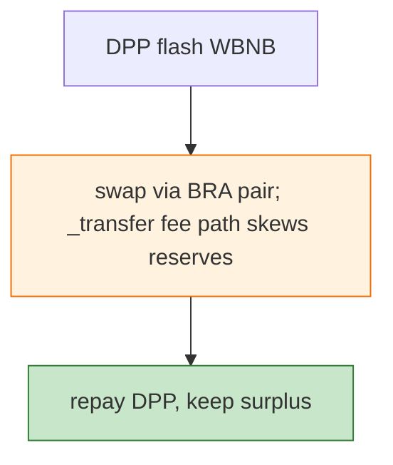

# BRA Token Exploit — `_transfer`/Fee Path Miscalculation Drain (DPP Flash)

> **Reproduction:** the PoC compiles & runs in an isolated Foundry project at
> [this project folder](.). Full verbose trace: [output.txt](output.txt).
> Verified vulnerable source: [BRAToken](sources/BRAToken_449FEA),
> [PancakePair](sources/PancakePair_8F4BA1), [DPPAdvanced](sources/DPPAdvanced_0fe261).

---

## Key info

| | |
|---|---|
| **Loss** | ~819 BNB (~$224K); txs `0x6759db55…` (675 BNB), `0x4e5b2efa…` (144 BNB) |
| **Vulnerable contract** | BRA token `0x449fea37…` (BSC), `_transfer` fee path (lines 449-457) |
| **Flash source** | DPPAdvanced `0x0fe261ae…` |
| **Chain / block / date** | BSC / Jan 2023 |
| **Bug class** | Token fee-path accounting — BRA's `_transfer` fee/route logic miscalculates when swapping through its own pair, letting a flash-funded swap extract WBNB. |

---

## TL;DR

Flash-borrow from DPP, swap through the BRA/WBNB pair; BRA's internal fee/transfer-to-pair logic (the
cited lines 449-457) leaves the pair's reserves inconsistent with balances, so the round-trip nets
WBNB. Repay DPP, keep the surplus.

---

## Root cause

A **fee/transfer-path accounting bug** in the token's `_transfer` when interacting with its own pair
(reserve/balance divergence), flash-loan exploitable.

---

## Diagrams



---

## Remediation

1. Fix the fee-path arithmetic; ensure pair balances reconcile with reserves.
2. Fee-aware AMM pair or wrap; `k` on received amounts.

---

## How to reproduce

```bash
_shared/run_poc.sh 2023-01-BRA_exp -vvvvv
```

- RPC: BSC archive. Result: `[PASS]` — WBNB surplus (~675/144 BNB per tx).

---

*Reference: BRA token `_transfer` fee-path drain, BSC, Jan 2023 (~819 BNB).*
