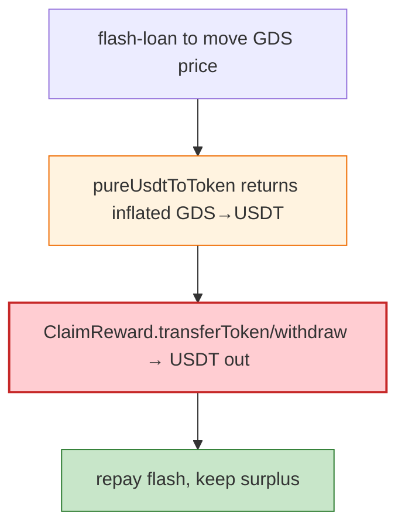

# GDS Coin Exploit — `claimReward`/Price-Path Drain via Flash Loan (BSC)

> **Reproduction:** the PoC compiles & runs in an isolated Foundry project at
> [this project folder](.). Full verbose trace: [output.txt](output.txt).

---

## Key info

| | |
|---|---|
| **Loss** | ~$180K (USDT/BUSD drained from GDS pools on BSC) |
| **Vulnerable contract** | GDS token / `ClaimReward` (BSC); attack txs `0xf9b6cc08…`, `0x2bb704e0…` |
| **Flash source** | `ISwapFlashLoan` (Saddle-style flash loan) |
| **Chain / block / date** | BSC / Jan 2023 |
| **Bug class** | Logic/price-path flaw — GDS's reward-claim / `pureUsdtToToken` conversion used a manipulable price; a flash loan + `ClaimReward.transferToken/withdraw` drained USDT. |

---

## TL;DR

The attacker takes a flash loan, manipulates the price source GDS's conversion reads (`pureUsdtToToken`),
then calls `ClaimReward.transferToken()`/`withdraw()` to extract USDT the contract held, repaying the
flash and keeping the surplus. The `ClaimReward` helper holds protocol USDT and exposes `transferToken`/
`withdraw` with insufficient access/price guards.

---

## Root cause

A **manipulable price feed + under-guarded reward-withdraw path**: `ClaimReward` released USDT against
GDS at a conversion rate derived from a spot, flash-loan-sensitive price, and lacked proper access
control / accounting.

---

## Diagrams



---

## Remediation

1. TWAP/robust oracle for GDS pricing; never spot.
2. Access-control on `ClaimReward.transferToken/withdraw`.
3. Accounting: USDT released ≤ real deposits × rate; cap per call.

---

## How to reproduce

```bash
_shared/run_poc.sh 2023-01-GDS_exp -vvvvv
```

- RPC: BSC archive. Long test (~7 min). Result: `[PASS]` — USDT drained after the flash+claim cycle.

---

*Reference: GDS Coin reward/price drain, BSC, Jan 2023 (~$180K).*
