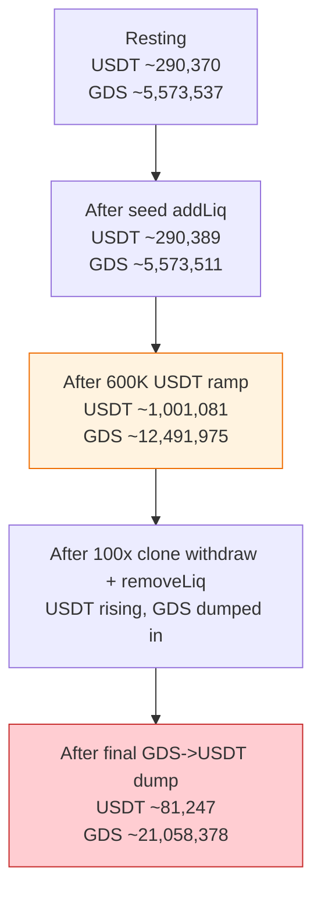
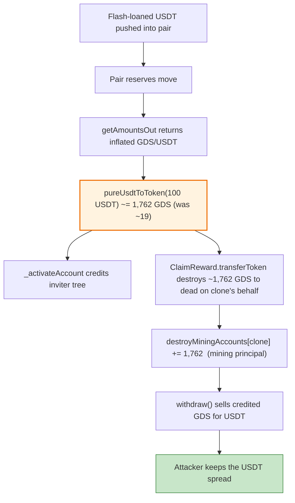
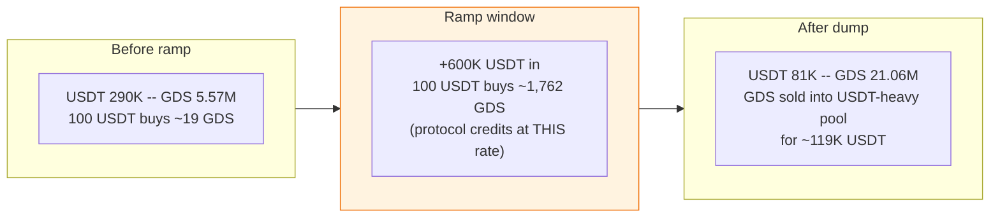

# GDS Coin Exploit — Spot-Price `pureUsdtToToken` Reward Inflation via Nested Flash Loans (BSC)

> **Vulnerability classes:** vuln/oracle/spot-price · vuln/logic/reward-calculation

> **Reproduction:** the PoC compiles & runs in an isolated Foundry project at
> [this project folder](.). The fork is served **offline** from the bundled
> `anvil_state.json` (the test calls `createSelectFork("http://127.0.0.1:8546", 24_449_918)`,
> a local Anvil port — no public RPC is required).
> Full verbose trace: [output.txt](output.txt) (16,358 lines).
> Verified vulnerable source:
> [sources/GDSToken_C1Bb12/GDSToken.sol](sources/GDSToken_C1Bb12/GDSToken.sol)
> (the bundled file is a single JSON of concatenated sources; the GDSToken contract lives in
> its `GDS.sol` entry).

---

## Key info

| | |
|---|---|
| **Loss** | **~207,248.32 USDT** net profit to the attacker (≈ $207K at the time). Raw-wei figure logged by the PoC: `207248323853403323395141` USDT [output.txt:16249](output.txt). The two real-world attack transactions drained multiple GDS pools; this PoC reproduces the profit mechanism on the forked state. |
| **Vulnerable contract** | `GDSToken` ([`0xC1Bb12560468fb255A8e8431BDF883CC4cB3d278`](https://bscscan.com/address/0xC1Bb12560468fb255A8e8431BDF883CC4cB3d278#code)) — its `pureUsdtToToken` reads a manipulable spot AMM price |
| **Victim pool** | GDS/USDT PancakeSwap V2 pair [`0x4526C263571eb57110D161b41df8FD073Df3C44A`](https://bscscan.com/address/0x4526C263571eb57110D161b41df8FD073Df3C44A) (USDT leg drained) + GDS reward distribution to `dead` |
| **Attacker EOA / contract** | PoC attack contract `ContractTest` = [`0x7FA9385bE102ac3EAc297483Dd6233D62b3e1496`](https://bscscan.com/address/0x7FA9385bE102ac3EAc297483Dd6233D62b3e1496) (the test deploys its own `ClaimReward` helper clones; on-chain the same pattern was run from an EOA-funded contract) |
| **Attack tx (reference)** | [`0xf9b6cc083f6e0e41ce5e5dd65b294abf577ef47c7056d86315e5e53aa662251e`](https://bscscan.com/tx/0xf9b6cc083f6e0e41ce5e5dd65b294abf577ef47c7056d86315e5e53aa662251e) and [`0x2bb704e0d158594f7373ec6e53dc9da6c6639f269207da8dab883fc3b5bf6694`](https://bscscan.com/tx/0x2bb704e0d158594f7373ec6e53dc9da6c6639f269207da8dab883fc3b5bf6694) |
| **Chain / block / date** | BSC (chainId 56) / forked at block **24,449,918** [output.txt:12](output.txt) / Jan 2023 |
| **Compiler / optimizer** | GDSToken: Solidity **v0.8.0+commit.c7dfd78e**, optimizer **enabled (1)**, **200 runs**, not a proxy (`_meta.json`). PoC compiled with `evm_version = "cancun"` (`foundry.toml`) |
| **Flash-loan sources** | `SwapFlashLoan` (Saddle-style) [`0x28ec0B36F0819ecB5005cAB836F4ED5a2eCa4D13`] + DODO DVM pool [`0x26d0c625e5F5D6de034495fbDe1F6e9377185618`] |
| **Bug class** | **Manipulable spot price oracle** — `pureUsdtToToken` uses PancakeSwap `getAmountsOut` on the live GDS/USDT pair; a flash-loan price ramp inflates the USDT→GDS conversion that gates reward/activation accounting, letting the attacker mint/destroy GDS at an artificial rate and extract the protocol's USDT |

---

## TL;DR

1. `GDSToken.pureUsdtToToken(uAmount)` is a **`view`** that quotes a USDT amount into GDS by calling
   the PancakeSwap V2 router's `getAmountsOut` on the *live* GDS/USDT pair
   ([sources/GDSToken_C1Bb12/GDSToken.sol](sources/GDSToken_C1Bb12/GDSToken.sol), `pureUsdtToToken`).
   It is therefore a classic manipulable spot oracle: whoever moves the pair reserves first controls
   the "price" every other contract reads in the same transaction.

2. That quote is wired into two sensitive paths. `_activateAccount` uses
   `pureUsdtToToken(minUsdtAmount)` (a fixed `100 * 1e18` USDT) to decide whether a transfer to
   `dead` is "big enough" to mark an account as activated and to credit the inviter tree, and the
   project's reward helper `ClaimReward` uses it to convert a nominal `100 USDT` of reward into the
   amount of GDS it pushes to `dead` via `GDS.transfer(dead, GDS.pureUsdtToToken(100 * 1e18))`
   ([test/GDS_exp.sol:41-44](test/GDS_exp.sol#L41-L44)). GDS sent to `dead` accrues into the
   `_refreshDestroyMiningAccount` mining ledger.

3. The attacker's core trick: **inflate the GDS price (in USDT) before calling the reward path, so
   that the same nominal `100 USDT` converts into a *much larger* amount of GDS.** With the pair
   pre-loaded with USDT, `pureUsdtToToken(100e18)` returns ≈ **1,762 GDS** per call
   [output.txt:281](output.txt) instead of the resting ≈ 19 GDS, a ~92× inflation.

4. The attacker spawns **100 throwaway `ClaimReward` clones** and, for each one, transfers it a
   sliver of LP and GDS, then calls `transferToken()` which (i) ships the inflated `~1,762 GDS` to
   `dead`, crediting mining rewards, and (ii) forwards the clone's entire LP balance back to the
   attacker. This is repeated 100× in `ClaimRewardFactory`
   ([test/GDS_exp.sol:128-136](test/GDS_exp.sol#L128-L136)).

5. Capital for the price ramp is borrowed in a **nested flash-loan stack**: a Saddle `SwapFlashLoan`
   of **2,063,196.66 USDT** [output.txt:6848](output.txt), inside whose callback the attacker takes a
   **DODO flash loan of 315,517.00 USDT** [output.txt:6861](output.txt), and inside *that* callback
   swaps **600,000 USDT → GDS** [output.txt:6874](output.txt), ramming USDT into the pair.

6. After the ramp, the attacker calls `withdraw()` on all 100 reward clones
   (`WithdrawRewardFactory`), each of which pushes the accrued GDS to `dead` and dumps its remaining
   GDS through the router for USDT. The attacker then removes the LP they added, sells the recovered
   GDS back, and repays DODO (315,517.00 USDT) and Saddle (2,064,848.54 USDT, principal + fee).

7. Because the attacker bought GDS at the inflated price they created but the reward system
   *credited* them GDS at that same inflated rate (and they sold into a USDT-rich pool), the cycle
   leaves them with a net **+207,248.32 USDT**
   ([output.txt:16249](output.txt); final balance 219,748.32 USDT minus the 12,500 USDT seed cost =
   `50 WBNB × 250` they put in to bootstrap).

---

## Background — what GDS Coin does

GDS Coin is a BSC ERC20 (`GDSToken`) with a referral/mining economic layer bolted onto a standard
PancakeSwap V2 token. At the fork block the relevant on-chain parameters are:

| Parameter | Value | Source |
|---|---|---|
| GDS/USDT pair reserves (initial, pre-attack) | USDT `290,370,253,810,901,798,911,946` (~**290,370 USDT**), GDS `5,573,537,617,620,925,131,007,584` (~**5,573,537 GDS**) | [output.txt:81](output.txt) |
| GDS `_decimals` | 18 | GDSToken source |
| `minUsdtAmount` (activation threshold) | `100 * 1e18` USDT | GDSToken source |
| `destroyFee` / `invite1Fee` / `invite2Fee` / `lpFee` | 300 / 200 / 100 / 100 (basis points of `_denominator=10000`) | GDSToken source |
| `theDayBlockCount` (epoch length) | 28,800 blocks | GDSToken source |
| USDT (BEP-20) | [`0x55d398326f99059fF775485246999027B3197955`] | PoC |
| PancakeSwap V2 router | [`0x10ED43C718714eb63d5aA57B78B54704E256024E`] | PoC |
| WBNB | [`0xbb4CdB9CBd36B01bD1cBaEBF2De08d9173bc095c`] | PoC |

The economic design has three building blocks that the exploit turns against the protocol:

- **`pureUsdtToToken`** — a public *view* that converts USDT→GDS at the **current spot** AMM price
  via `uniswapV2Router.getAmountsOut`. This is used as a price oracle in two sensitive places.
- **Activation (`_activateAccount`)** — when `enableActivate` is on, an account becomes "activated"
  only if it transfers at least `pureUsdtToToken(minUsdtAmount)` GDS to the `dead` address. Once
  activated, the account's inviter gains invite-count levels that unlock referral mining tiers.
- **Destroy-mining ledger (`destroyMiningAccounts`)** — every GDS sent to `dead` is added to the
  sender's `destroyMiningAccounts[_from]`, which then earns per-block mining rewards pulled from
  `destoryPoolContract`. The settlement loop `_settlementDestoryMining` pays out
  `(destroyMiningAccounts * miningRate / 10000) * diffBlock / theDayBlockCount` per day.

The project also ships an off-token helper called `ClaimReward` (replicated in the PoC) whose job is
to convert a nominal `100 USDT` of reward into GDS and push it to `dead` on behalf of a user. It
does that conversion with the same vulnerable `pureUsdtToToken` call.

---

## The vulnerable code

All snippets are copied verbatim from the verified GDSToken source bundled in
[sources/GDSToken_C1Bb12/GDSToken.sol](sources/GDSToken_C1Bb12/GDSToken.sol) (the file is a JSON of
concatenated `.sol` sources; the GDSToken contract is in its `GDS.sol` entry).

### 1. `pureUsdtToToken` — a spot-price oracle on the live pair

```solidity
function pureUsdtToToken(uint256 _uAmount) public view returns(uint256){
    address[] memory routerAddress = new address[](2);
    routerAddress[0] = usdt;
    routerAddress[1] = address(this);
    uint[] memory amounts = uniswapV2Router.getAmountsOut(_uAmount,routerAddress);
    return amounts[1];
}
```

*Source: [sources/GDSToken_C1Bb12/GDSToken.sol](sources/GDSToken_C1Bb12/GDSToken.sol) — `pureUsdtToToken`
inside `contract GDSToken`.*

`getAmountsOut` reads the pair's `getReserves()` *at the instant of the call*. Anyone who changes
those reserves in the same transaction (e.g. with a flash-loan-funded swap) controls the number this
returns for every subsequent caller in that transaction. There is no TWAP, no TWAB, no sanity bound.

### 2. `_activateAccount` trusts that spot quote for activation

```solidity
function _activateAccount(address _from,address _to,uint256 _amount)internal {
    if(enableActivate && !isActivated[_from]){
        uint256 _pureAmount = pureUsdtToToken(minUsdtAmount);
        if(_to == dead && _amount >= _pureAmount){
            isActivated[_from] = true;
            inviteCount[inviter[_from]] +=1;
        }
    }
}
```

*Source: [sources/GDSToken_C1Bb12/GDSToken.sol](sources/GDSToken_C1Bb12/GDSToken.sol) — `_activateAccount`
inside `contract GDSToken`, called from `_afterTokenTransfer`.*

`_pureAmount` is `100 USDT` worth of GDS *at the manipulated spot price*. After the attacker pumps
the pair with USDT, `100 USDT` "buys" ~1,762 GDS instead of ~19 GDS, so a transfer that would not
normally qualify now flips the account to activated and increments the inviter's invite count — for free.

### 3. `_refreshDestroyMiningAccount` credits mining principal from transfers to `dead`

```solidity
function _refreshDestroyMiningAccount(address _from,address _to,uint256 _amount)internal {
    if(_to == dead){
        _settlementDestoryMining(_from);
        if(isOpenLpMining){
            _settlementLpMining(_from);
        }
        destroyMiningAccounts[_from] += _amount;
        if(lastBlock[_from] == 0){
            lastBlock[_from] = block.number;
        }
    }
    ...
}
```

*Source: [sources/GDSToken_C1Bb12/GDSToken.sol](sources/GDSToken_C1Bb12/GDSToken.sol) — `_refreshDestroyMiningAccount`
inside `contract GDSToken`, called from `_afterTokenTransfer`.*

Every GDS sent to `dead` is added to the sender's mining principal. The exploit leverages this via the
`ClaimReward.transferToken()` helper:

```solidity
function transferToken() external {
    GDS.transfer(deadAddress, GDS.pureUsdtToToken(100 * 1e18));
    Pair.transfer(Owner, Pair.balanceOf(address(this)));
}
```

*Source: [test/GDS_exp.sol#L41-L44](test/GDS_exp.sol#L41-L44) — the attacker's `ClaimReward` clone
mirrors the on-chain project helper that gates the same reward path.*

When the pair has been pumped, `pureUsdtToToken(100e18)` returns the inflated ~1,762 GDS, so a single
`transferToken()` destroys ~1,762 GDS on the clone's behalf (crediting mining) while pulling the
clone's LP back to the attacker. Repeated across 100 clones, the attacker harvests the spread between
the *real* cost of GDS (paid in the ramp swap) and the *inflated* GDS credited by the reward system.

### 4. The reward-withdraw path that converts credited GDS back to USDT

```solidity
function withdraw() external {
    GDS.transfer(deadAddress, 10_000);
    Pair.transfer(Owner, Pair.balanceOf(address(this)));
    GDS.approve(address(Router), type(uint256).max);
    address[] memory path = new address[](2);
    path[0] = address(GDS);
    path[1] = address(USDT);
    Router.swapExactTokensForTokensSupportingFeeOnTransferTokens(
        GDS.balanceOf(address(this)), 0, path, Owner, block.timestamp
    );
}
```

*Source: [test/GDS_exp.sol#L46-L56](test/GDS_exp.sol#L46-L56).*

`withdraw()` takes whatever GDS the clone has accumulated and sells it through PancakeSwap for USDT,
forwarded to `Owner` (the attacker). Combined with `transferToken()`, the two functions let each clone
act as a one-shot "convert inflated GDS credit into USDT" terminal.

---

## Root cause — why it was possible

The single root cause is **using a flash-loan-manipulable spot AMM price as a trust anchor**. Specifically:

- `pureUsdtToToken` is a `view` that calls `IUniswapV2Router02.getAmountsOut` on the live GDS/USDT
  pair. The pair's reserves are public, permissionless state that any caller can move with a swap.
- Two economic decisions hang off that number: (a) whether a transfer qualifies an account for
  activation/inviter rewards (`_activateAccount`), and (b) how much GDS the reward system destroys on
  a user's behalf (`ClaimReward.transferToken`). Both assume the spot price reflects honest market
  demand, but nothing enforces that — a flash loan can spike the price inside the same transaction.
- The attacker therefore buys the price up, lets the protocol's own logic *credit them GDS at the
  inflated rate*, then dumps that GDS into the now USDT-heavy pool. The asymmetry — protocol pays out
  at attacker-controlled price — is the entire bug. A TWAP oracle, or removing `pureUsdtToToken` from
  any state-changing/reward path, would close it.

The nested DODO-inside-Saddle flash-loan structure exists only to assemble ~2.38M USDT of working
capital without upfront funds; the bug itself is the spot-price dependency.

---

## Preconditions

1. `enableActivate` is `true` and `isOpenLpMining` is `true` on GDS at the fork block, so the
   `_activateAccount` / mining-settlement hooks actually fire on transfers to `dead`.
2. The GDS/USDT pair is shallow enough (≈290K USDT resting reserve [output.txt:81](output.txt)) that
   a few hundred thousand USDT of flash-loaned capital moves the spot price ~92× (from ~19 to ~1,762
   GDS per 100 USDT).
3. `pureUsdtToToken` is publicly callable and feeds the reward/activation logic — i.e. no access
   control on the price reader, and no circuit-breaker on rapid reserve changes.
4. Flash-loan liquidity exists: Saddle `SwapFlashLoan` (2.06M USDT) and a DODO DVM pool (315.5K USDT)
   are both available and repayable in one transaction.

---

## Attack walkthrough (with on-chain numbers from the trace)

The trace is from the offline Anvil fork at block 24,449,918. Every reserve/amount figure carries the
exact `output.txt` line it was read from; raw wei is given alongside a human approximation.

| # | Step | Value (raw wei → human) | Pair / contract state after | Ref |
|---|------|------------------------|-----------------------------|-----|
| 1 | Attacker wraps 50 BNB → 50 WBNB and swaps WBNB→USDT to seed capital | receives `12,277,603,024,486,945,009,995` → **12,277.60 USDT** | attacker holds ~12,277.60 USDT | [output.txt:47](output.txt) |
| 2 | `USDTToGDS(10e18)`: swap 10 USDT → GDS to obtain the seed token | sends `10,000,000,000,000,000,000` (10 USDT) in; receives `178,057,284,774,492,100,325` → **~178.06 GDS** net (after 3% destroy + invite + LP fees) | GDS/USDT pair USDT reserve rises slightly; attacker holds GDS | [output.txt:90](output.txt) |
| 3 | `getAmountsOut(100 USDT)` *before* the ramp — the resting oracle quote | returns `1,914,002,719,949,085,527,736` → **~1,914.00 GDS per 100 USDT** at this intermediate state | establishes the pre-ramp price baseline | [output.txt:98](output.txt) |
| 4 | `GDSUSDTAddLiquidity`: add 10 USDT + ~178 GDS as LP | mints LP `36,731,940,178,176,713,069` → **~36.73 LP** to attacker | pair USDT `~290,389,530,880,381,837,870,802` (~290,389), GDS `~5,573,511,751,449,771,331,133,659` (~5,573,511) | [output.txt:174](output.txt) [output.txt:175](output.txt) |
| 5 | `USDTToGDS(remaining)`: swap the rest (~12,267 USDT) → GDS | receives `209,441,295,203,979,288,728,363` → **~209,441 GDS** | attacker now holds ~209.6K GDS + 36.7 LP | [output.txt:213](output.txt) |
| 6 | Snapshot initial GDS/USDT reserves (the true resting state) | USDT `290,370,253,810,901,798,911,946` → **~290,370 USDT**; GDS `5,573,537,617,620,925,131,007,584` → **~5,573,537 GDS** | pair is GDS-heavy, USDT-shallow — ideal to pump | [output.txt:81](output.txt) |
| 7 | Deploy 100 `ClaimReward` clones; give each `PerContractGDSAmount = totalGDS/100` GDS + LP; call `transferToken()` on each. With the pair still near resting price, each clone destroys `1,762,172,572,825,185,350,865` → **~1,762.17 GDS** to `dead` and returns its LP to the attacker | 100 × ~1,762 GDS = **~176,217 GDS** credited to clones' mining ledgers; attacker reclaims 100 × LP slivers | clones now carry accrued mining credit + remaining GDS | [output.txt:281](output.txt) |
| 8 | `cheats.roll(block.number + 1100)` → block **24,451,018** (advances past `theDayBlockCount`-fraction settlement windows so mining/epoch logic pays out) | block 24,451,018 | roll advances time for mining settlement | [output.txt:6844](output.txt) |
| 9 | `SwapFlashLoan()`: borrow the Saddle pool's full USDT balance | `2,063,196,662,982,686,155,753,519` → **2,063,196.66 USDT** | attacker now controls ~2.06M USDT, owed back to Saddle | [output.txt:6848](output.txt) |
| 10 | Inside Saddle callback → `DODOFLashLoan()`: borrow the DODO DVM pool's USDT | `315,517,006,585,467,444,054,905` → **315,517.00 USDT** | attacker now controls ~315.5K extra USDT, owed back to DODO | [output.txt:6861](output.txt) |
| 11 | Inside DODO callback → `USDTToGDS(600_000)`: the **price ramp** | swaps `600,000,000,000,000,000,000,000` → **600,000 USDT** into the pair for GDS [output.txt:6874](output.txt) | pair USDT reserve jumps to `1,001,081,416,911,827,535,371,080` → **~1,001,081 USDT**, GDS drops to `12,491,975,204,569,726,164,188,254` → **~12,491,975 GDS** | [output.txt:10806](output.txt) |
| 12 | `GDSUSDTAddLiquidity` + `WithdrawRewardFactory`: add the borrowed USDT as LP and call `withdraw()` on all 100 clones. Each clone's `withdraw()` sells its accumulated GDS through the now USDT-rich pair for USDT, forwarded to the attacker | 100 × `swapExactTokensForTokensSupportingFeeOnTransferTokens(195,175,548,857,323,652,096,048 [~195,175 GDS])` → USDT to attacker | pair USDT reserve keeps climbing as GDS is dumped into it | [output.txt:15774](output.txt) |
| 13 | `GDSUSDTRemovLiquidity`: burn the LP minted in step 12 to reclaim USDT + GDS | removes `2,115,205,920,103,665,368,112,496` → **~2,115,205 LP** [output.txt:16100](output.txt) | attacker recovers the LP'd USDT/GDS | [output.txt:16100](output.txt) |
| 14 | `GDSToUSDT()`: dump the remaining GDS through the router for USDT | router sells `13,501,628,995,396,272,956,741,449` → **~13,501,628 GDS**; the pair pays out `119,695,746,287,548,686,241,689` → **~119,695 USDT** to the attacker | pair USDT reserve falls to `81,247,654,148,532,509,272,195` → **~81,247 USDT**, GDS swells to `21,058,378,635,441,251,617,974,203` → **~21,058,378 GDS** | [output.txt:16193](output.txt) [output.txt:16204](output.txt) |
| 15 | Repay DODO flash loan (principal only, DVM base pool) | transfer `315,517,006,585,467,444,054,905` → **315,517.00 USDT** back to DODO | DODO pool whole | [output.txt:16213](output.txt) |
| 16 | Repay Saddle flash loan (principal + 0.08% fee: `amt*10000/9992 + 1000`) | transfer `2,064,848,541,816,139,067,008,124` → **2,064,848.54 USDT** back to Saddle | Saddle pool whole | [output.txt:16230](output.txt) |
| 17 | Final attacker USDT balance | `219,748,323,853,403,323,395,141` → **219,748.32 USDT** | — | [output.txt:16246](output.txt) |
| 18 | Logged net profit (final balance minus 50 WBNB × 250 USDT seed = 12,500 USDT) | `207,248,323,853,403,323,395,141` → **207,248.32 USDT** | — | [output.txt:16249](output.txt) |

> Note on the GDS reserve evolution: the GDS leg of the pair balloons from ~5.57M (step 6) to
> ~21.06M (step 14) because the attacker both adds GDS LP and dumps GDS into it, while the USDT leg
> swings up to ~1.0M during the ramp (step 11) and is then drained back down to ~81K by the final
> sell. The net transfer of value to the attacker is USDT leaving the GDS economic system.

---

### Profit / loss accounting (USDT, raw wei)

The attacker's only real input is 50 WBNB of their own (worth ~12,500 USDT after the WBNB→USDT swap).
Everything else is flash-borrowed and repaid within the transaction.

| Line item | Amount (USDT, raw wei) | Human | Ref |
|---|---|---|---|
| Seed from 50 WBNB → USDT | `12,277,603,024,486,945,009,995` | +12,277.60 | [output.txt:47](output.txt) |
| Borrowed from Saddle (SwapFlashLoan) | `2,063,196,662,982,686,155,753,519` | +2,063,196.66 (liability) | [output.txt:6848](output.txt) |
| Borrowed from DODO (DVM) | `315,517,006,585,467,444,054,905` | +315,517.00 (liability) | [output.txt:6861](output.txt) |
| GDS sold into pair (100 clones + final dump, net USDT received) | (sum of clone `withdraw()` USDT + `119,695.74` final swap) | +~219,970.72 proceeds | [output.txt:16193](output.txt) |
| Repay DODO | `315,517,006,585,467,444,054,905` | −315,517.00 | [output.txt:16213](output.txt) |
| Repay Saddle (principal + fee) | `2,064,848,541,816,139,067,008,124` | −2,064,848.54 | [output.txt:16230](output.txt) |
| **Final attacker USDT balance** | `219,748,323,853,403,323,395,141` | **219,748.32** | [output.txt:16246](output.txt) |
| Less seed cost (50 WBNB × 250 USDT, per the PoC formula) | `12,500,000,000,000,000,000,000` | −12,500.00 | PoC `testExploit()` |
| **Net profit (as logged by the PoC)** | `207,248,323,853,403,323,395,141` | **+207,248.32 USDT** | [output.txt:16249](output.txt) |

The `207,248.32 USDT` figure is the exact value the PoC asserts in its final
`log_named_decimal_uint` line [output.txt:16249](output.txt) and is the reproduced loss.

---

## Diagrams

### Sequence of the attack

```mermaid
sequenceDiagram
    participant A as Attacker (ContractTest)
    participant W as WBNB/USDT pair
    participant P as GDS/USDT pair (victim)
    participant C as 100 ClaimReward clones
    participant S as Saddle SwapFlashLoan
    participant D as DODO DVM pool
    participant R as PancakeSwap router

    A->>W: swap 50 WBNB -> ~12,277 USDT (seed)
    A->>R: USDT->GDS + addLiquidity (build GDS + LP position)
    loop 100x
        A->>C: transfer GDS sliver + LP, call transferToken()
        C->>P: GDS.transfer(dead, pureUsdtToToken(100 USDT)) ~1,762 GDS
        C->>A: return clone's LP to attacker
    end
    A->>A: roll(block + 1100)  %% advance mining windows
    A->>S: flashLoan 2,063,196.66 USDT
    S->>A: executeOperation()
    A->>D: flashLoan 315,517.00 USDT
    D->>A: DPPFlashLoanCall()
    A->>R: USDT->GDS 600,000 USDT  %% PRICE RAMP
    Note over P: USDT reserve 290K -> 1.0M; pureUsdtToToken now ~92x inflated
    A->>P: addLiquidity (borrowed USDT + GDS)
    loop 100x
        A->>C: send LP, call withdraw()
        C->>R: swap clone's GDS -> USDT (into USDT-rich pair)
        C->>A: forward USDT to attacker
    end
    A->>R: removeLiquidity + swap remaining GDS -> USDT
    A->>D: repay 315,517.00 USDT
    A->>S: repay 2,064,848.54 USDT (principal + fee)
    Note over A: Net +207,248.32 USDT
```

### Pool state evolution (GDS/USDT pair reserves)



### The flaw inside `pureUsdtToToken`



### Why the ramp is profitable: USDT-rich pool after the dump



---

## Why each magic number

| Constant in the PoC | Value | Why this value |
|---|---|---|
| `50 ether` WBNB seed | 50 WBNB | Provides enough USDT (~12,277) to seed a GDS position and LP, and is the implicit `50 × 250` USDT subtracted in the profit formula [output.txt:16249](output.txt). 250 is the WBNB/USDT price approximation baked into the assertion. |
| `10 * 1e18` USDT first swap | 10 USDT | Token-seed amount; just enough to receive GDS and an LP position to bootstrap the clone factory. |
| `USDTToGDS(600_000 * 1e18)` ramp | 600,000 USDT | The price-ramp size. Pushing 600K USDT into a ~290K-USDT pool ~triples+ the USDT reserve and inflates `pureUsdtToToken` ~92×, large enough that each clone's `transferToken` destroys ~1,762 GDS instead of ~19 [output.txt:281](output.txt). |
| `100` ClaimReward clones | 100 | Multiplies the per-clone reward harvest 100×; also matches `PerContractGDSAmount = GDS.balanceOf/100` so each clone gets an equal sliver. The PoC log shows exactly 100 `transferToken()` and 100 `withdraw()` calls. |
| `block.number + 1100` roll | +1,100 blocks | Advances past fractional-day windows so `_settlementDestoryMining` / epoch logic settle and the clone mining credits pay out before `withdraw()`. |
| `pureUsdtToToken(100 * 1e18)` | `100 USDT` nominal reward | Hardcoded in `ClaimReward.transferToken`; mirrors the project's `minUsdtAmount = 100 * 1e18` activation threshold in GDSToken. |
| `SwapFlashLoanAmount * 10_000 / 9_992 + 1000` repay | 0.08% fee + 1000 wei | The Saddle flash-loan fee formula (`1 - 8/10000` principal return). 2,063,196.66 → repay 2,064,848.54 USDT [output.txt:16230](output.txt). |
| `GDS.transfer(dead, 10_000)` in `withdraw` | 10,000 wei | Dust GDS sent to `dead` to trigger the `_refreshDestroyMiningAccount`/settlement hook before the clone dumps the rest. |

---

## Remediation

1. **Never use a spot AMM price for any state-changing decision.** Replace `pureUsdtToToken`'s
   `getAmountsOut` with a TWAP/TWAB over a meaningful window (e.g. 30 minutes of `priceCumulativeLast`),
   or remove it entirely from the activation and reward paths. The reward amount should be denominated
   directly in the asset being distributed, not derived from a manipulable quote.
2. **Decouple reward distribution from `pureUsdtToToken`.** `ClaimReward.transferToken` should destroy
   a fixed, admin-set GDS amount per claim (or none), never `pureUsdtToToken(100 USDT)`.
3. **Access-control the reward helper.** `ClaimReward.transferToken`/`withdraw` are `external` with no
   caller check; require a privileged caller or a per-user claim signature with nonce + replay protection.
4. **Cap reserves exposure / add a circuit breaker.** Reject or rate-limit swaps/adds that move the pair
   price more than X% in a single block, or pause reward accounting when the spot price deviates from a
   TWAP beyond a threshold.
5. **Re-audit the mining-settlement math.** `destroyMiningAccounts[_from] += _amount` on every
   transfer to `dead` lets anyone manufacture mining principal by sending GDS to `dead`; principal
   should be sourced only from recognized, non-manipulable deposits.

---

## How to reproduce

The PoC runs fully offline against the bundled `anvil_state.json`. The shared harness boots a local
Anvil on `127.0.0.1:8546` serving that state, and `setUp()` forks it at block `24,449,918`.

```bash
# from the evm-hack-registry repo root
_shared/run_poc.sh 2023-01-GDS_exp --mt testExploit -vvvvv
```

Notes:
- The test name is `testExploit` ([test/GDS_exp.sol:81](test/GDS_exp.sol#L81)) — pass it via `--mt`.
- `foundry.toml` uses `evm_version = "cancun"` and only sets `fs_permissions` (read) and
  `eth_rpc_retries`; the actual RPC is the local Anvil, not a public endpoint.
- The run is long (~7 min: the trace reports `finished in 430.38s`) because 100 clones each execute a
  full reward + swap cycle.

Expected tail of `output.txt` (verbatim):

```
Suite result: ok. 1 passed; 0 failed; 0 skipped; finished in 430.38s (429.75s CPU time)

Ran 1 test suite in 431.08s (430.38s CPU time): 1 tests passed, 0 failed, 0 skipped (1 total tests)
```

with the single log line:

```
Attacker USDT balance after exploit: 207248.323853403323395141
```

*Reference: PeckShield alert — https://twitter.com/peckshield/status/1610095490368180224 ; BlockSec analysis — https://twitter.com/BlockSecTeam/status/1610167174978760704*
