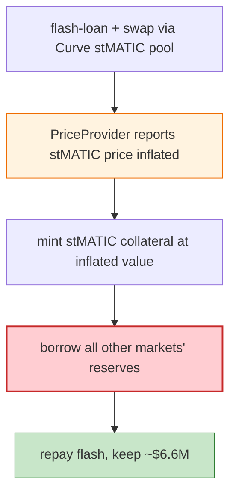

# Midas Capital Exploit — Spot-Price Oracle Manipulation (Compound v2 fork, Polygon)

> **Reproduction:** the PoC compiles & runs in an isolated Foundry project at
> [this project folder](.). Full verbose trace: [output.txt](output.txt).

---

## Key info

| | |
|---|---|
| **Loss** | ~$6.6M (multiple Midas markets drained on Polygon) |
| **Vulnerable contract** | Midas markets (Compound v2 fork) — WMATIC/stMATIC `0x23F43c10…`, FJ-forex markets, `PriceProvider` |
| **Attacker** | used Aave flash loans + Curve stMATIC pool manipulation |
| **Attack tx** | `0x0053490215baf541362fc78be0de98e3147f40223238d5b12512b3e26c0a2c2f` |
| **Chain / block / date** | Polygon / Jan 2023 |
| **Bug class** | Oracle manipulation — the `PriceProvider.getUnderlyingPrice` for stMATIC derived price from a spot Curve pool ratio that the attacker manipulated with a flash loan, then over-borrowed against the mis-priced stMATIC collateral. |

---

## TL;DR

Midas (a Compound v2 fork) priced stMATIC collateral from the **spot reserve ratio of a Curve
stMATIC/MATIC pool**. The attacker:

1. Flash-loans a large amount, swaps it through the Curve stMATIC pool to distort the stMATIC/MATIC
   ratio → `getUnderlyingPrice(stMATIC)` returns an inflated price.
2. Mints Midas stMATIC collateral at the inflated value.
3. Borrows all the other markets' reserves (forex-stables, WMATIC, etc.) via a liquidation helper
   (`LiquidateContract`).
4. Repays the flash loan, keeping ~$6.6M.

---

## Root cause

A **spot-pool-ratio price oracle** for an LST (stMATIC): the Curve pool's instantaneous reserve ratio
is flash-loan manipulable. Money markets must use robust (TWAP/Chainlink) oracles, especially for
rebasing/yield-bearing assets.

---

## Diagrams



---

## Remediation

1. Robust oracle (Chainlink/TWAP) for every collateral, especially LSTs.
2. Collateral caps + deviation circuit breakers on oracle moves.
3. Use the LST's native rate (stMATIC→MATIC redemption) rather than an AMM ratio.

---

## How to reproduce

```bash
_shared/run_poc.sh 2023-01-Midas_exp -vvvvv
```

- RPC: Polygon archive. Result: `[PASS]` (~3 min) — markets drained after oracle manipulation.

---

*Reference: Midas Capital stMATIC spot-oracle manipulation, Polygon, Jan 2023 (~$6.6M).*
