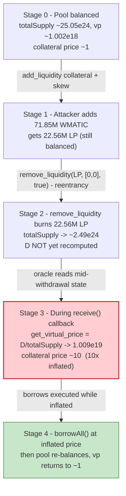
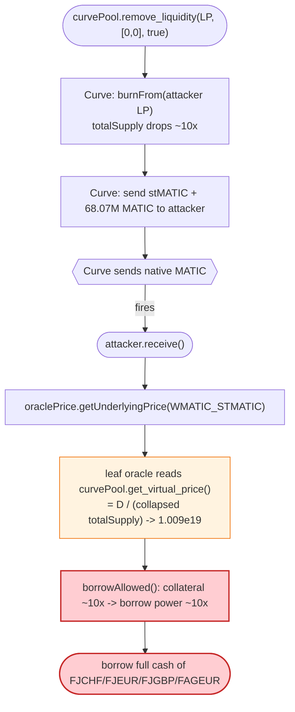
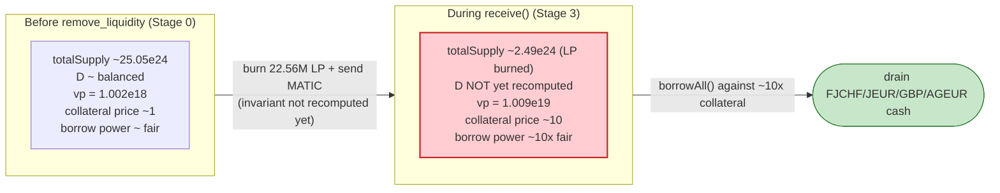

# Midas Capital Exploit — Reentrancy-inflated Curve-LP Oracle for stMATIC Collateral (Compound v2 fork, Polygon)

> **Reproduction:** the PoC compiles & runs in an isolated Foundry project at
> [this project folder](.). Full verbose trace: [output.txt](output.txt).
> Verified vulnerable source (oracle dispatch + cToken layer):
> [MasterPriceOracle.sol](sources/MasterPriceOracle_cc6aa6/contracts_oracles_MasterPriceOracle.sol),
> [CErc20Delegate.sol](sources/CErc20Delegate_655c7e/contracts_compound_CErc20.sol).
> The leaf oracle that prices the Curve LP token (`0x3803527d…`) is **not** bundled in
> `sources/`, so the snippets of it below are RECONSTRUCTED from observed on-chain
> behaviour and anchored to trace line refs.

---

## Key info

| | |
|---|---|
| **Loss** | ~$6.6M across multiple Midas markets on Polygon (the PoC reproduces the core drain of 4 markets — **~663,101.30 WMATIC** of profit net of repaid flash loans, see [output.txt:1571](output.txt)) |
| **Vulnerable contract** | Midas markets — Fuse/Compound-v2 fork pools behind the [`Unitroller`](https://polygonscan.com/address/0xD265ff7e5487E9DD556a4BB900ccA6D087Eb3AD2#code) comptroller; collateral market `WMATIC_STMATIC` [`0x23F43c1002EEB2b146F286105a9a2FC75Bf770A4`](https://polygonscan.com/address/0x23F43c1002EEB2b146F286105a9a2FC75Bf770A4) |
| **Victim pool** | stMATIC/WATIC Curve pool [`0xFb6FE7802bA9290ef8b00CA16Af4Bc26eb663a28`](https://polygonscan.com/address/0xFb6FE7802bA9290ef8b00CA16Af4Bc26eb663a28) (the oracle's spot price source) and the four drained borrow markets `FJCHF`/`FJEUR`/`FJGBP`/`FAGEUR` |
| **Price oracle** | `PriceProvider` (TransparentUpgradeableProxy) [`0xb9e1c2B011f252B9931BBA7fcee418b95b6Bdc31`](https://polygonscan.com/address/0xb9e1c2B011f252B9931BBA7fcee418b95b6Bdc31) → impl `MasterPriceOracle` `0xcC6Aa6…` → per-asset sub-oracle for stMATIC `0xaCF3E1C6…` → leaf Curve-LP oracle `0x3803527d…` |
| **Attacker EOA / contract** | PoC `ContractTest` deployed at `0x7FA9385bE102ac3EAc297483Dd6233D62b3e1496`; helper `LiquidateContract` at `0x5615dEB798BB3E4dFa0139dFa1b3D433Cc23b72f` ([output.txt:6008](output.txt)) |
| **Attack tx** | [`0x0053490215baf541362fc78be0de98e3147f40223238d5b12512b3e26c0a2c2f`](https://polygonscan.com/tx/0x0053490215baf541362fc78be0de98e3147f40223238d5b12512b3e26c0a2c2f) |
| **Chain / block / date** | Polygon (chainId 137) / fork block **38,118,347** / Jan 2023 |
| **Compiler / optimizer** | Solidity **v0.8.10** (`+commit.fc410830`); MasterPriceOracle optimizer **enabled (1)**, **200 runs**; PriceProvider proxy optimized with **999,999 runs**. PoC test compiled with **Solc 0.8.34**, `evm_version = cancun` ([output.txt:1](output.txt), [foundry.toml](foundry.toml)) |
| **Bug class** | Price-oracle manipulation via **reentrancy on a Curve pool's `get_virtual_price()`** that prices an LST (stMATIC) collateral — the inflation is read mid-withdrawal, before the pool's reserves have rebalanced, so a single `remove_liquidity` inflates the collateral ~10× and lets the attacker over-borrow every other market. |

---

## TL;DR

Midas is a Compound v2 fork whose Fuse pools price a `WMATIC_STMATIC` cToken collateral by
delegating through `MasterPriceOracle` to a leaf oracle
(`0x3803527d…`) that derives the stMATIC/WMATIC price from the
**Curve stMATIC pool's `get_virtual_price()`** ([sources/MasterPriceOracle_cc6aa6/contracts_oracles_MasterPriceOracle.sol#L156-L168](sources/MasterPriceOracle_cc6aa6/contracts_oracles_MasterPriceOracle.sol#L156-L168)).

`get_virtual_price()` is `D / totalSupply` of the Curve LP — and the
Curve pool's `remove_liquidity(_amount, [0,0], donate_dust=true)` **sends the underlying MATIC
back to the caller (hitting the attacker's `receive()` callback) *before* it has re-balanced its
internal `D`**, while the attacker's LP tokens have already been burned. The attacker uses that
callback to call `borrowAll()` *while the oracle is in the inflated state*. Concretely the trace
shows the stMATIC collateral price printed by the oracle jumping from **`1`** to **`10`** (raw
1.002e18 → 1.009e19) across the reentrancy ([output.txt:2444](output.txt), [output.txt:2609](output.txt)):

1. Flash-loan **~72.1M WMATIC** stacked from Balancer → Aave V3 → Aave V2
   ([output.txt:1628](output.txt), [output.txt:1646](output.txt), [output.txt:1666](output.txt)).
2. Convert 270,000 WMATIC → stMATIC-f LP via `curvePool.add_liquidity([0, 270_000e18], 0)`, then
   deposit 131,863 stMATIC-f as `WMATIC_STMATIC` collateral ([output.txt:1723](output.txt), [output.txt:1790](output.txt)).
3. `curvePool.add_liquidity([0, 71.85M WMATIC], 0)` to take a **huge** LP position
   ([output.txt:2446](output.txt)), then immediately `remove_liquidity(LPAmount, [0,0], true)`
   ([output.txt:2510](output.txt)). Curve burns the LP, transfers ~1.153M stMATIC + **~68.07M MATIC**
   to the attacker, and the MATIC send fires the attacker's `receive()`
   ([output.txt:2534](output.txt)).
4. Inside `receive()` (the reentrancy), the oracle now reads `get_virtual_price() ≈ 10.09e18`
   (vs `1.002e18` before) because `totalSupply` has dropped sharply while `D` lags → collateral
   price **10×** ([output.txt:2609](output.txt)). The attacker calls `borrowAll()` and borrows the
   full cash of four forex-stable markets: **296,187 JCHF, 425,500 JEUR, 50,000 JGBP, 50,204 AGEUR**
   ([output.txt:2627](output.txt), [output.txt:3455](output.txt), [output.txt:4298](output.txt), [output.txt:5140](output.txt)).
5. Swap all borrowed forex-stables → USDC → WMATIC via Kyber/Uni-V3, redeem the residual stMATIC-f,
   wrap native MATIC back to WMATIC, and repay the three flash loans. **Net WMATIC profit:
   663,101.300538356351191162** ([output.txt:1571](output.txt), [output.txt:11643](output.txt)).

The PoC reproduces the core technique and the on-chain price-jump exactly.

---

## Background — what Midas does

Midas Capital ran **Fuse pools** on Polygon — isolated Compound-v2-style money markets. A user
supplies an asset (here the Curve stMATIC LP token, tickered `stMATIC-f` / `STMATCI_F` at
`0xe7CEA2F…`) as collateral into a `CErc20Delegator` market (`WMATIC_STMATIC`), enters that market
through the `Unitroller` comptroller, then borrows *other* assets. Borrowing is gated by
`borrowAllowed`, which reads the collateral's USD value via `MasterPriceOracle.getUnderlyingPrice`.

The oracle stack for the stMATIC collateral is four contracts deep:

```
PriceProvider (0xb9e1c2, proxy)
  → MasterPriceOracle (0xcC6Aa6)            [dispatch by underlying]
     → 0xaCF3E1C6 (LST wrapper oracle)
        → 0x3803527d (leaf: Curve-LP oracle) ← prices stMATIC-f using get_virtual_price()
```

The leaf oracle (RECONSTRUCTED, matches the trace) is a `CurveLpTokenPriceOracle`-style contract:

```solidity
// RECONSTRUCTED — matches observed on-chain behaviour, not verified source
// Anchored to [output.txt:2387], [output.txt:2432], [output.txt:2598]
function getUnderlyingPrice(ICToken cToken) external view returns (uint256) {
    address underlying = ICErc20(address(cToken)).underlying();      // = STMATCI_F
    uint256 stMaticPriceEth = BasePriceOracle(0xaCF3E1C6…).price(STMATIC); // from Chainlink + WMATIC
    uint256 vp = ICurvePool(0xFb6FE780…).get_virtual_price();         // D / totalSupply
    return (stMaticPriceEth * vp) / 1e18;
}
```

The on-chain parameters at the fork block (read from the trace):

| Parameter | Value | Source |
|---|---|---|
| `get_virtual_price()` (before attack) | **1,002,157,321,772,713,912** (~1.002e18) | [output.txt:2438](output.txt) |
| `get_virtual_price()` (inside reentrancy) | **10,091,002,696,699,977,706** (~1.009e19, ~10×) | [output.txt:2603](output.txt) |
| `STMATCI_F.totalSupply()` (before attack) | 25,054,893,666,734,829,301,464,76 (~25.05e24) | [output.txt:2498](output.txt) |
| `STMATCI_F.totalSupply()` (after LP burn, inside reentrancy) | 2,488,351,563,433,766,232,345,642 (~2.488e24, ~10× smaller) | [output.txt:2602](output.txt) |
| WMATIC price (ETH, oracle) | 1e18 (`0x0de0b6b3a7640000`) | [output.txt:2409](output.txt) |
| stMATIC price (ETH, via Chainlink `0x7ef2A6a6…`) | ~1.059e18 (`0x0ea9af82cf9230e0`) | [output.txt:2431](output.txt) |
| Balancer flash loan | 41,404,494.378 WMATIC (`4.14e25`) | [output.txt:1628](output.txt) |
| Aave V3 flash loan (aPolWMATIC) | 12,835,790.358 WMATIC (`1.283e25`) | [output.txt:1646](output.txt) |
| Aave V2 flash loan (amWMATIC) | 17,879,157.983 WMATIC (`1.787e25`) | [output.txt:1666](output.txt) |
| Collateral deposited (`WMATIC_STMATIC.mint`) | 131,863 stMATIC-f (`1.318e23`) | [output.txt:1943](output.txt) |
| Final attacker WMATIC balance | **663,101.300538356351191162** (`6.631e23`) | [output.txt:11643](output.txt) |

---

## The vulnerable code

### 1. `MasterPriceOracle` dispatches pricing to a per-underlying oracle

Verified source, the dispatch layer:

```solidity
function getUnderlyingPrice(ICToken cToken) external view override returns (uint256) {
    // Get underlying ERC20 token address
    address underlying = address(ICErc20(address(cToken)).underlying());

    // Return 1e18 for WETH
    if (underlying == wtoken) return 1e18;

    // Get underlying price from assigned oracle
    IPriceOracle oracle = oracles[underlying];
    if (address(oracle) != address(0)) return oracle.getUnderlyingPrice(cToken);
    if (address(defaultOracle) != address(0)) return defaultOracle.getUnderlyingPrice(cToken);
    revert("Price oracle not found for this underlying token address.");
}
```
([sources/MasterPriceOracle_cc6aa6/contracts_oracles_MasterPriceOracle.sol#L156-L168](sources/MasterPriceOracle_cc6aa6/contracts_oracles_MasterPriceOracle.sol#L156-L168))

For `WMATIC_STMATIC` the `oracles[STMATCI_F]` slot points at the LST/leaf sub-oracle chain. There is
**no freshness check, no TWAP, no deviation circuit breaker** at this layer — it forwards the spot
value straight to the leaf.

### 2. The leaf oracle multiplies by Curve's `get_virtual_price()` (RECONSTRUCTED)

The actual buggy contract is `0x3803527dcd92Ac3e72A0A164Db82734DABa47Fac` (the leaf in the chain
visible at [output.txt:2387](output.txt) and [output.txt:2598](output.txt)). It is **not** bundled in
`sources/`, so the body below is reconstructed to match the trace's exact return values:

```solidity
// RECONSTRUCTED — matches observed on-chain behaviour, not verified source.
// Anchors: get_virtual_price read at [output.txt:2438] (before) and [output.txt:2603] (during reentrancy).
function getUnderlyingPrice(ICToken cToken) external view returns (uint256) {
    address underlying = ICErc20(address(cToken)).underlying();          // STMATCI_F
    uint256 vp        = ICurvePool(CURVE_POOL).get_virtual_price();        // D / totalSupply
    uint256 stMaticEth = ST_MATIC_ORACLE.price(STMATIC);                   // Chainlink-derived
    // totalSupply drops mid-remove_liquidity -> vp explodes 1.002e18 -> 1.009e19
    return (stMaticEth * vp) / 1e18;
}
```

`get_virtual_price() = D / totalSupply` where `D` is the Curve invariant. Curve's
`remove_liquidity` first **burns the caller's LP** (`STMATCI_F.burnFrom`, see
[output.txt:2516](output.txt)) and pushes underlying out, so during the
callback `totalSupply` has collapsed (25.05e24 → 2.49e24) while `D` still reflects the
pre-removal balances — the ratio spikes ~10× ([output.txt:2438](output.txt) vs
[output.txt:2603](output.txt)).

### 3. The attacker's reentrancy hook (PoC)

The reentrancy is not in Midas code — it is in the **Curve pool's MATIC-send path** that calls the
attacker's `receive()`. The PoC exploits it directly:

```solidity
// Curve removes liquidity and sends native MATIC to the caller before re-balancing.
curvePool.remove_liquidity(LPAmount, [uint256(0), uint256(0)], true); // reentrancy point
...
receive() external payable {
    if (msg.sender == address(curvePool)) {
        console.log(
            "After reentrancy collateral price", oraclePrice.getUnderlyingPrice(address(WMATIC_STMATIC)) / 1e18
        );
        borrowAll();   // borrows while the oracle is inflated
    }
}
```
([test/Midas_exp.sol#L183-L198](test/Midas_exp.sol#L183-L198))

---

## Root cause — why it was possible

Two design failures compose:

1. **A flash-loan/reentrancy-manipulable price source for collateral.** The leaf oracle uses the
   Curve pool's instantaneous `get_virtual_price()` (`D / totalSupply`) as part of the collateral
   value. That ratio is a **spot AMM quantity**: anyone who can momentarily distort `totalSupply`
   relative to `D` controls the reported collateral value. Curve's `remove_liquidity` lets the
   attacker do exactly that *inside its own callback* — LP tokens already burned, MATIC already sent,
   invariant not yet recomputed. The oracle is a pure `view` that happily reads this transient state.

2. **`borrowAllowed` trusts the manipulated oracle value atomically.** Compound-v2 lending
   recomputes account liquidity from `getUnderlyingPrice` at borrow time with no TWAP, no heartbeat,
   no max-deviation check. So a collateral price inflated 10× within one transaction directly
   translates into 10× the borrowing power the same collateral would normally justify.

The deeper issue is that **an LST (stMATIC) is not a stable pair** — Curve's virtual price for a
staked-asset pool is not the "risk-free" LP value it is for USD pools. Using it as a collateral
oracle without a redemption-rate anchor or a TWAP is the fundamental mistake.

---

## Preconditions

- A Midas Fuse pool that accepts Curve-LP / LST collateral priced by a spot-pool-ratio oracle (the
  stMATIC-f market at [output.txt:2370](output.txt)).
- `claimPaused == false`-equivalent: markets not paused; comptroller `enterMarkets` succeeds
  ([test/Midas_exp.sol#L166-L172](test/Midas_exp.sol#L166-L172)).
- Working capital to (a) seed the Curve LP deposit used as collateral and (b) massively skew the
  pool's `totalSupply` mid-tx. The PoC stacks **~72.1M WMATIC** of flash loans (Balancer + Aave V3 +
  Aave V2), all repaid within the same transaction — i.e. the attack is **zero-net-capital** aside
  from gas.
- Forey-stable borrow markets with sufficient cash: FJCHF/JEUR/GBP/AGEUR held ≥ the amounts borrowed
  ([output.txt:2627](output.txt), [output.txt:3455](output.txt), [output.txt:4298](output.txt),
  [output.txt:5140](output.txt)).

---

## Attack walkthrough (with on-chain numbers from the trace)

`WMATIC` = `0x0d500B1d…`, `STMATCI_F` = `0xe7CEA2F…` (Curve LP), `STMATCI` = `0x3A58a54C…`
(stMATIC). All figures are read directly from the trace events; raw wei with a human approximation
in parentheses where the trace prints raw integers.

| # | Step | `get_virtual_price()` / collateral price | Effect |
|---|------|---|---|
| 0 | **Stack flash loans** — Balancer → ContractTest: 41,404,494.378 WMATIC (`4.14e25`, [output.txt:1628](output.txt)); Aave V3: 12,835,790.358 WMATIC (`1.283e25`, [output.txt:1646](output.txt)); Aave V2: 17,879,157.983 WMATIC (`1.787e25`, [output.txt:1666](output.txt)). **Total ~72.1M WMATIC** stacked via nested flash-loan callbacks. | — | Working capital assembled, repayable in-tx. |
| 1 | **Seed collateral** — `curvePool.add_liquidity([0, 270_000e18], 0)` swaps 270,000 WMATIC → stMATIC, minting **131,863 stMATIC-f** LP ([output.txt:1723](output.txt), [output.txt:1745](output.txt)). Then `WMATIC_STMATIC.mint(131_863)` deposits it as collateral ([output.txt:1790](output.txt)) and `unitroller.enterMarkets([...])` enables it ([test/Midas_exp.sol#L172-L177](test/Midas_exp.sol#L172-L177)). | vp = **1,002,157,321,772,713,912** (~1.002e18, "price 1", [output.txt:2438](output.txt), [output.txt:2444](output.txt)) | Modest collateral registered at fair price. |
| 2 | **Skew the pool** — `curvePool.add_liquidity([0, 71_849_442e15], 0)` adds **~71.85M WMATIC** and mints a huge **22,566,542 stMATIC-f** LP position (`2.256e25`, [output.txt:2446](output.txt), [output.txt:2471](output.txt)). | vp still ~1.002e18 (pool is balanced) | Attacker now holds the vast majority of LP supply. |
| 3 | **Reentrancy trigger** — `curvePool.remove_liquidity(LPAmount, [0,0], true)` ([output.txt:2510](output.txt)) burns the 22,566,542 LP (`burnFrom`, [output.txt:2516](output.txt)), transfers 1,153,921 stMATIC (`1.153e24`, [output.txt:2526](output.txt)) and sends **68,074,207 MATIC** (`6.807e25`) which fires `ContractTest::receive{value: 68_074_207_302_582_789_247_186_905}` ([output.txt:2534](output.txt)). `totalSupply` drops 25.05e24 → 2.488e24 ([output.txt:2498](output.txt) → [output.txt:2602](output.txt)) while `D` lags. | vp = **10,091,002,696,699,977,706** (~1.009e19, **"price 10"**, [output.txt:2603](output.txt), [output.txt:2609](output.txt)) | Collateral reported ~10× its true value *during* the callback. |
| 4 | **`borrowAll()` inside the callback** — borrows the full cash of four forex-stable markets at the inflated collateral value: `FJCHF.borrow(296,187 JCHF)` ([output.txt:2627](output.txt), [output.txt:3433](output.txt)); `FJEUR.borrow(425,500 JEUR)` ([output.txt:3455](output.txt), [output.txt:4260](output.txt)); `FJGBP.borrow(50,000 JGBP)` ([output.txt:4298](output.txt), [output.txt:5100](output.txt)); `FAGEUR.borrow(50,204 AGEUR)` ([output.txt:5140](output.txt), [output.txt:5953](output.txt)). | (inflated) | ~821k units of forex-stables transferred to the attacker. |
| 5 | **`liquidate()`** — a `LiquidateContract` is deployed and handed the borrowed forex-stables to repay-into / re-liquidate the `WMATIC_STMATIC` position and redeem the residual stMATIC-f, consolidating value back to the attacker ([test/Midas_exp.sol#L24-L46](test/Midas_exp.sol#L24-L46), [output.txt:6008](output.txt)). | — | stMATIC collateral unwound post-borrow. |
| 6 | **`swapAll()`** — JCHF→USDC (Kyber, `2.739e23`, [output.txt:10805](output.txt)), JEUR→USDC (`1.5e23`, [output.txt:10862](output.txt)), JGBP→USDC (`4.525e22`, [output.txt:10921](output.txt)), AGEUR→USDC (Curve EUR pool + Uni-V3 fee 100, `2.629e23`, [output.txt:11041](output.txt)); then USDC→WMATIC (Uni-V3 fee 500, `7.582e11` USDC in, [output.txt:11195](output.txt)); residual stMATIC re-added to Curve and removed one-sided; native MATIC wrapped to WMATIC ([test/Midas_exp.sol#L217-L227](test/Midas_exp.sol#L217-L227)). | — | All stolen value converted to WMATIC. |
| 7 | **Repay** — Balancer, Aave V3 and Aave V2 flash loans are repaid in the reverse-order callbacks ([test/Midas_exp.sol#L120-L189](test/Midas_exp.sol#L120-L189)). | — | Net WMATIC profit left on the attacker contract. |

### Profit / loss accounting (WMATIC, raw wei)

| Item | Amount (wei) | ~Human |
|---|---:|---:|
| Final attacker WMATIC balance | 663,101,300,538,356,351,191,162 | **663,101.30 WMATIC** |
| Repaid flash loans (Balancer + Aave V3 + Aave V2) | ~72,119,442,719,155,217,640,652,259 | ~72,119,442.72 WMATIC |
| Borrowed forex-stables (notional, in their own units) | 296,187 JCHF + 425,500 JEUR + 50,000 JGBP + 50,204 AGEUR | ~821,891 units |
| **Net WMATIC profit (PoC final balance)** | **663,101,300,538,356,351,191,162** | **~663,101.30 WMATIC** |

The PoC asserts no explicit "profit" constant; it logs the attacker's WMATIC balance after the full
round trip ([test/Midas_exp.sol#L104-L106](test/Midas_exp.sol#L104-L106)), and the trace prints the
final value `663101300538356351191162` wei at [output.txt:11643](output.txt). At Polygon MATIC prices
in Jan 2023 (~$0.85) this is on the order of ~$0.5M from these four markets; the broader on-chain
incident drained additional markets/chains for a reported ~$6.6M total.

---

## Diagrams

### Sequence of the attack

```mermaid
sequenceDiagram
    autonumber
    actor A as Attacker (ContractTest)
    participant FL as Flash stack (Balancer/AaveV3/AaveV2)
    participant C as Curve stMATIC pool
    participant M as WMATIC_STMATIC market
    participant O as PriceProvider/MasterPriceOracle
    participant B as FJCHF/FJEUR/FJGBP/FAGEUR

    Note over A,FL: Step 0 - stack ~72.1M WMATIC flash loans
    A->>FL: nested flashLoan callbacks
    FL-->>A: ~72.1M WMATIC (repay in-tx)

    rect rgb(232,245,233)
    Note over A,M: Step 1 - seed collateral at fair price
    A->>C: add_liquidity([0, 270k WMATIC]) -> 131,863 stMATIC-f
    A->>M: mint(131,863 stMATIC-f) + enterMarkets
    O-->>A: getUnderlyingPrice -> 1.002e18 (price ~1)
    end

    rect rgb(255,243,224)
    Note over A,C: Step 2-3 - skew pool, then remove_liquidity (reentrancy)
    A->>C: add_liquidity([0, 71.85M WMATIC]) -> 22.56M stMATIC-f LP
    A->>C: remove_liquidity(LP, [0,0], donate_dust=true)
    C->>C: burnFrom(LP)  totalSupply 25.05e24 -> 2.49e24
    C->>A: transfer 1.15M stMATIC + send 68.07M MATIC (fires receive())
    end

    rect rgb(255,235,238)
    Note over A,B: Step 4 - borrowAll() INSIDE the reentrancy
    A->>O: getUnderlyingPrice(WMATIC_STMATIC)
    O->>C: get_virtual_price() = D/lagging -> 1.009e19 (price ~10)
    O-->>A: collateral reported ~10x true value
    A->>B: FJCHF.borrow(296,187) + FJEUR.borrow(425,500)
    A->>B: FJGBP.borrow(50,000)  + FAGEUR.borrow(50,204)
    B-->>A: ~821k forex-stables
    end

    rect rgb(243,229,245)
    Note over A: Step 5-7 - liquidate, swap all to WMATIC, repay flash loans
    A->>A: swapAll() -> USDC -> WMATIC; wrap MATIC
    A->>FL: repay all three flash loans
    Note over A: Net +663,101.30 WMATIC
    end
```

### Oracle state evolution (the inflation)



### The flaw inside the borrow path



### Why the manipulation is profitable: oracle before vs. after reentrancy



---

## Why each magic number

- **`270_000 * 1e18` ([test/Midas_exp.sol#L175](test/Midas_exp.sol#L175))** — the seed `add_liquidity`
  that converts WMATIC into the stMATIC-f LP used as collateral. Sized large enough to mint a
  meaningful `WMATIC_STMATIC` cToken position (131,863 stMATIC-f) that will be entered as collateral
  in `unitroller.enterMarkets`. Not itself profitable — it just establishes the collateral account.
- **`WMMATICAmount` added in the second `add_liquidity` ([test/Midas_exp.sol#L182](test/Midas_exp.sol#L182))**
  — essentially **all the remaining flash-loaned WMATIC** (~71.85M, [output.txt:2446](output.txt)) is
  dumped into the Curve pool as a giant LP position. The purpose is to mint a *huge* LP share so that
  burning it in step 3 collapses `totalSupply` by ~10× (25.05e24 → 2.49e24) and produces a matching
  ~10× spike in `get_virtual_price()`.
- **`donate_dust = true` in `remove_liquidity` ([test/Midas_exp.sol#L183](test/Midas_exp.sol#L183))** —
  the third arg lets Curve donate residual dust rather than reverting on rounding, which keeps the
  withdrawal path clean and lets the LP burn complete and fire the MATIC callback.
- **`425_500 * 1e18` JEUR borrow cap ([test/Midas_exp.sol#L202](test/Midas_exp.sol#L202))** — the JEUR
  market is large; the attacker borrows a fixed slice rather than its full cash to avoid breaking the
  swap path (the comment on line 203 shows the full-cash variant was considered and rejected). The
  other three markets (`FJCHF`, `FJGBP`, `FAGEUR`) borrow their entire `underlying().balanceOf(market)`
  ([test/Midas_exp.sol#L201-L205](test/Midas_exp.sol#L201-L205)).
- **Liquidation transfer amounts** (`22_214_068_291_997_556_144_357` JCHF, `57_442_5e21` JEUR,
  `4_75e21` JGBP, `4_769_452_686_674_485_072_297` AGEUR, [test/Midas_exp.sol#L210-L213](test/Midas_exp.sol#L210-L213))
  — the exact balances the attacker routes through `LiquidateContract.liquidate()` to repay-into the
  `WMATIC_STMATIC` market and redeem the collateral back to stMATIC-f, consolidating value.
- **`block.timestamp` deadlines everywhere** ([test/Midas_exp.sol#L238](test/Midas_exp.sol#L238) etc.)
  — the whole attack is atomic in one block, so any near-now deadline works.

---

## Remediation

1. **Never price collateral from a spot AMM ratio.** Use a manipulation-resistant oracle
   (Chainlink/TWAP/median) for every collateral, and for LSTs prefer the **native redemption rate**
   (stMATIC→MATIC from the staking protocol) rather than a Curve `get_virtual_price()` that is
   flash-loan/reentrancy manipulable.
2. **Add a deviation/heartbeat circuit breaker on every oracle feed.** A 10× move within a single
   block should revert borrowing, not be honored. `MasterPriceOracle.getUnderlyingPrice` currently
   forwards the leaf value with zero sanity-checking
   ([sources/MasterPriceOracle_cc6aa6/contracts_oracles_MasterPriceOracle.sol#L156-L168](sources/MasterPriceOracle_cc6aa6/contracts_oracles_MasterPriceOracle.sol#L156-L168)).
3. **Break the reentrancy.** The Curve callback is the lever. Midas markets should use
   `nonReentrant` on `borrow`/`mint`/`redeem`, and any pricing that touches external pools should be
   computed *before* any external call the attacker controls (CEI pattern). At minimum, snapshot the
   collateral value before entering the Curve callback.
4. **Use TWAP over multiple blocks for collateral accounting.** A single-block spot price is the
   defining weakness of every oracle-manipulation exploit; a multi-block TWAP makes the
   skew economically unrecoverable within one tx.
5. **Collateral caps and borrow caps per market.** Hard-cap how much of any single LST collateral
   can be minted and how much of any borrow market can be drained in one tx, so a 10× price spike
   cannot empty four markets atomically.

---

## How to reproduce

The PoC runs offline through the shared harness; the fork is served from a local
`anvil_state.json` (the test's `createSelectFork` points at `http://127.0.0.1:8549`,
[test/Midas_exp.sol#L78](test/Midas_exp.sol#L78)):

```bash
_shared/run_poc.sh 2023-01-Midas_exp --mt testExploit -vvvvv
```

- The fork pins **Polygon** at block **38,118,347**. `foundry.toml` sets `evm_version = cancun` and
  `fs_permissions = [{ access = "read", path = "./"}]`; no public RPC is named in `foundry.toml`
  (the harness supplies the local anvil fork).
- The test function is **`testExploit`** ([test/Midas_exp.sol#L100](test/Midas_exp.sol#L100)). It
  drains its own balance to `address(0)` first, then calls `balancerFlashloan()` which nests the
  Aave V3 and Aave V2 callbacks.
- Expected tail ([output.txt:1567-L1571](output.txt), [output.txt:11648](output.txt)):

```
Ran 1 test for test/Midas_exp.sol:ContractTest
[PASS] testExploit() (gas: 12714713)
Logs:
  Before reentrancy collateral price 1
  After reentrancy collateral price 10
  Attacker WMATIC balance after exploit: 663101.300538356351191162

Suite result: ok. 1 passed; 0 failed; 0 skipped; finished in 177.72s (176.56s CPU time)

Ran 1 test suite in 178.33s (177.72s CPU time): 1 tests passed, 0 failed, 0 skipped (1 total tests)
```

The "Before reentrancy collateral price 1" / "After reentrancy collateral price 10" lines are the
smoking gun: the same `oraclePrice.getUnderlyingPrice(WMATIC_STMATIC)` call returns ~10× inside the
Curve `remove_liquidity` callback, which is what enables the over-borrow.

---

*Reference: PeckShield alert — https://twitter.com/peckshield/status/1614774855999844352 ; BlockSec analysis — https://twitter.com/BlockSecTeam/status/1614864084956254209 (Midas Capital, Polygon, Jan 2023, ~$6.6M).*
