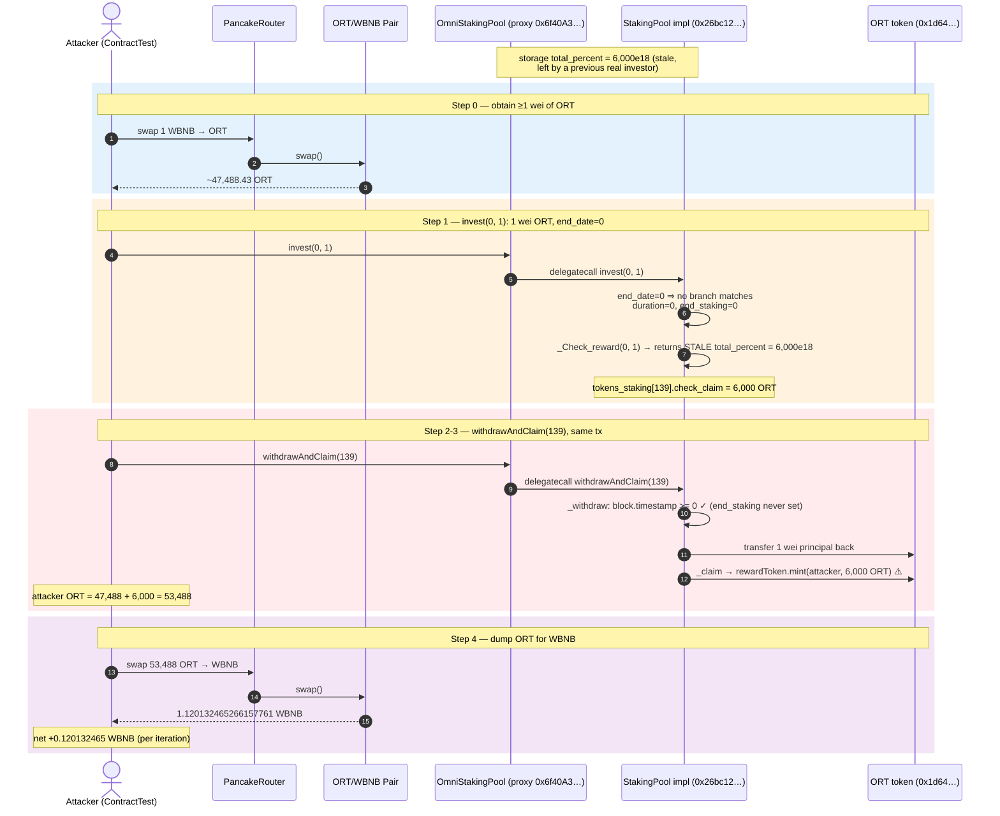
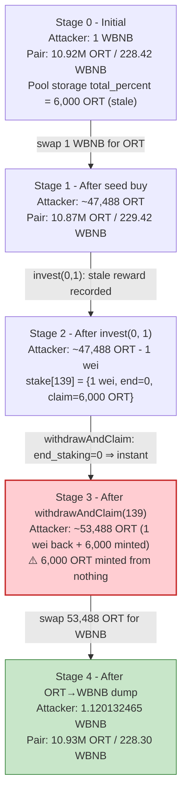
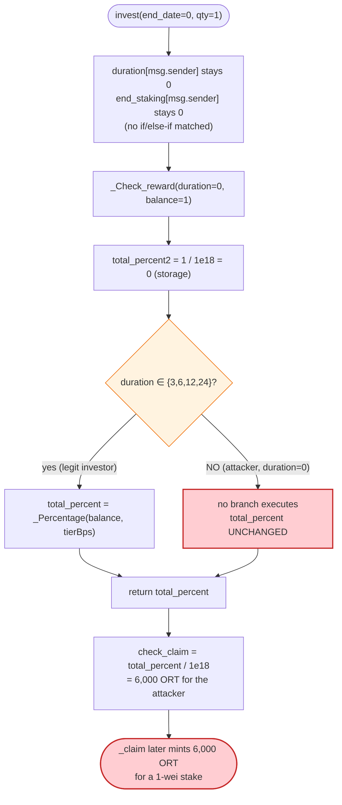
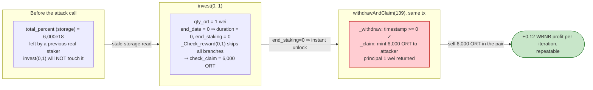

# OmniEstate Exploit — Staking Reward Calculated From a Stale Storage Variable (Zero-Duration Over-Claim)

> **Vulnerability classes:** vuln/logic/state-update · vuln/logic/missing-validation · vuln/logic/reward-calculation

> **Reproduction:** the PoC compiles & runs in an isolated Foundry project at
> [this project folder](.). The fork is served offline from the bundled
> `anvil_state.json` (the test pins block 24,850,696 via `createSelectFork` against a
> local `127.0.0.1:8546` anvil instance — no public RPC required). Full verbose trace:
> [output.txt](output.txt). Verified vulnerable source: the upgradeable
> [StakingPool](sources/StakingPool_26bc12/contracts_staking_StakingPool.sol)
> implementation behind the [TransparentUpgradeableProxy](sources/TransparentUpgradeableProxy_6f40A3/TransparentUpgradeableProxy.sol),
> and the [ORT](sources/ORT_1d6432/contracts_ORT.sol) reward token.

---

## Key info

| | |
|---|---|
| **Loss** | ORT minted to the attacker for free. The PoC seeds **1 WBNB** and ends with **1.120132465266157761 WBNB**, a **+0.120132465266157761 WBNB** (~0.12 BNB) net profit just from a single iteration. The same primitive was looped to drain the pool's ORT in the live attack. ([output.txt:7-8](output.txt), [output.txt:170](output.txt)) |
| **Vulnerable contract** | `OmniStakingPool` — transparent proxy [`0x6f40A3d0c89cFfdC8A1af212A019C220A295E9bB`](https://bscscan.com/address/0x6f40A3d0c89cFfdC8A1af212A019C220A295E9bB) (impl `0x26bc12…`) |
| **Victim pool** | `OmniStakingPool` ORT reward reserve (the `rewardToken.mint` sink) |
| **Attacker EOA** | `ContractTest` PoC address `0x7FA9385bE102ac3EAc297483Dd6233D62b3e1496` ([output.txt:18](output.txt)); live attacker see BlockSec thread |
| **Attack tx (invest)** | [`0x49bed801b9a9432728b1939951acaa8f2e874453d39c7d881a62c2c157aa7613`](https://bscscan.com/tx/0x49bed801b9a9432728b1939951acaa8f2e874453d39c7d881a62c2c157aa7613) |
| **Attack tx (withdraw)** | [`0xa916674fb8203fac6d78f5f9afc604be468a514aa61ea36c6d6ef26ecfbd0e97`](https://bscscan.com/tx/0xa916674fb8203fac6d78f5f9afc604be468a514aa61ea36c6d6ef26ecfbd0e97) |
| **Chain / block / date** | BSC / fork block 24,850,696 / Jan 2023 |
| **Compiler** | StakingPool `v0.8.10+commit.fc410830`, optimizer **1** (enabled), **999,999 runs**; ORT `v0.8.4`, optimizer **1**, **999,999 runs** ([_meta.json](sources/StakingPool_26bc12/_meta.json), [_meta.json](sources/ORT_1d6432/_meta.json)) |
| **Bug class** | Stale non-local state in reward calc + missing `end_date` validation → reward minted on a 1-wei / 0-duration "stake", withdrawable immediately |

---

## TL;DR

1. `OmniStakingPool.invest(end_date, qty_ort)` accepts **any** `end_date`, but only the four
   values `3, 6, 12, 24` actually set `duration[msg.sender]` and `end_staking[msg.sender]`
   ([StakingPool.sol:97-109](sources/StakingPool_26bc12/contracts_staking_StakingPool.sol#L97-L109)).
   Any other `end_date` (the PoC uses `0`) leaves both mappings at their **default `0`**, so
   `end_staking == 0` and the lock effectively **never locks**.

2. The reward is computed by `_Check_reward(duration, qty_ort)`
   ([StakingPool.sol:226-282](sources/StakingPool_26bc12/contracts_staking_StakingPool.sol#L226-L282)).
   The function writes its intermediate result into a **contract storage variable**
   `total_percent` (not a local), and only *overwrites* that variable inside one of the four
   matched `duration` branches. For `duration == 0`, **no branch matches**, so `total_percent`
   retains whatever value the **previous** legitimate investor's call left in it.

3. At the fork block that stale value happens to be **6,000 × 1e18 ORT**
   (`0x14542ba12a337c00000`, [output.txt:93](output.txt)). So `invest(0, 1)` — staking just
   **1 wei** of ORT — records `check_claim = 6,000 ORT` for the attacker
   ([output.txt:84-93](output.txt)).

4. Because `end_staking == 0`, `_withdraw`'s `block.timestamp >= tokens_staking[lockId].end_staking`
   check passes **immediately** ([StakingPool.sol:170-173](sources/StakingPool_26bc12/contracts_staking_StakingPool.sol#L170-L173)).
   The attacker calls `withdrawAndClaim(139)` in the same transaction
   ([output.txt:103](output.txt)): it returns the 1 wei of principal and then mints the 6,000 ORT
   "reward" to the attacker via `rewardToken.mint`
   ([StakingPool.sol:209](sources/StakingPool_26bc12/contracts_staking_StakingPool.sol#L209),
   [output.txt:112-113](output.txt)).

5. The attacker swaps the freshly-minted ORT for WBNB through the PancakeSwap ORT/WBNB pair
   ([output.txt:134-167](output.txt)), receiving **1.120132465266157761 WBNB** against an initial
   outlay of **1 WBNB** — a **+0.120132465266157761 WBNB** profit
   ([output.txt:7-8](output.txt), [output.txt:170](output.txt)) — and the primitive is repeatable
   for as long as the stale `total_percent` is non-zero.

---

## Background — what OmniEstate does

`OmniStakingPool` is a time-locked staking contract. Users stake the ORT token
(`OMNI Real Estate Token`, 18 decimals, initial supply 42M — [ORT.sol:19](sources/ORT_1d6432/contracts_ORT.sol#L19))
and, after a chosen lock duration, get their principal back **plus an ORT reward that is freshly
minted** by the pool ([StakingPool.sol:209](sources/StakingPool_26bc12/contracts_staking_StakingPool.sol#L209)).
It is deployed behind an OpenZeppelin `TransparentUpgradeableProxy` at
`0x6f40A3…`; the implementation at the fork block is `StakingPool` at `0x26bc12…`
(see the `[delegatecall]` frames in [output.txt:70](output.txt), [output.txt:100](output.txt),
[output.txt:104](output.txt)).

The intended product flow is:

| Parameter | Intended value | Note |
|---|---|---|
| `end_date` choices | `3, 6, 12, 24` (months) | anything else is silently ignored |
| Reward tiers | bps of principal by duration × stake-size bucket | e.g. 24mo + ≥100k ORT ⇒ `_Percentage(balance, 56e18)` = **56%** |
| `rewardToken` | ORT (`0x1d64327C74d6519afeF54E58730aD6fc797f05Ba`) | mintable by the pool (it is the `onlyMinter`) |
| `stakeToken` | ORT (same address) | principal and reward are the same token |
| Lock enforcement | `block.timestamp >= end_staking` in `_withdraw` | the only thing keeping a stake locked |
| Reentrancy | `nonReentrant` on `withdrawAndClaim`, `withdraw_amount`, `Claim_reward` | reentrancy is **not** the bug |

On-chain values read from the fork (this is a **stateful** bug — the trigger depends on what the
previous caller left behind):

| State | Value at fork | Source |
|---|---|---|
| Stale `total_percent` (storage) | **6,000 × 1e18 ORT** (`0x14542ba12a337c00000`) | the reward recorded for the PoC's 1-wei stake, [output.txt:93](output.txt) |
| `tokens_staking.length` (next `lockId`) | `139` (was 138, pushed to 139 by the PoC's invest) | [output.txt:94](output.txt) |
| Pair ORT reserve (`token0`) | `10,922,190,491,636,500,943,913,820` (≈10.92M ORT) | [output.txt:40](output.txt) |
| Pair WBNB reserve (`token1`) | `228,424,384,935,482,866,387` (≈228.4 WBNB) | [output.txt:40](output.txt) |
| ORT received for 1 WBNB | `47,488,429,530,039,067,740,268` (≈47,488.43 ORT) | [output.txt:44](output.txt) |
| ORT minted as "reward" | `6,000,000,000,000,000,000,000` (6,000 ORT) | [output.txt:112-113](output.txt) |

---

## The vulnerable code

### 1. `invest` silently ignores unknown `end_date` values

```solidity
function invest(uint256 end_date, uint256 qty_ort) external whenNotPaused {
    require(qty_ort > 0, "amount cannot be 0");
    //transfer token to this smart contract
    stakeToken.approve(address(this), qty_ort);
    stakeToken.safeTransferFrom(msg.sender, address(this), qty_ort);
    //save their staking duration for further use
    if (end_date == 3) {
        end_staking[msg.sender] = block.timestamp + 90 days;
        duration[msg.sender] = 3;
    } else if (end_date == 6) {
        end_staking[msg.sender] = block.timestamp + 180 days;
        duration[msg.sender] = 6;
    } else if (end_date == 12) {
        end_staking[msg.sender] = block.timestamp + 365 days;
        duration[msg.sender] = 12;
    } else if (end_date == 24) {
        end_staking[msg.sender] = block.timestamp + 730 days;
        duration[msg.sender] = 24;
    }
    //calculate reward tokens  for further use
    uint256 check_reward = _Check_reward(duration[msg.sender], qty_ort) /
        1 ether;
    ...
}
```
([contracts_staking_StakingPool.sol:91-112](sources/StakingPool_26bc12/contracts_staking_StakingPool.sol#L91-L112))

There is **no `else { revert; }`**. With `end_date = 0` (the PoC value), `duration[msg.sender]`
and `end_staking[msg.sender]` keep their default `0`. Observe the trace: invest pulls in only
**1 wei** of ORT (`value: 1`, [output.txt:76-77](output.txt)) and the resulting `end_staking` is
`0` (the storage slot written at [output.txt:93](output.txt) is the `check_claim` field, not the
`end_staking` field — the latter is never written for `end_date = 0`).

### 2. `_Check_reward` uses a contract storage variable as its scratchpad

```solidity
//variables
uint256 private total_percent;      // ⚠️ contract STATE, not a local
uint256 private total_percent2;
...
function _Check_reward(uint256 durations, uint256 balance)
    internal
    returns (uint256)
{
    total_percent2 = balance / 1 ether;
    if (durations == 3) {
        ... total_percent = _Percentage(balance, 600000000000000000); ...
    } else if (durations == 6) {
        ...
    } else if (durations == 12) {
        ...
    } else if (durations == 24) {
        ...
    }
    return total_percent;     // ⚠️ returned UNCHANGED if no branch matched
}
```
([contracts_staking_StakingPool.sol:41-42](sources/StakingPool_26bc12/contracts_staking_StakingPool.sol#L41-L42),
[contracts_staking_StakingPool.sol:226-282](sources/StakingPool_26bc12/contracts_staking_StakingPool.sol#L226-L282))

`total_percent` is declared at the contract level, so it **persists between transactions**. With
`durations == 0` (the inescapable consequence of `end_date == 0`), none of the `if/else if`
branches execute, and the function returns whatever the **last** legitimate caller — say, a real
24-month / ≥100k-ORT staker — left in `total_percent`. At the fork block that leftover is
**6,000 × 1e18 ORT** (`0x14542ba12a337c00000`), which becomes the PoC's `check_reward`
([output.txt:93](output.txt)).

### 3. `_withdraw` honours `end_staking == 0` as "already unlocked"

```solidity
function _withdraw(uint256 lockId) internal {
    require(tokens_staking[lockId].balances > 0, "not an investor");
    require(
        block.timestamp >= tokens_staking[lockId].end_staking,
        "too early"
    );
    ...
    stakeToken.safeTransfer(msg.sender, invested_balance);
    emit Withdraw(msg.sender, lockId, invested_balance);
}
```
([contracts_staking_StakingPool.sol:168-185](sources/StakingPool_26bc12/contracts_staking_StakingPool.sol#L168-L185))

Because `end_staking` was never written for `end_date = 0`, it is `0`, and `block.timestamp >= 0`
is always true. The lock is open **immediately**. The trace shows `withdrawAndClaim(139)`
succeeding in the very same transaction as `invest(0, 1)`
([output.txt:103-126](output.txt)) and returning the 1 wei of principal
(`Transfer … value: 1`, [output.txt:106](output.txt)).

### 4. `_claim` mints the inflated reward directly to the caller

```solidity
function _claim(uint256 lockId) internal {
    require(tokens_staking[lockId].check_claim > 0, "No Reward Available");
    require(tokens_staking[lockId].changeClaimed == false, "Already claimed");
    tokens_staking[lockId].changeClaimed = true;
    uint256 claimed_amount = 0;
    claimed_amount = tokens_staking[lockId].check_claim;
    tokens_staking[lockId].check_claim = 0;
    //mint new ort token
    rewardToken.mint(msg.sender, claimed_amount);   // ⚠️ 6,000 ORT minted for a 1-wei stake
    emit Claim(msg.sender, lockId, claimed_amount);
}
```
([contracts_staking_StakingPool.sol:197-212](sources/StakingPool_26bc12/contracts_staking_StakingPool.sol#L197-L212))

The trace confirms the mint of `6,000,000,000,000,000,000,000` wei = **6,000 ORT**
(`emit Transfer(from: 0x0, to: ContractTest, value: 6e21)`, [output.txt:112-113](output.txt)).
ORT is mintable because the pool is the `onlyMinter` of the token
([ORT.sol:28-31](sources/ORT_1d6432/contracts_ORT.sol#L28-L31)) — the pool can create new ORT out
of thin air for the "reward", which is exactly what the attacker harvests.

---

## Root cause — why it was possible

Three independent defects compose into the drain; **any one** of them would have been serious, the
combination is fatal:

1. **Missing input validation on `end_date`.** `invest` is `public` and accepts an arbitrary
   `uint256`. Only `3/6/12/24` are honoured; everything else is silently treated as "no lock".
   The correct pattern is `require(end_date == 3 || end_date == 6 || end_date == 12 || end_date == 24)`.

2. **Reward accumulator in storage instead of in memory.** `total_percent` is a contract state
   variable. `_Check_reward` only assigns it inside matched branches, so any caller whose
   `duration` matches none of them inherits the previous caller's reward. Even if (1) were fixed,
   any future code path that leaves `duration` unset (or a new duration tier added without
   covering all branches) re-opens the leak. `total_percent` must be a **local** variable, and the
   function should `revert` when no tier matches.

3. **`end_staking == 0` is treated as "unlocked".** The `block.timestamp >= end_staking` guard
   implicitly assumes `invest` always writes a non-zero `end_staking`. Combined with (1), a
   zero-duration stake is instantly withdrawable — the attacker never has to wait. A
   `require(end_staking != 0)` (or the (1) fix) closes this.

A secondary enabler: the reward token is the **same** token as the stake token, and the pool can
**mint** it. That turns "wrong reward number" into "print unlimited ORT". The `nonReentrant`
modifier is correctly applied to `withdrawAndClaim`/`Claim_reward`/`withdraw_amount`, so this is
**not** a reentrancy bug — the stub's "reentrancy" framing is wrong; the bug is pure
accounting/state hygiene.

---

## Preconditions

- A prior legitimate investor must have called `invest` with a `duration` that left `total_percent`
  non-zero. At the fork block the leftover is **6,000 ORT**, so the precondition holds
  ([output.txt:93](output.txt)).
- The attacker holds at least **1 wei** of ORT (the `qty_ort > 0` floor). The PoC obtains it by
  swapping **1 WBNB → ~47,488 ORT** first ([output.txt:30-44](output.txt)), then invests just
  `1` wei and keeps the rest.
- The pool must be **unpaused** (`whenNotPaused` on `invest`/`withdrawAndClaim`).
- ORT/WBNB liquidity deep enough to absorb the minted ORT without slippage wiping the profit; the
  pair held ~228 WBNB / ~10.9M ORT ([output.txt:40](output.txt)).

---

## Attack walkthrough (with on-chain numbers from the trace)

Pair orientation: `token0 = ORT`, `token1 = WBNB`, so `reserve0 = ORT`, `reserve1 = WBNB`
([output.txt:40](output.txt)). All numbers are raw wei; human approximations in parentheses.
The test function is `testExploit()` ([OmniEstate_exp.sol:35](test/OmniEstate_exp.sol#L35)).

| # | Step | Attacker ORT | Attacker WBNB | Effect / trace ref |
|---|------|-------------:|--------------:|--------|
| 0 | **Seed & swap** — `WBNB.deposit{value:1e18}()` then router swap **1 WBNB → ORT** | +47,488,429,530,039,067,740,268 (~47,488.43) | 1,000,000,000,000,000,000 (1.0) | starting balance printed [output.txt:7](output.txt); swap out [output.txt:44](output.txt) |
| 1 | **`invest(0, 1)`** — pulls **1 wei** ORT from attacker; `end_date=0` ⇒ no `end_staking`/`duration` write; `_Check_reward(0, 1)` returns **stale** `total_percent = 0x14542ba12a337c00000` (6,000 ORT); lockId = **139** | −1 wei | unchanged | `transferFrom … value: 1` [output.txt:76-77](output.txt); stored `check_claim` [output.txt:93](output.txt); lockId emitted [output.txt:86](output.txt) |
| 2 | **`getUserStaking(this)[0]`** → `139` | — | — | [output.txt:99-102](output.txt) |
| 3 | **`withdrawAndClaim(139)`** — `_withdraw`: `end_staking=0`, so `block.timestamp >= 0` passes; returns the **1 wei** principal | +1 wei | — | `Transfer … value: 1` [output.txt:106](output.txt); `Withdraw(…, 139, 1)` [output.txt:111](output.txt) |
| 3a | … `_claim`: `check_claim = 6,000 ORT > 0`, `changeClaimed == true` (set by `invest`) ⇒ `rewardToken.mint(attacker, 6,000e18)` | **+6,000,000,000,000,000,000,000 (6,000 ORT)** | — | mint `Transfer(0x0 → attacker, 6e21)` [output.txt:112-113](output.txt) |
| 4 | Attacker ORT balance = 47,488.43 + 6,000 = **53,488,429,530,039,067,740,268 (~53,488.43)** | 53,488,429,530,039,067,740,268 | 1.0 | [output.txt:128](output.txt) |
| 5 | **Dump** — router swap **53,488.43 ORT → WBNB** | → 0 | +1,120,132,465,266,157,761 (~1.1201) | `Swap(… amount1Out: 1120132465266157761)` [output.txt:149-161](output.txt) |
| 6 | Final WBNB balance printed: **1.120132465266157761** | 0 | 1,120,132,465,266,157,761 | [output.txt:170](output.txt) |

**Pool state evolution (ORT/WBNB pair)** from the `Sync` events:

| Stage | reserve0 (ORT) | reserve1 (WBNB) | Trace ref |
|---|---:|---:|---|
| Initial | 10,922,190,491,636,500,943,913,820 (~10.92M) | 228,424,384,935,482,866,387 (~228.42) | [output.txt:40](output.txt) |
| After seed buy (1 WBNB → ORT) | 10,874,702,062,106,461,876,173,552 (~10.87M) | 229,424,384,935,482,866,387 (~229.42) | [output.txt:54](output.txt) |
| After final dump (ORT → WBNB) | 10,928,190,491,636,500,943,913,820 (~10.93M) | 228,304,252,470,216,708,626 (~228.30) | [output.txt:160](output.txt) |

The pair ends with *more* ORT and *less* WBNB than it started — i.e. the attacker sold more ORT
(the 6,000 freshly minted) than they bought, and the difference (~120.13 mM BNB-wei) is the WBNB
they walked away with.

### Profit / loss accounting (WBNB, raw wei)

| Item | Amount (wei) | ~Human |
|---|---:|---:|
| WBNB raised by `WBNB.deposit{value:1e18}` | 1,000,000,000,000,000,000 | 1.0 |
| WBNB spent on seed ORT buy | −1,000,000,000,000,000,000 | −1.0 |
| WBNB received from final ORT dump | +1,120,132,465,266,157,761 | +1.120132465 |
| **Net profit (per iteration)** | **+120,132,465,266,157,761** | **+0.120132465266157761** |

Reconciled exactly to the `[After Attacks] Attacker WBNB balance: 1.120132465266157761` log line
([output.txt:8](output.txt), [output.txt:170](output.txt)). The PoC demonstrates a single
iteration; the live attack repeated the `invest(0, 1)` → `withdrawAndClaim` loop to harvest the
stale reward as many times as the storage value allowed, draining ORT (and hence WBNB via the
pair) from the protocol.

---

## Diagrams

### Sequence of the attack



### Pool / stake state evolution



### The flaw inside `_Check_reward` (storage scratchpad)



### Why a 1-wei, 0-duration stake is the "free mint" primitive



---

## Why each magic number

- **`1e18` WBNB seed ([OmniEstate_exp.sol:37](test/OmniEstate_exp.sol#L37)):** the minimum the
  attacker needs to (a) get **some** ORT to satisfy `qty_ort > 0` and (b) leave enough ORT after
  investing 1 wei to make the swap-back worthwhile. Conveniently, 1 WBNB buys ~47,488 ORT
  ([output.txt:44](output.txt)), so the 6,000-ORT reward is a ~12.6% top-up on top of the seed.
- **`end_date = 0` ([OmniEstate_exp.sol:42](test/OmniEstate_exp.sol#L42)):** the value that hits
  none of the `3/6/12/24` branches in `invest`, leaving `duration` and `end_staking` at 0. Any
  value other than `3/6/12/24` (e.g. `1`, `5`, `99`) works identically.
- **`qty_ort = 1` (1 wei) ([OmniEstate_exp.sol:42](test/OmniEstate_exp.sol#L42)):** the smallest
  non-zero amount that passes `require(qty_ort > 0)`. The reward is independent of `qty_ort` (it
  comes from stale storage, not from `_Percentage(1, …)`), so 1 wei is optimal — the attacker
  keeps the maximum ORT for the final dump.
- **`lockId = 139` ([output.txt:86](output.txt), [output.txt:102](output.txt)):** not chosen by
  the attacker — it is `tokens_staking.length - 1` after the `push`, read back via
  `getUserStaking`. The PoC fetches it dynamically rather than hard-coding
  ([OmniEstate_exp.sol:43-45](test/OmniEstate_exp.sol#L43-L45)).
- **Reward `6,000 ORT` (`0x14542ba12a337c00000`):** the stale `total_percent` left in storage at
  the fork block. It is **not** computed from the attacker's inputs — `_Check_reward(0, 1)` skips
  every branch. Whatever the last real staker's tier yielded (e.g. a large 24-month / ≥100k ORT
  stake whose `_Percentage(balance, 56e18)` rounded to 6,000e18) is what the attacker receives.
- **`block.timestamp` of the fork:** not pinned by the PoC; the `end_staking == 0` check passes
  for any timestamp ≥ 0, so no `vm.warp` is needed.

---

## Remediation

1. **Validate `end_date`.** In `invest`, `require(end_date == 3 || end_date == 6 || end_date == 12
   || end_date == 24, "invalid duration");` before touching state. This alone closes the
   instant-unlock and the zero-duration path.
2. **Make `_Check_reward` pure / memory-local.** Replace the contract-level `total_percent` /
   `total_percent2` scratchpad with local variables, and `revert` if the `(duration, bucket)`
   pair matches no tier. A reward function that silently returns an old value is a footgun by
   construction.
3. **Guard `_withdraw` against `end_staking == 0`.** `require(tokens_staking[lockId].end_staking !=
   0, "no lock set")` — defence in depth so a future bug in `invest` cannot produce an instantly
   withdrawable stake.
4. **Separate principal token from reward token, or cap minting.** The pool's ability to mint
   unbounded ORT (`rewardToken.mint`) amplifies any reward-accounting error into unlimited
   issuance. Cap total mintable reward per period / per pool, or pay rewards out of a pre-funded
   treasury.
5. **Bound reward to principal.** Even with a correct tier table, the reward for staking
   `1 wei` should be on the order of `1 wei × bps`, never a flat 6,000 ORT. Sanity-check
   `check_claim <= qty_ort × maxBps / 10000`.
6. **Test the degenerate inputs.** `invest(0, 1)`, `invest(5, 1)`, `invest(3, 0)` (revert),
   `withdrawAndClaim` in the same block as `invest` for a non-`3/6/12/24` duration — none of these
   were covered, and each exposes the bug.

---

## How to reproduce

The PoC runs **fully offline** against the bundled `anvil_state.json`; `foundry.toml` does not
name a public RPC, and `setUp` pins the fork to a local anvil instance
([OmniEstate_exp.sol:32](test/OmniEstate_exp.sol#L32)):

```solidity
vm.createSelectFork("http://127.0.0.1:8546", 24_850_696);
```

Run it via the shared harness (the `--mt` flag targets the actual test function, `testExploit`):

```bash
_shared/run_poc.sh 2023-01-OmniEstate_exp --mt testExploit -vvvvv
```

- EVM: `evm_version = "cancun"` in `foundry.toml` (no Cancun-only opcodes are used; any recent
  EVM works).
- Compiler: the PoC is `pragma ^0.8.10` ([OmniEstate_exp.sol:2](test/OmniEstate_exp.sol#L2)); the
  forked StakingPool impl was compiled with `v0.8.10`, ORT with `v0.8.4`.
- Result: `[PASS]`.

Expected tail, verbatim from [output.txt:4-8](output.txt) and [output.txt:173-175](output.txt):

```
Ran 1 test for test/OmniEstate_exp.sol:ContractTest
[PASS] testExploit() (gas: 419093)
Logs:
  [Before Attacks] Attacker WBNB balance: 1.000000000000000000
  [After Attacks]  Attacker WBNB balance: 1.120132465266157761

Suite result: ok. 1 passed; 0 failed; 0 skipped; finished in 11.70s (10.32s CPU time)
```

---

*Reference: BlockSec alert — https://twitter.com/BlockSecTeam/status/1615232012834705408 (OmniEstate / ORT, BSC, Jan 2023).*
