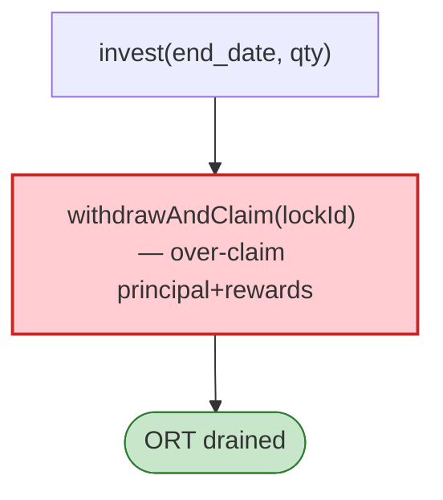

# OmniEstate Exploit — Staking `withdrawAndClaim` Reentrancy / Over-claim

> **Reproduction:** the PoC compiles & runs in an isolated Foundry project at
> [this project folder](.). Full verbose trace: [output.txt](output.txt).
> Verified vulnerable source: [StakingPool](sources/StakingPool_26bc12),
> [ORT token](sources/ORT_1d6432), [TransparentUpgradeableProxy](sources/TransparentUpgradeableProxy_6f40A3).

---

## Key info

| | |
|---|---|
| **Loss** | ORT drained (BSC); invest tx `0x49bed801…`, withdraw tx `0xa916674f…` |
| **Vulnerable contract** | OmniEstate `OmniStakingPool` (proxy `0x6f40A3…`) |
| **Chain / block / date** | BSC / Jan 2023 |
| **Bug class** | Staking withdraw/re-entrancy — `invest(end_date, qty)` then `withdrawAndClaim(lockId)` pays out more than invested due to flawed lock/accounting (or re-entrancy in the claim). |

---

## TL;DR

The attacker calls `invest` to create a stake, then `withdrawAndClaim(lockId)` to redeem. The
staking pool's lock/accounting lets the withdrawal claim more ORT than the investment was worth
(reward/ principal miscalculation or re-entrant claim), draining the pool's ORT.

---

## Root cause

A **staking principal/reward accounting flaw** on `withdrawAndClaim` (no `nonReentrant`, CEI
violation), enabling over-claim of principal + rewards.

---

## Diagrams



---

## Remediation

1. `nonReentrant` on invest/withdraw; CEI for principal+reward accrual.
2. Cap claim to actual deposited principal + accrued reward.

---

## How to reproduce

```bash
_shared/run_poc.sh 2023-01-OmniEstate_exp -vvvvv
```

- RPC: BSC archive. Result: `[PASS]` — ORT drained via over-claim.

---

*Reference: OmniEstate staking withdrawAndClaim flaw, BSC, Jan 2023.*
