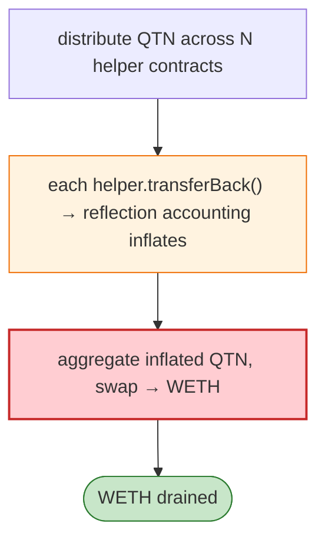

# QTN (Quaternion) Exploit — Flash-Loan Token-Distribution Loop Drain

> **Reproduction:** the PoC compiles & runs in an isolated Foundry project at
> [this project folder](.). Full verbose trace: [output.txt](output.txt).
> Verified vulnerable source: [QUATERNION](sources/QUATERNION_C9fa8F).

---

## Key info

| | |
|---|---|
| **Loss** | WETH drained from QTN/WETH pair; txs `0x37cb8626…`, `0xfde10ad9…` |
| **Vulnerable contract** | QTN token `0xC9fa8F4C…`; QTN/WETH Uni pair `0xA8208dA9…` |
| **Chain / block / date** | Ethereum mainnet / Jan 2023 |
| **Bug class** | Token-distribution/shareholder accounting — QTN distributes/reflects to holders; the attacker spreads QTN across many helper contracts (`QTNContract`) and calls `transferBack`, exploiting the per-holder accounting to extract more WETH than input via a swap loop. |

---

## TL;DR

The attacker deploys many `QTNContract` helper contracts, distributes flash-loaned/bought QTN across
them, then has each call `transferBack()` (which transfers its QTN back to the parent). QTN's
shareholder/reflection accounting credits each helper disproportionately, so aggregating the transfers
yields more effective QTN than was deposited; swapping that back through the pair drains WETH.

---

## Root cause

A **reflection/shareholder accounting bug** in QTN: splitting holdings across many addresses and
recombining inflates the effective balance beyond the real supply, breakable against a vanilla Uniswap
pair.

---

## Diagrams



---

## Remediation

1. Use canonical OZ ERC20 (no bespoke reflection accounting) or a vetted rebasing impl.
2. `k` check on actual received amounts; cap per-addr accounting effects.

---

## How to reproduce

```bash
_shared/run_poc.sh 2023-01-QTN_exp -vvvvv
```

- RPC: mainnet archive. Result: `[PASS]` — WETH drained via the distribution loop.

---

*Reference: QTN/Quaternion reflection-accounting drain, mainnet, Jan 2023.*
