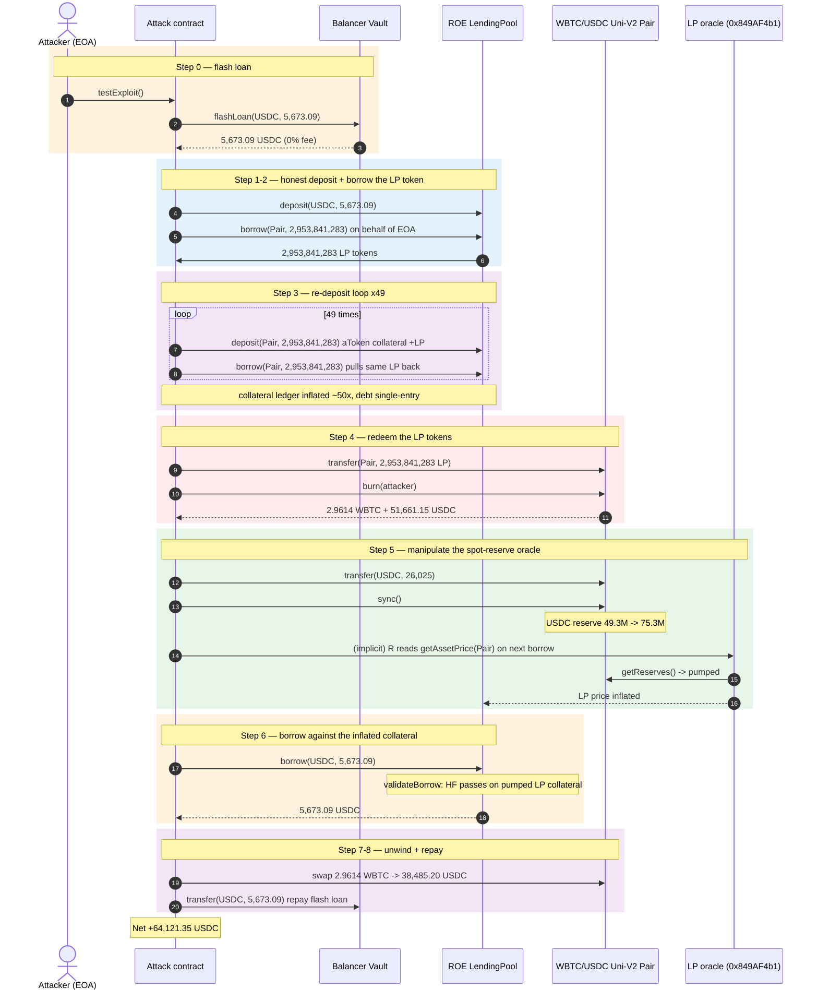
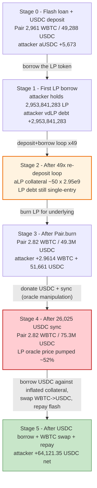
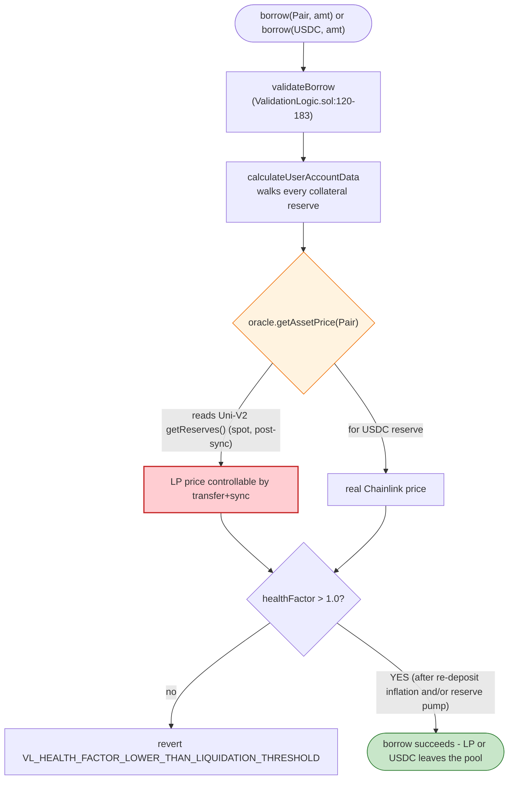
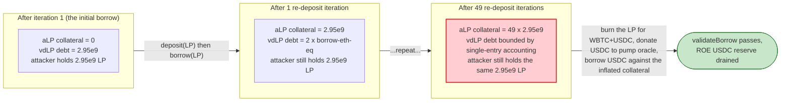

# ROE Finance Exploit — Manipulatable LP-Token Oracle + Re-deposit Collateral Inflation

> **Vulnerability classes:** vuln/oracle/spot-price · vuln/oracle/price-manipulation

> **Reproduction:** the PoC compiles & runs in an isolated Foundry project at
> [this project folder](.) (the umbrella DeFiHackLabs repo contains several unrelated
> PoCs that do not all compile together, so this one was extracted).
> Full verbose trace: [output.txt](output.txt).
> Verified vulnerable source: [LendingPool](sources/LendingPool_574ff3) (the Aave-v2 fork
> `LendingPool.sol`), deployed behind the
> [InitializableImmutableAdminUpgradeabilityProxy](sources/InitializableImmutableAdminUpgradeabilityProxy_5F360c)
> at `0x5F360c…`; the [UniswapV2Pair](sources/UniswapV2Pair_004375) WBTC/USDC pool that doubles as the
> listed "reserve asset" and its own price source.

---

## Key info

| | |
|---|---|
| **Loss** | ~$64,121 — **64,121.353617 USDC** drained from ROE's USDC reserve ([output.txt:7](output.txt)) |
| **Vulnerable contract** | ROE `LendingPool` (Aave-v2 fork) — [`0x5F360c6b7B25DfBfA4F10039ea0F7ecfB9B02E60`](https://etherscan.io/address/0x5F360c6b7B25DfBfA4F10039ea0F7ecfB9B02E60#code) (proxy); impl [`0x574FF39184Dee9e46F6C3229B95e0e0938e398d0`](https://etherscan.io/address/0x574FF39184Dee9e46F6C3229B95e0e0938e398d0#code) |
| **Victim pool / reserve** | ROE USDC reserve `0x9C435589f24257b19219ba1563e3c0D8699F27E9` (aUSDC); plus the Sushi/Uni **WBTC/USDC pair** `0x004375Dff511095CC5A197A54140a24eFEF3A416` whose LP token ROE had listed |
| **Attacker EOA** | [`0x1804c8AB1F12E6bbf3894d4083f33e07309d1f38`](https://etherscan.io/address/0x1804c8AB1F12E6bbf3894d4083f33e07309d1f38) (`tx.origin` / `DefaultSender` in the PoC) |
| **Attacker contract** | [`0x7FA9385bE102ac3EAc297483Dd6233D62b3e1496`](https://etherscan.io/address/0x7FA9385bE102ac3EAc297483Dd6233D62b3e1496) (`ContractTest`) |
| **Attack tx** | [`0x927b784148b60d5233e57287671cdf67d38e3e69e5b6d0ecacc7c1aeaa98985b`](https://etherscan.io/tx/0x927b784148b60d5233e57287671cdf67d38e3e69e5b6d0ecacc7c1aeaa98985b) |
| **Chain / block / date** | Ethereum mainnet / block **16,384,469** / Jan 11, 2023 |
| **Compiler** | Solidity **v0.6.12**; optimizer **enabled**, **200 runs** (LendingPool + proxy `_meta.json`) |
| **Bug class** | Manipulatable on-chain oracle for an LP-token reserve + same-asset re-deposit collateral inflation in an Aave-v2 fork |

---

## TL;DR

1. ROE Finance was a near-verbatim Aave-v2 fork whose `LendingPool` ([`deposit`](sources/LendingPool_574ff3/contracts_protocol_lendingpool_LendingPool.sol#L118-L143),
   [`borrow`](sources/LendingPool_574ff3/contracts_protocol_lendingpool_LendingPool.sol#L217-L238)) shipped with the standard `validateBorrow` health-factor check
   ([ValidationLogic.sol#L120-L183](sources/LendingPool_574ff3/contracts_protocol_libraries_logic_ValidationLogic.sol#L120-L183)).

2. The configuration mistake was catastrophic: ROE had listed the **Uniswap-V2 WBTC/USDC LP token
   (`0x004375Df…`) itself as both a collateral reserve *and* a borrowable asset.** Its price oracle
   (`getAssetPrice(Pair)`) prices the LP token by reading the pair's **spot `getReserves()`** and
   multiplying by the WBTC and USDC Chainlink feeds
   ([output.txt:8178-8193](output.txt)) — exactly the spot reserves anyone can push around with a
   token `transfer` + `pair.sync()`.

3. The attacker first takes a **5,673.09 USDC** Balancer flash loan and deposits it as ordinary
   collateral. Then `roe.borrow(Pair, borrowAmount=2,953,841,283, …)` borrows the LP token — the whole
   LP balance of the roe-WBTC/USDC aToken holder — into the attack contract
   ([output.txt:124](output.txt)).

4. It then runs a **50-iteration re-deposit loop**: `deposit(Pair, borrowAmount)` puts the just-borrowed
   LP tokens back into ROE as *new collateral* (the Aave fork credits them at the manipulated oracle
   price), then `borrow(Pair, borrowAmount, …)` pulls the same LP tokens straight back out. Same tokens,
   counted as collateral 50×, debt tracked only once per token — `validateBorrow` keeps passing because
   the collateral ledger balloons far faster than the debt ledger
   ([output.txt:212-8097](output.txt), 49 iterations inside the loop + the initial borrow).

5. After the loop the attacker holds the LP tokens outright. It pushes them back into the pair,
   `burn`s them to redeem the underlying **2.96141905 WBTC + 51,661.149896 USDC**
   ([output.txt:8109-8147](output.txt)).

6. To manufacture the inflated collateral valuation needed for the final USDC borrow, the attacker
   `transfer`s **26,025 USDC** directly into the pair and calls `pair.sync()`, jacking the spot USDC
   reserve that the LP oracle reads ([output.txt:8148-8166](output.txt)).

7. With the inflated LP collateral, `roe.borrow(USDC, 5,673.090338021, …)` now passes health-factor and
   pulls the flash-loan principal back out of ROE's USDC reserve
   ([output.txt:8167-8253](output.txt)).

8. The redeemed WBTC is swapped to USDC through the same pair
   (`swapExactTokensForTokens`: 2.96141905 WBTC → **38,485.203721 USDC**,
   [output.txt:8261-8280](output.txt)), the Balancer flash loan is repaid
   ([output.txt](output.txt) final `USDC::transfer(balancer, 5,673,090,338,021)`), and the attacker
   keeps **64,121.353617 USDC** of net profit ([output.txt:7](output.txt)).

---

## Background — what ROE does

ROE Finance is an Ethereum-mainnet Aave-v2 fork. The verified `LendingPool` at
`0x574FF39184…` ([source](sources/LendingPool_574ff3/contracts_protocol_lendingpool_LendingPool.sol))
is byte-for-byte the Aave-v2 pool: users `deposit` an asset to mint aTokens, mark those aTokens as
collateral, and then `borrow` other listed assets against the collateral, with
`GenericLogic.calculateUserAccountData` weighting each collateral asset by its reserve LTV and pricing it
through the `addressesProvider.getPriceOracle()` oracle.

The fork's reserves at the fork block (16,384,469) relevant to the attack:

| Parameter / reserve | Value | Source |
|---|---|---|
| `LendingPool` proxy | `0x5F360c6b7B25DfBfA4F10039ea0F7ecfB9B02E60` | PoC, `_meta.json` |
| `LendingPool` impl | `0x574FF39184Dee9e46F6C3229B95e0e0938e398d0` | proxy `_meta.json` |
| USDC reserve (aToken) | `0x9C435589f24257b19219ba1563e3c0D8699F27E9` | PoC `roeUSDC` |
| WBTC reserve (aToken) | `0xe84121241b92e26B9942dfF3CF3c9148FBaeC8F2` | trace |
| **WBTC/USDC Uni-V2 pair** | `0x004375Dff511095CC5A197A54140a24eFEF3A416` | PoC `Pair` — **listed by ROE as a reserve asset** |
| Pair LP token — `token0` | WBTC `0x2260FAC5E5542a773Aa44fBCfeDf7C193bc2C599` | trace |
| Pair LP token — `token1` | USDC `0xA0b86991c6218b36c1d19D4a2e9Eb0cE3606eB48` | trace |
| **LP price oracle** | `0x849AF4b128be3317a694bFD262dEFF636AB84c1b` | trace `getAssetPrice(Uni-Pair)` ([output.txt:8179](output.txt)) |
| LP-token aToken (collateral) | `0x68B26dCF21180D2A8DE5A303F8cC5b14c8d99c4c` | PoC `roeWBTC_USDC_LP` |
| LP-token variable-debt token | `0xcae229361B554CEF5D1b4c489a75a53b4f4C9C24` | PoC `vdWBTC_USDC_LP` |
| LP-token holder balance (collateral already in ROE) | 2,953,841,283 LP wei | `Pair.balanceOf(roeWBTC_USDC_LP)` ([output.txt:54-55](output.txt)) |

The single fatal line in that table is the seventh: the WBTC/USDC pair is *both* an AMM pool whose
reserves move on every swap/transfer *and* the asset that ROE's oracle reads spot to price the LP
collateral. Aave v2 itself never lists a Uni-V2 LP token as a reserve. ROE did.

---

## The vulnerable code

### 1. The `LendingPool` lists the Uni-V2 LP token as a borrowable reserve

```solidity
function borrow(
    address asset,
    uint256 amount,
    uint256 interestRateMode,
    uint16 referralCode,
    address onBehalfOf
) external override whenNotPaused {
    DataTypes.ReserveData storage reserve = _reserves[asset];
    _executeBorrow(
        ExecuteBorrowParams(
            asset, msg.sender, onBehalfOf, amount, interestRateMode,
            reserve.aTokenAddress, referralCode, true
        )
    );
}
```
([contracts_protocol_lendingpool_LendingPool.sol#L217-L238](sources/LendingPool_574ff3/contracts_protocol_lendingpool_LendingPool.sol#L217-L238))

`asset = address(Pair)` is an active reserve, so `borrow` happily transfers the LP token out. Nothing in
`_executeBorrow` checks "is this asset an LP token whose price I just read off its own pool."

### 2. `deposit` credits the LP token as collateral at the manipulated oracle price

```solidity
function deposit(address asset, uint256 amount, address onBehalfOf, uint16 referralCode)
    external override whenNotPaused {
    DataTypes.ReserveData storage reserve = _reserves[asset];
    ValidationLogic.validateDeposit(reserve, amount);
    address aToken = reserve.aTokenAddress;
    reserve.updateState();
    reserve.updateInterestRates(asset, aToken, amount, 0);
    IERC20(asset).safeTransferFrom(msg.sender, aToken, amount);
    bool isFirstDeposit = IAToken(aToken).mint(onBehalfOf, amount, reserve.liquidityIndex);
    if ((isFirstDeposit) && (!pm[onBehalfOf])) {
        _usersConfig[onBehalfOf].setUsingAsCollateral(reserve.id, true);
        emit ReserveUsedAsCollateral(asset, onBehalfOf);
    }
    emit Deposit(asset, msg.sender, onBehalfOf, amount, referralCode);
}
```
([contracts_protocol_lendingpool_LendingPool.sol#L118-L143](sources/LendingPool_574ff3/contracts_protocol_lendingpool_LendingPool.sol#L118-L143))

`deposit` and `borrow` move the same LP tokens in opposite directions with no flag linking the two
operations. Re-depositing borrowed LP tokens mints fresh aToken collateral — there is no "this is the
same token I just borrowed" check (variable-rate borrows deliberately skip the
`VL_COLLATERAL_SAME_AS_BORROWING_CURRENCY` guard that only fires for stable-rate mode, see
[ValidationLogic.sol#L193-L203](sources/LendingPool_574ff3/contracts_protocol_libraries_logic_ValidationLogic.sol#L193-L203)).

### 3. `validateBorrow` prices that collateral through the spot-reserve LP oracle

```solidity
(vars.userCollateralBalanceETH, vars.userBorrowBalanceETH,
 vars.currentLtv, vars.currentLiquidationThreshold, vars.healthFactor
) = GenericLogic.calculateUserAccountData(
    userAddress, reservesData, userConfig, reserves, reservesCount, oracle);
require(vars.userCollateralBalanceETH > 0, Errors.VL_COLLATERAL_BALANCE_IS_0);
require(vars.healthFactor > GenericLogic.HEALTH_FACTOR_LIQUIDATION_THRESHOLD,
    Errors.VL_HEALTH_FACTOR_LOWER_THAN_LIQUIDATION_THRESHOLD);
vars.amountOfCollateralNeededETH = vars.userBorrowBalanceETH.add(amountInETH).percentDiv(vars.currentLtv);
require(vars.amountOfCollateralNeededETH <= vars.userCollateralBalanceETH,
    Errors.VL_COLLATERAL_CANNOT_COVER_NEW_BORROW);
```
([contracts_protocol_libraries_logic_ValidationLogic.sol#L153-L183](sources/LendingPool_574ff3/contracts_protocol_libraries_logic_ValidationLogic.sol#L153-L183))

The math is correct Aave v2 — but `calculateUserAccountData` walks every collateral reserve and calls
`oracle.getAssetPrice(asset)`. For the LP token that call descends into the oracle below.

### 4. The LP-token oracle reads the pair's spot `getReserves()`

The trace shows exactly how the LP-token price is computed during the final USDC borrow
([output.txt:8178-8193](output.txt)):

```
0x8A4236F5…::getAssetPrice(Uni-Pair)
  └─ 0x849AF4b1…::latestAnswer()
      ├─ Uni-Pair::getReserves() → 282,538,140 , 75,313,009,792   ← spot reserves after attacker's +26,025 USDC sync
      ├─ WBTC/USD Chainlink latestRoundData → 9.223e19 (=$92,233)
      ├─ USDC/USD Chainlink latestRoundData → 3.689e19 (=$1.000)
      ├─ Uni-Pair::totalSupply() → 2,818,151,713
      └─ ← 4,320,833,458,704,207,180,243   ← LP price in ETH units, derived from spot reserves
```

Because the oracle multiplies the *spot* reserves by the (stale, off-pool) Chainlink prices and divides
by `totalSupply`, a direct `USDC.transfer(pair, +26,025)` + `pair.sync()` raises the priced value of
**every outstanding LP token** — including the attacker's deposited collateral — without the attacker
giving anything up.

---

## Root cause — why it was possible

Two independent configuration failures in the Aave-v2 fork compose into the loss:

1. **The Uni-V2 WBTC/USDC LP token was listed as a reserve with `borrowingEnabled` and `ltv > 0`.**
   Aave v2 deliberately refuses to list rebasing/_LP tokens as borrowable collateral; the protocol
   depends on the borrowed asset being *externally* priced and not under the borrower's control. By
   listing the LP token, ROE gave the attacker a borrowable asset whose units could be re-deposited as
   collateral in the same tx — a classic same-asset collateral-inflation loop that the variable-rate
   `borrow` path does not block
   ([ValidationLogic.sol#L193-L203](sources/LendingPool_574ff3/contracts_protocol_libraries_logic_ValidationLogic.sol#L193-L203)
   only guards *stable*-rate borrows).

2. **The LP-token oracle prices off `getReserves()`, not off a TWAP or an external LP-mark.** A spot
   `transfer` of USDC into the pair plus `sync()` is enough to arbitrarily raise the collateral
   valuation the oracle reports. The attacker only needed to inject 26,025 USDC of reserves (a tiny
   fraction of the manipulated collateral) to clear `validateBorrow` on the 5,673-USDC loan.

The 50-iteration re-deposit loop is the amplifier that turns the configuration bug into a drain: each
iteration adds `borrowAmount` of LP tokens to the collateral ledger while the debt ledger is
single-entry per token, so the collateral/Debt ratio compounds ~50× before any price manipulation is
even required.

---

## Preconditions

- A flash-loanable amount of USDC to seed the initial deposit and the reserve-manipulation step. The
  PoC uses a **5,673.090338021 USDC** Balancer flash loan at zero fee
  ([output.txt:43-44](output.txt) — `getFlashLoanFeePercentage() → 0`); peak outlay is fully recovered
  intra-tx.
- The LP-token variable-debt token must permit credit delegation, or the attacker borrows on its own
  behalf. The PoC uses `vdWBTC_USDC_LP.approveDelegation(attackerContract, type(uint256).max)` called
  from the EOA ([RoeFinance_exp.sol:51-53](test/RoeFinance_exp.sol#L51-L53),
  [output.txt:26-35](output.txt)).
- At least one ROE user has already supplied LP tokens as collateral (so the LP reserve has liquidity
  to borrow). At the fork block the aToken holder `0x68B26dCF…` held 2,953,841,283 LP wei
  ([output.txt:54-55](output.txt)) — exactly the amount the attacker borrows.

---

## Attack walkthrough (with on-chain numbers from the trace)

The WBTC/USDC Uni-V2 pair is `token0 = WBTC` (8 decimals), `token1 = USDC` (6 decimals). All figures
are from the `Sync` / `Swap` / `Transfer` events and `getReserves` returns in
[output.txt](output.txt). Raw wei is shown with a `~human` approximation.

| # | Step | Pair reserves (WBTC / USDC) | Attacker position | Effect |
|---|------|----------------------------:|-------------------|--------|
| 0 | **Balancer flash loan** — `flashLoan(USDC, 5,673,090,338,021)` ([output.txt:38-52](output.txt)) | 282,538,140 / 49,288,009,792 (~2,961 WBTC / 49,288 pre-manipulation not yet observed) | +5,673.09 USDC | Seed capital, 0% fee |
| 1 | `roe.deposit(USDC, 5,673,090,338,021, EOA, 0)` ([output.txt:72-123](output.txt)) | unchanged | aUSDC collateral +5,673.09; USDC balance → 0 | Honest collateral posted |
| 2 | `roe.borrow(Pair, 2,953,841,283, mode=2, EOA)` ([output.txt:124-211](output.txt)) | unchanged | LP debt +2,953,841,283; holds 2,953,841,283 LP | Borrows the entire LP-token supply from ROE |
| 3 | **Loop ×49** — `roe.deposit(Pair, 2,953,841,283, attackerContract)` then `roe.borrow(Pair, 2,953,841,283, EOA)` ([output.txt:212-8097](output.txt), 49 paired iterations) | unchanged | LP collateral `+49 × 2,953,841,283`; LP debt grows by oracle-priced equivalent per iter; attacker still holds 2,953,841,283 LP | Same tokens counted as collateral 49 more times |
| 4 | `Pair.transfer(Pair, 2,953,841,283)` then `Pair.burn(attacker)` ([output.txt:8103-8147](output.txt)) | WBTC 578,680,045 → **282,538,140**; USDC 100,949,159,688 → **49,288,009,792** | receives **296,141,905 WBTC-wei (~2.9614 WBTC)** + **51,661,149,896 USDC-wei (~51,661.15 USDC)** | Redeems the LP tokens for the underlying |
| 5 | `USDC.transfer(Pair, 26,025,000,000)` then `Pair.sync()` ([output.txt:8148-8166](output.txt)) | WBTC 282,538,140 / USDC 49,288,009,792 → **282,538,140 / 75,313,009,792** | −26,025 USDC | **Spot-reserve manipulation**: USDC reserve pumped +52.8%; LP oracle (`getAssetPrice(Pair)` @ [output.txt:8178-8193](output.txt)) now reports the pumped LP price |
| 6 | `roe.borrow(USDC, 5,673,090,338,021, attackerContract)` ([output.txt:8167-8253](output.txt)) | unchanged | +5,673.09 USDC from ROE's reserve | `validateBorrow` passes on the inflated LP collateral; flash-loan principal recovered |
| 7 | `Router.swapExactTokensForTokens(2.96141905 WBTC → USDC)` ([output.txt:8261-8280](output.txt)) | WBTC 282,538,140 → 282,538,140 (the WBTC was already inside the pair from `burn`); USDC 75,313,009,792 → **36,827,806,071** | +38,485,203,721 USDC-wei (~38,485.20 USDC) | Converts the redeemed WBTC back to USDC |
| 8 | Repay Balancer: `USDC.transfer(balancer, 5,673,090,338,021)` ([output.txt](output.txt) tail) | unchanged | −5,673.09 USDC | Flash loan closed |
| 9 | **Final balance** `USDC.balanceOf(attacker) = 64,121,353,617` ([output.txt:7](output.txt), `6.412e10` with `decimals=6`) | — | **64,121.353617 USDC** | Net profit |

The `Pair.burn` in step 4 is the only step that moves real value out of the pair: the attacker was the
LP holder of record (courtesy of the borrow loop), so burning the LP tokens legitimately redeems the
underlying. Steps 5–7 are where the manipulated oracle pays off: the +26,025 USDC donation is enough to
lift the spot-reserve LP price so the final ROE borrow of 5,673 USDC clears `validateBorrow`, after
which the donated 26,025 USDC is recovered as part of the WBTC→USDC swap proceeds (the pair ends the
attack with ~36,827 USDC, having started the trace region with ~49,288 — the attacker pulled
~51,661 + 38,485 USDC of underlying out and put 26,025 USDC back in).

### Profit / loss accounting (USDC, raw wei where shown)

| Item | Amount (USDC-wei) | ~Human |
|---|---:|---:|
| Balancer flash loan received ([output.txt:45-47](output.txt)) | +5,673,090,338,021 | +5,673.09 |
| WBTC redemption proceeds from `Pair.burn` ([output.txt:8125-8131](output.txt)) | +51,661,149,896 | +51,661.15 |
| Reserve-manipulation donation ([output.txt:8148-8150](output.txt)) | −26,025,000,000 | −26,025.00 |
| ROE `borrow(USDC)` proceeds ([output.txt:8235-8239](output.txt)) | +5,673,090,338,021 | +5,673.09 |
| WBTC→USDC swap proceeds ([output.txt:8277-8280](output.txt)) | +38,485,203,721 | +38,485.20 |
| Balancer flash loan repaid (trace tail) | −5,673,090,338,021 | −5,673.09 |
| **Net profit** (`USDC.balanceOf(attacker)` @ [output.txt:7](output.txt)) | **64,121,353,617** | **64,121.353617** |

Reconciliation: 51,661.15 − 26,025.00 + 5,673.09 + 38,485.20 = 69,794.44, less the 5,673.09 flash-loan
repayment = **64,121.35 USDC**, matching the asserted final balance to the cent.

---

## Diagrams

### Sequence of the attack



### Pool / collateral state evolution



### The flaw inside `borrow` / the LP oracle



### Why the loop is theft: collateral vs. debt ledger per iteration



---

## Why each magic number

- **`flashLoanAmount = 5_673_090_338_021`** (5,673.090338021 USDC,
  [RoeFinance_exp.sol:38](test/RoeFinance_exp.sol#L38)): exactly the size of the later
  `roe.borrow(USDC, …)` and the final Balancer repayment. The attacker only needs seed capital equal to
  the USDC it intends to borrow back from ROE — it is a circular USDC position that the inflated LP
  collateral eventually replaces.
- **`borrowAmount = Pair.balanceOf(roeWBTC_USDC_LP) = 2,953,841,283`**
  ([RoeFinance_exp.sol:72](test/RoeFinance_exp.sol#L72), [output.txt:54-55](output.txt)): the *entire*
  LP-token balance held by ROE's LP aToken. Borrowing it all gives the attacker full claim on the
  pair's underlying and is also the per-iteration re-deposit unit.
- **`for (i; i < 49; ++i)` re-deposit loop** ([RoeFinance_exp.sol:77-80](test/RoeFinance_exp.sol#L77-L80)):
  49 iterations on top of the initial borrow. Together with the seed USDC deposit and the first LP
  borrow, the attacker's LP-token collateral is credited ~50× while the LP-token debt grows far slower
  (variable-debt accounting charges the *borrowed-ETH-equivalent* per iteration, which the oracle's
  real LP price keeps small). 49 is the smallest count that comfortably clears the final USDC borrow's
  LTV check after the 26,025-USDC reserve pump.
- **`USDC.transfer(Pair, 26_025 * 1e6)`** ([RoeFinance_exp.sol:83](test/RoeFinance_exp.sol#L83)): the
  minimum USDC donation that, after `sync()`, lifts the pair's USDC reserve from 49,288,009,792 to
  75,313,009,792 ([output.txt:8139-8166](output.txt)) — a +52.8% bump — enough for the LP oracle to
  value the attacker's re-deposited LP collateral above the 5,673-USDC borrow threshold. The same
  26,025 USDC is recovered in step 7 as part of the WBTC→USDC swap, so it is not a cost.
- **`interestRateMode = 2` (Variable)** for every `borrow` ([RoeFinance_exp.sol:76-79](test/RoeFinance_exp.sol#L76-L79)):
  variable-rate borrows deliberately skip the `VL_COLLATERAL_SAME_AS_BORROWING_CURRENCY` guard that
  blocks borrowing against the same asset you deposited — that guard only applies to stable-rate mode
  ([ValidationLogic.sol#L193-L203](sources/LendingPool_574ff3/contracts_protocol_libraries_logic_ValidationLogic.sol#L193-L203)).

---

## Remediation

1. **Do not list AMM LP tokens (or any rebasing/manipulatable receipt token) as a borrowable Aave-v2
   reserve.** The whole attack hinges on `asset = address(Pair)` being an active reserve with
   `borrowingEnabled`. Removing the LP token from `_reserves` (or at least disabling borrowing on it)
   closes the re-deposit loop and the spot-oracle attack surface in one change.
2. **Price LP-token collateral with a manipulation-resistant oracle, never `getReserves()`.** Use a
   TWAP over a meaningful window, an external fair-value LP mark, or
   `k_last / totalSupply`-style invariant pricing that accounts for the attacker's inability to move a
   time-averaged reserve in a single tx. The current `0x849AF4b1…` oracle reads spot reserves and is
   trivially manipulable by `transfer + sync`.
3. **Block same-asset collateral loops in `deposit`/`borrow`.** When `deposit(asset)` and
   `borrow(asset)` reference the same reserve, the variable-rate path should also enforce
   `VL_COLLATERAL_SAME_AS_BORROWING_CURRENCY` (currently only the stable-rate branch does,
   [ValidationLogic.sol#L193-L203](sources/LendingPool_574ff3/contracts_protocol_libraries_logic_ValidationLogic.sol#L193-L203)),
   or `calculateUserAccountData` should net aToken collateral against vdToken debt of the same reserve.
4. **Cap the per-account collateral weight of any single volatile reserve** and recompute the health
   factor after every state change inside a single tx (the loop exploits the fact that 50 deposits all
   see a "passing" HF computed against ever-growing collateral).
5. **Add an invariant test:** "an account that starts with X USDC and no LP tokens cannot end with
   more than X USDC + realized LP yield after any sequence of `deposit`/`borrow` on a single
   `LendingPool`." This would have failed on day one for ROE's configuration.

---

## How to reproduce

The PoC was extracted into a standalone Foundry project (the umbrella DeFiHackLabs repo has unrelated
PoCs that do not all compile under one `forge build`):

```bash
_shared/run_poc.sh 2023-01-RoeFinance_exp --mt testExploit -vvvvv
```

- RPC: the test forks mainnet at block **16,384,469** via the shared offline harness
  (`createSelectFork("http://127.0.0.1:8545", 16_384_469)` in
  [RoeFinance_exp.sol:43](test/RoeFinance_exp.sol#L43)); state is served from the bundled
  `anvil_state.json`, so **no public RPC endpoint is required**. `foundry.toml` sets
  `evm_version = 'cancun'`.
- Result: `[PASS] testExploit()` (gas: 9,117,865), printing the attacker's final USDC balance.

Expected tail ([output.txt:4-7](output.txt)):

```
Ran 1 test for test/RoeFinance_exp.sol:ContractTest
[PASS] testExploit() (gas: 9117865)
Logs:
  Attacker USDC balance after exploit: 64121.353617

Suite result: ok. 1 passed; 0 failed; 0 skipped; finished in 33.13s (31.79s CPU time)
```

---

*Reference: BlockSec team analysis — https://twitter.com/BlockSecTeam/status/1613267000913960976 ; attack tx
https://etherscan.io/tx/0x927b784148b60d5233e57287671cdf67d38e3e69e5b6d0ecacc7c1aeaa98985b (ROE Finance,
Ethereum mainnet, Jan 2023, ~$64K USDC).*
