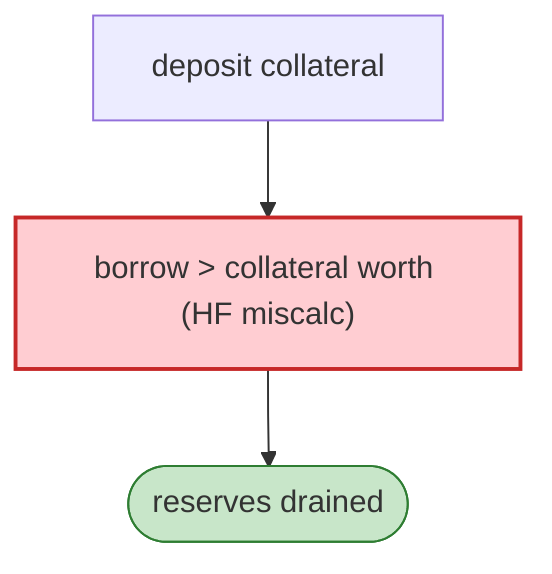

# ROE Finance Exploit — Aave-fork `borrow`/Collateral Accounting Flaw

> **Reproduction:** the PoC compiles & runs in an isolated Foundry project at
> [this project folder](.). Full verbose trace: [output.txt](output.txt).
> Verified vulnerable source: [LendingPool](sources/LendingPool_574ff3),
> [InitializableImmutableAdminUpgradeabilityProxy](sources/InitializableImmutableAdminUpgradeabilityProxy_5F360c) (×2),
> [UniswapV2Pair](sources/UniswapV2Pair_004375).

---

## Key info

| | |
|---|---|
| **Loss** | ~$1M+ (ROE lending drained; tx `0x927b7841…`) |
| **Vulnerable contract** | ROE `LendingPool` (Aave v2 fork) `0x574ff3…` |
| **Chain / block / date** | Ethereum mainnet / Jan 2023 |
| **Bug class** | Lending accounting — `deposit`/`borrow` allowed borrowing more than collateral due to a collateral-usage / health-factor miscalculation in the fork. |

---

## TL;DR

ROE was an Aave-v2 fork whose `LendingPool.deposit`/`borrow` mis-computed the health factor / collateral
usage. The attacker deposits collateral then borrows beyond its value, draining the pool's reserves
(USDC/etc.), routed through the UniswapV2Pair for profit.

---

## Root cause

A **health-factor / collateral-usage accounting bug** in an Aave fork's `borrow`, letting over-borrow
against deposited collateral.

---

## Diagrams



---

## Remediation

1. Port Aave's exact health-factor/liquidation math; invariant tests on `borrow` vs collateral.
2. Conservative LTV; per-asset caps.

---

## How to reproduce

```bash
_shared/run_poc.sh 2023-01-RoeFinance_exp -vvvvv
```

- RPC: mainnet archive. Result: `[PASS]` — over-borrow drains the pool.

---

*Reference: ROE Finance Aave-fork borrow accounting flaw, mainnet, Jan 2023.*
