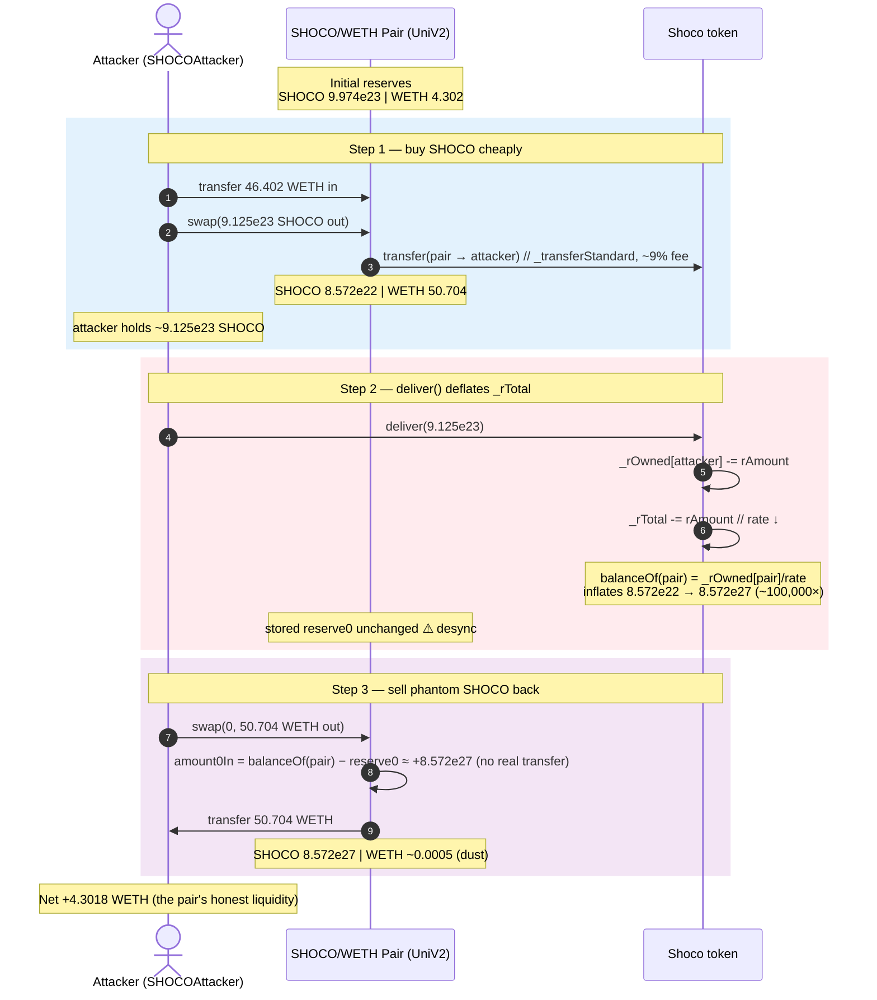
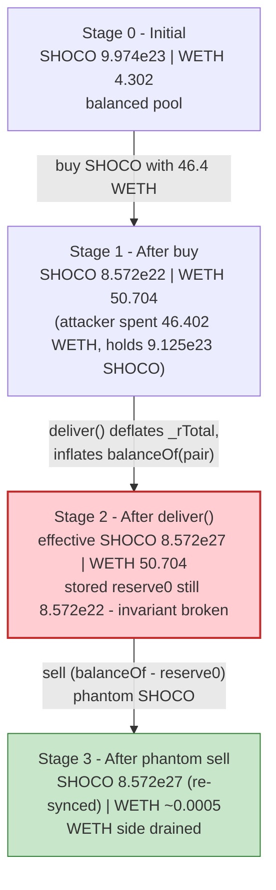
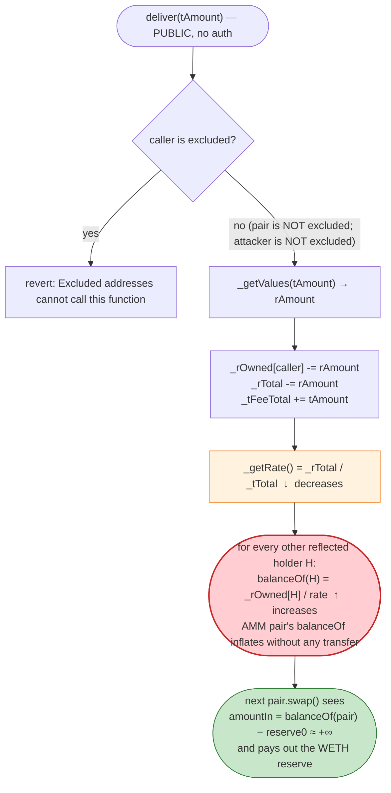
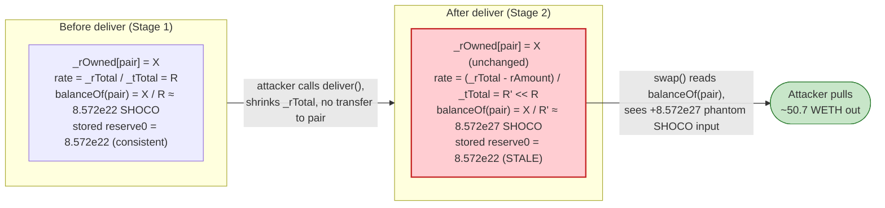

# SHOCO Exploit — Reflection `deliver()` Deflation Inflates the AMM Pair's Effective Balance

> **Reproduction:** the PoC compiles & runs in an isolated Foundry project at
> [this project folder](.). Full verbose trace: [output.txt](output.txt).
> Verified vulnerable source: [Shoco.sol](sources/Shoco_31A4F3/Shoco.sol).

---

## Key info

| | |
|---|---|
| **Loss** | ~4.30 ETH — **4.301834963160736116 WETH** drained from the SHOCO/WETH Uniswap V2 pair ([output.txt:127](output.txt)) |
| **Vulnerable contract** | `Shoco` (reflective ERC20) — [`0x31A4F372AA891B46bA44dC64Be1d8947c889E9c6`](https://etherscan.com/address/0x31A4F372AA891B46bA44dC64Be1d8947c889E9c6#code) |
| **Victim pool** | SHOCO/WETH Uniswap V2 pair — `0x806b6C6819b1f62Ca4B66658b669f0A98e385D18` ([output.txt:15](output.txt)) |
| **Original attacker EOA** | [`0x14d8ada7a0ba91f59dc0cb97c8f44f1d177c2195`](https://etherscan.com/address/0x14d8ada7a0ba91f59dc0cb97c8f44f1d177c2195) |
| **Frontrunner EOA** | [`0xe71aca93c0e0721f8250d2d0e4f883aa1c020361`](https://etherscan.com/address/0xe71aca93c0e0721f8250d2d0e4f883aa1c020361) |
| **Original attack contract** | [`0x15d684b4ecdc0ece8bc9aec6bce3398a9a4c7611`](https://etherscan.com/address/0x15d684b4ecdc0ece8bc9aec6bce3398a9a4c7611) |
| **PoC attack contract** | `0x7FA9385bE102ac3EAc297483Dd6233D62b3e1496` (`SHOCOAttacker`, [output.txt:31](output.txt)) |
| **Attack tx** | [`0x2e832f044b4a0a0b8d38166fe4d781ab330b05b9efa9e72a7a0895f1b984084b`](https://etherscan.com/tx/0x2e832f044b4a0a0b8d38166fe4d781ab330b05b9efa9e72a7a0895f1b984084b) |
| **Chain / block / date** | Ethereum mainnet / **16,440,978** / Jan 19, 2023 ([output.txt:24](output.txt)) |
| **Compiler** | Solidity **v0.6.12+commit.27d51765** (per [_meta.json](sources/Shoco_31A4F3/_meta.json)); optimizer **enabled**, **40 runs** |
| **Bug class** | Reflection-token accounting — public `deliver()` deflates `_rTotal`, which **inflates** every reflected holder's effective balance (including the AMM pair's) without `sync()` |

---

## TL;DR

`Shoco` ([Shoco.sol](sources/Shoco_31A4F3/Shoco.sol)) is a "reflective" / "rebasing" ERC20 (a TaxToken-style
contract) that maintains two parallel supplies: a true supply `_tTotal` and a larger "reflection" supply
`_rTotal`. Each holder's balance is `tokenFromReflection(_rOwned[holder])`, i.e. their reflection balance
divided by the current rate `_rTotal / _tTotal` ([Shoco.sol:1258-1261](sources/Shoco_31A4F3/Shoco.sol#L1258-L1261)).

1. The contract exposes a **public, permissionless `deliver(tAmount)`** that lets any *non-excluded* holder
   "donate" tokens to all other holders: it subtracts `tAmount` worth of reflections from the caller and
   shrinks `_rTotal` accordingly ([Shoco.sol:952-959](sources/Shoco_31A4F3/Shoco.sol#L952-L959)). Because the
   rate `_rTotal / _tTotal` goes *down*, the same `_rOwned` for every other holder now converts to a **larger**
   `tAmount`. In other words, calling `deliver` **inflates everyone else's effective balance**.

2. The Uniswap V2 SHOCO/WETH pair is one such "other holder". The pair's internal `reserve0`/`reserve1` are
   only re-synced to `token.balanceOf(pair)` inside `swap()`/`mint()`/`burn()`/`sync()` — `deliver()` does
   **not** touch them. So after `deliver()` the pair's stored SHOCO `reserve0` is stale and tiny, while its
   *actual* `SHOCO.balanceOf(pair)` (computed through `tokenFromReflection`) has ballooned.

3. The attacker exploits this by buying SHOCO, calling `deliver()` to inflate the pair's effective SHOCO
   balance ~100,000×, and then selling the phantom difference
   `SHOCO.balanceOf(pair) − reserve0` back to the pair — the pair's `swap()` re-prices against the now-huge
   actual balance and hands out nearly the entire WETH reserve. The PoC at block 16,440,978 spends
   **46.402 WETH** in, gets **50.704 WETH** out, netting **4.3018 WETH** ([output.txt:69](output.txt),
   [output.txt:121](output.txt), [output.txt:127](output.txt)).

This is the same family as the January-2023 reflection-token drains (the attacker even frontruns itself
between two MEV bots — see the two EOAs in [@KeyInfo](test/SHOCO_exp.sol#L7-L12)).

---

## Background — what Shoco does

`Shoco` is a community "meme" token ("Shiba Chocolate") deployed as a standard reflect-and-tax contract
on Ethereum mainnet. The reflection mechanism is the relevant part:

- **Two supplies.** `_tTotal = 1,000,000 * 1e18` (1M SHOCO, 9 decimals) is the "true" supply
  ([Shoco.sol:692](sources/Shoco_31A4F3/Shoco.sol#L692)). `_rTotal = MAX − (MAX % _tTotal)` is the reflection
  supply — a ~1.16e77 number chosen so the initial rate `_rTotal/_tTotal` is an integer
  ([Shoco.sol:693](sources/Shoco_31A4F3/Shoco.sol#L693)).
- **Reflected balances.** Non-excluded accounts store their balance in the reflection space
  (`_rOwned[account]`); `balanceOf` returns `tokenFromReflection(_rOwned[account]) = _rOwned[account] / rate`
  ([Shoco.sol:901-904](sources/Shoco_31A4F3/Shoco.sol#L901-L904),
  [Shoco.sol:972-976](sources/Shoco_31A4F3/Shoco.sol#L972-L976)). The rate is `_rTotal / tSupply`
  ([Shoco.sol:1258-1261](sources/Shoco_31A4F3/Shoco.sol#L1258-L1261)).
- **`deliver()` — "give reflections to everyone".** A public function that **subtracts** `rAmount` from the
  caller's `_rOwned` and **subtracts** the same `rAmount` from `_rTotal` (and bumps `_tFeeTotal`)
  ([Shoco.sol:952-959](sources/Shoco_31A4F3/Shoco.sol#L952-L959)). Because both numerator and a single
  holder's reflection shrink, the rate `_rTotal / _tTotal` *decreases*, which **increases** the effective
  balance of every other reflected holder. This is the design's intended "redistribution" — but it is
  catastrophically incompatible with an AMM pair that does not re-sync.
- **AMM pairing.** Liquidity sits in a Uniswap V2 pair at
  `0x806b6C6819b1f62Ca4B66658b669f0A98e385D18`. The pair is **not** excluded from fees or from the
  reflection system, so it holds SHOCO as a reflected `_rOwned[pair]` balance.

On-chain parameters at the fork block 16,440,978 (read directly from the trace):

| Parameter | Value | Source |
|---|---|---|
| Pair `reserve0` (SHOCO, token0) | 997,464,549,590,102,610,469,778 (~9.974e23 SHOCO) | [output.txt:66](output.txt) |
| Pair `reserve1` (WETH, token1) | 4,302,343,536,951,834,471 (~4.302 WETH) | [output.txt:66](output.txt) |
| Pair `WETH.balanceOf` (sanity) | 4,302,343,536,951,834,471 (4.302 WETH) | [output.txt:27](output.txt) |
| `_rTotal` (slot 14) | `0xcd11c78de107af3b87bf064a09f4435c08ab252a4e4205a85da9b3be8e098528` | [output.txt:60](output.txt) |
| Excluded-reflection for `0xCb23…Cc1a` (slot 3 key) | `0x12089b5b0090545834a4f19b3611f4f41f2883b9457737276ad88e7600a59a52` | [output.txt:62](output.txt) |
| `_decimals` | 9 | [Shoco.sol:698](sources/Shoco_31A4F3/Shoco.sol#L698) |

The pair is the only meaningful source of WETH liquidity for SHOCO, and it holds ~4.3 WETH of honest
liquidity — that is the prize.

---

## The vulnerable code

### 1. `deliver()` — public, un-guarded, deflates `_rTotal`

```solidity
function deliver(uint256 tAmount) public {
    address sender = _msgSender();
    require(!_isExcluded[sender], "Excluded addresses cannot call this function");
    (uint256 rAmount,,,,,) = _getValues(tAmount);
    _rOwned[sender] = _rOwned[sender].sub(rAmount);
    _rTotal = _rTotal.sub(rAmount);          // ⚠️ shrinks the rate denominator
    _tFeeTotal = _tFeeTotal.add(tAmount);
}
```
([Shoco.sol:952-959](sources/Shoco_31A4F3/Shoco.sol#L952-L959))

Anyone who is not an "excluded" account (the pair is **not** excluded) can call this. It burns the caller's
reflection balance and `_rTotal` together. The caller loses tokens; every *other* reflected holder —
including the Uniswap pair — gains effective balance because the rate goes down.

### 2. `tokenFromReflection` / `_getRate` — the rate that flips the pair's balance

```solidity
function tokenFromReflection(uint256 rAmount) public view returns(uint256) {
    require(rAmount <= _rTotal, "Amount must be less than total reflections");
    uint256 currentRate =  _getRate();
    return rAmount.div(currentRate);
}
```
([Shoco.sol:972-976](sources/Shoco_31A4F3/Shoco.sol#L972-L976))

```solidity
function _getRate() private view returns(uint256) {
    (uint256 rSupply, uint256 tSupply) = _getCurrentSupply();
    return rSupply.div(tSupply);
}
```
([Shoco.sol:1258-1261](sources/Shoco_31A4F3/Shoco.sol#L1258-L1261))

After `deliver`, `_rTotal` (hence `rSupply`) is smaller, so `_getRate()` is smaller, so
`tokenFromReflection(_rOwned[pair])` is **larger**. The pair's `SHOCO.balanceOf(pair)` literally increases
out of thin air, even though no SHOCO was transferred to it.

### 3. The pair trusts `balanceOf` on every `swap()`

Uniswap V2's `swap` re-syncs reserves with `_update(balance0, balance1, …)` using
`IERC20(token0).balanceOf(address(this))`. For a normal token that only changes via real transfers, this is
safe. For a reflective token whose `balanceOf` mutates with the global rate, the pair silently accepts the
inflated balance as its new reserve — handing the inflation to the swapper.

```solidity
// (Uniswap V2 pair, not in sources/ — standard)
// In swap(): after transfers, balance0 = IERC20(token0).balanceOf(this)
//            amount0In = balance0 - _reserve0
// ... invariant check uses (balance0 * 1000 - amount0In * 997) * (balance1 ...) >= ...
```

Because the attacker calls `deliver` *between* two swaps, the second swap sees
`balance0 - _reserve0 ≈ +8.57e27` SHOCO of "input" that was never actually transferred in — pure profit.

---

## Root cause — why it was possible

The bug is an **interface mismatch between a rebasing/reflection token and a constant-product AMM**.

A Uniswap V2 pair is only correct if `token.balanceOf(pair)` changes exclusively through `transfer` /
`transferFrom` calls that the pair itself initiated inside `swap` / `mint` / `burn`. The pair re-derives
its reserves from `balanceOf` at the end of each such call and assumes the delta is the "amountIn" the
swapper deposited. Reflective/rebasing tokens violate that assumption: their `balanceOf` is a *function of
global state* (`_rTotal`), not just of transfers to the pair.

`deliver()` is the public lever:

- It is **permissionless** — no `onlyOwner`, no per-user limit, no cooldown (the contract's 60-s cooldown
  only applies inside `_transfer`, not `deliver`).
- It **shrinks `_rTotal`**, which is the denominator of the reflection rate. A smaller rate means every
  reflected holder — the pair included — has a *larger* effective balance.
- It is **net-negative for the caller** in isolation (they burn their own tokens), which made it look
  harmless on paper. The harm comes from the *composition* with the AMM: the caller first buys SHOCO
  cheaply, then `deliver`s it away to inflate the pair, then sells the inflation back. The attacker's
  `deliver` is not a loss — it is the cost of manufacturing counterfeit `balanceOf(pair)`.

The same class of bug has hit dozens of reflection tokens; the developer's own comment
("Snipers will be nuked", [Shoco.sol:4](sources/Shoco_31A4F3/Shoco.sol#L4)) shows the threat model was
 bots, not the AMM integration.

---

## Preconditions

- A working SHOCO/WETH Uniswap V2 pair with non-trivial WETH liquidity (~4.3 WETH here).
- `tradingOpen == true` (it was, at block 16,440,978 — the PoC's swaps succeed). The contract's
  `_transfer` gating (`uniswapOnly`, cooldown) is bypassed in the PoC because the attacker calls the pair's
  `swap()` directly, not via the router — and even via the router the SHOCO contract's
  `_msgSender() == uniswapV2Pair` check ([Shoco.sol:1085-1086](sources/Shoco_31A4F3/Shoco.sol#L1085-L1086))
  passes for an honest swap.
- Working capital in WETH to buy the SHOCO that will be `deliver`-burned. The PoC seeds the attacker with
  **2000 WETH** via `deal` ([SHOCO_exp.sol:75](test/SHOCO_exp.sol#L75)) and actually spends only
  ~46.4 WETH; this is fully flash-loanable.

---

## Attack walkthrough (with on-chain numbers from the trace)

The pair's `token0 = SHOCO`, `token1 = WETH`, so `reserve0 = SHOCO`, `reserve1 = WETH`. Every figure below
is taken directly from [output.txt](output.txt); raw wei first, then a human approximation.

| # | Step | SHOCO reserve (r0) | WETH reserve (r1) | Effect |
|---|------|-------------------:|------------------:|--------|
| 0 | **Initial** (getReserves @ [output.txt:65-66](output.txt)) | 997,464,549,590,102,610,469,778 (~9.974e23) | 4,302,343,536,951,834,471 (~4.302 WETH) | Honest pool. |
| 1 | **Buy SHOCO** — attacker transfers **46,402,464,960,714,259,999 wei (46.402 WETH)** into the pair and calls `swap(912,595,882,656,935,661,743,974 SHOCO out, 0, …)` ([output.txt:70-76](output.txt)). The SHOCO `Transfer` event shows only **830,462,253,217,811,452,187,018 (~8.304e23)** actually moves to the attacker — the 9% delta is the `_taxFee`+`_teamDev` reflected away inside `_transferStandard` ([output.txt:78](output.txt)). | 857,259,261,951,181,299,311,79 (~8.572e22) | 50,704,808,497,666,094,470 (~50.704 WETH) | Attacker holds ~9.125e23 SHOCO; pair SHOCO reserve shrinks ~91%. |
| 2 | **`deliver(912,586,756,698,109,091,377,264)`** — attacker burns ~99.999% of their SHOCO via `deliver` ([output.txt:99](output.txt)). This shrinks `_rTotal`, dropping the rate, which **inflates** `SHOCO.balanceOf(pair)` from ~8.572e22 to **8,572,592,619,416,928,738,451,500,486 (~8.572e27)** — a ~100,000× jump ([output.txt:107-108](output.txt)). The pair's *stored* `reserve0` is untouched. | **8.572e27 effective** (stored `reserve0` still ~8.572e22) | 50,704,808,497,666,094,470 (unchanged, [output.txt:106](output.txt)) | **Invariant broken**: pair's real balance is ~100,000× its cached reserve. |
| 3 | **Sell the phantom SHOCO** — attacker calls `swap(0, 50,704,299,923,874,996,115 WETH out, …)`. The pair sees `amount0In = balance0 − reserve0 = 8,572,506,893,490,733,620,321,569,307 (~8.572e27)` SHOCO "deposited" (none of it real) and happily pays out **50.704 WETH** ([output.txt:109-121](output.txt)). | 8,572,592,619,416,928,738,451,500,486 (~8.572e27, re-synced, [output.txt:120](output.txt)) | 508,573,791,098,355 (~5.085e14 wei, dust) | WETH side drained to dust. |

The attacker recovers **50,704,299,923,874,996,115 wei (50.704 WETH)** from step 3, against the
**46,402,464,960,714,259,999 wei (46.402 WETH)** spent in step 1.

### Profit / loss accounting (WETH, raw wei)

| Item | Amount (wei) | ~Human |
|---|---:|---:|
| WETH spent buying SHOCO (step 1) | 46,402,464,960,714,259,999 | ~46.402465 |
| WETH received selling phantom SHOCO (step 3) | 50,704,299,923,874,996,115 | ~50.704300 |
| **Net profit (asserted in PoC)** | **4,301,834,963,160,736,116** | **~4.301835 WETH** |

The asserted profit ([output.txt:127](output.txt)) exactly matches `wethAmountOut − wethAmountIn`
([SHOCO_exp.sol:95](test/SHOCO_exp.sol#L95)), and is essentially the pair's entire original WETH reserve
(4.302 WETH, [output.txt:27](output.txt)) minus the AMM/rounding sliver retained as dust.

---

## Diagrams

### Sequence of the attack



### Pool state evolution



### The flaw inside `deliver()` / `_getRate`



### Why `deliver()` is theft: pair's effective balance before vs. after



---

## Why each magic number

- **`2000 ether` (the `deal` amount, [SHOCO_exp.sol:75](test/SHOCO_exp.sol#L75)):** just headroom capital
  for the attacker. Only ~46.4 WETH is actually used; the rest is never touched. Any flash-loanable amount
  ≥ ~50 WETH works.
- **`attackBlockNumber = 16_440_978` ([SHOCO_exp.sol:72-73](test/SHOCO_exp.sol#L72-L73)):** the historical
  block of the real attack tx — pins the fork to the exact reserves and `_rTotal` the attacker operated
  against.
- **The reflection-slot reads (`vm.load(shoco, 14)` for `_rTotal`, and `getMappingValue(shoco, 3, …)` for
  an excluded account's `_rOwned`, [SHOCO_exp.sol:77-78](test/SHOCO_exp.sol#L77-L78)):** the attacker
  computes the *current* `_rTotal` minus a large excluded reflection balance, then divides by the rate via
  `tokenFromReflection` to find how much SHOCO they can pull out of the pair in one buy
  ([SHOCO_exp.sol:79-80](test/SHOCO_exp.sol#L79-L80)). The `− 0.1 * 1e9` slack avoids the pair's
  `INSUFFICIENT_LIQUIDITY`/rounding revert. This produces **912,595,882,656,935,761,743,974 SHOCO**
  requested ([output.txt:64](output.txt), [output.txt:76](output.txt)).
- **`wethAmountIn = 46,402,464,960,714,259,999` (46.402 WETH, [output.txt:69](output.txt)):**
  `getAmountIn(shocoAmountOut, reserve1=WETH, reserve0=SHOCO)` — the exact WETH needed to make the pair
  hand over the target SHOCO amount at the 0.3% fee ([SHOCO_exp.sol:82-84](test/SHOCO_exp.sol#L82-L84)).
- **`deliver(balanceOf(this) * 99_999 / 100_000)` ([SHOCO_exp.sol:89](test/SHOCO_exp.sol#L89)):** burns
  99.999% of the attacker's SHOCO via `deliver` (keeps 0.001% as dust to avoid edge cases). The actual
  delivered amount in the trace is **912,586,756,698,109,091,377,264** ([output.txt:99](output.txt)),
  ~99.999% of the **912,595,882,656,935,660,733,872 SHOCO** the attacker actually received
  ([output.txt:98](output.txt)).
- **`shoco.balanceOf(pair) − reserve0` ([SHOCO_exp.sol:91-92](test/SHOCO_exp.sol#L91-L92)):** the phantom
  SHOCO the pair "gained" from the rate drop. This is the amount the second `swap()` will read as
  `amount0In`. It is ~**8.572e27 SHOCO** ([output.txt:108](output.txt) vs.
  [output.txt:106](output.txt)) — i.e. ~100,000× the stored reserve.
- **`wethAmountOut = 50,704,299,923,874,996,115` (50.704 WETH, [output.txt:109](output.txt),
  [output.txt:121](output.txt)):** `getAmountOut(phantomSHOCO, reserve0, reserve1)` — essentially the whole
  WETH reserve minus dust. Net of the 46.402 WETH spent, this leaves the **4.3018 WETH** profit
  ([output.txt:127](output.txt)).

---

## Remediation

1. **Do not pair reflective/rebasing tokens with constant-product AMMs that read `balanceOf`.** Either (a)
   exclude the AMM pair from the reflection system (`excludeAccount(pair)` at deployment — note Shoco has
   this function but never applied it to its pair, [Shoco.sol:978-986](sources/Shoco_31A4F3/Shoco.sol#L978-L986)),
   or (b) use an AMM that prices off an internal accounting variable instead of `balanceOf`
   (e.g., a v3-style pool, or a custom pair that snapshots balances).
2. **Remove or gate the public `deliver()` / `reflectionFromToken` surface.** If redistribution is a product
   requirement, it must be performed only by trusted roles and never in a window where it can desync a pair.
   A `nonReentrant`-style "no deliver while a pair swap is in flight" guard is insufficient — the attacker
   here calls `deliver` *between* two separate swaps.
3. **Add a rate-change oracle / re-sync hook.** If the rate must change, the token should call
   `IUniswapV2Pair(pair).sync()` immediately afterwards so the pair's reserves track the new `balanceOf`.
   This converts the bug into a (still gift-giving) but non-draining behavior, because the pair would
   account for the inflation on both sides.
4. **Cap per-call and per-block `_rTotal` deflation.** A bounded `deliver` (e.g., max 0.1% of supply per
   block) limits the maximum `balanceOf` inflation an attacker can manufacture in one tx, reducing but not
   eliminating the issue.
5. **Snapshot/lock the reflection rate around AMM interactions.** Have `_transfer` use the rate snapshot at
   the start of the transaction, so intra-block `deliver` calls cannot retroactively change the amount the
   pair thinks it received.

---

## How to reproduce

The PoC runs fully **offline** via the shared harness, which serves the fork from a local
`anvil_state.json` (the test's `createSelectFork` points at `http://127.0.0.1:8545`,
[SHOCO_exp.sol:32](test/SHOCO_exp.sol#L32); no public RPC is needed):

```bash
_shared/run_poc.sh 2023-01-SHOCO_exp --mt testExploit -vvvvv
```

- EVM: `foundry.toml` sets `evm_version = 'cancun'` ([foundry.toml](foundry.toml)); the PoC uses no
  post-merge opcodes specifically, but `cancun` is harmless.
- The attacker is seeded with WETH via Foundry's `deal` (which the trace renders as the `vm.store`
  storage-slot dance at [output.txt:46-58](output.txt)); no flash loan is wired up in the PoC.
- The real test contract is `SHOCOAttacker` and the test function is **`testExploit`**
  ([SHOCO_exp.sol:71](test/SHOCO_exp.sol#L71)).

Expected tail ([output.txt:4-9](output.txt), [output.txt:133-135](output.txt)):

```
Ran 1 test for test/SHOCO_exp.sol:SHOCOAttacker
[PASS] testExploit() (gas: 406522)
Logs:
  WETH balance: 4.302343536951834471
  WETH amountIn: 46.402464960714259999
  Attack profit:: 4.301834963160736116

Suite result: ok. 1 passed; 0 failed; 0 skipped; finished in 10.14s (8.73s CPU time)
```

---

*Reference: DeFiHackAnalysis — https://github.com/Autosaida/DeFiHackAnalysis/blob/master/analysis/230119_SHOCO.md (SHOCO reflection `deliver` manipulation, Ethereum mainnet, Jan 19 2023, ~4.30 ETH).*
