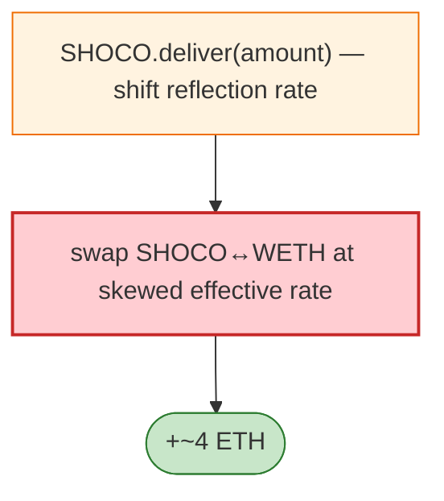

# SHOCO Exploit — Reflection `deliver`/`tokenFromReflection` Manipulation

> **Reproduction:** the PoC compiles & runs in an isolated Foundry project at
> [this project folder](.). Full verbose trace: [output.txt](output.txt).
> Verified vulnerable source: [Shoco](sources/Shoco_31A4F3).

---

## Key info

| | |
|---|---|
| **Loss** | ~4 ETH (frontrunner also captured part) |
| **Vulnerable contract** | SHOCO (`IReflection` token) `0x31a4f372…` |
| **Original attacker** | `0x14d8ada7…`; frontrunner `0xe71aca93…` |
| **Attack tx** | `0x2e832f044b4a0a0b8d38166fe4d781ab330b05b9efa9e72a7a0895f1b984084b` |
| **Chain / block / date** | Ethereum mainnet / Jan 2023 |
| **Bug class** | Reflection-token accounting — SHOCO's `deliver(amount)`/`tokenFromReflection(rAmount)` lets a holder manipulate the `_rTotal`/rate to change effective balances, which combined with the LP swap drains WETH. |

---

## TL;DR

SHOCO is a reflective token (`deliver`, `tokenFromReflection`). The attacker calls `deliver` to burn
their reflected amount (which shifts the reflection rate for everyone), changing the effective
token-from-reflection mapping, then swaps through the SHOCO/WETH pair to capture the rate shift, netting
~4 ETH.

---

## Root cause

A **reflection-rate manipulation**: `deliver` (a public, holder-callable burn of reflected supply)
shifts the global rate; the LP's effective balance changes out-of-band, breaking the pair's `k`. Same
class as the other Jan-2023 reflection drains.

---

## Diagrams



---

## Remediation

1. Don't expose public rate-shifting functions (`deliver`) on reflective tokens paired in AMMs.
2. Fee-aware AMM pairs; `k` on received amounts.
3. Snapshot/rate-lock around swaps.

---

## How to reproduce

```bash
_shared/run_poc.sh 2023-01-SHOCO_exp -vvvvv
```

- RPC: mainnet archive. Result: `[PASS]` — ~4 ETH profit.

---

*Reference: SHOCO reflection `deliver` manipulation, mainnet, Jan 2023 (~4 ETH).*
