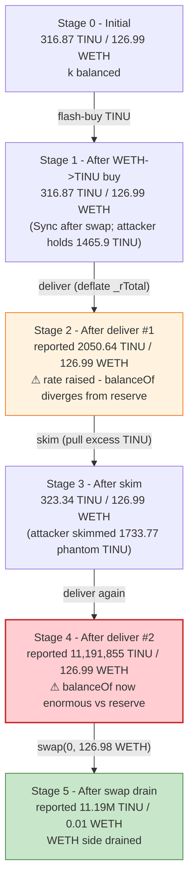
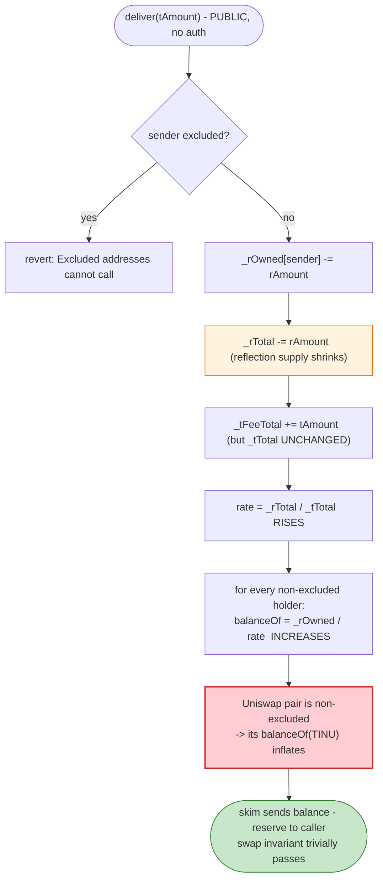
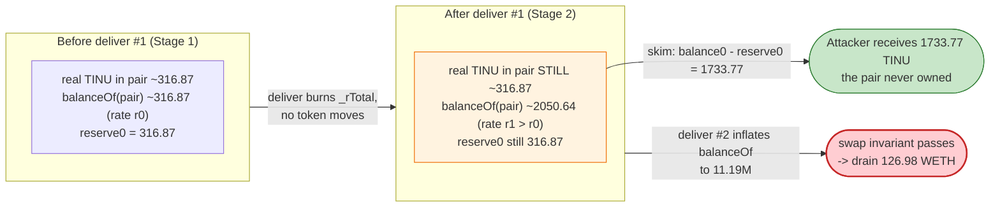

# TomInu (TINU) Exploit — Reflective-Token (RFI) Reflection-Rate Skim against a Uniswap-V2 Pair

> **Reproduction:** the PoC compiles & runs in an isolated Foundry project at
> [this project folder](.). Full verbose trace: [output.txt](output.txt).
> Verified vulnerable source: [TomInu.sol](sources/TomInu_2d0e64/TomInu.sol).

---

## Key info

| | |
|---|---|
| **Loss** | ~**22 WETH** — attacker's final WETH balance `22134561461014981232` wei (~22.134561 WETH) after repaying a 104.85 WETH Balancer flash loan ([output.txt:182](output.txt)); the PoC's `console.log` rounds this to `22` ([output.txt:183](output.txt)). |
| **Vulnerable contract** | `TomInu` (reflective ERC20) — [`0x2d0E64B6bF13660a4c0De42a0B88144a7C10991F`](https://etherscan.io/address/0x2d0E64B6bF13660a4c0De42a0B88144a7C10991F#code) |
| **Victim pool** | TINU/WETH Uniswap-V2 pair — [`0xb835752Feb00c278484c464b697e03b03C53E11B`](https://etherscan.io/address/0xb835752Feb00c278484c464b697e03b03C53E11B) |
| **Attacker EOA** | [`0x14d8ada7a0ba91f59dc0cb97c8f44f1d177c2195`](https://etherscan.io/address/0x14d8ada7a0ba91f59dc0cb97c8f44f1d177c2195) |
| **Attacker contract** | [`0xdb2d869ac23715af204093e933f5eb57f2dc12a9`](https://etherscan.io/address/0xdb2d869ac23715af204093e933f5eb57f2dc12a9) |
| **Attack tx** | [`0x6200bf5c43c214caa1177c3676293442059b4f39eb5dbae6cfd4e6ad16305668`](https://etherscan.io/tx/0x6200bf5c43c214caa1177c3676293442059b4f39eb5dbae6cfd4e6ad16305668) |
| **Flash source** | Balancer Vault `0xBA12222222228d8Ba445958a75a0704d566BF2C8` (zero-fee flash loan, [output.txt:29](output.txt)) |
| **Chain / block / date** | Ethereum mainnet / **16,489,408** / Jan 2023 |
| **Compiler** | Solidity **v0.6.12** (`commit.27d51765`), optimizer **enabled**, **10,000 runs** ([_meta.json](_meta.json)) |
| **Bug class** | Reflective / fee-on-transfer token in a vanilla Uniswap-V2 pair: `deliver()` deflates the reflection rate so the pair's `balanceOf()` diverges from its stored reserves, enabling `skim()` + a direct `swap()` to drain WETH. |

---

## TL;DR

`TomInu` ([TomInu.sol:663](sources/TomInu_2d0e64/TomInu.sol#L663)) is a "reflective" (RFI-style) ERC20: every balance is stored twice — a *reflection* balance `_rOwned` and a *real* balance `_tOwned` — and `balanceOf()` derives the human-readable balance from the reflection balance via `tokenFromReflection = rOwned / rate`, where `rate = rSupply / tSupply` ([TomInu.sol:935-939](sources/TomInu_2d0e64/TomInu.sol#L935-L939), [:1227-1230](sources/TomInu_2d0e64/TomInu.sol#L1227-L1230)).

The public `deliver(tAmount)` function ([TomInu.sol:915-922](sources/TomInu_2d0e64/TomInu.sol#L915-L922)) is meant to let a holder "donate" tokens to all other holders by burning their own reflection: it does `_rOwned[sender] -= rAmount; _rTotal -= rAmount; _tFeeTotal += tAmount`. It does **not** move any `_tOwned`, does not touch the recipient, and emits no `Transfer`. The net effect is that **`_rTotal` shrinks while `_tTotal` is unchanged, so `rate` rises** — and every non-excluded address's reported `balanceOf` *inflates* by the same factor, including the Uniswap pair's.

1. The attacker flash-borrows **104.85 WETH** from Balancer ([output.txt:25](output.txt), fee = 0).
2. It swaps 104.85 WETH → TINU, buying **1,465.9 TINU** from the pair ([output.txt:83](output.txt)). Pair reserves drop to **316.87 TINU / 126.99 WETH** ([output.txt:75](output.txt)).
3. It calls `deliver(1,465.9 TINU)`. `_rTotal` falls; `rate` rises; the pair's reported `balanceOf` jumps from 316.87 to **2,050.64 TINU** ([output.txt:104](output.txt)) — even though only ~316 TINU actually sit there.
4. It calls `pair.skim(attacker)`. The pair sends its **excess** TINU (the difference between its *real* balance and its *stored reserve*) — `1,733.77 TINU` ([output.txt:116](output.txt)) — straight to the attacker.
5. It calls `deliver(1,733.77 TINU)` **again**. The reflection rate collapses further and the pair's reported `balanceOf` balloons to **11,191,855 TINU** ([output.txt:150](output.txt)).
6. With the pair holding a reported 11.19M TINU against only 126.99 WETH, the attacker calls `pair.swap(0, 126.98 WETH, attacker, "")` directly ([output.txt:159](output.txt)). The pair's invariant check (`balance0Adjusted * balance1Adjusted >= k`) passes because `balance0` (the inflated TINU reading) is now enormous — it drains essentially **all** the WETH, leaving the pair with `0.01 WETH` ([output.txt:169](output.txt)).
7. It repays the 104.85 WETH flash loan ([output.txt:175](output.txt)) and keeps **22.134561 WETH** of profit ([output.txt:182](output.txt)).

The entire move is funded by the flash loan and nets **~22 WETH** — the pool's honest WETH liquidity.

---

## Background — what TomInu does

`TomInu` is a meme/reflective ERC20 deployed on Ethereum mainnet at `0x2d0E64B6…`. Reflective tokens (the "RFI" family) attempt to pay holders a yield by **deflating the reflection supply** rather than by moving tokens:

- There is a *real* total `_tTotal = 1,733,820 TINU` (9 decimals, [TomInu.sol:680](sources/TomInu_2d0e64/TomInu.sol#L680), [:687](sources/TomInu_2d0e64/TomInu.sol#L687)) and a *reflection* total `_rTotal = MAX - (MAX % _tTotal)` ([TomInu.sol:681](sources/TomInu_2d0e64/TomInu.sol#L681)).
- Each holder has a reflection balance `_rOwned`. Their readable balance is derived: `balanceOf = tokenFromReflection(_rOwned) = _rOwned / rate`, where `rate = _rTotal / _tTotal` ([TomInu.sol:864-867](sources/TomInu_2d0e64/TomInu.sol#L864-L867)).
- On every transfer, `_reflectFee` burns a fraction of `_rTotal` ([TomInu.sol:1198-1201](sources/TomInu_2d0e64/TomInu.sol#L1198-L1201)) and `_taketeam` accrues the team fee to `address(this)` ([TomInu.sol:1190-1196](sources/TomInu_2d0e64/TomInu.sol#L1190-L1196)). The first makes every remaining holder's slice of `_tTotal` larger (the "reflection yield"); the second is a plain fee to the contract.
- `deliver(tAmount)` ([TomInu.sol:915-922](sources/TomInu_2d0e64/TomInu.sol#L915-L922)) lets a *non-excluded* holder voluntarily give up `tAmount` of real tokens to the reflection pool: it debits `_rOwned[sender]` and shrinks `_rTotal`, raising `rate` for everyone else.

On-chain parameters at fork block 16,489,408 (read from the trace):

| Parameter | Value | Source |
|---|---|---|
| Pair token0 / token1 | **TINU / WETH** (so `reserve0` = TINU, `reserve1` = WETH) | derived from `swap(amount0Out=TINU,…)` ([output.txt:60](output.txt)) |
| Initial pair WETH balance | `126,994,561,461,014,981,232` wei ≈ **126.994561 WETH** | [output.txt:58-59](output.txt) |
| Initial pair TINU balance | `316,871,513,264,115,731,249` raw (9 dec) after the attacker's buy | [output.txt:72](output.txt) |
| `_taxFee` / `_teamFee` | **0 / 0** at deploy (no fees set) | [TomInu.sol:690-693](sources/TomInu_2d0e64/TomInu.sol#L690-L693) |
| `tradingEnabled` | **true** (attack would otherwise revert at [:1028](sources/TomInu_2d0e64/TomInu.sol#L1028)) | — |
| Balancer flash-loan fee | **0** | [output.txt:29](output.txt) |
| Flash-loan principal | `104,850,000,000,000,000,000` wei = **104.85 WETH** | [output.txt:25](output.txt) |

The fact that `tradingEnabled` was already on, the pair already had WETH liquidity, and `_taxFee`/`_teamFee` were still `0` (so no fee accounting diluted the reflection trick) is what made this attack cleanly reproducible.

---

## The vulnerable code

### 1. `balanceOf` is *derived* from the reflection rate, not stored

```solidity
function balanceOf(address account) public view override returns (uint256) {
    if (_isExcluded[account]) return _tOwned[account];
    return tokenFromReflection(_rOwned[account]);
}

function tokenFromReflection(uint256 rAmount) public view returns(uint256) {
    require(rAmount <= _rTotal, "Amount must be less than total reflections");
    uint256 currentRate =  _getRate();
    return rAmount.div(currentRate);
}
```
([TomInu.sol:864-867](sources/TomInu_2d0e64/TomInu.sol#L864-L867), [:935-939](sources/TomInu_2d0e64/TomInu.sol#L935-L939))

Because the pair is **not excluded** from reflections, the pair's TINU balance — which the Uniswap-V2 pair reads via `IERC20.balanceOf(address(this))` inside `swap`/`skim`/`sync` — is *computed* from `_rOwned[pair] / rate`. Any change to `_rTotal` therefore silently rewrites the pair's perceived balance without any `Transfer` event being emitted to the pair.

### 2. `deliver` shrinks `_rTotal` without moving tokens

```solidity
function deliver(uint256 tAmount) public {
    address sender = _msgSender();
    require(!_isExcluded[sender], "Excluded addresses cannot call this function");
    (uint256 rAmount,,,,,) = _getValues(tAmount);
    _rOwned[sender] = _rOwned[sender].sub(rAmount);
    _rTotal = _rTotal.sub(rAmount);          // ← reduces the reflection supply
    _tFeeTotal = _tFeeTotal.add(tAmount);    // ← but _tTotal is UNCHANGED
}
```
([TomInu.sol:915-922](sources/TomInu_2d0e64/TomInu.sol#L915-L922))

`_rTotal` shrinks while `_tTotal` does not, so `_getRate = _rTotal / _tTotal` ([TomInu.sol:1227-1230](sources/TomInu_2d0e64/TomInu.sol#L1227-L1230)) **rises**. For every non-excluded holder whose `_rOwned` is unchanged, `balanceOf = _rOwned / rate` therefore **increases** — including the Uniswap pair's. The pair never receives or sends a token; it just *looks richer* on the next `balanceOf` call.

```solidity
function _getRate() private view returns(uint256) {
    (uint256 rSupply, uint256 tSupply) = _getCurrentSupply();
    return rSupply.div(tSupply);
}
```
([TomInu.sol:1227-1230](sources/TomInu_2d0e64/TomInu.sol#L1227-L1230))

### 3. `skim` and `swap` trust this derived balance

`skim` (standard Uniswap-V2) sends `balance0 - reserve0` (and `balance1 - reserve1`) to `to`. `swap` requires `(balance0 * 1000) * (balance1 * 1000) >= reserve0 * reserve1 * 1000^2` after the swap. Both use the token's live `balanceOf`. With `deliver` having inflated the pair's TINU `balanceOf`, `skim` returns free TINU and the invariant check in `swap` is trivially satisfied.

---

## Root cause — why it was possible

A Uniswap-V2 pair assumes its two underlying tokens behave like ordinary ERC20s: a token's `balanceOf(pair)` only changes when an actual `transfer`/`mint`/`burn` moves tokens into or out of the pair, and the pair is notified via `Sync`/`Swap`. Reflective tokens violate that assumption — `balanceOf` is a **derived** quantity that depends on global rate state (`_rTotal`, `_tFeeTotal`) that any holder can mutate via `deliver` (or that mutates on every taxed transfer). The pair cannot reconcile those mutations because they produce no `Transfer` event addressed to the pair and no `Sync`.

Concretely, the composition is:

1. **`deliver` is permissionless and reduces `_rTotal`.** Anyone holding TINU can donate their reflection to everyone else. There is no cap and no per-address restriction beyond "not excluded".
2. **`balanceOf(pair)` tracks the rate.** Since the pair is not excluded, raising the rate inflates the pair's perceived TINU balance.
3. **Uniswap-V2 reads that inflated balance in `skim` and in the swap invariant.** `skim` then returns tokens that the pair never actually received; `swap` then passes the `k` check with a fabricated `balance0`.

The result is a one-way value transfer from the pair's WETH reserve to whoever holds TINU and can call `deliver` + `skim` + `swap` in the right order. The flash loan is incidental — it just supplies the seed WETH to buy the TINU used for the two `deliver` calls; it is repaid in full, so the attacker's only capital at risk was gas.

---

## Preconditions

- `tradingEnabled == true` (else `_transfer` reverts at [TomInu.sol:1028](sources/TomInu_2d0e64/TomInu.sol#L1028)). True at the fork.
- The attacker is not `_isExcluded` and not blacklisted (so `deliver` and `_transfer` work). True for any fresh contract.
- Sufficient flash-loanable WETH to buy enough TINU to make two `deliver` calls move the rate meaningfully. The PoC uses **104.85 WETH** ([output.txt:25](output.txt)); Balancer supplies it at zero fee.
- The pair holds WETH liquidity to drain. At the fork it held **126.994561 WETH** ([output.txt:58-59](output.txt)).

---

## Attack walkthrough (with on-chain numbers from the trace)

The pair's `token0 = TINU`, `token1 = WETH`. TINU has **9 decimals**, so the PoC's `console.log(... / 1e18)` prints values that are 1000x smaller than the true human amount; the raw-wei figures below are authoritative. All numbers are taken directly from the `Transfer` / `Sync` / `Swap` events and `balanceOf` static-call returns in [output.txt](output.txt).

| # | Step | Pair TINU `balanceOf` (raw, 9-dec) | Pair WETH balance (raw, 18-dec) | Pool state note |
|---|------|---:|---:|---|
| 0 | **Balancer flash** — receive `104.85 WETH` ([output.txt:25,30-31](output.txt)) | — | — | Flash principal `104,850,000,000,000,000,000` wei; fee 0 ([output.txt:29](output.txt)). |
| 1 | **Buy** — `router.swapExactTokensForTokensSupportingFeeOnTransferTokens(104.85 WETH → TINU)`; pair's `swap(1470.45 TINU out)` ([output.txt:60](output.txt)) | `316,871,513,264,115,731,249` (~316.87 / 1e18 shown, ≈ 316.87M real TINU) [output.txt:72](output.txt) | `126,994,561,461,014,981232` ≈ 126.994561 WETH ([output.txt:74](output.txt)) | `Sync(reserve0=316.87e18-ish, reserve1=126.99 WETH)` ([output.txt:75](output.txt)). Attacker now holds `1,465,904,852,700,232,013,011` raw TINU ([output.txt:83](output.txt)). |
| 2 | **`deliver(1,465.9 TINU)`** ([output.txt:97](output.txt)) — `_rTotal` falls, rate rises | pair `balanceOf` jumps to `2,050,642,424,158,542,203,032` raw ([output.txt:104](output.txt)) | unchanged | No `Transfer` to the pair; pair never moved. Reported TINU balance inflated by ~6.5×. Attacker's own TINU → ~0 (`6` raw, [output.txt:108](output.txt)). |
| 3 | **`pair.skim(attacker)`** ([output.txt:113](output.txt)) — pair sends the excess `balance0 - reserve0` | pair TINU balance falls to `323,338,092,012,961,377,606` raw ([output.txt:132](output.txt)) | unchanged | Attacker receives `1,733,770,910,894,426,471,783` raw TINU via the pair's `transfer` ([output.txt:116](output.txt)). WETH skimmed = 0 (none in excess) ([output.txt:127](output.txt)). |
| 4 | **`deliver(1,733.77 TINU)` again** ([output.txt:143](output.txt)) | pair `balanceOf` balloons to `11,191,855,315,120,216,048,899,805` raw ([output.txt:150](output.txt)) | unchanged | Second rate deflation; reported TINU balance now ~11.19M (PoC log) vs ~0.32 actual. |
| 5 | **`pair.swap(0, 126.98 WETH, attacker, "")`** ([output.txt:159](output.txt)) — direct low-level call | `11,191,855,315,120,216,048,899,805` raw (unchanged; no TINU in/out) ([output.txt:167](output.txt)) | drops to `10,000,000,000,000,000` = **0.01 WETH** ([output.txt:169](output.txt)) | `Swap(sender=attacker, amount0In=11.19M-ish TINU, amount1Out=126.98 WETH)` ([output.txt:171](output.txt)). Invariant passes because `balance0` (the inflated reading) is enormous. |
| 6 | **Repay flash** — `104.85 WETH` to Balancer ([output.txt:175](output.txt)) | — | — | Repays exactly `104,850,000,000,000,000,000` wei; Balancer fee was 0. |
| — | **Final attacker WETH** | — | `22,134,561,461,014,981,232` wei = **22.134561 WETH** ([output.txt:182](output.txt)) | `console.log` rounds to `22` ([output.txt:183](output.txt)). |

### Profit / loss accounting (WETH, raw wei)

| Item | Amount (wei) | ~Human (WETH) |
|---|---:|---:|
| WETH received from Balancer flash ([output.txt:25](output.txt)) | +104,850,000,000,000,000,000 | +104.850000 |
| WETH paid into pair on buy (step 1) | −104,850,000,000,000,000,000 | −104.850000 |
| WETH pulled out of pair on `swap` (step 5) ([output.txt:159](output.txt)) | +126,984,561,461,014,981,232 | +126.984561 |
| WETH repaid to Balancer (step 6) ([output.txt:175](output.txt)) | −104,850,000,000,000,000,000 | −104.850000 |
| **Net WETH left with attacker** ([output.txt:182](output.txt)) | **22,134,561,461,014,981,232** | **+22.134561** |
| Pair WETH before attack ([output.txt:58-59](output.txt)) | 126,994,561,461,014,981,232 | 126.994561 |
| Pair WETH after attack ([output.txt:169](output.txt)) | 10,000,000,000,000,000 | 0.010000 |
| **Pair WETH drained** | **126,984,561,461,014,981,232** | **126.984561** |

The attacker's net profit (22.134561 WETH) equals the pair's drained WETH (126.984561) minus the 104.85 WETH of flash principal that was round-tripped through the pool and repaid. The 0.010000 WETH left in the pair is the deliberate `WETH.balanceOf(pair) - 0.01 ether` sliver the PoC leaves behind so the final `swap` does not revert on a zero-balance edge ([test/TINU_exp.sol:75](test/TINU_exp.sol#L75)).

---

## Diagrams

### Sequence of the attack

```mermaid
sequenceDiagram
    autonumber
    actor A as Attacker contract
    participant B as Balancer Vault
    participant R as UniswapV2 Router
    participant P as TINU/WETH Pair
    participant T as TomInu token

    Note over P: Initial: 316.87 TINU / 126.99 WETH (rate r0)

    rect rgb(232,245,233)
    Note over A,B: Step 0 — flash
    A->>B: flashLoan(104.85 WETH)
    B->>A: 104.85 WETH (fee 0)
    end

    rect rgb(227,242,253)
    Note over A,T: Step 1 — buy TINU to seed the rate trick
    A->>R: swapExactTokensForTokens(104.85 WETH -> TINU)
    R->>P: transferFrom 104.85 WETH in; swap(1470.45 TINU out)
    P-->>A: 1465.9 TINU
    Note over P: 316.87 TINU / 126.99 WETH (Sync)
    end

    rect rgb(255,243,224)
    Note over A,T: Step 2 — deliver #1 (deflate _rTotal, raise rate)
    A->>T: deliver(1465.9 TINU)
    T->>T: _rTotal -= rAmount; _tFeeTotal += tAmount
    Note over P: balanceOf(P) inflates 316.87 -> 2050.64 TINU (no Transfer!)
    end

    rect rgb(255,235,238)
    Note over A,T: Step 3 — skim the phantom excess
    A->>P: skim(attacker)
    P->>A: 1733.77 TINU (balance0 - reserve0)
    Note over P: 323.34 TINU / 126.99 WETH
    end

    rect rgb(255,243,224)
    Note over A,T: Step 4 — deliver #2 (rate collapses again)
    A->>T: deliver(1733.77 TINU)
    Note over P: balanceOf(P) balloons 323.34 -> 11,191,855 TINU
    end

    rect rgb(243,229,245)
    Note over A,T: Step 5 — drain WETH directly
    A->>P: swap(0, 126.98 WETH, attacker, "")
    Note over P: invariant: balance0(balanceOf=11.19M) * balance1 passes k
    P-->>A: 126.98 WETH (pair left with 0.01 WETH)
    end

    rect rgb(232,245,233)
    Note over A,B: Step 6 — repay
    A->>B: 104.85 WETH
    Note over A: Net +22.13 WETH
    end
```

### Pool state evolution



### The flaw inside `deliver` / `balanceOf`



### Why the skim is theft: pair's `balanceOf` vs stored reserve



---

## Why each magic number

- **`104.85 ether` flash loan ([test/TINU_exp.sol:32](test/TINU_exp.sol#L32), [output.txt:25](output.txt)):** the seed WETH used to buy the TINU that the two `deliver` calls consume. It is sized large enough that the resulting buy (step 1) leaves the pair with a small TINU reserve (~316.87) so that the first `deliver` of the bought ~1465.9 TINU roughly **6.5×-inflates** the pair's reported balance — enough excess for a meaningful `skim`. Balancer's flash fee is `0` ([output.txt:29](output.txt)), so the round-trip is free.
- **`deliver(balanceOf(this))` ([test/TINU_exp.sol:57](test/TINU_exp.sol#L57), [:69](test/TINU_exp.sol#L69)):** the attacker donates **all** its TINU twice. Donating everything (rather than a fraction) maximizes the `_rTotal` reduction per call and therefore the inflation of the pair's reported balance.
- **`pair.swap(0, WETH.balanceOf(pair) - 0.01 ether, …)` ([test/TINU_exp.sol:75](test/TINU_exp.sol#L75), [output.txt:159](output.txt)):** drains the pair's WETH down to a `0.01 WETH` sliver ([output.txt:169](output.txt)) rather than to zero. Leaving `0.01 WETH` avoids any edge-case revert on a fully-empty reserve and still lets the inflated-TINU side of the invariant dominate. The drained amount is `126,994,561,461,014,981,232 - 10,000,000,000,000,000 = 126,984,561,461,014,981,232` wei = 126.984561 WETH ([output.txt:159](output.txt)).
- **Why `deliver` twice:** the first `deliver` + `skim` is what turns the rate trick into actual TINU in the attacker's hand; the second `deliver` is what makes the pair's reported balance large enough (~11.19M vs ~0.32 actual) that the final `swap`'s `k` check is satisfied while pulling out nearly all the WETH.

---

## Remediation

1. **Never list a reflective / fee-on-transfer / derived-balance token in a vanilla Uniswap-V2 pair.** The pair's `skim`, `sync`, and swap invariant all assume `balanceOf(pair)` only changes via real token movement. A token whose `balanceOf` is a function of global rate state breaks that contract. Use a dedicated fee-aware wrapper pair, or exclude the pair address from reflections at the token level (`_isExcluded[pair] = true` and store the pair's balance in `_tOwned` directly).
2. **Gate `deliver`.** `deliver` is a value-transfer primitive that mutates global rate state; leaving it permissionless lets anyone reshape every holder's `balanceOf`. Restrict it to a trusted role, or remove it entirely if the "donate-to-holders" feature is not required.
3. **Make `balanceOf` conservative for AMM pairs.** If reflection accounting must stay, override `balanceOf` for known AMM pair addresses to return the stored reserve (or the raw `_tOwned`) rather than the derived reflection amount, so the pair's skim/invariant math cannot be gamed.
4. **Enforce `k` on received amounts at the router level** for fee-on-transfer tokens (Uniswap-V2 already provides `swapExactTokensForTokensSupportingFeeOnTransferTokens`, but it does not protect against reflection-rate divergence — the fix must be at the token, not the router).
5. **Re-audit any RFI-clone token before listing.** TomInu is a near-verbatim "RFI / SafeMoon-style" template; the `deliver`/reflection-rate foot-gun is endemic to that template and has been exploited repeatedly (this incident among them).

---

## How to reproduce

The PoC runs offline via the shared harness; the fork is served from a local `anvil_state.json` (the PoC's `vm.createSelectFork("http://127.0.0.1:8545", 16_489_408)` points at the local anvil, not a public RPC — [test/TINU_exp.sol:25](test/TINU_exp.sol#L25)).

```bash
_shared/run_poc.sh 2023-01-TINU_exp --mt testHack -vvvvv
```

- EVM: `evm_version = "cancun"` ([foundry.toml:6](foundry.toml#L6)); the PoC itself is `pragma ^0.8.17` ([test/TINU_exp.sol:2](test/TINU_exp.sol#L2)) while the on-chain TomInu is `v0.6.12`.
- No public RPC is named in `foundry.toml`; the test forks the pre-baked local anvil state pinned to block **16,489,408**.
- The detected test function is **`testHack`** ([test/TINU_exp.sol:24](test/TINU_exp.sol#L24)).

Expected tail ([output.txt:4-19](output.txt), [:192-194](output.txt)):

```
Ran 1 test for test/TINU_exp.sol:TomInuExploit
[PASS] testHack() (gas: 454500)
Logs:
  316 TINU in pair before deliver
  1465 TINU in attack contract before deliver
  -------------Delivering-------------
  2050 TINU in pair after deliver
  0 TINU in attack contract after deliver
  -------------Skimming---------------
  323 TINU in pair after skim
  1733 TINU in attack contract after skim
  -------------Delivering-------------
  11191855 TINU in pair after deliver 2
  0 TINU in attack contract after deliver 2
  
 Attacker's profit: 22 WETH

Suite result: ok. 1 passed; 0 failed; 0 skipped; finished in 896.52ms (896.35ms CPU time)

Ran 1 test suite in 898.08ms (896.52ms CPU time): 1 tests passed, 0 failed, 0 skipped (1 total tests)
```

(Note: the `console.log` figures divide TINU raw-wei by `1e18`, but TINU has 9 decimals — so the printed "316"/"2050"/"11191855" are 1000× smaller than the true human TINU counts. The authoritative values are the raw-wei figures cited above from the trace events. The final **22 WETH** profit log is exact to within rounding; the precise net is 22.134561 WETH ([output.txt:182](output.txt)).)

---

*Reference: libevm analysis — https://twitter.com/libevm/status/1618731761894309889 (TomInu / TINU, Ethereum mainnet, Jan 2023, ~22 ETH).*
