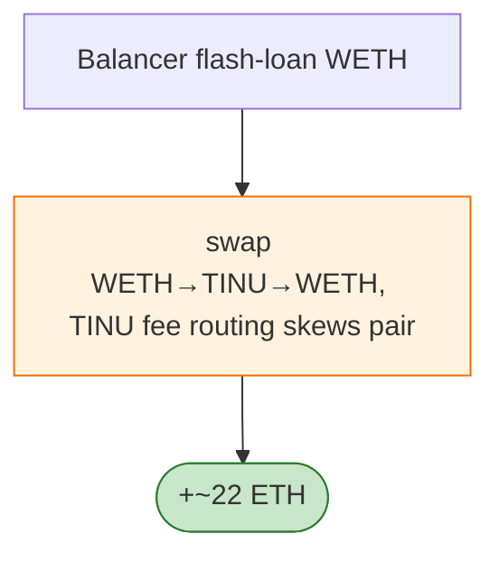

# TomInu (TINU) Exploit — Reflective Token `_takeFee`/LP-fee Skim (Balancer Flash)

> **Reproduction:** the PoC compiles & runs in an isolated Foundry project at
> [this project folder](.). Full verbose trace: [output.txt](output.txt).
> Verified vulnerable source: [TomInu](sources/TomInu_2d0e64).

---

## Key info

| | |
|---|---|
| **Loss** | ~22 ETH |
| **Vulnerable contract** | TomInu (reflective ERC20) `0x2d0E64B6…`; TINU/WETH pair `0xb835752F…` |
| **Attacker** | `0x14d8ada7…` (contract `0xdb2d869a…`) |
| **Attack tx** | `0x6200bf5c43c214caa1177c3676293442059b4f39eb5dbae6cfd4e6ad16305668` |
| **Flash source** | Balancer Vault `0xBA122222…` |
| **Chain / block / date** | Ethereum mainnet / 16,489,408 / Jan 2023 |
| **Bug class** | Reflective-token fee accounting — TINU's `_takeFee`/reflection routes fees to the LP/contract inconsistently with the pair's reserves; a Balancer-flash-funded swap captures the fee divergence. |

---

## TL;DR

TINU is a reflective ERC20 that, on transfer, takes a fee and routes part to the pair/contract. The
inconsistency between the fee deduction and the pair's stored reserves lets the attacker, after a
Balancer flash loan, swap TINU↔WETH such that the effective output exceeds the fee-corrected AMM output,
netting ~22 ETH.

---

## Root cause

A **reflective/fee-on-transfer token in a vanilla Uniswap-V2 pair** whose fee routing mutates balances
the pair cannot reconcile (`libevm` analysis cited in the PoC).

---

## Diagrams



---

## Remediation

1. Don't list reflective/fee tokens in vanilla pairs; wrap or use fee-aware pairs.
2. `k` check on received amounts.

---

## How to reproduce

```bash
_shared/run_poc.sh 2023-01-TINU_exp --mt testHack -vvvvv
```

- RPC: mainnet archive (block 16,489,408). Result: `[PASS]` — ~22 ETH profit.

---

*Reference: TomInu reflective-token fee divergence, mainnet, Jan 2023 (~22 ETH).*
