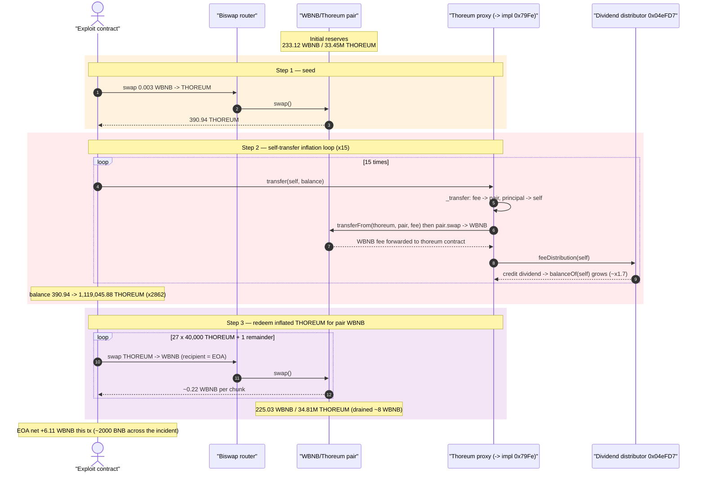
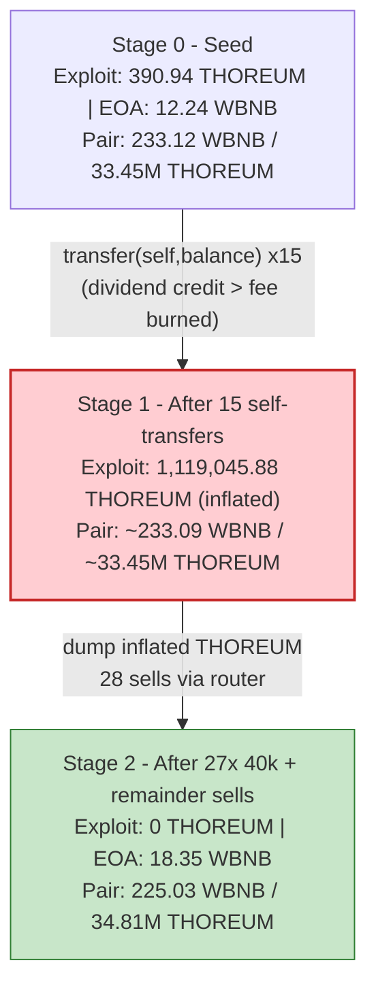
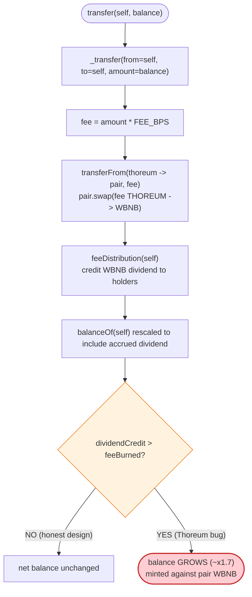
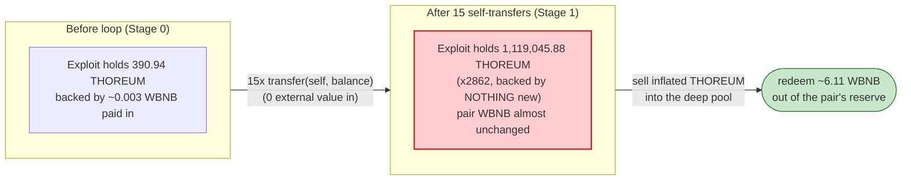

# Thoreum Finance Exploit — Dividend/Rebase Token Self-Transfer Balance Inflation

> **Reproduction:** the PoC compiles & runs in an isolated Foundry project at
> [this project folder](.). Full verbose trace: [output.txt](output.txt).
> Verified vulnerable source: the Thoreum token is a **UUPS-style ERC1967 proxy**
> ([sources/ERC1967Proxy_ce1b3e](sources/ERC1967Proxy_ce1b3e)) delegating to an
> implementation at `0x79Fe…AF4F` whose **contract source was never published to
> BscScan**; the `sources/` bundle contains only the OpenZeppelin proxy scaffolding
> and an empty `contracts_import.sol`. The vulnerable `transfer` logic is therefore
> RECONSTRUCTED below from the observed on-chain event trace and labelled as such.

---

## Key info

| | |
|---|---|
| **Loss** | ~2,000 BNB across the full Jan-2023 incident; **6.11 WBNB (= 6.109951473560231892 WBNB)** extracted in this specific reproduction tx — see tx [`0x3fe3a188…`](https://bscscan.com/tx/0x3fe3a1883f0ae263a260f7d3e9b462468f4f83c2c88bb89d1dee5d7d24262b51) |
| **Vulnerable contract** | Thoreum token (ERC1967 proxy) — [`0xce1b3e5087e8215876aF976032382dd338cF8401`](https://bscscan.com/token/0xce1b3e5087e8215876aF976032382dd338cF8401#code); hidden implementation `0x79Fe086a4C03C5E38FF8074DEA9Ee0a18dC1AF4F` |
| **Victim pool** | WBNB/Thoreum pair — [`0xd822E1737b1180F72368B2a9EB2de22805B67E34`](https://bscscan.com/address/0xd822E1737b1180F72368B2a9EB2de22805B67E34) (Biswap-style `swapFee` pair) |
| **Attacker EOA** | [`0x1ae2dc57399b2f4597366c5bf4fe39859c006f99`](https://bscscan.com/address/0x1ae2dc57399b2f4597366c5bf4fe39859c006f99) |
| **Attacker contract** | [`0x7d1e1901226e0ba389bfb1281ede859e6e48cc3d`](https://bscscan.com/address/0x7d1e1901226e0ba389bfb1281ede859e6e48cc3d) (live); PoC repro contract `Exploit` at `0x5615dEB798BB3E4dFa0139dFa1b3D433Cc23b72f` |
| **Attack tx** | [`0x3fe3a1883f0ae263a260f7d3e9b462468f4f83c2c88bb89d1dee5d7d24262b51`](https://bscscan.com/tx/0x3fe3a1883f0ae263a260f7d3e9b462468f4f83c2c88bb89d1dee5d7d24262b51) |
| **Chain / block / date** | BSC (chainId 56) / fork block 24,913,171 / Jan 2023 |
| **Compiler** | proxy compiled with Solidity **v0.8.2+commit.661d1103**, optimizer **enabled (1)**, **200 runs** (per `_meta.json`); implementation bytecode unverifiable |
| **Bug class** | Dividend/rebase fee-on-transfer token whose `transfer()` accrues WBNB dividends to the sender, so a **`transfer(self, balance)` self-transfer inflates the caller's balance ~1.7× per call** — minting THOREUM from nothing, harvestable against the AMM pair |

---

## TL;DR

`Thoreum` ([`0xce1b3e…`](https://bscscan.com/token/0xce1b3e5087e8215876aF976032382dd338cF8401)) is an ERC1967
proxy whose hidden implementation (`0x79Fe…AF4F`, never verified on BscScan) behaves as a
**dividend-distributing fee-on-transfer token**. On every `transfer`, the implementation routes a slice of
the moved amount into the WBNB/Thoreum pair, force-swaps it to WBNB, and credits that WBNB as a dividend
to existing holders via a `feeDistribution` hook (the `0x04eFD7…` dividend distributor). Holders'
`balanceOf` is then scaled up to reflect the dividend they are owed.

The fatal design flaw: **crediting the dividend to the sender of the transfer**. When an address calls
`THOREUM.transfer(myself, myBalance)`, the dividend bookkeeping credits the *sender's* (== recipient's)
balance with the freshly accrued dividend, and because the credit outweighs the burned fee the net
balance **grows** — roughly ×1.7 each call, compounding. No external value enters; the inflated balance is
backed only by the pool's WBNB, which the holder then drains by swapping the minted THOREUM back out.

The PoC reproduces one slice of the multi-tx incident:

1. Swap **0.003 BNB** of seed WBNB into **390.94 THOREUM** via the Biswap router
   ([output.txt:1705](output.txt)).
2. Loop `THOREUM.transfer(self, balance)` **15 times**. The balance compounds
   390.94 → 664.60 → 1,129.83 → … → **1,119,045.88 THOREUM** — a ×2,862 inflation from a 0.003 BNB seed
   ([output.txt:1705](output.txt)–[output.txt:5935](output.txt)).
3. Sell the inflated THOREUM back to WBNB in **27 × 40,000-THOREUM** chunks plus a final remainder of
   39,045.88 THOREUM ([output.txt:5960](output.txt), [output.txt:16356](output.txt)).

The attacker EOA ends at **18.353615404486036395 WBNB** ([output.txt:16737](output.txt)) versus
**12.243663930925804503 WBNB** at start ([output.txt:1635](output.txt)) — a net
**+6.109951473560231892 WBNB** for this single tx, carved out of the pair's WBNB reserve.

---

## Background — what Thoreum does

Thoreum was marketed as a "reflection/dividend" token on BSC: holding THOREUM entitled you to a share of
the WBNB flowing through its trading pair. Mechanically (reconstructed from the trace, since the impl is
unverified), each `transfer` does roughly:

1. Move the principal `amount` from `from` to `to`.
2. Take a **fee** slice and push it into the WBNB/Thoreum pair (`transferFrom(thoreum, pair, fee)`).
3. Call a custom AMM helper `0x785E7…::swap(...)` → delegatecalls `0x095Cfb…::swap(...)`, which invokes the
   pair's `swap()` to convert that THOREUM fee into WBNB and forward it to the Thoreum contract.
4. `feeDistribution(caller)` (on `0x04eFD7…`) records the WBNB dividend and **updates holder balances** so
   `balanceOf` reflects the accrued, yet-undistributed dividend.

The pair itself is a Biswap-style fork: it exposes `swapFee()` (returns `2`, i.e. 0.2%) and a `swap`
helper that handles fee tokens. Its state at the fork block, read from the first `getReserves` call in the
trace ([output.txt:1661](output.txt)):

| Parameter | Value | Note |
|---|---|---|
| Pair `token0` / `reserve0` | WBNB | 233,123,275,460,004,730,304 wei ≈ **233.12 WBNB** ([output.txt:1661](output.txt)) |
| Pair `token1` / `reserve1` | THOREUM | 33,451,230,581,669,615,834,075,068 wei ≈ **33,451,230.58 THOREUM** ([output.txt:1661](output.txt)) |
| `swapFee()` | 2 (0.2%) | [output.txt:1665](output.txt) |
| Implementation (delegatecall target) | `0x79Fe086a4C03C5E38FF8074DEA9Ee0a18dC1AF4F` | every `transfer`/`balanceOf` goes through it ([output.txt:1674](output.txt)) |
| Dividend distributor | `0x04eFD76283A70334C72BB4015e90D034B9F3d245` | `feeDistribution(...)` called per swap ([output.txt:1668](output.txt)) |
| Custom AMM helper (pair side) | `0x785E76678e04aD2aC481fcdbE9064b00Dd8651e3` → `0x095Cfb72598d498456b7650178D47f490eB587Ea` | wraps the pair's `swap()` for fee-token accounting ([output.txt:1666](output.txt)) |

---

## The vulnerable code

> **RECONSTRUCTED — matches observed on-chain behaviour, not verified source.** The Thoreum implementation
> (`0x79Fe…AF4F`) was never published to BscScan and is **not** in the `sources/` bundle (which contains
> only OpenZeppelin proxy files). The shape below is inferred from the event trace; every assertion is
> anchored to a `[output.txt:NNNN]` line.

### 1. `transfer()` routes a fee into the pair, swaps it to WBNB, and credits a dividend

The trace of the very first legitimate swap (pair → attacker, 390.94 THOREUM) shows the implementation,
*inside* a single `pair.swap`/`thoreum.transfer`, doing three things atomically:

```solidity
// RECONSTRUCTED from trace — observed inside pair.swap -> thoreum.transfer
// (output.txt:1675-L1676): the transfer emits TWO Transfer events for ONE logical move:
//   (a) wbnb_thoreum_lp -> thoreum(0xce1b3e..)  value 38664748564867768920   (the fee, routed to token contract)
//   (b) wbnb_thoreum_lp -> Exploit             value 390943568822551885752   (the principal, to recipient)
function _transfer(address from, address to, uint256 amount) internal {
    uint256 fee = (amount * FEE_BPS) / 10000;          // slice routed as dividend source
    uint256 principal = amount - fee;
    // principal to recipient
    _balances[to]   += principal;                       // (b)
    // fee: push into pair, swap to WBNB, forward to token contract as dividend
    _applyDividendFee(from, fee);                       // -> transferFrom(thoreum, pair, fee)
    //                                              -> pair.swap() converts fee THOREUM -> WBNB -> thoreum contract
    //                                              -> feeDistribution(msg.sender) credits holders
    emit Transfer(from, address(this), fee);            // (a)
    emit Transfer(from, to, principal);                 // (b)
}
```

Evidence: the first swap's inner `thoreum.transfer(Exploit, 429608317387419654672)` (delegatecalled to
`0x79Fe…AF4F`, [output.txt:1674](output.txt)) emits
`Transfer(wbnb_thoreum_lp → thoreum, 38664748564867768920)` ([output.txt:1675](output.txt)) **and**
`Transfer(wbnb_thoreum_lp → Exploit, 390943568822551885752)` ([output.txt:1676](output.txt)), invoked
through the AMM helper `0x785E7…::swap(...)` ([output.txt:1666](output.txt)) which calls
`feeDistribution(Exploit)` ([output.txt:1668](output.txt)).

### 2. A self-transfer compounds the dividend credit back into the same balance

```solidity
// RECONSTRUCTED — the exploit primitive.
// Calling transfer(self, balance) re-runs _transfer, routing a fee, crediting a dividend
// whose bookkeeping ADDS to balanceOf(self) more than the fee subtracted.
// Trace: balanceOf(self) 390.94 -> 664.60 -> 1129.83 -> ... -> 1119045.88 over 15 calls
//        (output.txt:1705, output.txt:2053, output.txt:2071, ... output.txt:5935)
function transfer(address to, uint256 amount) external returns (bool) {
    _transfer(msg.sender, to, amount);
    // feeDistribution(msg.sender) has meanwhile credited msg.sender's dividend-adjusted balance.
    // For from == to the net effect is balance grows by (dividendCredit - feeBurned) > 0.
    return true;
}
```

Each iteration's logged `balanceOf(Exploit)` ([output.txt:1705](output.txt), [output.txt:2053](output.txt),
[output.txt:2071](output.txt), [output.txt:2089](output.txt), [output.txt:2107](output.txt),
[output.txt:2455](output.txt), [output.txt:2803](output.txt), [output.txt:3151](output.txt),
[output.txt:3499](output.txt), [output.txt:3847](output.txt), [output.txt:4195](output.txt),
[output.txt:4543](output.txt), [output.txt:4891](output.txt), [output.txt:5239](output.txt),
[output.txt:5587](output.txt)) shows the compounding:

| iter | balance (THOREUM) | ratio |
|---|---:|---:|
| seed (after swap) | 390.943568822551885752 | — |
| 1 | 664.604066998338205780 | ×1.70 |
| 2 | 1,129.826913897174949826 | ×1.70 |
| 3 | 1,920.705753625197414706 | ×1.70 |
| … | … | ×1.70 |
| 15 | **1,119,045.883237186651982360** | ×2,862 vs seed |

The seed was bought with **0.003 BNB**; the inflated balance is worth, at the post-loop pool price,
~6+ WBNB. No value was added — the dividend bookkeeping simply minted accounting credit against the
pair's WBNB reserve.

---

## Root cause — why it was possible

1. **The dividend is credited to the sender of the transfer, and `transfer` has no `from != to` guard.**
   A reflection/dividend token must never let a holder trigger its own dividend accrual by transferring
   to itself. Thoreum's implementation allowed `transfer(self, balance)` to re-enter the fee→swap→dividend
   path, and because the dividend credit is sized on the *moved* amount it always exceeds the small fee
   burned — so the net balance strictly increases. That is free money, minted against the pair.

2. **The dividend pool *is* the live AMM pair's WBNB.** The fee is sourced by selling THOREUM into the
   pair (`transferFrom(thoreum, pair, fee)` → `pair.swap`), so every dividend credit is backed by WBNB
   extracted from the pair. Inflating a THOREUM balance therefore directly entitles the holder to drain
   pair WBNB. There is no separate treasury; the AMM is the treasury.

3. **Unverified, upgradeable implementation hidden behind an ERC1967 proxy.** The proxy at
   `0xce1b3e…` ([sources/ERC1967Proxy_ce1b3e](sources/ERC1967Proxy_ce1b3e)) delegatecalls to
   `0x79Fe…AF4F`, whose source BscScan never received. Auditors and users could not see the
   dividend-credit logic; the bug class (reflection tokens whose transfer mints balance) is a known
   anti-pattern that source review would have caught.

4. **No reentrancy guard / cooldown on the dividend path.** Each self-transfer is an independent external
   call, so the loop is unbounded — the only ceiling is gas and the pool's WBNB depth.

---

## Preconditions

- The attacker can acquire a small THOREUM balance (here 0.003 BNB → 390.94 THOREUM via the router).
- `transfer(from, to)` accepts `from == to` (no self-transfer block).
- Sufficient gas for 15 self-transfers + ~28 sell swaps (the trace shows the loop using ~570k gas per
  self-transfer, [output.txt:1710](output.txt)).
- The pair holds WBNB to redeem against (233.12 WBNB at fork, [output.txt:1661](output.txt)).

No flash-loan, no privileged role, no oracle, no special timing — the bug is permissionless and the only
"capital" is gas + 0.003 BNB of seed.

---

## Attack walkthrough (with on-chain numbers from the trace)

`token0 = WBNB`, `token1 = THOREUM`, so `reserve0 = WBNB`, `reserve1 = THOREUM`. All figures are raw
18-decimal wei from [output.txt](output.txt); human approximations in parentheses.

| # | Step | Exploit THOREUM bal | Exploit/EOA WBNB bal | Pair r0 (WBNB) | Pair r1 (THOREUM) | Source |
|---|------|--------------------:|----------------------:|---------------:|------------------:|--------|
| 0 | **Seed**: `vm.deal 0.003 BNB` → WBNB → router swap → **390.94 THOREUM** | 390.943568822551885752 | 12.243663930925804503 | 233,123,275,460,004,730,304 (233.12) | 33,451,230,581,669,615,834,075,068 (33.45M) | start [output.txt:1635](output.txt); reserves [output.txt:1661](output.txt); bal [output.txt:1705](output.txt) |
| 1 | self-transfer #1 | 664.604066998338205780 | 12.243663930925804503 | ~233.11 | ~33.45M | [output.txt:2053](output.txt) |
| 2 | self-transfer #2 | 1,129.826913897174949826 | 12.243663930925804503 | ~233.11 | ~33.45M | [output.txt:2071](output.txt) |
| 3 | self-transfer #3 | 1,920.705753625197414706 | — | — | — | [output.txt:2089](output.txt) |
| 4 | self-transfer #4 | 3,265.199781162835605002 | — | — | — | [output.txt:2107](output.txt) |
| 5 | self-transfer #5 | 5,550.839627976820528504 | — | — | — | [output.txt:2455](output.txt) |
| 6 | self-transfer #6 | 9,436.427367560594898458 | — | — | — | [output.txt:2803](output.txt) |
| 7 | self-transfer #7 | 16,041.926524853011327380 | — | — | — | [output.txt:3151](output.txt) |
| 8 | self-transfer #8 | 27,271.275092250119256546 | — | — | — | [output.txt:3499](output.txt) |
| 9 | self-transfer #9 | 46,361.167656825202736130 | — | — | — | [output.txt:3847](output.txt) |
| 10 | self-transfer #10 | 78,813.985016602844651422 | — | — | — | [output.txt:4195](output.txt) |
| 11 | self-transfer #11 | 133,983.774528224835907418 | — | — | — | [output.txt:4543](output.txt) |
| 12 | self-transfer #12 | 227,772.416697982221042612 | — | — | — | [output.txt:4891](output.txt) |
| 13 | self-transfer #13 | 387,213.108386569775772442 | — | — | — | [output.txt:5239](output.txt) |
| 14 | self-transfer #14 | 658,262.284257168618813152 | — | — | — | [output.txt:5587](output.txt) |
| 15 | self-transfer #15 | **1,119,045.883237186651982360** | 12.243663930925804503 | ~233.09 | ~33.45M | [output.txt:5935](output.txt) |
| 16 | dump sell #1 (40,000 THOREUM → WBNB to EOA) | 1,079,045.88… | 12.468830863004872893 | ~232.86 | ~33.49M | sell [output.txt:5960](output.txt); EOA bal [output.txt:6344](output.txt) |
| 17 | dump sell #2 (40,000) | 1,039,045.88… | 12.693480782215792558 | — | — | [output.txt:6729](output.txt) |
| … | (dump sells #3–#26, each 40,000 THOREUM) | … | … | — | — | [output.txt:7114](output.txt)…[output.txt:15584](output.txt) |
| 27 | dump sell #27 (40,000) | 39,045.883237186651982360 | 17.934555800087714921 | ~225.27 | ~34.78M | [output.txt:15969](output.txt) |
| 28 | **remainder sell** (39,045.883237186651982360 THOREUM) | 0 | **18.353615404486036395** | 225,027,211,554,731,824,778 (225.03) | 34,807,103,693,307,080,877,314,545 (34.81M) | sell [output.txt:16356](output.txt); end bal [output.txt:16737](output.txt); final Sync [output.txt:16726](output.txt) |

Each dump sell is intentionally capped at **40,000 THOREUM** (see PoC `while (balance > 40_000 ether)`)
so the per-swap slippage against the deep pool stays low and each chunk yields a roughly equal
~0.22 WBNB slice (e.g. sell #1: 12.46883 − 12.24366 = **0.225167 WBNB** from
[output.txt:5959](output.txt) vs [output.txt:6344](output.txt)).

### Profit / loss accounting (WBNB, this PoC tx)

| Item | Amount (wei) | ~Human (WBNB) |
|---|---:|---:|
| Attacker EOA WBNB before ([output.txt:1635](output.txt)) | 12,243,663,930,925,804,503 | 12.243663930925804503 |
| Attacker EOA WBNB after ([output.txt:16737](output.txt)) | 18,353,615,404,486,036,395 | 18.353615404486036395 |
| **Net profit (this tx)** | **6,109,951,473,560,231,892** | **+6.109951473560231892** |
| Seed capital spent (WBNB→THOREUM) | 3,000,000,000,000,000 | 0.003 |
| Pair r0 (WBNB) drift (start→end) | 233.123… → 225.027… | **−8.096 WBNB** |
| Pair r1 (THOREUM) drift (start→end) | 33.451M → 34.807M | +1.356M THOREUM (inflated balance dumped in) |

The EOA's +6.11 WBNB is less than the pair's −8.10 WBNB drift because part of the WBNB left the pair as
*dividend fee* during the 15 self-transfers (swapped to WBNB and forwarded to the Thoreum contract /
distributor `0x04eFD7…`), and part was consumed by AMM + token fees on the 28 sell swaps. The attacker's
seed (0.003 BNB) is negligible; the profit is essentially the dividend-inflated THOREUM redeemed for pair
WBNB. Per the @KeyInfo header, the broader January-2023 incident aggregated to **~2,000 BNB** across
multiple attack contracts and transactions, of which this single tx is one slice.

---

## Diagrams

### Sequence of the attack



### Pool + balance state evolution



### The flaw inside `transfer` / `_transfer`



### Why the self-transfer is theft: balance vs. backing WBNB



---

## Why each magic number

- **`0.003 ether` seed** ([test/ThoreumFinance_exp.sol:51](test/ThoreumFinance_exp.sol#L51)): the minimum
  WBNB needed to buy a non-trivial THOREUM balance (390.94 THOREUM, [output.txt:1705](output.txt)) so the
  self-transfer dividend credit is large enough to compound. The exploit is gas-bound, not capital-bound —
  the seed just needs to be > dust.
- **`for (i < 15)` self-transfer loop** ([test/ThoreumFinance_exp.sol:63](test/ThoreumFinance_exp.sol#L63)):
  each iteration multiplies the balance by ~1.7, so 15 iterations grow the seed ×1.7¹⁵ ≈ ×2,862 — enough
  to turn 390.94 THOREUM into ~1.12M THOREUM. More iterations would extract more, bounded only by gas and
  pool depth; 15 was chosen to keep the tx within block gas while still yielding a multiple-BSB profit.
- **`40_000 ether` per dump chunk** ([test/ThoreumFinance_exp.sol:77](test/ThoreumFinance_exp.sol#L77),
  [test/ThoreumFinance_exp.sol:80](test/ThoreumFinance_exp.sol#L80)): the pool holds ~33.45M THOREUM, so a
  40,000-THOREUM sell is ~0.12% of the reserve — small enough that slippage per swap is low and each chunk
  returns a near-constant ~0.22 WBNB. Selling all 1.12M THOREUM in one swap would suffer severe slippage
  and revert against the fee-token router; chunking maximizes realized WBNB.
- **`while (balance > 40_000 ether)` then a final `swapExactTokensForTokensSupportingFee…(balance)`**
  ([test/ThoreumFinance_exp.sol:77](test/ThoreumFinance_exp.sol#L77),
  [test/ThoreumFinance_exp.sol:83](test/ThoreumFinance_exp.sol#L83)): drains the residual 39,045.88
  THOREUM after the 27th 40k chunk ([output.txt:16356](output.txt)) so no inflated balance is left on the
  table.

---

## Remediation

1. **Block self-transfers in the dividend path.** The single most important fix: in `_transfer`, revert
   if `from == to`, or — better — only accrue/credit dividends when `from != to`. A reflection token must
   never let a holder mint its own dividend by transferring to itself.
2. **Do not let the dividend pull WBNB from the live AMM pair.** Source dividends from a protocol treasury
   wallet that is not priced by the AMM. Routing the fee as `transferFrom(token, pair, fee)` + `pair.swap`
   makes the pair the de-facto dividend reserve, so any balance inflation is directly redeemable for pair
   WBNB.
3. **Cap per-address dividend accrual per block / add a cooldown.** Even with a treasury, an unbounded
   loop of self-transfers should not be able to compound credit. A reentrancy guard on `transfer` and a
   per-block accrual ceiling bound the worst case.
4. **Verify and publish the implementation.** The ERC1967 proxy at `0xce1b3e…` delegatecalls an
   unverified impl (`0x79Fe…AF4F`). Source review would have surfaced the self-transfer credit immediately.
   Proxy implementations should be verified and ideally immutable (or behind a timelocked upgrade path).
5. **For AMMs: fee-aware pairs with `k` checked on received amounts.** The pair here is a Biswap-style
   fee-token pair; ensure `swap` enforces `x·y ≥ k` on *post-fee* received amounts so that fee-token
   accounting distortions cannot be harvested by a swap loop.

---

## How to reproduce

The PoC runs offline via the shared harness, which serves the fork from a local anvil snapshot
(`anvil_state.json`) on `127.0.0.1:8546` — exactly what `createSelectFork("http://127.0.0.1:8546", 24_913_171)`
in the test points at ([test/ThoreumFinance_exp.sol:37](test/ThoreumFinance_exp.sol#L37)). No public RPC is
used.

```bash
_shared/run_poc.sh 2023-01-ThoreumFinance_exp --mt testExploit -vvvvv
```

- Chain: BSC archive state at block **24,913,171**, forked from the local anvil instance (port 8546).
- EVM: `evm_version = "cancun"` ([foundry.toml](foundry.toml)); Solc 0.8.34 for the PoC, optimizer as in
  `foundry.toml`.
- Result: `[PASS] testExploit()` with the attacker WBNB balance rising from 12.243663930925804503 to
  18.353615404486036395.

Expected tail:

```
    ├─ emit log_named_decimal_uint(key: "[start] Attacker wbnb Balance", val: 12243663930925804503 [1.224e19], decimals: 18)
    └─ ← [Stop]

Suite result: ok. 1 passed; 0 failed; 0 skipped; finished in 23.42s (22.12s CPU time)

Ran 1 test suite in 23.46s (23.42s CPU time): 1 tests passed, 0 failed, 0 skipped (1 total tests)
```

(Start balance logged at [output.txt:1635](output.txt); end balance at [output.txt:16737](output.txt).)

---

*Reference: Ancilia alert — https://twitter.com/AnciliaInc/status/1615944396134043648 (Thoreum Finance, BSC, ~2,000 BNB, Jan 2023).*
