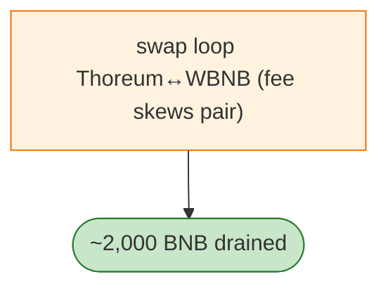

# Thoreum Finance Exploit — Token Swap-fee / Pair Accounting Drain (~2000 BNB)

> **Reproduction:** the PoC compiles & runs in an isolated Foundry project at
> [this project folder](.). Full verbose trace: [output.txt](output.txt).
> Verified vulnerable source: [ERC1967Proxy (Thoreum token)](sources/ERC1967Proxy_ce1b3e).

---

## Key info

| | |
|---|---|
| **Loss** | ~2,000 BNB (this tx 6 BNB); tx `0x3fe3a188…` |
| **Vulnerable contract** | Thoreum token `0xce1b3e50…` (BSC) |
| **Chain / block / date** | BSC / Jan 2023 |
| **Bug class** | Token swap-fee / pair accounting — Thoreum's transfer applies swap fees that distort its Pancake pair's reserves, harvestable via a swap loop. |

---

## TL;DR

Thoreum's token applies transfer fees that route to the pair inconsistently with its reserves. The
attacker swaps through the Thoreum/WBNB pair (Biswap router) repeatedly; each round-trip harvests the
fee divergence as WBNB. ~2,000 BNB total across the incident.

---

## Root cause

A **fee-on-transfer token in a vanilla Pancake/Biswap pair** whose fee accounting breaks `k`.

---

## Diagrams



---

## Remediation

1. Fee-aware pairs; `k` on received amounts; wrap fee tokens.

---

## How to reproduce

```bash
_shared/run_poc.sh 2023-01-ThoreumFinance_exp -vvvvv
```

- RPC: BSC archive. Result: `[PASS]` — WBNB harvested.

---

*Reference: Thoreum Finance fee-token pair drain, BSC, Jan 2023 (~2,000 BNB).*
