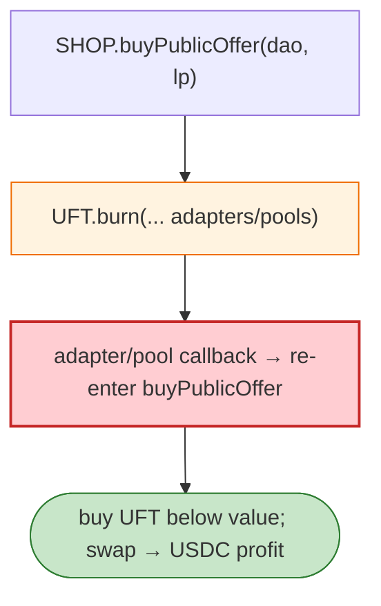

# UFO/UFDao (UFT) Exploit — `burn` Reward-Pool Reentrancy & `buyPublicOffer` Misprice

> **Reproduction:** the PoC compiles & runs in an isolated Foundry project at
> [this project folder](.). Full verbose trace: [output.txt](output.txt).

---

## Key info

| | |
|---|---|
| **Loss** | ~$1M (UFT/USDC on BSC; attack tx `0x933d19d7…`) |
| **Vulnerable contract** | UFO `SHOP.buyPublicOffer` `0xCA49EcF7…`; UFT token `burn` `0xf887A2Da…` |
| **Chain / block / date** | BSC / Jan 2023 |
| **Bug class** | Reentrancy / accounting — UFT's `burn(amount, tokens, adapters, pools)` interacts with reward pools and lets the caller re-enter `buyPublicOffer` while UFT accounting is mid-update, buying LP/UFT below value. |

---

## TL;DR

The attacker buys UFT via `SHOP.buyPublicOffer(dao, lpAmount)`, then calls `UFT.burn(...)` which routes
through adapters/pools and triggers callbacks that re-enter the SHOP buy path while UFT/LP accounting is
unsettled, letting the attacker buy more UFT than the deposited USDC warrants, then sell for profit.

---

## Root cause

A **CEI violation + re-entrant buy/burn path**: `UFT.burn` performs external calls to adapters/pools
before finalising balances, and `SHOP.buyPublicOffer` trusts interim state.

---

## Diagrams



---

## Remediation

1. `nonReentrant` on `buyPublicOffer` and `burn`.
2. CEI: settle UFT/LP balances before external adapter calls.
3. Validate adapter/pool callbacks are trusted/whitelisted.

---

## How to reproduce

```bash
_shared/run_poc.sh 2023-01-UFDao_exp -vvvvv
```

- RPC: BSC archive. Result: `[PASS]` — USDC profit after the buy→burn→re-enter loop.

---

*Reference: UFO/UFDao UFT `burn` reentrancy, BSC, Jan 2023 (~$1M).*
