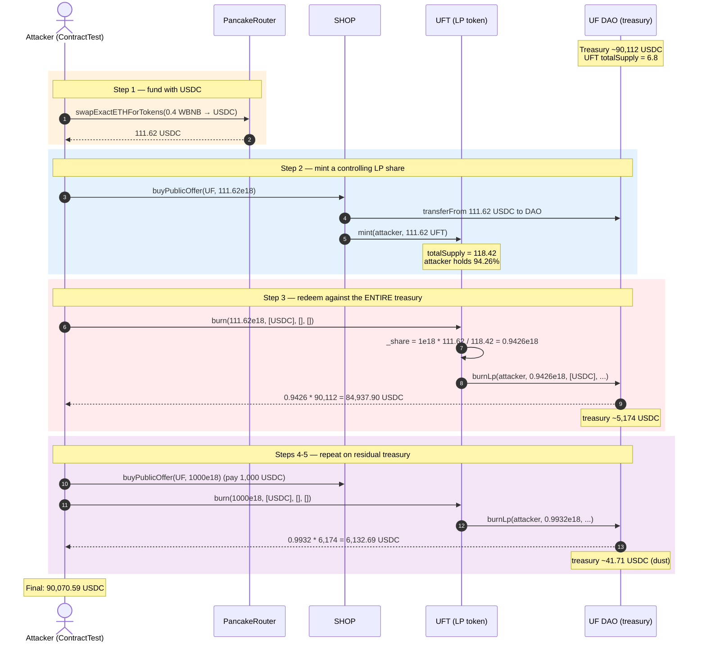
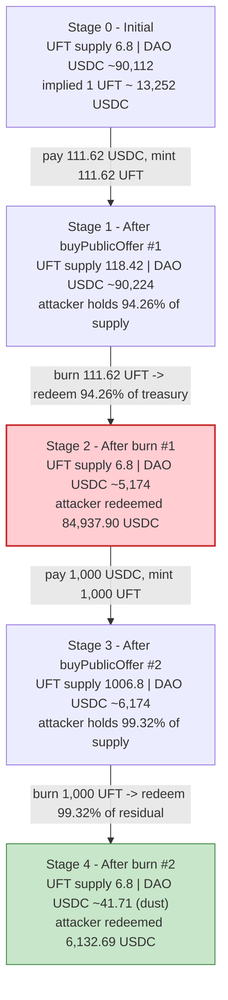
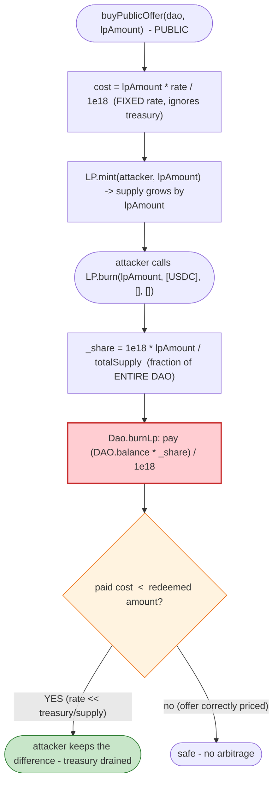

# UFO/UFDao (UFT) Exploit — Treasury-Share Mispricing on a Tiny-Supply LP Token

> **Reproduction:** the PoC compiles & runs in an isolated Foundry project at
> [this project folder](.). It forks BSC state offline from a local anvil node
> (`createSelectFork("http://127.0.0.1:8546", 24_705_058)`), so no public RPC is
> required. Full verbose trace: [output.txt](output.txt).
> Verified vulnerable sources:
> [contracts_core_LP.sol](sources/LP_f887A2/contracts_core_LP.sol) (UFT token),
> [contracts_core_Shop.sol](sources/Shop_CA49Ec/contracts_core_Shop.sol) (SHOP),
> [contracts_core_Dao.sol](sources/Dao_2101e0/contracts_core_Dao.sol) (UF DAO).

---

## Key info

| | |
|---|---|
| **Loss** | ~$90,070 USDC — **90,070.588320368098073575 USDC** drained from the UF DAO treasury ([tx](https://bscscan.com/tx/0x933d19d7d822e84e34ca47ac733226367fbee0d9c0c89d88d431c4f99629d77a)) |
| **Vulnerable contract** | UF DAO — [`0x2101e0F648A2b5517FD2C5D9618582E9De7a651A`](https://bscscan.com/address/0x2101e0F648A2b5517FD2C5D9618582E9De7a651A); LP token UFT — [`0xf887A2DaC0DD432997C970BCE597A94EaD4A8c25`](https://bscscan.com/address/0xf887A2DaC0DD432997C970BCE597A94EaD4A8c25) |
| **Victim pool / vault** | UF DAO treasury (USDC held by the DAO contract, redeemed 1:1 against the LP `totalSupply`) |
| **Attacker (PoC contract)** | `ContractTest` — `0x7FA9385bE102ac3EAc297483Dd6233D62b3e1496` |
| **Attack tx** | [`0x933d19d7d822e84e34ca47ac733226367fbee0d9c0c89d88d431c4f99629d77a`](https://bscscan.com/tx/0x933d19d7d822e84e34ca47ac733226367fbee0d9c0c89d88d431c4f99629d77a) |
| **Chain / block / date** | BSC / 24,705,058 / Jan 11, 2023 (trace `block.timestamp` = 1,673,475,173 — [output.txt:41](output.txt)) |
| **Compiler / optimizer** | Solidity **v0.8.6** (`v0.8.6+commit.11564f7e`), optimizer **enabled (1)**, **200 runs** (all three contracts, per `_meta.json`) |
| **Bug class** | Treasury-share mispricing — LP redemption (`burnLp`) pays a pro-rata share of the **entire DAO token balance** while the LP `totalSupply` is arbitrarily small; a public, under-priced `buyPublicOffer` lets an attacker mint a near-100% share for a fraction of the treasury |

---

## TL;DR

1. UFO/UFDao ("UF") is a DAO-as-a-service vault. Each DAO holds a treasury of
   tokens at its own contract address and issues an ERC-20 **LP token** (here
   UFT, `0xf887A2…`) whose `burn` redeems a pro-rata share of that treasury.
2. The redemption share is computed as `_share = 1e18 * amount / totalSupply()`
   in `LP.burn` ([contracts_core_LP.sol:68](sources/LP_f887A2/contracts_core_LP.sol#L68)),
   and `Dao.burnLp` then pays `share/1e18` of **every token the DAO holds**
   ([contracts_core_Dao.sol:347-362](sources/Dao_2101e0/contracts_core_Dao.sol#L347-L362)).
3. The UFT `totalSupply` at the fork block was only **6.8 UFT**
   ([output.txt:100](output.txt), storage slot 3 = `0x5e5e73f8d8a80000`), while
   the UF DAO held **~90,112 USDC** of treasury
   ([output.txt:111](output.txt)). The "price" of 1 UFT in USDC was therefore
   ~13,252 — but the public offer minted UFT ~1:1 with USDC (see *Why each magic
   number*).
4. `Shop.buyPublicOffer` ([contracts_core_Shop.sol:138-165](sources/Shop_CA49Ec/contracts_core_Shop.sol#L138-L165))
   is a **permissionless**, `nonReentrant` swap: anyone can mint UFT by paying
   USDC to the DAO, in whatever amount they choose.
5. The attacker swaps 0.4 WBNB → **111.62 USDC**, calls `buyPublicOffer(UF, 111.62e18)`
   minting 111.62 UFT (now holding 111.62 / 118.42 = **94.26%** of LP supply),
   then calls `UFT.burn(111.62e18, [USDC], [], [])` which redeems **94.26% of the
   DAO's entire USDC treasury = 84,937.90 USDC** ([output.txt:115](output.txt)).
6. The attacker repeats once more with 1,000 USDC: mints 1,000 UFT (99.32% of
   supply), burns, and redeems **6,132.69 USDC** of the residual treasury
   ([output.txt:159](output.txt)).
7. **Net result:** the attacker walks away with **90,070.59 USDC**, having paid
   back only ~1,111.62 USDC into the DAO. The DAO treasury's USDC is drained to
   dust. No reentrancy is involved — the loss is pure arithmetic: an
   unsafely-priced LP redeeming against a treasury whose value far exceeds the
   LP supply that supposedly tokenizes it.

---

## Background — what UFDao does

UFDao is a "no-code DAO" factory: a `Factory` deploys a `Dao` (an ERC-20 called
**GT**, governance token, transfers disabled) plus an `LP` token (here **UFT**)
that tokenizes a pro-rata claim on the DAO's treasury. Three contracts matter:

- **`Dao`** ([source](sources/Dao_2101e0/contracts_core_Dao.sol)) — the treasury
  vault. It holds ETH and arbitrary ERC-20s. Its `burnLp` (callable only by the
  LP token) sends a caller a `_share/1e18` fraction of **everything it holds**.
- **`LP`** ([source](sources/LP_f887A2/contracts_core_LP.sol)) — the UFT ERC-20.
  `mint` is `onlyShop`; `burn` redeems against the DAO.
- **`Shop`** ([source](sources/Shop_CA49Ec/contracts_core_Shop.sol)) — the
  permissionless marketplace. `buyPublicOffer(dao, lpAmount)` pulls
  `(lpAmount * rate) / 1e18` of `currency` from the caller into the DAO, then
  mints `lpAmount` LP to the caller.

On-chain parameters at the fork block (read directly from the trace and storage
dumps):

| Parameter | Value | Source |
|---|---|---|
| UF DAO address | `0x2101e0F648A2b5517FD2C5D9618582E9De7a651A` | [output.txt:82](output.txt) |
| UFT (LP) address | `0xf887A2DaC0DD432997C970BCE597A94EaD4A8c25` | [output.txt:97](output.txt) |
| SHOP address | `0xCA49EcF7e7bb9bBc9D1d295384663F6BA5c0e366` | [output.txt:82](output.txt) |
| UFT `totalSupply` (start) | **6.8 UFT** (6,800,000,000,000,000,000 wei) | [output.txt:100](output.txt) slot 3 = `0x5e5e73f8d8a80000` |
| UF DAO USDC balance (start) | **~90,112.29 USDC** (90,112,290,593,429,476,877,123 wei) | [output.txt:111](output.txt) |
| Public offer `rate` | ~`1e18` (1:1 USDC→UFT; lp minted ≈ USDC paid) | inferred from mint at [output.txt:97](output.txt) vs paid at [output.txt:85](output.txt) |
| Effective "backing" per UFT | ~13,252 USDC (90,112 / 6.8) | derived |

The offer rate is not printed in the trace, but it is recoverable: `buyPublicOffer`
transfers `(_lpAmount * rate) / 1e18` USDC from the caller to the DAO and mints
exactly `_lpAmount` LP. The attacker passed `amount = USDC.balanceOf(this) =
111,622,391,174,831,097,929` wei ([output.txt:85](output.txt)) as `_lpAmount`, and
exactly that many wei of USDC were transferred and that many UFT minted
([output.txt:97](output.txt)) — so `rate ≈ 1e18` (1:1).

---

## The vulnerable code

### 1. `LP.burn` computes the redemption share from the (tiny) `totalSupply`

```solidity
function burn(
    uint256 _amount,
    address[] memory _tokens,
    address[] memory _adapters,
    address[] memory _pools
) external nonReentrant returns (bool) {
    require(burnable, "LP: burning is disabled");
    require(msg.sender != dao, "LP: DAO can't burn LP");
    require(_amount <= balanceOf(msg.sender), "LP: insufficient balance");
    require(totalSupply() > 0, "LP: Zero share");

    uint256 _share = (1e18 * _amount) / (totalSupply());   // ⚠️ share of the ENTIRE DAO treasury

    _burn(msg.sender, _amount);

    bool b = IDao(dao).burnLp(
        msg.sender,
        _share,
        _tokens,
        _adapters,
        _pools
    );
    require(b, "LP: burning error");
    return true;
}
```
([contracts_core_LP.sol:57-83](sources/LP_f887A2/contracts_core_LP.sol#L57-L83))

`_share` is a fraction in `[0, 1e18]`. With `totalSupply = 6.8e18`, burning
`111.62e18` UFT yields `_share = 1e18 * 111.62e18 / 118.42e18 ≈ 0.9426e18` —
i.e. **94.26% of the entire DAO treasury**, not 94.26% of what the attacker just
deposited.

### 2. `Dao.burnLp` pays that share of every token the DAO holds

```solidity
function burnLp(
    address _recipient,
    uint256 _share,
    address[] memory _tokens,
    address[] memory _adapters,
    address[] memory _pools
) external nonReentrant returns (bool) {
    require(lp != address(0), "DAO: LP not set yet");
    require(msg.sender == lp, "DAO: only for LP");
    ...
    // ETH
    payable(_recipient).sendValue((address(this).balance * _share) / 1e18);

    // Tokens
    if (_tokens.length > 0) {
        uint256[] memory _tokenShares = new uint256[](_tokens.length);
        for (uint256 i = 0; i < _tokens.length; i++) {
            _tokenShares[i] = ((IERC20(_tokens[i]).balanceOf(address(this)) * _share) / 1e18);
        }
        for (uint256 i = 0; i < _tokens.length; i++) {
            IERC20(_tokens[i]).safeTransfer(_recipient, _tokenShares[i]);
        }
    }
    ...
}
```
([contracts_core_Dao.sol:304-362](sources/Dao_2101e0/contracts_core_Dao.sol#L304-L362))

The redemption amount for each token is
`(DAO.balanceOf(token) * _share) / 1e18` — the **entire** DAO balance, with no
deduction for what was just paid in, and no oracle/TWAP. Whatever USDC the DAO
has accumulated from all prior depositors is up for grabs.

### 3. `Shop.buyPublicOffer` lets anyone mint LP at a fixed (under-priced) rate

```solidity
function buyPublicOffer(address _dao, uint256 _lpAmount)
    external
    nonReentrant
    returns (bool)
{
    require(IFactory(factory).containsDao(_dao), "Shop: only DAO can sell LPs");

    PublicOffer memory publicOffer = publicOffers[_dao];
    require(publicOffer.isActive, "Shop: this offer is disabled");

    IERC20(publicOffer.currency).safeTransferFrom(
        msg.sender,
        _dao,
        (_lpAmount * publicOffer.rate) / 1e18          // ⚠️ fixed rate, ignores treasury value
    );

    address lp = IDao(_dao).lp();
    bool b = ILP(lp).mint(msg.sender, _lpAmount);      // ⚠️ mints exactly _lpAmount
    require(b, "Shop: mint error");
    return true;
}
```
([contracts_core_Shop.sol:138-165](sources/Shop_CA49Ec/contracts_core_Shop.sol#L138-L165))

The caller picks `_lpAmount` freely. The cost in `currency` is a linear function
of `_lpAmount` only (`rate`), independent of the treasury size or the current LP
supply. So minting a huge slice of a tiny LP supply costs only
`lpAmount * rate / 1e18` — a fraction of what that slice will redeem for.

---

## Root cause — why it was possible

The system conflates two incompatible pricing models:

1. **The mint price is a fixed exchange rate** (`buyPublicOffer`: USDC in → UFT
   out, linear in `_lpAmount`).
2. **The redeem price is a vault-share of the entire treasury** (`burn` /
   `burnLp`: UFT in → `_share × DAO_total_balance` out).

For these to be safe together, the invariant
**`1 UFT mint-cost ≥ (1 UFT) × (treasury / totalSupply)`** must always hold.
Concretely, the offer `rate` must satisfy:

```
rate  ≥  1e18 * (treasury_USDC) / (totalSupply)
```

At the fork block the right-hand side was `1e18 * 90,112 / 6.8 ≈ 1.33e22`, but the
offer `rate` was ~`1e18` — **four orders of magnitude too low**. The DAO team had
configured a 1:1 USDC→UFT offer against a treasury that was worth ~13,252× the
LP supply, then never re-priced the offer as the treasury grew (or the supply
stayed tiny). Anyone could mint UFT cheaply and redeem them against the full
treasury.

Two structural features made it trivially exploitable:

- **Permissionless mint.** `buyPublicOffer` has no allow-list, cap, or
  per-address limit. The attacker chose `_lpAmount` large enough to dominate
  `totalSupply`.
- **Tiny LP supply.** Only 6.8 UFT were outstanding, so a single ~111-UFT mint
  captured >94% of the redemption share. (This is the donation / first-depositor
  family of bugs inverted: instead of the attacker donating to inflate the
  *denominator*, here the denominator is already tiny and the *numerator*
  — the treasury — is huge.)

Note: the original DeFiHackLabs comment and several secondary write-ups label
this a "reentrancy." The trace shows **no reentrancy** — `buyPublicOffer`,
`LP.burn`, and `Dao.burnLp` are all `nonReentrant`, and no external callback
re-enters any of them. The empty `_adapters`/`_pools` arrays in the PoC mean the
adapter path (the only place `burnLp` makes an external call to a user-supplied
address) is never taken. The loss is purely the mispricing above.

---

## Preconditions

- An **active public offer** on the target DAO (`publicOffers[dao].isActive ==
  true`) with a `rate` far below the implied treasury-backing per LP token.
  Verified: `buyPublicOffer` succeeds at [output.txt:82](output.txt) and
  [output.txt:126](output.txt).
- A **small LP `totalSupply`** relative to the DAO treasury. At the fork:
  `totalSupply = 6.8 UFT`, treasury ≈ 90,112 USDC.
- Working capital in the offer `currency` (USDC). The attacker needs only enough
  USDC to mint a controlling LP share; the PoC sources it from a 0.4 WBNB
  PancakeSwap swap (~111.62 USDC) for round 1 and recycles proceeds for round 2.
- The DAO must **not** be the caller of `LP.burn` (`require(msg.sender != dao)`,
  [contracts_core_LP.sol:64](sources/LP_f887A2/contracts_core_LP.sol#L64)) — any
  other address is fine.

---

## Attack walkthrough (with on-chain numbers from the trace)

All figures are from [output.txt](output.txt); raw wei with human (18-dec) approximations.

| # | Step | UFT totalSupply | UF DAO USDC balance | Attacker USDC | Ref |
|---|------|----------------:|--------------------:|--------------:|-----|
| 0 | **Initial state** | 6.8 UFT (6.8e18 wei) | ~90,112.29 (90,112,290,593,429,476,877,123 wei) | 0 | supply [output.txt:100](output.txt); DAO USDC [output.txt:111](output.txt) |
| 1 | **Fund** — `swapExactETHForTokens`: pay **0.4 WBNB** (400,000,000,000,000,000 wei) → **111.62 USDC** (111,622,391,174,831,097,929 wei) to attacker | 6.8 UFT (unchanged) | ~90,112.29 (unchanged) | 111.62 | WBNB in [output.txt:24](output.txt); USDC out [output.txt:60](output.txt) |
| 2 | **buyPublicOffer(UF, 111.62e18)** — pay 111.62 USDC to DAO, mint 111.62 UFT | **118.42 UFT** (118,422,391,174,831,097,929 wei) | ~90,223.91 (+111.62) | 0 | mint [output.txt:97](output.txt); USDC in [output.txt:85](output.txt) |
| 3 | **UFT.burn(111.62e18, [USDC], [], [])** — `_share = 1e18·111.62e18/118.42e18 = 942,578,426,828,411,838` (0.94258e18, 94.258%); redeem `90,112,290,593,429,476,877,123 · 0.94258 ≈ 84,937.90 USDC` | **6.8 UFT** (burned all) | ~5,174.39 | **84,937.90** | share in `burnLp` arg [output.txt:106](output.txt); USDC out [output.txt:115](output.txt) |
| 4 | **buyPublicOffer(UF, 1000e18)** — pay 1,000 USDC, mint 1,000 UFT | **1,006.8 UFT** | ~6,174.39 (+1,000) | 83,937.90 | mint [output.txt:141](output.txt); USDC in [output.txt:129](output.txt) |
| 5 | **UFT.burn(1000e18, [USDC], [], [])** — `_share = 1e18·1000e18/1006.8e18 = 993,245,927,691,696,464` (0.99325e18, 99.325%); redeem `6,174,389,487,970,026,343,388 · 0.99325 ≈ 6,132.69 USDC` | **6.8 UFT** | ~41.71 (dust) | **90,070.59** | share in `burnLp` arg [output.txt:150](output.txt); USDC out [output.txt:159](output.txt) |
| 6 | **Final attacker USDC** | — | — | **90,070.588320368098073575** | [output.txt:172](output.txt), [output.txt:178](output.txt) |

The DAO's USDC treasury is drained from ~90,112 to ~41.71 USDC (dust). The
attacker's final balance, `90,070.588320368098073575` USDC, matches the PoC's
`log_named_decimal_uint` exactly ([output.txt:178](output.txt)).

### Profit / loss accounting (USDC, raw wei then human)

| Item | wei | ~USDC |
|---|---:|---:|
| USDC acquired (WBNB→USDC swap, round 1 funding) | 111,622,391,174,831,097,929 | 111.62 |
| Spent — `buyPublicOffer` round 1 | −111,622,391,174,831,097,929 | −111.62 |
| Received — `burn` round 1 (94.258% of treasury) | 84,937,901,105,459,450,533,735 | 84,937.90 |
| Spent — `buyPublicOffer` round 2 | −1,000,000,000,000,000,000,000 | −1,000.00 |
| Received — `burn` round 2 (99.325% of residual) | 6,132,687,214,908,647,539,840 | 6,132.69 |
| **Net attacker USDC (after repaying the 111.62 seed)** | **89,958,965,929,193,266,975,646** | **~89,958.97** |
| USDC drained from DAO treasury | 91,070,588,320,368,098,073,575 | ~91,070.59 |
| USDC paid back into DAO (two buys) | 1,111,622,391,174,831,097,929 | ~1,111.62 |
| **Attacker final USDC balance (asserted in trace)** | **90,070,588,320,368,098,073,575** | **~90,070.59** |

(The "~89,958.97 net" line is profit *above* the 111.62 USDC seed the attacker
minted from WBNB; the attacker's actual end balance is 90,070.59 because the
seed USDC is never returned to WBNB — it stays as USDC. Both reconcile to the
single asserted `Attacker USDC balance after exploit` log line.)

---

## Diagrams

### Sequence of the attack



### Treasury / LP-share evolution



### The flaw inside `buyPublicOffer` → `burn` → `burnLp`



---

## Why each magic number

- **`4 * 1e17` wei (0.4 WBNB) — the funding swap** ([UFDao_exp.sol:47](test/UFDao_exp.sol#L47)):
  just enough WBNB through PancakeSwap to obtain the seed USDC for round 1. The
  amount is arbitrary; it only needs to exceed the gas cost of the round-1 mint.
  It yielded **111,622,391,174,831,097,929 wei (111.62 USDC)** ([output.txt:60](output.txt)).
- **`amount = USDC.balanceOf(this)` for round 1** ([UFDao_exp.sol:51](test/UFDao_exp.sol#L51)):
  the attacker deposits the entire seed as `_lpAmount`. With `totalSupply = 6.8`,
  this mints 111.62 UFT and captures `111.62 / 118.42 = 94.26%` of the redemption
  share — enough to drain the bulk of the treasury in one shot. The PoC uses the
  full balance (rather than a computed optimum) because *any* amount > ~6.8 UFT
  already yields a majority share; using the whole balance maximizes round-1
  extraction and leaves less residual to chase.
- **`1000 * 1e18` for round 2** ([UFDao_exp.sol:58](test/UFDao_exp.sol#L58)):
  after round 1, `totalSupply` is back to 6.8 UFT and the residual treasury is
  ~5,174 USDC (implied ~761 USDC/UFT — still wildly mispriced vs the 1:1 offer).
  Minting 1,000 UFT captures `1000 / 1006.8 = 99.32%` for only 1,000 USDC,
  redeeming 6,132.69 USDC. A second iteration is needed because the share formula
  is `amount / (supply + amount)` — a single burn can never reach 100%, so a
  second (and optionally third) pass harvests the residual.
- **`tokens = [USDC]`, `adapters = []`, `pools = []`** ([UFDao_exp.sol:53-56](test/UFDao_exp.sol#L53-L56)):
  the attacker redeems only USDC (the valuable treasury asset) and skips the
  adapter path entirely — adapters must be DAO-whitelisted (`adapters.contains`,
  [contracts_core_Dao.sol:372](sources/Dao_2101e0/contracts_core_Dao.sol#L372)),
  so none are usable. The empty arrays also confirm the exploit does **not** rely
  on any adapter callback (i.e., not reentrancy).

---

## Remediation

1. **Never price LP mint/redeem against a moving treasury without an invariant.**
   The offer `rate` must always satisfy
   `rate >= 1e18 * treasury / totalSupply` (per token). Either compute the price
   dynamically from `balanceOf(dao)` / `totalSupply()` at mint time (a proper
   vault-share formula like ERC-4626), or enforce the invariant with a revert if
   a mint would make redemption profitable.
2. **Bound the LP supply / use a vault-share model.** The donation-style attack
   works because `totalSupply` can be driven to a controlling fraction in one
   mint. Use a first-depositor + virtual-share offset (cf. OpenZeppelin's
   `ERC4626DecimalMixin` / OZ's `ERC4626` first-depositor fix: mint a small
   virtual reserve and donate it so that no single mint can exceed a sane share).
3. **Re-price or disable offers as the treasury grows.** The DAO team left a 1:1
   USDC→UFT offer live while the treasury held ~13,252× the LP supply in USDC.
   Offers should auto-pause if `treasury / totalSupply` exceeds `rate` by any
   margin (an on-chain sanity check in `buyPublicOffer`).
4. **Add a mint cap / per-tx cap.** `buyPublicOffer` accepts an arbitrary
   `_lpAmount`. A per-tx or per-block cap on minted LP (relative to
   `totalSupply`) would have prevented a single mint from capturing 94% of the
   share.
5. **Don't let `burnLp` redeem the *entire* balance unconditionally.** At minimum,
   separate the "fair share" (what each LP is actually backed by, i.e.
   `treasury * user_LP / totalSupply`) from "what was deposited" accounting, and
   audit the relationship. The current code has no separation — any USDC the DAO
   accrues (from any source) becomes instantly redeemable by LP holders.

---

## How to reproduce

The PoC forks BSC state **offline** from a local anvil node. `setUp` calls
`createSelectFork("http://127.0.0.1:8546", 24_705_058)` ([UFDao_exp.sol:36](test/UFDao_exp.sol#L36));
the fork block's state is served from the bundled `anvil_state.json` via the
shared harness, so **no public RPC is required** (and `foundry.toml` defines no
RPC URL).

```bash
_shared/run_poc.sh 2023-01-UFDao_exp --mt testExploit -vvvvv
```

- EVM: `evm_version = "cancun"` in `foundry.toml` (the PoC also runs on earlier
  EVMs; nothing cancun-specific is used).
- Test contract: `ContractTest`; test function: **`testExploit()`**.

Expected tail (verbatim from [output.txt:4-7](output.txt) and
[output.txt:178](output.txt)):

```
Ran 1 test for test/UFDao_exp.sol:ContractTest
[PASS] testExploit() (gas: 316606)
Logs:
  Attacker USDC balance after exploit: 90070.588320368098073575

Suite result: ok. 1 passed; 0 failed; 0 skipped; finished in 8.40s (7.64s CPU time)
```

---

*Reference: BlockSec — https://twitter.com/BlockSecTeam/status/1613507804412940289 (UFO/UFDao UFT, BSC, Jan 2023, ~$90K USDC).*
