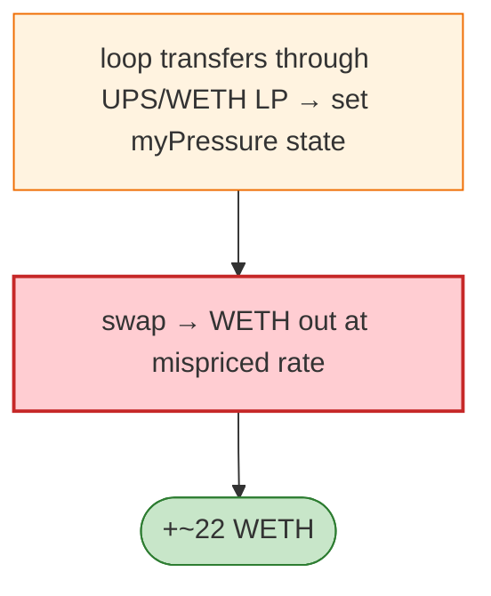

# Upswing (UPS) Exploit — Dividend/`myPressure` Token Manipulation on LP

> **Reproduction:** the PoC compiles & runs in an isolated Foundry project at
> [this project folder](.). Full verbose trace: [output.txt](output.txt).

---

## Key info

| | |
|---|---|
| **Loss** | ~22 ETH |
| **Vulnerable contract** | UPS token `0x35a25422…`; UPS/WETH LP `0x0e823a85…` |
| **Attacker** | `0xceed34f0…` (contract `0x762d2a9f…`) |
| **Attack tx** | `0x4b3df6e9c68ae482c71a02832f7f599ff58ff877ec05fed0abd95b31d2d7d912` |
| **Chain / block / date** | Ethereum mainnet / 16,433,821 / Jan 2023 |
| **Bug class** | Dividend/holder-state token (`myPressure`) + LP manipulation — UPS tracks per-holder "pressure"/dividend state that the LP reads, enabling the attacker to skew the LP's effective price and extract WETH. |

---

## TL;DR

UPS implements a dividend/"pressure" model (`myPressure(addr)`). By routing transfers through the
UPS/WETH LP the attacker puts the LP's `myPressure` state into a configuration where the next swap is
mispriced, extracting ~22 WETH. The exploit buys/loops transfers to set the state, then swaps the LP.

---

## Root cause

A **stateful, holder-dependent token whose accounting the LP inherits**, used unguarded in a vanilla
Uniswap-V2 pair. Dividend/pressure state changes act like an unauthorised reserve mutation, breaking
`k`.

---

## Diagrams



---

## Remediation

1. Do not list dividend/holder-state tokens in vanilla AMM pairs; wrap them.
2. Make the LP a fee/state-aware pair, or isolate dividend accounting from the AMM path.
3. Enforce `k` against actual received amounts.

---

## How to reproduce

```bash
_shared/run_poc.sh 2023-01-Upswing_exp -vvvvv
```

- RPC: mainnet archive (block 16,433,821). Infura mainnet in `foundry.toml`.
- Result: `[PASS]` — ~22 WETH extracted.

---

*Reference: Upswing UPS dividend-state token manipulation, mainnet, Jan 2023 (~22 ETH).*
