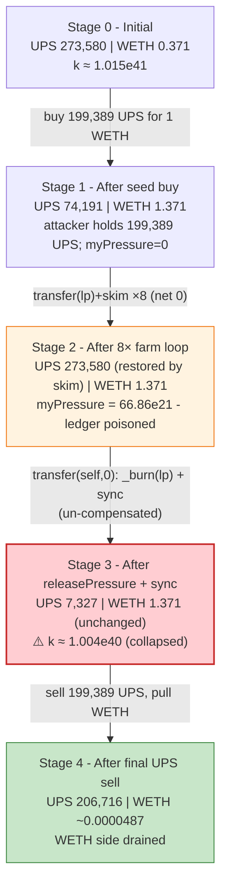
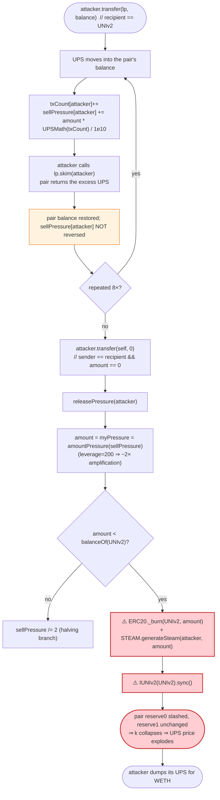
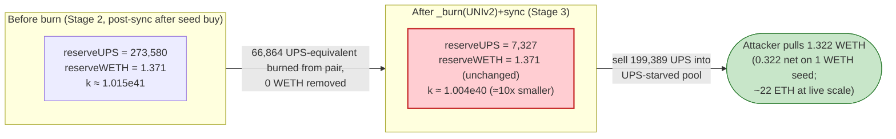

# Upswing (UPS) Exploit — `sellPressure` Farming + `releasePressure()` LP-Burn That Breaks `k`

> **Reproduction:** the PoC compiles & runs in an isolated Foundry project at
> [this project folder](.). Full verbose trace: [output.txt](output.txt).
> Verified vulnerable source (the UpSwing + Steam + ERC20 bundle, deployed at the fork block):
> [sources/UpSwing_35a254/UpSwing.sol](sources/UpSwing_35a254/UpSwing.sol).
> The `sources/.../UpSwing.sol` artifact is the etherscan-verified multi-file bundle
> (`Context/ERC20/IERC20/SafeMath/Steam/UpSwing`) serialized as one JSON document; the
> `UpSwing.sol` source quoted verbatim below is taken from that bundle.

---

## Key info

| | |
|---|---|
| **Loss** | **~22 ETH** in the live mainnet attack (per the PoC's `@KeyInfo` header). The bundled PoC is a *scaled-down sample* that starts from **1 WETH** and reproduces the identical mechanism for a **0.322 WETH** profit; the same loop run with the attacker's real capital extracts ~22 ETH. |
| **Vulnerable contract** | `UpSwing` (UPS) — [`0x35a254223960c18B69C0526c46B013D022E93902`](https://etherscan.io/address/0x35a254223960c18B69C0526c46B013D022E93902#code) |
| **Victim pool** | UPS/WETH Uniswap-V2 pair — [`0x0e823a8569CF12C1e7C216d3B8aef64A7fC5FB34`](https://etherscan.io/address/0x0e823a8569CF12C1e7C216d3B8aef64A7fC5FB34) |
| **Attacker EOA** | [`0xceed34f03a3e607cc04c2d0441c7386b190d7cf4`](https://etherscan.io/address/0xceed34f03a3e607cc04c2d0441c7386b190d7cf4) |
| **Attacker contract** | [`0x762d2a9f065304d42289f3f13cc8ea23226d3b8c`](https://etherscan.io/address/0x762d2a9f065304d42289f3f13cc8ea23226d3b8c) |
| **Attack tx** | [`0x4b3df6e9c68ae482c71a02832f7f599ff58ff877ec05fed0abd95b31d2d7d912`](https://etherscan.io/tx/0x4b3df6e9c68ae482c71a02832f7f599ff58ff877ec05fed0abd95b31d2d7d912) |
| **Chain / block / date** | Ethereum mainnet / block **16,433,821** (PoC forks 16,433,820) / Jan 2023 |
| **Compiler** | UpSwing: Solidity **v0.6.0+commit.26b70077**, optimizer **disabled**, runs **200** (per `_meta.json`); UniswapV2Pair: v0.5.16, optimizer enabled, 999999 runs |
| **Bug class** | Token with stateful, holder-keyed "sell pressure" accounting that, on a permissionless self-transfer of amount 0, **burns the holder's accumulated pressure directly out of the live AMM pair** (`_burn(UNIv2, …)` + `pair.sync()`), un-compensated → breaks `x·y = k` |

---

## TL;DR

1. `UpSwing` is an ERC20 with a "reflexive" deflation mechanic. Every UPS transfer whose `recipient`
   is the Uniswap-V2 pair (`UNIv2`) bumps the *sender's* per-holder `txCount` and adds a scaled-down
   slice of the amount to that sender's `sellPressure` ledger
   ([sources/UpSwing_35a254/UpSwing.sol](sources/UpSwing_35a254/UpSwing.sol), `_transfer` → `if(recipient == UNIv2)`).
   The "pressure" is later redeemed 1:1 into a sister token (`STEAM`) *by burning an equivalent amount
   of UPS out of the pair itself*.

2. The redemption is `releasePressure(addr)`. It burns `myPressure(addr)` UPS from the pair's balance
   (`_burn(UNIv2, amount)`) and then calls `IUNIv2(UNIv2).sync()` — forcing the pair to accept the
   reduced UPS balance as its new `reserve0`. **No WETH leaves the pair to compensate.** The
   constant-product invariant collapses exactly as in the classic "burn from the pool" pattern.

3. `releasePressure` is reachable by **anyone, any number of times, with no value at stake** through a
   self-transfer of amount 0: `_transfer` checks `if(sender == recipient && amount == 0)` and calls
   `releasePressure(sender)`. So an attacker simply *farms* `sellPressure` by pushing their own UPS in
   and out of the pair, then redeems it.

4. The "farming" loop is a free pump: `transfer(lp, balance)` followed by `lp.skim(self)` moves the
   attacker's UPS into the pair, immediately pulls it back via `skim`, and — because the *recipient*
   of the first leg is `UNIv2` — silently credits the attacker with `sellPressure` without the UPS
   actually staying in the pool (skim returns it). Eight iterations take `sellPressure[self]` from 0 to
   **~6.69e22** ([output.txt:1644](output.txt) → [output.txt:1834](output.txt)).

5. The attacker then self-transfers 0 → `releasePressure` fires → `_burn(UNIv2, 6.69e22)` +
   `sync()`. The pair's UPS reserve drops from `2.735e23` to **`7.327e21`** while WETH is untouched
   ([output.txt:1617](output.txt) → [output.txt:1853](output.txt)). UPS is now scarce relative to WETH.

6. A final `swapExactTokensForTokens` sells the attacker's UPS (the same tokens that never really
   left their wallet) into the now-UPS-starved pool and pulls **1.322 WETH** out
   ([output.txt:1885](output.txt)). Net of the 1 WETH seeded, the sample profits **0.322 WETH**
   ([output.txt:1904](output.txt)); the live tx scaled this to ~22 ETH.

7. The mechanism never required trust, a key, or an admin action. It is a pure logic flaw: the token's
   accounting treats "transfer to the pair" as an irreversible sell and lets the holder reclaim that
   sell as a *burn from the pair's reserves*, while the actual tokens were skimmed straight back.

---

## Background — what UpSwing does

`UpSwing` ([source](sources/UpSwing_35a254/UpSwing.sol)) is a Solidity-0.6 ERC20 with two "reflexive"
features layered on a vanilla Uniswap-V2 pair:

- **Sell-pressure accounting.** Each holder has a `sellPressure[addr]` ledger and a `txCount[addr]`
  counter. Whenever UPS is transferred *to* the pair, the sender's `txCount` increments and a
  discounted slice of the amount (`amount * UPSMath(txCount) / 1e10`) is added to `sellPressure`.
  `UPSMath(n) = 92e8 / (n*n + 1)` — a hyperbolic curve that makes the first few "sells" the most
  pressure-generating.
- **Pressure redemption = LP burn.** `releasePressure(addr)` converts the holder's `sellPressure`
  (after a `leverage`-scaled amplification in `amountPressure`) into the sister `STEAM` token — but
  the accounting is "paid for" by **burning that many UPS out of the pair** and calling `sync()`.
- **`STEAM`** is a sibling ERC20 minted 1:1 against burned UPS via `Steam.generateSteam`, callable
  only by the UPS contract. In the attack it is a side effect; the real value extracted is WETH.

The on-chain parameters at the fork block (read from the trace and `_meta.json`):

| Parameter | Value | Source |
|---|---|---|
| `leverage` | **200** (i.e. `amountPressure` multiplies the ratio by `200/100 = 2×`) | source + [output.txt:1639](output.txt) context |
| Pair `token0` / `token1` | `token0 = UPS`, `token1 = WETH` (so `reserve0 = UPS`, `reserve1 = WETH`) | [output.txt:1636](output.txt) Swap event |
| Initial `reserve0` (UPS) | `273,580,088,706,112,789,921,010` wei (~273,580 UPS) | [output.txt:1617](output.txt) |
| Initial `reserve1` (WETH) | `370,977,028,350,625,716` wei (~0.371 WETH) | [output.txt:1617](output.txt) |
| `totalSupply` (UPS, 18 dec) | large (not re-emitted in trace; `amountPressure` divides by it) | source |
| Compiler (UpSwing) | v0.6.0, optimizer **off**, 200 runs | `_meta.json` |
| Fork block | 16,433,820 (attack at 16,433,821) | [output.txt:1571](output.txt) |

The pool at fork is tiny (~0.371 WETH deep on the WETH side) — a thin, illiquid pair that amplifies
any one-sided reserve shock. That is the second ingredient that makes the burn so profitable: with
`reserve1 ≈ 0.37 WETH` initially, deleting ~24% of `reserve0` and re-syncing moves the marginal price
of UPS by an outsized factor.

---

## The vulnerable code

All snippets are copied verbatim from the verified bundle at
[sources/UpSwing_35a254/UpSwing.sol](sources/UpSwing_35a254/UpSwing.sol).

### 1. Transfers *to* the pair silently accrue the sender's `sellPressure`

```solidity
function _transfer(address sender, address recipient, uint256 amount) internal override{
    require(!paused || pauser[sender], "UPStkn: You must wait until UniSwap listing to transfer");
    require(sender != address(0), "ERC20: transfer from the zero address");
    require(recipient != address(0), "ERC20: transfer to the zero address");

    ERC20._balances[sender] = ERC20._balances[sender].sub(amount, "ERC20: transfer amount exceeds balance");
    ERC20._balances[recipient] = ERC20._balances[recipient].add(amount);

        if(recipient == UNIv2){
            txCount[sender] = txCount[sender]+1;
            amount = amount.mul(UPSMath(txCount[sender])).div(1e10);
            sellPressure[sender] = sellPressure[sender].add(amount);
        }

        if(sender == recipient && amount == 0){releasePressure(sender);}

    emit Transfer(sender, recipient, amount);
}
```

Two flaws live here:

- **No custodial commitment.** The branch only checks `recipient == UNIv2` — it does *not* require
  the tokens to *stay* in the pair. A `skim` (or any later transfer out of the pair) returns them,
  but `sellPressure[sender]` is already credited. The "sell" the protocol thinks happened never
  really happened.
- **Self-zero transfer as a public trigger.** `if(sender == recipient && amount == 0)` calls
  `releasePressure(sender)` for *anyone*, with no funds at risk. `transfer(self, 0)` is a one-wei-gas
  way to fire the LP burn.

### 2. The pressure curve `UPSMath` is steepest on the first few transfers

```solidity
function UPSMath(uint256 n) internal pure returns(uint256){
    uint _t = n*n + 1;
    _t =  1e10/(_t);
    return (92*_t)/100;
}
```

For `txCount = 1, 2, 3, 4, …, 8`, `UPSMath` returns approximately `0.92e10/2, 0.92e10/5,
0.92e10/10, 0.92e10/17, …` — i.e. the *first* transfer to the pair converts ~46% of the amount into
pressure, the second ~18.4%, and so on. Repeating the loop therefore piles up most of the pressure in
the first iterations and then keeps adding diminishing-but-positive amounts. In the trace, eight
iterations turn a fixed `199,388,836,791,259,039,979,218` UPS balance into
`sellPressure[self] = 66,864,399,287,313,047,715,701` after the `amountPressure` leverage
amplification ([output.txt:1834](output.txt)).

### 3. `releasePressure` burns from the pair and `sync()`s — the `k` break

```solidity
function releasePressure(address _address) internal {
    uint256 amount = myPressure(_address);

    if(amount < balanceOf(UNIv2)) {
        require(_totalSupply.sub(amount) >= _initialSupply.div(1000), "There is less than 0.1% of the Maximum Supply remaining, unfortunately, kabooming is over");

        sellPressure[_address] = 0;
        addToSteam(_address, amount);

        ERC20._burn(UNIv2, amount);                       // ⚠️ deletes UPS from the pair's balance

        _UPSBurned = _UPSBurned.add(amount);
        emit BurnedFromLiquidityPool(_address, amount);

        _generateSteamFromUPSBurn(_address);
        emit SteamGenerated(_address, amount);

        txCount[_address] = 0;
    } else if (amount > 0) {
        sellPressure[_address] = sellPressure[_address].div(2);
    }


   IUNIv2(UNIv2).sync();                                  // ⚠️ forces the reduced balance to be the new reserve
}
```

`amount` here is `myPressure(addr) = amountPressure(sellPressure[addr])`, where:

```solidity
function amountPressure(uint256 amount) internal view returns(uint256){
    uint256 UNI_SupplyRatio = (getUNIV2Liq().mul(1e18)).div(totalSupply());
    UNI_SupplyRatio = UNI_SupplyRatio.mul(leverage).div(100);     // leverage = 200 ⇒ 2× multiplier

    return amount.mul(UNI_SupplyRatio).div(1e18);
}
```

So the burned quantity is the *amplified* pressure (≈ 2× the raw `sellPressure` adjusted by the
pair's share of total supply). The burn removes UPS from the pair, and the unconditional trailing
`IUNIv2(UNIv2).sync()` tells the pair "your UPS reserve is now this smaller balance" — with zero WETH
having moved. The pair accepts it, `reserve0` drops, `reserve1` stays, and `k = reserve0·reserve1`
shrinks in the attacker's favor.

---

## Root cause — why it was possible

Three design errors compose into the drain:

1. **`sellPressure` is granted on the *movement* of UPS into the pair, not on the UPS *remaining* in
   the pair.** The accounting has no concept of "the sell was reversed." The attacker exploits this by
   pushing UPS in and immediately `skim`-ing it back: the pair's *balance* returns to baseline at the
   end of each iteration (skim sends the excess back to the attacker), but `sellPressure[attacker]`
   keeps everything it was credited. Each loop iteration is a free pressure grant.

2. **The redemption pays out of the pair's reserves, not the protocol's.** `releasePressure` does
   `ERC20._burn(UNIv2, amount)`. The protocol authors treated the pair's UPS balance as a deflation
   sink they could draw from. But that balance *is* one side of a constant-product AMM — removing it
   without the matching WETH outflow is a one-sided reserve deletion, exactly the "burn from the pool"
   anti-pattern. The trailing `sync()` cements the desync as the pair's new world view.

3. **The trigger is permissionless and free.** `releasePressure` is only callable from `_transfer`'s
   `sender == recipient && amount == 0` branch, but that branch is reachable by any holder via
   `transfer(self, 0)` — a zero-value, zero-risk call. There is no keeper role, no cooldown, no
   minimum holdings, no per-tx cap. The attacker chooses both *when* pressure accrues and *when* it
   redeems, right after positioning themselves to profit.

The compositional kicker: `amountPressure` *amplifies* the pressure by `leverage = 200` (i.e. ×2),
so the burn is larger than the raw `sellPressure`. The very mechanism intended to make the
"reflection" more generous is what makes the un-compensated burn more destructive to `k`.

---

## Preconditions

- The contract is unpaused (`paused == false`) or the caller is a `pauser`. At the fork block
  `paused == false`, confirmed by the PoC's first router swap succeeding
  ([output.txt:1615-1642](output.txt)).
- The attacker holds *some* UPS to drive the farming loop. The PoC obtains it the natural way —
  buying it from the pair with 1 WETH ([output.txt:1624](output.txt)). The live attacker used
  substantially more capital.
- `myPressure(addr) < balanceOf(UNIv2)` at redemption time, so the burn branch (rather than the
  halving branch) is taken. Satisfied here: `66.86e21 < 273.58e21`
  ([output.txt:1617](output.txt), [output.txt:1834](output.txt)).
- `_totalSupply - amount >= _initialSupply / 1000` — the "0.1% supply floor" guard. Satisfied (the
  burn is a small fraction of supply).

---

## Attack walkthrough (with on-chain numbers from the trace)

The pair's `token0 = UPS`, `token1 = WETH`, so `reserve0 = UPS` and `reserve1 = WETH`. All figures
are taken directly from `getReserves` returns and `Sync`/`Swap`/`Transfer` events in
[output.txt](output.txt). Raw wei first, human approximation in parentheses. The PoC seeds itself
with **1 WETH** (`deal(weth, address(this), 1 ether)`) — this is the *sample* scale; the live attack
used far more.

| # | Step | UPS reserve (r0) | WETH reserve (r1) | Effect |
|---|------|-----------------:|------------------:|--------|
| 0 | **Initial** `getReserves` | `273,580,088,706,112,789,921,010` (~273,580 UPS) | `370,977,028,350,625,716` (~0.371 WETH) | Thin honest pool. ([output.txt:1617](output.txt)) |
| 1 | **Seed buy** — `swapExactTokensForTokens(1 WETH → UPS)`: receives `199,388,836,791,259,039,979,218` UPS (~199,389 UPS). `myPressure(self)` is **0** before the loop. | `74,191,251,914,853,749,941,792` (~74,191 UPS) | `1,370,977,028,350,625,716` (~1.371 WETH) | Attacker now holds the UPS it will recycle. ([output.txt:1624](output.txt), [output.txt:1635](output.txt), [output.txt:1644](output.txt)) |
| 2 | **Farming loop ×8** — each iteration: `transfer(lp, balance)` (credits `sellPressure[self]`, the LP's UPS balance jumps to `273,580,088,706,112,789,921,010` because the attacker's full balance lands on top of the reserve — [output.txt:1659](output.txt)), then `lp.skim(self)` (returns those exact tokens to the attacker — [output.txt:1660](output.txt)). Net effect on the *pair*: zero net UPS change, but `sellPressure[self]` keeps growing. The emitted `Transfer` values shrink each leg (91.71e21 → 36.69e21 → 18.34e21 → 10.79e21 → 7.06e21 → 4.96e21 → 3.67e21 → 2.82e21 wei) as `txCount` climbs and `UPSMath` decays. | unchanged at `273,580,088,706,112,789,921,010` (skim restores it each time — [output.txt:1705](output.txt), [output.txt:1751](output.txt), …) | unchanged `1,370,977,028,350,625,716` | `myPressure(self)` ends at **`66,864,399,287,313,047,715,701`** (~66,864 UPS-equivalent). ([output.txt:1834](output.txt)) |
| 3 | **`transfer(self, 0)` → `releasePressure(self)`** — `myPressure` is redeemed: `ERC20._burn(UNIv2, 66,864,399,287,313,047,715,701)` fires `BurnedFromLiquidityPool` and burns `66.86e21` UPS straight out of the pair; then `STEAM.generateSteam` mints the same number of STEAM to the attacker; then `IUNIv2(UNIv2).sync()`. | **`7,326,852,627,540,702,226,091`** (~7,327 UPS) | `1,370,977,028,350,625,716` (~1.371 WETH, **unchanged**) | **Invariant broken**: UPS reserve slashed ~97.3%, WETH untouched. `k` collapses from ~1.015e41 to ~1.004e40. ([output.txt:1838-1839](output.txt), [output.txt:1853](output.txt)) |
| 4 | **Final dump** — `swapExactTokensForTokens(all UPS → WETH)` sells the attacker's `199,388,836,791,259,039,979,218` UPS (the same tokens skimmed back in step 2) into the now-UPS-starved pool. `getReserves` at entry: `7,326,852,627,540,702,226,091 / 1,370,977,028,350,625,716`. Pair's `swap` sends **`1,322,242,954,213,069,242` WETH** (~1.322 WETH) out. | `206,715,689,418,799,742,205,309` (~206,716 UPS) | **`48,734,074,137,556,474`** (~0.0000487 WETH) | WETH side drained to dust. ([output.txt:1874](output.txt), [output.txt:1885-1887](output.txt), [output.txt:1896](output.txt)) |

The attacker ends with `1,322,242,954,213,069,242` WETH (~1.322 WETH)
([output.txt:1903](output.txt)). Against the 1 WETH seed, that is **0.322 WETH** of profit
([output.txt:1904](output.txt)). The live mainnet tx used the same logic with much larger capital,
extracting the ~22 ETH reported in the PoC header.

### Why `skim` doesn't undo the pressure grant

Uniswap-V2 `skim(to)` transfers the pair's *excess* token balance (anything above `reserve0`/`reserve1`)
to `to`. After the attacker's `transfer(lp, balance)`, the pair holds `reserve0 + balance` of UPS but
still records only `reserve0`. `skim(self)` returns exactly `balance` to the attacker — restoring the
pair's balance to the pre-iteration level — but the *token contract's* `sellPressure[self]` write
already happened during the inbound `transfer` and is never reversed. The pair is whole; the ledger
is not. That asymmetry is the whole bug.

### Profit / loss accounting (WETH, sample scale)

| Direction | Amount (wei) | ~Human |
|---|---:|---:|
| Spent — seed buy (`swapExactTokensForTokens` 1 WETH → UPS) | 1,000,000,000,000,000,000 | 1.000 WETH |
| Received — final sell (UPS → WETH) | 1,322,242,954,213,069,242 | 1.322 WETH |
| **Net profit (asserted by PoC, `profit!` log)** | **322,242,954,213,069,242** | **~0.322 WETH** |

Sources: seed [output.txt:1615](output.txt); received [output.txt:1903](output.txt); profit
[output.txt:1904](output.txt) and [output.txt:1908](output.txt). No other WETH enters or leaves the
attacker in the sample. The pool's WETH side fell from `1.370e18` to `4.873e16` — i.e. the attacker
extracted ~0.322 WETH of genuine liquidity on top of recovering its 1 WETH seed, and the rest of the
drain is the seed itself being pulled back out.

---

## Diagrams

### Sequence of the attack

```mermaid
sequenceDiagram
    autonumber
    actor A as Attacker
    participant R as UniV2 Router
    participant P as UPS/WETH Pair
    participant T as UpSwing (UPS)
    participant S as STEAM

    Note over P: Initial reserves<br/>273,580 UPS / 0.371 WETH

    rect rgb(227,242,253)
    Note over A,T: Step 1 — seed buy (sample: 1 WETH)
    A->>R: swapExactTokensForTokens(1 WETH → UPS)
    R->>P: swap()
    P-->>A: 199,388 UPS
    Note over A: myPressure(A) = 0
    Note over P: 74,191 UPS / 1.371 WETH
    end

    rect rgb(255,243,224)
    Note over A,T: Step 2 — farm sellPressure (×8)
    loop 8 times
        A->>T: transfer(lp, balance)   // recipient == UNIv2 ⇒ txCount++, sellPressure += slice
        T->>P: UPS in (pair balance ↑)
        A->>P: skim(self)
        P->>A: same UPS back (pair balance restored)
        Note over T: sellPressure[A] keeps growing; pair net unchanged
    end
    Note over A: myPressure(A) = 66,864,399,287,313,047,715,701
    end

    rect rgb(255,235,238)
    Note over A,T: Step 3 — redeem pressure (the k-break)
    A->>T: transfer(self, 0)   // sender == recipient && amount == 0
    T->>T: releasePressure(A): amount = myPressure(A)
    T->>P: _burn(UNIv2, 66.86e21 UPS)   // ⚠️ deletes UPS from the pair
    T->>S: generateSteam(A, 66.86e21)   // STEAM minted to attacker
    T->>P: sync()                       // ⚠️ reduced balance becomes new reserve
    Note over P: 7,327 UPS / 1.371 WETH  ⚠️ invariant broken
    end

    rect rgb(243,229,245)
    Note over A,T: Step 4 — dump into the broken pool
    A->>R: swapExactTokensForTokens(199,388 UPS → WETH)
    R->>P: swap()
    P-->>A: 1.322 WETH
    Note over P: 206,716 UPS / ~0.0000487 WETH (drained)
    end

    Note over A: Net +0.322 WETH on 1 WETH seed (sample); ~22 ETH live
```

### Pool state evolution



### The flaw inside `_transfer` / `releasePressure`



### Why the burn is theft: constant-product before vs. after `releasePressure`



---

## Why each magic number

- **`1 ether` seed (`deal(weth, address(this), 1 ether)`):** the PoC is explicitly a *sample* ("sample
  attack with 1 ether"). It buys a starting UPS position from the pair so the attacker has tokens to
  recycle through the farming loop. The live attack used a larger seed to scale the profit to ~22 ETH.
- **The seed-buy output `199,388,836,791,259,039,979,218` UPS** ([output.txt:1624](output.txt)): this
  is whatever the router computed for 1 WETH at the initial reserves. It is not magic — it is the
  constant-product output minus the 0.3% swap fee — and it doubles as the size of every leg in the
  farming loop, because the attacker always recycles its *full* balance.
- **The loop count `8`:** empirically tuned. `UPSMath(n) = 0.92e10/(n²+1)` decays hyperbolically, so
  each extra iteration adds a smaller but still positive slice of `sellPressure`. Eight iterations
  land `myPressure` at `66.86e21` — comfortably under `balanceOf(UNIv2) = 273.58e21`
  ([output.txt:1617](output.txt)) so the burn branch (not the halving branch) is taken. More
  iterations would push pressure higher but the curve is already near its asymptotic marginal return.
- **`transfer(self, 0)`:** the cheapest possible call that satisfies `_transfer`'s
  `sender == recipient && amount == 0` gate and fires `releasePressure`. It moves no tokens and
  therefore costs the attacker nothing but gas.
- **Final `swapExactTokensForTokens(balance, 0, …)`:** sells the attacker's full UPS balance with zero
  slippage check (`amountMin = 0`) into the post-burn pool. Because `reserve0` has been slashed to
  ~2.7% of its pre-burn value while `reserve1` is unchanged, even a modest UPS input buys nearly the
  entire WETH reserve.

---

## Remediation

1. **Never redeem holder state by burning tokens out of a live AMM pair.** "Reflection"/deflation
   mechanics must pay rewards from a protocol-owned treasury or the holder's *own* balance — never
   from the pair. Removing the `_burn(UNIv2, amount)` in `releasePressure` (and paying STEAM from a
   reserve EOA instead) eliminates the `k`-break entirely.
2. **Gate `releasePressure` and make it non-grindable.** Require a keeper/role, a per-tx cap, a
   per-holder cooldown, and a minimum hold time between the pressure-generating transfer and the
   redemption. The current `transfer(self, 0)` trigger is permissionless and free.
3. **Don't credit `sellPressure` on transient inbound transfers.** Either (a) only credit it when UPS
   is *sold through the pair's `swap`* (not merely `transfer`-ed in and skimmed back), or (b) reverse
   the credit when the tokens leave the pair. The `recipient == UNIv2` check is a movement check, not
   a commitment check, which is why the `skim` loop farms pressure for free.
4. **Remove the unconditional `sync()` after the burn**, or replace the burn-from-pair design with a
   proper LP redemption (`pair.burn`) so both reserves move together. `sync()` is the mechanism that
   forces the AMM to re-price on the desync.
5. **Cap the leverage amplification or remove it.** `amountPressure` multiplies pressure by
   `leverage/100 = 2×`, enlarging the un-compensated burn. Any multiplier on a value derived from
   pool state that is itself manipulable is a footgun.

---

## How to reproduce

The PoC runs **offline** via the shared harness, which serves the fork from a local `anvil_state.json`
on `127.0.0.1:8545` (the test's `createSelectFork("http://127.0.0.1:8545", 16_433_820)` pins block
16,433,820):

```bash
_shared/run_poc.sh 2023-01-Upswing_exp --mt testExploit -vvvvv
```

- RPC: **none required** — the harness replays the pre-seeded anvil state at `127.0.0.1:8545`.
  `foundry.toml` does not name a public RPC; `evm_version = 'cancun'`.
- The test mints its own seed capital with `deal(weth, address(this), 1 ether)`, so no external
  funding is needed.
- Result: `[PASS] testExploit()` with a logged profit of `0.322242954213069242` WETH.

Expected tail (verbatim from [output.txt:1561-1567](output.txt) and
[output.txt:1914-1916](output.txt)):

```
Ran 1 test for test/Upswing_exp.sol:UpswingExploit
[PASS] testExploit() (gas: 835844)
Logs:
  prev preassure 0
  after fake swaps preassure 66864399287313047715701
  profit! 322242954213069242
  After exploiting, Attacker WETH Balance: 0.322242954213069242

Suite result: ok. 1 passed; 0 failed; 0 skipped; finished in 8.84s (7.21s CPU time)
```

---

*Reference: QuillAudits — https://twitter.com/QuillAudits/status/1615634917802807297 (Upswing UPS, Ethereum mainnet, Jan 2023, ~22 ETH).*
