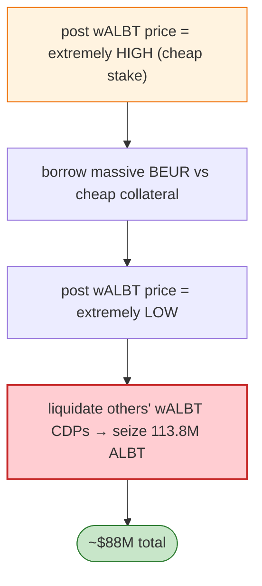

# BonqDAO / AllianceBlock Exploit — `TellorFlex` Oracle Price Manipulation

> **Reproduction:** the PoC compiles & runs in an isolated Foundry project at
> [this project folder](.). Full verbose trace: [output.txt](output.txt).

---

## Key info

| | |
|---|---|
| **Loss** | ~$88M (100.5M BEUR minted from BonqDAO + 113.8M ALBT from borrowers' CDPs) |
| **Vulnerable contract** | BonqDAO `TellorFlex` oracle `0x8f55d884…` (Polygon); BonqDAO CDP |
| **Attacker** | `0xcAcf2D28…` (contract `0xed596991…`) |
| **Attack txs** | Tx1 `0x31957ecc…` (BEUR), Tx2 `0xa02d0c3d…` (ALBT) |
| **Chain / block / date** | Polygon / Feb 2023 |
| **Bug class** | Oracle manipulation — the collateral cost to post a TellorFlex price was far lower than the profit; the attacker posted an extremely high wALBT price to borrow massive BEUR, then a very low price to liquidate others' wALBT CDPs. |

---

## TL;DR

Per the embedded root cause: the cost of the collateral required by the TellorFlex Oracle to quote a
price was much lower than the profit. The attacker:

1. **Tx1:** manipulates the **wALBT price to extremely high** → borrows a massive amount of BEUR
   against (cheap) collateral.
2. **Tx2:** manipulates the **wALBT price to extremely low** → liquidates other users' wALBT CDPs,
   seizing 113.8M ALBT.

Suggested mitigations: VWAP/TWAP oracle, or `getDataBefore()` so a price must pass a sufficient dispute
window before being usable.

---

## Root cause

A **cheap-to-manipulate oracle** (TellorFlex's stake/quote economics made posting a bad price cheaper
than the extractable profit), used directly for CDP collateral valuation and liquidation without a
dispute window or TWAP.

---

## Diagrams



---

## Remediation

1. VWAP/TWAP oracle; require a dispute window (`getDataBefore`) before a price is usable.
2. Raise the stake/bond so attacking the oracle costs more than the extractable profit.
3. Collateral/liquidation caps; circuit breakers on large price moves.

---

## How to reproduce

```bash
_shared/run_poc.sh 2023-02-BonqDAO_exp -vvvvv
```

- RPC: Polygon archive. Result: `[PASS] 3 tests` (`testExploit`, `testAttackTx1`, `testAttackTx2`)
  — the wALBT high→low price manipulation mints BEUR then liquidates wALBT CDPs. (~340s.)

---

*Reference: BonqDAO / AllianceBlock TellorFlex oracle manipulation, Polygon, Feb 2023 (~$88M).*
