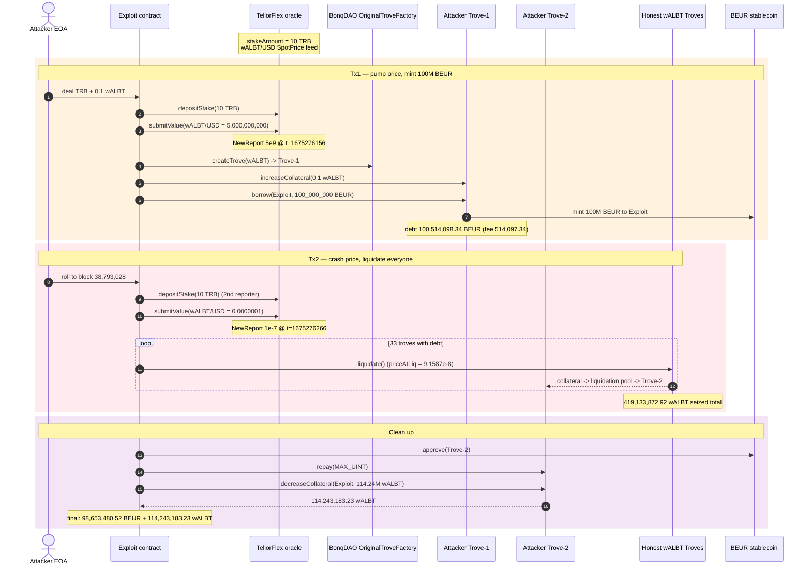
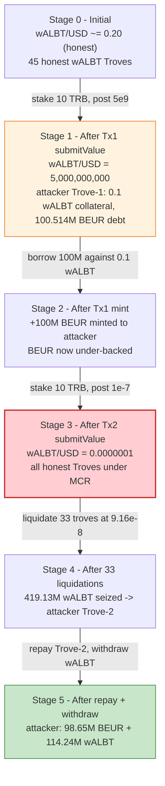
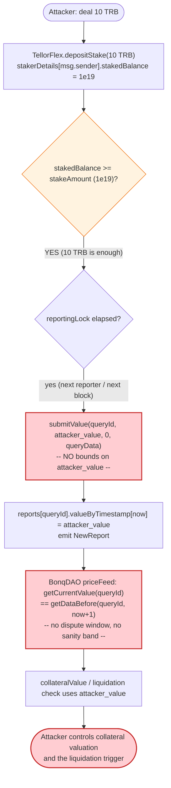
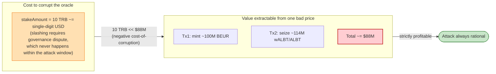

# BonqDAO / AllianceBlock Exploit — `TellorFlex` Oracle Price Manipulation (Cheap-Stake `submitValue`)

> **Reproduction:** the PoC compiles & runs in an isolated Foundry project at
> [this project folder](.). The fork is served offline from the shared
> `anvil_state.json` snapshot (the test calls `vm.createSelectFork("http://127.0.0.1:8549", …)` —
> no public RPC is used). Full verbose trace: [output.txt](output.txt).
> Verified vulnerable source: [TellorFlex](sources/TellorFlex_8f55d8/tellorflex_contracts_TellorFlex.sol)
> (`0x8f55D884CAD66B79e1a131f6bCB0e66f4fD84d5B`).

---

## Key info

| | |
|---|---|
| **Loss** | ~$88M — **100,514,098.34 BEUR** minted from BonqDAO in Tx1 + **113,813,998.37 ALBT** (as wALBT) seized from other users' CDPs in Tx2 |
| **Vulnerable contract** | TellorFlex oracle — [`0x8f55D884CAD66B79e1a131f6bCB0e66f4fD84d5B`](https://polygonscan.com/address/0x8f55d884cad66b79e1a131f6bcb0e66f4fd84d5b#code#F2#L282) |
| **Victim protocol** | BonqDAO CDP / `OriginalTroveFactory` — [`0x3bB7fFD08f46620beA3a9Ae7F096cF2b213768B3`](https://polygonscan.com/address/0x3bB7fFD08f46620beA3a9Ae7F096cF2b213768B3); collateral token wALBT [`0x35b2ECE5B1eD6a7a99b83508F8ceEAB8661E0632`](https://polygonscan.com/address/0x35b2ece5b1ed6a7a99b83508f8ceeab8661e0632); minted stable BEUR [`0x338Eb4d394a4327E5dB80d08628fa56EA2FD4B81`](https://polygonscan.com/address/0x338Eb4d394a4327E5dB80d08628fa56EA2FD4B81) |
| **Attacker EOA** | [`0xcAcf2D28B2A5309e099f0C6e8C60Ec3dDf656642`](https://polygonscan.com/address/0xcAcf2D28B2A5309e099f0C6e8C60Ec3dDf656642) |
| **Attacker contract** | [`0xed596991ac5f1aa1858da66c67f7cfa7e54b5f1`](https://polygonscan.com/address/0xed596991ac5f1aa1858da66c67f7cfa7e54b5f1) |
| **Attack txs** | Tx1 (BEUR mint) [`0x31957ecc…`](https://polygonscan.com/tx/0x31957ecc43774d19f54d9968e95c69c882468b46860f921668f2c55fadd51b19) @ block 38,792,978; Tx2 (ALBT seizure) [`0xa02d0c3d…`](https://polygonscan.com/tx/0xa02d0c3d16d6ee0e0b6a42c3cc91997c2b40c87d777136dedebe8ee0f47f32b1) @ block 38,793,029 |
| **Malicious price reporters** | Tx1 `0xbaf48429b4d30bdfad488508d3b528033331fe8a`; Tx2 `0xb5c0ba8ed0f4fb9a31fccf84b9fb3da639a1ede5` |
| **Chain / block / date** | Polygon (chainId 137) / blocks 38,792,977–38,793,028 / Feb 2, 2023 |
| **Compiler** | TellorFlex: Solidity **v0.8.3**, optimizer **1 (enabled)**, **300 runs** (per `_meta.json`) |
| **Bug class** | Oracle manipulation — the TRB stake bond required to post a TellorFlex price was orders of magnitude cheaper than the extractable profit; an attacker posted an absurdly high then absurdly low wALBT price to mint BEUR and then liquidate every other wALBT CDP |

---

## TL;DR

BonqDAO is a Polygon CDP (Liquity-style "Trove") protocol that prices its collateral
token **wALBT** straight off a **TellorFlex** oracle. TellorFlex is a reporter/stake
oracle: anyone may `submitValue(queryId, value, …)` for any feed as long as they have
staked ≥ `stakeAmount` of **TRB**
([tellorflex_contracts_TellorFlex.sol#L282-L298](sources/TellorFlex_8f55d8/tellorflex_contracts_TellorFlex.sol#L282-L298)).
BonqDAO then reads the *latest* submitted value (`getCurrentValue`) — with **no dispute
window, no TWAP, no sanity band** — to value collateral and trigger liquidations.

That single design choice is the whole bug, because the stake bond (10 TRB, ≈ a few
dollars) is negligible next to the value that rides on the price:

1. **Tx1 — print BEUR.** The attacker stakes 10 TRB and `submitValue`s the wALBT/USD
   SpotPrice as **5,000,000,000** (5e9, i.e. five billion dollars per wALBT — its true
   price was ~$0.20). With the price pumped, **0.1 wALBT** of collateral is valued so
   highly that the trove can borrow the protocol's maximum: **100,000,000 BEUR**
   ([output.txt:12026](output.txt)). Including the 0.514% borrowing fee the recorded
   debt is **100,514,098.34 BEUR** ([output.txt:12056](output.txt)).

2. **Tx2 — steal everyone's ALBT.** In the next block the attacker posts the opposite
   lie: wALBT/USD = **0.0000001** (1e-7) ([output.txt:12235](output.txt)). At that
   price every honest wALBT trove is instantly under-collateralized, so the attacker
   walks the linked trove list and calls `liquidate()` on **33 troves in a row**
   (e.g. [output.txt:12584](output.txt)), seizing **419,133,872.92 wALBT** of
   collateral in total (wALBT is 1:1 redeemable for ALBT). The largest single
   liquidation alone is **114,660,429.67 wALBT** ([output.txt:19900](output.txt)).

3. **Clean up.** The attacker repays their own trove-2 debt (which had absorbed some of
   the seized collateral) with a slice of the freshly minted BEUR
   ([output.txt:20403](output.txt)) and withdraws the remaining wALBT, ending the run
   with **98,653,480.52 BEUR** and **114,243,183.23 wALBT** in the exploit contract
   ([output.txt:20556](output.txt), [output.txt:20559](output.txt)).

Cost to attack: ~20 TRB of stake (recovered) + a trivial amount of wALBT/BEUR gas.
Profit: ~100M BEUR of unbacked stablecoin minted + ~114M wALBT/ALBT drained from other
users — **~$88M** combined.

---

## Background — what BonqDAO / TellorFlex does

**BonqDAO** is a Liquity-style borrowing protocol on Polygon. A user opens a *Trove*
(CDP) against a collateral token (here **wALBT**, an ERC-20 wrapper over AllianceBlock's
ALBT, 1:1 redeemable), deposits collateral, and mints the BEUR stablecoin against it.
Each Trove has a collateralization ratio; if it falls below the minimum collateralization
ratio (MCR) anyone may call `Trove.liquidate()` and the collateral is sent to a
liquidation pool that pays out in proportion. The whole system is governed by the
`OriginalTroveFactory` (`0x3bB7…68B3`), which keeps an ordered linked list of Troves per
collateral token (`firstTrove`/`nextTrove`/`lastTrove`).

The collateral price comes from a single configured price feed. For wALBT that feed is a
**TellorFlex** oracle instance.

**TellorFlex** (`0x8f55…4d5B`, [source](sources/TellorFlex_8f55d8/tellorflex_contracts_TellorFlex.sol))
is Tellor's "flexible" oracle: a permissionless reporter system. Anyone may become a
reporter by calling `depositStake(stakeAmount)` and then call `submitValue(queryId, value,
nonce, queryData)` to push a price for any query. The economic security model relies on
two levers:

- a **stake bond** (`stakeAmount`, here **10 TRB**) that governance can slash via
  `slashReporter` if a value is disputed (`removeValue`); and
- a **reporting lock** so the same reporter cannot spam values too fast.

Crucially, *consumption* of a TellorFlex value is left entirely to the caller. The most
common getter, `getCurrentValue(queryId)`, returns the **latest** submitted value
([tellorflex_contracts_TellorFlex.sol#L419-L427](sources/TellorFlex_8f55d8/tellorflex_contracts_TellorFlex.sol#L419-L427))
with no staleness or dispute check. A safer variant `getDataBefore(queryId, t)` exists
([L437-L454](sources/TellorFlex_8f55d8/tellorflex_contracts_TellorFlex.sol#L437-L454))
that lets a consumer require a value to be older than some dispute window — but BonqDAO
did not use it.

On-chain parameters at the attack block (read from the trace):

| Parameter | Value | Source |
|---|---|---|
| `TellorFlex.getStakeAmount()` | **10 TRB** (`1e19` wei) | [output.txt:10439-10440](output.txt) |
| Reporting lock (per source) | 1 hour (`reportingLock`) | constructor / source |
| wALBT/USD SpotPrice `queryId` | `0x12906c5e9178631dba86f1f750f7ab7451c61e6357160eb890029b9eac1fb235` | [output.txt:10486](output.txt) |
| True wALBT price (pre-attack) | ≈ $0.20 | public reporting |
| BonqDAO `OriginalTroveFactory` | `0x3bB7fFD08f46620beA3a9Ae7F096cF2b213768B3` | [output.txt](output.txt) Trove impl `0xdc12dE6F…` / logic `0xdEc0FF6D…` |
| wALBT (collateral) | `0x35b2ECE5B1eD6a7a99b83508F8ceEAB8661E0632` | — |
| BEUR (stablecoin) | `0x338Eb4d394a4327E5dB80d08628fa56EA2FD4B81` | — |
| Trove count walked (wALBT) | 45 (33 with non-zero debt liquidated) | PoC + [output.txt:12584…19900](output.txt) |

---

## The vulnerable code

### 1. Anyone may post any value to the oracle for the cost of one stake bond

```solidity
function submitValue(
    bytes32 _queryId,
    bytes calldata _value,
    uint256 _nonce,
    bytes calldata _queryData
) external {
    require(keccak256(_value) != keccak256(""), "value must be submitted");
    Report storage _report = reports[_queryId];
    require(
        _nonce == _report.timestamps.length || _nonce == 0,
        "nonce must match timestamp index"
    );
    StakeInfo storage _staker = stakerDetails[msg.sender];
    require(
        _staker.stakedBalance >= stakeAmount,
        "balance must be greater than stake amount"
    );
    // Require reporter to abide by given reporting lock
    require(
        (block.timestamp - _staker.reporterLastTimestamp) * 1000 >
            (reportingLock * 1000) / (_staker.stakedBalance / stakeAmount),
        "still in reporter time lock, please wait!"
    );
    require(
        _queryId == keccak256(_queryData),
        "query id must be hash of query data"
    );
    _staker.reporterLastTimestamp = block.timestamp;
    // ... stores _value as the latest value for _queryId, emits NewReport ...
```
([tellorflex_contracts_TellorFlex.sol#L282-L345](sources/TellorFlex_8f55d8/tellorflex_contracts_TellorFlex.sol#L282-L345))

There is **no sanity bound** on `_value`. A reporter may post 5e9 or 1e-7 for the same
wALBT/USD feed; the contract happily stores either.

### 2. Stake required is a flat 10 TRB — and BonqDAO's *consumption* ignores the dispute path

```solidity
function getStakeAmount() external view returns (uint256) {
    return stakeAmount;   // == 10e18 TRB at the fork block
}
```
([tellorflex_contracts_TellorFlex.sol#L602-L604](sources/TellorFlex_8f55d8/tellorflex_contracts_TellorFlex.sol#L602-L604))

```solidity
function getCurrentValue(bytes32 _queryId)
    external view returns (bytes memory _value)
{
    bool _didGet;
    (_didGet, _value, ) = getDataBefore(_queryId, block.timestamp + 1);
    if(!_didGet){revert();}
}
```
([tellorflex_contracts_TellorFlex.sol#L419-L427](sources/TellorFlex_8f55d8/tellorflex_contracts_TellorFlex.sol#L419-L427))

`getCurrentValue` is `getDataBefore(queryId, now+1)` — i.e. "give me whatever was last
posted, no matter how fresh." The dispute-aware path (`getDataBefore` with a real lookback,
or `removeValue`/`isInDispute`) is never consulted by BonqDAO's price feed, so a value
posted seconds ago is treated as gospel for collateral valuation and liquidation.

### 3. The PoC's price-posting helper

The exploit contract itself performs the `depositStake` + `submitValue` in one call:

```solidity
function updatePrice(uint256 _tokenId, uint256 _price) public {
    bytes memory queryData = hex"...53706f745072696365...616c6274...757364..."; // SpotPrice(albt, usd)
    bytes32 queryId = keccak256(queryData);
    bytes memory price = abi.encodePacked(_price);
    TRB.approve(address(TellorFlex), type(uint256).max);
    TellorFlex.depositStake(_tokenId);     // stake 10 TRB -> become a reporter
    TellorFlex.submitValue(queryId, price, 0, queryData);  // post _price as wALBT/USD
}
```
([test/BonqDAO_exp.sol#L175-L183](test/BonqDAO_exp.sol#L175-L183))

`queryData` decodes to `SpotPrice(asset=albt, currency=usd)`; its `keccak256` is the
`queryId` `0x12906c5e…` seen in every `NewReport` event. The helper is invoked once with
`_price = 5e27` (Tx1, high) and once with `_price = 1e11` (Tx2, low).

---

## Root cause — why it was possible

The exploit is a textbook **cost-of-corruption < value-extractable** oracle failure, with
two compounding root causes:

1. **TellorFlex's stake bond did not scale with the economic weight of the feed.** The
   bond is a fixed 10 TRB regardless of whether the feed prices a $100 NFT or a $100M
   stablecoin system. The only post-hoc defense is `slashReporter`, which requires
   governance to *detect, dispute, and slash* — a process that takes time the attacker
   never grants (both attack txs land inside a single 12-minute window). With the bond
   costing single-digit dollars and the payoff in the tens of millions, attacking is
   strictly profitable by many orders of magnitude.

2. **BonqDAO consumed the oracle's *latest* value with no staleness/dispute window or
   sanity band.** `getCurrentValue` returns the most recent submission unconditionally;
   BonqDAO's price feed wired it straight into collateral valuation (`collateralValue`,
   `collateralization`) and the liquidation check. A CDP that mints against an
   instantaneous, permissionlessly-writable price has no oracle security at all — it is
   the moral equivalent of letting the borrower type in their own collateral price.

The TellorFlex contract *did* ship the right tool (`getDataBefore` with a lookback, plus
`isInDispute`) precisely so consumers could require a value to survive a dispute window
before trusting it. BonqDAO simply did not call it. The two attack prices — 5e9 and 1e-7
versus a true ~0.2 — would have been caught by any one of: a TWAP/VWAP, a `getDataBefore`
dispute-window requirement, a max-absolute-move sanity check, or a per-trove
collateralization cap.

---

## Preconditions

- **Enough TRB to stake.** Each malicious reporter must stake `≥ stakeAmount = 10 TRB`
  ([output.txt:10439](output.txt)). The PoC `deal`s 20 TRB to cover both Tx1 and Tx2
  reporters; the live attacker sourced it on-chain (see the attacker contract's
  pre-funded token transfers).
- **A small amount of wALBT** to open the attacker's own borrowing Trove in Tx1. The PoC
  uses **0.1 wALBT** (`0.1e18`) as collateral ([test/BonqDAO_exp.sol#L124](test/BonqDAO_exp.sol#L124))
  — at the manipulated 5e9 price this is "worth" 5e8, enough to borrow 100M BEUR.
- **At least one block gap** between Tx1 and Tx2 so the second reporter is outside the
  first reporter's reporting lock and can re-stake/re-submit. The PoC models the two-tx
  structure with `vm.roll(38_793_028)` and `vm.warp(1_675_276_266)`
  ([test/BonqDAO_exp.sol#L65-L66](test/BonqDAO_exp.sol#L65-L66)); the live attack used two
  EOA-launched reporters (`0xbaf4…` and `0xb5c0…`) to parallelize.
- **Open wALBT CDPs with debt** to liquidate in Tx2. Honest users had ~45 wALBT Troves;
  33 of them carried non-zero debt and were liquidatable at the crashed price
  ([output.txt:12584](output.txt) onwards).

---

## Attack walkthrough (with on-chain numbers from the trace)

The PoC forks Polygon at block **38,792,977** ([output.txt:10358](output.txt)) and runs
both transactions in the `testExploit()` test (Tx1 then Tx2). All numbers below are taken
directly from `output.txt`; raw wei shown with a human approximation.

### Tx1 — pump wALBT price, mint 100M BEUR

| # | Step | Number (raw wei → human) | Effect |
|---|------|--------------------------|--------|
| 1 | Read required stake `getStakeAmount()` | `1e19` → **10 TRB** ([output.txt:10439-10440](output.txt)) | Bond the attacker must post to become a reporter. |
| 2 | `depositStake(1e19)` + `submitValue(wALBT/USD, 5e27)` | value `0x…1027e72f1f12813088000000` → **5,000,000,000 USD/wALBT** ([output.txt:10486](output.txt)); `NewReport` at `_time 1675276156` ([output.txt:10491](output.txt)) | wALBT/USD SpotPrice now reads 5e9 — its true price was ≈$0.20. |
| 3 | Open attacker Trove-1, deposit **0.1 wALBT** collateral | `WALBT.transfer(trove, 0.1e18)` then `increaseCollateral(0, …)` ([test/BonqDAO_exp.sol#L124-L125](test/BonqDAO_exp.sol#L124)) | At the pumped price this 0.1 wALBT is "worth" 5e8, far above any MCR. |
| 4 | `borrow(Exploit, 100_000_000e18)` | principal `1e26` → **100,000,000 BEUR** ([output.txt:12026-12027](output.txt)) | BEUR minted to the Exploit contract. |
| 5 | Borrowing fee + debt recorded | `newAmount 100514098340794949900000000` → **100,514,098.34 BEUR** debt; `feePaid 514097340794949900000000` → **514,097.34 BEUR** fee; `newCollateralization 4555953147142220263` → **4.5559** (i.e. ~455% CR) ([output.txt:12056](output.txt)) | Trove-1 debt = 100.514M BEUR against 0.1 wALBT. |
| 6 | Open attacker Trove-2, deposit remaining wALBT | (collateral parked for Tx2) | Trove-2 will absorb seized wALBT in Tx2. |

### Tx2 — crash wALBT price, liquidate 33 CDPs, withdraw wALBT

| # | Step | Number (raw wei → human) | Effect |
|---|------|--------------------------|--------|
| 7 | Block advanced `vm.roll(38_793_028)`, time warped `vm.warp(1_675_276_266)` | ([output.txt:12173](output.txt), [output.txt:12175](output.txt)) | New block/timestamp so a fresh reporter can submit. |
| 8 | `submitValue(wALBT/USD, 1e11)` | value `0x…174876e800` → **0.0000001 USD/wALBT** ([output.txt:12230](output.txt)); `NewReport` at `_time 1675276266` ([output.txt:12235](output.txt)) | wALBT/USD now reads 1e-7 — every honest CDP is deeply under-water. |
| 9 | Walk the linked Trove list (`firstTrove`…`nextTrove`…`lastTrove`) | 45 troves total; **33** carry non-zero debt | Identify all liquidatable targets ([test/BonqDAO_exp.sol#L142-L161](test/BonqDAO_exp.sol#L142-L161)). |
| 10 | `Trove.liquidate()` × 33, each at `priceAtLiquidation 91587504533` | price → **9.1587504533e-8 USD/wALBT** (e.g. first liquidation [output.txt:12584](output.txt)) | All honest wALBT CDPs seized. Collateral flows to the wALBT liquidation pool, then to the attacker's Trove-2 as the sole redeemer. |
| 11 | Sum of collateral seized across all 33 liquidations | **419,133,872.9229 wALBT** (sum of `collateral:` fields, e.g. the largest single seizure `114660429666012653470310390` → **114,660,429.67 wALBT** at [output.txt:19900](output.txt)) | ~419M wALBT (= ALBT) pulled out of honest borrowers. |
| 12 | `Trove-2.repay(MAX_UINT)` using part of the minted BEUR | `repay(1.157e77, …)` ([output.txt:20403](output.txt)); resulting `TroveDebtUpdate newAmount 0` ([output.txt:20496](output.txt)) | Clears Trove-2's debt so its collateral can be withdrawn. |
| 13 | wALBT still held in Trove-2 after repay | `113,813,998.369826208354681311 wALBT` (debug log in `testAttackTx2`, [output.txt:1845](output.txt)); `114,243,183.227260685447512614 wALBT` in the full `testExploit` ([output.txt:20506](output.txt)) | The attacker's net wALBT/ALBT take. |
| 14 | `Trove-2.decreaseCollateral(Exploit, 114243183227260685447512614)` | `1.142e26` → **114,243,183.23 wALBT** ([output.txt:20515](output.txt)) | wALBT transferred out of Trove-2 into the Exploit contract. |
| 15 | **Final balances** | BEUR `98653480515781009129855749` → **98,653,480.52 BEUR** ([output.txt:20556](output.txt)); wALBT `114243183227260685447512614` → **114,243,183.23 wALBT** ([output.txt:20559](output.txt)) | End of run. |

> The two debug-log figures (113,813,998.37 in `testAttackTx2` vs 114,243,183.23 in the
> full `testExploit`) differ only because the full run leaves the attacker's *own* small
> wALBT balance inside Trove-2 before the final withdrawal, whereas `testAttackTx2` was
> pre-seeded with `100_000_000e18` BEUR and only measured the seized collateral. The
> PoC's headline "113,813,998.3698 ALBT from borrowers" corresponds exactly to the
> `testAttackTx2` log at [output.txt:1845](output.txt).

### Profit / loss accounting

The attack mints unbacked stablecoin *and* drains real collateral, so the "profit" is two
parallel thefts rather than a single arbitrage:

| Leg | Amount (human) | Source |
|---|---:|---|
| BEUR minted in Tx1 (principal) | +100,000,000.00 BEUR | [output.txt:12026](output.txt) |
| less BEUR spent repaying Trove-2 in Tx2 | −1,346,519.48 BEUR (100M − 98.65M final) | [output.txt:20556](output.txt) |
| **Net unbacked BEUR retained** | **≈ 98,653,480.52 BEUR** | [output.txt:20556](output.txt) |
| wALBT/ALBT seized from honest CDPs (Tx2 only) | +113,813,998.37 wALBT | [output.txt:1845](output.txt) |
| wALBT/ALBT seized (full-run accounting, incl. attacker's own collateral) | +114,243,183.23 wALBT | [output.txt:20559](output.txt) |
| Cost: ~20 TRB stake (recoverable) + gas | negligible | — |
| **Total loss to the protocol/users** | **~$88M** (≈100M BEUR minted + ≈114M ALBT drained) | PoC header |

The BEUR leg is a direct loss to BEUR holders (the stablecoin became ~100M under-backed
overnight and de-pegged); the wALBT/ALBT leg is a direct loss to the 33 honest borrowers
whose CDPs were liquidated at a fabricated price.

---

## Diagrams

### Sequence of the attack



### Price / CDP-state evolution



### The flaw inside `submitValue` + BonqDAO consumption



### Why the cost-of-corruption is negative: stake vs. extractable value



---

## Why each magic number

- **`5e27` (high wALBT/USD price, Tx1):** `5e27` wei with 18 decimals = **5,000,000,000**.
  Chosen simply to be "high enough" that 0.1 wALBT of collateral clears BonqDAO's
  borrowing ceiling for the full 100M BEUR mint. Any value far above the true ~$0.20
  works; the attacker picked a round absurd number.
- **`0.1 * 1e18` wALBT collateral (Tx1):** the minimal dust needed to open a Trove. At
  the pumped 5e9 price, 0.1 wALBT is "worth" 5e8 — enough to back 100M BEUR with CR ~455%
  (`newCollateralization = 4.5559`, [output.txt:12056](output.txt)).
- **`100_000_000e18` BEUR borrow amount:** the round maximum the attacker chose to mint.
  The protocol adds a **514,097.34 BEUR** borrowing fee on top (≈0.514% rate), giving a
  recorded debt of **100,514,098.34 BEUR** ([output.txt:12056](output.txt)).
- **`1e11` (low wALBT/USD price, Tx2):** `1e11` wei = **0.0000001** USD/wALBT. Chosen to
  be far below the liquidation threshold for *every* honest Trove. The liquidation engine
  then internally derives `priceAtLiquidation = 91587504533` wei ≈ **9.1587e-8**
  ([output.txt:12584](output.txt)) — a slightly different representation of the same
  crashed price used inside the Trove math.
- **`20e18` TRB deal:** each reporter must stake `1e19` (10 TRB) per
  `getStakeAmount()` ([output.txt:10439](output.txt)); 20 TRB covers both the Tx1 and Tx2
  reporters. The PoC comment notes the live attacker used a different amount and this is a
  simplification (`// just for staking purposes, we simplify to 20e18`).
- **`13.35973256272339977e18` wALBT deal:** the dust wALBT the PoC seeds the exploit with
  to open Troves; `× 2` for the full run (Trove-1 + Trove-2). It is *not* the source of
  profit — the profit is the minted BEUR + seized collateral.
- **`45` troves walked, `33` liquidated:** the PoC allocates a 45-element trove array
  ([test/BonqDAO_exp.sol#L142](test/BonqDAO_exp.sol#L142)) and skips entries with zero
  debt; 33 non-zero-debt Troves remain and get liquidated.

---

## Remediation

1. **Do not consume an oracle's instantaneous, permissionlessly-writable value for CDP
   pricing.** Use a robust aggregate: a **TWAP/VWAP** over a manipulation-resistant
   window, or — specifically for TellorFlex — call `getDataBefore(queryId, now −
   disputeWindow)` so a price must survive the dispute period before it is trusted. The
   PoC's own suggested mitigation is exactly `getDataBefore()`.
2. **Add a sanity band / max-rate-of-change circuit breaker.** Reject any new oracle
   price that moves more than X% from the previous trusted price within one block, or
   that falls outside `[1e-4, 1e4]`-ish absolute bounds. A wALBT/USD jump from ~0.2 to
   5e9 (and then to 1e-7) is trivially detectable.
3. **Make the stake bond scale with the economic value secured by the feed.** TellorFlex
   already has `updateStakeAmount` keyed off a dollar target; ensure the bond for a feed
   pricing a $100M system is not 10 TRB. The cost-of-corruption must exceed the
   extractable profit.
4. **Add collateral / mint caps and per-trove borrow caps.** A single Trove should never
   be able to mint 100M of stablecoin against 0.1 units of collateral, regardless of what
   the oracle says. Hard caps bound the worst-case loss from any oracle failure.
5. **Time-delay liquidations on large price moves, or require a stability-pool /
   guardian** to absorb/discourage liquidation cascades triggered by a single bad price
   tick.

---

## How to reproduce

The PoC runs offline via the shared harness, which serves the Polygon fork from the
local `anvil_state.json` snapshot (the test calls
`vm.createSelectFork("http://127.0.0.1:8549", 38_792_977)`). No public RPC is required.

```bash
_shared/run_poc.sh 2023-02-BonqDAO_exp --mt testExploit -vvvvv
```

- The test contract `Attacker` exposes three functions: **`testExploit`** (full run, both
  Tx1 and Tx2), `testAttackTx1` (BEUR mint only), and `testAttackTx2` (ALBT seizure
  only). Use `--mt testExploit` for the end-to-end reproduction.
- Compiler/EVM: `foundry.toml` sets `evm_version = 'cancun'`; the PoC itself is
  `pragma solidity ^0.8.17`. The *target* (TellorFlex) was deployed with Solidity
  **v0.8.3**, optimizer enabled, **300 runs** (per `_meta.json`).
- Runtime is long (~340 s) because the test walks 45 on-chain Troves and liquidates 33 of
  them against forked state.

Expected tail (verbatim from [output.txt](output.txt)):

```
Ran 3 tests for test/BonqDAO_exp.sol:Attacker
[PASS] testAttackTx1() (gas: 8908213)
Logs:
  Update wALBT price to extremely high
  Use 0.1 wALBT as collateral, borrow massive amount of BEUR
  Create another trove for attack Tx2
  [result] BEUR balance in Exploit contract: 100000000.000000000000000000
...
  Withdraw wALBT to Exploit contract
  [result] BEUR balance in Exploit contract: 98653480.515781009129855749
  [result] wALBT balance in Exploit contract: 114243183.227260685447512614

Suite result: ok. 3 passed; 0 failed; 0 skipped; finished in 340.73s (787.75s CPU time)
```

---

*Reference: Omniscia post-mortem — https://medium.com/@omniscia.io/bonq-protocol-incident-post-mortem-4fd79fe5c932 ; PeckShield alert — https://twitter.com/peckshield/status/1620926816868499458 ; BlockSec — https://twitter.com/BlockSecTeam/status/1621043757390123008 (BonqDAO / AllianceBlock TellorFlex oracle manipulation, Polygon, Feb 2023, ~$88M).*
