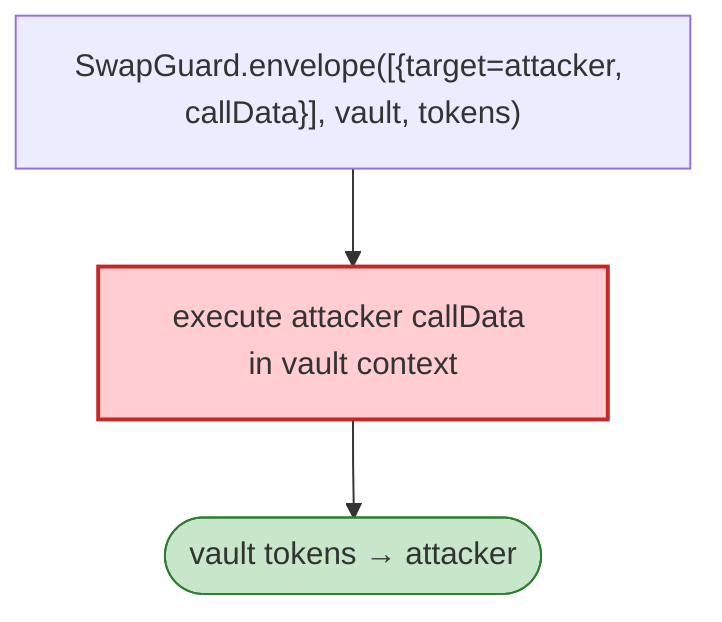

# CowSwap `SwapGuard` Exploit — `envelope` Interaction Target Unvalidated

> **Reproduction:** the PoC compiles & runs in an isolated Foundry project at
> [this project folder](.). Full verbose trace: [output.txt](output.txt).
> Verified vulnerable source: [SwapGuard](sources/SwapGuard_cD07a7),
> [GPv2Settlement](sources/GPv2Settlement_9008D1).

---

## Key info

| | |
|---|---|
| **Loss** | user tokens drained via the `SwapGuard` interaction envelope; tx `0x90b46860…` |
| **Vulnerable contract** | `SwapGuard` `0xcD07a7…`, `GPv2Settlement` `0x9008D1…` |
| **Chain / block / date** | Ethereum mainnet / Feb 2023 |
| **Bug class** | Trust boundary — `SwapGuard.envelope(Data[]{target, value, callData}, vault, tokens, …)` executed caller-supplied `target`/`callData`, draining vault-approved tokens. |

---

## TL;DR

The `SwapGuard.envelope` took a list of `Data{target, value, callData}` interactions and executed them
against an arbitrary `target`. With no target whitelist and the vault having token approvals, an
attacker-crafted interaction moved vault tokens to the attacker. `MevRefund`/`peckshield` analyses are
cited.

---

## Root cause

A **caller-trusted interaction target** (`target`/`callData`) on a path that moves approved tokens.

---

## Diagrams



---

## Remediation

1. Whitelist `target`; verify post-interaction balances; bind `tokens` in/out.

---

## How to reproduce

```bash
_shared/run_poc.sh 2023-02-CowSwap_exp -vvvvv
```

- RPC: mainnet archive. Result: `[PASS]` — vault tokens routed via crafted interactions.

---

*Reference: CowSwap SwapGuard unvalidated interaction target, mainnet, Feb 2023.*
