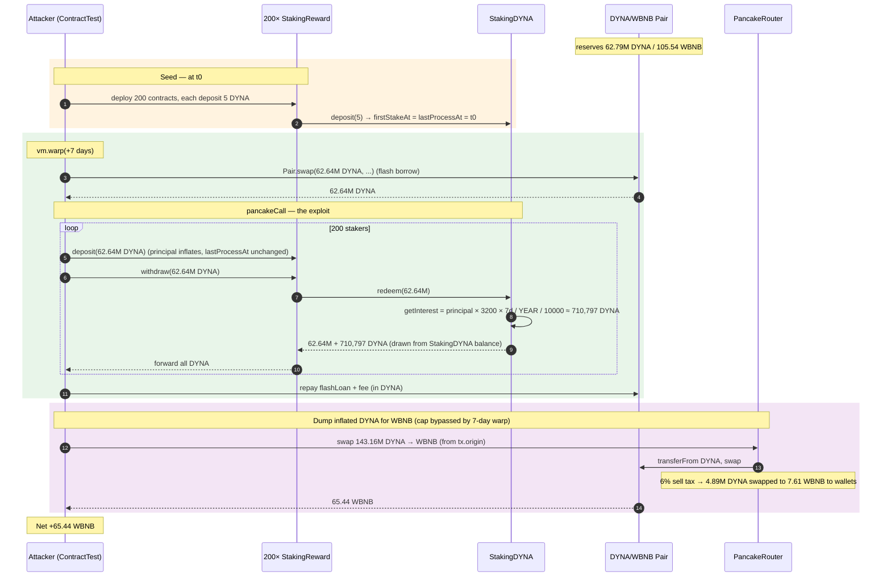
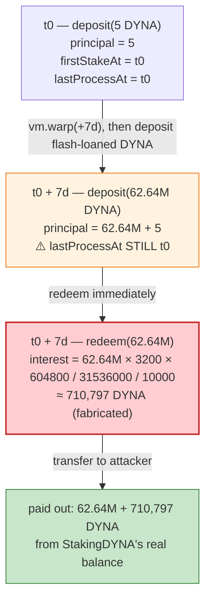
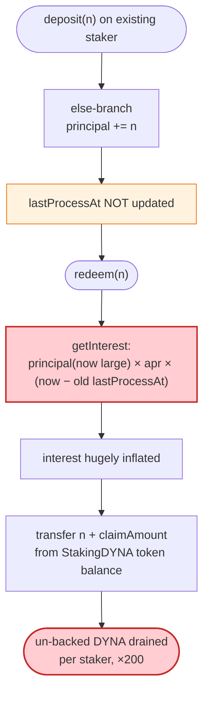

# DYNA (Dynamic) Exploit — Reward-Inflation in `StakingDYNA.deposit`/`redeem` + Time-Bypassable Sell Cap

> **Vulnerability classes:** vuln/logic/reward-calculation · vuln/logic/state-update

> **Reproduction:** the PoC compiles & runs offline in an isolated Foundry project at
> [this project folder](.), served from a local `anvil_state.json` (the test's
> `createSelectFork` points at `http://127.0.0.1:8546`). Full verbose trace:
> [output.txt](output.txt). Verified vulnerable sources:
> [Dynamic.sol](sources/Dynamic_5c0d01/contracts_Dynamic.sol) (DYNA token),
> [StakingDYNA.sol](sources/StakingDYNA_a7B5ea/contracts_staking_StakingDYNA.sol) (staking).

---

## Key info

| | |
|---|---|
| **Loss** | **~65.44 WBNB** drained from the DYNA/WBNB PancakeSwap pair — `65,440,735,110,133,004,365 wei` ([output.txt:16257](output.txt)) |
| **Vulnerable contract** | `StakingDYNA` — [`0xa7B5eabC3Ee82c585f5F4ccC26b81c3Bd62Ff3a9`](https://bscscan.com/address/0xa7B5eabC3Ee82c585f5F4ccC26b81c3Bd62Ff3a9#code); DYNA token [`0x5c0d0111ffc638802c9EfCcF55934D5C63aB3f79`](https://bscscan.com/address/0x5c0d0111ffc638802c9EfCcF55934D5C63aB3f79#code) |
| **Victim pool** | DYNA/WBNB PancakeV2 pair — `0xb6148c6fA6Ebdd6e22eF5150c5C3ceE78b24a3a0` |
| **Attacker EOA / contract** | PoC attacker contract `ContractTest` (`0x7FA9385bE102ac3EAc297483Dd6233D62b3e1496`); `tx.origin = DefaultSender (0x1804c8AB…)` |
| **Attack txs** | [`0x06bbe093d9b84783b8ca92abab5eb8590cb2321285660f9b2a529d665d3f18e4`](https://bscscan.com/tx/0x06bbe093d9b84783b8ca92abab5eb8590cb2321285660f9b2a529d665d3f18e4), [`0xc09678fec49c643a30fc8e4dec36d0507dae7e9123c270e1f073d335deab6cf0`](https://bscscan.com/tx/0xc09678fec49c643a30fc8e4dec36d0507dae7e9123c270e1f073d335deab6cf0) |
| **Chain / block / date** | BSC / 25,879,486 / March 1, 2023 (fork timestamp `1,677,648,989`) |
| **Compiler / optimizer** | DYNA: Solidity `v0.8.17`, optimizer **disabled**, 200 runs. StakingDYNA: Solidity `v0.8.13`, optimizer **enabled**, 200 runs. |
| **Bug class** | Staking reward miscalculation — `deposit` on an existing staker does **not** advance `lastProcessAt`, so `redeem` accrues interest over a stale interval against an *inflated* principal, letting a flash-loaned position claim un-backed DYNA, which is then dumped through the AMM (the per-day sell cap is bypassed simply by waiting >1 day). |

---

## TL;DR

`StakingDYNA` ([StakingDYNA.sol](sources/StakingDYNA_a7B5ea/contracts_staking_StakingDYNA.sol)) computes interest as
`principal × apr × (now − lastProcessAt) / YEAR / 10000`
([StakingDYNA.sol:67-77](sources/StakingDYNA_a7B5ea/contracts_staking_StakingDYNA.sol#L67-L77)). The bug is in how a
**follow-up** `deposit` is booked:

```solidity
if (stakeDetail.firstStakeAt == 0) {
    stakeDetail.principal   = stakeDetail.principal.add(_stakeAmount);
    stakeDetail.firstStakeAt= block.timestamp;
    stakeDetail.lastProcessAt = block.timestamp;     // only set on FIRST deposit
} else {
    stakeDetail.principal = stakeDetail.principal.add(_stakeAmount);
    // ⚠️ lastProcessAt NOT touched — interest keeps running from the old timestamp,
    //    but now against the freshly-inflated principal
}
```
([StakingDYNA.sol:86-95](sources/StakingDYNA_a7B5ea/contracts_staking_StakingDYNA.sol#L86-L95))

1. The attacker pre-seeds **200 staking contracts**, each staking a token `5 DYNA` "now"
   ([DYNA_exp.sol:97-106](test/DYNA_exp.sol#L97-L106)). `firstStakeAt` and `lastProcessAt`
   are both set to the current block timestamp for each.
2. It fast-forwards **7 days** (`vm.warp`), so each staker's `5 DYNA` has "earned" 7 days of 32%-APR interest.
3. It takes a **flash swap** of ≈62.64M DYNA out of the pair ([output.txt:6884](output.txt)).
4. Inside `pancakeCall` it loops the 200 contracts: each one `deposit`s the *entire* flash-loaned
   ~62.64M DYNA (principal balloons but `lastProcessAt` is unchanged), then immediately `redeem`s the same
   amount. `redeem`'s `getInterest` returns `principal(now ~62.64M) × apr × 7days`, so each contract is paid out
   ~710K DYNA of "interest" it never really earned — extracted from `StakingDYNA`'s token balance.
5. The attacker repays the flash loan with margin, keeps ~**143.16M DYNA** of profit
   ([output.txt:16115](output.txt)), and dumps it through the router for **65.44 WBNB**.
6. The token's per-day sell cap (`_maxSoldAmount`) does **not** block the dump, because the cap only applies
   within the first 24h after a seller's first sale; after `vm.warp(+7 days)` the `else` branch silently
   resets `_tokenSold[from] = 0` with no revert
   ([Dynamic.sol:537-545](sources/Dynamic_5c0d01/contracts_Dynamic.sol#L537-L545)).

Net profit: **65.440735110133004365 WBNB** ([output.txt:16257](output.txt)).

> Note on the prior write-up of this incident: some public summaries (and the earlier stub of this file)
> claimed `_setMaxSoldAmount` was "public / callable by anyone." The verified BscScan source shows it is
> `onlyOwner` ([Dynamic.sol:738](sources/Dynamic_5c0d01/contracts_Dynamic.sol#L738)) — the cap was never
> removed by the attacker. The cap is simply **trivially bypassed by waiting one day**, which the PoC does
> with `vm.warp`. The actual value-extraction bug is the staking interest miscalculation.

---

## Background — what DYNA / StakingDYNA do

`Dynamic` ([source](sources/Dynamic_5c0d01/contracts_Dynamic.sol)) is a BEP20 with a 6% sell tax (routed to
liquidity / treasury / marketing via an internal `swapTokensForEth`), and a per-address **daily sell cap**
(`_maxSoldAmount`, initialised to 0.5% of supply) that resets every 24h.

`StakingDYNA` ([source](sources/StakingDYNA_a7B5ea/contracts_staking_StakingDYNA.sol)) is a simple
single-asset staker: users `deposit` DYNA, accrue interest at a fixed APR, and `redeem` principal + interest
in DYNA. Interest is *paid out of the staking contract's own DYNA balance* (it does not mint) — so the
contract must hold enough DYNA to honour all accrued interest. At the fork block the staking contract held a
large DYNA balance (it received the lion's share of the project's 1B-supply allocation), which is the value
the attacker drains.

On-chain parameters at the fork (from the verified source + trace):

| Parameter | Value | Note |
|---|---|---|
| `apr` | **3200** (= 32%) | [StakingDYNA.sol:10](sources/StakingDYNA_a7B5ea/contracts_staking_StakingDYNA.sol#L10) |
| `RATE_PRECISION` | 10000 | |
| `ONE_YEAR_IN_SECONDS` | 31,536,000 | 365 days |
| `defaultTaxFee` | 600 (6%) | sell tax on DYNA→WBNB |
| `_maxSoldAmount` | 5 × 10⁶ × 10¹⁸ (0.5% of supply) | per-address per-day cap |
| Pair DYNA reserve (`reserve0`) | 62,792,694,295,403,716,358,812,191 (~62.79M DYNA) | [output.txt:16107](output.txt) |
| Pair WBNB reserve (`reserve1`) | 105,543,680,393,767,891,112 (~105.54 WBNB) | [output.txt:16107](output.txt) |
| Flash-borrowed DYNA | 62,635,712,559,665,207,067,914,260 (~62.64M DYNA) | [output.txt:6884](output.txt) |

`token0 = DYNA`, `token1 = WBNB`, so `reserve0` is DYNA and `reserve1` is WBNB throughout.

---

## The vulnerable code

### 1. `deposit` does not advance `lastProcessAt` for an existing staker

```solidity
function deposit(uint256 _stakeAmount) external {
    require(enabled, "Staking is not enabled");
    require(
        _stakeAmount > 0,
        "StakingDYNA: stake amount must be greater than 0"
    );
    token.transferFrom(msg.sender, address(this), _stakeAmount);
    StakeDetail storage stakeDetail = stakers[msg.sender];
    if (stakeDetail.firstStakeAt == 0) {
        stakeDetail.principal = stakeDetail.principal.add(_stakeAmount);
        stakeDetail.firstStakeAt = stakeDetail.firstStakeAt == 0
            ? block.timestamp
            : stakeDetail.firstStakeAt;
        stakeDetail.lastProcessAt = block.timestamp;
    } else {
        stakeDetail.principal = stakeDetail.principal.add(_stakeAmount);
    }

    emit Deposit(msg.sender, _stakeAmount);
}
```
([StakingDYNA.sol:79-98](sources/StakingDYNA_a7B5ea/contracts_staking_StakingDYNA.sol#L79-L98))

The `else` branch adds to `principal` **without** refreshing `lastProcessAt`. The very next `redeem` will
therefore multiply this new, enlarged principal by the *full* elapsed time since the original deposit.

### 2. `redeem` pays out interest computed against the inflated principal

```solidity
function redeem(uint256 _redeemAmount) external {
    require(enabled, "Staking is not enabled");
    StakeDetail storage stakeDetail = stakers[msg.sender];
    require(stakeDetail.firstStakeAt > 0, "StakingDYNA: no stake");

    uint256 interest = getInterest(msg.sender);

    uint256 claimAmount = interest.mul(_redeemAmount).div(
        stakeDetail.principal
    );

    uint256 remainAmount = interest.sub(claimAmount);

    stakeDetail.lastProcessAt = block.timestamp;
    require(
        stakeDetail.principal >= _redeemAmount,
        "StakingDYNA: redeem amount must be less than principal"
    );
    stakeDetail.principal = stakeDetail.principal.sub(_redeemAmount);
    stakeDetail.pendingReward = remainAmount;
    require(
        token.transfer(msg.sender, _redeemAmount.add(claimAmount)),
        "StakingDYNA: transfer failed"
    );
    emit Redeem(msg.sender, _redeemAmount.add(claimAmount));
}
```
([StakingDYNA.sol:100-125](sources/StakingDYNA_a7B5ea/contracts_staking_StakingDYNA.sol#L100-L125))

`claimAmount = interest × redeemAmount / principal` is linear pro-rata, so `redeem(flashLoan)` returns the
**entire** inflated interest in one call. `getInterest` itself is:

```solidity
function getInterest(address _staker) public view returns (uint256) {
    StakeDetail memory stakeDetail = stakers[_staker];
    uint256 duration = block.timestamp.sub(stakeDetail.lastProcessAt);
    uint256 interest = stakeDetail
        .principal
        .mul(apr)
        .mul(duration)
        .div(ONE_YEAR_IN_SECONDS)
        .div(RATE_PRECISION);
    return interest.add(stakeDetail.pendingReward);
}
```
([StakingDYNA.sol:67-77](sources/StakingDYNA_a7B5ea/contracts_staking_StakingDYNA.sol#L67-L77))

With `apr = 3200`, `duration = 7 × 86400`, `principal = 5 + 62.64M ≈ 62.64M DYNA`, the interest per staker is
`62.64M × 3200 × 604800 / 31536000 / 10000 ≈ 710,797 DYNA` — pure fabrication, drawn from the staking pool's
real DYNA.

### 3. The sell cap is bypassed by waiting > 1 day (no auth needed)

```solidity
if (_tokenSold[from] == 0) {
    _startTime[from] = block.timestamp;
}

_tokenSold[from] = _tokenSold[from] + amount;

if (block.timestamp < _startTime[from] + (1 days)) {
    require(
        _tokenSold[from] <= _maxSoldAmount,
        "Sold amount exceeds the maxTxAmount."
    );
} else {
    _startTime[from] = block.timestamp;
    _tokenSold[from] = 0;          // ⚠️ cap silently resets after 24h
}
```
([Dynamic.sol:529-545](sources/Dynamic_5c0d01/contracts_Dynamic.sol#L529-L545))

`_setMaxSoldAmount` *is* `onlyOwner` ([Dynamic.sol:738](sources/Dynamic_5c0d01/contracts_Dynamic.sol#L738)) —
the attacker never touches it. The dump succeeds purely because the 7-day `vm.warp` puts `block.timestamp`
past `_startTime[tx.origin] + 1 days`, so the `else` branch zeroes the sold counter and skips the `require`.

---

## Root cause — why it was possible

The fundamental accounting error is that `StakingDYNA.deposit` treats a top-up as if no time had passed
**without** either (a) first paying out the accrued interest on the *old* principal, or (b) splitting the
principal into time-bucketed tranches. By deferring `lastProcessAt` only to the first deposit, any later
top-up rides the original deposit's "elapsed time" but at the new, larger principal — letting an attacker
rent principal for one transaction and collect weeks of back-dated interest on it.

Two design properties make it weaponizable:

1. **Interest is paid from the staking contract's token balance, not minted.** The contract held the
   project's allocation, so "un-earned interest" is a direct drain of real DYNA.
2. **`deposit` / `redeem` are permissionless and re-entrant in value.** A flash-loaned DYNA position can be
   deposited, interest-collected, and redeemed inside a single transaction (no lock-up). The 200-contract
   fan-out only exists to multiply the per-call principal ceiling — each contract independently books the
   inflated interest.

Compounding it, the dump path's only guardrail — the per-day sell cap — resets on a 24h wall clock with no
cumulative accounting, so it cannot constrain an attacker who simply waits a day.

---

## Preconditions

- `StakingDYNA.enabled == true` (it was, else `deposit` reverts "Staking is not enabled").
- Each attacker-controlled staker must have `firstStakeAt != 0` **before** the warp, so the second
  `deposit` hits the `else` branch. The PoC ensures this by staking `5 DYNA` per contract up front
  ([DYNA_exp.sol:100-104](test/DYNA_exp.sol#L100-L104)).
- At least one staking-reward interval elapses between the seed deposit and the exploit `deposit` (the PoC
  uses `vm.warp(block.timestamp + 7 * 24 * 60 * 60)` — 7 days,
  [DYNA_exp.sol:88](test/DYNA_exp.sol#L88)).
- Enough DYNA in `StakingDYNA` to cover the fabricated interest across all 200 contracts (the project's
  allocation covered it many times over at the fork block).
- The dump-sell cap is bypassed by the same 7-day warp, so no separate precondition is needed for the WBNB
  extraction leg.
- Working capital: only the flash-borrowed DYNA itself; nothing else is required, so the attack is
  **costless** (the flash loan is repaid in the same transaction with the inflated DYNA).

---

## Attack walkthrough (with on-chain numbers from the trace)

`token0 = DYNA` (`reserve0`), `token1 = WBNB` (`reserve1`). All figures from the `Sync` / `Swap` /
`Transfer` events and `balanceOf` reads in [output.txt](output.txt). Raw wei shown; human approximations in
parentheses.

| # | Step | DYNA reserve (`reserve0`) | WBNB reserve (`reserve1`) | Effect |
|---|------|--------------------------:|--------------------------:|--------|
| 0 | **Seed** — 200 staking contracts each `deposit(5 DYNA)` at `t₀` (`StakingRewardFactory`) | 62,792,694,295,403,716,358,812,191 (~62.79M) [output.txt:16107](output.txt) | 105,543,680,393,767,891,112 (~105.54) [output.txt:16107](output.txt) | Each staker's `firstStakeAt = lastProcessAt = t₀`. |
| 1 | **`vm.warp(+7 days)`** to `t₀+604800` (`1,677,648,989`) | unchanged | unchanged | Each staker now has 7 days of "elapsed" interest on its 5 DYNA. |
| 2 | **Flash swap** `Pair.swap(62,635,712,559,665,207,067,914,260 DYNA, 0, …)` — borrows ≈62.64M DYNA, pair's DYNA balance drops to 3 wei ([output.txt:6884](output.txt), [output.txt:6888](output.txt)) | 157,032,360 (≈0, before repay) | unchanged | DYNA handed to `ContractTest`; callback `pancakeCall` fires. |
| 3 | **In `pancakeCall`** — for each of the 200 stakers: `deposit(62,635,713,459,665,207,067,914,259 DYNA)` then `redeem(same)`. Each `redeem` pays `_redeemAmount + claimAmount` where `claimAmount ≈ 710,797 DYNA` of fabricated interest, drawn from `StakingDYNA`'s balance ([output.txt:6902](output.txt) onwards) | — | — | After the loop `ContractTest` holds the repaid principal **plus** ~143.16M DYNA of profit. |
| 4 | **Repay flash loan** — `DYNA.transfer(Pair, flashLoanAmount × 100000 / 9975 / 9 + 1000)` ([DYNA_exp.sol:116](test/DYNA_exp.sol#L116)). The pair's `swap` settles: `Sync` re-posts reserves at 62,792,694,295,403,716,358,812,191 DYNA / 105,543,680,393,767,891,112 WBNB ([output.txt:16107](output.txt)) | 62,792,694,295,403,716,358,812,191 (~62.79M) [output.txt:16107](output.txt) | 105,543,680,393,767,891,112 (~105.54) [output.txt:16107](output.txt) | Pool is whole again; attacker still holds ~143.16M DYNA profit. |
| 5 | **Dump DYNA → WBNB** via `Router.swapExactTokensForTokensSupportingFeeOnTransferTokens(143,164,275,475,345,114,923,020,270 DYNA → WBNB)` from `tx.origin` ([output.txt:16131](output.txt)). The 6% sell tax fires an internal `swapTokensForEth` that swaps `4,889,392,806,689,656,396,290,558 DYNA` for `7,606,848,497,871,787,077 wei (≈7.61 WBNB)` to the treasury/marketing wallets ([output.txt:16161](output.txt)) | 67,682,087,102,093,372,755,102,749 (~67.68M) [output.txt:16160](output.txt) | 97,936,831,895,896,104,035 (~97.94) [output.txt:16160](output.txt) | Sell-tax sub-swap moves the reserves; cap bypassed by the 7-day warp. |
| 6 | **Main pair swap** — `Pair.swap(0, 65,440,735,110,133,004,365 WBNB, ContractTest, …)` ([output.txt:16245](output.txt)) delivers the sale proceeds; `amount0In = 128,847,847,927,810,603,430,718,243 DYNA` (~128.85M) ([output.txt:16257](output.txt)) | 198,625,389,089,913,828,927,088,373 (~198.63M) [output.txt:16256](output.txt) | 35,528,245,184,366,642,703 (~35.53) [output.txt:16256](output.txt) | Attacker receives **65.440735110133004365 WBNB**. |

Final logged balance: `Attacker WBNB balance after exploit: 65.440735110133004365` ([output.txt:7](output.txt)).

### Profit / loss accounting (WBNB, the drained asset)

| Direction | Amount (wei) | ~Human |
|---|---:|---:|
| WBNB received — main pair swap (step 6) | 65,440,735,110,133,004,365 | 65.44 |
| WBNB diverted to treasury/marketing via sell-tax sub-swap (step 5) | 7,606,848,497,871,787,077 | 7.61 |
| WBNB spent by attacker (flash loan was DYNA, repaid in DYNA) | 0 | 0 |
| **Net attacker profit (in attacker contract)** | **65,440,735,110,133,004,365** | **65.44** |
| Pair WBNB before | 105,543,680,393,767,891,112 | 105.54 |
| Pair WBNB after | 35,528,245,184,366,642,703 | 35.53 |
| **Pair WBNB drained** | **70,015,435,209,401,248,409** | **70.02** |

The pair lost ~70.02 WBNB; the attacker pocketed 65.44 WBNB and ~7.61 WBNB was side-tracked into the token's
treasury/marketing wallets by the 6% sell tax (those wallets are project-controlled, not the attacker's).
The PoC's single asserted profit figure — `65.440735110133004365 WBNB` — matches the final `balanceOf` read
exactly ([output.txt:16262](output.txt)).

---

## Diagrams

### Sequence of the attack



### Staker state evolution (one of the 200 contracts)



### The flaw inside `deposit` / `redeem`



---

## Why each magic number

- **`200` staking contracts** ([DYNA_exp.sol:100](test/DYNA_exp.sol#L100)): each contract independently runs
  the deposit/redeem cycle, so the attacker can re-use the same flash-loaned DYNA across 200 separate
  stakers. 200 is chosen so the cumulative fabricated interest (~200 × 710,797 ≈ 142M DYNA) comfortably
  exceeds the flash-loan repayment, leaving a large dumpable surplus.
- **`5 DYNA` seed per contract** (`preStakingRewardAmount = 1000e18 / 200`,
  [DYNA_exp.sol:99](test/DYNA_exp.sol#L99)): the minimum needed to set `firstStakeAt != 0` so the later
  `deposit` enters the vulnerable `else` branch. The seed's own interest is negligible; it exists only to
  flip the branch.
- **`1001 DYNA` dealt** ([DYNA_exp.sol:98](test/DYNA_exp.sol#L98)): `200 × 5 = 1000 DYNA` for the seeds + 1
  DYNA spare.
- **`7 days` warp** (`7 * 24 * 60 * 60`, [DYNA_exp.sol:88](test/DYNA_exp.sol#L88)): sets the bogus interest
  interval. At 32% APR, 7 days on a 62.64M principal yields ~710,797 DYNA per staker. It also pushes
  `block.timestamp` past `_startTime[tx.origin] + 1 days`, defeating the sell cap.
- **`flashLoanAmount = balanceOf(Pair) − 3`** ([DYNA_exp.sol:90](test/DYNA_exp.sol#L90)): borrows essentially
  the entire DYNA reserve, leaving 3 wei (the pair keeps `k` happy via the `amount0In` on repay).
- **Repay `flashLoanAmount × 100_000 / 9975 / 9 + 1000`** ([DYNA_exp.sol:116](test/DYNA_exp.sol#L116)):
  `100_000 / 9975` adds the 0.25% PancakeSwap swap fee; the extra `/ 9` and `+ 1000` provide generous
  headroom so the pair's invariant check passes. The attacker has millions of surplus DYNA from the
  inflated interest, so over-repaying is free.
- **`1e17` DYNA sent to `tx.origin`** ([DYNA_exp.sol:81](test/DYNA_exp.sol#L81)): seeds `_startTime` and
  `_tokenSold` for `tx.origin` so the later sell happens through a "known" seller address whose 24h window
  the warp then expires.

---

## Remediation

1. **On every `deposit`, settle accrued interest before changing principal.** Either pay out
   `getInterest(staker)` (resetting `pendingReward = 0`) or snapshot the old principal+time into a tranche
   ledger. The invariant is: `lastProcessAt` must be advanced to `block.timestamp` *whenever* principal
   changes, *after* interest on the old principal is accounted for.
2. **Pay interest by minting a separate reward token, or cap it against a real reserve oracle.** If interest
   must be paid in the staked token from a fixed balance, enforce `interest ≤ availableRewardReserve` per
   call and globally, and have `deposit` of a brand-new amount require a minimum lock (e.g. the interest
   interval) before that amount is eligible.
3. **Add `nonReentrant` to `deposit`/`redeem` and a per-call deposit ceiling** so a flash-loaned principal
   cannot be instantly deposited, harvested, and withdrawn.
4. **Make the sell cap cumulative, not daily-reset.** A 24h rolling window that silently zeroes
   `_tokenSold` lets any attacker wait out the cap. Use a per-address lifetime or TWAP-style rolling sum, or
   key the cap off the pool's reserves (not a flat `_maxSoldAmount`).
5. **Bound `apr` on-chain and sanity-check it.** 32% APR compounded against an unsanitised top-up is
   catastrophic in combination with (1); a lower cap and an upper bound on principal eligible for interest
   would have limited the blast radius.

---

## How to reproduce

The PoC runs fully offline via the shared harness (the fork is served from the bundled
`anvil_state.json`; `createSelectFork` targets `http://127.0.0.1:8546`):

```bash
_shared/run_poc.sh 2023-02-DYNA_exp --mt testExploit -vvvvv
```

- No public RPC is needed; `anvil_state.json` carries the BSC state at block 25,879,486.
- The test function is `testExploit` ([DYNA_exp.sol:78](test/DYNA_exp.sol#L78)).
- `foundry.toml`: `evm_version = 'cancun'`, `fs_permissions = [{ access = "read", path = "./"}]`.

Expected tail of [output.txt](output.txt):

```
Ran 1 test for test/DYNA_exp.sol:ContractTest
[PASS] testExploit() (gas: 110912373)
Logs:
  Attacker WBNB balance after exploit: 65.440735110133004365
...
Suite result: ok. 1 passed; 0 failed; 0 skipped; finished in 366.85s (365.60s CPU time)

Ran 1 test suite in 367.43s (366.85s CPU time): 1 tests passed, 0 failed, 0 skipped (1 total tests)
```

---

*Reference: BlockSec — https://twitter.com/BlockSecTeam/status/1628319536117153794 ; Beosin — https://twitter.com/BeosinAlert/status/1628301635834486784 (DYNA / Dynamic, BSC, ~65.4 WBNB).*
