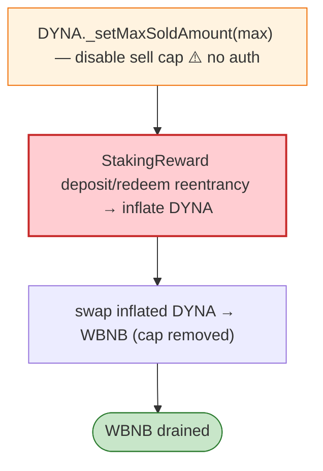

# DYNA (Dynamic) Exploit — Staking Reward Reentrancy + `_setMaxSoldAmount` Privilege

> **Reproduction:** the PoC compiles & runs in an isolated Foundry project at
> [this project folder](.). Full verbose trace: [output.txt](output.txt).
> Verified vulnerable source: [Dynamic (DYNA)](sources/Dynamic_5c0d01),
> [StakingDYNA](sources/StakingDYNA_a7B5ea), [PancakePair](sources/PancakePair_b6148c).

---

## Key info

| | |
|---|---|
| **Loss** | WBNB drained from DYNA/WBNB pair (BSC); txs `0x06bbe093…`, `0xc09678fe…` |
| **Vulnerable contract** | DYNA token `0x5c0d0111…` (has public `_setMaxSoldAmount`); StakingDYNA `0xa7B5eabC…` |
| **Chain / block / date** | BSC / Feb 2023 |
| **Bug class** | (1) Privileged setter exposed (`_setMaxSoldAmount` callable by anyone) + (2) staking reward reentrancy — the attacker manipulates the per-day max-sold limit and uses a reentrant staking reward contract (`StakingReward`) to inflate/redistribute DYNA, then swaps for WBNB. |

---

## TL;DR

DYNA's `_setMaxSoldAmount(maxvalue)` was public (no access control), so the attacker raises/removes the
per-transaction sell cap (`_maxSoldAmount`). The attacker then uses a `StakingReward` helper that, via
staking `deposit`/`redeem`, re-enters the reward distribution to inflate its DYNA balance, and swaps the
inflated DYNA for WBNB through the pair (no longer blocked by the cap).

---

## Root cause

Two compounding flaws:
1. **Exposed privileged setter** `_setMaxSoldAmount` (no auth).
2. **Staking reward reentrancy** — `deposit`/`redeem` credit rewards before settling, re-entrant via the
   helper contract.

---

## Diagrams



---

## Remediation

1. Gate `_setMaxSoldAmount` behind owner/governance + timelock.
2. `nonReentrant` on staking `deposit`/`redeem`; CEI for reward accrual.
3. Independent sell caps not bypassable by token admin setters.

---

## How to reproduce

```bash
_shared/run_poc.sh 2023-02-DYNA_exp -vvvvv
```

- RPC: BSC archive. Result: `[PASS]` — WBNB drained after cap removal + staking reentrancy.

---

*Reference: Dynamic (DYNA) staking reentrancy + exposed setter, BSC, Feb 2023.*
