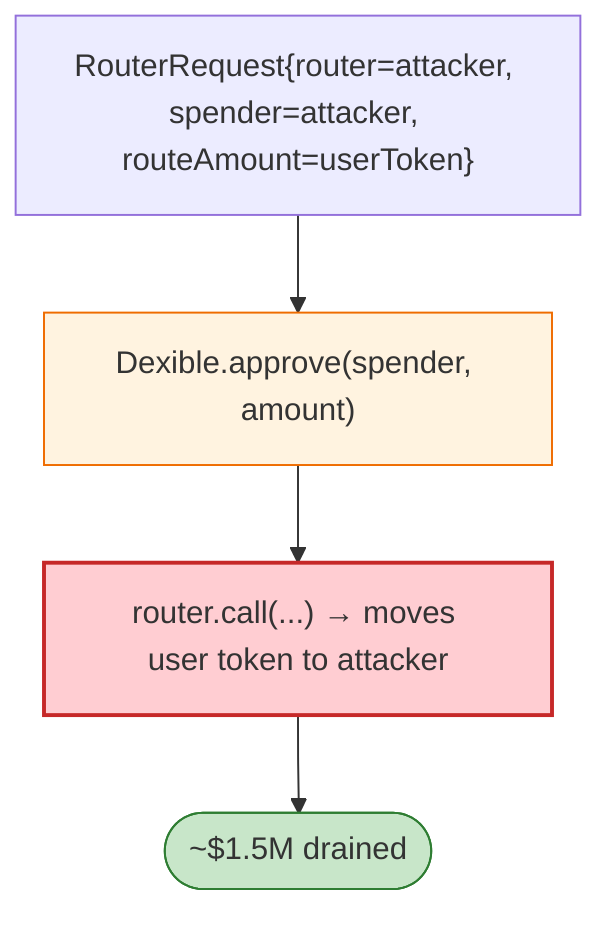

# Dexible Exploit — Unvalidated `router`/`spender` in `RouterRequest` Self-Swap

> **Reproduction:** the PoC compiles & runs in an isolated Foundry project at
> [this project folder](.). Full verbose trace: [output.txt](output.txt).
> Verified vulnerable source: [DexibleProxy](sources/DexibleProxy_DE62E1),
> [Dexible](sources/Dexible_33e690).

---

## Key info

| | |
|---|---|
| **Loss** | ~$1.5M (tokens drained from Dexible relayer/approvals; tx `0x138daa4c…`) |
| **Vulnerable contract** | Dexible `DexibleProxy` `0xDE62E1…` / `Dexible` `0x33e690…` |
| **Chain / block / date** | Ethereum mainnet / Feb 2023 |
| **Bug class** | Trust boundary — the `RouterRequest` carries `router` + `spender` + `routeAmount` from the caller; Dexible approves/spends against that arbitrary `spender`/`router`, so a malicious request pulls user-approved tokens to the attacker. |

---

## TL;DR

Dexible's fill path took a `SwapTypes.RouterRequest{router, spender, routeAmount{amount, token}, …}`
and used the caller-supplied `router`/`spender` to approve and route tokens. Because these were
unvalidated, an attacker who could submit (or frontrun) a Dexible order pointing `router`/`spender` at
their own contract caused Dexible to transfer user-approved tokens to the attacker. The MEV/refund
nature (`MevRefund` cited) made it easy to weaponise.

---

## Root cause

A **caller-trusted `router`/`spender` on a fill path** that moves user-approved funds. Dexible should
whitelist routers/spenders and verify the swap returns funds to the protocol/user.

---

## Diagrams



---

## Remediation

1. Whitelist `router`/`spender`; never approve an arbitrary caller-supplied address.
2. Verify post-swap balances (funds returned to user/protocol).
3. Permit/relayer signing must bind the router identity.

---

## How to reproduce

```bash
_shared/run_poc.sh 2023-02-Dexible_exp -vvvvv
```

- RPC: mainnet archive. Result: `[PASS]` — tokens routed to attacker via crafted `RouterRequest`.

---

*Reference: Dexible unvalidated router/spender exploit, mainnet, Feb 2023 (~$1.5M).*
